# Mini Project: PetTech × DevTools

พัฒนาระบบที่แก้ปัญหาเกี่ยวกับสัตว์เลี้ยง และสาธิตกระบวนการพัฒนาตั้งแต่การจัดการ Source Code, Build, Test, Deploy จนถึงการตรวจสอบการทำงานของระบบด้วยเครื่องมือที่เรียนในรายวิชา

[← README หลักและกำหนดการ](../readme.md)

> **หลักการกลาง:** ทุกสิ่งที่ทีมเสนอว่า “ระบบทำได้” จะกลายเป็น Acceptance Criteria ที่ต้อง Implementation และ Demonstrate ได้จริงจากรุ่นที่ส่ง

## เส้นทางของเอกสาร

| ออกแบบและสร้าง | พิสูจน์และประเมิน | นำเสนอและส่งมอบ |
|---|---|---|
| [1. มาตรฐานผลงาน](#standards) | [4. Proposal → Verification](#traceability) | [5. การนำเสนอ](#presentation) |
| [2. ระบบและ System Design](#system-design) | [6. Evaluation Matrix](#evaluation) | [8. การใช้ AI](#ai-tools) |
| [3. Course Container](#course-container) | [7. มิติการประเมิน](#evaluation-dimensions) | [9. แนวทางตรวจ](#verification-guide) · [10. Checklist](#submission-checklist) |

| Proposal | Implementation | Verification |
|---|---|---|
| ระบุปัญหา ผู้ใช้ Requirement และผลที่รับปาก | สร้างระบบจริงให้ทุกองค์ประกอบทำงานร่วมกัน | ตรวจจาก Acceptance Criteria และบันทึกผลจริง/Defect |

---

## 1. เป้าหมายและมาตรฐานของผลงาน

ผลงานต้องตอบได้อย่างเป็นเหตุเป็นผลว่า:

1. ปัญหาคืออะไร เกิดกับใคร ในบริบทใด และมีหลักฐานใดยืนยันว่าควรแก้ไข
2. ทีมเสนอ Solution, Use Case, Feature และผลลัพธ์อะไรไว้ และระบบทำได้จริงตรงตามนั้นหรือไม่
3. สถาปัตยกรรมและ DevTools ทำให้ระบบ Build, Test, Deploy, Operate และกู้คืนได้อย่างไร

ระบบควรมีคุณภาพใกล้เคียง Production ภายในขอบเขตของ Mini Project: ผู้ใช้สามารถทำงานหลักได้จริง ข้อมูลถูกต้องและคงอยู่ องค์ประกอบเชื่อมต่อกันได้ รับมือกับกรณีผิดพลาดที่สำคัญ และสามารถส่งมอบซ้ำได้ ไม่ใช่เพียง Prototype, Mockup หรือหน้าจอที่แสดงผลได้

หัวข้ออาจเป็นระบบดูแลสุขภาพสัตว์เลี้ยง การนัดหมาย การติดตามสัตว์สูญหาย การหาบ้านหรือพี่เลี้ยง หรือแนวคิดอื่นภายใต้ธีม PetTech การเลือกเทคโนโลยีและรูปแบบ Implementation เป็นอิสระ ตราบใดที่ตอบ Requirement และพิสูจน์การทำงานได้

**Generated Image 1 — ทีมพัฒนาและทดสอบระบบให้พร้อมใช้งานจริง**

**Diagram 1 — จากปัญหาสู่ผลลัพธ์ที่พิสูจน์ได้**

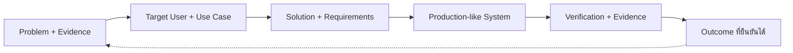

---

## 2. ระบบที่ทุกกลุ่มต้องส่งมอบ

### 2.1 องค์ประกอบหลักที่จำเป็น

กำหนดเฉพาะองค์ประกอบหลักต่อไปนี้ รายละเอียดการออกแบบให้แต่ละกลุ่มตัดสินใจตามบริบทของระบบ

1. **Requirement และ Acceptance Criteria ที่ตรวจสอบได้** — ระบุ Problem, Target User, Use Case, Feature, ผลลัพธ์ที่คาดหวัง และเงื่อนไขที่ใช้ตัดสินว่าทำสำเร็จอย่างชัดเจน
2. **ระบบที่ใช้งานได้จริง** — มี Web Interface, Database และ Backend/Service ที่เหมาะกับโครงการ โดยเส้นทางหลักต้องทำงานแบบ End-to-End
3. **Git และ GitHub** — ใช้จัดการเวอร์ชัน การทำงานร่วมกัน และการทบทวนการเปลี่ยนแปลงอย่างเหมาะสม พร้อมป้องกัน Secret และข้อมูลอ่อนไหว
4. **Docker และ Docker Compose** — ระบบและ Dependency ที่จำเป็นถูกบรรจุและเชื่อมต่อกันอย่างทำซ้ำได้ แยก Configuration และข้อมูลที่ต้องคงอยู่ออกจาก Image อย่างเหมาะสม
5. **Jenkins CI/CD และ Automated Verification** — Pipeline ตรวจสอบ Build และ Deploy หลังเกิดการเปลี่ยนแปลงโค้ด พร้อมยืนยันผลหลัง Deploy ได้ ขั้นตอนย่อยปรับได้ตามสถาปัตยกรรม
6. **System Design, Integration และ Operability** — ออกแบบองค์ประกอบให้รองรับ Requirement สื่อสารกันถูกต้อง ตรวจสอบสถานะและวินิจฉัยปัญหาได้ รวมถึงจัดการ Error, Security, Privacy และกรณีบริการภายนอกขัดข้องตามความเสี่ยงของโครงการ

สามารถเลือกใช้ Traefik, RabbitMQ, Kafka, Prometheus, Grafana, Kubernetes หรือเครื่องมืออื่นได้ตามความจำเป็น ไม่พิจารณาจากจำนวนเครื่องมือ แต่พิจารณาจากเหตุผลที่เลือก ความถูกต้องของ Integration และผลที่ตรวจสอบได้

### 2.2 ตัวอย่าง User Flow และ System Architecture

ตัวอย่างต่อไปนี้แสดงระดับความชัดเจนที่คาดหวัง โดยเริ่มจากสิ่งที่ผู้ใช้ทำจริง แล้วติดตามข้อมูลผ่าน Frontend, Backend, Database และ Service ที่เกี่ยวข้องจนผู้ใช้ได้รับผลลัพธ์

**Generated Image 2 — ตัวอย่างผู้ใช้ใช้งานระบบในสถานการณ์จริง**

**Generated Image 3A — User Journey และ Core Application**

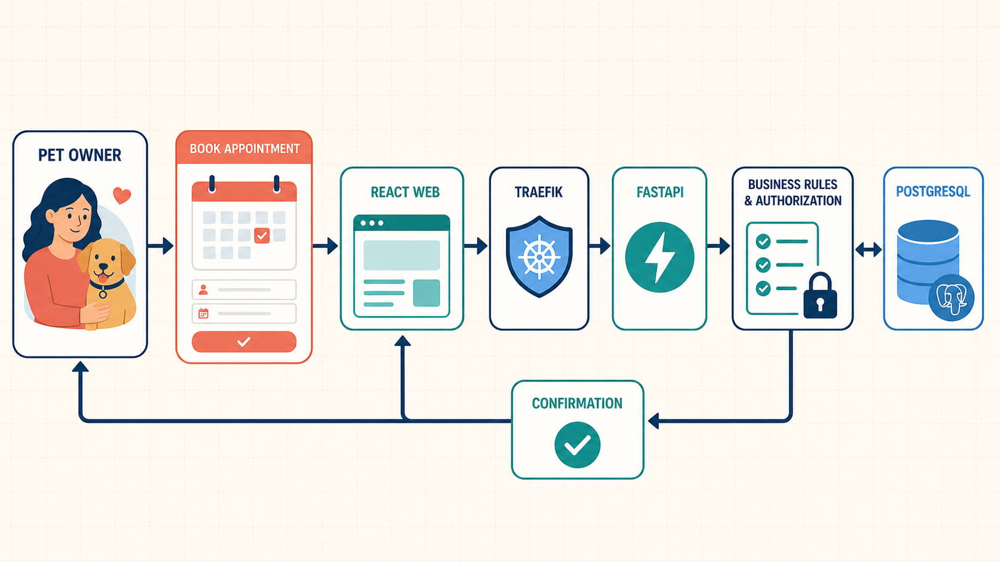

**Generated Image 3B — Optional Integration, Background Job และ LLM Guardrail**

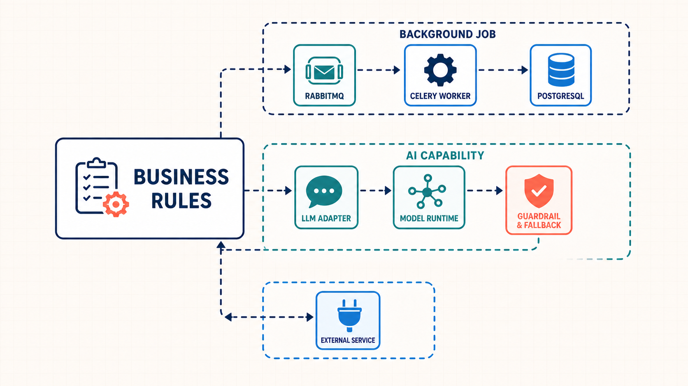

**Generated Image 3C — CI/CD, Course Container และ Observability**

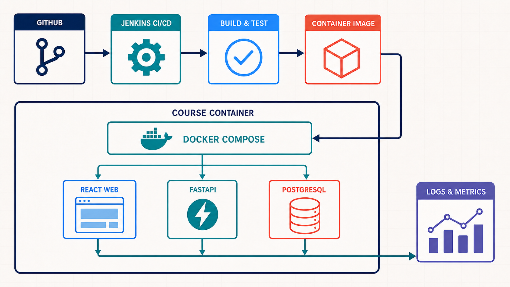

> Generated Image 3A–3C แยก System Design เป็นสามมุมมองเพื่อให้อ่านง่าย ส่วน Mermaid ด้านล่างเป็นภาพรวมรวมและเป็นแหล่งอ้างอิงความสัมพันธ์เชิงเทคนิค

**Diagram 2 — ตัวอย่าง System Design และเส้นทางการใช้งานของผู้ใช้**

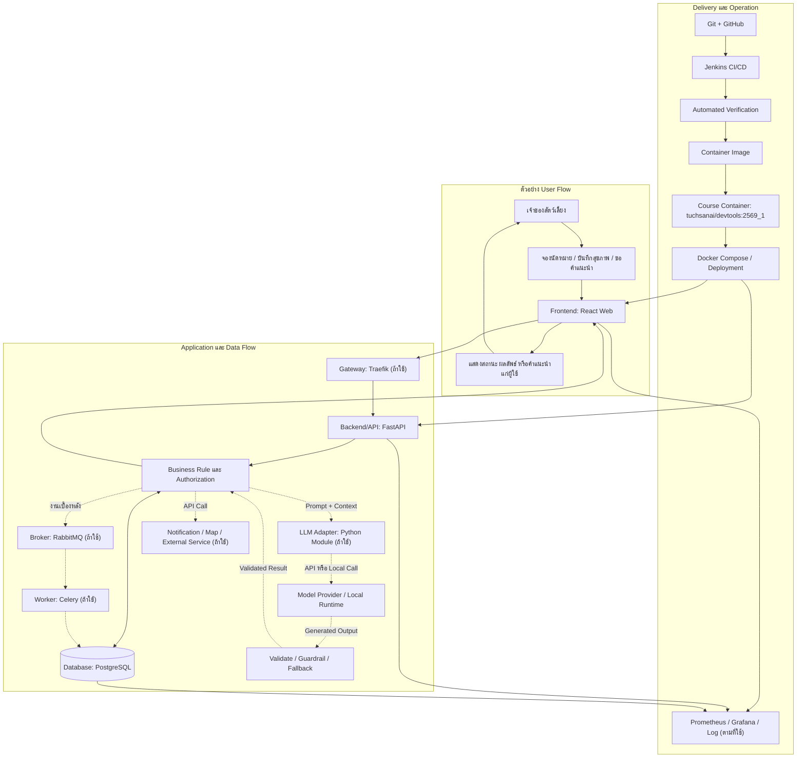

Diagram นี้เป็นเพียงตัวอย่างความสัมพันธ์โดยรวม ไม่ได้บังคับให้ทุกกลุ่มทำระบบ PetTech แบบเดียวกันหรือใช้ Architecture เดียวกัน แต่ Diagram ของแต่ละกลุ่มต้องแสดงตัวอย่างสิ่งที่ผู้ใช้ทำจริงอย่างน้อยหนึ่ง End-to-End User Flow ตั้งแต่ Action ของผู้ใช้ การส่งข้อมูลผ่านองค์ประกอบต่าง ๆ ไปจนถึงผลลัพธ์ที่ผู้ใช้ได้รับ

### 2.3 สิ่งที่ System Design ของแต่ละกลุ่มต้องอธิบาย

แต่ละกลุ่มต้องนำเสนอ System Design ของระบบตนเองอย่างชัดเจน โดยระบุ Technology ที่เลือกใช้ หน้าที่ของแต่ละองค์ประกอบ และการเชื่อมต่อระหว่างองค์ประกอบ ระบบอาจเพิ่ม ลด หรือแทนที่องค์ประกอบจากตัวอย่างได้ตามเหตุผลเชิงวิศวกรรม แต่ต้องไม่ปล่อยให้ส่วนสำคัญเป็นเพียงกล่องที่ไม่ทราบหน้าที่หรือวิธีเชื่อมต่อ

| ส่วนที่ต้องอธิบาย | สิ่งที่ควรเห็นใน System Design |
|---|---|
| User / Actor และ User Flow | ใครใช้ระบบ ทำรายการอะไร ลำดับการใช้งานเป็นอย่างไร และได้รับผลลัพธ์ใดกลับไป |
| Frontend / Interface | ใช้ Technology หรือ Framework ใด รับ Input และแสดง Output อะไร ติดต่อ Backend หรือ Service ใด |
| Backend / API | ใช้ Language และ Framework ใด รับผิดชอบ Business Rule ใด มี Authentication/Authorization อย่างไร และเปิด Endpoint หรือ Interface แบบใด |
| Database / Storage | ใช้ระบบจัดเก็บชนิดใด เก็บข้อมูลสำคัญอะไร ใครเป็นผู้เขียนหรืออ่านข้อมูล และจัดการ Schema/Migration/Persistence อย่างไร |
| Integration และเครื่องมืออื่น | ระบุ Gateway, Message Broker, Cache, Object Storage, Worker, Monitoring หรือ External Service ที่ใช้ พร้อมหน้าที่และวิธีเชื่อมต่อ |
| LLM / AI Module | ระบุให้ชัดว่า “ใช้” หรือ “ไม่ใช้” หากใช้ ต้องแสดง Model/Provider หรือ Runtime, Data/Prompt Flow, การตรวจสอบ Output, Guardrail, Fallback, Privacy และการจัดการ Secret |
| Deployment และ Verification | ระบุ Container ของแต่ละองค์ประกอบ Network/Port/Health Check ที่จำเป็น เส้นทาง CI/CD และวิธีตรวจสอบระบบใน Course Container |

สำหรับทุกเส้นเชื่อมที่สำคัญ ควรอธิบายทิศทางการสื่อสาร ชนิดข้อมูลหรือคำสั่งที่ส่ง Protocol/Interface ที่ใช้ และพฤติกรรมเมื่อปลายทางผิดพลาด ไม่จำเป็นต้องมี LLM Module หากไม่เกี่ยวข้องกับปัญหา และการไม่ใช้ LLM ไม่ถือเป็นข้อเสีย แต่หากเสนอความสามารถ AI/LLM ความสามารถนั้นจะกลายเป็น Requirement และ Acceptance Criteria ที่ต้อง Demonstrate ได้จริงเช่นเดียวกับ Feature อื่น

### 2.4 หลักฐานใน Repository

แต่ละกลุ่มออกแบบโครงสร้าง Repository และรูปแบบหลักฐานได้เองตามเทคโนโลยีและ Workflow ของทีม ไม่บังคับชื่อไฟล์ ชื่อโฟลเดอร์ โครงสร้างโค้ด หรือแบบ Diagram ตายตัว

หลักฐานโดยรวมต้องทำให้ผู้ตรวจเข้าใจขอบเขตที่ทีมรับปาก เริ่มระบบ ทำซ้ำกระบวนการสำคัญ และตรวจสอบคำกล่าวอ้างได้ ทีมอาจใช้โค้ด เอกสาร Automated Test, Pipeline result, Log, ประวัติการทำงาน หรือหลักฐานอื่นที่เหมาะสมก็ได้ โดยระบุให้ผู้ตรวจหาพบได้ง่าย หลักฐานต้องสะท้อนสถานะปัจจุบันของระบบ ไม่ใช่เพียงภาพหรือผลลัพธ์จากรุ่นที่ไม่ตรงกับงานที่ส่ง

---

## 3. สภาพแวดล้อมมาตรฐานสำหรับทดสอบระบบ

> **ข้อกำหนดสำคัญ:** การตรวจและทดสอบระบบอย่างเป็นทางการจะทำภายใน Container Environment ของรายวิชาที่กำหนดให้เท่านั้น

ให้ใช้ภาพแวดล้อมและวิธีเตรียมจาก [Full-stack Gateway + Broker — ChongJai Café](../../03_Application_Docker/04_Fullstack_Gateway_Broker_App/readme.md#เตรียมเครื่องเรียนครั้งเดียว) ซึ่งปัจจุบันกำหนดให้ใช้ Image `tuchsanai/devtools:2569_1` เป็นกล่อง Docker-in-Docker ของรายวิชา โดย Clone หรือ Checkout รุ่นที่ส่งเข้าไปภายในกล่อง แล้วจึงรัน Container ของโครงการผ่าน Docker/Docker Compose ภายในนั้น

- ทีมต้องทดสอบรุ่นที่ส่งในกล่องของรายวิชาก่อนส่งมอบ และต้องทำให้ขั้นตอนเริ่มระบบ ทดสอบ หยุด และเก็บกวาดทำซ้ำได้ใน Environment นี้
- ระบบต้องไม่พึ่งไฟล์ Runtime, Package, Configuration หรือสถานะที่มีอยู่เฉพาะบนเครื่องของสมาชิก และต้องไม่กำหนดพอร์ตหรือทรัพยากรที่ชนกับข้อจำกัดของกล่อง
- ผลจากเครื่องส่วนตัว Cloud หรือ Environment อื่นใช้เป็นหลักฐานประกอบได้ แต่ไม่ทดแทนผลการตรวจในกล่องของรายวิชา
- ข้อกำหนดนี้กำหนดเฉพาะ Test Environment ไม่ได้บังคับให้ทุกกลุ่มใช้สถาปัตยกรรมหรือ Service แบบเดียวกับระบบตัวอย่าง ChongJai Café

**Diagram 3 — ขอบเขตการทดสอบใน Container ของรายวิชา**

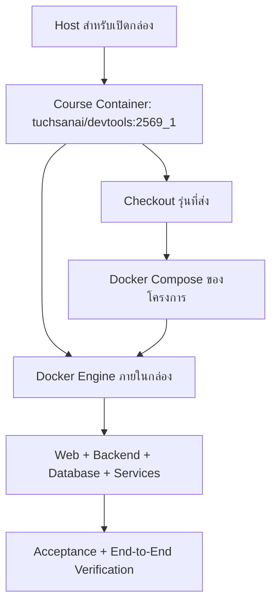

---

## 4. กรอบ Proposal → Implementation → Verification

**Generated Image 4 — เทียบสิ่งที่เสนอ สิ่งที่สร้าง และหลักฐานจากระบบจริง**

**Diagram 4 — วงจรข้อผูกพันและการยืนยันผล**

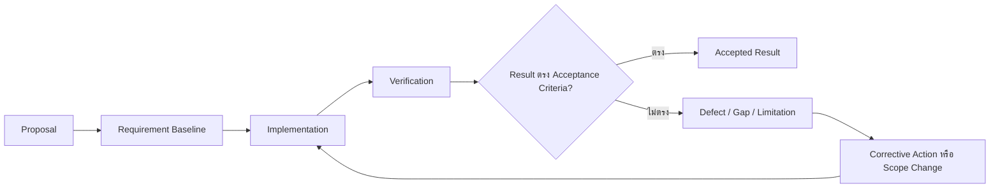

### 4.1 Proposal: สร้างข้อตกลงที่ชัดเจน

ทีมต้องรวบรวมสิ่งที่เสนอว่าจะทำเป็น Requirement Baseline ก่อนตรวจผลงาน ควรมี Functional Requirement, Non-functional Requirement, Use Case, Feature, ข้อมูลเข้า, ผลลัพธ์, กรณีผิดพลาดสำคัญ และข้อจำกัด โดยใช้ภาษาที่ตรวจได้ เช่น “เมื่อ... ระบบต้อง... และจะถือว่าสำเร็จเมื่อ...”

ขอบเขตต้องท้าทายแต่เป็นไปได้ สอดคล้องกับปัญหา จำนวนสมาชิก และระยะเวลา การรับปากขอบเขตที่น้อยเกินไปจะไม่เท่าเทียมกับระบบที่มีความซับซ้อนและความเสี่ยงสูงกว่า แม้จะทำงานครบตามที่เสนอทั้งคู่

### 4.2 Implementation: สร้างตามข้อตกลง

แต่ละ Requirement ต้องเชื่อมโยงไปยังส่วนของระบบที่ทำให้เกิดผลลัพธ์นั้นได้ หากมีการเปลี่ยนขอบเขตให้บันทึกสิ่งที่เปลี่ยน เหตุผล ผลกระทบ และการยอมรับจากผู้สอนหรือผู้เกี่ยวข้อง การลบ Feature ที่ทำไม่เสร็จออกก่อนนำเสนอโดยไม่แจ้ง ไม่ทำให้ข้อผูกพันเดิมหายไป

### 4.3 Verification: พิสูจน์ผลจากระบบจริง

ทุก Requirement, Feature หรือ Capability ที่ปรากฏใน Proposal, Slide, Report, README หรือคำอธิบายระหว่างนำเสนอ ถือเป็น Acceptance Criteria ที่อาจถูกตรวจได้ ทีมต้องแสดงผลจากระบบที่ส่งจริง โดยใช้ข้อมูลทดสอบที่เหมาะสม และทำให้ผู้ตรวจสามารถเทียบผลที่คาดหวังกับผลจริงได้

ให้จัดทำ Traceability Matrix ในรูปแบบที่ทีมถนัด โดยอย่างน้อยควรตอบคำถามต่อไปนี้:

| Requirement หรือคำกล่าวอ้าง | ผู้ใช้/สถานการณ์ | Acceptance Criteria | ส่วนที่นำไปใช้ | วิธีตรวจและผลจริง | สถานะ/ข้อจำกัด |
|---|---|---|---|---|---|
| ระบบรับและยืนยันการนัดหมาย | เจ้าของสัตว์เลี้ยงจองคิว | รายการถูกบันทึกเพียงครั้งเดียว แสดงให้ทั้งสองฝ่าย และไม่อนุญาตช่วงเวลาซ้ำ | ระบบจอง, API, Database | ทดสอบการจองปกติและจองช่วงเวลาซ้ำ แล้วตรวจ UI, API response และข้อมูล | บันทึกผลที่ตรวจพบตามจริง |

ตารางนี้เป็นเพียงตัวอย่าง สามารถปรับรูปแบบได้ แต่ต้องรักษาความเชื่อมโยงจากสิ่งที่เสนอไปยังผลที่ตรวจได้

**Diagram 5 — ความเชื่อมโยงของ Traceability**

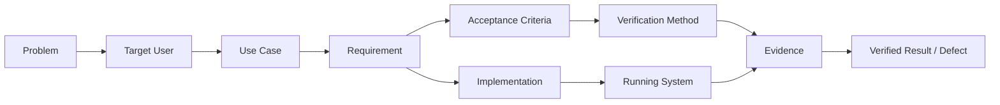

---

## 5. รูปแบบและโครงสร้างการนำเสนอ

> **การนำเสนอเป็นส่วนสำคัญของการประเมิน** เพราะเป็นช่วงที่ทีมต้องเชื่อม Problem, Proposal, ระบบจริง และหลักฐานเข้าด้วยกัน ผู้ตรวจไม่ได้พิจารณาเพียงความสวยของ Slide หรือความลื่นไหลในการพูด แต่พิจารณาว่าทีมทำให้คำกล่าวอ้างสำคัญเข้าใจได้ ตรวจสอบได้ และสอดคล้องกับระบบที่ส่งหรือไม่

### 5.1 หลักการออกแบบ: เล่าเรื่องเดียวที่พิสูจน์ได้

เลือก End-to-End User Flow หลักหนึ่งเส้นเป็นแกนของเรื่อง แล้วใช้ Problem, Solution, System Design, Demo และ Evidence สนับสนุนเส้นเรื่องเดียวกัน หลีกเลี่ยงการนำเสนอแต่ละหัวข้อแยกจากกันจนผู้ฟังไม่เห็นว่า Feature ใดแก้ปัญหาใด หรือหลักฐานใดยืนยันผลลัพธ์ใด

| Story | System | Proof |
|---|---|---|
| ทำให้เข้าใจว่าใครมีปัญหา อะไรสำคัญ และทีมรับปากผลลัพธ์ใด | แสดงว่าผู้ใช้ทำอะไร ข้อมูลไหลผ่านองค์ประกอบใด และระบบตอบสนองอย่างไร | Demonstrate ผลจริง เทียบ Acceptance Criteria และเปิดเผย Defect/ข้อจำกัดตามจริง |

### 5.2 Presentation Storyline

ทีมปรับลำดับหรือรูปแบบได้ แต่เนื้อหาควรสร้างคำตอบครบทั้ง 6 ช่วงต่อไปนี้

| ช่วงของเรื่อง | คำถามหลัก | สิ่งที่ควรสื่อสารและพิสูจน์ | สัญญาณของผลงานคุณภาพสูง |
|---|---|---|---|
| **WHY — Problem & Target** | ปัญหาอะไรสำคัญ และเกิดกับใคร | Problem Statement, Root cause, Target User, บริบท, หลักฐาน และผลกระทบหากไม่แก้ | ปัญหาเฉพาะเจาะจง หลักฐานสืบย้อนกลับได้ และ Use Case สะท้อนข้อจำกัดของผู้ใช้จริง |
| **PROMISE — Solution & Scope** | ทีมรับปากว่าจะเปลี่ยนแปลงอะไร | กลไกของ Solution, Requirement, Feature, Acceptance Criteria, ขอบเขต และความแตกต่างจากวิธีเดิม | ทุก Feature เชื่อมกับปัญหา มีเงื่อนไขสำเร็จชัด และไม่กล่าวเกินสิ่งที่ระบบทำได้ |
| **EXPERIENCE — Live User Journey** | ผู้ใช้ทำงานสำคัญสำเร็จอย่างไร | สาธิต User Flow จากระบบจริง ตั้งแต่ Input, Business Rule, การบันทึกข้อมูล จนถึงผลลัพธ์ รวม Failure Case ที่มีความหมาย | Demo ต่อเนื่อง ใช้ข้อมูลที่ตรวจสอบได้ แสดง State ก่อน–หลัง และผลตรงกับ Acceptance Criteria |
| **ENGINEERING — System Design & DevTools** | ระบบทำงานและส่งมอบซ้ำได้อย่างไร | Technology ของ Frontend, Backend, Database และ Module อื่น, Data Flow, Integration, Security, Docker/Compose, Jenkins CI/CD และ Observability | Architecture ตรงกับระบบที่รันจริง อธิบาย Interface/Trade-off/Failure Mode ได้ และ Pipeline สร้างหลักฐานได้จริง |
| **PROOF — Verification & Quality** | อะไรยืนยันว่าระบบทำได้ตามที่เสนอ | Traceability Matrix, Automated/Manual Test, Pipeline Result, Acceptance Result, Defect, Known Limitation และการตรวจใน Course Container | หลักฐานผูกกับ Requirement ระบุ Expected/Actual Result ทำซ้ำได้ และเปิดเผยส่วนที่ยังไม่ผ่านอย่างตรงไปตรงมา |
| **VALUE — Impact, Adoption & Team** | หากนำไปใช้จริงจะเกิดคุณค่าและดูแลต่ออย่างไร | Outcome/Metric, Target Market, ช่องทางนำไปใช้, Sustainability, Unfair Advantage, Roadmap, Team Ownership และ Network | ตัวชี้วัดมีที่มา สมมติฐานสอดคล้องกัน Roadmap ตอบความเสี่ยง และสมาชิกเชื่อมงานของตนกับผลลัพธ์รวมได้ |

### 5.3 Evidence Gates ที่ต้องผ่านในการนำเสนอ

Evidence Gate ไม่ใช่รายการ Technology ตายตัว แต่เป็นจุดตรวจที่ทำให้ผู้ประเมินยืนยันคำกล่าวอ้างสำคัญได้ หาก Gate ใดขาดหาย ส่วนที่เกี่ยวข้องอาจถูกพิจารณาว่ายังไม่สามารถยืนยันได้ แม้ Slide จะระบุว่าทำเสร็จแล้ว

| Evidence Gate | สิ่งที่ผู้ตรวจต้องเห็น | เมื่อหลักฐานไม่เพียงพอ |
|---|---|---|
| **Claim Gate** | คำกล่าวอ้างสำคัญเชื่อมไปยัง Requirement และ Acceptance Criteria ที่ตรวจได้ | ไม่สามารถตัดสินได้ว่าสิ่งที่แสดงตรงกับสิ่งที่รับปากหรือไม่ |
| **Live System Gate** | User Flow และ Failure Case ทำงานจากรุ่นที่ส่ง โดยใช้ระบบจริงและข้อมูลที่ตรวจสอบได้ | Feature หรือ Integration ที่อ้างถึงอาจถือว่ายังไม่ได้รับการยืนยัน |
| **Architecture Gate** | System Design ระบุ Technology, หน้าที่, Data Flow และการเชื่อมต่อที่ตรงกับ Runtime จริง | ไม่สามารถยืนยันความเข้าใจ การ Integration หรือเหตุผลเชิงวิศวกรรมของทีม |
| **Reproducibility Gate** | ระบบเริ่ม ทดสอบ หยุด และตรวจซ้ำได้ภายใน Course Container ที่กำหนด | ผลจากเครื่องส่วนตัวหรือวิดีโอไม่สามารถทดแทน Formal Verification ได้ |
| **Ownership Gate** | สมาชิกอธิบายการตัดสินใจ ติดตาม Data Flow วินิจฉัย Defect และเชื่อมส่วนที่รับผิดชอบกับระบบรวมได้ | ไม่สามารถยืนยันว่าทีมเข้าใจและดูแลระบบที่ส่งมอบได้ โดยเฉพาะส่วนที่ AI ช่วยสร้าง |

### 5.4 วิธีทำให้การนำเสนอน่าสนใจโดยไม่เสียความตรวจสอบได้

- เปิดด้วยสถานการณ์ของผู้ใช้และผลกระทบที่จับต้องได้ แทนการเริ่มจากรายชื่อ Technology
- นำ Demo เข้ามาเป็นส่วนหนึ่งของเรื่อง แล้วอธิบาย System Design และ Evidence จากสิ่งที่เพิ่งสาธิต
- ใช้ชื่อ Requirement, Feature และ Acceptance Criteria ให้สอดคล้องกันใน Proposal, Slide, Traceability Matrix และ Demo
- ใช้ Diagram, State ก่อน–หลัง, Test Result หรือ Log เท่าที่ช่วยยืนยันคำกล่าวอ้าง ลดข้อความยาวที่ไม่มีหลักฐาน
- เตรียมทั้ง Happy Path และ Failure Case ที่สะท้อน Business Rule หรือความเสี่ยงจริงของระบบ
- ปิดท้ายด้วยสิ่งที่ยืนยันได้ Defect/Known Limitation ที่ยังมี และลำดับการพัฒนาต่อไป

**Diagram 6 — Presentation Story Arc จากปัญหาสู่คุณค่าที่พิสูจน์ได้**

```mermaid
flowchart LR
    Why["① WHY<br/>ปัญหาการจองคิวและผู้ใช้ที่ได้รับผลกระทบ"]
    Promise["② PROMISE<br/>จองนัดหมายได้และป้องกันช่วงเวลาซ้ำ"]
    Experience["③ EXPERIENCE<br/>Live Demo: จองสำเร็จ + ทดสอบเวลาซ้ำ"]
    Engineering["④ ENGINEERING<br/>React → FastAPI → PostgreSQL + CI/CD"]
    Proof["⑤ PROOF<br/>Acceptance Result + Test + Defect"]
    Value["⑥ VALUE<br/>Outcome + Adoption + Team + Roadmap"]

    Why --> Promise --> Experience --> Engineering --> Proof --> Value

    classDef story fill:#E8F3FF,stroke:#2367A6,color:#102A43,stroke-width:2px;
    classDef system fill:#E5F7F4,stroke:#138A7E,color:#123B37,stroke-width:2px;
    classDef proof fill:#FFF0EA,stroke:#D9644A,color:#54281E,stroke-width:2px;
    class Why,Promise story;
    class Experience,Engineering system;
    class Proof,Value proof;
```

กำหนดการรวมและช่วงนำเสนอของแต่ละกลุ่มให้ยึดตาม [README หลัก](../readme.md#-กำหนดการนำเสนอผลงาน) ส่วนลำดับ รูปแบบ และสัดส่วนเวลาของหัวข้อภายใน ให้แต่ละกลุ่มบริหารเองโดยไม่มีเวลาบังคับราย Section ผู้ตรวจอาจเลือก Requirement หรือสถานการณ์เพิ่มเติมเพื่อขอตรวจจากระบบจริงได้

---

## 6. Evaluation Matrix

ผู้ตรวจพิจารณาความสอดคล้องของแต่ละข้อผูกพันในลำดับ Proposal → Implementation → Verification โดยใช้ระดับคุณภาพต่อไปนี้กับทุกมิติการประเมิน

| ระดับคุณภาพ | Proposal | Implementation | Verification |
|---|---|---|---|
| **สอดคล้องครบถ้วน** | ข้อผูกพันชัด มีความสำคัญ มีขอบเขตและเกณฑ์สำเร็จที่วัดได้ | พบการทำงานครบตามข้อผูกพัน รวมถึงกรณีสำคัญนอกเส้นทางปกติ | สาธิตซ้ำได้ ผลตรงกับที่คาดหวัง และมีหลักฐานสนับสนุนตามความเสี่ยง |
| **สอดคล้องเป็นส่วนใหญ่** | ข้อผูกพันชัดเป็นส่วนใหญ่ แต่บางเงื่อนไขหรือตัวชี้วัดยังคลุมเครือ | เส้นทางหลักทำงาน พบข้อจำกัดหรือ Defect ที่ไม่ทำลายผลลัพธ์หลัก | สาธิตผลหลักได้ แต่การทำซ้ำ ความครอบคลุม หรือหลักฐานบางส่วนยังไม่สมบูรณ์ |
| **สอดคล้องบางส่วน** | สิ่งที่รับปากคลุมเครือ ขาดเกณฑ์สำเร็จ หรือไม่เชื่อมกับปัญหาหลัก | ทำได้เพียงบางขั้น ใช้ข้อมูลจำลองแทน Integration หรือมี Defect ที่กระทบผลลัพธ์สำคัญ | เห็นผลได้เพียง Happy path หรือต้องพึ่งภาพ วิดีโอ หรือคำอธิบายเป็นหลัก |
| **ไม่สอดคล้องหรือไม่สามารถยืนยัน** | ไม่มีข้อผูกพันที่ตรวจได้ หรือคำกล่าวอ้างไม่มีหลักฐานรองรับ | ไม่พบความสามารถที่รับปาก เส้นทางหลักถูกขัดขวาง หรือส่วนต่างๆ ไม่ได้เชื่อมต่อจริง | ไม่สามารถรัน ทำซ้ำ ตรวจผล หรือหลักฐานขัดแย้งกับคำกล่าวอ้าง |

### 6.1 ผลของ Defect และข้อจำกัด

| ระดับ | ลักษณะ | ผลต่อการประเมิน |
|---|---|---|
| **Critical** | เส้นทางหลักใช้ไม่ได้ ข้อมูลสูญหาย/ผิดพลาดร้ายแรง หรือมีความเสี่ยงด้าน Security, Privacy หรือความปลอดภัย | Requirement นั้นถือว่ายังไม่บรรลุ และกระทบมิติการใช้งานจริง Integration, Reliability หรือ Security ที่เกี่ยวข้อง |
| **Major** | ทำงานได้บางส่วน ผลลัพธ์หลักไม่ครบ มีขั้นตอนสำคัญที่ต้องทำแทนด้วยมือ หรือ Integration/Pipeline ขาดช่วง | พิจารณาว่าสอดคล้องได้เพียงบางส่วน ตามผลที่เสียหายและจำนวนข้อผูกพันที่ได้รับผล |
| **Minor** | ผลหลักถูกต้อง แต่มีปัญหาจำกัดด้านการใช้งาน ข้อความ การแสดงผล หรือ Edge case ที่ไม่ทำลายงานหลัก | ยังยืนยันผลหลักได้ แต่สะท้อนในด้านความสมบูรณ์ ความละเอียด หรือความพร้อมใช้งาน |
| **Known limitation** | ข้อจำกัดถูกเปิดเผยล่วงหน้า มีเหตุผล และไม่ขัดกับข้อผูกพันหลัก | ไม่ถือเป็น Defect โดยอัตโนมัติ แต่พิจารณาว่าขอบเขตที่เหลือยังมีคุณค่าและความท้าทายที่เหมาะสมหรือไม่ |

การเสียหายหนึ่งจุดอาจกระทบหลายมิติเมื่อมีความสัมพันธ์กัน เช่น Database บันทึกผิดจะกระทบทั้ง Functional correctness, Integration และ Reliability ผู้ตรวจจะบันทึกผลกระทบตามที่เกิดขึ้นจริง โดยไม่นับ Defect เดียวซ้ำซ้อนโดยปราศจากเหตุผล

**Diagram 7 — การตัดสินผลตามหลักฐานและ Defect**

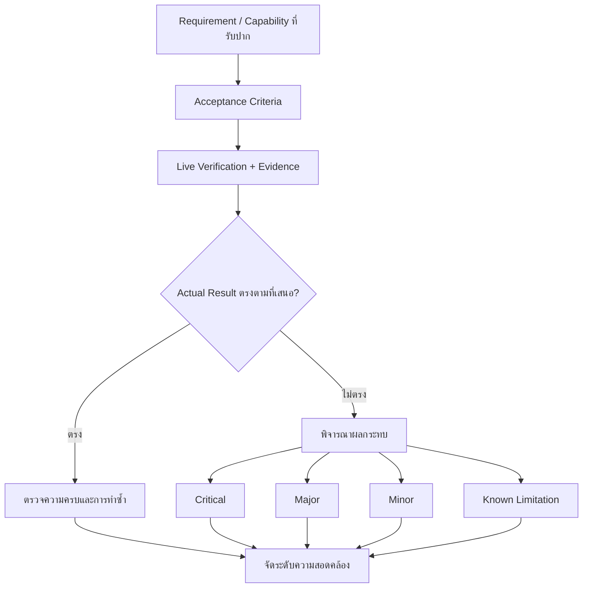

---

## 7. มิติการประเมิน

### 7.1 Problem Statement

พิจารณาว่าทีมนิยามปัญหาอย่างเฉพาะเจาะจงหรือไม่ โดยแยกให้ออกว่าใครพบปัญหา ปัญหาเกิดเมื่อใด บ่อยหรือรุนแรงเพียงใด และผลกระทบถึงระดับใด ต้องแยก Symptom ออกจาก Root cause และระบุสมมติฐานที่ยังไม่ได้พิสูจน์

ผลงานที่มีคุณภาพใช้หลักฐานหลายแหล่งตามความเหมาะสม เช่น ข้อมูลสถิติ งานวิจัย การสัมภาษณ์ แบบสอบถาม การสังเกต หรือข้อมูลการใช้งาน ระบุแหล่งที่มา ช่วงเวลา วิธีเก็บ ขนาดตัวอย่าง และข้อจำกัดเท่าที่จำเป็น ไม่กล่าวเกินกว่าหลักฐานที่มี

### 7.2 Solution

พิจารณาความเชื่อมโยงจาก Root cause ไปยังกลไกของ Solution และจากแต่ละกลไกไปยัง Feature ที่พัฒนา ทีมต้องอธิบายได้ว่าผู้ใช้จะได้รับผลลัพธ์ใด เหตุใดวิธีนี้จึงเหมาะกว่าวิธีเดิม และข้อได้เปรียบหรือ Trade-off ใดเกิดขึ้น

พิจารณาทั้งความถูกต้องของ Business rule, ความครบของ User flow, คุณภาพของ Error handling และผลจาก User validation ระบุให้ชัดว่าส่วนใดใช้ได้แล้ว ส่วนใดยังเป็นแนวคิด และส่วนใดเป็นข้อจำกัด จำนวน Feature ไม่ชดเชยความไม่ครบหรือไม่ถูกต้องของ Feature หลัก

### 7.3 Target Users / Target Market

ระบุ Primary user, Secondary user, ผู้ดูแลระบบ และผู้มีส่วนได้เสียให้แยกจากกัน อธิบายบริบท พฤติกรรม ความต้องการ ทักษะ ข้อจำกัดในการเข้าถึง และเหตุผลที่เลือกกลุ่มนั้น พร้อมเชื่อมแต่ละกลุ่มกับ Use Case และสิทธิ์ที่ได้รับในระบบ

หากกล่าวถึงขนาดตลาดหรือจำนวนผู้ใช้ ต้องแสดงแหล่งข้อมูล วิธีคำนวณ และสมมติฐาน รวมถึงระบุช่องทางที่เป็นไปได้ในการเข้าถึงและนำระบบไปใช้ ไม่ใช้ตัวเลขขนาดใหญ่ที่ไม่สามารถสืบย้อนได้

### 7.4 Social Impact & Assessment

ระบุการเปลี่ยนแปลงที่ต้องการให้เกิดกับสัตว์เลี้ยง ผู้ใช้ ผู้ให้บริการ หรือสังคม และแยก Output เช่น จำนวนผู้ลงทะเบียน ออกจาก Outcome เช่น ระยะเวลาค้นหาสัตว์สูญหายลดลง

ตัวชี้วัดควรสัมพันธ์กับปัญหา มีนิยาม Baseline, เป้าหมาย แหล่งข้อมูล และวิธีเก็บที่เป็นไปได้ ทีมต้องพิจารณาผลกระทบที่ไม่ตั้งใจ ความเป็นส่วนตัว ความปลอดภัย ความเท่าเทียม และสวัสดิภาพสัตว์ตามลักษณะของโครงการ

### 7.5 Team & Network

พิจารณาการแบ่งความรับผิดชอบที่สอดคล้องกับขนาดและความเสี่ยงของงาน รวมถึงการสื่อสาร การ Review และการแก้ปัญหาร่วมกัน หลักฐานการมีส่วนร่วมอาจมาจาก Git history, Pull Request, Issue, การออกแบบ การทดสอบ การเก็บข้อมูล หรือผลงานอื่น โดยไม่ยึด Commit count เป็นตัวแทนคุณภาพเพียงอย่างเดียว

สมาชิกทุกคนต้องอธิบายส่วนที่ตนรับผิดชอบ เหตุผลของการตัดสินใจ วิธีตรวจสอบ และความเชื่อมโยงกับระบบส่วนอื่นได้ รวมถึงอธิบายว่าเครือข่าย พันธมิตร หรือผู้เชี่ยวชาญช่วยให้ทีมเข้าใจปัญหาหรือนำระบบไปใช้ได้อย่างไร

### 7.6 Sustainability & Unfair Advantage

อธิบายว่าใครสร้างคุณค่า ใครได้รับประโยชน์ ใครจ่ายหรือสนับสนุน และระบบต้องใช้ทรัพยากรอะไรเพื่อดำเนินงานต่อ สมมติฐานด้านรายได้ ค่าใช้จ่าย ปริมาณการใช้งาน และค่าบริการภายนอกต้องสอดคล้องกันและสืบย้อนได้

แผนระยะยาวควรระบุลำดับความสำคัญ ความเสี่ยงด้านเทคนิค ธุรกิจ จริยธรรม และการพึ่งพา Vendor รวมถึงแนวทางรับมือ Unfair advantage เช่น Data, Network, Domain expertise หรือ Partnership จะถือว่ามีคุณค่าเมื่อทีมอธิบายได้ว่าสร้าง รักษา และใช้ประโยชน์ได้อย่างไร ไม่ใช่เพียงคำกล่าวอ้าง

### 7.7 Demo, DevTools & System Design

พิจารณาจากระบบและกระบวนการที่ทำงานร่วมกันจริง ไม่ได้พิจารณาเพียงว่ามีไฟล์หรือมีเครื่องมือตามชื่อ โดยครอบคลุม:

- **Functional completeness และ correctness:** User flow หลักและสำคัญทำงานครบตาม Acceptance Criteria, Business rule และสิทธิ์ของผู้ใช้
- **Data และ Integration:** Frontend, Backend, Database และบริการอื่นแลกเปลี่ยนข้อมูลถูกต้อง รักษาความคงสภาพ และไม่ใช้ Mock แทนส่วนที่รับปากว่าเชื่อมต่อแล้ว
- **Reliability และ usability:** รับมือกับ Invalid input, การทำงานซ้ำ บริการล่ม และการกลับมาทำงานได้ตามความเสี่ยง พร้อมแจ้งผู้ใช้อย่างเข้าใจได้
- **Architecture และ engineering decisions:** ระบุ Technology และหน้าที่ของ Frontend, Backend, Database, Gateway/Broker/Worker/External Service หรือ Module อื่นที่ใช้ แสดงทิศทางและ Interface ของทุกการเชื่อมต่อที่สำคัญ และอธิบายเหตุผล Trade-off, Failure mode และข้อจำกัดได้
- **AI/LLM capability (เมื่อมี):** แสดง Data/Prompt flow, การตรวจ Output, Guardrail, Fallback, Privacy/Secret และพฤติกรรมเมื่อ Model หรือ Provider ใช้งานไม่ได้ โดยความสามารถที่อ้างว่ามีต้องผ่าน Acceptance Criteria จากระบบจริง
- **Delivery pipeline:** Git/GitHub สะท้อนการร่วมงานจริง Docker/Docker Compose ทำให้ Environment ทำซ้ำได้ และ Jenkins CI/CD ตรวจก่อนส่งมอบ Deploy และ Verify ผลได้จริง
- **Test quality:** การทดสอบเลือกครอบคลุมความเสี่ยงและ Business rule ที่สำคัญ ตรวจทั้งกรณีสำเร็จและล้มเหลว และล้มเหลวเมื่อพบ Regression จริง
- **Security, privacy และ operations:** จัดการ Secret, สิทธิ์, ข้อมูลอ่อนไหว, Health check, Log, Metric, Backup หรือการกู้คืนตามระดับที่เหมาะกับความเสี่ยงและขอบเขต
- **Reproducibility:** ผู้ตรวจสามารถเริ่มระบบ ทดสอบ และตรวจสอบรุ่นที่ส่งภายใน Course Container ที่กำหนดได้จากคำแนะนำของทีม โดยไม่ต้องเดาขั้นตอนสำคัญ

**Diagram 8 — ตัวอย่าง CI/CD และการยืนยันผลหลัง Deploy**

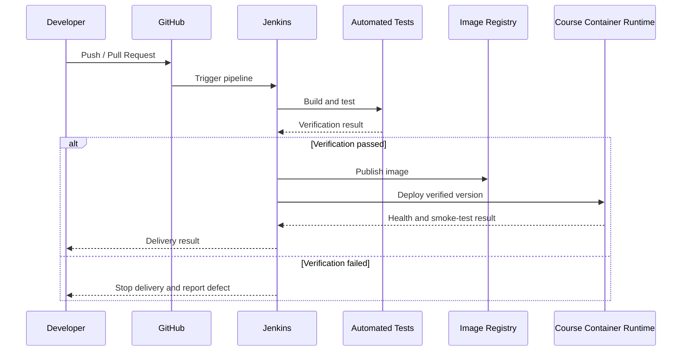

---

## 8. การใช้ AI Coding Tools

**Generated Image 5 — AI ช่วยพัฒนา แต่มนุษย์ต้องตรวจสอบและรับผิดชอบคุณภาพ**

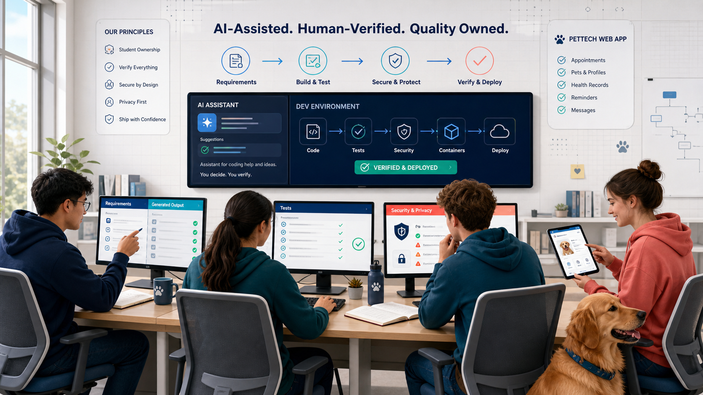

อนุญาตให้ใช้ Codex และ AI Tools อื่นช่วยวิเคราะห์ ออกแบบ พัฒนา ทดสอบ และจัดทำเอกสารได้ ทีมต้องระบุโดยสรุปว่าใช้เครื่องมือใดช่วยงานประเภทใด โดยไม่จำเป็นต้องส่ง Prompt หรือบทสนทนาทั้งหมด เว้นแต่มีกติการายวิชากำหนดเพิ่มเติม

การประเมินไม่พิจารณาจากปริมาณโค้ดหรือความเร็วในการสร้างระบบ แต่พิจารณาจากผลที่ทำงานได้จริง คุณภาพการตรวจสอบ และความเข้าใจของทีม ทีมยังคงรับผิดชอบต่อโค้ด ข้อมูล License, Security, Defect และผลกระทบที่เกิดจากผลลัพธ์ของ AI เช่นเดียวกับโค้ดที่เขียนเอง

ระหว่างตรวจผลงาน ผู้ตรวจอาจให้สมาชิกอธิบายการตัดสินใจ ติดตาม Data flow วินิจฉัยปัญหา หรือปรับพฤติกรรมเล็กน้อยในขอบเขตที่ตนรับผิดชอบ เพื่อยืนยันว่าทีมสามารถดูแลระบบที่ส่งมอบได้

---

## 9. แนวทางการสาธิตและตรวจผลงาน

- ใช้ Requirement Baseline และ Traceability Matrix ฉบับเดียวกันในการตรวจทุกกลุ่ม
- ทีมเลือก User flow หลักเพื่อเล่าภาพรวมได้ และผู้ตรวจอาจเลือก Requirement หรือกรณีทดสอบเพิ่มเติม โดยทุกข้อที่ทีมรับปากยังคงต้องพร้อมให้ตรวจ
- การตรวจใช้รุ่นของระบบที่ส่ง และควรเริ่มจากสภาพแวดล้อมหรือชุดข้อมูลที่ทราบสถานะ เพื่อให้ทุกกลุ่มได้รับการตรวจอย่างเป็นธรรม
- การแสดงจากระบบจริงเป็นหลัก ภาพหรือวิดีโอใช้เป็นแผนสำรองได้ แต่ไม่ยืนยันสถานะปัจจุบันได้เท่ากับ Live verification
- หากบริการภายนอกขัดข้อง ให้พิจารณาทั้งการออกแบบรับมือ หลักฐานจากรุ่นที่ส่ง และความสามารถของทีมในการวินิจฉัย/กู้คืน ผู้ตรวจจะระบุว่าส่วนใดยืนยันได้และส่วนใดยังยืนยันไม่ได้
- คำกล่าวอ้างที่ไม่มีหลักฐาน ไม่สามารถเปิดให้ตรวจ หรือผลจริงขัดกับสิ่งที่เสนอ ให้ถือว่ายังไม่ยืนยันความสำเร็จของข้อนั้น

---

## 10. Checklist ก่อนส่งและนำเสนอ

- [ ] Requirement Baseline ครอบคลุมทุกสิ่งที่ทีมรับปาก และมี Acceptance Criteria ที่ตรวจได้
- [ ] Traceability Matrix เชื่อม Proposal, Implementation, วิธีตรวจ และผลจริง
- [ ] Web Interface, Database และเส้นทางหลักทำงาน End-to-End จากระบบที่ส่ง
- [ ] System Design ระบุ Technology, หน้าที่ และการเชื่อมต่อของ Frontend, Backend, Database และ Module อื่น พร้อมตัวอย่าง User Flow ที่เห็น Input, Data Flow และผลลัพธ์
- [ ] Git/GitHub, Docker/Docker Compose และ Jenkins CI/CD สะท้อน Workflow จริงของทีมและทำซ้ำได้
- [ ] รุ่นที่ส่งสามารถเริ่ม ทดสอบ หยุด และเก็บกวาดได้ภายใน Course Container `tuchsanai/devtools:2569_1`
- [ ] กรณีสำคัญทั้งสำเร็จและล้มเหลวมีผลตรวจที่ทำซ้ำได้ พร้อมเปิดเผย Defect และข้อจำกัดตามจริง
- [ ] สมาชิกอธิบายส่วนที่ตนรับผิดชอบได้ และระบุการใช้ AI Tools ตามความเป็นจริง
- [ ] ส่ง Slide, Source Code, Report และวิดีโอตามรายการใน [README หลัก](../readme.md#-รายการสิ่งที่ต้องส่งก่อนวันนำเสนอ)
