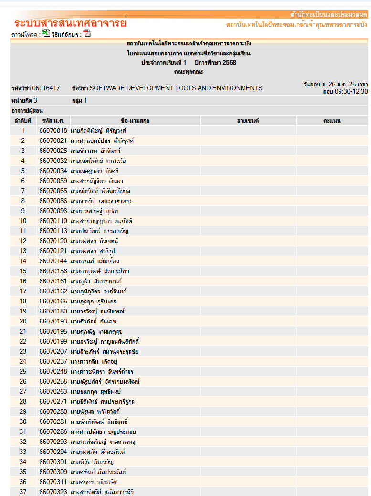
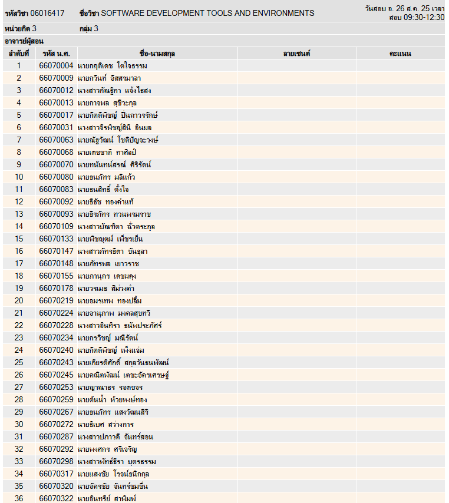

# 🐾 Mini Project (PetTech / DevTools)

> เอกสารกลางสำหรับรายละเอียดโครงการ การลงทะเบียนกลุ่ม ตัวอย่างผลงาน และข้อกำหนดการส่งงาน/นำเสนอ

---

## 🔗 ลิงก์สำคัญ
- 📄 **รายละเอียดโครงการ:** [เปิดเอกสาร](https://docs.google.com/document/d/1ti1VC6ihqt2Gi5W0zZ22pgiTE7Xh3iJke13JUeYGaIw/edit?usp=sharing)
- 📝 **ลงทะเบียนกลุ่ม:** [เปิดสเปรดชีต](https://docs.google.com/spreadsheets/d/1M9IbS6WnF2YmsR78zhF2ZXwrHg6CEOb-t3fnhx8pEn0/edit?usp=sharing)

> ℹ️ **หมายเหตุ:** ต้อง **ลงชื่อเข้าใช้ด้วยอีเมล `@it.kmitl.ac.th` เท่านั้น**

---

## 👥 การจัดกลุ่มและจำนวนนักศึกษา

### Sec 1 (เช้า)

### Sec 3 (บ่าย)

- สมาชิกทั้งหมด: **เช้า (Sec 1) 37 คน** และ **บ่าย (Sec 3) 36 คน**
- แบ่งกลุ่มกลุ่มละ **4–5 คน** รวม **8 กลุ่ม** ต่อช่วง

### สรุปการกระจายกลุ่ม
| ช่วงเรียน | จำนวนนักศึกษา | จำนวนกลุ่ม | โครงสร้างขนาดกลุ่ม |
|---|---:|---:|---|
| Sec 1 (เช้า) | 37 | 8 | 5, 5, 5, 5, 5, 4, 4, 4 |
| Sec 3 (บ่าย) | 36 | 8 | 5, 5, 5, 5, 4, 4, 4, 4 |

> 🧮 อธิบายเพิ่มเติม  
> - **Sec 1:** 5 กลุ่มแรกกลุ่มละ 5 คน และ 3 กลุ่มสุดท้ายกลุ่มละ 4 คน **(รวม 37 คน)**  
> - **Sec 3:** 4 กลุ่มแรกกลุ่มละ 5 คน และ 4 กลุ่มสุดท้ายกลุ่มละ 4 คน **(รวม 36 คน)**

---

## 🗓️ เส้นตายสำคัญ
- **Deadline จับกลุ่ม:** **23 กันยายน 2024 เวลา 23:59 น.**

> โปรดตรวจสอบให้สมาชิกทุกคนลงชื่อในชีตให้ครบ และเลือกกลุ่มให้ตรงตามช่วงเรียนของตน

---

## 🧰 คลังตัวอย่าง Mini Project (สำหรับศึกษาแนวทาง)
### Slide
- **ปี 2567**
   -<https://drive.google.com/drive/folders/1DGpJGYKD5AeDzfbGK3Y9pizewjRps-znyvX5YSxYlDb_KPIwErAmzIdXkxzYY9rHF1k8mCxH?usp=sharing>
  
    
- **ปี 2565:**  
  - <https://drive.google.com/drive/u/1/folders/1evneI8taeTrpU3jWQtsCGSXhaMBPrwGpouHcDSaKyZJ2QdQsyQPTpnYTqjAJJdN2_iBwu7Oe>
- **ปี 2566:**  
  - <https://drive.google.com/drive/folders/1UzG2dNzQd5lIogbi9wge8Dute6Y1cOAqqTsq8lcb14mDH7dg4JQQk5PdwW0sazwym2lbiFbm?usp=sharing>  
  - <https://drive.google.com/drive/folders/1l3lhuLbk9Tl1VrWlVopBdbPlT19Y2gP3o-QaSYQ-t21zJut1tPbYt7IhAfjo1cpFfNhWnbt4?usp=sharing>

### Report
- **ปี 2566:**  
  - <https://drive.google.com/drive/folders/1gKORrc-MRvJC7spKWyGZytiLTRh4jqIrkWY2APlzOwaNCN1YNDpI4A1YfydZYjipaT06azb-?usp=sharing>

> ℹ️ **หมายเหตุ:** การเข้าถึงไฟล์ตัวอย่างต้อง **ลงชื่อเข้าใช้ด้วยอีเมล `@it.kmitl.ac.th`**

---

## 🎤 กำหนดการนำเสนอผลงาน
- จัดใน **สัปดาห์สุดท้ายของการเรียนการสอน**
- ลำดับการนำเสนอ **สุ่ม (random)** ในวันจริง
- เวลาแต่ละกลุ่ม: **นำเสนอ 10 นาที** + **ถาม-ตอบ 5 นาที**

---

## 📦 รายการสิ่งที่ต้องส่งก่อนวันนำเสนอ
ทำเครื่องหมายให้ครบก่อนถึงวันนำเสนอ

- [ ] **Slide** (เก็บเป็นคลังความรู้สำหรับรุ่นน้อง)
- [ ] **GitHub Source Code** (ลิงก์รีโปสาธารณะหรือสิทธิ์เข้าถึงสำหรับผู้สอน/TA)
- [ ] **Report ~20 หน้า** (แนะนำเป็นไฟล์ PDF) — เก็บเป็นคลังความรู้
- [ ] **วิดีโอนำเสนอ ~20 นาที (รวม Demo Software)** ไฟล์ `.mp4` — เก็บเป็นคลังความรู้
- [ ] **ส่งทั้งหมดภายใน:** สัปดาห์สุดท้ายของการเรียนการสอน

---

## ⚖️ กติกาและเงื่อนไข
- การตัดสินของคณะกรรมการในวันสอบ **เป็นที่สิ้นสุด**
- **ไม่อนุญาต** ให้จับกลุ่มข้ามกลุ่มทฤษฎีหรือข้ามวันเรียน 
- **ไม่อนุญาต** ให้เปลี่ยนกลุ่มหรือเปลี่ยนจำนวนนักศึกษาในแต่ละกลุ่ม **หลังหมดเวลาจับกลุ่ม**

---

> 💬 หากพบลิงก์เข้าไม่ได้/สิทธิ์ไม่เพียงพอ แจ้งผู้สอน/TA
