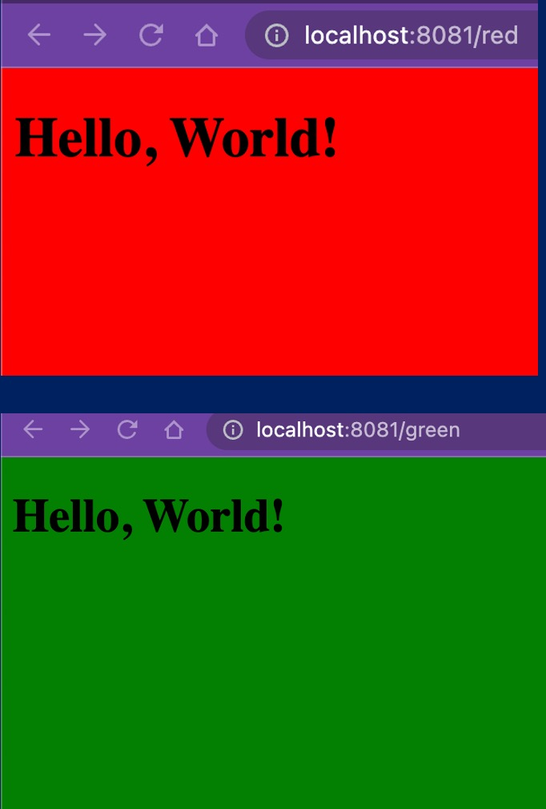

```
git clone https://github.com/Tuchsanai/devpot_week9.git
```


# go to Directory
```
cd devpot_week9/Lab3

```


# build Docker image with docker build 

```
docker build -t flask-docker-app . 

```


# docker run with -it option
```
docker run -p 8081:8081 -d --name container_red  -e APP_COLOR=red flask-docker-app
docker run -p 8085:8081 -d --name container_green  -e APP_COLOR=green flask-docker-app


```
