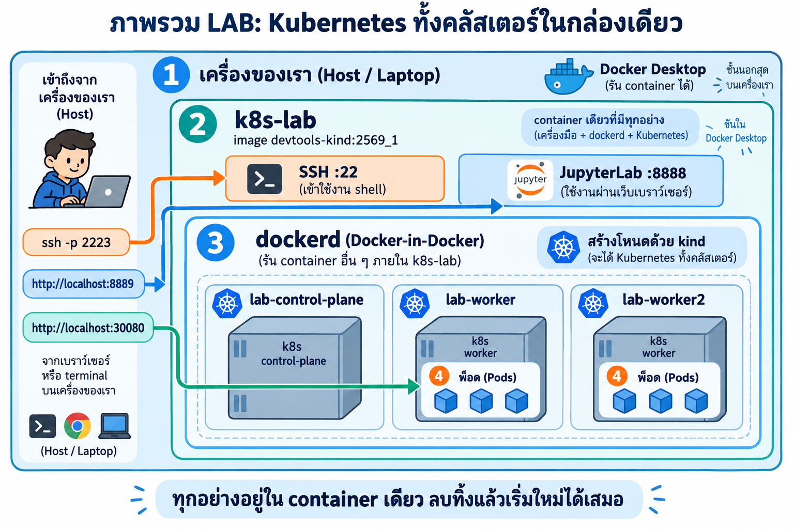
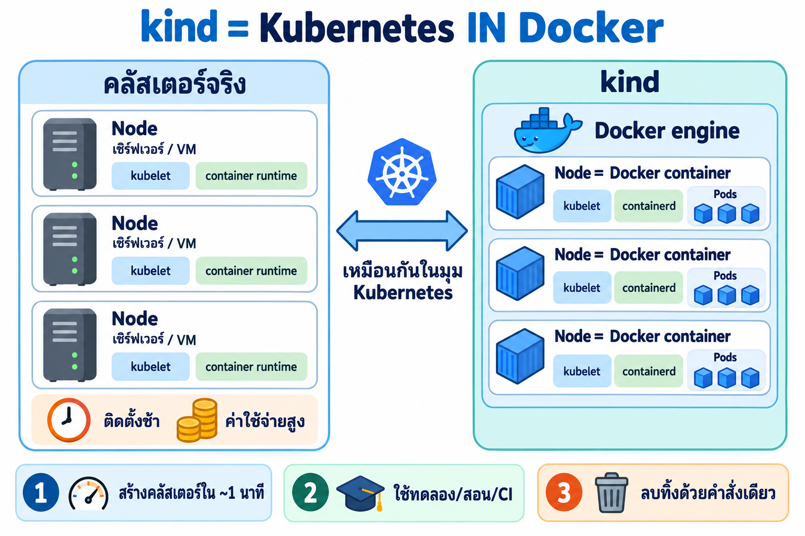
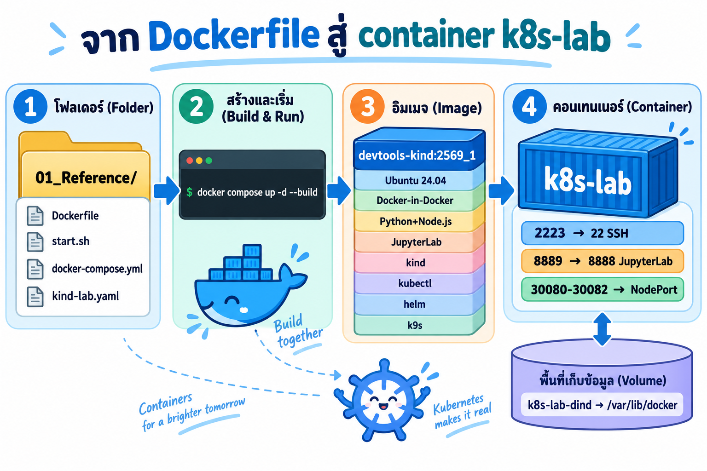
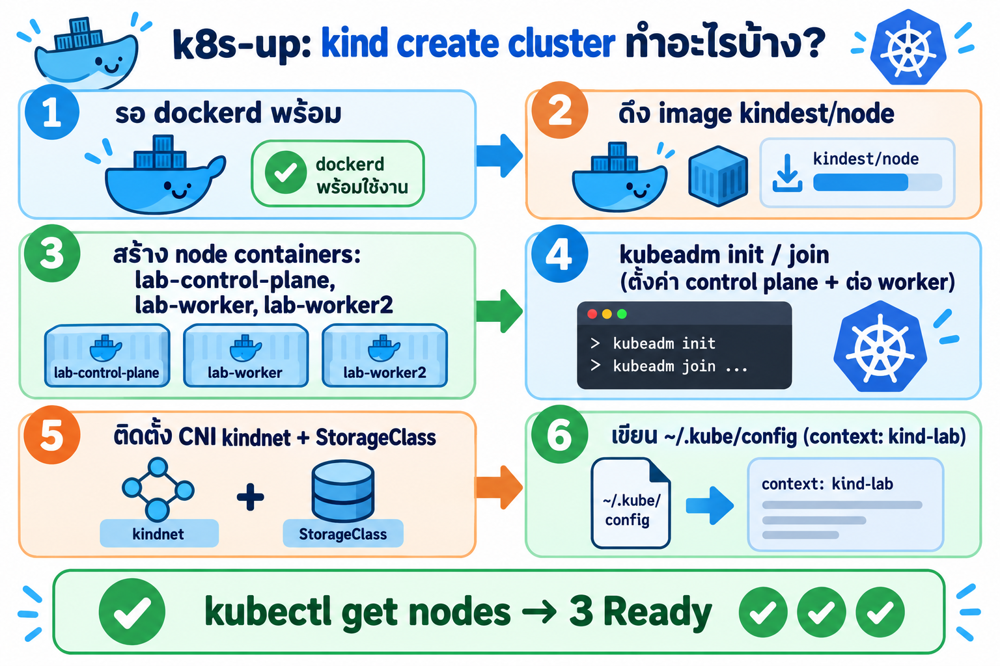
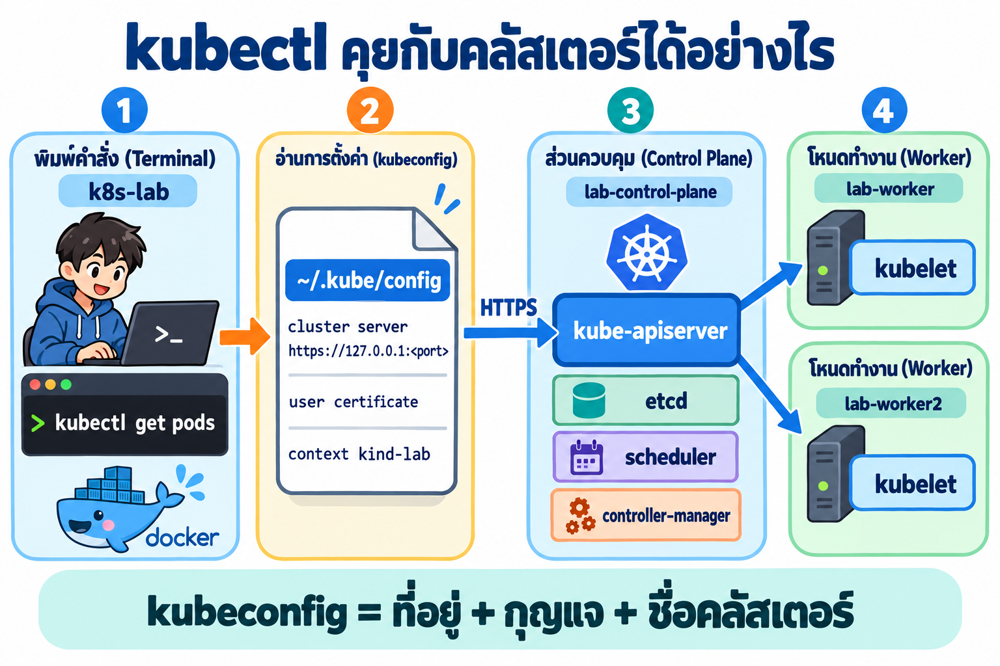
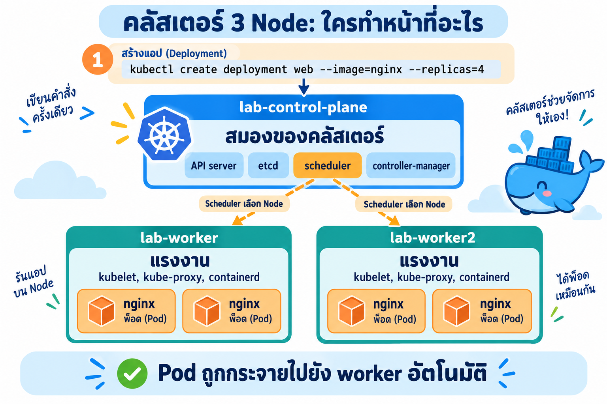
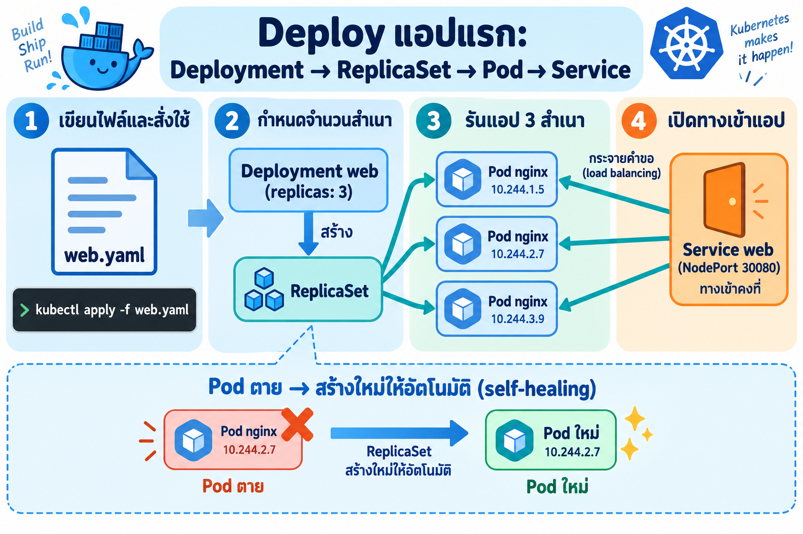
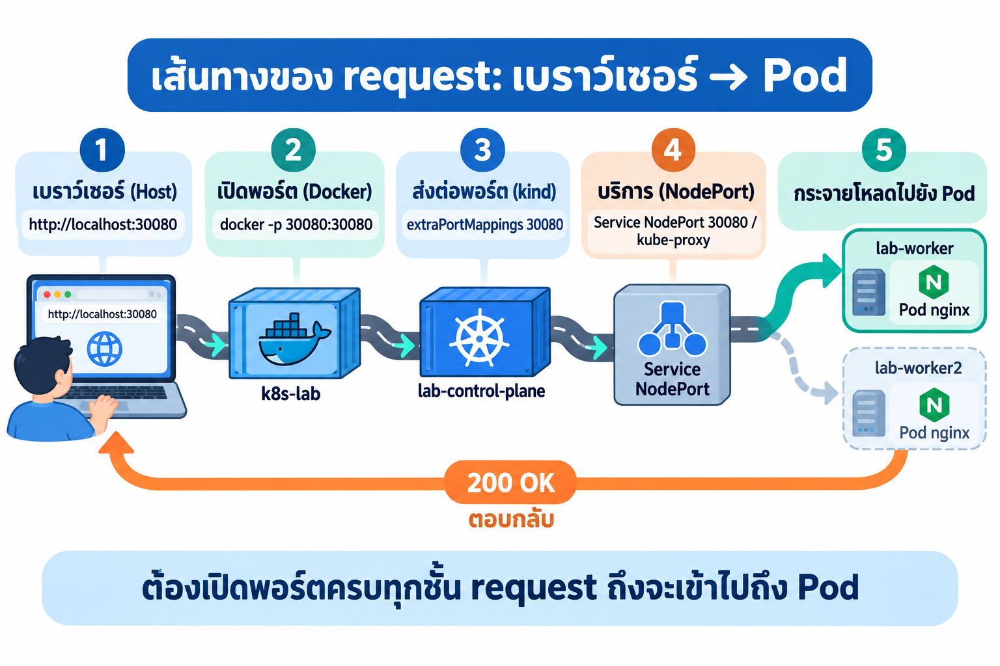
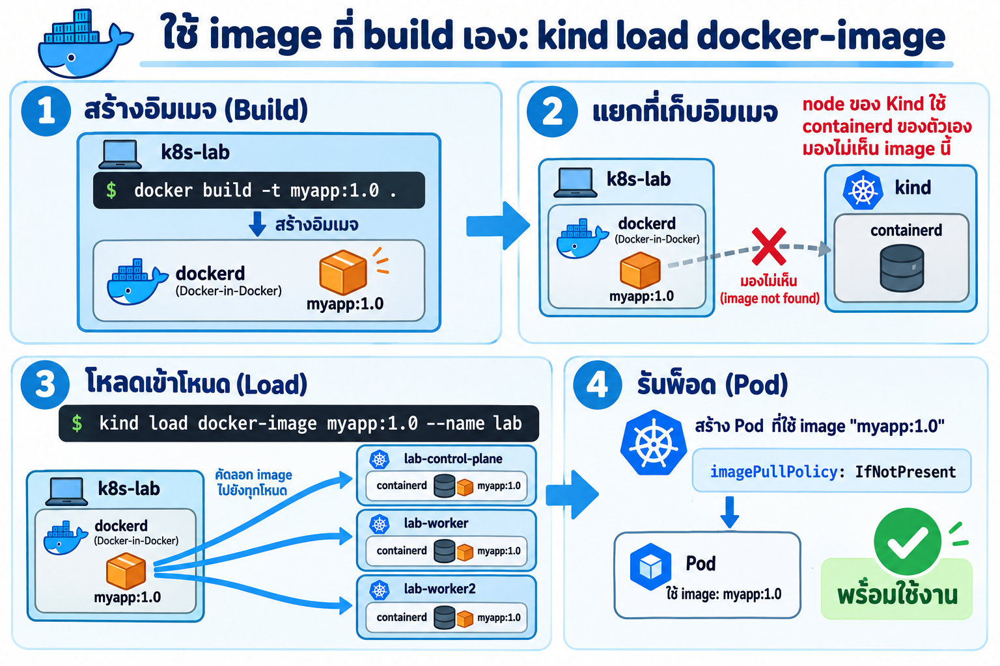
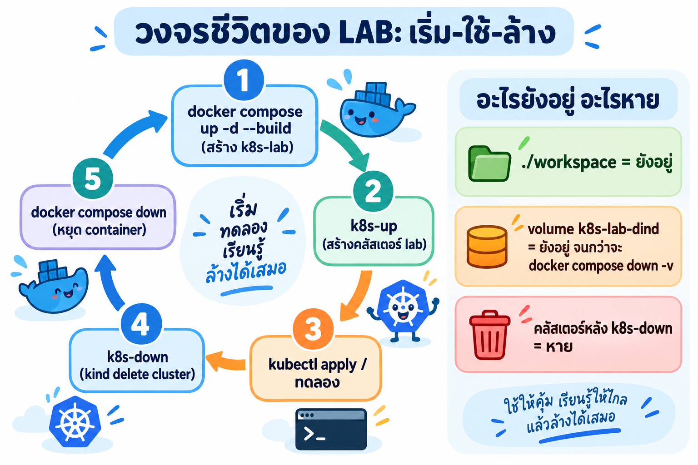

# Kubernetes Learning Container ด้วย kind (`k8s-lab`)

ต่อยอดจาก [DevTools Base Learning Container](../readme.md) (`00_Reference`) — ทุกอย่างของต้นแบบยังอยู่ครบ (Docker-in-Docker, Python, Node.js, JupyterLab, SSH)
แล้วเพิ่ม **kind / kubectl / helm / k9s** เพื่อสร้าง **Kubernetes ทั้งคลัสเตอร์ (1 control-plane + 2 worker) ไว้ใน container เดียว**

| หมวด | รายละเอียด |
|------|------------|
| **Base** | Ubuntu 24.04, timezone `Asia/Bangkok`, locale UTF-8 (เหมือน `00_Reference`) |
| **Docker-in-Docker** | docker-ce, containerd, buildx & compose plugins — `dockerd` ข้างในใช้สร้าง node ของ kind |
| **Python / Node.js** | python3, pip, venv — Node.js 22 LTS + npm/npx |
| **Kubernetes tools** | `kind` v0.33.0, `kubectl` v1.37.1, `helm` v4.3.0, `k9s` v0.51.0 (ดาวน์โหลดจาก official release + ตรวจ sha256) |
| **Node image** | `kindest/node:v1.37.0` (default ของ kind v0.33.0) = **Kubernetes v1.37.0** |
| **Cluster** | ชื่อ `lab` → context `kind-lab` — node: `lab-control-plane`, `lab-worker`, `lab-worker2` |
| **Ports (host → container)** | `2223` → 22 SSH, `8889` → 8888 JupyterLab, `30080-30082` → NodePort ของคลัสเตอร์ |
| **SSH login** | user `root` / password `passwd` หรือ key `Devtool_SSH/devtoolSSH` |
| **Image / Container** | image `devtools-kind:2569_1` (build เอง) — container `k8s-lab`, hostname `k8s-lab` |
| **Workdir** | `/workspace` (ตัวอย่าง manifest อยู่ที่ `/workspace/examples`) |
| **Shell** | `alias k=kubectl` + Tab completion ของ `kubectl` / `kind` / `helm` |

> ⚠️ รหัสผ่าน `passwd`, key ในโฟลเดอร์ `Devtool_SSH/` และ JupyterLab ที่ไม่มีรหัสผ่าน เป็นค่าเดียวกันทุกเครื่อง
> และ container รันด้วย `--privileged` — ใช้เพื่อการเรียน/ทดลองบนเครื่องตัวเองเท่านั้น **ไม่ควรเปิดพอร์ตออก internet**

> 💡 พอร์ตตั้งไว้ไม่ชนกับ container `devtools` ของ `00_Reference` (2222 / 8888) จึง **รันคู่กันบนเครื่องเดียวได้**

### สารบัญ

1. [ภาพรวม LAB และ kind คืออะไร](#1-ภาพรวม-lab-และ-kind-คืออะไร)
2. [Build & Run container](#2-build--run-container)
3. [เข้าใช้งาน container](#3-เข้าใช้งาน-container)
4. [สร้างคลัสเตอร์ด้วย `k8s-up`](#4-สร้างคลัสเตอร์ด้วย-k8s-up)
5. [kubectl และ kubeconfig](#5-kubectl-และ-kubeconfig)
6. [คลัสเตอร์หลาย node และการ schedule](#6-คลัสเตอร์หลาย-node-และการ-schedule)
7. [LAB 1 — Deploy แอปแรก](#7-lab-1--deploy-แอปแรก)
8. [LAB 2 — เส้นทางของ NodePort](#8-lab-2--เส้นทางของ-nodeport)
9. [LAB 3 — ใช้ image ที่ build เอง](#9-lab-3--ใช้-image-ที่-build-เอง)
10. [วงจรชีวิตของ LAB และการล้าง](#10-วงจรชีวิตของ-lab-และการล้าง)
11. [แบบฝึกหัดท้าย LAB](#11-แบบฝึกหัดท้าย-lab)
12. [Troubleshooting](#12-troubleshooting)
13. [คำสั่งที่ใช้บ่อย](#13-คำสั่งที่ใช้บ่อย)

---

# 1. ภาพรวม LAB และ kind คืออะไร



ภาพนี้มี 3 ชั้นซ้อนกัน: **(1) เครื่องของเรา** ที่รัน Docker Desktop → **(2) container `k8s-lab`** ที่มี SSH และ JupyterLab → **(3) `dockerd` ข้างใน** ที่ kind ใช้สร้าง node ทั้ง 3 ตัว
จากเครื่องของเราเข้าได้ 3 ทาง: `ssh -p 2223`, `http://localhost:8889` (JupyterLab) และ `http://localhost:30080` ที่วิ่งทะลุเข้าไปถึง Pod
ทุกอย่างอยู่ใน container เดียว ลบทิ้งแล้วเริ่มใหม่ได้เสมอ



**kind (Kubernetes IN Docker)** สร้าง "node" ของ Kubernetes เป็น **Docker container** แทนการใช้เซิร์ฟเวอร์หรือ VM จริง
แต่ละ node ยังมี `kubelet` + `containerd` และรัน Pod ได้เหมือนคลัสเตอร์จริง — ในมุมของ Kubernetes จึงไม่ต่างกัน
ข้อดีคือสร้างคลัสเตอร์ได้ในราว 1 นาที เหมาะกับการทดลอง/สอน/CI และลบทิ้งได้ด้วยคำสั่งเดียว

| ไฟล์ในโฟลเดอร์นี้ | หน้าที่ |
|------|---------|
| `Dockerfile` | สร้าง image `devtools-kind:2569_1` (ต้นแบบ + kind/kubectl/helm/k9s) |
| `start.sh` | entrypoint: ตั้ง cgroup → sshd → copy ตัวอย่าง → dockerd → (k8s-up ถ้าเปิด auto) → JupyterLab |
| `docker-compose.yml` | วิธีรันที่แนะนำ — ตั้งพอร์ต, volume, env ไว้ให้ครบ |
| `kind-lab.yaml` | config ของคลัสเตอร์ `lab` (copy ไปไว้ที่ `/etc/devtools/kind/kind-lab.yaml`) |
| `k8s-up` / `k8s-down` | script สร้าง / ลบคลัสเตอร์ (อยู่ใน `/usr/local/bin/`) |
| `examples/` | manifest ตัวอย่าง (copy ไป `/workspace/examples` ตอน container start ครั้งแรก) |
| `Devtool_SSH/` | key SSH สำเร็จรูปของ lab (`devtoolSSH`, `devtoolSSH.pub`) |

---

# 2. Build & Run container



เริ่มจากโฟลเดอร์ `01_Reference/` → สั่ง `docker compose up -d --build` → ได้ image `devtools-kind:2569_1` ที่ซ้อน layer ตั้งแต่ Ubuntu 24.04 จนถึง k9s
→ ได้ container `k8s-lab` ที่ map พอร์ต `2223→22`, `8889→8888`, `30080-30082` และเก็บข้อมูลของ `dockerd` ไว้ใน volume `k8s-lab-dind`

> image `devtools-kind:2569_1` **ไม่มีบน Docker Hub** — ต้อง build จาก `Dockerfile` ในโฟลเดอร์นี้เอง (ครั้งแรกใช้เวลาหลายนาที)

## 2.1 วิธีที่แนะนำ — docker compose

รันในโฟลเดอร์ `01_Reference/` (ที่มี `docker-compose.yml`):

```bash
docker compose up -d --build
```

| ส่วน | ความหมาย |
|------|----------|
| `up` | สร้างและเริ่ม service `k8s-lab` ตาม `docker-compose.yml` |
| `-d` | รันแบบ background |
| `--build` | build image `devtools-kind:2569_1` จาก `Dockerfile` ก่อนรัน (ครั้งต่อไปใช้ cache เร็วขึ้นมาก) |

สิ่งที่ `docker-compose.yml` ตั้งไว้ให้:

| ค่าใน compose | ความหมาย |
|------|----------|
| `container_name: k8s-lab` / `hostname: k8s-lab` | ชื่อ container และชื่อเครื่องใน prompt (`root@k8s-lab`) |
| `privileged: true` | **จำเป็น** สำหรับ Docker-in-Docker และ node ของ kind |
| `stdin_open` + `tty` | เทียบเท่า `-it` |
| `restart: unless-stopped` | เปิด Docker ใหม่แล้ว container กลับมาเอง (ยกเว้นเราสั่ง stop) |
| `${SSH_PORT:-2223}:22` | SSH (เปลี่ยนพอร์ตได้ด้วย env `SSH_PORT`) |
| `${JUPYTER_PORT:-8889}:8888` | JupyterLab (เปลี่ยนได้ด้วย env `JUPYTER_PORT`) |
| `30080-30082:30080-30082` | NodePort ของคลัสเตอร์ |
| `./workspace:/workspace` | งานของเราอยู่บนเครื่อง host — ลบ container แล้วไม่หาย |
| `k8s-lab-dind:/var/lib/docker` | named volume เก็บ image/container ของ `dockerd` ข้างใน (รวม `kindest/node` ~1GB) |
| `./Devtool_SSH:/etc/devtools/ssh` | โฟลเดอร์ key — `start.sh` ใส่ `.pub` ลง `authorized_keys` ให้ (ถ้าโฟลเดอร์ว่างจะสร้าง key คู่ใหม่ให้) |
| `JUPYTER_PASSWORD` | ว่าง (default) = JupyterLab ไม่ถามรหัสผ่าน |
| `KIND_AUTO_CREATE` | `0` (default) = ไม่สร้างคลัสเตอร์อัตโนมัติ, `1` = รัน `k8s-up` ให้ตอน start |
| `env_file` (`required: false`) | ไฟล์ `.env` ส่วนตัวของผู้สอนแบบ optional — **ไม่มีไฟล์ก็รันได้ปกติ** ไม่ต้องสร้าง |

ค่าที่ปรับได้ตั้งผ่าน environment หรือไฟล์ `.env` ข้าง `docker-compose.yml` ได้ เช่น:

```bash
SSH_PORT=2224 JUPYTER_PORT=8890 KIND_AUTO_CREATE=1 docker compose up -d --build
```

## 2.2 ทางเลือก — docker build + docker run

```bash
docker build -t devtools-kind:2569_1 .
docker run -dit --name k8s-lab --hostname k8s-lab --privileged -p 2223:22 -p 8889:8888 -p 30080-30082:30080-30082 -v "${PWD}/Devtool_SSH:/etc/devtools/ssh" devtools-kind:2569_1
```

| Flag | ความหมาย |
|------|----------|
| `-t devtools-kind:2569_1` | ตั้งชื่อ:tag ให้ image ที่ build |
| `-dit` | รันแบบ background พร้อม tty |
| `--name k8s-lab` | ตั้งชื่อ container |
| `--hostname k8s-lab` | ตั้งชื่อเครื่องใน container |
| `--privileged` | จำเป็นสำหรับ Docker-in-Docker และ kind node — **ขาดไม่ได้** |
| `-p 2223:22` | SSH ออกมาที่ host พอร์ต `2223` |
| `-p 8889:8888` | JupyterLab ออกมาที่ host พอร์ต `8889` |
| `-p 30080-30082:30080-30082` | NodePort 3 พอร์ตของคลัสเตอร์ |
| `-v "${PWD}/Devtool_SSH:/etc/devtools/ssh"` | map โฟลเดอร์ key (`${PWD}` ใช้ได้ทั้ง PowerShell และ Linux/macOS) |

> วิธีนี้ไม่ได้ map `./workspace` และไม่มี named volume `k8s-lab-dind` — สร้าง container ใหม่เมื่อไรต้องดึง `kindest/node` ใหม่ จึงแนะนำ compose มากกว่า

## 2.3 ตรวจว่า container พร้อม

```bash
docker ps --filter name=k8s-lab
docker logs k8s-lab
```

บรรทัด `[start.sh]` ที่ควรเห็น (กรณี map `Devtool_SSH/` ที่มี key อยู่แล้ว และไม่ได้เปิด auto-create):

```text
[start.sh] cgroup v2 controllers: cpuset cpu io memory hugetlb pids rdma
[start.sh] SSH key login enabled: /etc/devtools/ssh/devtoolSSH.pub
[start.sh] copied examples → /workspace/examples
[start.sh] sshd :22 | dockerd | jupyter lab :8888 (password: <none>) | NodePort :30080-30082 (kind auto-create: 0) — logs: /var/log/jupyter.log /var/log/dockerd.log /var/log/k8s-up.log
```

| บรรทัด | ความหมาย |
|------|----------|
| `cgroup v2 controllers: ...` | `start.sh` เปิด cgroup controller ให้ container ลูกแล้ว — **ต้องมี `memory` และ `io`** ไม่งั้น kind สร้าง node ไม่ได้ (ดู [Troubleshooting](#121-kind-สร้างคลัสเตอร์ไม่ได้-cgroup-v2-nesting)) |
| `SSH key login enabled` | ใส่ public key ลง `authorized_keys` แล้ว (ถ้าโฟลเดอร์ว่างจะเห็น `generated new SSH key pair` แทน) |
| `copied examples` | copy ไฟล์ตัวอย่างไป `/workspace/examples` (ครั้งแรกเท่านั้น ไม่ทับไฟล์ที่เราแก้ไว้) |
| บรรทัดสุดท้าย | sshd, dockerd, JupyterLab เริ่มแล้ว พร้อมบอกตำแหน่ง log |

---

# 3. เข้าใช้งาน container

ทุกช่องทางเข้าเป็น `root` เหมือนกัน จึงใช้ kubeconfig ชุดเดียวกัน — สร้างคลัสเตอร์จาก SSH แล้วไปใช้ต่อใน JupyterLab ได้

## 3.1 SSH ด้วย password

```bash
ssh -p 2223 root@localhost
# password: passwd
```

## 3.2 SSH ด้วย key

Linux/macOS ต้องตั้ง permission ของ private key ก่อน (ครั้งเดียว):

```bash
chmod 600 Devtool_SSH/devtoolSSH
ssh -i Devtool_SSH/devtoolSSH -p 2223 root@localhost
```

```text
$ ssh -i Devtool_SSH/devtoolSSH -p 2223 root@localhost
root@k8s-lab:~# hostname
k8s-lab
```

> ครั้งแรกที่เชื่อมต่อ ssh จะถามยืนยัน host key ให้พิมพ์ `yes` — รายละเอียดเพิ่มเติม (`scp`, รันคำสั่งเดียวแล้วออก) ดูได้ใน [readme ของ 00_Reference](../readme.md) แค่เปลี่ยนพอร์ตเป็น `2223`

## 3.3 JupyterLab

เปิดเบราว์เซอร์ที่ <http://localhost:8889> — เข้าได้เลยไม่ต้องใส่รหัสผ่าน เปิด **Terminal** ใน JupyterLab แล้วใช้ `kubectl` ได้ทันที

## 3.4 docker exec (ไม่ผ่าน SSH)

```bash
docker exec -it k8s-lab bash
```

| ช่องทาง | คำสั่ง / URL | เหมาะกับ |
|------|------|------|
| SSH password | `ssh -p 2223 root@localhost` | ทั่วไป, VS Code Remote-SSH |
| SSH key | `ssh -i Devtool_SSH/devtoolSSH -p 2223 root@localhost` | ไม่ต้องพิมพ์รหัสผ่าน |
| JupyterLab | <http://localhost:8889> | แก้ไฟล์ YAML + terminal บนเว็บ |
| docker exec | `docker exec -it k8s-lab bash` | เข้าเร็ว ๆ / แก้ปัญหาเมื่อ SSH ใช้ไม่ได้ |

---

# 4. สร้างคลัสเตอร์ด้วย `k8s-up`



`k8s-up` ทำงาน 6 ขั้น: รอ `dockerd` พร้อม → ดึง image `kindest/node` → สร้าง node container 3 ตัว → `kubeadm init/join`
→ ติดตั้ง CNI (`kindnet`) + StorageClass → เขียน `~/.kube/config` (context `kind-lab`)
ปลายทางคือ `kubectl get nodes` ได้ **3 node สถานะ Ready**

ใน container (SSH / terminal ของ JupyterLab / docker exec):

```bash
k8s-up
```

หรือสั่งจากเครื่อง host โดยไม่ต้องเข้า container:

```bash
docker compose exec k8s-lab k8s-up
```

ผลลัพธ์จริงจากการทดสอบ (ครั้งที่ทดสอบใช้เวลา `real 0m47.580s`):

```text
[k8s-up] dockerd ready
[k8s-up] kind create cluster --name lab --config /etc/devtools/kind/kind-lab.yaml
Creating cluster "lab" ...
 ✓ Ensuring node image (kindest/node:v1.37.0) 🖼️
 ✓ Preparing nodes 📦 📦 📦
 ✓ Writing configuration 📜
 ✓ Starting control-plane 🕹️
 ✓ Installing CNI 🔌
 ✓ Installing StorageClass 💾
 ✓ Joining worker nodes 🚜
Set kubectl context to "kind-lab"
You can now use your cluster with:

kubectl cluster-info --context kind-lab

[k8s-up] waiting for all nodes Ready (timeout 180s)...
node/lab-control-plane condition met
node/lab-worker condition met
node/lab-worker2 condition met

NAME                STATUS   ROLES           AGE   VERSION   INTERNAL-IP   EXTERNAL-IP   OS-IMAGE                       KERNEL-VERSION                             CONTAINER-RUNTIME
lab-control-plane   Ready    control-plane   22s   v1.37.0   172.19.0.2    <none>        Debian GNU/Linux 13 (trixie)   6.6.87.2-microsoft-standard-WSL2 (amd64)   containerd://2.3.4
lab-worker          Ready    <none>          12s   v1.37.0   172.19.0.3    <none>        Debian GNU/Linux 13 (trixie)   6.6.87.2-microsoft-standard-WSL2 (amd64)   containerd://2.3.4
lab-worker2         Ready    <none>          12s   v1.37.0   172.19.0.4    <none>        Debian GNU/Linux 13 (trixie)   6.6.87.2-microsoft-standard-WSL2 (amd64)   containerd://2.3.4

[k8s-up] cluster 'lab' พร้อมใช้งาน (kubectl context: kind-lab)
  kubectl get pods -A                       # ดู pod ทั้งหมด (alias: k get pods -A)
  kubectl apply -f /workspace/examples/web-deployment.yaml   # deploy nginx → http://localhost:30080
  docker build -t myapp:1.0 /workspace/examples/myapp           # build image myapp จากตัวอย่าง
  kind load docker-image myapp:1.0 --name lab   # นำ image จาก dockerd เข้า node
  k9s                                       # terminal UI ดู cluster
  k8s-down                                  # ลบคลัสเตอร์
  NodePort ที่ map ออก host: 30080 30081 30082
```

| ขั้นใน output | เกิดอะไรขึ้น |
|------|----------|
| `dockerd ready` | `k8s-up` รอ `docker info` ใช้ได้ (สูงสุด 90 วินาที) |
| `Ensuring node image` | ดึง `kindest/node:v1.37.0` — ครั้งแรกช้า (~1GB) ครั้งต่อไปใช้ของใน volume |
| `Preparing nodes 📦 📦 📦` | สร้าง container 3 ตัว = 3 node |
| `Starting control-plane` / `Joining worker nodes` | `kubeadm init` บน control-plane แล้ว `kubeadm join` worker ทั้งสอง |
| `Installing CNI` / `StorageClass` | ติดตั้งเครือข่าย Pod (`kindnet`) และ storage (`local-path-provisioner`) |
| `Set kubectl context to "kind-lab"` | เขียน `~/.kube/config` ให้ `kubectl` ใช้ได้ทันที |
| `condition met` × 3 | ทุก node Ready ภายใน 180 วินาที |

ถ้ามีคลัสเตอร์อยู่แล้ว `k8s-up` จะไม่สร้างซ้ำ (สั่งซ้ำได้อย่างปลอดภัย):

```text
[k8s-up] dockerd ready
[k8s-up] cluster 'lab' มีอยู่แล้ว — ข้ามการสร้าง (ลบด้วย k8s-down)
```

## 4.1 อ่าน `kind-lab.yaml` ทีละส่วน

```yaml
kind: Cluster
apiVersion: kind.x-k8s.io/v1alpha4
name: lab
nodes:
  - role: control-plane
    extraPortMappings:
      - containerPort: 30080
        hostPort: 30080
        listenAddress: "0.0.0.0"
        protocol: TCP
      - containerPort: 30081
        hostPort: 30081
        listenAddress: "0.0.0.0"
        protocol: TCP
      - containerPort: 30082
        hostPort: 30082
        listenAddress: "0.0.0.0"
        protocol: TCP
  - role: worker
  - role: worker
```

| ส่วน | ความหมาย |
|------|----------|
| `kind: Cluster` + `apiVersion: kind.x-k8s.io/v1alpha4` | ไฟล์ config ของ kind (ไม่ใช่ manifest ของ Kubernetes) |
| `name: lab` | ชื่อคลัสเตอร์ → node ชื่อ `lab-*`, kubectl context = `kind-lab` |
| `role: control-plane` | node "สมอง" — รัน apiserver, etcd, scheduler, controller-manager |
| `extraPortMappings` | เปิดพอร์ต 30080-30082 ของ node control-plane ออกมาที่ container `k8s-lab` (compose map ต่อไปที่ host อีกชั้น) |
| `listenAddress: "0.0.0.0"` | รับการเชื่อมต่อจากทุก interface ของ `k8s-lab` (ไม่ใช่แค่ 127.0.0.1) |
| `role: worker` × 2 | node สำหรับรันแอป → `lab-worker`, `lab-worker2` |
| (ไม่มี `image:`) | ไม่ pin node image → ใช้ default ของ kind v0.33.0 คือ `kindest/node:v1.37.0` |

## 4.2 ตัวเลือก env ของ `k8s-up`

| Env | Default | ใช้เมื่อ |
|------|------|------|
| `KIND_AUTO_CREATE` | `0` | ตั้งใน compose เป็น `1` → `start.sh` รัน `k8s-up` ให้เองตอน container start (ดู log: `tail -f /var/log/k8s-up.log`) |
| `KIND_NODE_IMAGE` | (ว่าง) | อยากได้ Kubernetes เวอร์ชันอื่น เช่น `KIND_NODE_IMAGE=kindest/node:<tag> k8s-up` |
| `KIND_CLUSTER_NAME` | `lab` | สร้างคลัสเตอร์ชื่ออื่น (context จะเป็น `kind-<ชื่อ>`) — ใช้ชื่อเดียวกันกับ `k8s-down` ด้วย |
| `KIND_CONFIG` | `/etc/devtools/kind/kind-lab.yaml` | ใช้ไฟล์ config ของตัวเอง |

```bash
# สร้างคลัสเตอร์อัตโนมัติตอน container start
KIND_AUTO_CREATE=1 docker compose up -d
docker compose exec k8s-lab tail -f /var/log/k8s-up.log
```

> คลัสเตอร์ที่สองจะใช้ `kind-lab.yaml` เดิมซึ่งจอง hostPort 30080-30082 ไว้แล้ว — ถ้าจะสร้างพร้อมกันสองคลัสเตอร์ต้องใช้ `KIND_CONFIG` ที่ไม่มี `extraPortMappings` ซ้ำกัน

---

# 5. kubectl และ kubeconfig



เมื่อพิมพ์ `kubectl get pods` ใน `k8s-lab` → kubectl อ่าน `~/.kube/config` (ที่อยู่ของ API server `https://127.0.0.1:<port>`, user certificate, context `kind-lab`)
→ ส่ง HTTPS ไปที่ `kube-apiserver` บน `lab-control-plane` → control plane สั่งงาน `kubelet` บน worker แต่ละตัว
สรุปสั้น ๆ: **kubeconfig = ที่อยู่ + กุญแจ + ชื่อคลัสเตอร์**

```bash
kubectl config current-context
kubectl get nodes
kubectl get pods -A
```

```text
kind-lab
NAME                STATUS   ROLES           AGE   VERSION
lab-control-plane   Ready    control-plane   22s   v1.37.0
lab-worker          Ready    <none>          12s   v1.37.0
lab-worker2         Ready    <none>          12s   v1.37.0
NAMESPACE            NAME                                        READY   STATUS    RESTARTS   AGE
kube-system          coredns-559f6c778d-g9dzs                    1/1     Running   0          13s
kube-system          coredns-559f6c778d-jscgl                    1/1     Running   0          13s
kube-system          etcd-lab-control-plane                      1/1     Running   0          22s
kube-system          kindnet-gdk2d                               1/1     Running   0          14s
kube-system          kindnet-nc222                               1/1     Running   0          13s
kube-system          kindnet-x5bwf                               1/1     Running   0          13s
kube-system          kube-apiserver-lab-control-plane            1/1     Running   0          20s
kube-system          kube-controller-manager-lab-control-plane   1/1     Running   0          20s
kube-system          kube-proxy-ccxkm                            1/1     Running   0          13s
kube-system          kube-proxy-l47dj                            1/1     Running   0          14s
kube-system          kube-proxy-lfmqx                            1/1     Running   0          13s
kube-system          kube-scheduler-lab-control-plane            1/1     Running   0          20s
local-path-storage   local-path-provisioner-75f7fc7dc5-svfxr     1/1     Running   0          13s
```

| Pod | หน้าที่ |
|------|----------|
| `kube-apiserver-lab-control-plane` | ประตูหน้าของคลัสเตอร์ — ทุกคำสั่ง `kubectl` วิ่งมาที่นี่ |
| `etcd-lab-control-plane` | ฐานข้อมูล key-value เก็บสถานะทั้งหมดของคลัสเตอร์ |
| `kube-scheduler-lab-control-plane` | เลือกว่า Pod ใหม่จะไปรันบน node ไหน |
| `kube-controller-manager-lab-control-plane` | รวม controller ที่คอยทำให้ "สถานะจริง = สถานะที่ต้องการ" (เช่น ReplicaSet) |
| `coredns-*` (2 ตัว) | DNS ภายในคลัสเตอร์ — ให้ Pod เรียก Service ด้วยชื่อได้ |
| `kindnet-*` (1 ตัวต่อ node) | CNI ของ kind — ทำเครือข่ายให้ Pod ข้าม node คุยกันได้ |
| `kube-proxy-*` (1 ตัวต่อ node) | ตั้งกฎเครือข่ายให้ Service / NodePort ส่งต่อไปยัง Pod |
| `local-path-provisioner-*` | สร้าง PersistentVolume จาก disk ของ node (StorageClass `standard`) |

> pod ที่ลงท้ายด้วย `-lab-control-plane` เป็น **static pod** ของ control plane, ส่วน `kindnet` และ `kube-proxy` มีครบทุก node (3 ตัว) เพราะเป็น DaemonSet

## 5.1 alias `k` และ Tab completion

ตั้งไว้ใน `/etc/bash.bashrc` แล้ว ใช้ได้ทั้ง SSH และ terminal ของ JupyterLab:

```bash
type k
complete -p k
```

```text
k is aliased to `kubectl'
complete -o default -F __start_kubectl k
```

```bash
k get po<Tab>          # เติมเป็น pods
k get pods -n kube-<Tab>
kind <Tab><Tab>        # completion ของ kind และ helm ก็มี
```

## 5.2 k9s — terminal UI

```bash
k9s
```

| ปุ่ม | ทำอะไร |
|------|----------|
| `:pods` / `:deploy` / `:svc` / `:nodes` | สลับไปดู resource ชนิดนั้น |
| `0` | ดูทุก namespace |
| `/` แล้วพิมพ์คำ | กรองรายการ |
| `l` / `d` | ดู logs / describe ของรายการที่เลือก |
| `Ctrl+d` | ลบรายการที่เลือก |
| `:q` หรือ `Ctrl+c` | ออก |

---

# 6. คลัสเตอร์หลาย node และการ schedule



`lab-control-plane` เป็น **สมองของคลัสเตอร์** (API server, etcd, scheduler, controller-manager) ส่วน `lab-worker` และ `lab-worker2` เป็น **แรงงาน** (kubelet, kube-proxy, containerd)
เมื่อสร้าง Deployment, **scheduler เลือก node** ให้แต่ละ Pod เอง Pod จึงถูกกระจายไปยัง worker อัตโนมัติ
(ภาพใช้ตัวอย่าง `--replicas=4` เพื่ออธิบายแนวคิด ส่วน LAB 1 ใช้ไฟล์ `web-deployment.yaml` ที่มี 3 replicas)

| Node | INTERNAL-IP (จาก output ของ `k8s-up`) | บทบาท | รัน Pod ของแอปเรา? |
|------|------|------|------|
| `lab-control-plane` | `172.19.0.2` | control-plane | ไม่ — มี taint กันไว้ให้ระบบเท่านั้น |
| `lab-worker` | `172.19.0.3` | worker | ใช่ |
| `lab-worker2` | `172.19.0.4` | worker | ใช่ |

คำสั่งดูว่า Pod ไปอยู่ node ไหน — เพิ่ม `-o wide` จะมีคอลัมน์ `IP` และ `NODE`:

```bash
kubectl get pods -o wide                    # pod ใน namespace default
kubectl get pods -A -o wide                 # ทุก namespace (เห็น kube-proxy/kindnet ครบทุก node)
kubectl describe node lab-control-plane | grep -i taints
docker ps --format '{{.Names}}'             # ใน k8s-lab: node ทั้ง 3 คือ container จริง ๆ
```

> ลองทำตามภาพได้: `kubectl create deployment demo --image=nginx:alpine --replicas=4` แล้ว `kubectl get pods -o wide` ดูการกระจาย เสร็จแล้วลบด้วย `kubectl delete deployment demo`
> ผลจริงของการ schedule จะเห็นใน LAB 1 ข้อ 7.2

---

# 7. LAB 1 — Deploy แอปแรก



เขียนไฟล์ YAML แล้ว `kubectl apply` → **Deployment** `web` (replicas: 3) สร้าง **ReplicaSet** → ReplicaSet สร้าง **Pod nginx 3 ตัว** แต่ละตัวได้ IP ของตัวเอง
→ **Service** `web` (NodePort 30080) เป็นทางเข้าคงที่และกระจาย request ไปยังทุก Pod
กรอบล่าง: ถ้า Pod ตาย ReplicaSet สร้างตัวใหม่ให้อัตโนมัติ (**self-healing**) — IP ในภาพเป็นตัวอย่าง

## 7.1 ไฟล์ `/workspace/examples/web-deployment.yaml`

```yaml
apiVersion: apps/v1
kind: Deployment
metadata:
  name: web
  labels:
    app: web
spec:
  replicas: 3
  selector:
    matchLabels:
      app: web
  template:
    metadata:
      labels:
        app: web
    spec:
      containers:
        - name: nginx
          image: nginx:alpine
          ports:
            - containerPort: 80
---
apiVersion: v1
kind: Service
metadata:
  name: web
spec:
  type: NodePort
  selector:
    app: web
  ports:
    - port: 80
      targetPort: 80
      nodePort: 30080
```

| ส่วน | ความหมาย |
|------|----------|
| `kind: Deployment` / `replicas: 3` | ต้องการ Pod 3 ตัวตลอดเวลา |
| `selector.matchLabels` + `template.metadata.labels` | Deployment ดูแล Pod ที่มี label `app: web` (ต้องตรงกัน) |
| `containers[].name: nginx` / `image: nginx:alpine` | container ชื่อ `nginx` ใช้ image `nginx:alpine` จาก Docker Hub |
| `---` | คั่นหลาย resource ในไฟล์เดียว |
| `kind: Service` / `type: NodePort` | เปิดทางเข้าจากนอกคลัสเตอร์ผ่านพอร์ตของ node |
| `selector: app: web` | Service ส่ง request ไปยัง Pod ที่มี label นี้ |
| `port` / `targetPort` / `nodePort` | พอร์ตของ Service (80) / พอร์ตของ container (80) / พอร์ตบน node (30080) |

## 7.2 apply และดูผล

```bash
cd /workspace/examples
kubectl apply -f web-deployment.yaml
kubectl rollout status deploy/web
kubectl get pods -l app=web -o wide
```

```text
deployment.apps/web created
service/web created
Waiting for deployment "web" rollout to finish: 0 of 3 updated replicas are available...
Waiting for deployment "web" rollout to finish: 1 of 3 updated replicas are available...
Waiting for deployment "web" rollout to finish: 2 of 3 updated replicas are available...
deployment "web" successfully rolled out
NAME                   READY   STATUS    RESTARTS   AGE   IP           NODE          NOMINATED NODE   READINESS GATES
web-75d8d959fb-ll8m9   1/1     Running   0          9s    10.244.1.2   lab-worker2   <none>           <none>
web-75d8d959fb-pprmc   1/1     Running   0          9s    10.244.1.3   lab-worker2   <none>           <none>
web-75d8d959fb-swrz7   1/1     Running   0          9s    10.244.2.2   lab-worker    <none>           <none>
```

| สังเกต | ความหมาย |
|------|----------|
| ชื่อ `web-75d8d959fb-xxxxx` | `web` = Deployment, `75d8d959fb` = hash ของ ReplicaSet, ท้ายสุด = สุ่มของแต่ละ Pod |
| คอลัมน์ `NODE` | scheduler กระจาย Pod ไป `lab-worker2` 2 ตัว และ `lab-worker` 1 ตัว — ไม่มีตัวไหนอยู่บน control-plane |
| คอลัมน์ `IP` | `10.244.1.x` อยู่บน node หนึ่ง, `10.244.2.x` อีก node — แต่ละ node ได้ช่วง IP ของ Pod คนละช่วง |

> ชื่อ Pod, IP และ node ที่ได้บนเครื่องเราจะไม่ตรงกับตัวอย่าง — เป็นเรื่องปกติ

## 7.3 Self-healing — ลบ Pod แล้วเกิดใหม่

ลบ Pod หนึ่งตัว (เปลี่ยนชื่อให้ตรงกับที่เห็นในเครื่องตัวเอง) แล้วดูอีกครั้ง:

```bash
kubectl delete pod web-75d8d959fb-ll8m9
kubectl get pods -l app=web
```

```text
pod "web-75d8d959fb-ll8m9" deleted from default namespace
NAME                   READY   STATUS    RESTARTS   AGE
web-75d8d959fb-gst4g   1/1     Running   0          5s
web-75d8d959fb-pprmc   1/1     Running   0          19s
web-75d8d959fb-swrz7   1/1     Running   0          19s
```

Pod `...-ll8m9` หายไป และมี `...-gst4g` (อายุ 5s) เกิดขึ้นแทน — ReplicaSet เห็นว่าเหลือ 2 จากที่ต้องการ 3 จึงสร้างเพิ่มเอง

> ไม่อยาก copy ชื่อเอง: `kubectl delete pod $(kubectl get pods -l app=web -o jsonpath='{.items[0].metadata.name}')`

## 7.4 Pod เดี่ยว — `hello-pod.yaml` และ `kubectl logs`

```yaml
apiVersion: v1
kind: Pod
metadata:
  name: hello
  labels:
    app: hello
spec:
  restartPolicy: Never
  containers:
    - name: hello
      image: busybox:1.36
      command: ["sh", "-c", "echo Hello from Kubernetes pod $(hostname); sleep 3600"]
```

```bash
kubectl apply -f hello-pod.yaml
kubectl wait --for=condition=Ready pod/hello --timeout=120s
kubectl logs hello
```

```text
pod/hello created
pod/hello condition met
Hello from Kubernetes pod hello
```

| เทียบ | Pod เดี่ยว (`hello`) | Pod ของ Deployment (`web-*`) |
|------|------|------|
| ใครดูแล | ไม่มี controller | ReplicaSet |
| ลบแล้ว | **หายไปเลย** ไม่ถูกสร้างใหม่ | ถูกสร้างใหม่อัตโนมัติ |
| `kubectl logs` | แสดง stdout ของ container (`echo ...`) | ใช้ได้เหมือนกัน เช่น `kubectl logs deploy/web` |

```bash
kubectl delete pod hello          # ลบ pod เดี่ยวเมื่อเลิกใช้
```

---

# 8. LAB 2 — เส้นทางของ NodePort



request จากเบราว์เซอร์ `http://localhost:30080` ผ่าน 5 ชั้น: Docker map พอร์ตเข้า `k8s-lab` → kind `extraPortMappings` ส่งต่อเข้า `lab-control-plane`
→ Service NodePort / kube-proxy → กระจายไปยัง Pod nginx บน `lab-worker` หรือ `lab-worker2` แล้วตอบ **200 OK** กลับ
**ต้องเปิดพอร์ตครบทุกชั้น** request จึงจะเข้าไปถึง Pod

## 8.1 ทดสอบจากใน container `k8s-lab`

```bash
curl -s -o /dev/null -w 'curl localhost:30080 -> %{http_code}\n' http://localhost:30080
```

```text
curl localhost:30080 -> 200
```

ดูหน้าเว็บเต็ม ๆ ด้วย `curl -s http://localhost:30080` (จะเห็น HTML "Welcome to nginx!")

## 8.2 ทดสอบจากเครื่อง host

เปิดเบราว์เซอร์ที่ <http://localhost:30080> บนเครื่องของเรา — ควรเห็นหน้า **Welcome to nginx!**
(หรือใช้คำสั่ง `curl` เดียวกับข้อ 8.1 บน host ก็ได้ ควรได้ `200`)

## 8.3 พอร์ตทุกชั้น

| ชั้น | กำหนดที่ | พอร์ต |
|------|------|------|
| 1. เบราว์เซอร์บน host | — | `localhost:30080` |
| 2. host → container `k8s-lab` | `docker-compose.yml` (`30080-30082:30080-30082`) / `docker run -p` | `30080` → `30080` |
| 3. `k8s-lab` → node `lab-control-plane` | `kind-lab.yaml` (`extraPortMappings`) | `hostPort 30080` → `containerPort 30080` |
| 4. node → Service | `web-deployment.yaml` (`nodePort: 30080`) — kube-proxy เปิดพอร์ตนี้ทุก node | `30080` → Service `port 80` |
| 5. Service → Pod | `targetPort: 80` | Pod nginx `containerPort 80` |

| NodePort ที่เปิดไว้ | ใช้ใน |
|------|------|
| `30080` | LAB 1–2: Service `web` |
| `30081` | LAB 3: Service `myapp` |
| `30082` | ว่าง — ใช้ในแบบฝึกหัด helm |

> Service NodePort อื่นนอกช่วง 30080-30082 ใช้ได้ภายในคลัสเตอร์ แต่เข้าจาก host ไม่ได้ เพราะไม่ได้ map ในชั้นที่ 2 และ 3

---

# 9. LAB 3 — ใช้ image ที่ build เอง



(1) `docker build` สร้าง `myapp:1.0` ไว้ใน `dockerd` ของ `k8s-lab` → (2) แต่ node ของ kind ใช้ **containerd ของตัวเอง** จึง**มองไม่เห็น** image นี้
→ (3) `kind load docker-image` คัดลอก image เข้า containerd ของ**ทุก node** → (4) Pod ที่ตั้ง `imagePullPolicy: IfNotPresent` ใช้ image ที่โหลดไว้ได้ทันที

ไฟล์ใน `/workspace/examples/myapp/`:

```dockerfile
FROM nginx:alpine
COPY index.html /usr/share/nginx/html/index.html
```

| ไฟล์ | เนื้อหา |
|------|------|
| `Dockerfile` | nginx:alpine + หน้า `index.html` ของเรา |
| `index.html` | `<h1>Hello from myapp:1.0</h1>` |
| `myapp.yaml` | Deployment `myapp` (replicas 2, image `myapp:1.0`, `imagePullPolicy: IfNotPresent`) + Service NodePort `30081` |

## 9.1 Build → Load → Deploy

```bash
cd /workspace/examples/myapp
docker build -t myapp:1.0 .
kind load docker-image myapp:1.0 --name lab
kubectl apply -f myapp.yaml
kubectl rollout status deploy/myapp
```

```text
Image: "myapp:1.0" with ID "sha256:508da439cdb6fb6d91264a2c11e06871f3589c31c8300bcee886a15c4bc60a29" not yet present on node "lab-control-plane", loading...
Image: "myapp:1.0" with ID "sha256:508da439cdb6fb6d91264a2c11e06871f3589c31c8300bcee886a15c4bc60a29" not yet present on node "lab-worker", loading...
Image: "myapp:1.0" with ID "sha256:508da439cdb6fb6d91264a2c11e06871f3589c31c8300bcee886a15c4bc60a29" not yet present on node "lab-worker2", loading...
deployment.apps/myapp created
service/myapp created
Waiting for deployment "myapp" rollout to finish: 0 of 2 updated replicas are available...
Waiting for deployment "myapp" rollout to finish: 1 of 2 updated replicas are available...
deployment "myapp" successfully rolled out
```

| คำสั่ง | ทำอะไร |
|------|----------|
| `docker build -t myapp:1.0 .` | build image ลง `dockerd` ใน `k8s-lab` (node ของ kind ยังไม่เห็น) |
| `kind load docker-image myapp:1.0 --name lab` | copy image เข้า node ทั้ง 3 ของคลัสเตอร์ `lab` — output บอกทีละ node ว่า `loading...` |
| `kubectl apply -f myapp.yaml` | สร้าง Deployment + Service |
| `kubectl rollout status deploy/myapp` | รอจน Pod ครบ 2 ตัว |

## 9.2 ทดสอบ

```bash
kubectl get pods -l app=myapp -o wide
curl -s http://localhost:30081
```

```text
NAME                     READY   STATUS    RESTARTS   AGE   IP           NODE          NOMINATED NODE   READINESS GATES
myapp-84dd768d45-k6csq   1/1     Running   0          19s   10.244.1.6   lab-worker2   <none>           <none>
myapp-84dd768d45-wrlp7   1/1     Running   0          19s   10.244.2.3   lab-worker    <none>           <none>
<!doctype html>
<html>
  <head><meta charset="utf-8"><title>myapp</title></head>
  <body><h1>Hello from myapp:1.0</h1></body>
</html>
```

จากเครื่อง host เปิด <http://localhost:30081> จะเห็น **Hello from myapp:1.0**

> ถ้า `curl` ทันทีหลัง rollout แล้วได้ผลว่าง ให้รอ 2-3 วินาทีแล้วลองใหม่ (Service/kube-proxy อาจยังอัปเดตกฎไม่เสร็จ)

> ลืม `kind load` → Pod จะค้างที่ `ErrImagePull` / `ImagePullBackOff` เพราะ node ไปหา `myapp:1.0` บน Docker Hub ไม่เจอ (ดู [12.5](#125-imagepullbackoff-กับ-image-ที่-build-เอง))

---

# 10. วงจรชีวิตของ LAB และการล้าง



วงจร 5 ขั้น: `docker compose up -d --build` → `k8s-up` → `kubectl apply` / ทดลอง → `k8s-down` → `docker compose down` แล้ววนกลับมาเริ่มใหม่ได้เสมอ
กล่องขวาสรุปว่า `./workspace` **ยังอยู่**, volume `k8s-lab-dind` **ยังอยู่จนกว่าจะ** `docker compose down -v` และคลัสเตอร์หลัง `k8s-down` **หาย**

## 10.1 ลบคลัสเตอร์ — `k8s-down`

```bash
k8s-down
kind get clusters
```

```text
Deleting cluster "lab" ...
Deleted nodes: ["lab-control-plane" "lab-worker" "lab-worker2"]
No kind clusters found.
```

อยากเริ่มคลัสเตอร์ใหม่สะอาด ๆ ก็แค่ `k8s-up` อีกครั้ง (ไม่ต้องดึง `kindest/node` ใหม่ เพราะยังอยู่ใน volume)

## 10.2 หยุด / ลบ container

```bash
docker compose down        # หยุดและลบ container k8s-lab (เก็บ volume ไว้)
docker compose down -v     # ลบ container + volume k8s-lab-dind (ล้างทุก image ใน dockerd ข้างใน)
```

> แนะนำสั่ง `k8s-down` ก่อน `docker compose down` — kubeconfig (`/root/.kube/config`) อยู่ใน container ไม่ได้อยู่ใน volume
> ถ้าลืมแล้ว `kubectl` ใช้ไม่ได้หลัง up ใหม่ ให้สั่ง `k8s-down` แล้ว `k8s-up` อีกครั้ง

## 10.3 อะไรยังอยู่ / อะไรหาย

| สิ่งของ | `k8s-down` | `docker compose down` | `docker compose down -v` |
|------|:---:|:---:|:---:|
| คลัสเตอร์ `lab` (node, Pod, Service) | ❌ หาย | ⚠️ ควร `k8s-down` ก่อน | ❌ หาย |
| `./workspace` บน host (รวม `examples/` ที่แก้ไว้) | ✅ อยู่ | ✅ อยู่ | ✅ อยู่ |
| volume `k8s-lab-dind` (`kindest/node`, `myapp:1.0`, image อื่นใน dockerd) | ✅ อยู่ | ✅ อยู่ | ❌ หาย |
| image `devtools-kind:2569_1` บนเครื่อง host | ✅ อยู่ | ✅ อยู่ | ✅ อยู่ (ลบเองด้วย `docker rmi devtools-kind:2569_1`) |
| `Devtool_SSH/` บน host | ✅ อยู่ | ✅ อยู่ | ✅ อยู่ |

> image ที่ `kind load` เข้า node อยู่ใน node container — `k8s-down` แล้วสร้างคลัสเตอร์ใหม่ต้อง `kind load` ใหม่ (แต่ `myapp:1.0` ใน dockerd ยังอยู่ ไม่ต้อง build ใหม่)

---

# 11. แบบฝึกหัดท้าย LAB

เริ่มจากสถานะหลังทำ LAB 1–3 (มี Deployment `web` และ `myapp` อยู่)

### ข้อ 1 — Scale

เพิ่ม `web` เป็น 5 replicas ดูว่า Pod ใหม่ไปอยู่ node ไหน แล้วลดกลับเหลือ 2

<details>
<summary>เฉลย</summary>

```bash
kubectl scale deployment web --replicas=5
kubectl get pods -l app=web -o wide
kubectl scale deployment web --replicas=2
kubectl get deploy web
```

หรือแก้ `replicas:` ใน `web-deployment.yaml` แล้ว `kubectl apply -f web-deployment.yaml` (แบบ declarative)
</details>

### ข้อ 2 — Rolling update และ rollback

เปลี่ยน image ของ `web` จาก `nginx:alpine` เป็น `nginx:1.27-alpine` ดูการ rollout แล้วย้อนกลับ

<details>
<summary>เฉลย</summary>

```bash
kubectl set image deployment/web nginx=nginx:1.27-alpine
kubectl rollout status deployment/web
kubectl get pods -l app=web               # ชื่อ Pod เปลี่ยน (ReplicaSet ใหม่)
kubectl rollout history deployment/web
kubectl rollout undo deployment/web
kubectl get deploy web -o jsonpath='{.spec.template.spec.containers[0].image}{"\n"}'   # กลับเป็น nginx:alpine
```

`nginx=` คือชื่อ container ใน `web-deployment.yaml` (`containers[].name: nginx`)
</details>

### ข้อ 3 — ติดตั้ง chart ด้วย helm แล้วเปิดที่ NodePort 30082

<details>
<summary>เฉลย</summary>

```bash
cd /workspace
helm create demo                       # สร้าง chart ตัวอย่าง (nginx) ในโฟลเดอร์ demo/
helm install demo ./demo
helm list
kubectl get pods,svc -l app.kubernetes.io/instance=demo
kubectl patch svc demo -p '{"spec":{"type":"NodePort","ports":[{"port":80,"nodePort":30082}]}}'
curl -s -o /dev/null -w '%{http_code}\n' http://localhost:30082
helm uninstall demo
```

เปิด <http://localhost:30082> จาก host ได้ด้วย (ก่อน `helm uninstall`)
</details>

### ข้อ 4 — สำรวจคลัสเตอร์ด้วย k9s

เปิด k9s ดู Pod ทุก namespace, กรองเฉพาะ `web`, ดู log ของ Pod หนึ่งตัว แล้วลบ Pod นั้นดู self-healing

<details>
<summary>เฉลย</summary>

```bash
k9s
```

1. พิมพ์ `:pods` แล้ว Enter → กด `0` ดูทุก namespace
2. กด `/` พิมพ์ `web` แล้ว Enter เพื่อกรอง
3. เลือก Pod แล้วกด `l` ดู log (กด `Esc` กลับ), กด `d` ดู describe
4. กด `Ctrl+d` เพื่อลบ Pod → ยืนยัน → ดู Pod ใหม่เกิดขึ้นแทน
5. `:q` เพื่อออก
</details>

### ข้อ 5 — myapp:2.0

แก้ `index.html` เป็น `Hello from myapp:2.0` build เป็น `myapp:2.0` แล้วอัปเดต Deployment `myapp`

<details>
<summary>เฉลย</summary>

```bash
cd /workspace/examples/myapp
sed -i 's/myapp:1.0/myapp:2.0/' index.html
docker build -t myapp:2.0 .
kind load docker-image myapp:2.0 --name lab          # ห้ามลืม!
kubectl set image deployment/myapp myapp=myapp:2.0
kubectl rollout status deployment/myapp
curl -s http://localhost:30081
```

ถ้าข้าม `kind load` จะเห็น `ImagePullBackOff` — ลอง `kubectl rollout undo deployment/myapp` เพื่อย้อนกลับ
</details>

---

# 12. Troubleshooting

## 12.1 kind สร้างคลัสเตอร์ไม่ได้ (cgroup v2 nesting)

อาการ — `k8s-up` ล้มที่ขั้น `Preparing nodes`:

```text
 ✗ Preparing nodes 📦 📦 📦
Deleted nodes: ["lab-control-plane" "lab-worker2" "lab-worker"]
ERROR: failed to create cluster: could not find a log line that matches "Reached target .*Multi-User System.*|detected cgroup v1"
```

และใน log ของ node จะเห็น `Failed to create /init.scope control group: Structure needs cleaning`

**สาเหตุ:** systemd ใน kind node ต้องใช้ cgroup controller `memory` และ `io` — บน cgroup v2 ถ้า `dockerd` เริ่มทั้งที่ยังมี process อยู่ใน root cgroup ของ container
cgroup จะกลายเป็นแบบ threaded และเปิด `memory`/`io` ไม่ได้อีกเลย `start.sh` จึงย้าย process ไป `/sys/fs/cgroup/init` และเปิด controller ทั้งหมด **ก่อน** เริ่ม sshd/dockerd ให้แล้ว

ตรวจ:

```bash
docker logs k8s-lab | grep cgroup
```

```text
[start.sh] cgroup v2 controllers: cpuset cpu io memory hugetlb pids rdma
```

ถ้า **ไม่เห็น `memory` / `io`** (เช่นเห็นแค่ `cpuset cpu pids`) ให้ลบ container แล้วสร้างใหม่ — **การ restart `dockerd` อย่างเดียวไม่ช่วย** เพราะ cgroup เสียไปแล้ว:

```bash
docker rm -f k8s-lab
docker compose up -d          # หรือคำสั่ง docker run ในข้อ 2.2
```

## 12.2 ลืม `--privileged`

`k8s-up` รอ `dockerd` ไม่ไหว:

```text
[k8s-up] ERROR: dockerd ไม่พร้อมภายใน 90 วินาที — ดู log ที่ /var/log/dockerd.log
[k8s-up]        (container ต้องรันด้วย privileged: true จึงจะใช้ Docker-in-Docker ได้)
```

แก้: `docker rm -f k8s-lab` แล้วรันใหม่ด้วย `--privileged` (compose ตั้ง `privileged: true` ไว้แล้ว) — ดูรายละเอียดได้ที่ `cat /var/log/dockerd.log`

## 12.3 พอร์ตชน (`port is already allocated`)

| พอร์ต | วิธีแก้ |
|------|------|
| SSH `2223` / JupyterLab `8889` | เปลี่ยนด้วย env: `SSH_PORT=2224 JUPYTER_PORT=8890 docker compose up -d` (หรือใส่ในไฟล์ `.env`) |
| NodePort `30080-30082` | ต้องว่างบน host — ปิดโปรแกรม/container อื่นที่ใช้พอร์ตนี้ (ดูด้วย `docker ps`) หรือแก้ทั้ง `docker-compose.yml`, `kind-lab.yaml` และ `nodePort` ใน manifest ให้ตรงกัน |

## 12.4 `docker build` บน Docker Desktop: `error getting credentials`

เกิดจาก `credsStore` ใน `~/.docker/config.json` ชี้ไปที่ credential helper ที่เรียกไม่ได้ (พบบ่อยใน WSL) — แก้ได้ 2 ทาง:

1. แก้ `~/.docker/config.json` ให้ `credsStore` ตรงกับ helper ที่มีจริงบนเครื่อง หรือลบบรรทัด `"credsStore"` ออก
2. ใช้ config ว่างชั่วคราวเฉพาะคำสั่งนี้ (image ที่ build เป็น public อยู่แล้ว ไม่ต้อง login):

```bash
mkdir -p /tmp/docker-nocreds && echo '{}' > /tmp/docker-nocreds/config.json
DOCKER_CONFIG=/tmp/docker-nocreds docker compose up -d --build
```

## 12.5 `ImagePullBackOff` กับ image ที่ build เอง

```bash
kubectl get pods -l app=myapp
kubectl describe pod <ชื่อ-pod> | tail       # ดู Events: Failed to pull image "myapp:1.0"
```

สาเหตุคือลืม `kind load` (หรือสร้างคลัสเตอร์ใหม่หลัง load) — แก้:

```bash
kind load docker-image myapp:1.0 --name lab
kubectl rollout restart deployment/myapp
```

อย่าลืม `imagePullPolicy: IfNotPresent` และอย่าใช้ tag `latest` (Kubernetes จะพยายามดึงจาก registry ทุกครั้ง)

## 12.6 `k8s-up` ครั้งแรกช้ามาก

ขั้น `Ensuring node image` ต้องดึง `kindest/node:v1.37.0` (~1GB) — ช้าแค่ครั้งแรกเท่านั้น
image ถูกเก็บใน volume `k8s-lab-dind` ครั้งต่อไป (รวมถึงหลัง `docker compose down`) จะเร็วขึ้นมาก — **อย่าใช้ `down -v` ถ้าไม่จำเป็น**
ระหว่างรอดูความคืบหน้าได้ที่ terminal ที่รัน `k8s-up` หรือ `/var/log/k8s-up.log` (ถ้าใช้ `KIND_AUTO_CREATE=1`)

## 12.7 อื่น ๆ

| อาการ | แก้ |
|------|------|
| `kubectl`: `connection refused` / `current-context is not set` | ยังไม่ได้ `k8s-up` หรือเพิ่งสร้าง container ใหม่ → `kind get clusters` แล้ว `k8s-up` (ถ้ามีคลัสเตอร์แต่ kubectl ใช้ไม่ได้ ให้ `k8s-down` แล้ว `k8s-up`) |
| ไม่เจอ `/workspace/examples` | `start.sh` copy ให้เฉพาะเมื่อยังไม่มีโฟลเดอร์นี้ — ถ้าลบไปแล้ว: `cp -r /opt/k8s-lab/examples /workspace/examples` |
| SSH key ถูกปฏิเสธ (`UNPROTECTED PRIVATE KEY FILE`) | `chmod 600 Devtool_SSH/devtoolSSH` บน Linux/macOS |
| เปิด `localhost:30080` แล้วไม่ขึ้น | ตรวจทีละชั้นตามตารางข้อ 8.3: `docker ps` (พอร์ต host), `kubectl get svc web` (NodePort), `kubectl get pods -l app=web` (Running) |

---

# 13. คำสั่งที่ใช้บ่อย

**บนเครื่อง host** (ในโฟลเดอร์ `01_Reference/`)

| คำสั่ง | ทำอะไร |
|------|------|
| `docker compose up -d --build` | build + รัน container `k8s-lab` |
| `docker compose exec k8s-lab k8s-up` | สร้างคลัสเตอร์จาก host |
| `docker compose exec k8s-lab k8s-down` | ลบคลัสเตอร์จาก host |
| `docker logs k8s-lab` | ดู log ตอน start (`[start.sh] ...`) |
| `docker exec -it k8s-lab bash` | เข้า shell โดยไม่ผ่าน SSH |
| `ssh -p 2223 root@localhost` | SSH (password `passwd`) |
| `ssh -i Devtool_SSH/devtoolSSH -p 2223 root@localhost` | SSH ด้วย key |
| `docker compose down` | หยุด/ลบ container (เก็บ volume) |
| `docker compose down -v` | ลบ container + volume `k8s-lab-dind` |

**ใน container `k8s-lab`**

| คำสั่ง | ทำอะไร |
|------|------|
| `k8s-up` / `k8s-down` | สร้าง / ลบคลัสเตอร์ `lab` |
| `kind get clusters` | ดูรายชื่อคลัสเตอร์ |
| `kubectl config current-context` | ดู context ปัจจุบัน (`kind-lab`) |
| `kubectl get nodes -o wide` | ดู node ทั้งหมด |
| `kubectl get pods -A` | ดู Pod ทุก namespace |
| `kubectl get pods -o wide` | ดูว่า Pod อยู่ node ไหน |
| `kubectl apply -f <file>.yaml` | สร้าง/อัปเดต resource จากไฟล์ |
| `kubectl delete -f <file>.yaml` | ลบ resource ตามไฟล์ |
| `kubectl rollout status deploy/<ชื่อ>` | รอจน Deployment พร้อม |
| `kubectl describe pod <ชื่อ>` | ดูรายละเอียด + Events (หาสาเหตุ error) |
| `kubectl logs <pod>` | ดู log ของ Pod |
| `kubectl scale deploy/<ชื่อ> --replicas=N` | ปรับจำนวน Pod |
| `kind load docker-image <image> --name lab` | โหลด image จาก dockerd เข้า node |
| `helm list -A` | ดู release ของ helm ทั้งหมด |
| `k9s` | terminal UI ดูคลัสเตอร์ |
| `k` | alias ของ `kubectl` (กด Tab เติมคำได้) |
