# PersistentVolume และ PersistentVolumeClaim: ตู้เซฟบนเรือที่ร้านน้องส้มเบิกใช้

> **รายวิชา:** Software Development Tools and Environments (DevTools)
> **หัวข้อ:** Kubernetes Volume และ Persistent Storage — อายุของข้อมูล (container / emptyDir / PV), ประเภท volume (emptyDir, hostPath, persistentVolumeClaim, ephemeral), PersistentVolume, PersistentVolumeClaim, StorageClass, static และ dynamic provisioning, `storageClassName: ""`, การจับคู่และการจองตู้ (`claimRef`/`volumeName`), local-path-provisioner ของ kind, CSI, accessModes (RWO/ROX/RWX/RWOP) และ volumeMode, สถานะและ `volumeBindingMode`, reclaimPolicy (Delete/Retain) และการกู้ PV, finalizers, การขยาย PVC, subPath/readOnly/fsGroup, ข้อมูลผูก Node, ResourceQuota ของ storage, generic ephemeral volume, backup/snapshot และข้อควรระวังเมื่อรันฐานข้อมูลบน Deployment
> **ผลลัพธ์การเรียนรู้ที่เกี่ยวข้อง:** CLO-5, CLO-6
> **บทก่อนหน้า:** [บทที่ 7 Deployment](../../007_kubernetes_deployment/01_Theory/README.md) · **LAB ของบทนี้:** [02_LAB](../02_LAB/README.md)

---

## บทคัดย่อ

บทที่ 7 จบลงที่ร้านอาหารแมวน้องส้มเปลี่ยนรุ่นได้ไม่สะดุดและย้อนรุ่นได้ แต่ทุกครั้งที่ Pod ฐานข้อมูล (`som-db`) ถูกสร้างใหม่ ไม่ว่าจะเพราะลบ Pod, `rollout restart` หรือ Recreate ข้อมูลทั้งหมดก็หายไปพร้อม `emptyDir` ของ Pod เดิม ร้านขึ้น "ร้านกำลังเตรียมสินค้า" (503) จนต้อง `rollout restart deploy/som-web` เพื่อเติมสินค้าใหม่ และออเดอร์เก่าก็หายถาวร บทนี้แก้ปัญหานั้นด้วย **PersistentVolume (PV)** ซึ่งเปรียบเหมือน **ตู้เซฟเหล็กในห้องเก็บของบนเรือ** และ **PersistentVolumeClaim (PVC)** หรือ **ใบเบิกตู้เซฟ** ที่ร้านถือไว้ ตราบใดที่ใบเบิกยังอยู่ ตู้และของในตู้ก็ยังอยู่ แม้บูธ (Pod) จะถูกรื้อสร้างใหม่กี่ครั้งก็ตาม

เนื้อหาเริ่มจาก **อายุของข้อมูล 3 ชั้น** (ไฟล์ใน container, `emptyDir`, PV) และแผนที่ประเภท volume ต่อด้วยการแยกบทบาท **ผู้ดูแลคลัสเตอร์** (สร้าง PV และ StorageClass ซึ่งเป็นของทั้งคลัสเตอร์) กับ **นักพัฒนา** (เขียน PVC ใน namespace แล้วให้ Pod อ้างแค่ชื่อ) วิธีได้ตู้สองแบบ คือ **static provisioning** (ผู้ดูแลเตรียมตู้ไว้ก่อน) และ **dynamic provisioning** (StorageClass + provisioner สร้างตู้ให้อัตโนมัติ) โดยเปิดดูข้างในของ `standard` (local-path-provisioner) ของ kind ว่าตู้จริงคือโฟลเดอร์บน Node จากนั้นเป็นกติกาที่ต้องรู้ตอนใช้งานจริง ได้แก่ **accessModes** (RWO ไม่ได้แปลว่า Pod เดียว), สถานะและ **WaitForFirstConsumer**, **reclaimPolicy** (Delete/Retain) กับการกู้ PV ที่ Released, **finalizers**, การขยาย PVC, `subPath`/`readOnly`/`fsGroup`, ข้อมูลที่ผูกกับ Node เมื่อ Node ล่ม, ResourceQuota ของ storage และ **generic ephemeral volume** ปิดท้ายด้วยความจริงว่า **PV ไม่ใช่ backup** และผลทดลองจริงที่แสดงว่า **ฐานข้อมูลบน Deployment ขยายเป็นหลายตัวไม่ได้** ซึ่งนำไปสู่ StatefulSet ในบทถัดไป

ผลลัพธ์คำสั่งและข้อความ error ที่ยกมาในเอกสารนี้มาจากการทดลองจริงบนคลัสเตอร์ kind (Kubernetes v1.37.0, kubectl v1.37.1) ใน LAB ประจำบท และการตรวจสอบก่อนเขียนบท (pre-check) เมื่อ 5 ตุลาคม 2569 **เวลา, AGE, IP, ชื่อ Pod ที่สุ่ม, ชื่อ PV (`pvc-<uid>`), Node ที่ Pod ถูกวาง และขนาดดิสก์ในเครื่องผู้เรียนจะต่างจากตัวอย่าง** เป็นเรื่องปกติ

## วัตถุประสงค์การเรียนรู้

เมื่อศึกษาเอกสารนี้จบ ผู้เรียนควรสามารถ

1. อธิบายอายุของข้อมูลในไฟล์ของ container, `emptyDir` และ PersistentVolume และเลือกที่เก็บให้เหมาะกับข้อมูลแต่ละแบบ
2. บอกข้อดีข้อเสียของ `emptyDir` (รวม `medium: Memory`, `sizeLimit`) และ `hostPath` รวมถึงเหตุผลที่ Pod Security ระดับ restricted ห้าม `hostPath`
3. แยกบทบาทของ PV, PVC และ StorageClass บอกได้ว่าอะไรเป็น cluster-scoped และอะไรอยู่ใน namespace และเขียน PVC กับ Pod ที่ใช้ PVC ได้
4. อธิบาย static provisioning, กติกาการจับคู่ PV–PVC, ความหมายของ `storageClassName: ""` และการจองตู้ด้วย `claimRef`/`volumeName`
5. อธิบาย dynamic provisioning ด้วย StorageClass, default StorageClass และกลไกของ local-path-provisioner ใน kind (โฟลเดอร์บน Node + PV แบบ hostPath + nodeAffinity) รวมถึงบทบาทของ CSI
6. อธิบาย accessModes ทั้ง 4 แบบ (RWO, ROX, RWX, RWOP) และ volumeMode และบอกข้อจำกัดของ local-path ได้จากผลทดลอง
7. อ่านสถานะของ PVC/PV และ Events (`WaitForFirstConsumer`, `ProvisioningSucceeded`, `ProvisioningFailed`, `FailedBinding`) และอธิบายความต่างของ `WaitForFirstConsumer` กับ `Immediate`
8. อธิบาย reclaimPolicy Delete/Retain เปลี่ยน policy ของ PV ที่มีอยู่ และกู้ PV ที่ `Released` กลับมาใช้ได้ พร้อมอธิบายบทบาทของ finalizers
9. อธิบายเงื่อนไขการขยาย PVC (`allowVolumeExpansion` + driver ที่รองรับ) และใช้ `subPath`, `readOnly`, `fsGroup` ได้ถูกต้อง
10. อธิบายผลของ local storage เมื่อ Node ล่ม และคุมพื้นที่ต่อ namespace ด้วย ResourceQuota ของ storage และใช้ generic ephemeral volume ได้
11. อธิบายว่าทำไม PV ไม่ใช่ backup และทำไมฐานข้อมูลบน Deployment จึงต้องเป็น `replicas: 1` + `Recreate` (และควรใช้ `ReadWriteOncePod`)

## สารบัญ

1. [บทนำ: ร้านลืมออเดอร์](#1-บทนำ-ร้านลืมออเดอร์)
2. [Volume และอายุของข้อมูล](#2-volume-และอายุของข้อมูล)
3. [PV, PVC, StorageClass — ใครทำอะไร](#3-pv-pvc-storageclass--ใครทำอะไร)
4. [Static provisioning (เตรียมตู้เซฟเอง)](#4-static-provisioning-เตรียมตู้เซฟเอง)
5. [Dynamic provisioning (StorageClass)](#5-dynamic-provisioning-storageclass)
6. [accessModes และ volumeMode](#6-accessmodes-และ-volumemode)
7. [การผูก (binding) และสถานะ](#7-การผูก-binding-และสถานะ)
8. [reclaimPolicy และ finalizers](#8-reclaimpolicy-และ-finalizers)
9. [การขยาย PVC](#9-การขยาย-pvc)
10. [subPath, readOnly, fsGroup และสิทธิ์ไฟล์](#10-subpath-readonly-fsgroup-และสิทธิ์ไฟล์)
11. [ข้อมูลผูก Node (ต่อจากบท 003)](#11-ข้อมูลผูก-node-ต่อจากบท-003)
12. [ResourceQuota ของ storage และ ephemeral volume](#12-resourcequota-ของ-storage-และ-ephemeral-volume)
13. [Backup และ snapshot (ปูทาง)](#13-backup-และ-snapshot-ปูทาง)
14. [ฐานข้อมูลกับ Deployment + PVC: ข้อควรระวัง](#14-ฐานข้อมูลกับ-deployment--pvc-ข้อควรระวัง)
15. [สรุปและบทถัดไป](#15-สรุปและบทถัดไป)
16. [คำถามทบทวน](#16-คำถามทบทวน)
17. [เอกสารอ้างอิง](#17-เอกสารอ้างอิง)

### สารบัญรูปภาพ

| รูปที่ | เรื่อง | รูปที่ | เรื่อง |
|:---:|---|:---:|---|
| 1 | [ร้านลืมออเดอร์](#fig-1) | 21 | [ความจริงของ local-path](#fig-21) |
| 2 | [ทวนบท 007: emptyDir กับการ seed ใหม่](#fig-2) | 22 | [RWO ไม่ได้แปลว่า Pod เดียว](#fig-22) |
| 3 | [อุปมาใหม่ของบทนี้](#fig-3) | 23 | [สถานะของ PVC และ PV](#fig-23) |
| 4 | [อายุของที่เก็บข้อมูล 3 ชั้น](#fig-4) | 24 | [WaitForFirstConsumer กับ Immediate](#fig-24) |
| 5 | [แผนที่ประเภท volume](#fig-5) | 25 | [Delete กับ Retain](#fig-25) |
| 6 | [emptyDir](#fig-6) | 26 | [กู้ PV ที่ Released](#fig-26) |
| 7 | [hostPath และความเสี่ยง](#fig-7) | 27 | [finalizers](#fig-27) |
| 8 | [แยกบทบาทผู้ดูแลกับนักพัฒนา](#fig-8) | 28 | [การขยาย PVC](#fig-28) |
| 9 | [กายวิภาค PVC](#fig-9) | 29 | [subPath และ readOnly](#fig-29) |
| 10 | [กายวิภาค PV](#fig-10) | 30 | [สิทธิ์ไฟล์ของ postgres](#fig-30) |
| 11 | [Pod อ้างแค่ชื่อ PVC](#fig-11) | 31 | [Node ล่มเมื่อใช้ local storage](#fig-31) |
| 12 | [Static provisioning](#fig-12) | 32 | [ResourceQuota ของ storage](#fig-32) |
| 13 | [storageClassName: ""](#fig-13) | 33 | [Generic ephemeral volume](#fig-33) |
| 14 | [เงื่อนไขการจับคู่](#fig-14) | 34 | [PV ไม่ใช่ backup](#fig-34) |
| 15 | [จองตู้ด้วย claimRef / volumeName](#fig-15) | 35 | [postgres 2 ตัวบนโฟลเดอร์เดียว](#fig-35) |
| 16 | [Dynamic provisioning](#fig-16) | 36 | [วิธีกัน db สองตัว](#fig-36) |
| 17 | [StorageClass standard ของ kind](#fig-17) | 37 | [ตารางสรุป](#fig-37) |
| 18 | [ข้างในของ local-path](#fig-18) | 38 | [คำสั่งที่ใช้บ่อย](#fig-38) |
| 19 | [CSI](#fig-19) | 39 | [ปิดบทและบทถัดไป](#fig-39) |
| 20 | [accessModes 4 แบบ](#fig-20) | | |

---

## 1. บทนำ: ร้านลืมออเดอร์

<p align="center">
  <br>
  <em>น้องส้ม ผู้ช่วยกัปตันท่าเรือ Kubernetes ตัวละครหลักของบทนี้</em>
</p>

<p align="center" id="fig-1">
  <br>
  <em><b>รูปที่ 1</b> เปิดบทที่ 8: ต่อจากท้ายบท 007 — Pod db ถูกสร้างใหม่ สมุดออเดอร์ในกล่อง emptyDir หายไปกับ Pod เดิม ร้านกลับไปเป็น orders=0</em>
</p>

ตอนจบบทที่ 7 ร้านน้องส้มดูเป็นร้านโปรดักชันเต็มตัว หน้าร้าน `som-web` เป็น Deployment 3 บูธที่เปลี่ยนรุ่นได้โดยลูกค้าไม่เจอ error มีประภาคาร (Service NodePort 30080) ให้เปิดร้านที่ `http://localhost:30080` และครัวกลาง `som-db` เป็น Deployment 1 ตัวแบบ `Recreate` แต่การทดลองสุดท้ายของบทที่ 7 ทำให้เห็นจุดอ่อนใหญ่ที่สุดของร้าน

```bash
kubectl -n som-shop delete pod -l app=som-db
```

Deployment สร้าง Pod db ใหม่ให้ภายในไม่กี่วินาที แต่ `psql` ใน Pod ใหม่ตอบว่า `ERROR:  relation "orders" does not exist` หน้าร้านขึ้น **"ร้านกำลังเตรียมสินค้า" (HTTP 503)** และเมื่อสั่ง `kubectl -n som-shop rollout restart deploy/som-web` ให้ initContainer `db-seed` เติมตารางและสินค้าใหม่ ร้านก็กลับมาขายได้ แต่ **ออเดอร์จาก 5 เหลือ 0** การ `rollout restart deploy/som-db` (Recreate) ก็ให้ผลเดียวกัน

<p align="center" id="fig-2">
  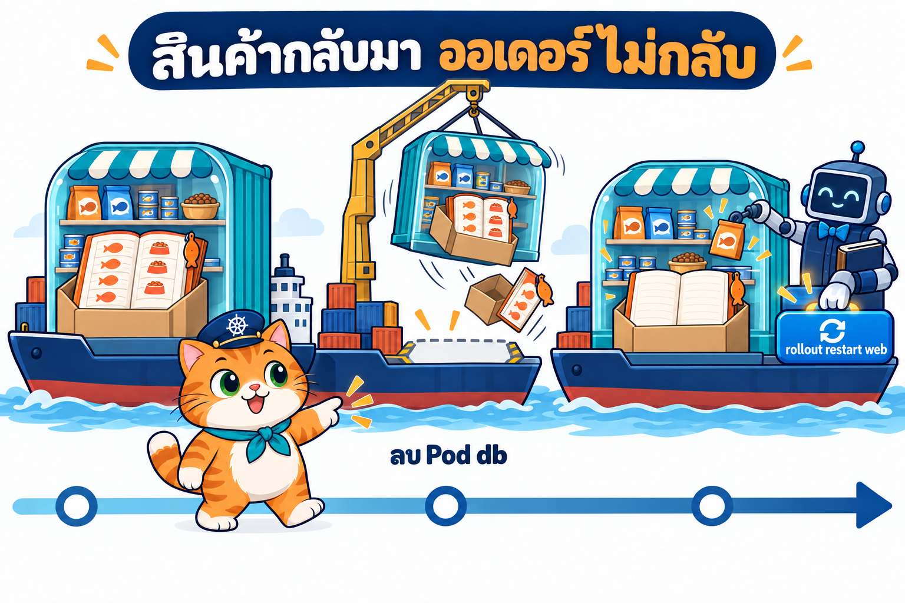<br>
  <em><b>รูปที่ 2</b> ทวนบท 007: ข้อมูลใน emptyDir อยู่ได้นานเท่ากับ Pod — ลบ Pod/Recreate/rollout ของ db ทีไร ต้อง rollout restart web เพื่อเติมสินค้าใหม่ แต่ออเดอร์เดิมหายถาวร</em>
</p>

สาเหตุคือ volume `db-data` ของ Pod db เป็น `emptyDir` ซึ่ง **เกิดและตายพร้อม Pod** เมื่อ Pod เดิมถูกลบ โฟลเดอร์ข้อมูลของ postgres ก็ถูกลบตาม Pod ใหม่ได้ `emptyDir` ว่างเปล่าอันใหม่ Deployment ดูแล "จำนวนและรุ่น" ของ Pod ได้ดี แต่ไม่ได้ออกแบบมาดูแลข้อมูล สิ่งที่ร้านต้องการคือ **ที่เก็บข้อมูลที่อายุยืนกว่า Pod** และ Pod ตัวใหม่ "เบิก" กลับมาใช้ได้ ซึ่งคือเรื่องของบทนี้

**เป้าหมายของบทนี้:** เมื่อจบ LAB 10 ร้านน้องส้มจะ **ลบ Pod db, rollout restart db หรือแม้แต่ลบ Deployment db ทั้งตัวแล้ว apply ใหม่ ออเดอร์ก็ยังอยู่ครบโดยไม่ต้อง restart web** และเราจะเห็นด้วยตาว่าข้อมูลหายจริงเมื่อไร (ลบ PVC ที่ reclaimPolicy เป็น Delete) และกู้คืนได้อย่างไร (Retain)

<p align="center" id="fig-3">
  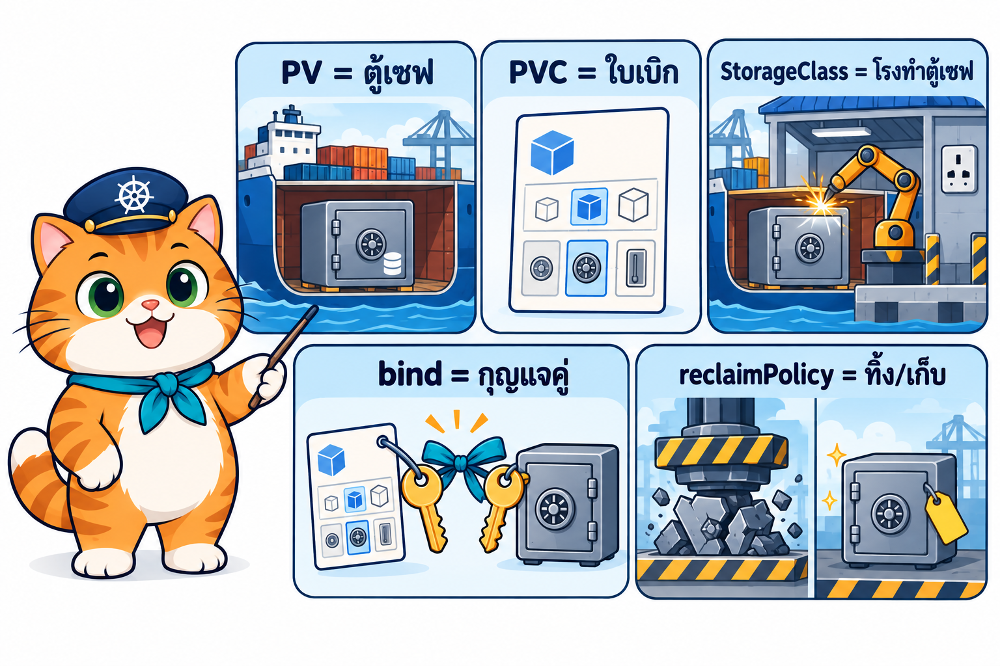<br>
  <em><b>รูปที่ 3</b> อุปมาใหม่ของบทนี้: PV = ตู้เซฟบนเรือ, PVC = ใบเบิกตู้เซฟ, StorageClass = โรงทำตู้เซฟอัตโนมัติ, ผูกกัน = กุญแจคู่, reclaimPolicy = ทิ้งหรือเก็บตู้เมื่อคืนใบเบิก</em>
</p>

**ตารางที่ 1** อุปมาท่าเรือที่ใช้ในบทนี้ (ต่อจากบทที่ 1–7)

| Kubernetes | อุปมาท่าเรือ | ใหม่ในบทนี้ |
|---|---|:---:|
| container / Pod / Node / Namespace | ตู้สินค้า / บูธร้าน / เรือ / โซนทาสี | |
| ReplicaSet / Deployment / Service | หัวหน้ากะ / ผู้จัดการร้าน / ประภาคาร (บทที่ 5–7) | |
| ข้อมูลของร้าน (ตาราง `orders`) | สมุดออเดอร์ปกส้ม | ✅ |
| `emptyDir` | กล่องกระดาษในบูธ — ทิ้งพร้อมบูธ | ✅ |
| `hostPath` | ช่องเปิดบนดาดฟ้าเรือ — ของอยู่บนเรือลำนั้นลำเดียว | ✅ |
| **PersistentVolume (PV)** | **ตู้เซฟเหล็กในห้องเก็บของบนเรือลำหนึ่ง** มีป้ายบอกขนาด | ✅ |
| **PersistentVolumeClaim (PVC)** | **ใบเบิกตู้เซฟ** ที่ร้านถือไว้ ระบุขนาดและแบบตู้ที่ต้องการ | ✅ |
| **StorageClass** | **โรงทำตู้เซฟอัตโนมัติบนท่า** (แขนกล) ทำตู้ตามใบเบิก | ✅ |
| bind (PV ↔ PVC) | กุญแจคู่ผูกริบบิ้น — ตู้หนึ่งใบต่อใบเบิกหนึ่งใบ | ✅ |
| reclaimPolicy `Delete` / `Retain` | เครื่องบดตู้ / ล็อกกุญแจติดป้ายเหลือง "เก็บไว้" | ✅ |
| `volumeMounts` | ท่อลมจากบูธถึงตู้ | ✅ |
| finalizer | คลิปแดงกันฉีกใบเบิกระหว่างที่ยังมีคนใช้ | ✅ |
| CSI | ปลั๊กมาตรฐานบนผนังโรงทำตู้ ให้ผู้ผลิตตู้หลายเจ้ามาเสียบ | ✅ |

> **ข้อควรจำของอุปมา:** ตู้เซฟแบบที่ใช้ในคลัสเตอร์ kind ของเรา **ไม่ลอยข้ามเรือ** ตู้ถูกสร้างบนเรือ (Node) ลำที่บูธแรกลง และบูธที่จะใช้ตู้นั้นต้องลงเรือลำเดียวกันเสมอ (หัวข้อ 5 และ 11)

---

## 2. Volume และอายุของข้อมูล

### 2.1 อายุของที่เก็บข้อมูล 3 ชั้น

<p align="center" id="fig-4">
  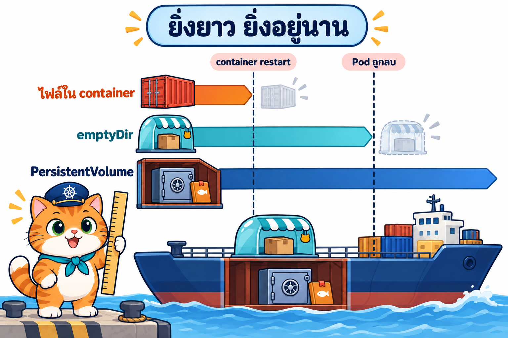<br>
  <em><b>รูปที่ 4</b> อายุของที่เก็บข้อมูล 3 ชั้น: ไฟล์ใน container หายเมื่อ container เริ่มใหม่, emptyDir อยู่ถึงตอนลบ Pod, PV อยู่ต่อแม้ Pod หายจนกว่าจะลบ PVC/PV</em>
</p>

ไฟล์ที่ process ใน container เขียนลงระบบไฟล์ของ container เอง (เช่น `/tmp`) อยู่ในชั้นที่เขียนได้ของ container นั้น เมื่อ container จบและ kubelet เริ่ม container ใหม่ (restart) ชั้นนี้เริ่มใหม่จาก image จึงหายทั้งหมด **volume** คือโฟลเดอร์ที่ Kubernetes เตรียมให้แล้ว "เมานต์" (mount) เข้าไปใน container ตาม `volumeMounts` อายุของข้อมูลขึ้นกับชนิดของ volume

**ตารางที่ 2** อายุของข้อมูลแต่ละชั้น (ผลจาก LAB 1 และ LAB 10)

| ที่เก็บ | อยู่รอดเมื่อ container restart | อยู่รอดเมื่อลบ Pod แล้วสร้างใหม่ | หายเมื่อ |
|---|:---:|:---:|---|
| ไฟล์ใน container (`/tmp/y.txt`) | ❌ | ❌ | container เริ่มใหม่ |
| `emptyDir` (`/cache/x.txt`) | ✅ | ❌ | Pod ถูกลบ |
| PV ผ่าน PVC (ข้อมูล postgres) | ✅ | ✅ | ลบ PVC (ถ้า reclaimPolicy เป็น Delete) หรือผู้ดูแลลบ PV/ข้อมูลเอง |

ผลจริงจาก LAB 1: Pod `cache-demo` เขียน `/cache/x.txt` (emptyDir), `/ram/r.txt` (emptyDir ใน RAM) และ `/tmp/y.txt` (ไฟล์ใน container) แล้วทำให้ container จบเอง (`touch /tmp/stop`) จน `RESTARTS 1`

```text
NAME         READY   STATUS    RESTARTS     AGE
cache-demo   1/1     Running   1 (3s ago)   21s
```

```text
/cache:
boot.log
x.txt

/ram:
r.txt

/tmp:
hi-from-emptydir
start 05:38:03
start 05:38:16
```

`/tmp` ว่างแล้ว (ไฟล์ใน container หาย) แต่ `x.txt` และ `r.txt` ยังอยู่ และ `boot.log` มี 2 บรรทัด (บันทึกตอนเริ่มทั้งสองครั้ง) เมื่อลบ Pod แล้วสร้างใหม่ `boot.log` เหลือบรรทัดเดียว และ `x.txt` หายไป

> **ข้อสังเกตจาก LAB:** `kubectl exec cache-demo -- kill 1` และ `kill -9 1` **ไม่ทำให้ container ตาย** (RESTARTS ยังเป็น 0) เพราะ `sh` ที่เป็น PID 1 ใน container ไม่รับสัญญาณที่ไม่มี handler LAB จึงใช้วิธีสร้างไฟล์ `/tmp/stop` ให้ loop จบเอง (exit 1) ซึ่ง kubelet จะเริ่ม container ใหม่ตาม `restartPolicy: Always`

### 2.2 แผนที่ประเภท volume

<p align="center" id="fig-5">
  <br>
  <em><b>รูปที่ 5</b> แผนที่ประเภท volume: emptyDir (ชั่วคราวใน Pod), hostPath (ช่องบนเรือ), configMap/secret (ไฟล์ตั้งค่า — บทหน้า), persistentVolumeClaim (ตู้เซฟ), ephemeral (ใบเบิกที่ทิ้งพร้อม Pod)</em>
</p>

**ตารางที่ 3** ประเภท volume ที่พบบ่อย

| ประเภท | ข้อมูลอยู่ที่ไหน | อายุ | ใช้ทำอะไร | ในบทนี้ |
|---|---|---|---|---|
| `emptyDir` | โฟลเดอร์ว่างบนดิสก์ของ Node (หรือ RAM ถ้า `medium: Memory`) | เท่า Pod | cache, ไฟล์ชั่วคราว, แชร์ไฟล์ระหว่าง container ใน Pod เดียวกัน | LAB 1 (และ db ของบทที่ 6–7) |
| `hostPath` | โฟลเดอร์/ไฟล์บน Node ตรง ๆ | เท่า Node (ไม่มีใครลบให้) | agent ระดับ Node, static Pod, การทดลอง | LAB 2, PV ของ LAB 4 |
| `configMap` / `secret` | ข้อมูลใน API server ถูกเขียนเป็นไฟล์ | ตาม object | ไฟล์ตั้งค่า, รหัสผ่าน | บทหลัง (แนวคิดเท่านั้น) |
| `persistentVolumeClaim` | PV ที่ผูกกับ PVC (ดิสก์ของ Node, NFS, ดิสก์คลาวด์ ฯลฯ) | เท่า PVC/PV ไม่ขึ้นกับ Pod | ฐานข้อมูล, ไฟล์ที่ผู้ใช้อัปโหลด | LAB 3–10 |
| `ephemeral` (generic ephemeral) | PVC ที่ Kubernetes สร้างให้จาก template ใน Pod | เท่า Pod (PVC ถูกลบพร้อม Pod) | พื้นที่ชั่วคราวขนาดใหญ่จาก StorageClass | LAB 9 |

`configMap`/`secret` เป็นแค่การกล่าวถึงในแผนที่ ร้านน้องส้มบทนี้ยังเขียนรหัสผ่านฐานข้อมูลใน YAML ตรง ๆ (`meow1234` เป็นค่าตัวอย่างเพื่อการเรียนเท่านั้น)

### 2.3 emptyDir: กล่องกระดาษในบูธ

<p align="center" id="fig-6">
  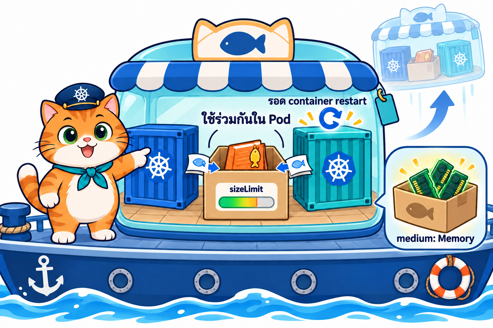<br>
  <em><b>รูปที่ 6</b> emptyDir: สร้างตอน Pod ขึ้น container ในPod เดียวกันใช้ร่วมกันได้ รอด container restart แต่หายเมื่อ Pod ถูกลบ; medium: Memory = ใช้ RAM, sizeLimit จำกัดขนาด</em>
</p>

`emptyDir` ถูกสร้างเมื่อ Pod ถูกวางบน Node และถูกลบเมื่อ Pod ออกจาก Node container ทุกตัวใน Pod เดียวกันเมานต์ volume เดียวกันได้ (เช่น initContainer เขียนไฟล์ให้ container หลักอ่าน) ตัวอย่างจาก `02_LAB/labs/lab01-emptydir/pod.yaml`

```yaml
  volumes:
    - name: cache
      emptyDir: {}                 # โฟลเดอร์ว่างบนดิสก์ของ Node ที่ Pod ลง
    - name: ram
      emptyDir:
        medium: Memory             # เก็บใน RAM (tmpfs) — เร็วแต่หายง่าย และนับเป็นหน่วยความจำของ Pod
        sizeLimit: 16Mi            # เกินขนาดนี้ Pod จะถูกไล่ออก (evict)
```

ผลจริงของ `df -h /cache /ram` ใน Pod: `/cache` อยู่บนดิสก์ของ Node (ตัวเลขคือขนาดดิสก์ทั้งก้อนของเครื่องทดสอบ ของนักศึกษาจะต่างกัน) ส่วน `/ram` เป็น `tmpfs` ขนาดตาม `sizeLimit`

```text
Filesystem                Size      Used Available Use% Mounted on
/dev/sdd               1006.9G    224.5G    731.1G  23% /cache
tmpfs                    16.0M      4.0K     16.0M   0% /ram
```

| ฟิลด์ | ความหมาย |
|---|---|
| `emptyDir: {}` | ใช้ดิสก์ของ Node (ค่า default) |
| `medium: Memory` | ใช้ RAM (tmpfs) เร็ว แต่ข้อมูลนับเป็นหน่วยความจำของ container และหายทันทีเมื่อ Node reboot |
| `sizeLimit` | ขนาดสูงสุด ถ้าใช้เกิน kubelet จะไล่ Pod ออก (evict) |

### 2.4 hostPath: ช่องเปิดบนดาดฟ้าเรือ

<p align="center" id="fig-7">
  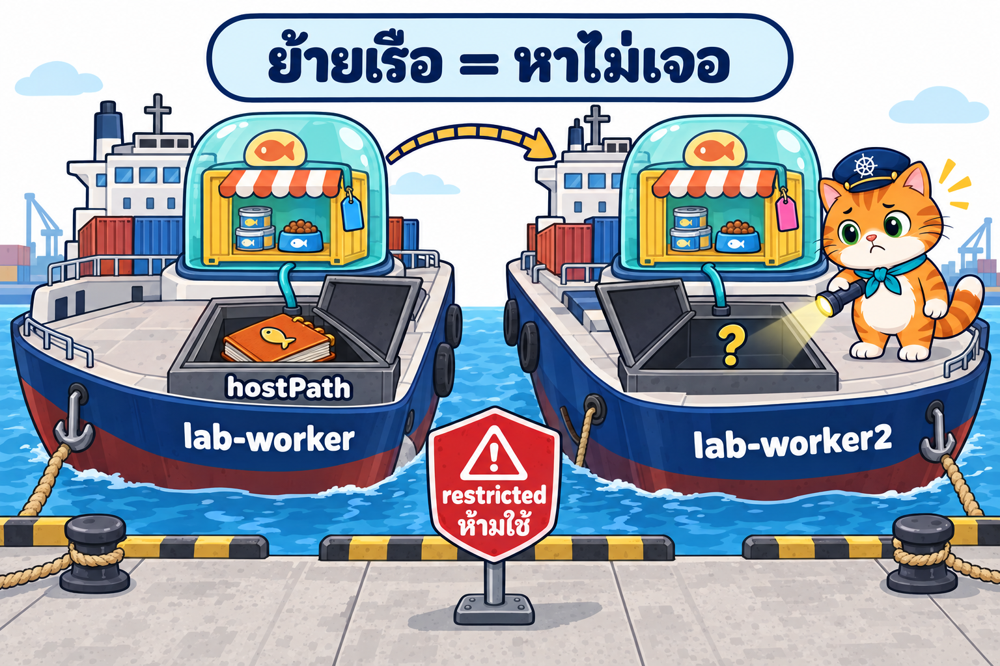<br>
  <em><b>รูปที่ 7</b> hostPath: ใช้โฟลเดอร์บน Node ตรง ๆ — ข้อมูลผูกกับเรือลำนั้น, Pod ย้ายเรือแล้วไม่เจอ, เสี่ยงความปลอดภัย จึงถูก Pod Security ระดับ restricted ห้าม</em>
</p>

`hostPath` เมานต์โฟลเดอร์หรือไฟล์บน Node เข้า Pod โดยตรง ตัวอย่างจาก `02_LAB/labs/lab02-hostpath/pod-worker.yaml`

```yaml
  nodeSelector:
    kubernetes.io/hostname: lab-worker     # ปักให้ลง Node นี้
  volumes:
    - name: host
      hostPath:
        path: /srv/som-hostpath       # โฟลเดอร์บน Node (ในคลัสเตอร์ kind = ใน container ของ Node)
        type: DirectoryOrCreate       # ไม่มีโฟลเดอร์ก็สร้างให้
```

`type` บอกว่าคาดหวังอะไรที่ path นั้น เช่น `DirectoryOrCreate` (ไม่มีก็สร้างโฟลเดอร์), `Directory` (ต้องมีโฟลเดอร์อยู่แล้ว), `FileOrCreate`, `File` และค่าว่าง (ไม่ตรวจ) ปัญหาของ `hostPath` มีสามข้อ

1. **ข้อมูลผูกกับ Node** — ใน LAB 2 Pod บน `lab-worker2` ที่ใช้ path เดียวกันเห็นเฉพาะไฟล์ของตัวเอง ไม่เห็นไฟล์ที่ Pod บน `lab-worker` เขียน เพราะเป็นคนละเรือ
2. **ไม่มีใครเก็บกวาด** — ลบ namespace `hostpath-lab` แล้ว `docker exec lab-worker cat /srv/som-hostpath/notes.txt` ยังเห็นไฟล์ ต้องลบเองบน Node
3. **ความปลอดภัย** — Pod ที่เมานต์ path สำคัญของ Node (เช่น `/`, `/var/run`) อ่าน/แก้ไฟล์ของ Node ได้ Pod Security ระดับ **restricted** (บทที่ 4) จึงห้าม `hostPath`

ผลจริงเมื่อ apply Pod ใน namespace ที่ติดป้าย `pod-security.kubernetes.io/warn: restricted` (Pod ยังถูกสร้างเพราะเป็นแค่ `warn`)

```text
Warning: would violate PodSecurity "restricted:latest": allowPrivilegeEscalation != false (container "app" must set securityContext.allowPrivilegeEscalation=false), unrestricted capabilities (container "app" must set securityContext.capabilities.drop=["ALL"]), restricted volume types (volume "host" uses restricted volume type "hostPath"), runAsNonRoot != true (pod or container "app" must set securityContext.runAsNonRoot=true), seccompProfile (pod or container "app" must set securityContext.seccompProfile.type to "RuntimeDefault" or "Localhost")
pod/hp-worker created
```

ส่วนที่เกี่ยวกับบทนี้คือ `restricted volume types (volume "host" uses restricted volume type "hostPath")` ถ้า namespace ตั้ง `enforce: restricted` Pod นี้จะถูกปฏิเสธ ส่วน `persistentVolumeClaim`, `emptyDir`, `ephemeral`, `configMap`, `secret` เป็นประเภทที่ restricted อนุญาต

> **ข้อควรจำ:** `hostPath` เหมาะกับงานระดับ Node และการทดลองเท่านั้น แอปทั่วไปที่ต้องการข้อมูลถาวรให้ใช้ PVC แม้ว่าเบื้องหลังของ local-path ใน kind จะเป็น hostPath ก็ตาม (หัวข้อ 5.3) เพราะ PVC ให้ Kubernetes ดูแลการสร้าง/ผูก/ลบ และบังคับให้ Pod ลง Node ที่ถูกต้องให้เอง

---

## 3. PV, PVC, StorageClass — ใครทำอะไร

### 3.1 แยกบทบาทผู้ดูแลกับนักพัฒนา

<p align="center" id="fig-8">
  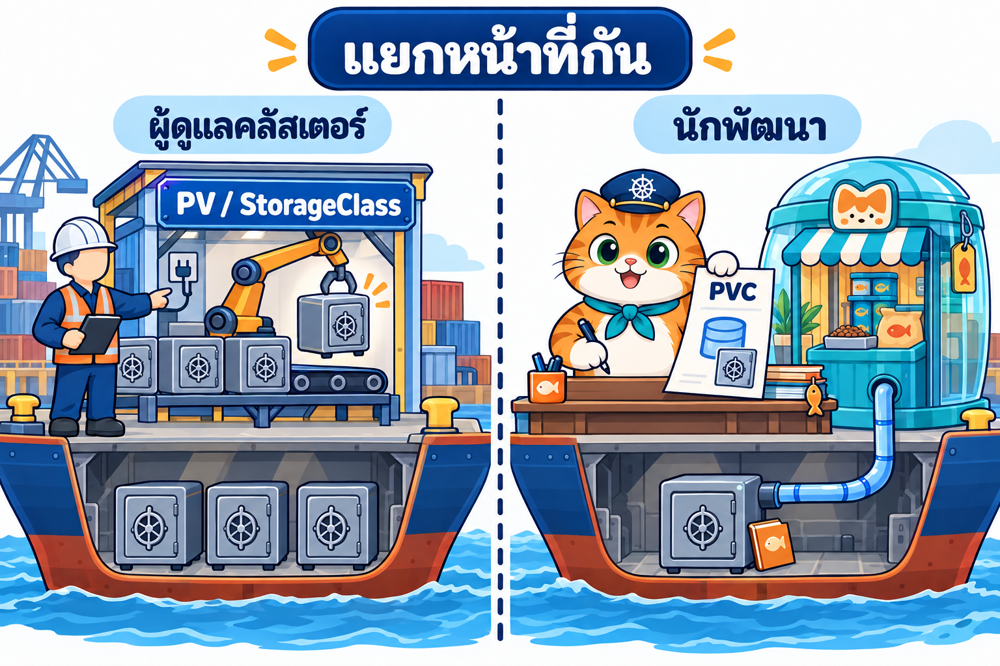<br>
  <em><b>รูปที่ 8</b> แยกบทบาท: ผู้ดูแลคลัสเตอร์เตรียมตู้เซฟ (PV) หรือโรงทำตู้ (StorageClass); นักพัฒนาเขียนใบเบิก (PVC) แล้วให้ Pod ใช้ใบเบิก — ไม่ต้องรู้ว่าตู้อยู่ไหน</em>
</p>

Kubernetes แยก "ที่เก็บจริง" ออกจาก "คำขอใช้" เพื่อให้นักพัฒนาเขียน manifest แบบเดียวกันได้ไม่ว่าคลัสเตอร์จะใช้ดิสก์แบบไหน

**ตารางที่ 4** object หลักของบทนี้

| Object | อุปมา | ใครสร้าง | scope | หน้าที่ |
|---|---|---|---|---|
| **PersistentVolume (PV)** | ตู้เซฟ | ผู้ดูแลคลัสเตอร์ (static) หรือ provisioner (dynamic) | **cluster-scoped** (ไม่มี namespace) | แทนพื้นที่เก็บจริงหนึ่งก้อน มีขนาด, accessModes, reclaimPolicy, ที่อยู่จริง |
| **PersistentVolumeClaim (PVC)** | ใบเบิก | นักพัฒนา | **namespaced** | ขอพื้นที่ตามขนาด/โหมด/class ที่ต้องการ แล้วผูกกับ PV หนึ่งตัว |
| **StorageClass** | โรงทำตู้อัตโนมัติ | ผู้ดูแลคลัสเตอร์ | **cluster-scoped** | บอกว่าใช้ provisioner ตัวไหนสร้าง PV และกติกาของ PV ที่สร้าง (reclaimPolicy, bindingMode, expansion) |
| Pod | บูธ | นักพัฒนา (ผ่าน Deployment ฯลฯ) | namespaced | อ้าง PVC ด้วย `claimName` แล้วเมานต์ |

ความสัมพันธ์คือ **Pod → PVC → PV → ที่เก็บจริง** Pod รู้จักแค่ชื่อ PVC ใน namespace เดียวกัน ส่วน PV และ StorageClass ไม่มี namespace ผลที่ตามมาในทางปฏิบัติ

- `kubectl get pv` และ `kubectl get sc` ไม่ต้องใส่ `-n` ส่วน `kubectl get pvc` ต้องใส่ `-n <ns>` (หรือ `-A`)
- **ลบ namespace แล้ว PVC ใน namespace นั้นถูกลบ แต่ PV ที่ Retain และ StorageClass ยังอยู่** (LAB 10 ขั้น I: ลบ `som-shop` แล้ว PV ยัง `Released`, class `standard-retain` ยังอยู่)

### 3.2 กายวิภาค PVC

<p align="center" id="fig-9">
  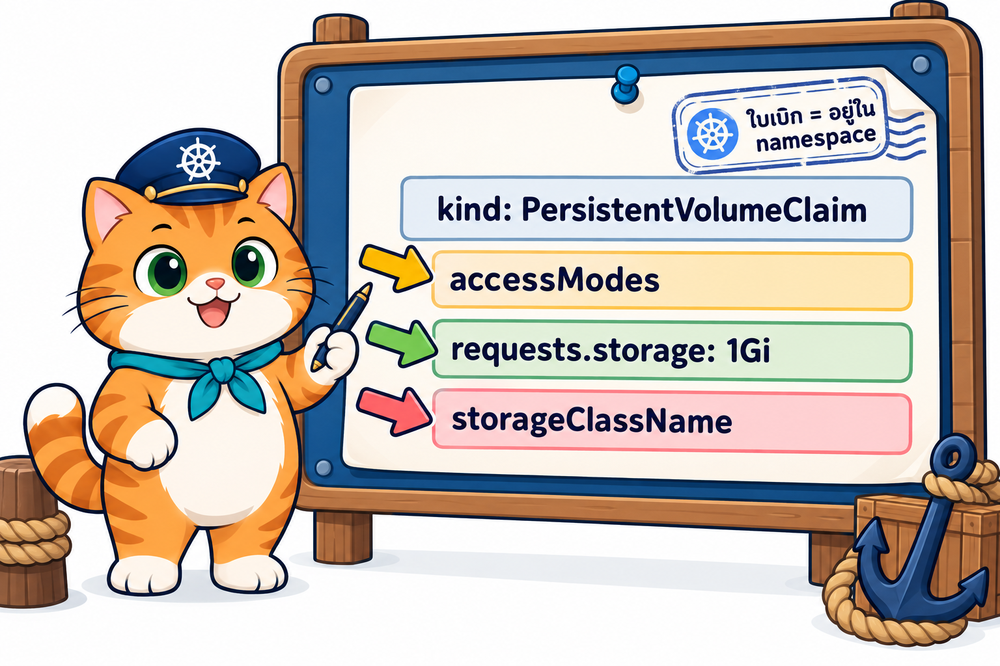<br>
  <em><b>รูปที่ 9</b> กายวิภาค PVC: accessModes, resources.requests.storage, storageClassName (ไม่ใส่ = ใช้ default class) — PVC อยู่ใน namespace</em>
</p>

PVC แรกของ LAB 3 (`02_LAB/labs/lab03-first-pvc/pvc.yaml`)

```yaml
# ไม่ใส่ storageClassName → ใช้ class default ของคลัสเตอร์ (kind = standard) ให้แขนกลสร้างตู้ (PV) ให้เอง
apiVersion: v1
kind: PersistentVolumeClaim
metadata:
  name: notes
spec:
  accessModes: [ReadWriteOnce]
  resources:
    requests:
      storage: 10Mi
```

PVC ของร้านน้องส้ม (`02_LAB/som-shop-v4/k8s/10-db.yaml`) ระบุ class และ namespace ชัดเจน

```yaml
apiVersion: v1
kind: PersistentVolumeClaim
metadata:
  name: som-db-data
  namespace: som-shop
spec:
  storageClassName: standard       # class ของ kind (rancher.io/local-path, Delete, WaitForFirstConsumer)
  accessModes: [ReadWriteOnce]     # เขียนได้จาก Node เดียว (local-path รองรับแค่ RWO/RWOP)
  resources:
    requests:
      storage: 1Gi                 # ขนาดที่ขอ (local-path ไม่ได้บังคับขนาดจริง)
```

**ตารางที่ 5** ฟิลด์สำคัญของ PVC

| ฟิลด์ | ความหมาย | หมายเหตุ |
|---|---|---|
| `accessModes` | โหมดที่ต้องการ (`ReadWriteOnce`, `ReadOnlyMany`, `ReadWriteMany`, `ReadWriteOncePod`) | ต้องเป็นโหมดที่ storage รองรับ (หัวข้อ 6) |
| `resources.requests.storage` | ขนาดขั้นต่ำที่ต้องการ (`10Mi`, `1Gi`) | ได้ PV ที่ใหญ่กว่าได้ (หัวข้อ 4.3) |
| `storageClassName` | ชื่อ StorageClass | ไม่ใส่ = default class, `""` = ไม่ใช้ class (หัวข้อ 4.2) |
| `volumeMode` | `Filesystem` (default) หรือ `Block` | หัวข้อ 6.4 |
| `volumeName` | ระบุ PV ที่ต้องการโดยตรง | ใช้ตอนกู้ PV เดิม (หัวข้อ 4.4, 8.2) |
| `selector` | เลือก PV ตาม label | ใช้กับ static PV |

### 3.3 กายวิภาค PV

<p align="center" id="fig-10">
  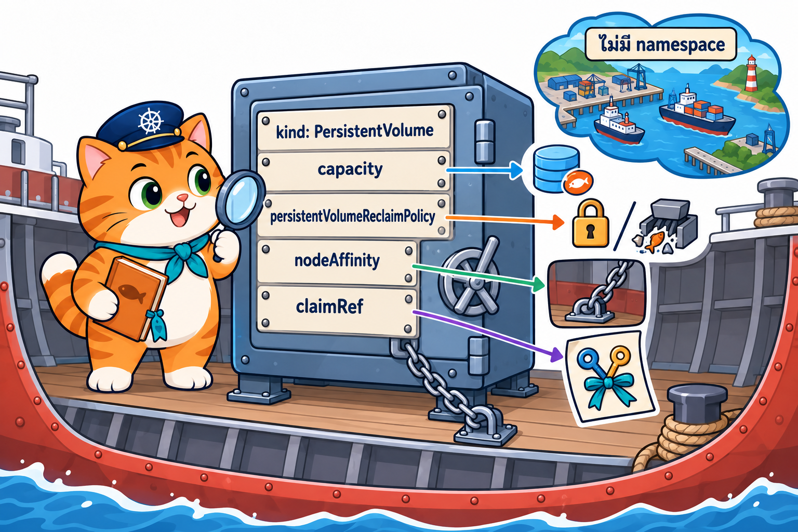<br>
  <em><b>รูปที่ 10</b> กายวิภาค PV: capacity, accessModes, persistentVolumeReclaimPolicy, ที่เก็บจริง (hostPath/local/CSI), nodeAffinity, claimRef — PV เป็นของทั้งคลัสเตอร์ ไม่มี namespace</em>
</p>

PV ที่สร้างเองใน LAB 4 (`02_LAB/labs/lab04-static/pv.yaml`)

```yaml
# PV ไม่มี namespace (เป็นของทั้งคลัสเตอร์)
apiVersion: v1
kind: PersistentVolume
metadata:
  name: pv-manual
spec:
  capacity:
    storage: 100Mi
  accessModes: [ReadWriteOnce]
  persistentVolumeReclaimPolicy: Retain   # ลบใบเบิกแล้วตู้ยังอยู่ (ค่า default ของ PV ที่สร้างเอง)
  storageClassName: ""                    # ไม่มี class = ไม่ใช่ตู้จากแขนกล
  hostPath:
    path: /srv/som-manual                 # โฟลเดอร์บน Node
    type: DirectoryOrCreate
  nodeAffinity:                           # บอกว่าตู้นี้อยู่บนเรือลำไหน → Pod ที่ใช้ต้องลง Node นี้
    required:
      nodeSelectorTerms:
        - matchExpressions:
            - key: kubernetes.io/hostname
              operator: In
              values: [lab-worker2]
```

**ตารางที่ 6** ฟิลด์สำคัญของ PV

| ฟิลด์ | ความหมาย |
|---|---|
| `capacity.storage` | ขนาดของตู้ (แสดงในคอลัมน์ `CAPACITY`) |
| `accessModes` | โหมดที่ตู้นี้รองรับ |
| `persistentVolumeReclaimPolicy` | ทำอะไรกับตู้เมื่อใบเบิกถูกลบ: `Retain` หรือ `Delete` (หัวข้อ 8) |
| `storageClassName` | class ของตู้ (`""` = ไม่มี class) |
| ที่เก็บจริง (`hostPath`, `local`, `nfs`, `csi` …) | บอกว่าข้อมูลอยู่ที่ไหน ใช้ได้หนึ่งแบบต่อ PV |
| `nodeAffinity` | ตู้นี้เข้าถึงได้จาก Node ไหน — scheduler จะวาง Pod ที่ใช้ตู้นี้บน Node ที่ตรงเท่านั้น |
| `claimRef` | ตู้นี้ผูก (หรือจองไว้) กับ PVC ตัวไหน (namespace/name/uid) |
| `volumeMode` | `Filesystem` หรือ `Block` |

### 3.4 Pod อ้างแค่ชื่อ PVC

<p align="center" id="fig-11">
  <br>
  <em><b>รูปที่ 11</b> Pod อ้างแค่ชื่อ PVC: volumes[].persistentVolumeClaim.claimName + volumeMounts[].mountPath — Pod ไม่รู้จัก PV โดยตรง</em>
</p>

Pod `writer` ของ LAB 3 (`02_LAB/labs/lab03-first-pvc/pod.yaml`)

```yaml
apiVersion: v1
kind: Pod
metadata:
  name: writer
spec:
  terminationGracePeriodSeconds: 1   # ลบเร็ว (sh + sleep ไม่รับ SIGTERM)
  containers:
    - name: app
      image: busybox:1.36
      command: ["sh", "-c", "echo \"$(date +%T) hello from $(hostname)\" >> /data/log.txt; cat /data/log.txt; ls -ld /data; sleep 3600"]
      volumeMounts:
        - name: data
          mountPath: /data
      resources:
        requests: { cpu: 10m, memory: 16Mi }
        limits:   { cpu: 100m, memory: 64Mi }
  volumes:
    - name: data
      persistentVolumeClaim:
        claimName: notes            # อ้างใบเบิกด้วยชื่อเท่านั้น
```

- `volumes[].name` เป็นชื่อภายใน Pod ที่ `volumeMounts[].name` อ้าง
- `persistentVolumeClaim.claimName` ต้องเป็นชื่อ PVC ใน **namespace เดียวกับ Pod**
- สำหรับ Deployment เขียนส่วนเดียวกันใน `spec.template.spec` (ร้านน้องส้ม: volume `db-data` → `claimName: som-db-data` เมานต์ที่ `/var/lib/postgresql/data`)

ร้านของบทที่ 7 กับบทนี้ต่างกันแค่ volume `db-data` ของ `som-db`

```text
# บทที่ 7 (som-shop-v3)                    # บทที่ 8 (som-shop-v4/k8s/10-db.yaml)
      volumes:                              #       volumes:
        - name: db-data                     #         - name: db-data
          emptyDir: {}                      #           persistentVolumeClaim:
                                            #             claimName: som-db-data
```

---

## 4. Static provisioning (เตรียมตู้เซฟเอง)

### 4.1 ขั้นตอนของ static provisioning

<p align="center" id="fig-12">
  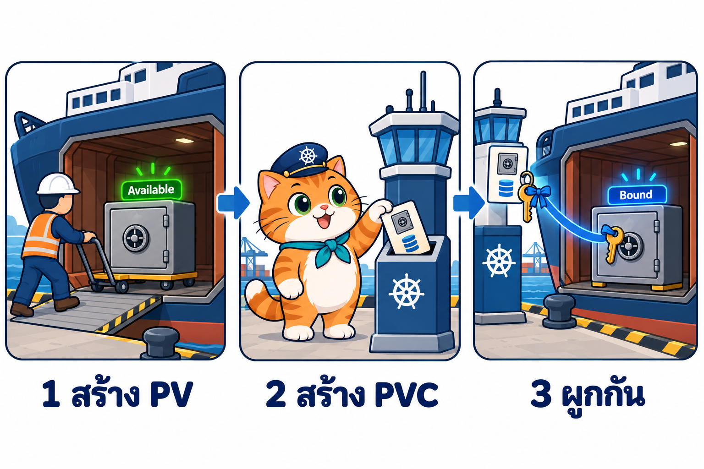<br>
  <em><b>รูปที่ 12</b> Static provisioning: ผู้ดูแลสร้าง PV ไว้ก่อน (Available) → นักพัฒนาสร้าง PVC → control plane หา PV ที่เข้าเงื่อนไขแล้วผูกกัน (Bound)</em>
</p>

ใน static provisioning ผู้ดูแลสร้าง PV ไว้ล่วงหน้า (เช่น ดิสก์ที่ต่อไว้, share NFS) แล้ว controller ชื่อ `persistentvolume-controller` ใน kube-controller-manager จับคู่ PVC ที่เข้าเงื่อนไขให้ ผลจริงจาก LAB 4

```text
persistentvolume/pv-manual created
NAME        CAPACITY   ACCESS MODES   RECLAIM POLICY   STATUS      CLAIM   STORAGECLASS   VOLUMEATTRIBUTESCLASS   REASON   AGE
pv-manual   100Mi      RWO            Retain           Available                          <unset>                          0s
```

```text
persistentvolumeclaim/manual-claim created
NAME        CAPACITY   ACCESS MODES   RECLAIM POLICY   STATUS   CLAIM                  STORAGECLASS   VOLUMEATTRIBUTESCLASS   REASON   AGE
pv-manual   100Mi      RWO            Retain           Bound    default/manual-claim                  <unset>                          2s
NAME           STATUS   VOLUME      CAPACITY   ACCESS MODES   STORAGECLASS   VOLUMEATTRIBUTESCLASS   AGE
manual-claim   Bound    pv-manual   100Mi      RWO                           <unset>                 2s
```

- PV `Available` → เมื่อมี PVC ที่เข้าเงื่อนไข ทั้งคู่เป็น `Bound` ภายใน 2 วินาที **โดยไม่ต้องมี Pod** (PV ที่ไม่มี class ผูกทันที ต่างจาก `standard` ที่รอ Pod — หัวข้อ 7.2)
- คอลัมน์ `CLAIM` ของ PV เป็น `<namespace>/<pvc>` และคอลัมน์ `STORAGECLASS` ของทั้งคู่ว่าง
- Pod `manual-user` ที่ใช้ `manual-claim` ไม่ได้ระบุ Node แต่ถูกวางบน `lab-worker2` ตาม `nodeAffinity` ของ PV และไฟล์อยู่ที่ `lab-worker2:/srv/som-manual/manual.txt`

### 4.2 storageClassName: "" ต่างจากการไม่ใส่

<p align="center" id="fig-13">
  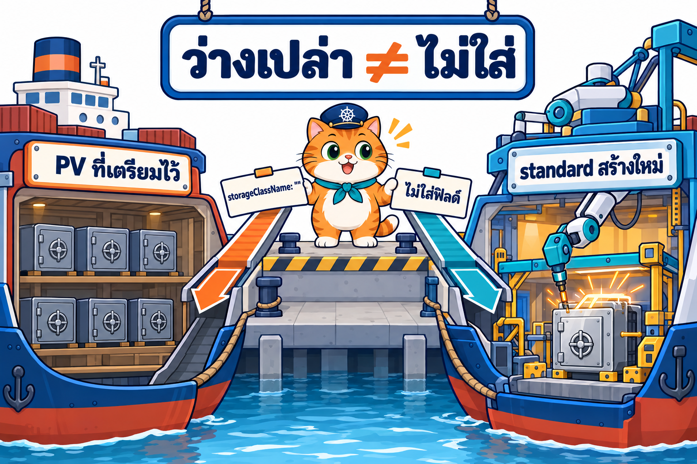<br>
  <em><b>รูปที่ 13</b> storageClassName: "" = ขอเฉพาะ PV ที่ไม่มี class (ไม่ให้ default class สร้างตู้ใหม่) — ถ้าไม่ใส่ฟิลด์เลย default class (standard) จะเข้ามาทำแทน</em>
</p>

**ตารางที่ 7** สามแบบของ `storageClassName` ใน PVC

| เขียนใน PVC | ความหมาย | ผลในคลัสเตอร์ kind |
|---|---|---|
| ไม่ใส่ฟิลด์ | ใช้ **default StorageClass** (admission ใส่ชื่อ class ให้ตอนสร้าง) | ได้ `standard` → แขนกลสร้าง PV ใหม่ให้ (LAB 3 คอลัมน์ `STORAGECLASS` = `standard`) |
| `storageClassName: ""` | **ไม่ใช้ class** ขอเฉพาะ PV ที่ไม่มี class | จับกับ `pv-manual` ได้ (LAB 4) ถ้าไม่มี PV ที่ตรง → `Pending` |
| `storageClassName: standard-retain` | ใช้ class ที่ระบุ | ได้ PV จาก class นั้น (LAB 7, LAB 10 ขั้น H) |

> **ข้อควรจำ:** ถ้าต้องการให้ PVC ผูกกับ static PV ที่ไม่มี class อย่าลืม `storageClassName: ""` ไม่เช่นนั้นคลัสเตอร์ที่มี default class จะสร้างตู้ใหม่ให้แทน และ PV ที่เตรียมไว้จะไม่ถูกใช้

### 4.3 เงื่อนไขการจับคู่

<p align="center" id="fig-14">
  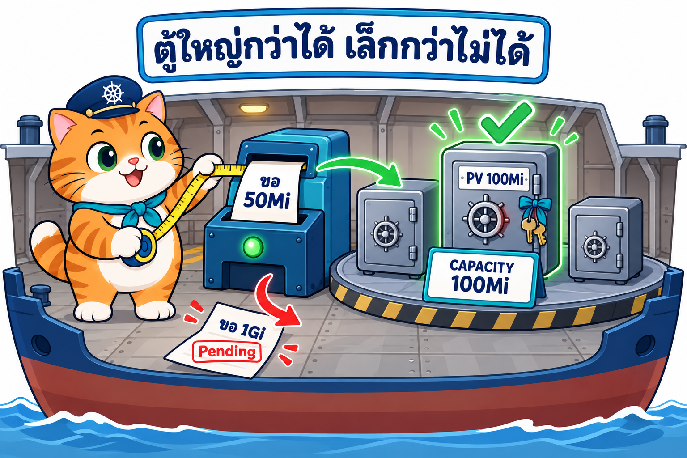<br>
  <em><b>รูปที่ 14</b> เงื่อนไขการจับคู่: class ตรง, accessModes ครบ, ขนาด PV ≥ ที่ขอ — ได้ตู้ใหญ่กว่าได้ (ขอ 50Mi ได้ PV 100Mi แสดง CAPACITY 100Mi) ขอเกินทุกตู้ = Pending</em>
</p>

PV จะถูกเลือกให้ PVC เมื่อ

1. `storageClassName` ตรงกัน (รวมกรณีว่างทั้งคู่)
2. `accessModes` ของ PV มีโหมดที่ PVC ขอครบ
3. ขนาด PV **มากกว่าหรือเท่ากับ** ที่ขอ (controller เลือกตู้ที่เล็กที่สุดที่ใหญ่พอ)
4. ตรง `selector` ของ PVC (ถ้ามี) และ `volumeMode` ตรงกัน
5. PV ยัง `Available` (ไม่ถูกผูกหรือจองโดย PVC อื่น)

PV หนึ่งตัวผูกกับ PVC ได้ตัวเดียว (กุญแจคู่) แม้ PVC ขอ 50Mi และ PV มี 100Mi ส่วนที่เหลือก็ไม่ถูกแบ่งให้ใคร คอลัมน์ `CAPACITY` ของ PVC จึงแสดง **ขนาดของ PV** (100Mi) ไม่ใช่ขนาดที่ขอ

PVC `too-big` ขอ 1Gi โดย `storageClassName: ""` ไม่มี PV ไหนใหญ่พอ และไม่มี class ให้สร้าง จึงค้าง `Pending` พร้อม Event

```text
too-big        Pending                                                        <unset>                 3s
Events:
  Type    Reason         Age   From                         Message
  ----    ------         ----  ----                         -------
  Normal  FailedBinding  3s    persistentvolume-controller  no persistent volumes available for this claim and no storage class is set
```

### 4.4 จองตู้ล่วงหน้าด้วย claimRef และ volumeName

<p align="center" id="fig-15">
  <br>
  <em><b>รูปที่ 15</b> จองตู้ล่วงหน้า: PV ใส่ spec.claimRef (จองให้ PVC ชื่อนี้) หรือ PVC ใส่ spec.volumeName (ขอตู้ใบนี้) — ใช้ตอนกู้ข้อมูลจาก PV เดิม</em>
</p>

การจับคู่อัตโนมัติไม่รับประกันว่าได้ตู้ใบไหน ถ้าต้องการจับคู่แบบเจาะจง ทำได้สองฝั่ง

- **ฝั่ง PV:** ใส่ `spec.claimRef` (`namespace` + `name`) ของ PVC ที่จะมาใช้ PV นี้จะถูกเก็บไว้ให้ PVC ตัวนั้นเท่านั้น เมื่อผูกแล้ว Kubernetes เติม `uid` ให้เอง ตัวอย่าง `claimRef` ที่ระบบเขียนลงใน PV หลังผูกแล้ว (ผลจริงจาก LAB 3)

  ```yaml
    claimRef:
      apiVersion: v1
      kind: PersistentVolumeClaim
      name: notes
      namespace: default
      resourceVersion: "1203"
      uid: b4fb1995-3929-4c26-930e-08074d960afb
  ```

- **ฝั่ง PVC:** ใส่ `spec.volumeName` ชี้ชื่อ PV ตรง ๆ ข้ามการค้นหาตู้ และไม่ให้แขนกลสร้างตู้ใหม่ LAB 6 และ LAB 10 ใช้วิธีนี้กู้ตู้เดิม (`02_LAB/labs/lab06-lifecycle/pvc-reuse.yaml`)

  ```yaml
  apiVersion: v1
  kind: PersistentVolumeClaim
  metadata:
    name: ledger
  spec:
    storageClassName: standard       # ต้องตรงกับ class ของ PV
    volumeName: PV_NAME              # ชี้ตู้เดิมโดยตรง (แขนกลจะไม่สร้างตู้ใหม่)
    accessModes: [ReadWriteOnce]
    resources:
      requests:
        storage: 10Mi                # ต้องไม่เกินขนาดของ PV
  ```

  `PV_NAME` ในไฟล์ถูกแทนด้วยชื่อ PV จริงตอนใช้งาน (`sed "s/PV_NAME/$PV/" pvc-reuse.yaml | kubectl apply -f -`) PV ต้องเป็น `Available` ก่อน และเงื่อนไขอื่น (class, โหมด, ขนาด) ยังต้องตรง

---

## 5. Dynamic provisioning (StorageClass)

### 5.1 ขั้นตอนของ dynamic provisioning

<p align="center" id="fig-16">
  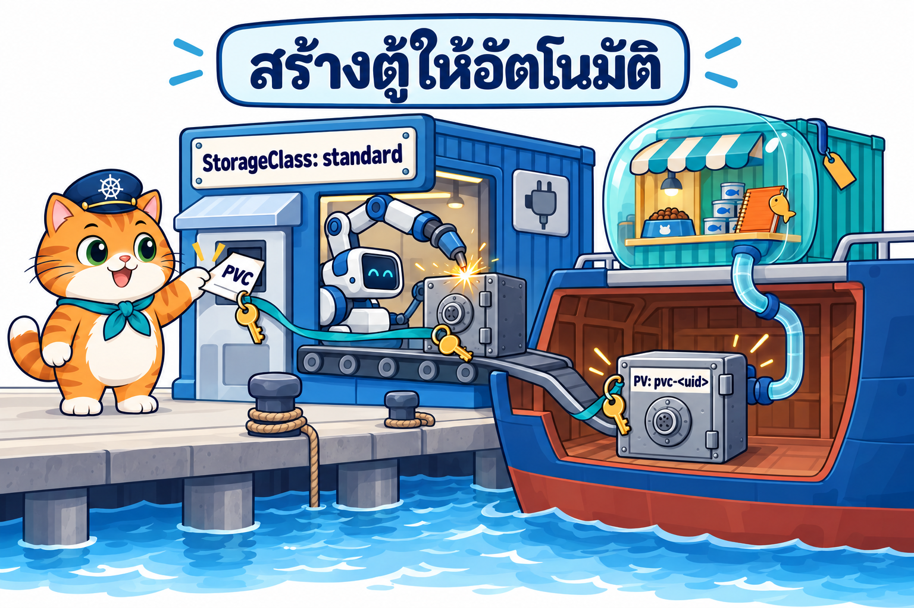<br>
  <em><b>รูปที่ 16</b> Dynamic provisioning: PVC ระบุ StorageClass → provisioner สร้าง PV ชื่อ pvc-&lt;uid&gt; ให้อัตโนมัติแล้วผูกกับ PVC — ไม่ต้องรอผู้ดูแล</em>
</p>

การให้ผู้ดูแลสร้าง PV ทีละตัวไม่สะดวกเมื่อมีหลายทีม **dynamic provisioning** ให้ผู้ดูแลสร้าง StorageClass ไว้ครั้งเดียว แล้ว **provisioner** (โปรแกรมที่ class ระบุ) สร้าง PV ให้ทุกครั้งที่มี PVC ใหม่ ผลจริงจาก LAB 3 (`describe pvc notes` หลังสร้าง Pod)

```text
Events:
  Type    Reason                 Age   From                                                                                                Message
  ----    ------                 ----  ----                                                                                                -------
  Normal  WaitForFirstConsumer   8s    persistentvolume-controller                                                                         waiting for first consumer to be created before binding
  Normal  ExternalProvisioning   5s    persistentvolume-controller                                                                         Waiting for a volume to be created either by the external provisioner 'rancher.io/local-path' or manually by the system administrator. If volume creation is delayed, please verify that the provisioner is running and correctly registered.
  Normal  Provisioning           5s    rancher.io/local-path_local-path-provisioner-75f7fc7dc5-5dkx2_6485bdfa-b176-4448-844b-ec03de28220b  External provisioner is provisioning volume for claim "default/notes"
  Normal  ProvisioningSucceeded  2s    rancher.io/local-path_local-path-provisioner-75f7fc7dc5-5dkx2_6485bdfa-b176-4448-844b-ec03de28220b  Successfully provisioned volume pvc-b4fb1995-3929-4c26-930e-08074d960afb
```

ลำดับคือ (1) PVC รอ Pod ตัวแรก (`WaitForFirstConsumer`) (2) เมื่อ scheduler เลือก Node ให้ Pod แล้ว controller ส่งงานให้ provisioner ภายนอก (`ExternalProvisioning`) (3) provisioner สร้างตู้ (`Provisioning` → `ProvisioningSucceeded`) (4) PV ใหม่ผูกกับ PVC

```text
NAME                          STATUS   VOLUME                                     CAPACITY   ACCESS MODES   STORAGECLASS   VOLUMEATTRIBUTESCLASS   AGE   VOLUMEMODE
persistentvolumeclaim/notes   Bound    pvc-b4fb1995-3929-4c26-930e-08074d960afb   10Mi       RWO            standard       <unset>                 8s    Filesystem

NAME                                                        CAPACITY   ACCESS MODES   RECLAIM POLICY   STATUS   CLAIM           STORAGECLASS   VOLUMEATTRIBUTESCLASS   REASON   AGE   VOLUMEMODE
persistentvolume/pvc-b4fb1995-3929-4c26-930e-08074d960afb   10Mi       RWO            Delete           Bound    default/notes   standard       <unset>                          2s    Filesystem
```

ชื่อ PV ที่ได้คือ **`pvc-` + uid ของ PVC** (`claimRef.uid` ของ PV เป็น `b4fb1995-3929-4c26-930e-08074d960afb` ตรงกับชื่อ) ชื่อนี้สุ่มใหม่ทุกครั้ง ในเครื่องนักศึกษาจะไม่เหมือนตัวอย่าง reclaimPolicy ของ PV สืบทอดจาก class (`Delete`)

### 5.2 StorageClass standard ของ kind

<p align="center" id="fig-17">
  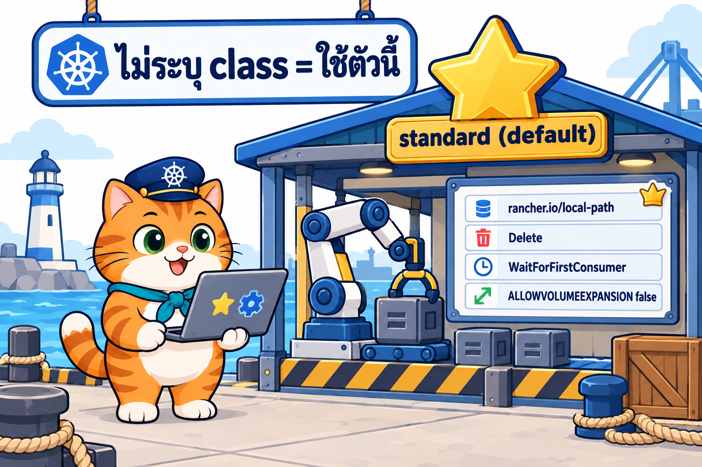<br>
  <em><b>รูปที่ 17</b> kind มี StorageClass standard (default) — annotation storageclass.kubernetes.io/is-default-class: "true", provisioner rancher.io/local-path, Delete, WaitForFirstConsumer, ALLOWVOLUMEEXPANSION false</em>
</p>

คลัสเตอร์ kind มี StorageClass มาให้หนึ่งตัว ผลจริงจาก LAB 0

```text
NAME                 PROVISIONER             RECLAIMPOLICY   VOLUMEBINDINGMODE      ALLOWVOLUMEEXPANSION   AGE
standard (default)   rancher.io/local-path   Delete          WaitForFirstConsumer   false                  3m6s
```

```text
    storageclass.kubernetes.io/is-default-class: "true"
provisioner: rancher.io/local-path
reclaimPolicy: Delete
volumeBindingMode: WaitForFirstConsumer
```

**ตารางที่ 8** ฟิลด์ของ StorageClass

| ฟิลด์ | ค่าใน `standard` | ความหมาย |
|---|---|---|
| annotation `storageclass.kubernetes.io/is-default-class` | `"true"` | เป็น default class (คำว่า `(default)` หลังชื่อ) — PVC ที่ไม่ใส่ `storageClassName` ใช้ class นี้ ควรมี default เพียงตัวเดียว |
| `provisioner` | `rancher.io/local-path` | โปรแกรมที่สร้าง PV |
| `reclaimPolicy` | `Delete` (default ถ้าไม่ใส่) | ใส่ให้ PV ที่ class นี้สร้าง |
| `volumeBindingMode` | `WaitForFirstConsumer` | สร้างตู้เมื่อมี Pod ใช้ (หัวข้อ 7.2) — ค่า default ถ้าไม่ใส่คือ `Immediate` |
| `allowVolumeExpansion` | ไม่ใส่ (= `false`) | อนุญาตให้ขยาย PVC หรือไม่ (หัวข้อ 9) |
| `parameters` | – | ค่าเฉพาะของ provisioner (เช่น ชนิดดิสก์คลาวด์) |

StorageClass ของเราเองใน LAB 7 (`02_LAB/labs/lab07-storageclass/sc-retain.yaml`) ใช้ provisioner ตัวเดิมแต่เปลี่ยน reclaimPolicy

```yaml
apiVersion: storage.k8s.io/v1
kind: StorageClass
metadata:
  name: standard-retain
provisioner: rancher.io/local-path
reclaimPolicy: Retain
volumeBindingMode: WaitForFirstConsumer
```

> **ข้อควรจำ:** ฟิลด์ของ StorageClass (provisioner, reclaimPolicy, parameters) แก้ภายหลังไม่ได้ ถ้าต้องการค่าใหม่ให้สร้าง class ใหม่ และการแก้/ลบ class **ไม่มีผลกับ PV ที่สร้างไปแล้ว** (LAB 7: ลบ `standard-retain` แล้ว PV ของ `kept` ยังอยู่ `Released`)

### 5.3 ข้างในของ local-path

<p align="center" id="fig-18">
  <br>
  <em><b>รูปที่ 18</b> ข้างในของ local-path: สร้างโฟลเดอร์ /var/local-path-provisioner/pvc-&lt;uid&gt;_&lt;ns&gt;_&lt;pvc&gt; บน Node ที่ Pod ถูกวาง แล้วทำ PV แบบ hostPath + nodeAffinity ผูกกับ Node นั้น</em>
</p>

provisioner ของ kind คือ Deployment `local-path-provisioner` ใน namespace `local-path-storage` (ผลจริงจาก LAB 0)

```text
NAME                                      READY   STATUS    RESTARTS   AGE    IP           NODE                NOMINATED NODE   READINESS GATES
local-path-provisioner-75f7fc7dc5-5dkx2   1/1     Running   0          3m1s   10.244.0.4   lab-control-plane   <none>           <none>
docker.io/kindest/local-path-provisioner:v20260820-69b56db7
```

ConfigMap `local-path-config` บอกว่าจะสร้างโฟลเดอร์ที่ไหนบน Node

```text
{
        "nodePathMap":[
        {
                "node":"DEFAULT_PATH_FOR_NON_LISTED_NODES",
                "paths":["/var/local-path-provisioner"]
        }
        ]
}
```

เมื่อมี PVC ที่ต้องการตู้ provisioner สร้างโฟลเดอร์ `pvc-<uid>_<namespace>_<pvc>` ใต้ `/var/local-path-provisioner` **บน Node ที่ Pod ถูกวาง** แล้วสร้าง PV ที่ชี้โฟลเดอร์นั้นด้วย `hostPath` และติด `nodeAffinity` ไว้ที่ Node นั้น ผลจริงจาก LAB 3 (`kubectl get pv $PV -o yaml`)

```yaml
spec:
  accessModes:
  - ReadWriteOnce
  capacity:
    storage: 10Mi
  claimRef:
    apiVersion: v1
    kind: PersistentVolumeClaim
    name: notes
    namespace: default
    resourceVersion: "1203"
    uid: b4fb1995-3929-4c26-930e-08074d960afb
  hostPath:
    path: /var/local-path-provisioner/pvc-b4fb1995-3929-4c26-930e-08074d960afb_default_notes
    type: DirectoryOrCreate
  nodeAffinity:
    required:
      nodeSelectorTerms:
      - matchExpressions:
        - key: kubernetes.io/hostname
          operator: In
          values:
          - lab-worker
  persistentVolumeReclaimPolicy: Delete
  storageClassName: standard
  volumeMode: Filesystem
status:
  lastPhaseTransitionTime: "2026-10-05T05:39:12Z"
  phase: Bound
```

และบน Node (Node ในคลัสเตอร์ kind คือ container ใน k8s-lab จึงดูด้วย `docker exec` ได้)

```text
N=lab-worker
total 12
drwxr-xr-x  3 root root 4096 Oct  5 05:39 .
drwxr-xr-x 12 root root 4096 Oct  5 05:39 ..
drwxrwxrwx  2 root root 4096 Oct  5 05:39 pvc-b4fb1995-3929-4c26-930e-08074d960afb_default_notes
05:39:14 hello from writer
```

ข้อเท็จจริงสำคัญของ local-path ที่เห็นใน LAB

- โฟลเดอร์ `/var/local-path-provisioner` **ยังไม่มีบน Node จนกว่าจะมี PV แรก** (LAB 0: `No such file or directory`)
- โฟลเดอร์ของตู้เป็น `drwxrwxrwx root` (0777) ทุกคนเขียนได้ (หัวข้อ 10)
- ข้อมูลอยู่บน Node เดียว ตู้ "ไม่ลอยข้ามเรือ" ถ้า Node ล่ม Pod ย้ายไป Node อื่นไม่ได้ (หัวข้อ 11)
- ลบ PVC (Delete) แล้ว provisioner ลบทั้ง PV และโฟลเดอร์ (LAB 3: `ls /var/local-path-provisioner/` ว่าง)
- **ไม่บังคับขนาด ไม่รองรับการขยาย ไม่รองรับ RWX/Block และ `fsGroup` ไม่มีผล** (หัวข้อ 6, 9, 10)

local-path จึงเหมาะกับคลัสเตอร์ทดลองบนเครื่องเดียว (kind, เครื่องพัฒนา) ไม่ใช่ระบบจริงที่ต้องทน Node ล่ม

### 5.4 CSI: ปลั๊กมาตรฐานของโรงทำตู้

<p align="center" id="fig-19">
  <br>
  <em><b>รูปที่ 19</b> CSI (Container Storage Interface): มาตรฐานปลั๊กกลางให้ผู้ผลิต storage ต่อกับ Kubernetes — ระบบจริงใช้ CSI driver ของคลาวด์/NFS/Ceph ได้ RWX, expand, snapshot</em>
</p>

เดิมโค้ดของ storage แต่ละเจ้าฝังอยู่ใน Kubernetes เอง (in-tree) ปัจจุบันผู้ผลิต storage เขียน **CSI driver** ตามมาตรฐาน Container Storage Interface แล้วติดตั้งลงคลัสเตอร์ ความสามารถที่ได้จึงขึ้นกับ driver ที่ใช้

**ตารางที่ 9** local-path ของ kind เทียบกับ CSI driver ที่ใช้ในระบบจริง (แนวคิด — บทนี้ไม่ได้ติดตั้ง CSI driver)

| ความสามารถ | local-path (kind) | CSI driver ทั่วไปในระบบจริง |
|---|---|---|
| ข้อมูลอยู่ที่ | โฟลเดอร์บน Node เดียว | ดิสก์เครือข่าย/คลาวด์/ระบบไฟล์กระจาย ต่อเข้า Node ไหนก็ได้ |
| Node ล่ม | Pod ย้ายไม่ได้ ต้องรอ Node กลับ | ถอดดิสก์ไปต่อ Node ใหม่ได้ (ขึ้นกับชนิด) |
| RWX | ❌ | ได้กับ NFS, CephFS, ระบบไฟล์เครือข่ายของคลาวด์ |
| ขยาย PVC | ❌ | ได้ถ้า driver มี resizer |
| VolumeSnapshot | ❌ | ได้ถ้า driver รองรับ + มี snapshot controller |
| บังคับขนาด | ❌ (เป็นแค่ตัวเลข) | ✅ ดิสก์มีขนาดตามที่ขอจริง |

---

## 6. accessModes และ volumeMode

### 6.1 accessModes 4 แบบ

<p align="center" id="fig-20">
  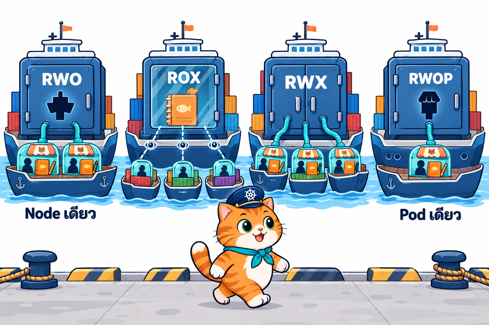<br>
  <em><b>รูปที่ 20</b> accessModes 4 แบบ: RWO (เมานต์ได้จาก Node เดียว), ROX (อ่านได้หลาย Node), RWX (อ่านเขียนหลาย Node), RWOP (Pod เดียวเท่านั้น) — เป็นคุณสมบัติที่ storage ต้องรองรับ</em>
</p>

**ตารางที่ 10** accessModes

| โหมด | ชื่อย่อ (คอลัมน์ ACCESS MODES) | ความหมาย | local-path |
|---|---|---|:---:|
| `ReadWriteOnce` | RWO | อ่านเขียนได้จาก **Node เดียว** (Pod หลายตัวบน Node นั้นใช้ร่วมได้) | ✅ |
| `ReadOnlyMany` | ROX | อ่านอย่างเดียวจากหลาย Node | – (ไม่ได้ทดลอง) |
| `ReadWriteMany` | RWX | อ่านเขียนจากหลาย Node พร้อมกัน | ❌ |
| `ReadWriteOncePod` | RWOP | อ่านเขียนได้จาก **Pod เดียว** ทั้งคลัสเตอร์ (GA ตั้งแต่ Kubernetes 1.29) | ✅ |

accessModes **ไม่ใช่สิทธิ์ที่ขอได้ตามใจ** แต่เป็นคุณสมบัติที่ storage ต้องรองรับ ดิสก์แบบบล็อกที่ต่อเข้าเครื่องได้ทีละเครื่องให้ RWX ไม่ได้ไม่ว่าจะเขียน YAML อย่างไร

### 6.2 ความจริงของ local-path (ทดสอบแล้ว)

<p align="center" id="fig-21">
  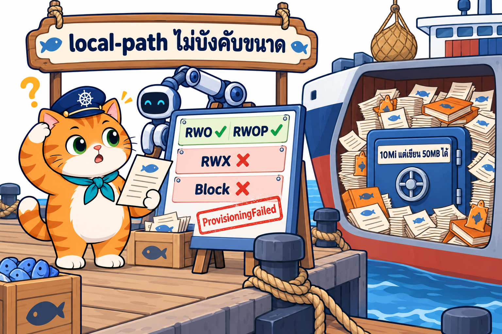<br>
  <em><b>รูปที่ 21</b> ความจริงของ local-path (ทดสอบแล้ว): รองรับแค่ RWO และ RWOP, ขอ RWX → ProvisioningFailed, volumeMode: Block ไม่รองรับ, ขนาดไม่ถูกบังคับ (เขียน 50MB ลง PVC 10Mi ได้)</em>
</p>

ผลจริงจาก LAB 5 (`describe pvc shared` ที่ขอ `ReadWriteMany` และ `describe pvc blk` ที่ขอ `volumeMode: Block`)

```text
  Warning  ProvisioningFailed    8s               rancher.io/local-path_local-path-provisioner-75f7fc7dc5-5dkx2_6485bdfa-b176-4448-844b-ec03de28220b  failed to provision volume with StorageClass "standard": NodePath only supports ReadWriteOnce and ReadWriteOncePod (1.22+) access modes
```

```text
  Warning  ProvisioningFailed    9s               rancher.io/local-path_local-path-provisioner-75f7fc7dc5-5dkx2_6485bdfa-b176-4448-844b-ec03de28220b  rancher.io/local-path does not support block volume provisioning
```

PVC ทั้งสองค้าง `Pending` และ Pod ที่รอ (`use-rwx`, `use-blk`) ค้าง `Pending` **โดยไม่มี Event ของ Pod เลย** (`Events: <none>`) ต้องไปดูที่ `describe pvc` จึงจะรู้สาเหตุ

ส่วนเรื่องขนาด เขียนไฟล์ 50MB ลง PVC ที่ขอ 10Mi สำเร็จ และ `df` เห็นดิสก์ทั้งก้อนของ Node

```text
52428800 bytes (50.0MB) copied, 0.378015 seconds, 132.3MB/s
-rw-r--r--    1 root     root       50.0M Oct  5 05:40 /data/big
Filesystem                Size      Used Available Use% Mounted on
/dev/sdd               1006.9G    224.6G    731.1G  23% /data
NAME       STATUS   VOLUME                                     CAPACITY   ACCESS MODES   STORAGECLASS   VOLUMEATTRIBUTESCLASS   AGE
rwo-data   Bound    pvc-ef6d2f75-cbb0-4b2f-9696-408f278e2d5d   10Mi       RWO            standard       <unset>                 5s
```

> **ข้อควรจำ:** ใน local-path `resources.requests.storage` เป็นแค่ตัวเลขที่ใช้จับคู่และนับ quota ไม่ได้จำกัดพื้นที่จริง แอปเขียนจนดิสก์ของ Node เต็มได้ ในระบบจริงที่ใช้ดิสก์ตามขนาด ขนาดจะถูกบังคับจริง (ขนาดดิสก์ `1006.9G` เป็นของเครื่องทดสอบ ของนักศึกษาจะต่างกัน)

### 6.3 RWO ไม่ได้แปลว่า Pod เดียว

<p align="center" id="fig-22">
  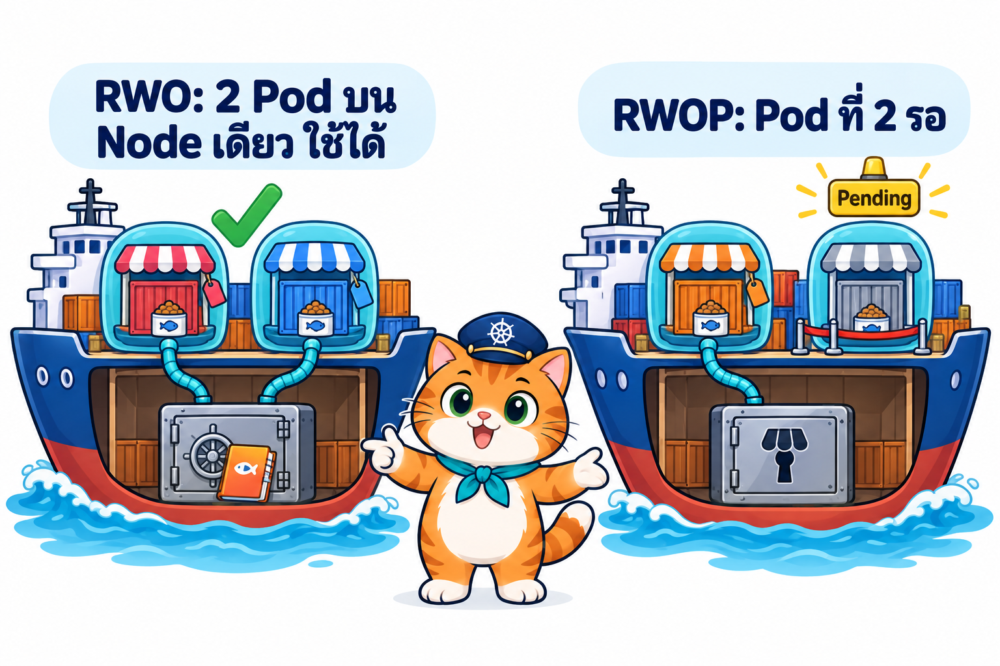<br>
  <em><b>รูปที่ 22</b> RWO ≠ Pod เดียว: Pod 2 ตัวบน Node เดียวกันใช้ PVC RWO พร้อมกันได้; ถ้าต้องการ Pod เดียวจริงใช้ RWOP — Pod ที่ 2 จะ Pending</em>
</p>

ความเข้าใจผิดที่พบบ่อยคือคิดว่า RWO = Pod เดียว ผลจริงจาก LAB 5: Pod `rwo-b` ที่ใช้ PVC เดียวกับ `rwo-a` ถูก scheduler ส่งไป Node เดียวกัน (ตาม nodeAffinity ของ PV) และอ่านไฟล์ที่ `rwo-a` เขียนได้

```text
NAME    READY   STATUS    RESTARTS   AGE   IP            NODE         NOMINATED NODE   READINESS GATES
rwo-a   1/1     Running   0          5s    10.244.2.11   lab-worker   <none>           <none>
rwo-b   1/1     Running   0          1s    10.244.2.12   lab-worker   <none>           <none>
05:40:06 from rwo-a
05:40:07 from rwo-b
```

ถ้าต้องการให้ระบบกันไม่ให้มี Pod ตัวที่สองจริง ๆ ใช้ `ReadWriteOncePod` Pod ตัวที่ 2 (`rwop-b`) ค้าง `Pending`

```text
  Warning  FailedScheduling  8s    default-scheduler  0/3 nodes are available: 1 node(s) had untolerated taint(s), 2 node(s) unavailable due to PersistentVolumeClaim with ReadWriteOncePod access mode already in-use by another pod. preemption: 0/3 nodes are available: 1 Preemption is not helpful for scheduling, 2 No preemption victims found for incoming pod.
```

(`1 node(s) had untolerated taint(s)` คือ control-plane ที่มี taint ส่วน worker 2 ตัวถูกตัดเพราะตู้ RWOP มีเจ้าของแล้ว) ความต่างนี้สำคัญมากกับฐานข้อมูล (หัวข้อ 14)

### 6.4 volumeMode: Filesystem และ Block

| volumeMode | Pod ได้อะไร | เขียนใน Pod ด้วย |
|---|---|---|
| `Filesystem` (default) | โฟลเดอร์ที่มีระบบไฟล์แล้ว | `volumeMounts[].mountPath` |
| `Block` | อุปกรณ์ดิสก์ดิบ ไม่มีระบบไฟล์ (ฐานข้อมูลบางตัวจัดการเอง) | `volumeDevices[].devicePath` |

ตัวอย่างจาก `02_LAB/labs/lab05-access/blk.yaml` (local-path ไม่รองรับ จึงค้าง Pending ตามผลด้านบน)

```yaml
# ใบเบิกแบบ Block
apiVersion: v1
kind: PersistentVolumeClaim
metadata:
  name: blk
spec:
  accessModes: [ReadWriteOnce]
  volumeMode: Block                # ค่า default คือ Filesystem
  resources:
    requests:
      storage: 10Mi
```

ฝั่ง Pod (`use-blk`) ใช้ `volumeDevices` แทน `volumeMounts`

```yaml
      volumeDevices:
        - name: data
          devicePath: /dev/xvda      # ดิสก์ดิบจะโผล่เป็นอุปกรณ์ตรงนี้
```

---

## 7. การผูก (binding) และสถานะ

### 7.1 สถานะของ PVC และ PV

<p align="center" id="fig-23">
  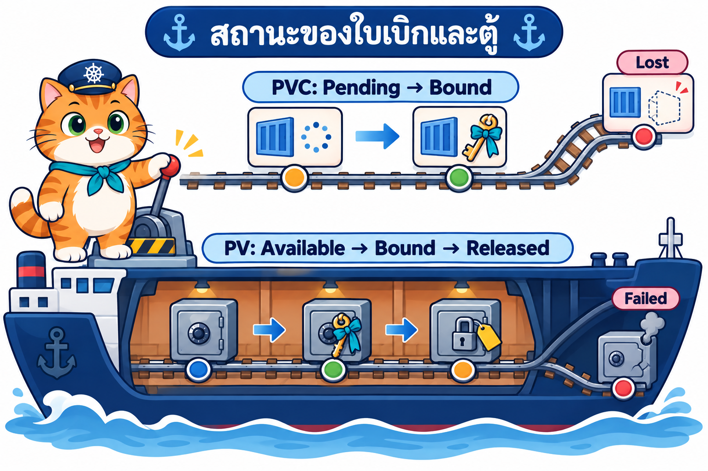<br>
  <em><b>รูปที่ 23</b> สถานะ: PVC Pending → Bound (Lost เมื่อ PV หาย); PV Available → Bound → Released (คืนใบเบิกแล้ว) และ Failed เมื่อคืนตู้ไม่สำเร็จ</em>
</p>

**ตารางที่ 11** สถานะ (คอลัมน์ `STATUS`)

| Object | สถานะ | ความหมาย | เห็นใน LAB |
|---|---|---|---|
| PVC | `Pending` | ยังไม่ได้ตู้ (รอ Pod, ไม่มี PV ที่ตรง, provisioner ล้มเหลว, quota) | LAB 3, 4, 5, 7 |
| PVC | `Bound` | ผูกกับ PV แล้ว | ทุก LAB |
| PVC | `Lost` | PV ที่ผูกอยู่หายไป | – (ไม่ได้ทดลอง) |
| PV | `Available` | ว่าง ยังไม่ผูก | LAB 4, 6, 10 |
| PV | `Bound` | ผูกกับ PVC แล้ว | ทุก LAB |
| PV | `Released` | PVC ถูกลบแล้ว แต่ PV ยังไม่ถูกคืนสู่สภาพว่าง (ยังมี `claimRef` เดิม) | LAB 4, 6, 10 |
| PV | `Failed` | การคืนตู้อัตโนมัติล้มเหลว | – (ไม่ได้ทดลอง) |

PVC ใน Kubernetes v1.37 ยังมี **Conditions** บอกว่ามี Pod อ้างถึงอยู่หรือไม่ (ผลจริงจาก LAB 3)

```text
Used By:       writer
Conditions:
  Type     Status  LastProbeTime                     LastTransitionTime                Reason        Message
  ----     ------  -----------------                 ------------------                ------        -------
  Unused   False   Mon, 01 Jan 0001 00:00:00 +0000   Mon, 05 Oct 2026 12:39:12 +0700   PodUsingPVC   A pod is currently referencing this PVC
```

### 7.2 volumeBindingMode: WaitForFirstConsumer กับ Immediate

<p align="center" id="fig-24">
  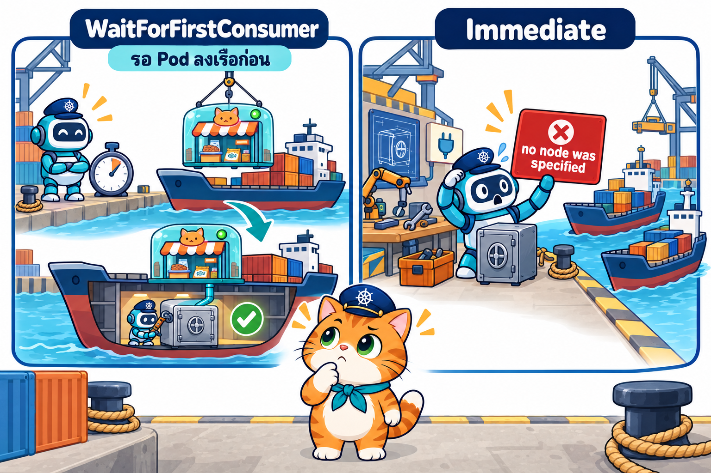<br>
  <em><b>รูปที่ 24</b> volumeBindingMode: WaitForFirstConsumer = รอให้ scheduler เลือก Node ของ Pod ก่อนแล้วค่อยสร้างตู้บนเรือลำนั้น; Immediate สร้างทันที — กับ local-path ล้มเหลว "no node was specified"</em>
</p>

PVC `notes` ของ LAB 3 ค้าง `Pending` ทันทีหลังสร้าง ไม่ได้แปลว่าผิด แต่ class `standard` เป็น **WaitForFirstConsumer**

```text
NAME    STATUS    VOLUME   CAPACITY   ACCESS MODES   STORAGECLASS   VOLUMEATTRIBUTESCLASS   AGE
notes   Pending                                      standard       <unset>                 3s
...
  Normal  WaitForFirstConsumer  3s    persistentvolume-controller  waiting for first consumer to be created before binding
```

เมื่อ Pod `writer` ถูกสร้าง scheduler เลือก Node ให้ Pod ก่อน (ดู requests, taint, affinity ของ Pod ตามปกติ) แล้วเขียนชื่อ Node ลง annotation ของ PVC ให้ provisioner สร้างตู้บน Node นั้น

```text
Annotations:   pv.kubernetes.io/bind-completed: yes
               pv.kubernetes.io/bound-by-controller: yes
               volume.beta.kubernetes.io/storage-provisioner: rancher.io/local-path
               volume.kubernetes.io/selected-node: lab-worker
               volume.kubernetes.io/storage-provisioner: rancher.io/local-path
```

**ตารางที่ 12** เทียบ volumeBindingMode

| | `WaitForFirstConsumer` | `Immediate` |
|---|---|---|
| สร้าง/ผูกตู้เมื่อไร | เมื่อมี Pod ตัวแรกใช้ PVC และ scheduler เลือก Node แล้ว | ทันทีที่สร้าง PVC |
| ข้อดี | ตู้อยู่บน Node (หรือ zone) ที่ Pod ลงได้จริง | ได้ตู้ก่อน ไม่ต้องมี Pod |
| ข้อเสีย | PVC `Pending` จนกว่าจะมี Pod (ปกติ ไม่ใช่ error) | storage ที่ผูก Node/zone อาจได้ตู้ในที่ที่ Pod ลงไม่ได้ |
| กับ local-path | ✅ (ค่าของ `standard`) | ❌ `configuration error, no node was specified` |

ผลจริงของ class `local-immediate` ใน LAB 7 (provisioner ไม่รู้ว่าจะสร้างโฟลเดอร์บน Node ไหน PVC ค้าง Pending)

```text
  Warning  ProvisioningFailed    9s               rancher.io/local-path_local-path-provisioner-75f7fc7dc5-5dkx2_6485bdfa-b176-4448-844b-ec03de28220b  failed to provision volume with StorageClass "local-immediate": configuration error, no node was specified
```

**ตารางที่ 13** Events ที่ควรอ่านเป็น (`kubectl describe pvc <ชื่อ>`)

| Reason | ความหมาย |
|---|---|
| `WaitForFirstConsumer` | รอ Pod ตัวแรก (ปกติของ class แบบ WaitForFirstConsumer) |
| `ExternalProvisioning` | ส่งงานให้ provisioner ภายนอก รอสร้างตู้ |
| `Provisioning` / `ProvisioningSucceeded` | provisioner กำลังสร้าง / สร้างสำเร็จ |
| `ProvisioningFailed` | provisioner สร้างไม่ได้ (โหมด/ชนิดไม่รองรับ, ตั้งค่า class ผิด) |
| `FailedBinding` | ไม่มี PV ที่ตรงและไม่มี class ให้สร้าง |
| `ExternalExpanding` | รอ controller ภายนอกขยาย PVC (หัวข้อ 9) |

> **ข้อควรจำ:** Pod ที่ค้าง `Pending` เพราะ PVC บางครั้ง **ไม่มี Event ของ Pod เลย** (LAB 5) ให้ไล่ดู `kubectl describe pvc` ทุกครั้งที่ Pod ที่ใช้ PVC ไม่ขึ้น

---
## 8. reclaimPolicy และ finalizers

### 8.1 Delete กับ Retain

<p align="center" id="fig-25">
  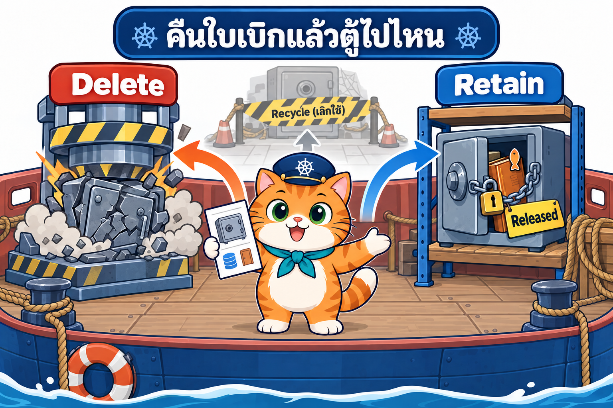<br>
  <em><b>รูปที่ 25</b> reclaimPolicy เมื่อลบ PVC: Delete = PV และโฟลเดอร์บน Node ถูกลบทิ้ง (ค่า default ของ standard); Retain = PV เหลือสถานะ Released ข้อมูลยังอยู่; Recycle เลิกใช้แล้ว</em>
</p>

`persistentVolumeReclaimPolicy` ของ PV บอกว่าเมื่อ **PVC ที่ผูกอยู่ถูกลบ** จะทำอะไรกับตู้

**ตารางที่ 14** reclaimPolicy

| Policy | เมื่อลบ PVC | ค่า default ของ | ผลจริงใน LAB |
|---|---|---|---|
| `Delete` | provisioner ลบ PV **และข้อมูลจริง** (local-path ลบโฟลเดอร์บน Node) | PV ที่ StorageClass สร้าง (เมื่อ class ไม่ระบุ reclaimPolicy) | LAB 6: PV `Released` 1–2 วินาทีแล้วหาย, `ls /var/local-path-provisioner/` ว่าง |
| `Retain` | PV เหลือสถานะ `Released` **ข้อมูลยังอยู่ครบ** ผู้ดูแลต้องจัดการเอง | PV ที่สร้างเองด้วยมือ | LAB 4, 6, 7, 10: PV `Released` + ไฟล์ยังอยู่บน Node |
| `Recycle` | (เลิกใช้แล้ว) เคยลบไฟล์ใน volume แล้วให้ใช้ต่อ | – | ไม่ใช้ ให้ใช้ dynamic provisioning แทน |

ผลจริงของ Delete ใน LAB 6 (ลบ Pod ที่ใช้ PVC ซึ่งถูกสั่งลบไว้แล้ว): ช่วงสั้น ๆ เห็น `Released` แล้ว PV ก็หายไปเอง ไม่ต้องตกใจกับสถานะนี้

```text
NAME                                                        CAPACITY   ACCESS MODES   RECLAIM POLICY   STATUS     CLAIM            STORAGECLASS   VOLUMEATTRIBUTESCLASS   REASON   AGE
persistentvolume/pvc-8584059b-0fd6-421f-9daa-44fd8f36a76d   10Mi       RWO            Delete           Released   default/ledger   standard       <unset>                          8s
...
No resources found
```

**เปลี่ยน policy ของ PV ที่มีอยู่แล้ว** ด้วย `kubectl patch pv` (ใช้ได้กับ PV จาก class `standard` ที่เป็น Delete เพื่อเก็บข้อมูลไว้ก่อนลบ PVC)

```bash
kubectl patch pv $PV -p '{"spec":{"persistentVolumeReclaimPolicy":"Retain"}}'
```

```text
persistentvolume/pvc-4c821b49-b44e-4818-a63e-c65943143e39 patched
NAME                                       CAPACITY   ACCESS MODES   RECLAIM POLICY   STATUS   CLAIM            STORAGECLASS   VOLUMEATTRIBUTESCLASS   REASON   AGE
pvc-4c821b49-b44e-4818-a63e-c65943143e39   10Mi       RWO            Retain           Bound    default/ledger   standard       <unset>                          2s
```

หลังลบ Pod และ PVC ตู้นี้ `Released` และไฟล์ `keepme.txt` ยังอยู่บน Node

```text
pvc-4c821b49-b44e-4818-a63e-c65943143e39   10Mi       RWO            Retain           Released   default/ledger   standard       <unset>                          10s
N=lab-worker
pvc-4c821b49-b44e-4818-a63e-c65943143e39_default_ledger
keepme เขียนเมื่อ 05:41:40
```

> **ข้อควรจำ:** Retain เก็บข้อมูลไว้ แต่ **ไม่มีใครลบให้** แม้จะลบ PV แล้วก็ตาม ใน LAB 6 ลบ PV ที่ Retain ไปแล้ว โฟลเดอร์ `pvc-…_default_ledger` ยังอยู่บน Node และใน LAB 10 ลบ namespace `som-shop` แล้ว PV ยัง `Released` ผู้ดูแลต้อง `kubectl delete pv` และลบโฟลเดอร์ (`docker exec <node> rm -rf …`) เอง

### 8.2 กู้ PV ที่ Released

<p align="center" id="fig-26">
  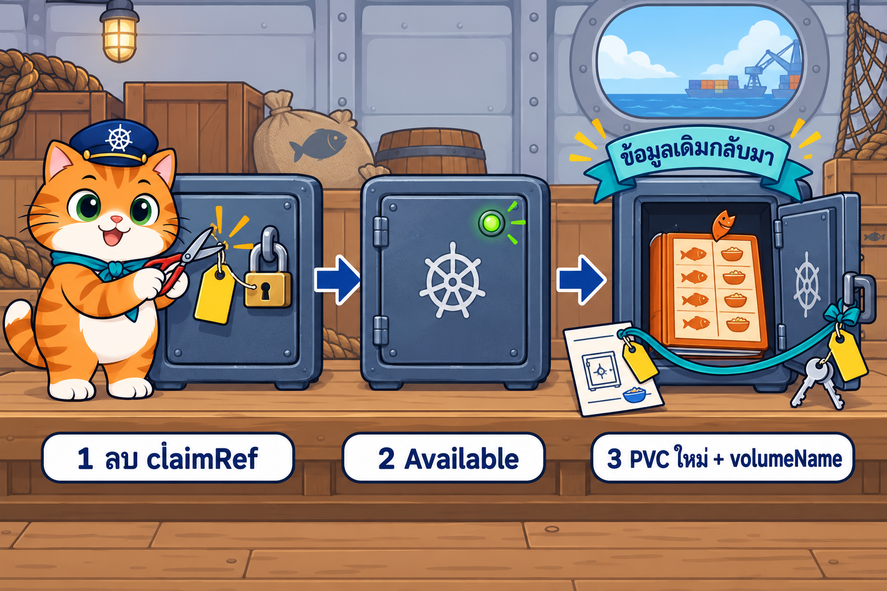<br>
  <em><b>รูปที่ 26</b> กู้ PV ที่ Released: ลบ spec.claimRef → Available → สร้าง PVC ใหม่ใส่ volumeName → Bound ข้อมูลเดิมกลับมา (ทดสอบแล้ว)</em>
</p>

PV ที่ `Released` ยังจำ `claimRef` ของ PVC ตัวเก่า (uid เดิม) ไว้ จึง **ไม่ถูกผูกกับ PVC ใหม่อัตโนมัติ แม้ PVC ใหม่จะชื่อเดิม** ผลจริงใน LAB 6: apply `pvc.yaml` ชื่อ `ledger` ซ้ำ ได้ PV ใหม่ (`pvc-9b83…`, reclaimPolicy Delete ตาม class) และ `keepme.txt` เป็นไฟล์ใหม่ (`05:41:53`) ส่วนตู้เดิมยัง `Released` อยู่ข้าง ๆ

```text
NAME                                       CAPACITY   ACCESS MODES   RECLAIM POLICY   STATUS     CLAIM            STORAGECLASS   VOLUMEATTRIBUTESCLASS   REASON   AGE
pvc-4c821b49-b44e-4818-a63e-c65943143e39   10Mi       RWO            Retain           Released   default/ledger   standard       <unset>                          15s
pvc-9b832bb3-1026-4f3b-a81e-1810820588b9   10Mi       RWO            Delete           Bound      default/ledger   standard       <unset>                          2s
keepme เขียนเมื่อ 05:41:53
```

ขั้นตอนกู้ตู้เดิม (ทดสอบแล้วทั้งใน LAB 6 และ LAB 10)

1. ลบ `spec.claimRef` ออกจาก PV → สถานะเป็น `Available`

   ```bash
   kubectl patch pv $PV --type json -p '[{"op":"remove","path":"/spec/claimRef"}]'
   ```

   ```text
   persistentvolume/pvc-4c821b49-b44e-4818-a63e-c65943143e39 patched
   NAME                                       CAPACITY   ACCESS MODES   RECLAIM POLICY   STATUS      CLAIM   STORAGECLASS   VOLUMEATTRIBUTESCLASS   REASON   AGE
   pvc-4c821b49-b44e-4818-a63e-c65943143e39   10Mi       RWO            Retain           Available           standard       <unset>                          30s
   ```

2. สร้าง PVC ที่มี `volumeName` ชี้ PV นั้น (class/โหมด/ขนาดต้องเข้ากัน) → `Bound` กับตู้เดิม และ Pod อ่านข้อมูลเดิมได้

   ```text
   NAME     STATUS   VOLUME                                     CAPACITY   ACCESS MODES   STORAGECLASS   VOLUMEATTRIBUTESCLASS   AGE
   ledger   Bound    pvc-4c821b49-b44e-4818-a63e-c65943143e39   10Mi       RWO            standard       <unset>                 1s
   ...
   keepme เขียนเมื่อ 05:41:40
   ```

> **ข้อควรจำ (LAB 10):** spec ของ PVC ที่ Bound แล้ว **แก้ไม่ได้** (ยกเว้น `resources.requests` และ `volumeAttributesClassName`) ถ้าสร้าง PVC กู้ตู้ด้วย `volumeName` แล้วไป `kubectl apply` ไฟล์ที่มี PVC ชื่อเดียวกันแต่ไม่มี `volumeName` จะได้ `The PersistentVolumeClaim "som-db-data" is invalid: spec: Forbidden: spec is immutable after creation except resources.requests and volumeAttributesClassName for bound claims` LAB จึง apply เฉพาะ Deployment ด้วย `-l app=som-db`

### 8.3 finalizers: คลิปแดงกันฉีกใบเบิก

<p align="center" id="fig-27">
  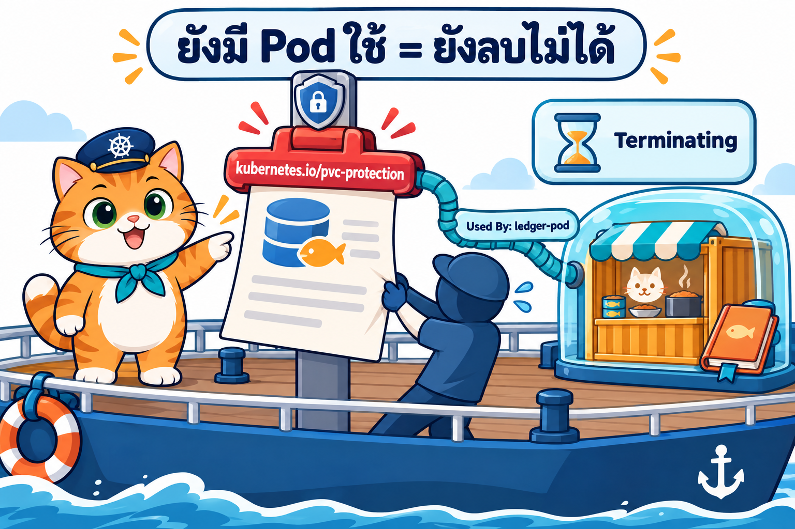<br>
  <em><b>รูปที่ 27</b> finalizers kubernetes.io/pvc-protection และ pv-protection: ลบ PVC ที่ Pod ยังใช้อยู่ → ค้าง Terminating จนกว่า Pod จะเลิกใช้ กันข้อมูลหายระหว่างทำงาน</em>
</p>

finalizer คือชื่อที่ติดใน `metadata.finalizers` ของ object บอกว่า "ยังมีงานต้องทำก่อนลบจริง" (บทที่ 4 เห็นกับ namespace) PVC ทุกตัวมี `kubernetes.io/pvc-protection` และ PV มี `kubernetes.io/pv-protection` ผลจริงจาก LAB 6 เมื่อสั่งลบ PVC ที่ Pod `ledger-pod` ยังใช้อยู่

```text
persistentvolumeclaim "ledger" deleted from default namespace
NAME     STATUS        VOLUME                                     CAPACITY   ACCESS MODES   STORAGECLASS   VOLUMEATTRIBUTESCLASS   AGE
ledger   Terminating   pvc-8584059b-0fd6-421f-9daa-44fd8f36a76d   10Mi       RWO            standard       <unset>                 7s
Status:        Terminating (lasts 2s)
Finalizers:    [kubernetes.io/pvc-protection]
Used By:       ledger-pod
```

PVC ค้าง `Terminating` (ข้อความ `deleted` แค่บอกว่ารับคำสั่งแล้ว) Pod ยังอ่านเขียนได้ตามปกติ เมื่อลบ Pod แล้ว finalizer จึงถูกถอดและ PVC ถูกลบจริง ส่วน PV ที่ยังผูกกับ PVC ก็ถูกกันไม่ให้ลบด้วย `kubernetes.io/pv-protection` (`["kubernetes.io/pv-protection"]`)

> **ข้อควรจำ:** ถ้า `kubectl delete pvc` แล้วค้าง ให้ดู `Used By:` ใน `describe pvc` แล้วหยุด Pod/Deployment ที่ใช้อยู่ก่อน **อย่าลบ finalizer เอง** เพราะจะทำให้ข้อมูลถูกลบขณะ Pod ยังใช้งาน

---

## 9. การขยาย PVC

<p align="center" id="fig-28">
  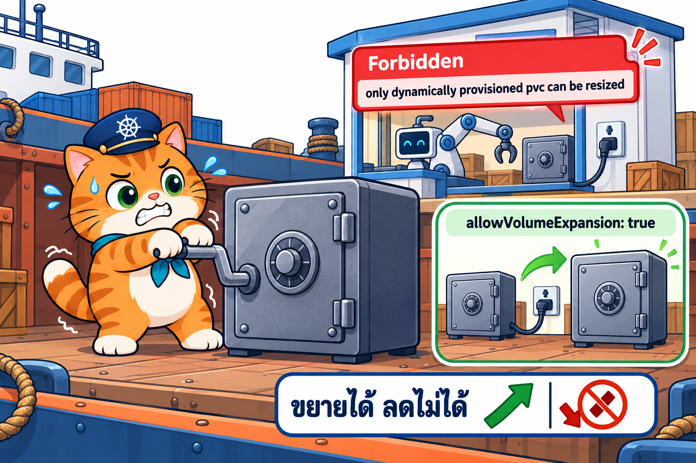<br>
  <em><b>รูปที่ 28</b> ขยาย PVC: แก้ requests.storage ให้ใหญ่ขึ้นได้ก็ต่อเมื่อ StorageClass มี allowVolumeExpansion: true และ driver รองรับ — standard ของ kind ถูกปฏิเสธ (Forbidden) ลดขนาดไม่ได้เสมอ</em>
</p>

การขยาย PVC คือการแก้ `spec.resources.requests.storage` ให้ใหญ่ขึ้น (`kubectl patch`, `kubectl edit` หรือแก้ไฟล์แล้ว apply) เงื่อนไขมีสองชั้น

1. **API server** ยอมรับก็ต่อเมื่อ PVC มาจาก StorageClass ที่ `allowVolumeExpansion: true`
2. **driver** ต้องขยายได้จริง (CSI driver ที่มี resizer) เมื่อขยายสำเร็จ `status.capacity` จึงเปลี่ยนตาม

ผลจริงจาก LAB 7

| ลอง | ผล |
|---|---|
| ขยาย PVC `std` (class `standard`) เป็น 20Mi | `Error from server (Forbidden): persistentvolumeclaims "std" is forbidden: only dynamically provisioned pvc can be resized and the storageclass that provisions the pvc must support resize` |
| ขยาย PVC `ex` (class `local-expand` ที่ตั้ง `allowVolumeExpansion: true`) เป็น 20Mi | `persistentvolumeclaim/ex patched` แต่ 20 วินาทีต่อมา `spec=20Mi status=10Mi`, PV ยัง `10Mi` และมี Event `ExternalExpanding  waiting for an external controller to expand this PVC` — local-path ไม่มีตัวขยาย จึงค้างแบบนี้ไปเรื่อย ๆ |
| ลด `ex` เป็น 5Mi | `The PersistentVolumeClaim "ex" is invalid: spec.resources.requests.storage: Forbidden: field can not be less than status.capacity` |

> **ข้อควรจำ:** PVC **ขยายได้ แต่ลดไม่ได้** และการตั้ง `allowVolumeExpansion: true` เป็นแค่ "ใบอนุญาต" ถ้า driver ไม่รองรับก็ไม่มีอะไรเกิดขึ้น ควรเผื่อขนาดตั้งแต่แรกเมื่อใช้ storage ที่ขยายไม่ได้

---

## 10. subPath, readOnly, fsGroup และสิทธิ์ไฟล์

### 10.1 subPath และ readOnly

<p align="center" id="fig-29">
  <br>
  <em><b>รูปที่ 29</b> subPath = เมานต์เฉพาะโฟลเดอร์ย่อยของ volume; readOnly: true = อ่านได้อย่างเดียว เขียนแล้วได้ Read-only file system</em>
</p>

volume เดียวกันเมานต์ได้หลายที่ในหลายแบบ ตัวอย่างจาก `02_LAB/labs/lab09-misc/pod-mounts.yaml`

```yaml
      volumeMounts:
        - name: data
          mountPath: /data             # ทั้งตู้
        - name: data
          mountPath: /site
          subPath: site                # เฉพาะโฟลเดอร์ย่อย site ในตู้ (ไม่มีจะถูกสร้างให้)
        - name: data
          mountPath: /ro
          readOnly: true               # ตู้เดียวกันแต่อ่านอย่างเดียว
        - name: e
          mountPath: /eph
```

ผลจริง (LAB 9): ไฟล์ที่เขียนผ่าน `/site/page.txt` ไปอยู่ใน `/data/site/` และเขียน `/ro` ไม่ได้

```text
ls /data/site → page.txt
touch: /ro/x: Read-only file system
readOnly ทำงาน: เขียน /ro ไม่ได้
```

| ฟิลด์ใน `volumeMounts` | ใช้ทำอะไร |
|---|---|
| `subPath` | ให้หลาย container/แอปใช้ PVC เดียวโดยแยกโฟลเดอร์ หรือเมานต์แค่ส่วนที่ต้องการ |
| `readOnly: true` | container ที่ควรอ่านอย่างเดียว (เช่น ตัวอ่าน log/รายงาน) กันเขียนพลาด |

### 10.2 fsGroup และสิทธิ์ไฟล์ของ postgres

<p align="center" id="fig-30">
  <br>
  <em><b>รูปที่ 30</b> สิทธิ์ไฟล์ของ postgres: รันเป็น uid 70 ต้องเป็นเจ้าของ PGDATA (โหมด 0700) — local-path สร้างโฟลเดอร์ 0777 ของ root และไม่สนใจ fsGroup จึงใช้ PGDATA เป็นโฟลเดอร์ย่อย pgdata ให้ postgres สร้างเอง</em>
</p>

`securityContext.fsGroup` ขอให้ kubelet เปลี่ยนกลุ่มเจ้าของของ volume เป็นกลุ่มที่ระบุ เพื่อให้ container ที่รันเป็น non-root เขียนได้ ได้ผลกับ `emptyDir` และ CSI driver ส่วนใหญ่ แต่ **ไม่มีผลกับ local-path** เพราะเบื้องหลังเป็น `hostPath` ผลจริงจาก LAB 9 (Pod `fsg` รันเป็น uid/gid 70 และตั้ง `fsGroup: 70`)

```text
uid=70 gid=70 groups=70
drwxrwxrwx    3 0        0             4096 Oct  5 05:46 /data
drwxrwxrwx    2 0        0             4096 Oct  5 05:46 /eph
```

โฟลเดอร์ยังเป็นของ root (`0 0`) แต่เพราะโหมดเป็น `drwxrwxrwx` (0777) uid 70 จึงยังเขียนได้ และไฟล์ที่เขียนเป็นของ `70 70` บน Node (`-rw-r--r-- 1 70 70   36 … page.txt`)

postgres มีเงื่อนไขเข้มกว่านั้น คือโฟลเดอร์ข้อมูล (PGDATA) ต้องเป็นของ uid ที่รัน postgres และมีโหมด 0700 ถ้าใช้ราก volume ที่เป็น 0777 ของ root ตรง ๆ จะเริ่มไม่ได้ ร้านน้องส้มจึงตั้ง `PGDATA` เป็น **โฟลเดอร์ย่อย** (แบบเดียวกับบทที่ 6–7) ให้ postgres สร้างเองด้วยสิทธิ์ที่ถูกต้อง (`02_LAB/som-shop-v4/k8s/10-db.yaml`)

```yaml
          env:
            - name: PGDATA           # ใช้โฟลเดอร์ย่อย pgdata (postgres ต้องการโฟลเดอร์ 0700 ของตัวเอง)
              value: /var/lib/postgresql/data/pgdata
          volumeMounts:
            - name: db-data
              mountPath: /var/lib/postgresql/data
```

ผลจริงบน Node (LAB 10 ขั้น E)

```text
N=lab-worker PV=pvc-6a5a0bc7-03be-4fd3-83ba-399ee081b07d
total 4
drwx------ 19 70 70 4096 Oct  5 05:48 pgdata
total 128
-rw------- 1 70 70     3 Oct  5 05:47 PG_VERSION
drwx------ 6 70 70  4096 Oct  5 05:47 base
drwx------ 2 70 70  4096 Oct  5 05:48 global
...
```

> **หมายเหตุ:** `fsGroupChangePolicy` (`OnRootMismatch` / `Always`) ใช้ลดเวลาที่ kubelet ไล่เปลี่ยนสิทธิ์ไฟล์ทุกไฟล์ใน volume ขนาดใหญ่ทุกครั้งที่ Pod เริ่ม มีผลเฉพาะ volume ที่รองรับ fsGroup (ไม่ได้ใช้ในบทนี้)

---

## 11. ข้อมูลผูก Node (ต่อจากบท 003)

<p align="center" id="fig-31">
  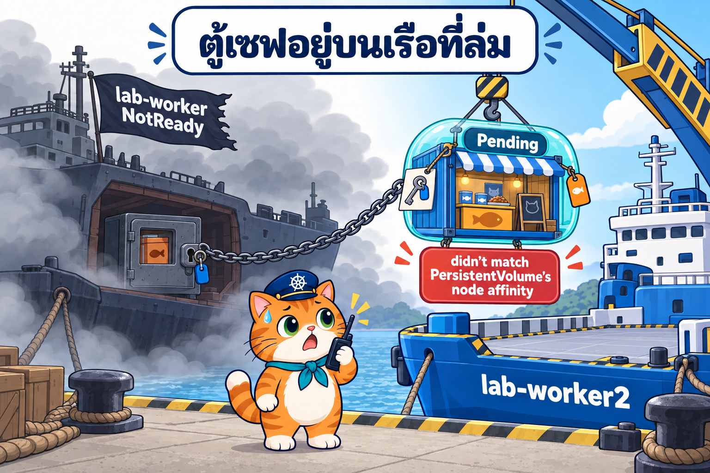<br>
  <em><b>รูปที่ 31</b> Node ล่มเมื่อใช้ local storage: Pod ใหม่ของ Deployment วางบน Node อื่นไม่ได้ เพราะ PV มี nodeAffinity — ค้าง Pending จนกว่า Node เดิมจะกลับมา</em>
</p>

บทที่ 3 เห็นแล้วว่าเมื่อ Node ล่ม Pod ของ controller จะถูกสร้างใหม่บน Node อื่น แต่ถ้า Pod นั้นใช้ PV แบบ local (nodeAffinity ชี้ Node ที่ล่ม) Pod ใหม่ **ไปไหนไม่ได้** ผลจริงจาก LAB 8 (Deployment `nd` 1 ตัวใช้ PVC `nd-data` ลง `lab-worker` แล้ว `docker stop lab-worker`)

**ตารางที่ 15** ลำดับเหตุการณ์ในการทดลอง (นับจาก `docker stop` เสร็จ ซึ่งใช้เวลา 10 วินาที)

| เวลา | เหตุการณ์ |
|---|---|
| 0 วินาที | Node หยุดแล้ว แต่ `kubectl get node` ยังเป็น `Ready` (kubelet หยุดส่ง heartbeat) |
| ~41 วินาที | Node เป็น `NotReady` ได้ taint `node.kubernetes.io/unreachable:NoExecute` และ `NoSchedule` |
| ~66 วินาที | ครบ `tolerationSeconds: 30` → Pod เดิม `Terminating`, Pod ใหม่ `Pending` |
| `docker start` | Node `Ready` ใน 3 วินาที → Pod ใหม่ `Running` บน Node เดิมใน ~7 วินาที ข้อมูลเดิมอยู่ครบ |

```text
75s         Warning   FailedScheduling          pod/nd-d49d6fd9f-xdg9j           0/3 nodes are available: 1 node(s) didn't match PersistentVolume's node affinity, 2 node(s) had untolerated taint(s). preemption: 0/3 nodes are available: 3 Preemption is not helpful for scheduling.
```

`1 node(s) didn't match PersistentVolume's node affinity` คือ `lab-worker2` ที่ยังดีอยู่แต่ไม่มีตู้ ส่วน `2 node(s) had untolerated taint(s)` คือ control-plane กับ `lab-worker` ที่ล่ม LAB ลด `tolerationSeconds` จาก default 300 วินาทีเหลือ 30 วินาทีเพื่อไม่ต้องรอนาน

```yaml
      tolerations:
        - key: node.kubernetes.io/unreachable
          operator: Exists
          effect: NoExecute
          tolerationSeconds: 30
        - key: node.kubernetes.io/not-ready
          operator: Exists
          effect: NoExecute
          tolerationSeconds: 30
```

> **ข้อควรจำ:** PVC ไม่ได้ทำให้ข้อมูล "อยู่ทุกที่" ข้อมูลอยู่ที่ storage ของ PV ถ้า storage ผูกกับ Node (local-path, `local`, `hostPath`) แอปจะหยุดตลอดเวลาที่ Node ล่ม ระบบจริงจึงใช้ storage เครือข่าย (CSI ที่ย้ายดิสก์ไป Node ใหม่ได้) หรือทำสำเนาข้อมูลระดับแอป (เช่น replication ของฐานข้อมูล) ตัวเลขเวลาในเครื่องนักศึกษาอาจต่างจากตาราง

---

## 12. ResourceQuota ของ storage และ ephemeral volume

### 12.1 ResourceQuota ของ storage

<p align="center" id="fig-32">
  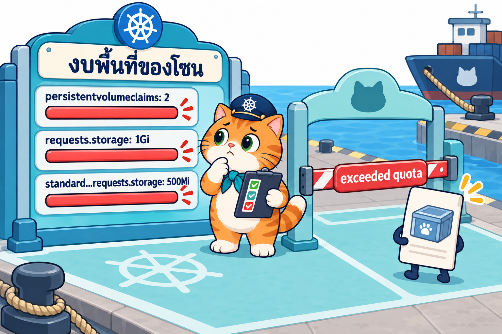<br>
  <em><b>รูปที่ 32</b> ResourceQuota คุมพื้นที่ต่อ namespace (ต่อบท 004): persistentvolumeclaims, requests.storage และ &lt;class&gt;.storageclass.storage.k8s.io/requests.storage — เกินแล้ว PVC ถูกปฏิเสธ exceeded quota</em>
</p>

ResourceQuota ของบทที่ 4 คุมพื้นที่เก็บข้อมูลได้ด้วย (`02_LAB/labs/lab09-misc/00-ns-quota.yaml`)

```yaml
apiVersion: v1
kind: ResourceQuota
metadata:
  name: storage
  namespace: quota-lab
spec:
  hard:
    persistentvolumeclaims: "2"                              # ใบเบิกได้ไม่เกิน 2 ใบ
    requests.storage: 1Gi                                    # รวมทุก class ขอได้ไม่เกิน 1Gi
    standard.storageclass.storage.k8s.io/requests.storage: 500Mi   # เฉพาะ class standard ไม่เกิน 500Mi
```

| key | คุมอะไร |
|---|---|
| `persistentvolumeclaims` | จำนวน PVC ใน namespace |
| `requests.storage` | ผลรวม `requests.storage` ของทุก PVC |
| `<class>.storageclass.storage.k8s.io/requests.storage` | ผลรวมเฉพาะ PVC ของ class นั้น |
| `<class>.storageclass.storage.k8s.io/persistentvolumeclaims` | จำนวน PVC ของ class นั้น |

ผลจริงจาก LAB 9: มี `p400` (400Mi) แล้ว ขอ `p200` (200Mi) เกินงบของ class standard

```text
Error from server (Forbidden): error when creating "pvc-200.yaml": persistentvolumeclaims "p200" is forbidden: exceeded quota: storage, requested: standard.storageclass.storage.k8s.io/requests.storage=200Mi, used: standard.storageclass.storage.k8s.io/requests.storage=400Mi, limited: standard.storageclass.storage.k8s.io/requests.storage=500Mi
```

หลังสร้าง `p100` แล้ว `describe quota` เต็มทั้งจำนวนและงบของ class

```text
Resource                                               Used   Hard
--------                                               ----   ----
persistentvolumeclaims                                 2      2
requests.storage                                       500Mi  1Gi
standard.storageclass.storage.k8s.io/requests.storage  500Mi  500Mi
```

quota นับ **ตอนสร้าง PVC** (admission) แม้ PVC ยัง `Pending` (ยังไม่มี Pod) ก็นับแล้ว และ PVC ที่ไม่ใส่ class ถูกนับเป็น class `standard` เพราะ default class ถูกใส่ให้ก่อน

### 12.2 Generic ephemeral volume

<p align="center" id="fig-33">
  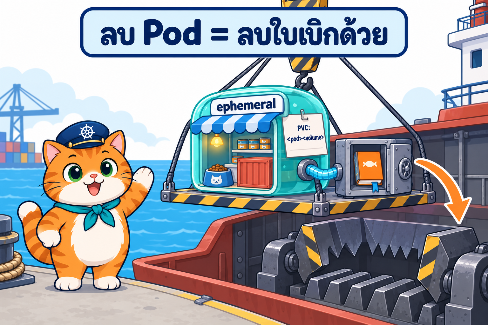<br>
  <em><b>รูปที่ 33</b> Generic ephemeral volume: เขียน volumeClaimTemplate ใน Pod → ได้ PVC ชื่อ &lt;pod&gt;-&lt;volume&gt; จาก StorageClass และถูกลบพร้อม Pod (ทดสอบแล้ว fsg-e หายตาม Pod)</em>
</p>

ถ้าต้องการพื้นที่ชั่วคราวที่ใหญ่หรือมีคุณสมบัติของ StorageClass แต่อายุเท่า Pod (แบบ emptyDir) ใช้ volume ชนิด `ephemeral` (`02_LAB/labs/lab09-misc/pod-mounts.yaml`)

```yaml
  volumes:
    - name: e
      ephemeral:                       # generic ephemeral volume: ได้ PVC ชื่อ <pod>-<volume> = fsg-e เกิดและตายพร้อม Pod
        volumeClaimTemplate:
          spec:
            accessModes: [ReadWriteOnce]
            resources:
              requests:
                storage: 5Mi
```

Kubernetes สร้าง PVC ชื่อ `<ชื่อ Pod>-<ชื่อ volume>` (`fsg-e`) ที่มี ownerReferences ชี้ Pod เมื่อ Pod ถูกลบ garbage collector ลบ PVC ตาม (และ PV ตาม reclaimPolicy) ผลจริงจาก LAB 9

```text
[{"apiVersion":"v1","blockOwnerDeletion":true,"controller":true,"kind":"Pod","name":"fsg","uid":"dbd236f5-6739-4039-b67c-d238aac04b97"}]
```

หลัง `kubectl delete pod fsg` เหลือแค่ `fsg-data` (PVC ปกติ) ส่วน `fsg-e` หายไป

```text
NAME       STATUS   VOLUME                                     CAPACITY   ACCESS MODES   STORAGECLASS   VOLUMEATTRIBUTESCLASS   AGE
fsg-data   Bound    pvc-597b9f67-c9c4-42fb-9bfe-dca8e2184803   10Mi       RWO            standard       <unset>                 13s
```

> **ข้อควรจำ:** PVC ของ ephemeral volume เป็น PVC จริง จึง **ถูกนับใน ResourceQuota** ของ namespace ด้วย

---

## 13. Backup และ snapshot (ปูทาง)

<p align="center" id="fig-34">
  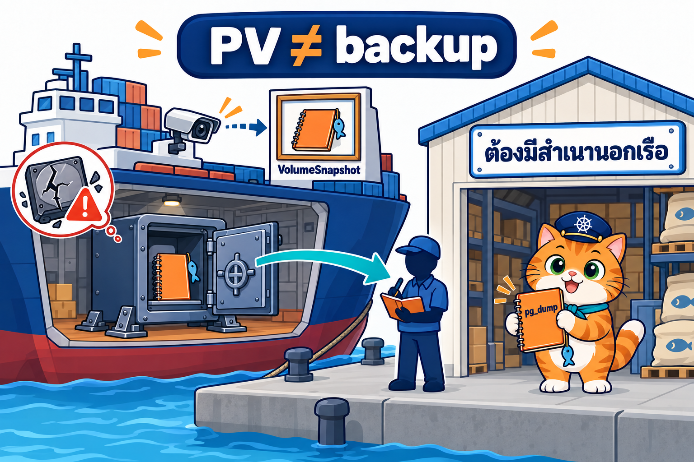<br>
  <em><b>รูปที่ 34</b> PV ไม่ใช่ backup: Retain กันลบพลาดได้แต่ Node พัง/ดิสก์เสียข้อมูลก็หาย — ใช้ pg_dump สำรองระดับแอป และ VolumeSnapshot (ต้องมี CSI ที่รองรับ) สำรองระดับดิสก์</em>
</p>

PV ทำให้ข้อมูลอยู่รอดเมื่อ Pod เปลี่ยน แต่ข้อมูลยังมี **สำเนาเดียว** อยู่บน storage ของ PV ถ้าดิสก์เสีย Node พัง หรือแอปเขียนข้อมูลผิด (เช่น ขั้น F ของ LAB 10 ที่ postgres สองตัวเขียนทับกัน) ข้อมูลก็เสียหายไปด้วย Retain ช่วยได้แค่กรณี "ลบ PVC พลาด"

**ตารางที่ 16** วิธีสำรองข้อมูล (แนวคิด — ไม่ได้อยู่ในขั้นตอน LAB)

| วิธี | ระดับ | ต้องมีอะไร | หมายเหตุ |
|---|---|---|---|
| `pg_dump` / `pg_dumpall` (หรือเครื่องมือของฐานข้อมูลนั้น) | แอป | เข้าถึงฐานข้อมูลได้ | ได้ข้อมูลที่สอดคล้องกัน นำไปกู้ในคลัสเตอร์อื่นได้ ควรเก็บไฟล์ไว้นอกคลัสเตอร์ |
| VolumeSnapshot + VolumeSnapshotClass | ดิสก์ | CSI driver ที่รองรับ snapshot + snapshot controller และ CRD | kind ไม่มี snapshot controller/CSI จึงทดลองในบทนี้ไม่ได้ |
| สำรองทั้งคลัสเตอร์ด้วยเครื่องมือภายนอก | object + ดิสก์ | ติดตั้งเครื่องมือเพิ่ม | อยู่นอกขอบเขตวิชา |

ตัวอย่างแนวคิดการ dump ฐานข้อมูลร้านออกมาเป็นไฟล์บนเครื่องที่รัน kubectl (ไม่ได้อยู่ใน LAB)

```bash
kubectl -n som-shop exec deploy/som-db -- pg_dump -U som -d catshop > catshop-backup.sql
```

---

## 14. ฐานข้อมูลกับ Deployment + PVC: ข้อควรระวัง

### 14.1 postgres 2 ตัวบนโฟลเดอร์เดียว (ผลทดลองจริง)

<p align="center" id="fig-35">
  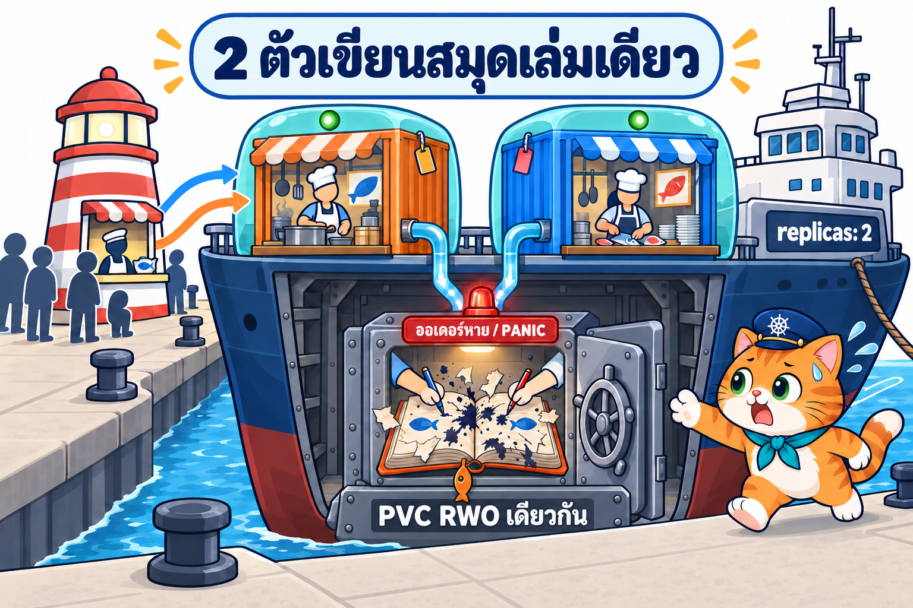<br>
  <em><b>รูปที่ 35</b> ผลทดสอบจริง: Deployment db replicas 2 + PVC RWO → Pod ทั้งคู่ลงเรือลำเดียวกันและเปิด postgres บนโฟลเดอร์เดียวกัน → ออเดอร์แยกกันแล้วหาย (บางครั้งพัง PANIC)</em>
</p>

Deployment มี Pod template เดียว ทุก Pod จึงอ้าง `claimName: som-db-data` เดียวกัน ถ้าสั่ง `kubectl -n som-shop scale deploy/som-db --replicas=2` กับ PVC แบบ RWO จะไม่มีอะไรห้าม เพราะ RWO กันแค่ "ต่าง Node" ผลจริงจาก LAB 10 ขั้น F

1. Pod ตัวที่ 2 ถูกวางบน **Node เดียวกัน** (ตาม nodeAffinity ของ PV) และ `Running 1/1` ทั้งคู่ อยู่ใน EndpointSlice ของ Service `som-db` ทั้งคู่ (`ready=true`)
2. postgres ตัวที่ 2 เปิดโฟลเดอร์ที่ตัวแรกยังใช้อยู่ และคิดว่าเครื่องดับกะทันหัน

   ```text
   2026-10-05 05:48:11.148 UTC [26] LOG:  database system was not properly shut down; automatic recovery in progress
   ...
   2026-10-05 05:48:11.192 UTC [1] LOG:  database system is ready to accept connections
   ```

   (ไม่มีอะไรกันได้ เพราะ container ทั้งสองอยู่คนละ PID/IPC namespace จึงมองไม่เห็นกันแม้ใช้โฟลเดอร์เดียวกัน)
3. สั่งซื้อเพิ่ม 3 รายการ หน้าเว็บเห็น `orders=6` แต่ฐานข้อมูลสองตัวเห็นไม่ตรงกัน และ psql ผ่าน Service ได้คำตอบสลับไปมาตาม Pod ที่ถูกสุ่ม

   ```text
   pod/som-db-7b786655f5-mkhsg orders=3
   pod/som-db-7b786655f5-phtbj orders=6
   ```

   ```text
   10.244.2.20|6
   10.244.2.20|6
   10.244.2.21|3
   10.244.2.21|3
   ...
   ```

4. scale กลับเป็น 1 ตัว ตัวที่เหลือทำงานต่อราว 35 วินาที (postgres ตรวจ lock file ทุกนาที) แล้วหยุดตัวเอง

   ```text
   2026-10-05 05:49:00.010 UTC [1] LOG:  could not open file "postmaster.pid": No such file or directory
   2026-10-05 05:49:00.010 UTC [1] LOG:  performing immediate shutdown because data directory lock file is invalid
   ```

   kubelet เริ่ม container ใหม่ และอ่านข้อมูลจากดิสก์ได้ **`orders=3` — ออเดอร์ 3 รายการหายไป** รอบทดลองซ้ำอีก 2 รอบได้ผลเดียวกัน (6 → 3) และมี `CrashLoopBackOff` ชั่วครู่ราว 10–24 วินาทีก่อนกลับมา Running เอง ส่วนในการตรวจสอบก่อนเขียนบท (pre-check) มีรอบที่หนักกว่านั้น คือ postgres เริ่มไม่ได้อีกเลยด้วย `PANIC: could not locate a valid checkpoint record` และค้าง `CrashLoopBackOff`

**ผลไม่แน่นอน แต่เสียหายทุกครั้ง** นี่คือเหตุผลที่ไฟล์ของร้านเขียนคอมเมนต์ไว้ว่า `replicas ต้องเป็น 1`

### 14.2 วิธีกัน: replicas 1 + Recreate + ReadWriteOncePod

<p align="center" id="fig-36">
  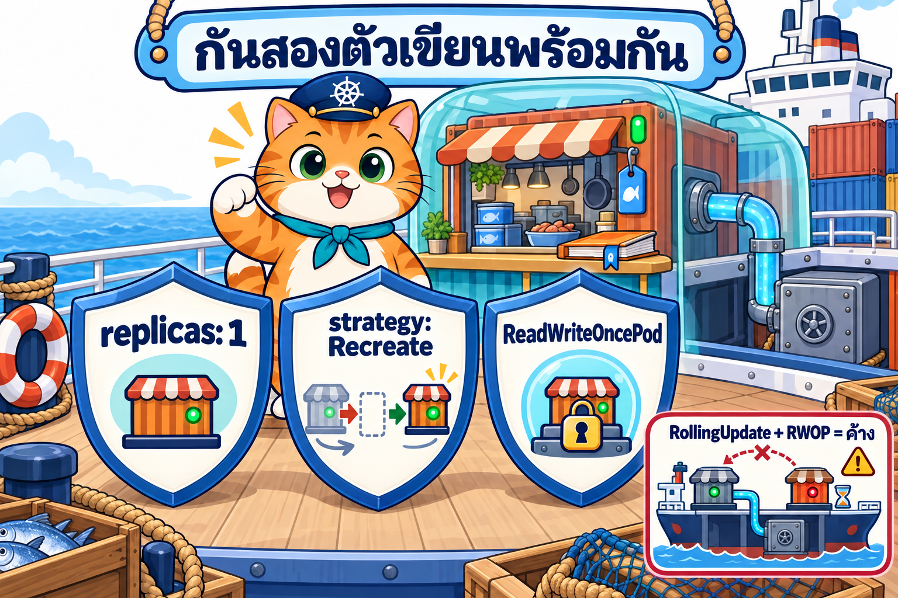<br>
  <em><b>รูปที่ 36</b> วิธีกัน: db ต้อง replicas 1 + strategy Recreate (ไม่มีช่วงสองตัวพร้อมกัน) และใช้ ReadWriteOncePod ให้ระบบกันตัวที่ 2 — RWOP + RollingUpdate จะค้าง (Pod ใหม่ Pending รอตัวเก่า)</em>
</p>

**ตารางที่ 17** สามชั้นของการกัน postgres สองตัว

| ชั้น | ตั้งค่า | กันอะไร | ข้อจำกัด |
|---|---|---|---|
| 1 | `replicas: 1` | ไม่ตั้งใจเปิดสองตัว | คน (หรือเครื่องมือ) ยัง scale ได้ |
| 2 | `strategy: Recreate` | ระหว่าง rollout ไม่มีตัวเก่ากับตัวใหม่พร้อมกัน (บทที่ 7) | มีช่วงสั้น ๆ ที่ไม่มี db |
| 3 | PVC `accessModes: [ReadWriteOncePod]` | ระบบไม่ยอมให้ Pod ตัวที่ 2 ใช้ตู้ | storage ต้องรองรับ RWOP (local-path รองรับ) |

ผลจริงจาก LAB 10 ขั้น H (`k8s-retain/10-db.yaml` ใช้ RWOP): scale เป็น 2 แล้ว Pod ที่ 2 ค้าง `Pending` ร้านยังขายปกติ

```text
  Warning  FailedScheduling  10s   default-scheduler  0/3 nodes are available: 1 node(s) had untolerated taint(s), 2 node(s) unavailable due to PersistentVolumeClaim with ReadWriteOncePod access mode already in-use by another pod. preemption: 0/3 nodes are available: 1 Preemption is not helpful for scheduling, 2 No preemption victims found for incoming pod.
NAME     READY   UP-TO-DATE   AVAILABLE   AGE
som-db   1/2     2            1           37s
```

RWOP ต้องคู่กับ Recreate เสมอ ใน pre-check ใช้ RWOP กับ RollingUpdate แล้ว Pod ใหม่ (ที่ RollingUpdate สร้างก่อนปิดตัวเก่า) ค้าง `Pending` รอตัวเก่าซึ่งไม่ถูกปิด `rollout status` จึงค้างที่ `1 old replicas are pending termination...` ไฟล์ `k8s-retain/10-db.yaml` จึงเขียนไว้ว่า `Recreate จำเป็นมากกับ RWOP`

> **ข้อควรจำ:** ทั้งสามชั้นทำให้ db **ปลอดภัยเมื่อมีตัวเดียว** แต่ไม่ได้ทำให้ db มีหลายตัวได้ การมีฐานข้อมูลหลายตัวต้องให้แต่ละตัวมีตู้ของตัวเองและชื่อที่คงที่ ซึ่ง Deployment ทำให้ไม่ได้ (หัวข้อ 15.3)

---

## 15. สรุปและบทถัดไป

### 15.1 ตารางสรุป

<p align="center" id="fig-37">
  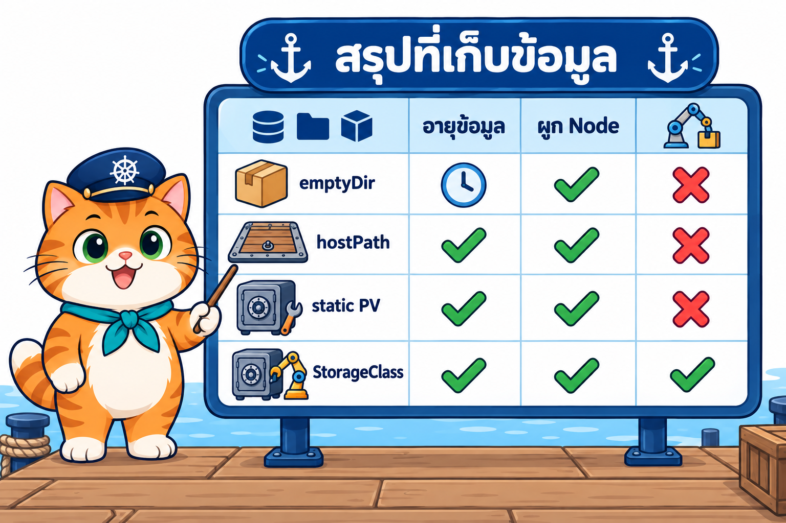<br>
  <em><b>รูปที่ 37</b> ตารางสรุป: emptyDir / hostPath / PVC+static PV / PVC+StorageClass เทียบอายุข้อมูล, ใครสร้าง, ผูก Node ไหม, เหมาะกับอะไร</em>
</p>

**ตารางที่ 18** เลือกที่เก็บข้อมูล

| | `emptyDir` | `hostPath` | PVC + static PV | PVC + StorageClass |
|---|---|---|---|---|
| อายุข้อมูล | เท่า Pod | เท่า Node (ไม่มีใครลบ) | ตาม PV (มักเป็น Retain) | ตาม reclaimPolicy ของ class (default Delete) |
| ใครสร้างที่เก็บ | kubelet | มีอยู่บน Node / kubelet สร้าง | ผู้ดูแลสร้าง PV เอง | provisioner สร้างอัตโนมัติ |
| ผูก Node | ✅ (อยู่บน Node ของ Pod) | ✅ | ขึ้นกับชนิด (hostPath/local ✅, NFS/CSI เครือข่าย ❌) | ขึ้นกับ provisioner (local-path ✅) |
| Pod Security restricted | อนุญาต | ห้าม | อนุญาต (Pod ใช้ PVC) | อนุญาต |
| เหมาะกับ | cache, ไฟล์ชั่วคราว, แชร์ไฟล์ใน Pod | agent ระดับ Node, ทดลอง | ดิสก์/share ที่มีอยู่แล้ว, กู้ข้อมูลเดิม | ฐานข้อมูลและข้อมูลถาวรทั่วไป (ค่าเริ่มต้น) |
| ในบทนี้ | LAB 1, ร้านบทที่ 7 | LAB 2 | LAB 4 | LAB 3, 5–10 |

### 15.2 สรุปบท

1. **อายุข้อมูล:** ไฟล์ใน container < `emptyDir` (เท่า Pod) < PV (ไม่ขึ้นกับ Pod) `hostPath` ผูก Node และถูก Pod Security restricted ห้าม
2. **PV / PVC / StorageClass:** PV และ StorageClass เป็น cluster-scoped (ผู้ดูแล) PVC อยู่ใน namespace (นักพัฒนา) Pod อ้างแค่ `claimName`
3. **Static:** PV `Available` → PVC ที่ตรงเงื่อนไข → `Bound` ได้ตู้ใหญ่กว่าได้ `storageClassName: ""` = ไม่ใช้ class จองตู้ด้วย `claimRef` (PV) หรือ `volumeName` (PVC)
4. **Dynamic:** StorageClass + provisioner สร้าง PV `pvc-<uid>` ให้ `standard` ของ kind = local-path (โฟลเดอร์ `/var/local-path-provisioner/pvc-<uid>_<ns>_<pvc>` + hostPath + nodeAffinity)
5. **accessModes** เป็นคุณสมบัติของ storage RWO = Node เดียว (หลาย Pod ได้) RWOP = Pod เดียว local-path ไม่รองรับ RWX/Block และไม่บังคับขนาด
6. **WaitForFirstConsumer** รอ scheduler เลือก Node ก่อนสร้างตู้ PVC `Pending` ระหว่างรอเป็นเรื่องปกติ `Immediate` ใช้กับ local-path ไม่ได้
7. **reclaimPolicy:** Delete ลบ PV + ข้อมูล, Retain เหลือ `Released` (ผู้ดูแลต้องลบเอง) กู้ด้วยการลบ `claimRef` + PVC ที่มี `volumeName` PVC ชื่อเดิมไม่ได้ตู้เดิมอัตโนมัติ
8. **finalizers** `pvc-protection`/`pv-protection` กันลบระหว่างใช้งาน (ค้าง `Terminating`)
9. **ขยายได้ ลดไม่ได้** ต้องมี `allowVolumeExpansion: true` + driver ที่ขยายได้จริง
10. **subPath/readOnly** ใช้ได้กับทุก volume, `fsGroup` ไม่มีผลกับ local-path postgres จึงใช้ PGDATA เป็นโฟลเดอร์ย่อย
11. **local storage ผูก Node:** Node ล่ม → Pod ใหม่ `Pending` (`didn't match PersistentVolume's node affinity`) จน Node กลับ
12. **quota/ephemeral:** ResourceQuota คุมจำนวนและขนาด PVC ต่อ class, ephemeral volume ได้ PVC ที่ตายพร้อม Pod
13. **PV ไม่ใช่ backup** และ **db บน Deployment ต้อง `replicas: 1` + `Recreate` (+ RWOP)** scale เป็น 2 แล้วข้อมูลเสียจริง

<p align="center" id="fig-38">
  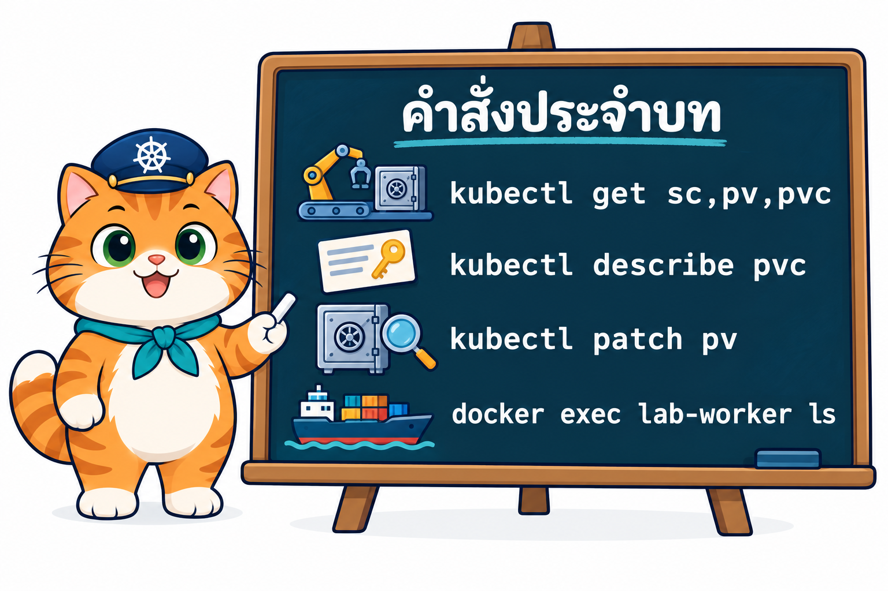<br>
  <em><b>รูปที่ 38</b> คำสั่งที่ใช้บ่อย: kubectl get sc,pv,pvc / describe pvc / patch pv reclaimPolicy / ดูโฟลเดอร์บน Node ด้วย docker exec</em>
</p>

**ตารางที่ 19** คำสั่งที่ใช้ในบทนี้

| คำสั่ง | ใช้ทำอะไร |
|---|---|
| `kubectl get sc` | ดู StorageClass และ default class |
| `kubectl get pv` / `kubectl get pvc -A` (`-o wide`) | ดูตู้และใบเบิก สถานะ ขนาด class |
| `kubectl describe pvc <ชื่อ>` | ดู Events (สาเหตุที่ Pending), `Used By`, Finalizers, annotation `selected-node` |
| `kubectl get pv <ชื่อ> -o yaml` | ดู `hostPath`, `nodeAffinity`, `claimRef`, reclaimPolicy |
| `kubectl get pvc <ชื่อ> -o jsonpath='{.spec.volumeName}'` | หาชื่อ PV ของ PVC |
| `kubectl patch pv <ชื่อ> -p '{"spec":{"persistentVolumeReclaimPolicy":"Retain"}}'` | เปลี่ยน PV เป็น Retain ก่อนลบ PVC |
| `kubectl patch pv <ชื่อ> --type json -p '[{"op":"remove","path":"/spec/claimRef"}]'` | ทำ PV `Released` ให้เป็น `Available` |
| `kubectl patch pvc <ชื่อ> -p '{"spec":{"resources":{"requests":{"storage":"20Mi"}}}}'` | ลองขยาย PVC |
| `kubectl describe quota -n <ns>` | ดูงบ storage ที่ใช้ไป |
| `docker exec <node> ls -la /var/local-path-provisioner/` | ดูโฟลเดอร์ของตู้บน Node (เฉพาะคลัสเตอร์ kind) |

### 15.3 ปัญหาที่ยังเหลือและบทถัดไป

<p align="center" id="fig-39">
  <br>
  <em><b>รูปที่ 39</b> ปิดบท: Deployment ให้ทุก Pod ใช้ใบเบิกใบเดียวกัน จึงขยาย db ไม่ได้ — บทหน้า StatefulSet ให้ Pod มีชื่อเลขลำดับคงที่และตู้เซฟประจำตัว</em>
</p>

ตอนจบ LAB 10 ร้านน้องส้ม **จำได้แล้ว** ลบ Pod db, `rollout restart` db หรือลบ Deployment db แล้ว apply ใหม่ ออเดอร์ก็ยังอยู่ และไม่ต้อง restart web แบบบทที่ 7 อีก แต่การทดลองในบทนี้ก็เผยข้อจำกัดของการรันฐานข้อมูลด้วย Deployment

| ปัญหาที่ยังเหลือ | หลักฐานจากบทนี้ | บทที่ 9 StatefulSet แก้อย่างไร |
|---|---|---|
| **db ขยายเป็นหลายตัวด้วย Deployment ไม่ได้** — Pod template เดียว ทุก Pod อ้าง `claimName` เดียวกัน | scale `som-db` เป็น 2 → postgres สองตัวแชร์ PVC เดียว ออเดอร์ 6 → 3 / `lock file is invalid` / PANIC; ใช้ RWOP ก็ได้แค่ Pod ที่ 2 `Pending` | `volumeClaimTemplates` สร้าง **PVC ประจำตัวทุก Pod** (ตู้เซฟคนละใบ) |
| **ชื่อ Pod สุ่ม** ไม่รู้ว่าตัวไหนคือตัวหลัก และชื่อเปลี่ยนทุกครั้งที่ถูกสร้างใหม่ | `som-db-7b786655f5-tk2bn` → `som-db-7b786655f5-zdw4m` → `som-db-bb9948676-hgt7s` | **ชื่อคงที่ตามเลขลำดับ** (`<ชื่อ>-0`, `<ชื่อ>-1`, …) Pod ใหม่ได้ชื่อเดิมและตู้เดิม |
| ลำดับการเปิด/ปิดไม่แน่นอน | ReplicaSet สร้าง/ลบ Pod พร้อมกัน | เปิดและปิดทีละตัวตามลำดับ |
| ข้อมูลผูก Node เมื่อใช้ local storage | LAB 8: Node ล่มแล้ว Pod ใหม่ `Pending` | (StatefulSet ไม่ได้แก้เรื่องนี้โดยตรง — ต้องใช้ storage เครือข่ายหรือ replication ระดับแอป) |

บทถัดไปจะให้ครัวกลางของน้องส้มมี **ชื่อคงที่และตู้เซฟประจำตัวทุก Pod** ด้วย StatefulSet และใช้ความรู้เรื่อง PVC/StorageClass ทั้งหมดของบทนี้ต่อ รหัสผ่านใน YAML (ConfigMap/Secret) และทางเข้าด้วยชื่อโดเมน (Ingress) ยังเป็นเนื้อหาบทหลัง

---

## 16. คำถามทบทวน

**1. ใน LAB 1 หลังทำให้ container ของ `cache-demo` restart ไฟล์ `/cache/x.txt`, `/ram/r.txt` และ `/tmp/y.txt` อยู่หรือหาย และถ้าลบ Pod แล้วสร้างใหม่จะเป็นอย่างไร**

<details>
<summary>แนวคำตอบ</summary>

หลัง container restart (`RESTARTS 1`) `/cache/x.txt` และ `/ram/r.txt` ยังอยู่ เพราะ `emptyDir` (ทั้งบนดิสก์และ `medium: Memory`) ผูกกับ Pod ไม่ใช่ container ส่วน `/tmp/y.txt` อยู่ในระบบไฟล์ของ container จึงหายเมื่อ container เริ่มใหม่ `boot.log` จึงมี 2 บรรทัด เมื่อลบ Pod แล้วสร้างใหม่ `emptyDir` ทั้งสองถูกลบไปกับ Pod เดิม Pod ใหม่ได้โฟลเดอร์ว่าง (`boot.log` เหลือบรรทัดเดียว `x.txt` ไม่มี)
</details>

**2. ทำไม `kubectl exec cache-demo -- kill 1` จึงไม่ทำให้ container restart และ LAB ใช้วิธีใดแทน**

<details>
<summary>แนวคำตอบ</summary>

process ที่เป็น PID 1 ใน container (ที่นี่คือ `sh`) ไม่ถูกปิดด้วยสัญญาณที่ไม่มี handler ตามกติกาของ Linux สำหรับ init process ใน namespace ของตัวเอง ทั้ง `kill 1` และ `kill -9 1` จากใน container จึงไม่มีผล (RESTARTS ยังเป็น 0) LAB จึงเขียนสคริปต์ให้วนรอไฟล์ `/tmp/stop` เมื่อสั่ง `touch /tmp/stop` loop จบแล้ว `exit 1` kubelet จึงเริ่ม container ใหม่ และเพราะ `/tmp/stop` อยู่ในระบบไฟล์ของ container จึงหายไปเองหลัง restart ไม่วนซ้ำ
</details>

**3. ทำไม Pod Security ระดับ restricted จึงห้าม `hostPath` แต่อนุญาต `persistentVolumeClaim` ทั้งที่ PV ของ local-path ก็เป็น hostPath ข้างใน**

<details>
<summary>แนวคำตอบ</summary>

`hostPath` ใน Pod ให้ผู้เขียน Pod เลือก path ใดก็ได้บน Node รวมถึง path สำคัญของระบบ จึงอ่าน/แก้ไฟล์ของ Node ได้ ส่วน PVC ผู้เขียน Pod ได้แค่ "ใบเบิก" PV ถูกสร้างโดยผู้ดูแลหรือ provisioner ซึ่งกำหนด path ที่ปลอดภัย (`/var/local-path-provisioner/pvc-…`) เอง ผู้ใช้ทั่วไปจึงควบคุม path บน Node ไม่ได้ ข้อความใน LAB 2 ระบุ `restricted volume types (volume "host" uses restricted volume type "hostPath")`
</details>

**4. อธิบายว่าอะไรเป็น cluster-scoped และอะไรอยู่ใน namespace ระหว่าง PV, PVC, StorageClass และผลที่เห็นเมื่อลบ namespace `som-shop` ใน LAB 10 ขั้น I**

<details>
<summary>แนวคำตอบ</summary>

PV และ StorageClass เป็น cluster-scoped ส่วน PVC (และ Pod) อยู่ใน namespace เมื่อลบ `som-shop` PVC `som-db-data` ถูกลบตาม namespace แต่ PV ที่ reclaimPolicy เป็น Retain ไม่ได้อยู่ใน namespace จึงยังอยู่ในสถานะ `Released` พร้อมโฟลเดอร์บน Node และ StorageClass `standard-retain` ก็ยังอยู่ ต้อง `kubectl delete pv`, ลบโฟลเดอร์บน Node และ `kubectl delete sc standard-retain` เอง
</details>

**5. PVC `manual-claim` ขอ 50Mi และ `storageClassName: ""` ทำไมคอลัมน์ CAPACITY จึงเป็น 100Mi และถ้าลบบรรทัด `storageClassName: ""` ออกจะเกิดอะไรขึ้น**

<details>
<summary>แนวคำตอบ</summary>

PV ที่ตรงเงื่อนไข (class ว่างเหมือนกัน, RWO, ขนาด ≥ 50Mi) มีตัวเดียวคือ `pv-manual` 100Mi PV ผูกกับ PVC ได้ทั้งตัว CAPACITY ของ PVC จึงแสดงขนาดจริงของ PV คือ 100Mi ถ้าไม่ใส่ `storageClassName` เลย admission จะใส่ default class (`standard`) ให้ PVC จะไม่จับกับ `pv-manual` (class ไม่ตรง) แต่จะรอ Pod แล้วให้ local-path สร้างตู้ใหม่แทน
</details>

**6. ทำไม PVC `notes` ในคลัสเตอร์ kind จึง `Pending` ทันทีหลังสร้าง และเมื่อไรจึงเป็น `Bound` ดูได้อย่างไรว่าตู้ถูกสร้างบน Node ไหน**

<details>
<summary>แนวคำตอบ</summary>

class `standard` เป็น `volumeBindingMode: WaitForFirstConsumer` PVC จึงรอจนมี Pod ตัวแรกใช้ (Event `waiting for first consumer to be created before binding`) เมื่อสร้าง Pod `writer` scheduler เลือก Node ให้ Pod แล้วเขียน annotation `volume.kubernetes.io/selected-node: lab-worker` ลงใน PVC provisioner สร้างโฟลเดอร์และ PV บน Node นั้น (`ProvisioningSucceeded`) แล้ว PVC จึง `Bound` ดู Node ได้จาก annotation นั้น หรือจาก `nodeAffinity` ใน `kubectl get pv <ชื่อ> -o yaml`
</details>

**7. Pod `rwo-a` และ `rwo-b` ใช้ PVC RWO เดียวกันและ Running ทั้งคู่ ขัดกับความหมายของ ReadWriteOnce หรือไม่ ถ้าต้องการให้ Pod ที่ 2 ใช้ไม่ได้ต้องทำอย่างไร**

<details>
<summary>แนวคำตอบ</summary>

ไม่ขัด เพราะ RWO หมายถึงเมานต์แบบอ่านเขียนได้จาก **Node เดียว** Pod หลายตัวบน Node เดียวกันใช้ร่วมกันได้ scheduler ส่ง `rwo-b` ไป `lab-worker` เดียวกับ `rwo-a` ตาม nodeAffinity ของ PV ถ้าต้องการให้มีผู้ใช้ได้ Pod เดียวต้องใช้ `ReadWriteOncePod` Pod ตัวที่ 2 จะค้าง `Pending` ด้วยข้อความ `PersistentVolumeClaim with ReadWriteOncePod access mode already in-use by another pod`
</details>

**8. PVC ที่ขอ `ReadWriteMany` ใน LAB 5 ค้าง Pending ดูสาเหตุจากที่ไหน และถ้าระบบจริงต้องการ RWX ต้องทำอย่างไร**

<details>
<summary>แนวคำตอบ</summary>

Pod `use-rwx` ไม่มี Event เลย ต้องดูที่ `kubectl describe pvc shared` ซึ่งมี `ProvisioningFailed … NodePath only supports ReadWriteOnce and ReadWriteOncePod (1.22+) access modes` แปลว่า local-path ทำ RWX ไม่ได้ (โฟลเดอร์บน Node เดียวเข้าถึงจากหลาย Node ไม่ได้) ระบบจริงต้องใช้ storage ที่รองรับ RWX เช่น NFS, CephFS หรือระบบไฟล์เครือข่ายของคลาวด์ ผ่าน CSI driver และ StorageClass ของ driver นั้น
</details>

**9. ใน LAB 6 ทำไม apply `pvc.yaml` ชื่อ `ledger` ซ้ำแล้วไม่ได้ตู้เดิมที่ Retain ไว้ และต้องทำอย่างไรจึงจะได้ข้อมูลเดิมกลับมา**

<details>
<summary>แนวคำตอบ</summary>

PV ที่ `Released` ยังมี `claimRef` ชี้ PVC ตัวเก่า (uid เดิม) PVC ใหม่แม้ชื่อเดิมก็มี uid ใหม่ จึงจับกับ PV นั้นไม่ได้ และเพราะ PVC ใช้ class `standard` provisioner จึงสร้างตู้ใหม่ (`pvc-9b83…`) ให้ วิธีกู้คือ (1) `kubectl patch pv <PV> --type json -p '[{"op":"remove","path":"/spec/claimRef"}]'` ให้ PV เป็น `Available` (2) สร้าง PVC ที่ระบุ `volumeName: <PV>` (`pvc-reuse.yaml` ผ่าน `sed`) → `Bound` กับตู้เดิม และ Pod อ่าน `keepme เขียนเมื่อ 05:41:40` เดิมได้
</details>

**10. สั่ง `kubectl delete pvc ledger` แล้ว PVC ค้าง `Terminating` เกิดจากอะไร ควรแก้อย่างไร**

<details>
<summary>แนวคำตอบ</summary>

PVC มี finalizer `kubernetes.io/pvc-protection` และยังมี Pod ใช้อยู่ (`Used By: ledger-pod`) Kubernetes จึงยังไม่ลบจริงเพื่อไม่ให้ข้อมูลหายระหว่างที่ Pod ทำงาน วิธีแก้คือหยุด/ลบ Pod (หรือ scale Deployment ที่ใช้ PVC เป็น 0) เมื่อไม่มีผู้ใช้ finalizer จะถูกถอดและ PVC ถูกลบเอง ไม่ควรลบ finalizer ด้วยมือ
</details>

**11. ตั้ง StorageClass `local-expand` ให้ `allowVolumeExpansion: true` แล้ว patch PVC `ex` เป็น 20Mi สำเร็จ ทำไม CAPACITY ยังเป็น 10Mi และถ้าลดเป็น 5Mi จะเกิดอะไร**

<details>
<summary>แนวคำตอบ</summary>

`allowVolumeExpansion: true` ทำให้ API server ยอมรับการแก้ `spec` (จึง `patched` และ `spec=20Mi`) แต่การขยายจริงต้องมี controller ของ driver มาขยาย Event `ExternalExpanding … waiting for an external controller to expand this PVC` บอกว่ากำลังรอ local-path ไม่มีตัวขยาย `status.capacity` และ PV จึงค้าง 10Mi การลดขนาดถูกปฏิเสธเสมอ `spec.resources.requests.storage: Forbidden: field can not be less than status.capacity`
</details>

**12. ใน LAB 8 หลัง `docker stop` Node ที่ Pod `nd` อยู่ Pod ใหม่ค้าง Pending ด้วยข้อความอะไร ทำไมไม่ย้ายไป `lab-worker2` ที่ยังดีอยู่ และระบบจริงแก้ปัญหานี้อย่างไร**

<details>
<summary>แนวคำตอบ</summary>

`0/3 nodes are available: 1 node(s) didn't match PersistentVolume's node affinity, 2 node(s) had untolerated taint(s)` PV ของ local-path มี `nodeAffinity` ชี้ Node ที่ล่ม เพราะข้อมูลเป็นโฟลเดอร์บน Node นั้น `lab-worker2` ไม่มีข้อมูลจึงถูกตัดออก ส่วน control-plane และ Node ที่ล่มมี taint Pod จึงรอจน `docker start` แล้วกลับมา Running บน Node เดิมพร้อมข้อมูลเดิม ระบบจริงใช้ storage เครือข่ายที่ย้ายดิสก์ไป Node ใหม่ได้ หรือทำ replication ระดับแอป
</details>

**13. ResourceQuota ใน `quota-lab` มี `p400` และ `p100` แล้ว ทำไม `p10` (10Mi) จึงถูกปฏิเสธทั้งที่ `requests.storage` รวมยังใช้แค่ 500Mi จาก 1Gi**

<details>
<summary>แนวคำตอบ</summary>

quota มีหลายข้อพร้อมกัน `p10` ติด `persistentvolumeclaims: "2"` (มี 2 ใบแล้ว) และ `standard.storageclass.storage.k8s.io/requests.storage: 500Mi` (ใช้ครบ 500Mi แล้ว) ข้อความ error ระบุทั้งสองข้อ `requested: persistentvolumeclaims=1,standard.storageclass.storage.k8s.io/requests.storage=10Mi, used: persistentvolumeclaims=2,…=500Mi, limited: persistentvolumeclaims=2,…=500Mi` PVC ต้องผ่านทุกข้อจึงจะถูกสร้าง
</details>

**14. ทำไม `fsGroup: 70` จึงไม่ทำให้โฟลเดอร์ของ PVC จาก local-path เป็นของกลุ่ม 70 และร้านน้องส้มทำอย่างไรให้ postgres ใช้ PVC ได้**

<details>
<summary>แนวคำตอบ</summary>

kubelet เปลี่ยนสิทธิ์ตาม `fsGroup` ให้เฉพาะ volume ที่รองรับ (emptyDir, CSI ส่วนใหญ่) PV ของ local-path เป็น hostPath จึงไม่ถูกเปลี่ยน `ls -ldn /data` ยังเป็น `drwxrwxrwx 0 0` แต่ 0777 ทำให้ทุก uid เขียนได้ ร้านตั้ง `PGDATA=/var/lib/postgresql/data/pgdata` เป็นโฟลเดอร์ย่อย postgres (uid 70) จึงสร้างโฟลเดอร์ `pgdata` เองเป็น `drwx------ 70 70` ตามที่ postgres ต้องการ
</details>

**15. ถ้าเพื่อนเสนอให้ scale `som-db` เป็น 2 เพื่อให้ร้านทนขึ้น จะอธิบายผลจาก LAB 10 ขั้น F อย่างไร และควรตั้งค่าอะไรเพื่อกันพลาด**

<details>
<summary>แนวคำตอบ</summary>

Deployment ให้ทุก Pod ใช้ PVC เดียวกัน PVC เป็น RWO Pod ตัวที่ 2 จึงลง Node เดียวกันและเปิด postgres บนโฟลเดอร์เดียวกัน (`not properly shut down; automatic recovery in progress`) ทั้งคู่อยู่หลัง Service ข้อมูลที่เห็นแยกกัน (6 กับ 3) และหลัง scale กลับ postgres ตัวที่เหลือหยุดเพราะ `lock file is invalid` แล้วเริ่มใหม่ได้ข้อมูลเก่า ออเดอร์หาย 6 → 3 (บางครั้ง PANIC เริ่มไม่ได้เลย) ร้านไม่ได้ทนขึ้นแต่ข้อมูลเสีย ควรใช้ `replicas: 1` + `strategy: Recreate` และ PVC `ReadWriteOncePod` (ขั้น H: Pod ที่ 2 `Pending`) ถ้าต้องการหลายตัวจริงต้องใช้ StatefulSet ที่ให้ PVC ประจำตัวแต่ละ Pod และตั้ง replication ของฐานข้อมูล
</details>

**16. ทำไมจึงพูดว่า "PV ไม่ใช่ backup" ยกตัวอย่างจากบทนี้อย่างน้อยสองกรณีที่ PV ช่วยไม่ได้**

<details>
<summary>แนวคำตอบ</summary>

PV เก็บข้อมูลสำเนาเดียวบน storage ของมัน (1) ขั้น F: postgres สองตัวเขียนทับกันจนออเดอร์หาย PV เก็บข้อมูลที่เสียไว้อย่างซื่อสัตย์ (2) ขั้น G: ลบ PVC ที่ reclaimPolicy เป็น Delete แล้ว PV และโฟลเดอร์ถูกลบทันที ข้อมูลหายถาวร (3) ถ้าดิสก์ของ Node เสีย ข้อมูลใน local-path ก็หาย การสำรองต้องทำแยก เช่น `pg_dump` เก็บนอกคลัสเตอร์ หรือ VolumeSnapshot เมื่อใช้ CSI ที่รองรับ
</details>

---

## 17. เอกสารอ้างอิง

1. The Kubernetes Authors. *Volumes*. https://kubernetes.io/docs/concepts/storage/volumes/
2. The Kubernetes Authors. *Persistent Volumes*. https://kubernetes.io/docs/concepts/storage/persistent-volumes/
3. The Kubernetes Authors. *Storage Classes*. https://kubernetes.io/docs/concepts/storage/storage-classes/
4. The Kubernetes Authors. *Dynamic Volume Provisioning*. https://kubernetes.io/docs/concepts/storage/dynamic-provisioning/
5. The Kubernetes Authors. *Ephemeral Volumes* (generic ephemeral volumes). https://kubernetes.io/docs/concepts/storage/ephemeral-volumes/
6. The Kubernetes Authors. *Configure a Pod to Use a PersistentVolume for Storage*. https://kubernetes.io/docs/tasks/configure-pod-container/configure-persistent-volume-storage/
7. The Kubernetes Authors. *Change the Reclaim Policy of a PersistentVolume*. https://kubernetes.io/docs/tasks/administer-cluster/change-pv-reclaim-policy/
8. The Kubernetes Authors. *Change the default StorageClass*. https://kubernetes.io/docs/tasks/administer-cluster/change-default-storage-class/
9. The Kubernetes Authors. *Configure a Security Context for a Pod or Container* (fsGroup, fsGroupChangePolicy). https://kubernetes.io/docs/tasks/configure-pod-container/security-context/
10. The Kubernetes Authors. *Pod Security Standards* (restricted volume types). https://kubernetes.io/docs/concepts/security/pod-security-standards/
11. The Kubernetes Authors. *Resource Quotas* (Storage Resource Quota). https://kubernetes.io/docs/concepts/policy/resource-quotas/
12. The Kubernetes Authors. *Volume Snapshots*. https://kubernetes.io/docs/concepts/storage/volume-snapshots/
13. The Kubernetes Authors. *Taints and Tolerations* (taint based evictions, tolerationSeconds). https://kubernetes.io/docs/concepts/scheduling-eviction/taint-and-toleration/
14. The Kubernetes Authors. *Using Finalizers to Control Deletion*. https://kubernetes.io/docs/concepts/overview/working-with-objects/finalizers/
15. The Kubernetes Authors. *Deployments* (strategy Recreate). https://kubernetes.io/docs/concepts/workloads/controllers/deployment/
16. The Kubernetes Authors. *StatefulSets* (บทถัดไป). https://kubernetes.io/docs/concepts/workloads/controllers/statefulset/
17. The Kubernetes Authors. *kubectl patch*. https://kubernetes.io/docs/reference/kubectl/generated/kubectl_patch/
18. Kubernetes Blog. *Kubernetes 1.29: Single Pod Access Mode for PersistentVolumes Graduates to Stable*. https://kubernetes.io/blog/2023/12/18/read-write-once-pod-access-mode-ga/
19. kind. *Persistent Volumes / local-path-provisioner* (ค่าเริ่มต้นของคลัสเตอร์ kind). https://kind.sigs.k8s.io/

---

> **หมายเหตุเกี่ยวกับภาพประกอบ:** ภาพประกอบ 39 ภาพในโฟลเดอร์ [`images/`](images/) และภาพตัวละครน้องส้ม (`00-character-som.png`) สร้างขึ้นด้วยปัญญาประดิษฐ์สำหรับการสร้างภาพเพื่อใช้ประกอบการเรียนการสอน ชุดคำสั่งสร้างภาพอยู่ใน [`images/imagegen-prompts.md`](images/imagegen-prompts.md) ภาพใช้อุปมาเชิงเปรียบเทียบเพื่อช่วยความเข้าใจ ตัวเลขในภาพ (เช่น ชื่อ PV, จำนวนออเดอร์ และเวลา) เป็นค่าตัวอย่าง ผู้เรียนควรใช้เนื้อหาในเอกสารนี้และเอกสารอ้างอิงเป็นหลัก ผลลัพธ์คำสั่งทั้งหมดมาจากการทดลองจริง (Kubernetes v1.37.0) ค่าเวลา, IP, ชื่อ Pod/PV, Node ที่ Pod ถูกวาง และขนาดดิสก์ในเครื่องผู้เรียนอาจต่างกัน
