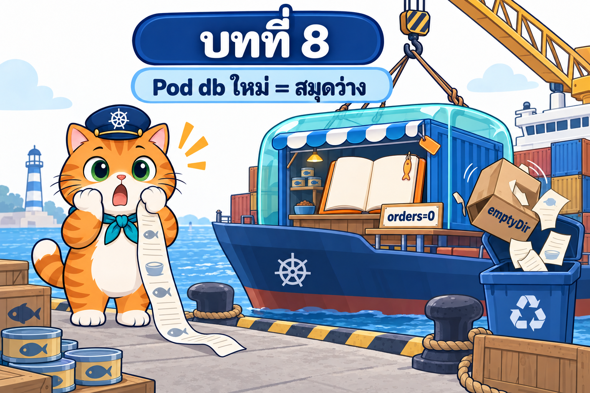

# บทที่ 8: PersistentVolume และ PVC — ตู้เซฟบนเรือที่ร้านน้องส้มเบิกใช้

> **รายวิชา:** Software Development Tools and Environments (DevTools)
> **หัวข้อ:** Kubernetes Volume และ Persistent Storage — อายุของข้อมูล (container / emptyDir / PV), emptyDir และ hostPath, PersistentVolume, PersistentVolumeClaim, StorageClass, static และ dynamic provisioning, local-path-provisioner ของ kind, CSI, accessModes (RWO/ROX/RWX/RWOP) และ volumeMode, WaitForFirstConsumer, reclaimPolicy (Delete/Retain) และการกู้ PV, finalizers, การขยาย PVC, subPath/readOnly/fsGroup, ข้อมูลผูก Node, ResourceQuota ของ storage, generic ephemeral volume, backup/snapshot และข้อควรระวังเมื่อรันฐานข้อมูลบน Deployment
> **ผลลัพธ์การเรียนรู้ที่เกี่ยวข้อง:** CLO-5, CLO-6

<p align="center">
  <br>
  <em>เปิดบทที่ 8: ต่อจากท้ายบท 007 — Pod db ถูกสร้างใหม่ สมุดออเดอร์ในกล่อง emptyDir หายไปกับ Pod เดิม ร้านกลับไปเป็น orders=0</em>
</p>

## บทนี้เรียนอะไร

บทที่ 7 ร้านอาหารแมวน้องส้มเปลี่ยนรุ่นได้โดยลูกค้าไม่เจอ error และย้อนรุ่นได้ในคำสั่งเดียว แต่ทุกครั้งที่ Pod ฐานข้อมูลถูกสร้างใหม่ ออเดอร์ทั้งหมดหายไปกับ `emptyDir` ของ Pod เดิม ร้านขึ้น 503 จนต้อง `rollout restart` หน้าร้านเพื่อเติมสินค้าใหม่ บทนี้ให้ครัวกลางมี **ตู้เซฟบนเรือ (PersistentVolume)** ที่ร้านถือ **ใบเบิก (PersistentVolumeClaim)** ไว้ และมี **โรงทำตู้อัตโนมัติ (StorageClass)** สร้างตู้ให้เมื่อยื่นใบเบิก เราจะเปิดดูถึงโฟลเดอร์จริงบน Node ทดสอบว่าตู้แบบ local-path ของ kind ทำอะไรได้และไม่ได้ ดูวงจรชีวิตของตู้ตั้งแต่ผูกจนถูกบดทิ้งหรือเก็บไว้ ลองหยุด Node ที่ตู้อยู่ และคุมงบพื้นที่ต่อ namespace ปิดท้ายด้วย **ร้านน้องส้มที่จำได้แล้ว** (`som-shop-v4`) ลบ Pod db, rollout restart db หรือลบ Deployment db ออเดอร์ก็ยังอยู่โดยไม่ต้อง restart หน้าร้าน พร้อมทดลองจริงว่าการ scale ฐานข้อมูลเป็น 2 ตัวบน Deployment ทำข้อมูลเสียอย่างไร ซึ่งเป็นโจทย์ของบทถัดไป

| ส่วน | เนื้อหา | ลิงก์ |
|---|---|---|
| 📖 **ทฤษฎี** | อายุของข้อมูล 3 ชั้น, ประเภท volume (emptyDir, hostPath, persistentVolumeClaim, ephemeral), บทบาทของ PV/PVC/StorageClass และกายวิภาค, static provisioning (`storageClassName: ""`, กติกาการจับคู่, `claimRef`/`volumeName`), dynamic provisioning และข้างในของ local-path, CSI, accessModes และ volumeMode, สถานะและ WaitForFirstConsumer/Immediate, reclaimPolicy (Delete/Retain) การกู้ PV และ finalizers, การขยาย PVC, subPath/readOnly/fsGroup กับ postgres, ข้อมูลผูก Node, ResourceQuota ของ storage และ ephemeral volume, backup/snapshot, ฐานข้อมูลบน Deployment + PVC และปัญหาที่ส่งต่อบทถัดไป (39 ภาพประกอบ + คำถามทบทวนพร้อมแนวคำตอบ) | [01_Theory/README.md](01_Theory/README.md) |
| 🧪 **ปฏิบัติการ** | LAB 0–10 จากง่ายไปยาก: เตรียมคลัสเตอร์ StorageClass และ image → emptyDir → hostPath → PVC แรกจาก StorageClass → static PV → accessModes กับ local-path → วงจรชีวิต finalizer/Delete/Retain และกู้ PV → StorageClass ของเราเอง → Node ล่มกับตู้ที่ติดเรือ → ResourceQuota/ephemeral/subPath/readOnly/fsGroup → **LAB สุดท้าย: ร้านน้องส้มจำได้แล้ว** (พร้อมภาพหน้าจอจริง) และ Troubleshooting, Checklist, ตารางเก็บกวาด | [02_LAB/README.md](02_LAB/README.md) |

## คำแนะนำในการเรียน

1. **อ่านทฤษฎีหัวข้อ 1–3 ก่อน** (ปัญหา, อายุของข้อมูลและประเภท volume, บทบาทของ PV/PVC/StorageClass) แล้วเริ่ม LAB 0–2 ได้
2. ก่อน LAB 3 อ่านหัวข้อ 5 และ 7 (dynamic provisioning, WaitForFirstConsumer) ก่อน LAB 4 อ่านหัวข้อ 4 (static) ก่อน LAB 5 อ่านหัวข้อ 6 (accessModes) ก่อน LAB 6 อ่านหัวข้อ 8 (reclaimPolicy, finalizers) ก่อน LAB 7 อ่านหัวข้อ 9 (ขยาย PVC) ก่อน LAB 8 อ่านหัวข้อ 11 ก่อน LAB 9 อ่านหัวข้อ 10 และ 12 และก่อน LAB 10 อ่านหัวข้อ 13–14
3. ทำ LAB **ตามลำดับ** และ **ทำบล็อก "เก็บกวาด" ทุกครั้ง** โดยเฉพาะ PV ที่ Retain และโฟลเดอร์บน Node ซึ่งไม่หายตาม namespace และ **ต้อง `docker start` Node ที่หยุดใน LAB 8 ก่อนไป LAB ถัดไป** ใช้เวลารวมประมาณ 3–3.5 ชั่วโมง
4. สังเกตสัญลักษณ์ว่าคำสั่งรันที่ไหน: 🖥️ บนเครื่องนักศึกษา / 🐧 ใน SSH session ของ k8s-lab / 🌐 browser
5. ผลลัพธ์ในเอกสารมาจากการทดลองจริง (Kubernetes v1.37.0, kubectl v1.37.1, 5 ตุลาคม 2569) แต่ **เวลา, IP, ชื่อ Pod ที่สุ่ม, ชื่อ PV (`pvc-<uid>`), Node ที่ Pod ถูกวาง และขนาดดิสก์อาจต่างจากเครื่องของนักศึกษา** และขั้นทดลองอันตรายใน LAB 10 (scale db เป็น 2) ให้ผลไม่เหมือนกันทุกเครื่อง
6. ลองตอบคำถามทบทวนด้วยตัวเองก่อนเปิดดูแนวคำตอบ

> **ขอบเขตของบทนี้:** ใช้ Pod, ReplicaSet, Deployment, Service, PersistentVolume, PersistentVolumeClaim และ StorageClass ได้ทั้งหมด **StatefulSet เป็นเนื้อหาของบทถัดไป** (กล่าวถึงในบทปิดเท่านั้น) รหัสผ่านฐานข้อมูลยังเขียนใน YAML ตรง ๆ (ค่าตัวอย่างเพื่อการเรียน) ส่วน ConfigMap/Secret, VolumeSnapshot และ Ingress เป็นแนวคิด/บทหลัง

## สิ่งที่ต้องผ่านก่อน

**ต้องผ่านบทที่ 1–7 ก่อน** โดยแบ่งเป็นพื้นฐาน (บทที่ 1–4) และชุดเรื่องต่อเนื่องของร้านน้องส้ม (บทที่ 5 → 6 → 7)

- [บทที่ 1: Kubernetes และสถาปัตยกรรม](../001_kubernetes-introduction/01_Theory/README.md) และ [LAB บทที่ 1](../001_kubernetes-introduction/02_LAB/readme.md): เข้าใจบทบาทของ Control Plane, Worker Node และมี container **`k8s-lab`** ที่สร้างตามบทที่ 1 (publish พอร์ต `2223`, `8889` และ **`30080–30082`**) ล็อกอินได้ด้วย `ssh -p 2223 root@localhost` (รหัส `passwd` ใช้เพื่อการเรียนเท่านั้น)
- [บทที่ 2: Kubernetes Pod](../002_kubernetes_pod/01_Theory/README.md) และ [LAB บทที่ 2](../002_kubernetes_pod/02_LAB/README.md): เขียน Pod YAML ได้ เข้าใจ probes, init container และ **emptyDir**
- [บทที่ 3: Node กับ Pod](../003_kubernetes_node_pod/01_Theory/README.md) และ [LAB บทที่ 3](../003_kubernetes_node_pod/02_LAB/README.md): เข้าใจ kube-scheduler, affinity/taint, Downward API และเหตุการณ์ **Node ล่ม** (`docker stop lab-worker2`)
- [บทที่ 4: Namespace](../004_kubernetes_namespace/01_Theory/README.md) และ [LAB บทที่ 4](../004_kubernetes_namespace/02_LAB/README.md): เข้าใจ namespaced/cluster-scoped, finalizers, **ResourceQuota** และ **Pod Security Admission**
- **[บทที่ 5: ReplicaSet](../005_kubernetes_replicaset/01_Theory/README.md), [บทที่ 6: Service](../006_kubernetes_service/01_Theory/README.md) และ [บทที่ 7: Deployment](../007_kubernetes_deployment/01_Theory/README.md) พร้อม LAB ([5](../005_kubernetes_replicaset/02_LAB/README.md), [6](../006_kubernetes_service/02_LAB/README.md), [7](../007_kubernetes_deployment/02_LAB/README.md)) (ต้องผ่านก่อน):** เข้าใจ ReplicaSet, Service/EndpointSlice/NodePort 30080, Deployment, `Recreate` และ `rollout restart` และเคยเห็นร้าน `som-shop-v3` ลืมออเดอร์เมื่อ Pod db เกิดใหม่ และ **เก็บกวาด namespace `som-shop` ของบทที่ 7** แล้ว
- คลัสเตอร์ kind `lab` จากบทก่อน **ใช้ต่อได้** (ถ้ายังมี image `som-shop-web:1.2` และ `postgres:17.11-alpine` จากบทที่ 7 ก็ไม่ต้อง build ใหม่) ถ้ายังไม่มีคลัสเตอร์ LAB 0 จะสร้างใหม่ด้วย `k8s-up` และ build image ร้านจากสำเนาแอปในบทนี้
- เครื่องต่ออินเทอร์เน็ตได้ (ดึง image `busybox`, `postgres`, `node`)

## บทที่ 5 → 6 → 7 → 8 → 9 เป็นเรื่องต่อเนื่องกัน

บทที่ 5–7 เป็นชุด **workload และการเข้าถึงแอป** ที่ใช้ร้านน้องส้มเรื่องเดียวกันต่อเนื่อง บทนี้รับร้านจาก **ท้ายบทที่ 7** มาแก้ปัญหาข้อมูลหาย แล้วส่งต่อปัญหาฐานข้อมูลหลายตัวให้ **บทที่ 9 StatefulSet**

| บท | ตัวละครใหม่ | ปัญหาที่แก้ |
|---|---|---|
| [5 ReplicaSet](../005_kubernetes_replicaset/) | หัวหน้ากะ | บูธหายแล้วไม่มีใครสร้างแทน → มีบูธครบจำนวนเสมอ |
| [6 Service](../006_kubernetes_service/) | ประภาคาร, คลิปบอร์ดรายชื่อบูธ, ประตู 30080 | ชื่อ/IP ของบูธเปลี่ยนทุกครั้ง → ที่อยู่คงที่ของร้าน เปิดร้านจาก browser และแยก db กลาง |
| [7 Deployment](../007_kubernetes_deployment/) | ผู้จัดการร้าน, สมุดบันทึกรุ่น | เปลี่ยนรุ่นต้องลบบูธเองจนร้านสะดุด → เปลี่ยนรุ่นทีละบูธ ย้อนรุ่นได้ |
| **8 PV/PVC** (บทนี้) | ตู้เซฟบนเรือ, ใบเบิก, โรงทำตู้อัตโนมัติ | ข้อมูล db หายเมื่อ Pod db เกิดใหม่ → ข้อมูลอยู่ในตู้ที่อายุยืนกว่า Pod |
| [9 StatefulSet](../009_kubernetes_statefulset/) (บทถัดไป) | – | db ขยายเป็นหลายตัวด้วย Deployment ไม่ได้ (ทุก Pod แชร์ PVC เดียวแล้วข้อมูลเสีย) → ชื่อคงที่และตู้เซฟประจำตัวทุก Pod |

LAB สุดท้ายของบทนี้ใช้ร้านแบบเดียวกับ **ท้ายบทที่ 7** (web Deployment 3 บูธ + db Deployment `Recreate` + Service NodePort 30080) ต่างกันจุดเดียวคือ volume ของ db เปลี่ยนจาก `emptyDir` เป็น PVC และจบด้วยปัญหาที่ส่งต่อบทถัดไป: db มีได้แค่ตัวเดียวเพราะ Deployment ให้ทุก Pod ใช้ใบเบิกเดียวกัน, ชื่อ Pod สุ่ม และข้อมูลผูก Node

## โครงสร้างโฟลเดอร์

```text
008_kubernetes_pv_pvc/
├── README.md                         ← หน้านี้
├── 01_Theory/
│   ├── README.md                     ← เอกสารทฤษฎี
│   └── images/                       ← ภาพประกอบ 00–39 (+ imagegen-prompts.md)
└── 02_LAB/
    ├── README.md                     ← คู่มือ LAB 0–10
    ├── images/                       ← ภาพประกอบ LAB 01–24 (+ imagegen-prompts.md) และ screenshots/ ภาพหน้าจอจริงของร้าน
    ├── labs/                         ← YAML ของ LAB 1–9
    │   ├── lab01-emptydir/
    │   ├── lab02-hostpath/
    │   ├── lab03-first-pvc/
    │   ├── lab04-static/
    │   ├── lab05-access/
    │   ├── lab06-lifecycle/
    │   ├── lab07-storageclass/
    │   ├── lab08-node-down/
    │   └── lab09-misc/
    └── som-shop-v4/                  ← LAB 10 ร้านน้องส้มจำได้แล้ว
        ├── app/                      ← สำเนาแอป Next.js + Dockerfile จากบทที่ 7 (som-shop-web:1.2)
        ├── k8s/                      ← 00-namespace.yaml, 10-db.yaml (PVC + Deployment Recreate + Service), 20-web.yaml
        ├── k8s-retain/               ← sc-retain.yaml, 10-db.yaml (Retain + ReadWriteOncePod), pvc-rescue.yaml
        └── hit.sh                    ← ยิง request ทีละครั้งแล้วนับว่าไปตก Pod ไหน / นับ ok-err
```

ใน LAB 0 จะคัดลอกโฟลเดอร์ทั้งหมดนี้เข้า container ด้วย 🖥️ `docker cp 008_kubernetes_pv_pvc k8s-lab:/workspace/` แล้วทำงานที่ `/workspace/008_kubernetes_pv_pvc/02_LAB` ภายใน k8s-lab (LAB 1–9 ที่ `labs/labNN-…`, LAB 10 ที่ `som-shop-v4/`) บทนี้มีสำเนาแอปร้านของตัวเอง จึงไม่ต้องมีโฟลเดอร์ของบทที่ 7 ใน container พอร์ต 30080–30082 ของ kind ถูก map ออกมาที่ `localhost` ของเครื่องนักศึกษาไว้แล้วตั้งแต่บทที่ 1 จึงเปิดร้านที่ `http://localhost:30080` ได้โดยไม่ต้อง port-forward

## เริ่มเลย

👉 [อ่านทฤษฎี](01_Theory/README.md) → [ลงมือทำ LAB](02_LAB/README.md) → บทถัดไป [บทที่ 9 StatefulSet](../009_kubernetes_statefulset/)
