# Ingress: ประตูหน้าท่าเรือบานเดียวที่มีป้ายบอกทาง

> **รายวิชา:** Software Development Tools and Environments (DevTools)
> **หัวข้อ:** Kubernetes Ingress — ปัญหาของ NodePort/LoadBalancer, L4 กับ L7, Ingress resource กับ Ingress controller, สถานะ ingress-nginx (archive 24 มี.ค. 2026) และการเลือก Traefik, IngressClass และ default class, โครงสร้าง `rules`/`host`/`paths`/`backend`, name-based virtual hosting และ `*.localhost`, path fan-out, `pathType` (Prefix/Exact/ImplementationSpecific), `defaultBackend` และรหัส 404/503/502, TLS termination กับ Secret `kubernetes.io/tls` และ SNI, redirect HTTP → HTTPS, annotation และ Middleware เฉพาะ controller (redirectScheme, basicAuth, stripPrefix), Traefik บน kind, การ debug, rolling update ผ่าน Ingress, canary และ Gateway API
> **ผลลัพธ์การเรียนรู้ที่เกี่ยวข้อง:** CLO-5, CLO-6
> **บทก่อนหน้า:** [บทที่ 11 Secret](../../011_kubernetes_secret/01_Theory/README.md) · **LAB ของบทนี้:** [02_LAB](../02_LAB/README.md)

---

## บทคัดย่อ

ท้ายบทที่ 11 ร้านอาหารแมวน้องส้มซ่อนรหัสผ่านฐานข้อมูลไว้ใน Secret และเปิด HTTPS ได้แล้ว แต่ลูกค้ายังต้อง **จำเลขประตู** เอง: หน้าร้าน HTTP อยู่ที่ NodePort `30080` ส่วน HTTPS อยู่ที่ `30082` ผ่าน nginx ที่เราดูแลใบรับรองเอง ถ้าจะเพิ่มหน้าหลังร้านสำหรับพนักงานก็ต้องเปิดเลขประตูเพิ่มอีก บทนี้แนะนำ **Ingress** หรือ **ประตูหน้าท่าเรือบานเดียวที่มีป้ายบอกทาง** ป้าย (Ingress) บอกว่าลูกค้าที่มาด้วยชื่อไหนและทางเดินไหนควรไปเคาน์เตอร์ (Service) ใด ส่วนคนที่อ่านป้ายแล้วพาลูกค้าไปจริงคือ **พนักงานต้อนรับ (Ingress controller)** ซึ่งก็คือแอปหนึ่งตัวในคลัสเตอร์ ป้ายที่ไม่มีพนักงานอ่านจะไม่มีผลอะไรเลย

เนื้อหาเริ่มจากเหตุที่ NodePort และ LoadBalancer ไม่พอเมื่อร้านมีหลายหน้า ความต่างของการทำงานชั้น **L4 (Service)** กับ **L7 (Ingress controller)** การแยก Ingress resource กับ controller และ **IngressClass** (ยูนิฟอร์มที่บอกว่าป้ายนี้ใครรับผิดชอบ) จากนั้นเป็นโครงสร้าง YAML การเลือกปลายทางตาม **ชื่อ (host)** และ **ทางเดิน (path)** กฎของ `pathType` ทั้งสามแบบ การอ่านรหัส 404/503/502 **TLS termination** ที่ประตูโดยใช้ Secret ชนิด `kubernetes.io/tls` จากบทที่ 11, SNI และการส่งต่อ HTTP → HTTPS แล้วแยกให้ชัดว่าอะไรเป็น **มาตรฐาน** ที่ใช้ได้กับทุก controller และอะไรเป็น **ความสามารถเฉพาะ controller** (annotation และ Middleware ของ Traefik) ปิดท้ายด้วยการ debug, rolling update ผ่าน Ingress ที่ไม่มี error, canary, ข้อจำกัดของ Ingress และ **Gateway API** ที่เป็นรุ่นถัดไป

บทนี้ใช้ **Traefik v3.7.13** เป็น Ingress controller เพราะ **ingress-nginx ซึ่งเป็นตัวที่นิยมที่สุดในอดีตหยุดดูแลแล้ว** (repo ถูก archive เมื่อ 24 มีนาคม 2026) เหตุผลการเลือกอยู่ในหัวข้อ 5 ผลลัพธ์คำสั่งและข้อความ error ทั้งหมดในเอกสารนี้มาจากการทดลองจริงบนคลัสเตอร์ kind (Kubernetes v1.37.0, kubectl v1.37.1, Traefik v3.7.13, `traefik/whoami:v1.11.0`) ใน LAB ประจำบทเมื่อ 5 ตุลาคม 2569 **เวลา, AGE, IP, ชื่อ Pod ที่สุ่ม และจำนวน error ระหว่าง rolling update ในเครื่องผู้เรียนอาจต่างจากตัวอย่าง** รหัสผ่านทุกตัว (`meow1234`, `meow-admin-123` ฯลฯ) เป็น **ค่าตัวอย่างเพื่อการเรียนเท่านั้น**

## วัตถุประสงค์การเรียนรู้

เมื่อศึกษาเอกสารนี้จบ ผู้เรียนควรสามารถ

1. อธิบายข้อจำกัดของ Service แบบ NodePort และ LoadBalancer เมื่อร้านมีหลายหน้าเว็บ และบอกได้ว่า Ingress แก้ปัญหาอะไร
2. แยกการทำงานชั้น L4 ของ Service กับชั้น L7 ของ Ingress controller และบอกส่วนของคำขอ HTTP ที่ controller ใช้ตัดสิน (method, path, `Host`, header)
3. อธิบายความต่างของ Ingress resource, Ingress controller และ IngressClass รวมถึงผลของ default class และ class ที่ไม่มี controller รับ
4. เล่าสถานะของ ingress-nginx หลังการประกาศหยุดดูแล และบอกเกณฑ์ที่ใช้เลือก controller สำหรับคลัสเตอร์ใหม่
5. เขียน Ingress `networking.k8s.io/v1` แบบ host-based และ path fan-out ได้ อ้าง `backend.service.port` ด้วย number หรือ name ของ Service ได้ถูกต้อง
6. อธิบายกฎของ `pathType` ทั้ง `Prefix`, `Exact`, `ImplementationSpecific` และลำดับความสำคัญเมื่อหลายกฎตรงพร้อมกัน พร้อมยกตัวอย่างที่ controller ทำไม่ตรงมาตรฐานถ้าไม่ตั้งค่า
7. อ่านรหัส 404, 503, 502 จาก controller และใช้ `kubectl describe ingress`, log และ access log ของ controller ไล่หาสาเหตุ
8. ทำ TLS ที่ Ingress ด้วย Secret `kubernetes.io/tls` อธิบาย TLS termination, SNI, subjectAltName และใบรับรองสำรองของ controller
9. แยกความสามารถมาตรฐานกับความสามารถเฉพาะ controller และใช้ Middleware ของ Traefik ทำ redirect HTTP → HTTPS, basic auth จาก Secret `kubernetes.io/basic-auth` และ stripPrefix ได้
10. อธิบายเงื่อนไขที่ทำให้ rolling update ผ่าน Ingress ไม่มี error, ข้อจำกัดของ Ingress และบทบาทของ Gateway API (GatewayClass, Gateway, HTTPRoute)

## สารบัญ

1. [บทนำ: ร้านมีหลายประตู ลูกค้าจำไม่ไหว](#1-บทนำ-ร้านมีหลายประตู-ลูกค้าจำไม่ไหว)
2. [ทำไมต้องมี Ingress](#2-ทำไมต้องมี-ingress)
3. [L4 กับ L7: Service ดูแค่ที่อยู่ Ingress อ่านจดหมาย](#3-l4-กับ-l7-service-ดูแค่ที่อยู่-ingress-อ่านจดหมาย)
4. [Ingress resource กับ Ingress controller](#4-ingress-resource-กับ-ingress-controller)
5. [ingress-nginx หยุดดูแล และทำไมบทนี้ใช้ Traefik](#5-ingress-nginx-หยุดดูแล-และทำไมบทนี้ใช้-traefik)
6. [IngressClass: ยูนิฟอร์มของพนักงาน](#6-ingressclass-ยูนิฟอร์มของพนักงาน)
7. [โครงสร้าง YAML และ backend](#7-โครงสร้าง-yaml-และ-backend)
8. [Host-based: หลายชื่อ ประตูเดียว](#8-host-based-หลายชื่อ-ประตูเดียว)
9. [Path fan-out: ชื่อเดียว หลายทางเดิน](#9-path-fan-out-ชื่อเดียว-หลายทางเดิน)
10. [pathType: Prefix, Exact, ImplementationSpecific](#10-pathtype-prefix-exact-implementationspecific)
11. [defaultBackend และการอ่านรหัส 404 503 502](#11-defaultbackend-และการอ่านรหัส-404-503-502)
12. [TLS ที่ Ingress: ประตูกระจกนิรภัย](#12-tls-ที่-ingress-ประตูกระจกนิรภัย)
13. [Redirect HTTP ไป HTTPS](#13-redirect-http-ไป-https)
14. [มาตรฐานกับความสามารถเฉพาะ controller: annotation และ Middleware](#14-มาตรฐานกับความสามารถเฉพาะ-controller-annotation-และ-middleware)
15. [Traefik บน kind: entrypoint, NodePort และลำดับติดตั้ง](#15-traefik-บน-kind-entrypoint-nodeport-และลำดับติดตั้ง)
16. [การ debug Ingress](#16-การ-debug-ingress)
17. [Rolling update ผ่าน Ingress โดยไม่มี error](#17-rolling-update-ผ่าน-ingress-โดยไม่มี-error)
18. [Canary และการแบ่งน้ำหนัก](#18-canary-และการแบ่งน้ำหนัก)
19. [ข้อจำกัดของ Ingress และ Gateway API](#19-ข้อจำกัดของ-ingress-และ-gateway-api)
20. [สรุป แนวปฏิบัติ และปัญหาที่ยังเหลือ](#20-สรุป-แนวปฏิบัติ-และปัญหาที่ยังเหลือ)
21. [คำถามทบทวน](#21-คำถามทบทวน)
22. [เอกสารอ้างอิง](#22-เอกสารอ้างอิง)

### สารบัญรูปภาพ

| รูปที่ | เรื่อง | รูปที่ | เรื่อง |
|:---:|---|:---:|---|
| 1 | [เปิดบท ประตูหน้าท่าเรือบานเดียว](#fig-1) | 28 | [Prefix ตรงทีละท่อน](#fig-28) |
| 2 | [ทวนบท 010–011 ร้านมีหลายประตู](#fig-2) | 29 | [trailing slash กับ Exact](#fig-29) |
| 3 | [อุปมาใหม่ของบท](#fig-3) | 30 | [strictPrefixMatching ของ Traefik](#fig-30) |
| 4 | [เป้าหมาย เข้าร้านด้วยชื่อ](#fig-4) | 31 | [defaultBackend โต๊ะของหาย](#fig-31) |
| 5 | [NodePort เลขประตูต่อ Service](#fig-5) | 32 | [รหัส 404 503 502](#fig-32) |
| 6 | [LoadBalancer ต่อ Service](#fig-6) | 33 | [TLS termination](#fig-33) |
| 7 | [Ingress ประตูเดียวหลายเคาน์เตอร์](#fig-7) | 34 | [SNI เลือกใบรับรอง](#fig-34) |
| 8 | [L4 เทียบ L7](#fig-8) | 35 | [SAN หลายชื่อ](#fig-35) |
| 9 | [กายวิภาคคำขอ HTTP](#fig-9) | 36 | [redirect 301](#fig-36) |
| 10 | [ป้ายที่ไม่มีพนักงานอ่าน](#fig-10) | 37 | [กับดักพอร์ต redirect](#fig-37) |
| 11 | [controller เฝ้าดู API server](#fig-11) | 38 | [มาตรฐานเทียบเฉพาะ controller](#fig-38) |
| 12 | [controller คือ Pod ตัวหนึ่ง](#fig-12) | 39 | [ลำดับด่าน Middleware](#fig-39) |
| 13 | [ตัวเลือก controller](#fig-13) | 40 | [basicAuth จาก Secret](#fig-40) |
| 14 | [ingress-nginx หยุดดูแล](#fig-14) | 41 | [stripPrefix](#fig-41) |
| 15 | [ทำไมเลือก Traefik](#fig-15) | 42 | [เส้นทางพอร์ตบน kind](#fig-42) |
| 16 | [IngressClass ยูนิฟอร์ม](#fig-16) | 43 | [NodePort ชนกัน](#fig-43) |
| 17 | [default class](#fig-17) | 44 | [ลำดับติดตั้ง CRD ก่อน](#fig-44) |
| 18 | [class ผิด](#fig-18) | 45 | [เครื่องมือ debug](#fig-45) |
| 19 | [กายวิภาค Ingress YAML](#fig-19) | 46 | [zero downtime ผ่าน Ingress](#fig-46) |
| 20 | [port name หรือ number](#fig-20) | 47 | [ไม่มี preStop ได้ 502](#fig-47) |
| 21 | [ClusterIP พอแล้ว](#fig-21) | 48 | [canary แบ่งน้ำหนัก](#fig-48) |
| 22 | [name-based virtual hosting](#fig-22) | 49 | [ข้อจำกัดของ Ingress](#fig-49) |
| 23 | [ชื่อ localhost ย่อย](#fig-23) | 50 | [บทบาทใน Gateway API](#fig-50) |
| 24 | [ทางสำรองเมื่อแปลงชื่อไม่ได้](#fig-24) | 51 | [ตารางเปรียบเทียบทางเข้า](#fig-51) |
| 25 | [path fan-out](#fig-25) | 52 | [แนวปฏิบัติ](#fig-52) |
| 26 | [ลำดับความสำคัญของ path](#fig-26) | 53 | [สรุปบทและบทถัดไป](#fig-53) |
| 27 | [pathType สามแบบ](#fig-27) |  |  |

---

## 1. บทนำ: ร้านมีหลายประตู ลูกค้าจำไม่ไหว

<p align="center">
  <br>
  <em>น้องส้ม ผู้ช่วยกัปตันท่าเรือ Kubernetes ตัวละครหลักของบทนี้</em>
</p>

<p align="center" id="fig-1">
  <br>
  <em><b>รูปที่ 1</b> เปิดบทที่ 12: ต่อจากบท 011 ร้านน้องส้มมีทั้งประตู HTTP และ HTTPS คนละเลข น้องส้มจึงสร้างประตูหน้าท่าเรือบานเดียวที่มีป้ายบอกทาง</em>
</p>

ตั้งแต่บทที่ 5 ร้านอาหารแมวน้องส้มเติบโตมาทีละขั้น มีบูธหลายตัว (ReplicaSet/Deployment) มีที่อยู่คงที่ (Service) มีครัวที่เก็บสมุดออเดอร์ไม่หาย (PVC + StatefulSet) มีป้ายร้านบนกระดานประกาศ (ConfigMap) และซ่อนรหัสผ่านไว้ในซองปิดผนึก (Secret) แต่ทางเข้าร้านยังเป็นแบบเดิมตั้งแต่บทที่ 6 คือ **เปิดเลขประตูบนเรือทุกลำ (NodePort)** ทีละ Service

<p align="center" id="fig-2">
  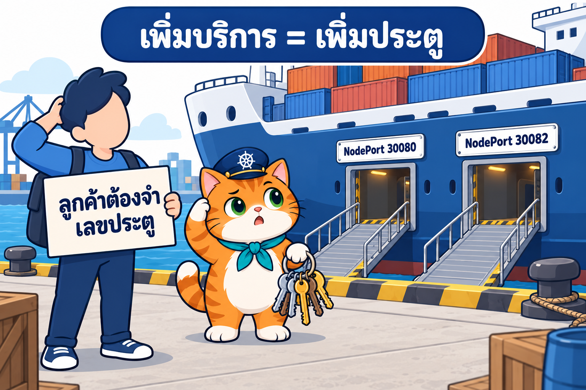<br>
  <em><b>รูปที่ 2</b> ทวนบท 010–011: ร้านเปิด NodePort 30080 (HTTP) และ 30082 (HTTPS ผ่าน nginx) ลูกค้าต้องจำเลขประตูเอง ถ้าเพิ่มหน้าแอดมินก็ต้องเพิ่มเลขอีก</em>
</p>

ทวนสภาพท้ายบทที่ 11

| สิ่งที่มี | ทางเข้า | ปัญหา |
|---|---|---|
| หน้าร้าน `som-web` (Deployment 3 บูธ) | Service NodePort `30080` (HTTP) | ลูกค้าต้องจำเลข `30080` |
| HTTPS | Deployment `som-https` (nginx ถือใบรับรองจาก Secret `som-tls`) + Service NodePort `30082` | ต้องดูแล nginx และไฟล์ตั้งค่าเอง ลูกค้าจำเลขอีกตัว |
| หน้าแอดมิน (ยังไม่มี) | ถ้าทำก็ต้องเปิด NodePort อีกเลข | เลขประตูงอกไปเรื่อย ๆ และไม่มีจุดตรวจบัตรกลาง |

ลูกค้าอยากพิมพ์ **ชื่อ** เช่น `shop.localhost` มากกว่าจำเลขประตู และพนักงานควรเข้าหลังร้านที่ `admin.localhost` ผ่าน **ประตูเดียวกัน** โดยมีด่านตรวจบัตร น้องส้มจึงสร้าง **อาคารประตูหน้าท่าเรือ** ที่มีป้ายบอกทางและพนักงานต้อนรับ

<p align="center" id="fig-3">
  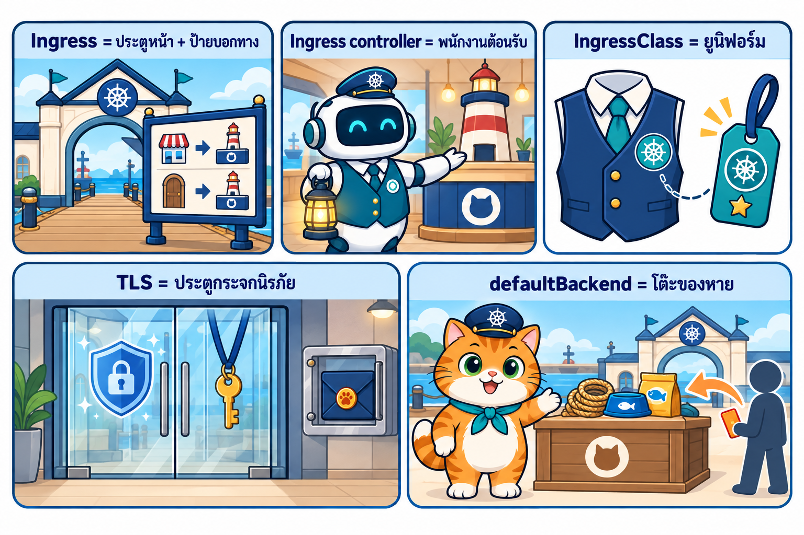<br>
  <em><b>รูปที่ 3</b> อุปมาใหม่ของบท: Ingress = ประตูหน้า + ป้ายบอกทาง, Ingress controller = พนักงานต้อนรับ (หุ่นยนต์), IngressClass = ยูนิฟอร์ม, TLS = ประตูกระจกนิรภัยมีตราประทับ, defaultBackend = โต๊ะของหาย</em>
</p>

**ตารางที่ 1** อุปมาท่าเรือที่ใช้ในบทนี้ (ต่อจากบทที่ 1–11)

| Kubernetes | อุปมาท่าเรือ | ใหม่ในบทนี้ |
|---|---|:---:|
| Pod / Deployment | บูธร้าน / หุ่นยนต์ผู้จัดการร้าน | |
| Service (ClusterIP) | เคาน์เตอร์ประภาคารในอาคาร มีป้ายชื่อคงที่ ส่งลูกค้าไปบูธที่พร้อม | |
| EndpointSlice + readinessProbe | คลิปบอร์ดรายชื่อบูธที่เปิด + ไฟเขียวเหนือบูธ | |
| NodePort | ประตูเลขบนเรือทุกลำ | |
| Secret `kubernetes.io/tls` / `basic-auth` | ซองปิดผนึกในกล่องกุญแจ (บทที่ 11) | |
| **Ingress** | **ป้ายบอกทางที่ประตูหน้าท่าเรือ** ("ชื่อนี้ + ทางนี้ → เคาน์เตอร์นั้น") | ✓ |
| **Ingress controller** | **หุ่นยนต์พนักงานต้อนรับ** ที่อ่านป้ายแล้วพาลูกค้าไปจริง | ✓ |
| **IngressClass** | **ยูนิฟอร์ม/ตราบนเสื้อกั๊ก** ที่ตรงกับตราบนป้าย (ดาวทอง = default) | ✓ |
| **TLS ที่ Ingress** | **ประตูกระจกนิรภัยมีตราประทับ** ถอดรหัสที่ประตูแล้วเดินต่อในอาคาร | ✓ |
| **SNI / ใบ DEFAULT** | ลูกค้าบอกชื่อผ่าน intercom ก่อนเปิดประตู / ตราสีเทาสำรอง | ✓ |
| **defaultBackend** | **โต๊ะของหาย** รับลูกค้าที่ไม่ตรงป้ายใดเลย | ✓ |
| **Middleware (Traefik)** | **ด่านในทางเดิน**: ป้ายลูกศรส่งต่อ, ไม้กั้นตรวจบัตร, เครื่องตัดตั๋ว | ✓ |
| **access log / dashboard** | **สมุดเยี่ยม** / **กระดานแก้ว** แสดงเส้นทางทั้งหมด | ✓ |
| **Gateway API** | **อาคารผู้โดยสารรุ่นใหม่** ที่แยกหน้าที่ผู้ดูแลอาคารกับทีมร้าน | ✓ |

<p align="center" id="fig-4">
  <br>
  <em><b>รูปที่ 4</b> เป้าหมายของบท: ลูกค้าเข้าร้านด้วยชื่อ shop.localhost และแอดมินใช้ admin.localhost ผ่านประตูเดียว แทนการจำเลขพอร์ต</em>
</p>

เป้าหมายของบทนี้คือร้านที่มี **หน้าร้านเดียวด้วยชื่อโดเมน**

- ลูกค้าเปิด `http://shop.localhost:30080` แล้วถูกส่งต่อ (301) ไป `https://shop.localhost:30081` อัตโนมัติ
- พนักงานเปิด `https://admin.localhost:30081` ต้องใส่บัตร (basic auth) ก่อนเห็นหน้าหลังร้าน
- Service ของแอปทุกตัวเป็น **ClusterIP** ประตูออกนอกเหลือบานเดียวคือ Service ของ controller
- เปลี่ยนรุ่นร้านผ่านประตูนี้ได้โดยลูกค้าไม่เจอ error

> **ทำไมยังมีเลขพอร์ต 30080/30081:** คลัสเตอร์ kind ใน `k8s-lab` ถูกสร้างให้ส่งต่อแค่พอร์ต 30080–30082 ออกมาที่เครื่องนักศึกษา (ไม่มีพอร์ต 80/443) ประตู Traefik จึงใช้ NodePort สองเลขนี้ ในคลัสเตอร์จริงประตูนี้มักเป็น LoadBalancer ที่พอร์ต 80/443 และลูกค้าพิมพ์แค่ `https://shop.example.com` (รายละเอียดหัวข้อ 15)

---

## 2. ทำไมต้องมี Ingress

### 2.1 NodePort: เลขประตูต่อ Service

<p align="center" id="fig-5">
  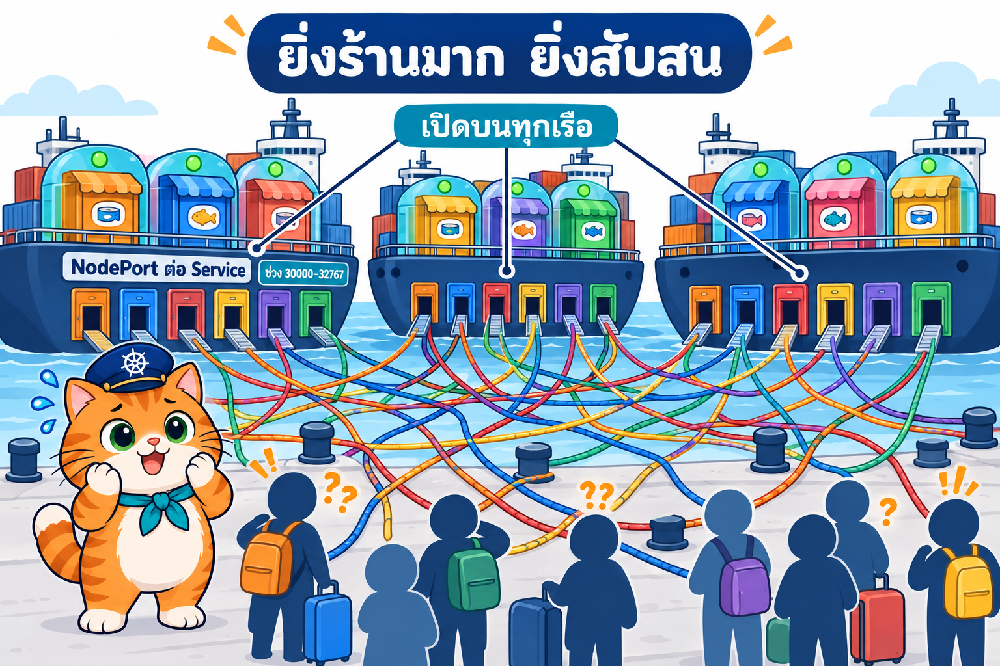<br>
  <em><b>รูปที่ 5</b> NodePort: ทุก Service ที่อยากให้คนนอกเข้าต้องมีเลขประตูของตัวเอง (ช่วง 30000–32767) และเปิดบนทุก Node — ร้านยิ่งมาก ยิ่งสับสน</em>
</p>

Service แบบ NodePort (บทที่ 6) เปิดพอร์ตเดียวกันบน **ทุก Node** ในช่วง `30000–32767` แล้วส่งต่อไปที่ Service ทุก Service ที่อยากให้คนนอกเข้าต้องจองเลขของตัวเอง และ **เลขหนึ่งจองได้ทีละ Service ทั้งคลัสเตอร์** ผลจริงเมื่อมี Service อื่นถือ `30080` อยู่แล้ว

```text
error: failed to create NodePort service: Service "probe" is invalid: spec.ports[0].nodePort: Invalid value: 30080: provided port is already allocated
```

ข้อเสียเมื่อร้านโตขึ้น

- ลูกค้าต้องรู้เลขพอร์ต และเลขไม่มีความหมาย (`30080` คือหน้าร้าน `30082` คือ HTTPS ...)
- แต่ละ Service ต้องทำ TLS, redirect และการตรวจบัตรเอง (เช่น nginx ของบทที่ 11)
- พอร์ตเปิดบนทุก Node เพิ่มพื้นผิวการโจมตี และในคลาวด์ต้องเปิด firewall ทีละเลข

### 2.2 LoadBalancer: IP ภายนอกต่อ Service

<p align="center" id="fig-6">
  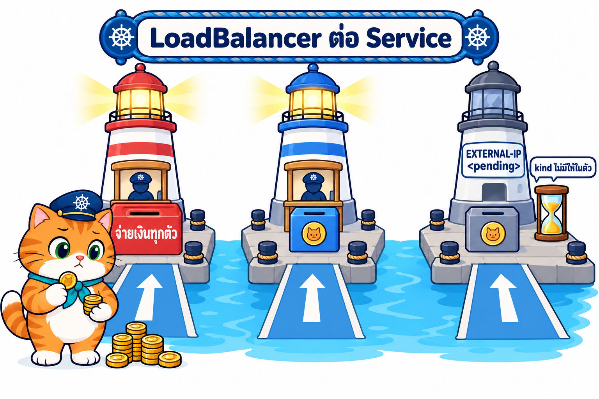<br>
  <em><b>รูปที่ 6</b> LoadBalancer: ได้ IP ภายนอกต่อ Service ในคลาวด์ แต่จ่ายเงินทุกตัว และบน kind (ไม่มี cloud controller) EXTERNAL-IP จะค้าง &lt;pending&gt;</em>
</p>

Service แบบ `LoadBalancer` ขอให้ cloud controller สร้างตัวกระจายโหลดภายนอกพร้อม IP สาธารณะให้ **Service ละหนึ่งตัว** ในคลาวด์สะดวกแต่จ่ายเงินทุกตัว ส่วนบน kind ซึ่งไม่มี cloud controller ผลจริงคือ EXTERNAL-IP ค้าง `<pending>` ตลอด (ยังได้ NodePort สุ่มมาให้)

```bash
kubectl create service loadbalancer lbtest --tcp=80:80
kubectl get svc lbtest
```

```text
NAME     TYPE           CLUSTER-IP   EXTERNAL-IP   PORT(S)        AGE
lbtest   LoadBalancer   10.96.3.87   <pending>     80:30265/TCP   10s
```

### 2.3 Ingress: ประตูเดียว หลายเคาน์เตอร์

<p align="center" id="fig-7">
  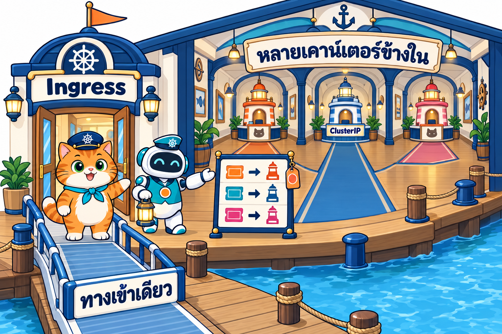<br>
  <em><b>รูปที่ 7</b> Ingress: เปิดประตูออกนอกบานเดียว (Service ของ controller) แล้วกฎ host/path ภายในพาไปหลาย Service ที่เป็น ClusterIP</em>
</p>

Ingress เปลี่ยนวิธีคิด: เปิดประตูออกนอก **บานเดียว** (Service ของ controller เป็น NodePort หรือ LoadBalancer ตัวเดียว) แล้วให้ controller อ่านป้ายกฎ host/path ภายในว่าคำขอแต่ละรายการควรไปที่ Service ใด ซึ่ง **เป็น ClusterIP ทั้งหมด** ผลคือ

| | NodePort ต่อ Service | LoadBalancer ต่อ Service | Ingress |
|---|---|---|---|
| ประตูภายนอก | 1 เลขต่อ Service | 1 IP ต่อ Service | 1 บาน (ของ controller) ใช้ร่วมกันทุกร้าน |
| เลือกตามชื่อ/path | ไม่ได้ | ไม่ได้ | ได้ |
| TLS | แต่ละแอปทำเอง | แล้วแต่ผู้ให้บริการ | ทำที่ประตูครั้งเดียว |
| ค่าใช้จ่ายในคลาวด์ | ต่ำแต่จัดการยาก | สูง (ทุก Service) | LoadBalancer ตัวเดียว |

> **นิยามจากเอกสาร Kubernetes:** Ingress คือ API object ที่จัดการการเข้าถึง Service ในคลัสเตอร์จากภายนอก โดยทั่วไปเป็น HTTP/HTTPS ให้ความสามารถ load balancing, TLS termination และ name-based virtual hosting โดยกฎทั้งหมดถูกนิยามบน Ingress resource ส่วนการทำงานจริงเป็นหน้าที่ของ Ingress controller

---

## 3. L4 กับ L7: Service ดูแค่ที่อยู่ Ingress อ่านจดหมาย

### 3.1 สองชั้นที่ทำงานต่างกัน

<p align="center" id="fig-8">
  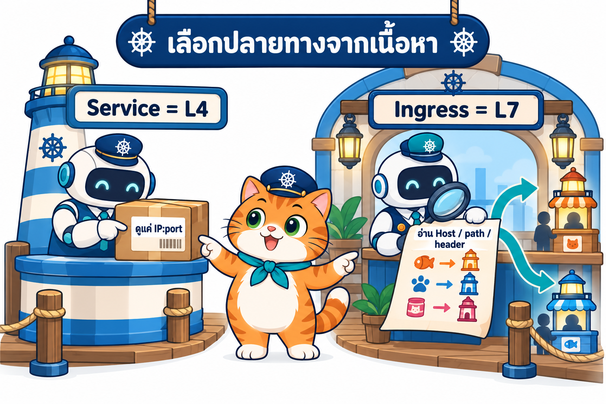<br>
  <em><b>รูปที่ 8</b> Service ทำงานชั้น L4 (ดูแค่ IP:port แล้วส่งต่อ) ส่วน Ingress controller ทำงานชั้น L7 อ่านคำขอ HTTP (Host, path, header) ก่อนเลือกปลายทาง</em>
</p>

| | Service (kube-proxy) | Ingress controller |
|---|---|---|
| ชั้นที่ทำงาน | **L4** (TCP/UDP) | **L7** (HTTP/HTTPS) |
| ข้อมูลที่ดู | IP ปลายทาง + พอร์ต | method, path, header `Host`, header อื่น ๆ, ชื่อใน TLS (SNI) |
| การตัดสิน | ส่งต่อไป Pod ที่ Ready ตัวใดตัวหนึ่ง | เลือก Service ตามกฎ host/path แล้วจึงส่งต่อไป Pod |
| แก้คำขอได้ไหม | ไม่ได้ | ได้ (เติม header `X-Forwarded-*`, ตัด path, redirect, ตรวจบัตร) |
| TLS | ส่งผ่านเฉย ๆ | ถอดรหัสที่ประตูได้ (TLS termination) |

เปรียบเทียบง่าย ๆ Service เหมือนพนักงานคัดแยกที่ดูแค่ **เลขที่อยู่หน้าซอง** ส่วน Ingress controller **เปิดอ่านจดหมาย** ว่าขอไปหาใคร เรื่องอะไร แล้วจึงตัดสินใจ

### 3.2 คำขอ HTTP มีอะไรให้อ่าน

<p align="center" id="fig-9">
  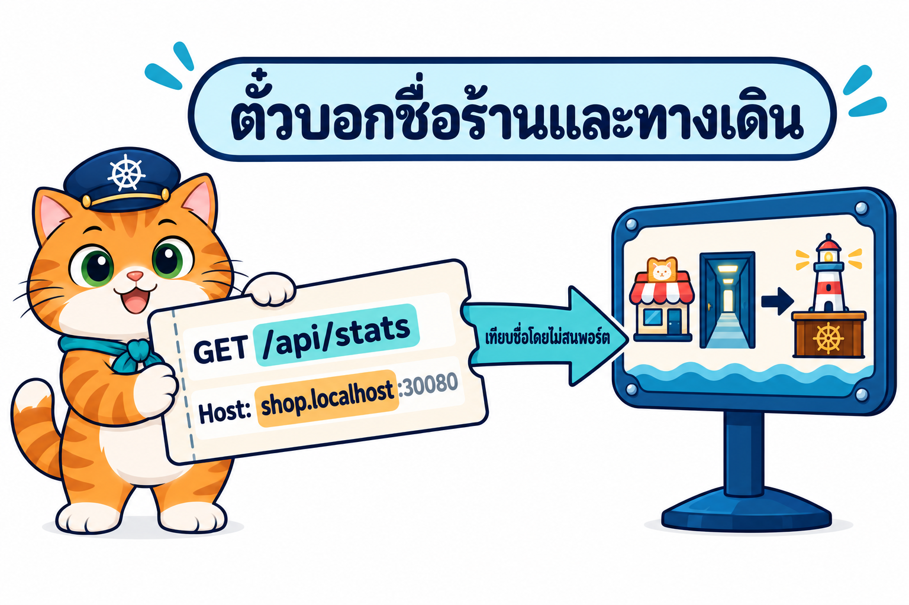<br>
  <em><b>รูปที่ 9</b> คำขอ HTTP ที่ Ingress ใช้ตัดสิน: บรรทัด GET /api/stats และ header Host — browser/curl ใส่เลขพอร์ตต่อท้าย (shop.localhost:30080) ซึ่ง controller ตัดพอร์ตออกก่อนเทียบกฎ</em>
</p>

ตัวอย่างคำขอที่ `curl http://shop.localhost:30080/hello` ส่งจริง และสิ่งที่แอป `whoami` หลัง Traefik ได้รับ (ผลจริงจาก LAB 2)

```text
GET /hello HTTP/1.1
Host: shop.localhost:30080
X-Forwarded-For: 172.19.0.2
X-Forwarded-Host: shop.localhost:30080
X-Forwarded-Port: 30080
X-Forwarded-Proto: http
X-Forwarded-Server: traefik-79d6dbf9fb-r6xs5
```

- บรรทัดแรก `GET /hello` บอก **method** และ **path** ที่กฎ `paths` ใช้เทียบ
- `Host: shop.localhost:30080` บอก **ชื่อ** ที่ลูกค้าพิมพ์ browser และ curl ใส่เลขพอร์ตต่อท้ายเมื่อไม่ใช่ 80/443 **controller ตัดพอร์ตออกก่อนเทียบกฎ `host`** จึงตรงกับกฎ `host: shop.localhost`
- `X-Forwarded-*` เป็น header ที่ controller เติมให้แอปรู้ว่าลูกค้าเข้ามาทางไหน (IP ต้นทาง, ชื่อ, พอร์ต, `http`/`https`)

> **ข้อควรรู้:** แม้การเลือกกฎจะไม่สนพอร์ต แต่ Middleware บางตัวของ Traefik (เช่น `redirectScheme` ในหัวข้อ 13) **ดูพอร์ตใน `Host`** ด้วย ถ้าส่ง `Host` ผิดพอร์ตบน HTTPS จะถูก redirect กลับไปพอร์ตที่ตั้งไว้

---

## 4. Ingress resource กับ Ingress controller

### 4.1 ป้ายไม่มีพนักงาน = ไม่ทำงาน

<p align="center" id="fig-10">
  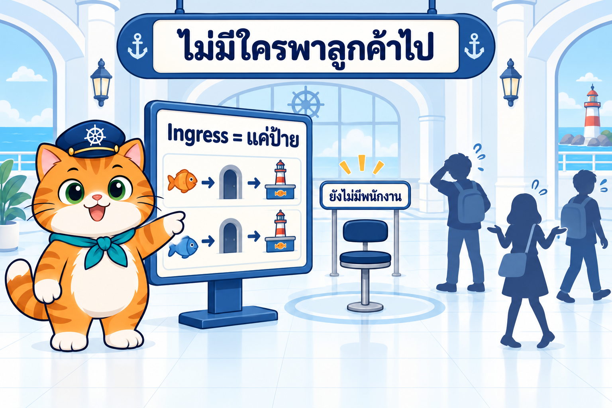<br>
  <em><b>รูปที่ 10</b> Ingress เป็นแค่ object ที่บอกกฎ ถ้าไม่มี Ingress controller ในคลัสเตอร์ก็ไม่มีใครอ่านป้าย ลูกค้าไม่ถูกพาไปไหน</em>
</p>

**Ingress resource** เป็นแค่ object ใน API server ที่บรรจุกฎ (เหมือน ConfigMap ที่ไม่มีใครอ่านก็ไม่มีผล) Kubernetes **ไม่มี Ingress controller ติดมาให้** ต่างจาก controller ตัวอื่นอย่าง Deployment หรือ ReplicaSet ที่อยู่ใน kube-controller-manager ถ้าคลัสเตอร์ไม่มี controller เลย `kubectl apply` ป้ายจะผ่านเสมอ แต่ไม่มีอะไรเกิดขึ้น ในบทนี้ก่อนติดตั้ง Traefik ประตู `localhost:30080` ยังไม่มีใครฟังเลย และหลังติดตั้งแต่ยังไม่มีป้าย ผลจริงคือ

```text
$ curl -i localhost:30080
HTTP/1.1 404 Not Found
Content-Type: text/plain; charset=utf-8
...
404 page not found
```

### 4.2 controller เฝ้าดู API server

<p align="center" id="fig-11">
  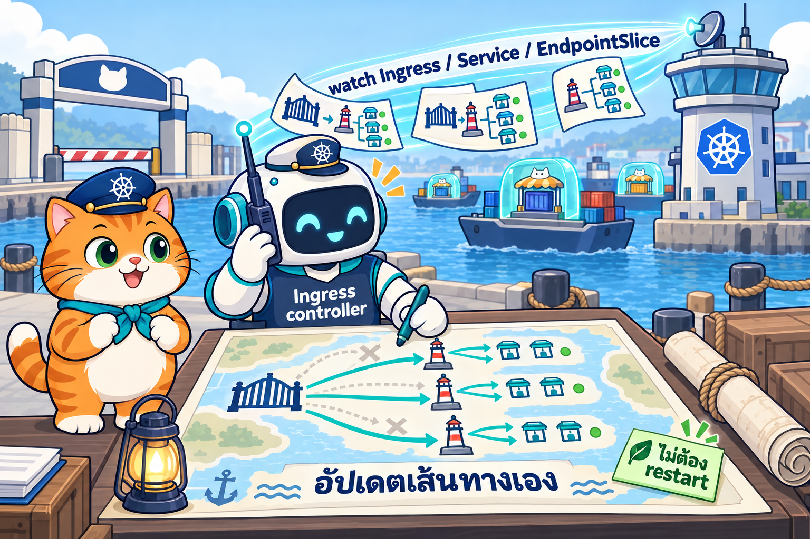<br>
  <em><b>รูปที่ 11</b> Ingress controller เฝ้าดู (watch) Ingress, Service, EndpointSlice และ Secret จาก API server แล้วปรับเส้นทางของตัวเองทันทีโดยไม่ต้อง restart</em>
</p>

controller ทำงานแบบเดียวกับ controller อื่นของ Kubernetes คือ **watch** สิ่งที่เกี่ยวข้องจาก API server แล้วปรับเส้นทางของตัวเองทันที **ไม่ต้อง restart**

| สิ่งที่ watch | ใช้ทำอะไร |
|---|---|
| Ingress, IngressClass | กฎ host/path/tls และป้ายไหนเป็นของตัวเอง |
| Service | แปลงชื่อ + พอร์ตของ backend |
| EndpointSlice | รายชื่อ IP ของ Pod ที่ **Ready** (ส่งตรงไป Pod ไม่ผ่าน kube-proxy) |
| Secret | ใบรับรอง TLS และบัตร basic auth |

สิทธิ์เหล่านี้กำหนดผ่าน ClusterRole ของ controller (ไฟล์ `00-traefik.yaml` ใน LAB ให้สิทธิ์ `get/list/watch` และ `update` เฉพาะ `ingresses/status` สำหรับเขียนคอลัมน์ ADDRESS) จะเห็นว่า controller **อ่าน Secret ได้ทั้งคลัสเตอร์** ซึ่งเป็นเหตุผลหนึ่งที่ต้องเลือก controller ที่ยังได้รับแพตช์ความปลอดภัย (หัวข้อ 5)

### 4.3 controller ก็คือแอปหนึ่งตัว

<p align="center" id="fig-12">
  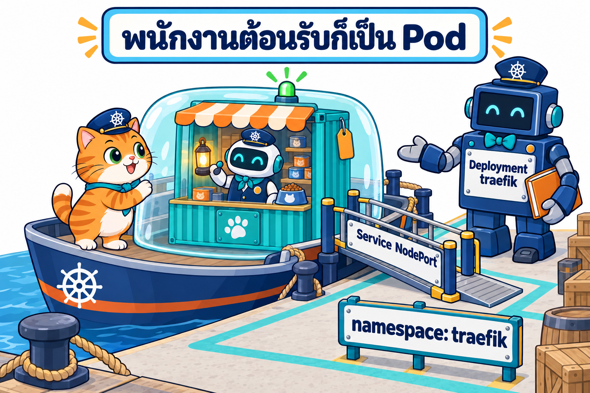<br>
  <em><b>รูปที่ 12</b> controller ก็คือแอปหนึ่งตัวในคลัสเตอร์: namespace traefik มี Deployment traefik + Service NodePort เป็นประตูออกนอกบานเดียว</em>
</p>

ในบทนี้ Traefik อยู่ใน namespace `traefik` ของตัวเอง ประกอบด้วยสิ่งที่นักศึกษารู้จักทั้งหมด: ServiceAccount + ClusterRole (บทที่ 4), Deployment (บทที่ 7) และ Service NodePort (บทที่ 6) ผลจริงหลังติดตั้ง

```text
NAME                           READY   STATUS    RESTARTS   AGE   IP           NODE
pod/traefik-79d6dbf9fb-r6xs5   1/1     Running   0          4s    10.244.2.8   lab-worker2

NAME              TYPE       CLUSTER-IP      EXTERNAL-IP   PORT(S)
service/traefik   NodePort   10.96.154.128   <none>        80:30080/TCP,443:30081/TCP,8080:30082/TCP
```

คำขอของลูกค้าเดินทาง: ประตู NodePort → Service `traefik` → Pod Traefik (อ่านป้าย) → **ตรงไปที่ IP ของ Pod ปลายทาง** จาก EndpointSlice (access log แสดงปลายทางเป็น `http://10.244.1.4:8080` ซึ่งเป็น IP ของ Pod ไม่ใช่ ClusterIP ของ Service)

### 4.4 มี controller ให้เลือกหลายบริษัท

<p align="center" id="fig-13">
  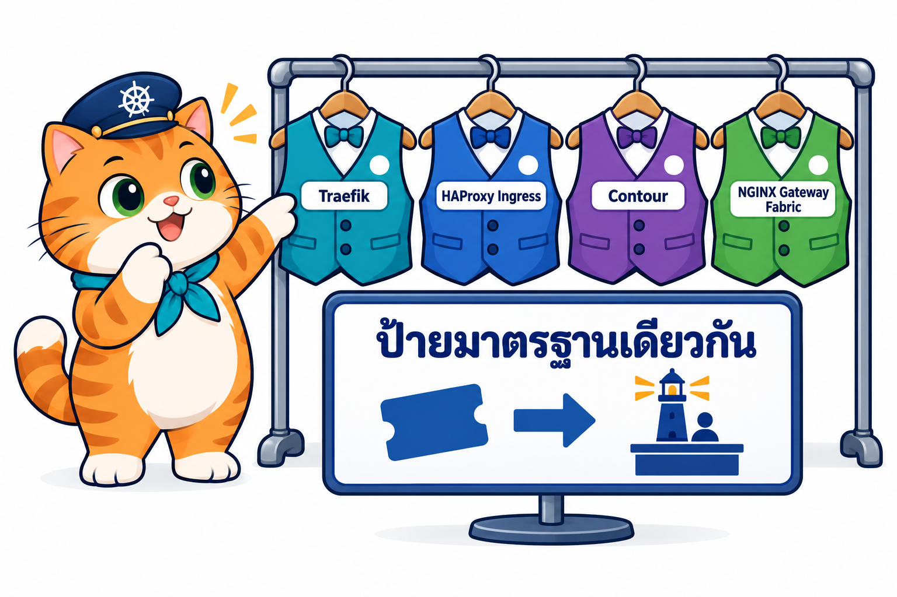<br>
  <em><b>รูปที่ 13</b> มี Ingress controller หลายบริษัท ใช้ป้าย Ingress มาตรฐานเดียวกัน (networking.k8s.io/v1) แต่ความสามารถเสริมต่างกัน</em>
</p>

ป้าย Ingress เป็นมาตรฐานเดียวกัน (`networking.k8s.io/v1`) แต่ controller มีหลายผู้พัฒนา ความสามารถเสริมต่างกัน ตัวอย่างที่ยังดูแลอยู่

| controller | ลักษณะ |
|---|---|
| **Traefik** | proxy ภาษา Go รองรับ Ingress, CRD ของตัวเอง และ Gateway API ใน binary เดียว (ใช้ในบทนี้) |
| HAProxy Ingress / HAProxy Kubernetes Ingress Controller | ใช้ HAProxy เป็นแกน |
| Contour | ใช้ Envoy เป็น data plane |
| F5 NGINX Ingress Controller | ของ F5/NGINX Inc. (คนละโครงการกับ ingress-nginx ของ Kubernetes) annotation/CRD เป็นชุดของตัวเอง |
| NGINX Gateway Fabric, Envoy Gateway, Istio ฯลฯ | เน้น Gateway API |
| controller ของคลาวด์ (AWS Load Balancer Controller, GKE Ingress ฯลฯ) | สร้าง load balancer ของผู้ให้บริการโดยตรง |

> เอกสาร Kubernetes ระบุว่า **Ingress API ถูก freeze แล้ว** (ยังใช้ได้และยังเป็น GA แต่ไม่เพิ่มฟีเจอร์ใหม่) ฟีเจอร์ใหม่ไปอยู่ใน **Gateway API** (หัวข้อ 19)

---

## 5. ingress-nginx หยุดดูแล และทำไมบทนี้ใช้ Traefik

### 5.1 ไทม์ไลน์ของ ingress-nginx

<p align="center" id="fig-14">
  <br>
  <em><b>รูปที่ 14</b> ingress-nginx (kubernetes/ingress-nginx) หยุดดูแล 24 มี.ค. 2026 repo เป็น archive ไม่มี release/แพตช์ความปลอดภัยอีก ของที่ติดตั้งไว้ยังรันได้แต่เสี่ยง — ทางการแนะนำย้ายไป Gateway API หรือ controller อื่น</em>
</p>

ingress-nginx (`kubernetes/ingress-nginx`) เคยเป็น controller ที่ตำราและบทความส่วนใหญ่ใช้ แต่สถานะในปี 2569 เปลี่ยนไปแล้ว

| วันที่ | เหตุการณ์ | แหล่งอ้างอิง |
|---|---|---|
| 11 พ.ย. 2025 | SIG Network และ Security Response Committee ประกาศ "Ingress NGINX Retirement" — ดูแลแบบ best-effort ถึงมีนาคม 2026 หลังจากนั้น **ไม่มี release, bugfix หรือแพตช์ช่องโหว่ความปลอดภัยอีก** ของที่ติดตั้งไว้ยังทำงานต่อได้และไฟล์ติดตั้งยังดาวน์โหลดได้ | [kubernetes.io/blog/2025/11/11/ingress-nginx-retirement](https://kubernetes.io/blog/2025/11/11/ingress-nginx-retirement/) |
| 29 ม.ค. 2026 | Steering Committee + SRC ออก statement ย้ำให้เริ่มย้ายทันที | [kubernetes.io/blog/2026/01/29/ingress-nginx-statement](https://kubernetes.io/blog/2026/01/29/ingress-nginx-statement/) |
| 27 ก.พ. 2026 | บทความ "Before You Migrate: Five Surprising Ingress-NGINX Behaviors" พฤติกรรมเฉพาะที่ต้องระวังตอนย้าย | [kubernetes.io/blog/2026/02/27/ingress-nginx-before-you-migrate](https://kubernetes.io/blog/2026/02/27/ingress-nginx-before-you-migrate/) |
| 20 มี.ค. 2026 | Ingress2Gateway 1.0 เครื่องมือแปลง Ingress (รวม annotation ของ ingress-nginx) เป็น Gateway API | [kubernetes.io/blog/2026/03/20/ingress2gateway-1-0-release](https://kubernetes.io/blog/2026/03/20/ingress2gateway-1-0-release/) |
| 24 มี.ค. 2026 | repo **archived (read-only)** เวอร์ชันสุดท้าย v1.15.1 (รองรับ Kubernetes 1.31–1.35) README เขียนว่า *"If you are not already using ingress-nginx, you should not be deploying it"* | [github.com/kubernetes/ingress-nginx](https://github.com/kubernetes/ingress-nginx) |

ผลกระทบในทางปฏิบัติ

- คลัสเตอร์ที่ใช้อยู่ **ยังรันต่อได้** แต่ถ้าพบช่องโหว่ใหม่จะไม่มีใครแก้ ขณะที่ controller อ่าน Secret ได้ทั้งคลัสเตอร์และหันหน้ารับคำขอจากอินเทอร์เน็ต จึงเป็นความเสี่ยงสูง
- เวอร์ชันสุดท้ายรองรับถึง Kubernetes 1.35 แต่คลัสเตอร์ของนักศึกษาเป็น v1.37
- คำแนะนำทางการคือย้ายไป **Gateway API** หรือ **Ingress controller ตัวอื่นที่ยังดูแลอยู่** (ใช้ ingress2gateway ช่วยแปลง)
- ระวังสับสนชื่อ: **F5 NGINX Ingress Controller** (`nginx/kubernetes-ingress`) เป็นคนละโครงการและยังดูแลอยู่

### 5.2 เกณฑ์เลือก controller สำหรับ LAB และทำไมเป็น Traefik

<p align="center" id="fig-15">
  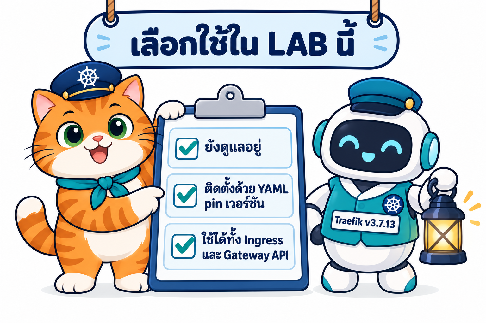<br>
  <em><b>รูปที่ 15</b> บทนี้ใช้ Traefik v3.7.13: ยังดูแลอยู่, image ทางการดึงได้ตรง, ติดตั้งด้วย YAML pin เวอร์ชัน (ไม่ต้องใช้ Helm), รองรับทั้ง Ingress และ Gateway API</em>
</p>

| เกณฑ์ | Traefik v3.7.13 ในบทนี้ |
|---|---|
| ยังดูแลอยู่ | v3.7.13 ออก 4 ก.ย. 2026 (สาย v3.7.x ออกแพตช์ทุก 1–2 สัปดาห์) — [releases](https://github.com/traefik/traefik/releases) |
| ติดตั้งง่าย ไม่ต้องรู้ Helm | ไฟล์ YAML ของบทไฟล์เดียว (`00-traefik.yaml`) + ไฟล์ CRD ทางการที่ pin tag `v3.7.13` |
| image ดึงได้ตรง | Node ของ kind ดึง `traefik:v3.7.13` จาก Docker Hub เอง (pre-check ใช้ 7.42 วินาที, 55 MB) ไม่ต้อง `kind load` |
| ใช้ป้ายมาตรฐาน | Ingress `networking.k8s.io/v1`, IngressClass, `spec.tls`, `defaultBackend` — [Kubernetes Ingress provider](https://doc.traefik.io/traefik/reference/install-configuration/providers/kubernetes/kubernetes-ingress/) |
| ต่อยอดบทที่ 11 | basicAuth อ่าน Secret `kubernetes.io/basic-auth` ได้ตรง ใช้ Secret `kubernetes.io/tls` ตัวเดิม |
| ปูทางอนาคต | รองรับ Gateway API v1.6.2 ใน binary เดียว (LAB เสริม) — [Gateway API provider](https://doc.traefik.io/traefik/reference/install-configuration/providers/kubernetes/kubernetes-gateway/) |
| ปลอดภัยพอสำหรับ LAB | รันเป็น uid 65532, `readOnlyRootFilesystem`, drop ALL ผ่าน Pod Security ระดับ restricted |

ตัวเลือกอื่นที่ยังดูแลอยู่ก็ใช้ได้ แต่ไม่เหมาะกับ LAB นี้: Contour ต้องมี Envoy และปรับ hostPort ของ kind, NGINX Gateway Fabric เน้น Gateway API (ไม่ใช่ Ingress), F5 NGINX Ingress Controller แนะนำติดตั้งด้วย Helm และใช้ annotation ชุดของตัวเอง **สิ่งที่เรียนในบทนี้ส่วนที่เป็นมาตรฐาน (หัวข้อ 6–12) ใช้กับ controller ใดก็ได้** ส่วนที่เฉพาะ Traefik จะติดป้ายไว้ชัดเจน (หัวข้อ 14)

---

## 6. IngressClass: ยูนิฟอร์มของพนักงาน

### 6.1 IngressClass บอกว่าใครรับผิดชอบป้าย

<p align="center" id="fig-16">
  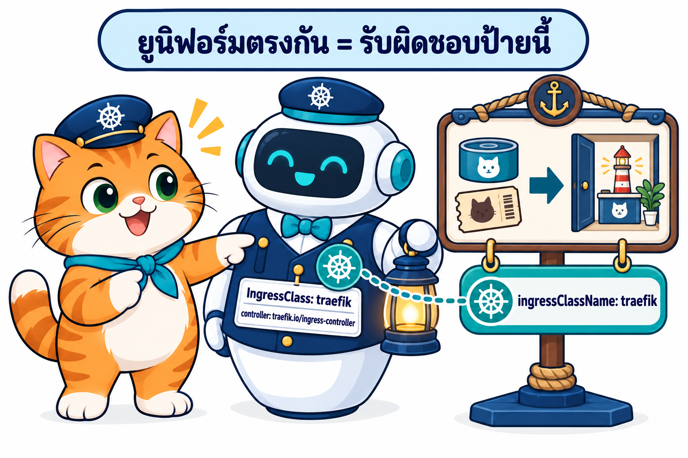<br>
  <em><b>รูปที่ 16</b> IngressClass บอกว่า controller ไหนรับผิดชอบ: IngressClass traefik มี controller: traefik.io/ingress-controller และ Ingress อ้างด้วย ingressClassName: traefik</em>
</p>

คลัสเตอร์หนึ่งมี controller ได้หลายตัว (เช่น ตัวหนึ่งสำหรับอินเทอร์เน็ต อีกตัวสำหรับภายใน) **IngressClass** เป็น object ระดับคลัสเตอร์ (cluster-scoped) ที่ผูกชื่อ class กับ controller ส่วน Ingress อ้าง class ด้วย `spec.ingressClassName`

```yaml
apiVersion: networking.k8s.io/v1
kind: IngressClass
metadata:
  name: traefik
  annotations:
    ingressclass.kubernetes.io/is-default-class: "true"
spec:
  controller: traefik.io/ingress-controller
```

```text
$ kubectl get ingressclass
NAME                CONTROLLER                      PARAMETERS   AGE
traefik (default)   traefik.io/ingress-controller   <none>       3s
```

`spec.controller` เป็นชื่อที่ controller ประกาศว่าตัวเองคือใคร (Traefik ใช้ `traefik.io/ingress-controller`) ส่วน `spec.parameters` (ไม่ได้ใช้ในบทนี้) ชี้ไป object ที่เก็บค่าตั้งค่าเพิ่มของ class นั้นได้

> **annotation รุ่นเก่า:** ก่อน IngressClass มี annotation `kubernetes.io/ingress.class: <ชื่อ>` บน Ingress ซึ่ง **deprecated แล้ว** ให้ใช้ `spec.ingressClassName` แทน แต่ยังพบได้ในบทความเก่า

### 6.2 default class: ดาวทองบนยูนิฟอร์ม

<p align="center" id="fig-17">
  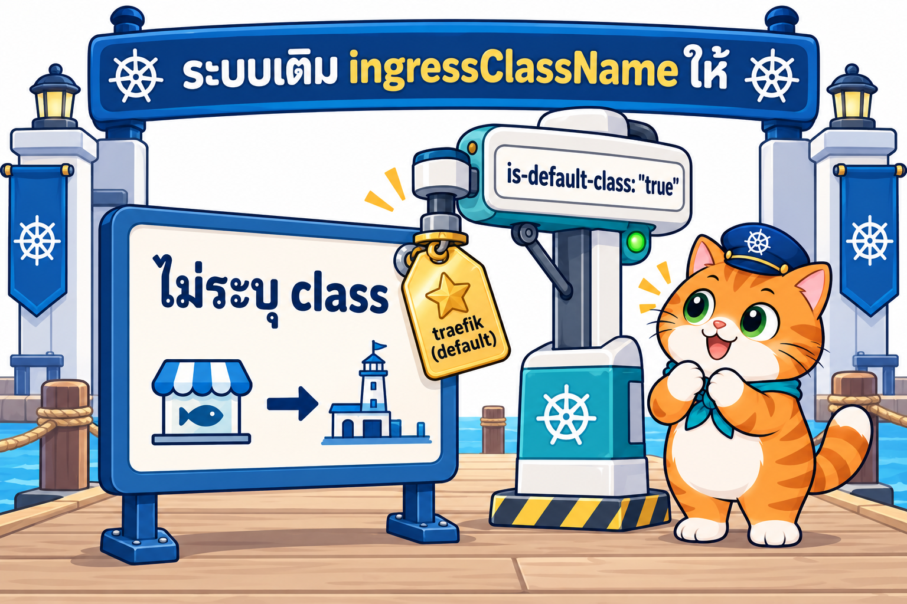<br>
  <em><b>รูปที่ 17</b> annotation ingressclass.kubernetes.io/is-default-class: &quot;true&quot; ทำให้ Ingress ที่ไม่ระบุ class ถูกเติม ingressClassName: traefik ตอนสร้าง (kubectl get ingressclass แสดง traefik (default))</em>
</p>

IngressClass ที่มี annotation `ingressclass.kubernetes.io/is-default-class: "true"` เป็น **default** — Ingress ที่สร้างโดยไม่ใส่ `ingressClassName` จะถูก admission controller **เติมค่า class ให้ตอนสร้าง** ผลจริงใน LAB 4 ไฟล์ `lab04-hosts/ingress.yaml` ไม่มี `ingressClassName` แต่หลัง apply

```text
$ kubectl -n ingress-demo get ing backoffice -o jsonpath='{.spec.ingressClassName}'
traefik
```

ข้อควรรู้: ถ้าตั้ง default ไว้มากกว่าหนึ่ง class เอกสาร Kubernetes ระบุว่า admission controller จะปฏิเสธการสร้าง Ingress ที่ไม่ระบุ class ใหม่ ในงานจริงควรใส่ `ingressClassName` ให้ชัดเสมอ (ไฟล์ของบทใส่ทุกไฟล์ ยกเว้นที่ตั้งใจไม่ใส่คือ LAB 4 และ `typo.yaml`, `lost.yaml` ของ LAB 6)

### 6.3 class ผิด: ไม่มีใครรับป้าย

<p align="center" id="fig-18">
  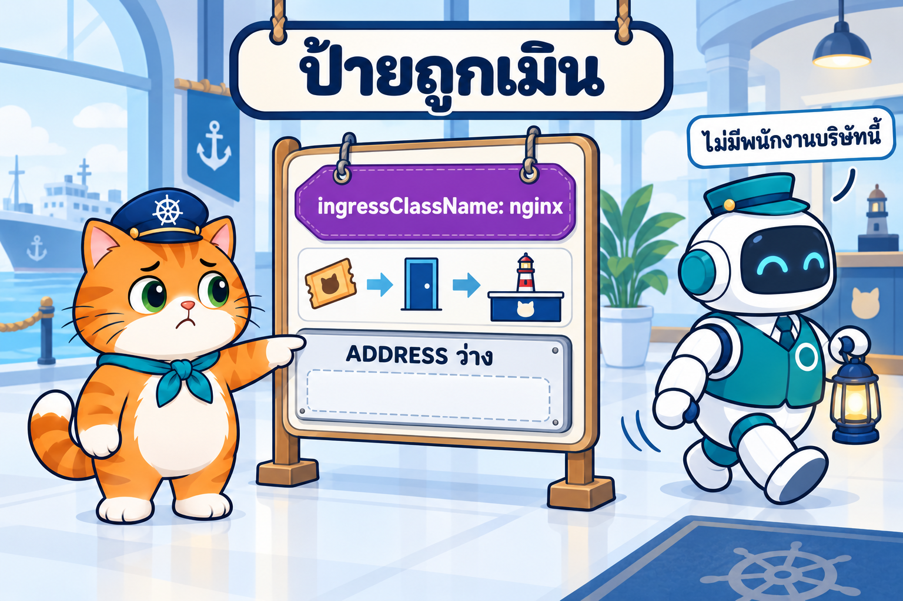<br>
  <em><b>รูปที่ 18</b> ระบุ class ผิด (เช่น ingressClassName: nginx ที่ไม่มีอยู่) → ไม่มี controller ไหนรับ, ADDRESS ว่าง, กฎไม่ทำงาน</em>
</p>

ถ้าระบุ class ที่ไม่มี controller ใดรับ (เช่น `ingressClassName: nginx` ในคลัสเตอร์ที่มีแต่ Traefik) API server รับป้ายได้ตามปกติ แต่ **ไม่มี controller ไหนสนใจ** ผลจริงใน LAB 6

```text
NAME         CLASS     HOSTS             ADDRESS     PORTS   AGE
shop         traefik   shop.localhost    localhost   80      61s
wrongclass   nginx     wrong.localhost               80      3s
$ curl -s -H 'Host: wrong.localhost' localhost:30080/
404 page not found
```

สัญญาณสำคัญคือ **คอลัมน์ ADDRESS ว่าง** เพราะไม่มี controller เขียน status ให้ ป้ายที่ Traefik รับจะได้ ADDRESS `localhost` (ค่าจาก flag `ingressendpoint.hostname` ของบท)

---

## 7. โครงสร้าง YAML และ backend

### 7.1 อ่านป้ายจากบนลงล่าง

<p align="center" id="fig-19">
  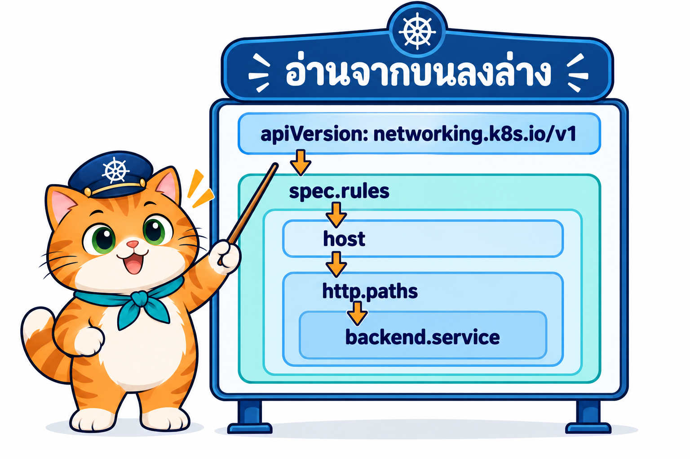<br>
  <em><b>รูปที่ 19</b> Ingress (networking.k8s.io/v1): spec.rules[] → host → http.paths[] (path + pathType) → backend.service (name + port) อ่านจากบนลงล่างเหมือนป้ายบอกทาง</em>
</p>

ป้ายแรกของ LAB 2 (`lab02-first/20-ingress.yaml`)

```yaml
apiVersion: networking.k8s.io/v1
kind: Ingress
metadata:
  name: shop
  namespace: ingress-demo
spec:
  ingressClassName: traefik          # ป้ายนี้ให้ Traefik เป็นคนทำ
  rules:
    - host: shop.localhost           # เทียบกับ header Host ของคำขอ
      http:
        paths:
          - path: /
            pathType: Prefix         # / = ทุก path
            backend:
              service:
                name: menu           # Service ClusterIP ใน namespace เดียวกับ Ingress
                port:
                  number: 80         # port ของ Service (ไม่ใช่ containerPort 8080)
```

| ฟิลด์ | ความหมาย | หมายเหตุ |
|---|---|---|
| `spec.ingressClassName` | class ที่รับผิดชอบ | ไม่ใส่ = ใช้ default class |
| `spec.rules[]` | รายการกฎ | ไม่มีเลยก็ได้ถ้าใช้ `defaultBackend` อย่างเดียว |
| `rules[].host` | ชื่อที่ต้องตรงกับ `Host` | ไม่ใส่ = ทุกชื่อ, ใช้ wildcard `*.example.com` ได้ (หัวข้อ 8) |
| `rules[].http.paths[]` | ทางเดินภายในชื่อนั้น | ต้องมี `path` + `pathType` + `backend` |
| `backend.service.name` | ชื่อ Service | ต้องอยู่ **namespace เดียวกับ Ingress** |
| `backend.service.port.number` / `.name` | พอร์ตของ Service | เลือกอย่างใดอย่างหนึ่ง |
| `spec.tls[]` | ชื่อ + Secret ใบรับรอง | หัวข้อ 12 |
| `spec.defaultBackend` | ปลายทางเมื่อไม่ตรงกฎใด | หัวข้อ 11 |

นอกจาก `backend.service` ยังมี `backend.resource` ที่ชี้ไปยัง object อื่น (เช่น ที่เก็บไฟล์ static ของผู้ให้บริการบางราย) ซึ่งใช้ร่วมกับ `service` ในกฎเดียวกันไม่ได้ บทนี้ใช้แต่ `service`

`kubectl get ing` และ `describe` แสดงผลของป้ายนี้ (ผลจริง LAB 2) — คอลัมน์ Backends แสดง IP:พอร์ตของ Pod ที่ Ready ให้เห็นทันทีว่า Service มี endpoint หรือไม่

```text
NAME   CLASS     HOSTS            ADDRESS     PORTS   AGE
shop   traefik   shop.localhost   localhost   80      0s

Rules:
  Host            Path  Backends
  ----            ----  --------
  shop.localhost
                  /   menu:80 (10.244.2.9:8080,10.244.1.4:8080)
```

### 7.2 port ของ Service ไม่ใช่ containerPort

<p align="center" id="fig-20">
  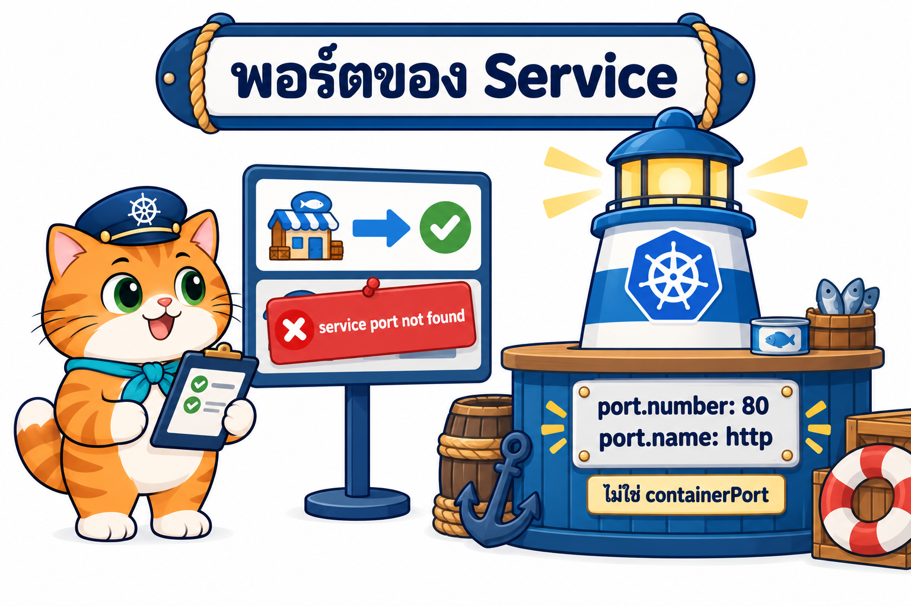<br>
  <em><b>รูปที่ 20</b> backend.service.port ใช้ number (80) หรือ name (http) ของ Service ไม่ใช่ containerPort — ใส่ผิดจะเห็น ERR service port not found ใน log ของ controller</em>
</p>

`backend.service.port` อ้าง **พอร์ตของ Service** (`spec.ports[].port` หรือ `spec.ports[].name`) ไม่ใช่ `containerPort` ของ Pod ใน LAB Service `menu` เป็น `port: 80` ชื่อ `http` → `targetPort: http` (8080 ใน container) จึงอ้างได้สองแบบ

```yaml
# แบบที่ 1 อ้างด้วยเลข
backend:
  service: {name: menu, port: {number: 80}}
---
# แบบที่ 2 อ้างด้วยชื่อ (lab03-fanout)
backend:
  service: {name: api, port: {name: http}}
```

ถ้าใส่ `number: 8080` (เลขของ container) `kubectl apply` ผ่าน แต่ controller หาไม่เจอ ผลจริงใน LAB 6

```text
$ kubectl -n ingress-demo describe ing typo
  typo.localhost
                  /       menuu:80 (<error: services "menuu" not found>)
                  /port   menu:8080 ()
Events:           <none>
$ kubectl -n traefik logs deploy/traefik --since=30s | grep ERR
2026-10-05T13:14:12Z ERR Cannot create service error="service not found" ingress=typo namespace=ingress-demo providerName=kubernetes serviceName=menuu servicePort=&ServiceBackendPort{Name:,Number:80,}
2026-10-05T13:14:12Z ERR Cannot create service error="service port not found" ingress=typo namespace=ingress-demo providerName=kubernetes serviceName=menu servicePort=&ServiceBackendPort{Name:,Number:8080,}
```

สังเกตว่า Events ของ Ingress เป็น `<none>` — **API server ไม่ตรวจว่า backend มีจริง** ข้อผิดพลาดแบบนี้เห็นได้จาก `describe` (วงเล็บว่างหรือ `<error: ...>`) และ log ของ controller เท่านั้น

### 7.3 Service ของแอปเป็นแค่ ClusterIP

<p align="center" id="fig-21">
  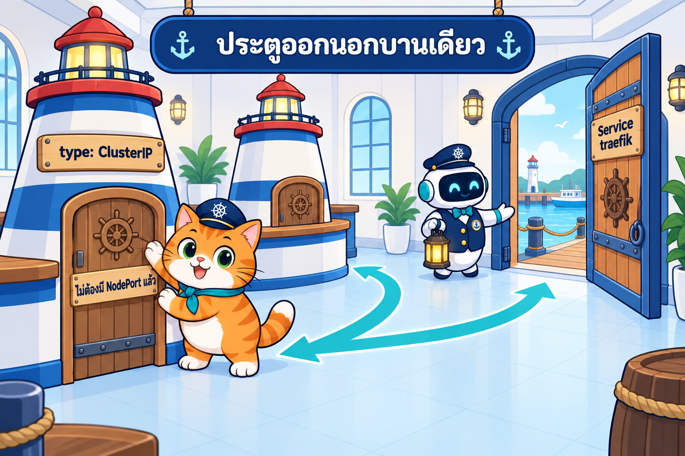<br>
  <em><b>รูปที่ 21</b> เมื่อมี Ingress แล้ว Service ของแอปเป็นแค่ ClusterIP (เคาน์เตอร์ในอาคาร) ประตูออกนอกเหลือบานเดียวคือ Service traefik</em>
</p>

เมื่อมี Ingress แล้ว Service ของแอปไม่จำเป็นต้องเป็น NodePort อีก ใน LAB 10 ไฟล์ `som-shop-v8/k8s/20-web.yaml` ต่างจากบทที่ 11 สองบรรทัด (ผลจริงจาก `diff`)

```text
6c6
<   type: NodePort
---
>   type: ClusterIP
12d11
<       nodePort: 30080
```

`kubectl apply` ทับ Service เดิมเปลี่ยน NodePort → ClusterIP ได้เลย และคืนพอร์ต 30080 ให้ประตู Traefik ผลสุดท้ายของร้าน: มี NodePort เหลือ Service เดียวคือ `traefik`

```text
som-shop      som-admin    ClusterIP   10.96.126.248   <none>        80/TCP
som-shop      som-db       ClusterIP   None            <none>        5432/TCP
som-shop      som-web      ClusterIP   10.96.198.30    <none>        80/TCP
traefik       traefik      NodePort    10.96.154.128   <none>        80:30080/TCP,443:30081/TCP,8080:30082/TCP
```

---
## 8. Host-based: หลายชื่อ ประตูเดียว

### 8.1 name-based virtual hosting

<p align="center" id="fig-22">
  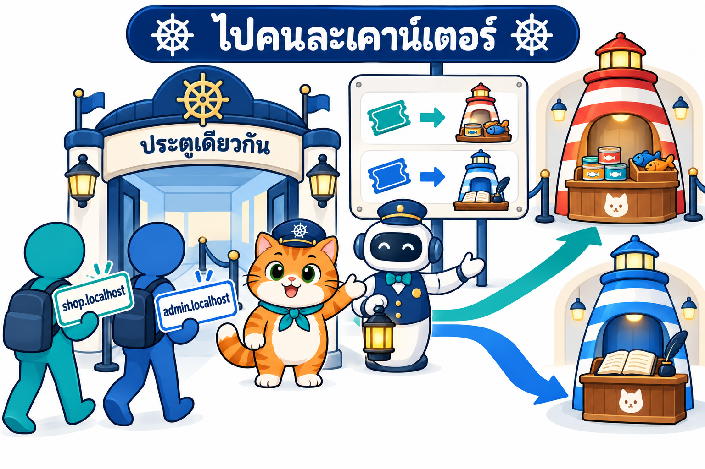<br>
  <em><b>รูปที่ 22</b> name-based virtual hosting: ลูกค้าสองคนเข้าประตูเดียวกัน แต่ Host ต่างกัน (shop.localhost / admin.localhost) จึงถูกพาไปคนละ Service</em>
</p>

ลูกค้าสองคนเดินเข้าประตูเดียวกัน (พอร์ต 30080 เดียวกัน IP เดียวกัน) แต่บอกชื่อต่างกันใน `Host` controller จึงพาไปคนละ Service เทคนิคนี้เรียกว่า **name-based virtual hosting** ใน LAB 4 มีป้ายสองแผ่น

```text
# lab02-first/20-ingress.yaml (แผ่น shop)            # lab04-hosts/ingress.yaml (แผ่น backoffice)
- host: shop.localhost   → menu                        - host: admin.localhost  → admin
```

ผลจริง

```text
$ curl -s http://admin.localhost:30080/ | grep -E '^Name|^GET|^Host'
Name: admin
GET / HTTP/1.1
Host: admin.localhost:30080
$ curl -s http://shop.localhost:30080/ | grep -E '^Name'
Name: menu
$ curl -s -i http://other.localhost:30080/ | grep -E '^HTTP|404'
HTTP/1.1 404 Not Found
404 page not found
$ curl -s -H 'Host: ADMIN.localhost' localhost:30080/ | grep -E '^Name'
Name: admin
$ curl -s localhost:30080/; curl -s http://127.0.0.1:30080/
404 page not found
404 page not found
```

ข้อสังเกต

- ชื่อที่ไม่มีป้ายรับ (`other.localhost`) และการเรียกด้วย `localhost` หรือ IP ตรง ๆ ได้ **404 ของ controller**
- **ชื่อโฮสต์ไม่สนตัวพิมพ์เล็ก-ใหญ่** (`ADMIN.localhost` ก็ตรง) ตามมาตรฐาน DNS ต่างจาก path ที่สนตัวพิมพ์ (หัวข้อ 10)
- ป้าย `backoffice` รับ **ทุก path** ของ `admin.localhost` (`/api/stats` ก็ไป admin) เพราะกฎผูกกับชื่อก่อน path

**wildcard host:** `host: "*.example.com"` ตรงกับชื่อที่มีป้ายหน้า **หนึ่งระดับ** พอดี เช่น `bar.example.com` แต่ไม่ตรง `baz.bar.example.com` และไม่ตรง `example.com` (ตามเอกสาร Kubernetes; ไม่ได้ทดลองใน LAB)

### 8.2 ชื่อ `*.localhost` ใช้ได้โดยไม่แก้ไฟล์ hosts

<p align="center" id="fig-23">
  <br>
  <em><b>รูปที่ 23</b> ชื่อ *.localhost ถูก browser และ curl แปลงเป็น 127.0.0.1 เอง (ทดสอบแล้วใน Chromium 153 และ curl 8.5; browser อื่นยังไม่ได้ทดสอบ) จึงไม่ต้องแก้ไฟล์ hosts</em>
</p>

ชื่อที่ลงท้ายด้วย `.localhost` ถูกสงวนไว้ให้หมายถึงเครื่องตัวเอง (loopback) โปรแกรมบางตัวจึงแปลงเป็น `127.0.0.1`/`::1` เอง **โดยไม่ต้องถาม DNS และไม่ต้องแก้ไฟล์ hosts** ผลจริงที่ทดสอบในบทนี้

| โปรแกรม | ผล |
|---|---|
| Chromium 153 บน Linux (Playwright) | เปิด `shop.localhost`, `admin.localhost`, `a.b.localhost` ได้ทั้งหมดโดยไม่มีบรรทัดใน `/etc/hosts` |
| curl 8.5.0 (ใน k8s-lab) | `Trying [::1]:30080...` แล้ว `Trying 127.0.0.1:30080...` → `Connected to shop.localhost (127.0.0.1) port 30080` |
| `getent hosts shop.localhost` (glibc ของระบบ) | ไม่พบ `getent rc=2` |
| Node.js (Playwright APIRequest) | `getaddrinfo ENOTFOUND shop.localhost` |

ข้อสรุป: **curl และ Chromium แปลงเอง** แต่โปรแกรมที่ใช้ resolver ของระบบหาไม่เจอ (ทดสอบแล้ว: `getent` และ Node.js; โปรแกรมอื่นอย่าง `wget` หรือ Python requests ก็มีแนวโน้มเป็นแบบเดียวกัน) **browser อื่น (Chrome/Edge บน Windows/macOS, Firefox, Safari) ยังไม่ได้ทดสอบในบทนี้** นักศึกษาต้องลองบนเครื่องตัวเองและใช้ทางสำรองถ้าเปิดไม่ได้

### 8.3 ทางสำรองเมื่อโปรแกรมแปลงชื่อไม่ได้

<p align="center" id="fig-24">
  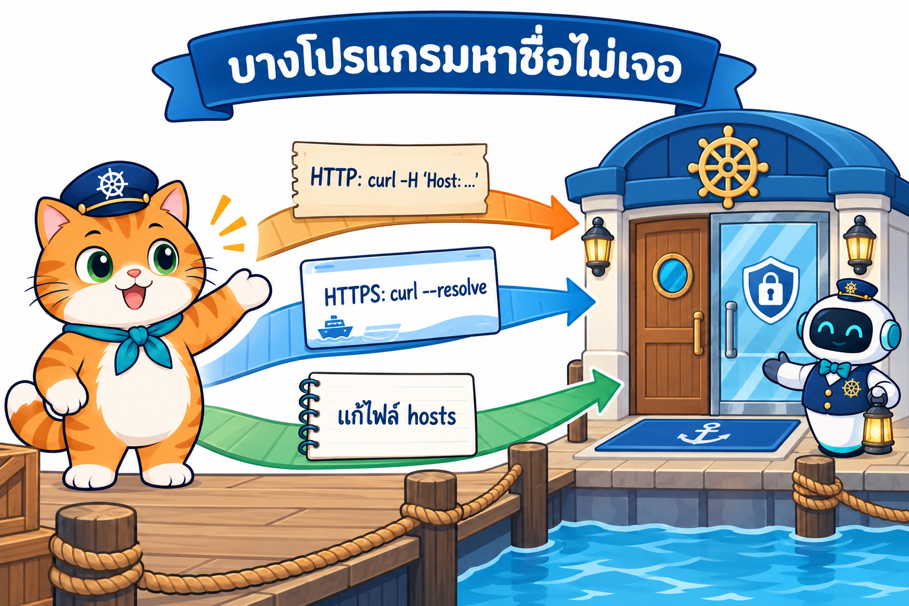<br>
  <em><b>รูปที่ 24</b> ทางสำรองเมื่อโปรแกรมแปลง *.localhost ไม่ได้ (เช่น getent/wget/python): HTTP ใช้ curl -H 'Host: ...' ได้, HTTPS ต้องใช้ curl --resolve (หรือ --connect-to) เพราะ TLS ต้องรู้ชื่อตั้งแต่ต้น หรือแก้ไฟล์ hosts</em>
</p>

| วิธี | ใช้กับ | ตัวอย่าง (ผลจริง) |
|---|---|---|
| ใส่ `Host` เอง | **HTTP** | `curl -s -H 'Host: shop.localhost' localhost:30080/` → `Name: menu` |
| `--resolve ชื่อ:พอร์ต:IP` | HTTP และ **HTTPS** | `curl -s --resolve shop.localhost:30080:127.0.0.1 http://shop.localhost:30080/` → `Name: menu` |
| แก้ไฟล์ hosts | browser/โปรแกรมทุกตัว | เพิ่มบรรทัด `127.0.0.1 shop.localhost admin.localhost` ใน `C:\Windows\System32\drivers\etc\hosts` (Windows, ต้องเปิด editor แบบ Administrator) หรือ `/etc/hosts` (macOS/Linux) |

ทำไม HTTPS ต้องใช้ `--resolve` (หรือ `--connect-to`) มากกว่า `-H 'Host: ...'`

1. TLS ต้องรู้ชื่อ **ตั้งแต่ก่อนส่งคำขอ** (SNI ในหัวข้อ 12) curl ใช้ชื่อใน URL เป็น SNI ถ้า URL เป็น `https://localhost:30081` แต่ `-H 'Host: shop.localhost'` controller จะเลือกใบรับรองของ `localhost` ไม่ใช่ของร้าน
2. ใน LAB 10 ป้ายมี Middleware redirect ที่ดูพอร์ตใน `Host` การส่ง `Host: shop.localhost` (ไม่มีพอร์ต) บน HTTPS จึงได้ 301 กลับไปที่ `:30081` แทนหน้าร้าน (ผลจริง `location: https://shop.localhost:30081/api/whoami`) ถ้าจะใช้ `-H` ต้องใส่พอร์ตให้ตรง `-H 'Host: shop.localhost:30081'` ซึ่งได้ `som-web-7948ccf586-rsxk8 1.5` ตามปกติ

---

## 9. Path fan-out: ชื่อเดียว หลายทางเดิน

### 9.1 แยก Service ตาม path

<p align="center" id="fig-25">
  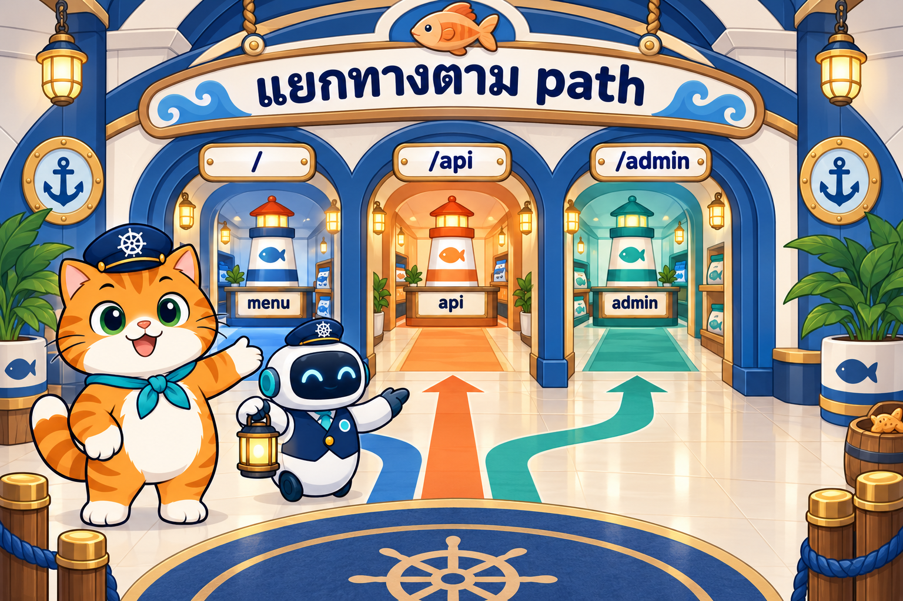<br>
  <em><b>รูปที่ 25</b> fan-out: ชื่อเดียว shop.localhost แต่แยก path / → menu, /api → api, /admin → admin (Service คนละตัว)</em>
</p>

ร้านจริงมักมีหลายส่วนใต้ชื่อเดียว เช่น หน้าเว็บ, API และหน้าแอดมิน **fan-out** คือกฎหลาย path ใน host เดียว ไฟล์ `lab03-fanout/ingress.yaml`

```yaml
spec:
  ingressClassName: traefik
  rules:
    - host: shop.localhost
      http:
        paths:
          - path: /
            pathType: Prefix
            backend:
              service: {name: menu, port: {number: 80}}
          - path: /api
            pathType: Prefix
            backend:
              service: {name: api, port: {name: http}}     # อ้าง port ของ Service ด้วย "ชื่อ" ก็ได้
          - path: /admin
            pathType: Prefix
            backend:
              service: {name: admin, port: {number: 80}}
```

ผลจริง (whoami ตอบกลับชื่อ Service และ path ที่ได้รับ)

```text
/           -> Name: menu GET / HTTP/1.1
/order      -> Name: menu GET /order HTTP/1.1
/api/       -> Name: api GET /api/ HTTP/1.1
/api/stats  -> Name: api GET /api/stats HTTP/1.1
/admin      -> Name: admin GET /admin HTTP/1.1
/admin/x    -> Name: admin GET /admin/x HTTP/1.1
/apix       -> Name: menu GET /apix HTTP/1.1
```

**path ไม่ถูกตัด:** แอป api ได้รับ `GET /api/stats` เต็ม ๆ ไม่ใช่ `/stats` ถ้าแอปไม่ได้ถูกเขียนให้อยู่ใต้ `/api` ต้องใช้ความสามารถ rewrite ของ controller (stripPrefix ในหัวข้อ 14) ซึ่ง Ingress มาตรฐานไม่มี

> **กับดักของ whoami:** path `/api` (ตรงตัว) ของ image `traefik/whoami` เป็น endpoint พิเศษที่ตอบเป็น JSON แทนข้อความ จึงไม่มีบรรทัด `Name:` ให้ grep แต่ยังถูกส่งไป api ถูกต้อง (JSON มี `"name":"api"` และ access log มี router `...-api@kubernetes`) LAB จึงใช้ `/api/stats` หรือ `/api/` เป็นตัวอย่างหลัก

### 9.2 ลำดับความสำคัญเมื่อหลายกฎตรงพร้อมกัน

<p align="center" id="fig-26">
  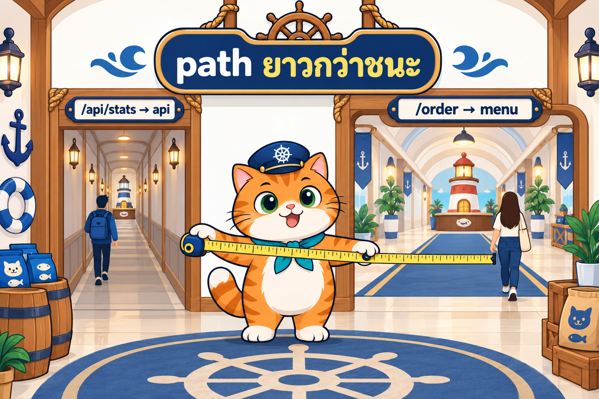<br>
  <em><b>รูปที่ 26</b> หลายกฎตรงพร้อมกัน path ที่ยาวกว่าชนะ: /api/stats ไป api, /order ไป menu (ตกที่ /)</em>
</p>

`/api/stats` ตรงทั้งกฎ `/` และ `/api` มาตรฐานกำหนดว่า

1. **path ที่ยาวกว่าชนะ** (`/api` ยาวกว่า `/` → ไป api)
2. ถ้ายาวเท่ากัน **`Exact` ชนะ `Prefix`**
3. ถ้าไม่มีกฎ path ใดตรง ก็ไปที่ `defaultBackend` (หัวข้อ 11)

Traefik แปลงป้ายเป็น **router** หนึ่งตัวต่อ path และจัดลำดับด้วย priority ซึ่งค่าเริ่มต้นคือความยาวของ rule ผลจริงจาก API ของ dashboard (`/api/http/routers`)

```text
ingress-demo-shop-shop-localhost-admin@kubernetes | Host("shop.localhost") && (Path("/admin") || PathPrefix("/admin/")) | 67
ingress-demo-shop-shop-localhost-api@kubernetes | Host("shop.localhost") && (Path("/api") || PathPrefix("/api/")) | 63
ingress-demo-shop-shop-localhost@kubernetes | Host("shop.localhost") && PathPrefix("/") | 41
websecure-ingress-demo-shop-shop-localhost-admin@kubernetes | ... | 67
```

ชื่อ router บอกที่มาครบ: `<namespace>-<ชื่อ Ingress>-<host>-<path>@kubernetes` และมีชุด `websecure-...` ซ้ำอีกชุดเพราะป้ายที่ไม่ได้ระบุ entrypoint ถูกใช้ทั้งประตู HTTP (`web`) และ HTTPS (`websecure`)

---

## 10. pathType: Prefix, Exact, ImplementationSpecific

### 10.1 สามแบบตามมาตรฐาน

<p align="center" id="fig-27">
  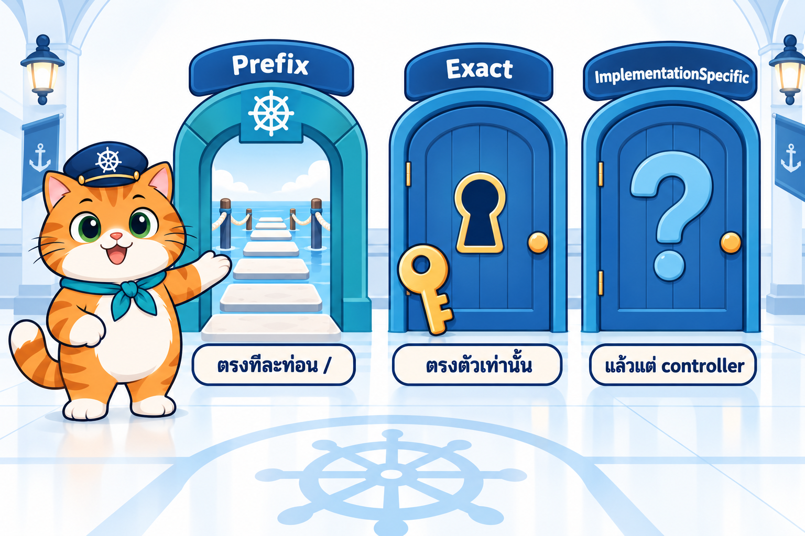<br>
  <em><b>รูปที่ 27</b> pathType มี 3 แบบ: Prefix (ตรงทีละท่อนที่คั่นด้วย /), Exact (ตรงตัวเท่านั้น), ImplementationSpecific (แล้วแต่ controller)</em>
</p>

| pathType | กฎ | ตัวอย่าง `path: /api` |
|---|---|---|
| `Prefix` | แยก path ด้วย `/` แล้วเทียบ **ทีละท่อน (element)** จากซ้าย ไม่สน `/` ท้าย ตัวพิมพ์เล็ก-ใหญ่ต่างกัน | ตรง `/api`, `/api/`, `/api/x` ไม่ตรง `/apix`, `/API` |
| `Exact` | ต้องตรงทั้งเส้น ตัวพิมพ์เล็ก-ใหญ่ต่างกัน | ตรงแค่ `/api` ไม่ตรง `/api/` |
| `ImplementationSpecific` | แล้วแต่ controller (อาจเป็น prefix, regex หรือแบบอื่น) | Traefik (strict) ทำเหมือน Prefix |

`pathType` เป็นฟิลด์บังคับใน `networking.k8s.io/v1` ไม่ใส่จะ apply ไม่ผ่าน

### 10.2 Prefix เทียบทีละท่อน

<p align="center" id="fig-28">
  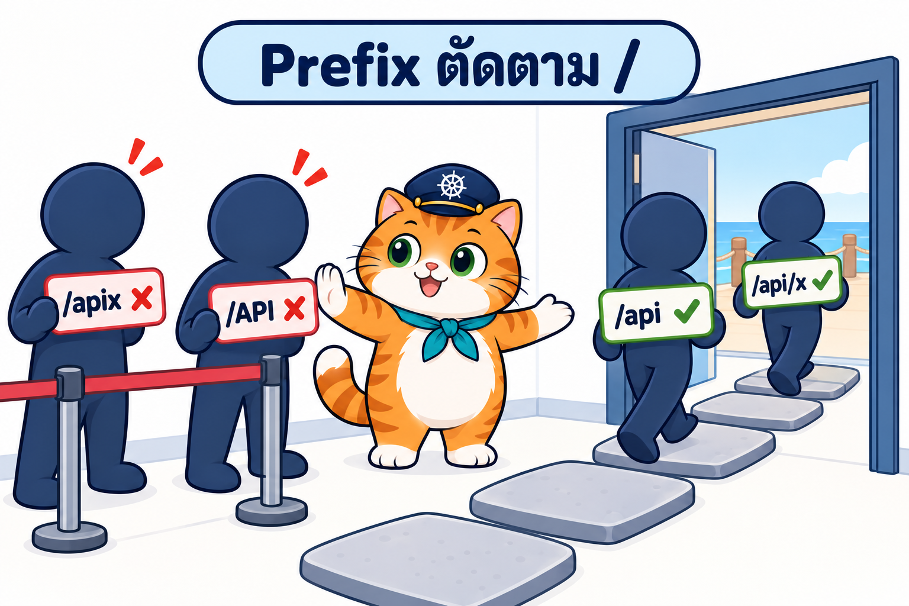<br>
  <em><b>รูปที่ 28</b> Prefix /api ตามมาตรฐาน: ตรง /api, /api/, /api/x แต่ไม่ตรง /apix และ /API (ตัวพิมพ์ใหญ่ต่างกัน) — ยืนยันกับ Traefik ที่เปิด strictPrefixMatching</em>
</p>

ป้าย `lab05-pathtype/ingress.yaml` ใช้ชื่อ `paths.localhost` (ไม่มีกฎ `/` เพื่อให้เห็น 404 ชัด)

```yaml
paths:
  - path: /api
    pathType: Prefix
    backend: {service: {name: api, port: {number: 80}}}
  - path: /docs/                 # มี / ท้าย — Prefix ไม่สน / ท้าย (/docs ก็ตรง)
    pathType: Prefix
    backend: {service: {name: admin, port: {number: 80}}}
  - path: /menu
    pathType: Exact
    backend: {service: {name: menu, port: {number: 80}}}
  - path: /impl
    pathType: ImplementationSpecific
    backend: {service: {name: admin, port: {number: 80}}}
```

ผลจริงจาก `./lab05-pathtype/try-paths.sh` (Traefik เปิด `strictPrefixMatching=true` ตามไฟล์ของบท)

```text
PATH       STATUS ใครตอบ
/api       200    Name: api (JSON)
/api/      200    Name: api
/api/x     200    Name: api
/apix      404    404 page not found
/API       404    404 page not found
/docs      200    Name: admin
/docs/     200    Name: admin
/docs/a    200    Name: admin
/docsx     404    404 page not found
/menu      200    Name: menu
/menu/     404    404 page not found
/menux     404    404 page not found
/impl      200    Name: admin
/impl/x    200    Name: admin
/implx     404    404 page not found
```

`/API` ได้ 404 เพราะ path สนตัวพิมพ์ และ `paths.localhost` ไม่มีกฎ `/` ให้ตก (ถ้าเป็น `shop.localhost` ใน LAB 3 จะตกไปที่ menu ของกฎ `/` แทน)

### 10.3 ระวัง `/` ท้าย

<p align="center" id="fig-29">
  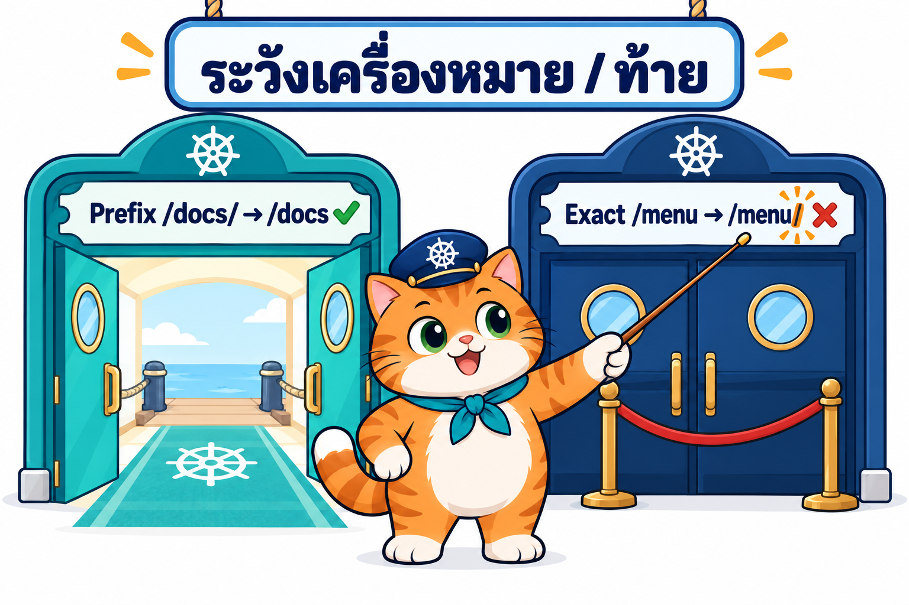<br>
  <em><b>รูปที่ 29</b> ระวัง / ท้าย: Prefix /docs/ ก็รับ /docs (ไม่สน / ท้าย) แต่ Exact /menu ไม่รับ /menu/</em>
</p>

- `Prefix` ไม่สน `/` ท้ายทั้งในกฎและในคำขอ: กฎ `/docs/` รับ `/docs`, `/docs/`, `/docs/a` แต่ไม่รับ `/docsx`
- `Exact` ไม่ยืดหยุ่น: กฎ `/menu` ไม่รับ `/menu/` (404) ถ้าแอปมีลิงก์ที่ลงท้ายด้วย `/` ต้องเพิ่มกฎหรือใช้ Prefix

### 10.4 ข้อควรรู้เฉพาะ Traefik: strictPrefixMatching

<p align="center" id="fig-30">
  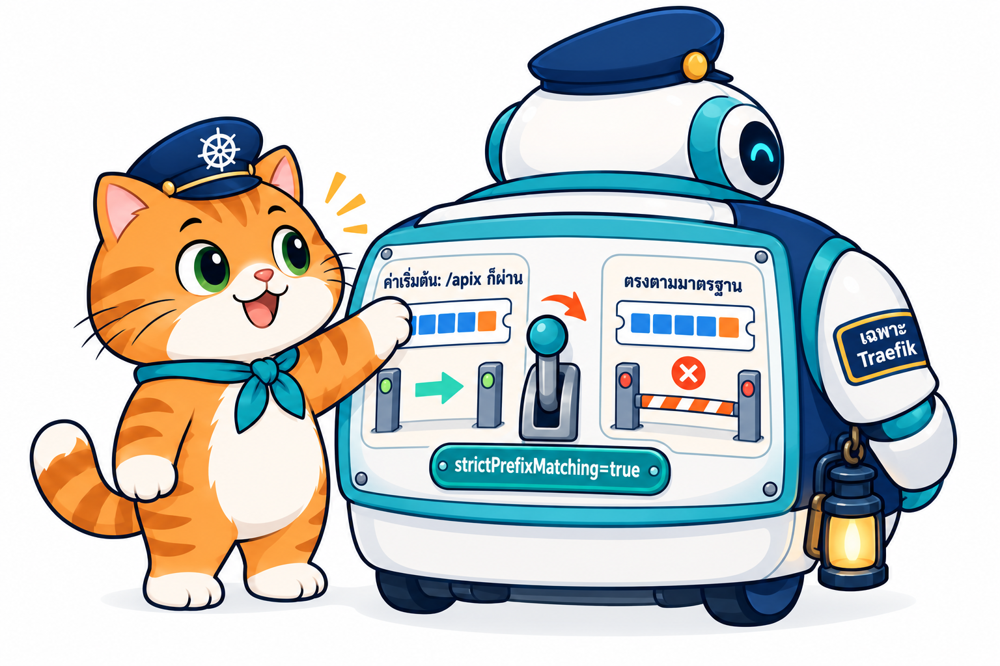<br>
  <em><b>รูปที่ 30</b> ข้อควรรู้เฉพาะ Traefik: ค่าเริ่มต้นเทียบ Prefix แบบตัวอักษร (/api ตรง /apix ด้วย) ต้องเปิด --providers.kubernetesingress.strictPrefixMatching=true จึงตรงมาตรฐาน</em>
</p>

**ค่าเริ่มต้นของ Traefik เทียบ Prefix แบบตัวอักษร ไม่ตรงมาตรฐาน** ผลจริงเมื่อปิด `strictPrefixMatching` (LAB 5)

| path | strict=true (ไฟล์ของบท) | strict=false (ค่าเริ่มต้น Traefik) |
|---|---|---|
| `/apix` | 404 | **200 api** |
| `/docs` | 200 admin | **404** |
| `/implx` | 404 | **200 admin** |

rule ที่ Traefik สร้างก็ต่างกันให้เห็นใน dashboard

```text
strict=true : Host("paths.localhost") && (Path("/api") || PathPrefix("/api/"))
strict=false: Host("paths.localhost") && PathPrefix("/api")
```

บทนี้จึงใส่ `--providers.kubernetesingress.strictPrefixMatching=true` ไว้ใน `00-traefik.yaml` บทเรียนสำคัญคือ **มาตรฐานเขียนไว้อย่างหนึ่ง แต่ controller แต่ละตัวอาจทำต่างออกไป** ต้องทดสอบกับ controller จริงเสมอ (ingress-nginx ก็มีพฤติกรรมเฉพาะแบบนี้หลายเรื่อง ดูบทความ "Before You Migrate" ในหัวข้อ 5)

---

## 11. defaultBackend และการอ่านรหัส 404 503 502

### 11.1 ไม่ตรงกฎใด และโต๊ะของหาย

<p align="center" id="fig-31">
  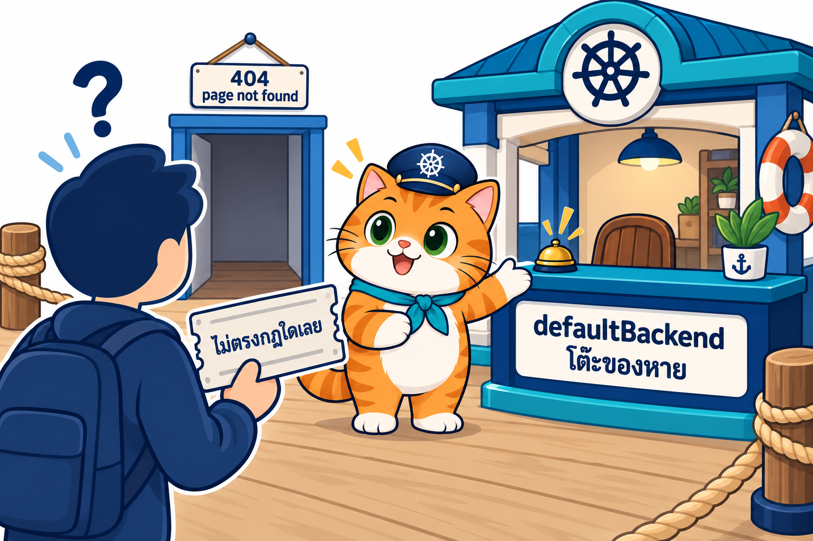<br>
  <em><b>รูปที่ 31</b> ไม่ตรงกฎใดเลย → controller ตอบ 404 page not found; ถ้าตั้ง spec.defaultBackend จะส่งไปโต๊ะของหายแทน (ใน Traefik เป็น catch-all ของทั้งคลัสเตอร์)</em>
</p>

คำขอที่ไม่ตรงกฎใดเลย (ชื่อไม่มีป้ายรับ, ไม่มี `Host`, path ไม่ตรง) จะได้ **`404 page not found` ของ controller** (ข้อความนี้มาจาก Traefik ไม่ใช่จากแอป) ถ้าอยากให้ไปที่หน้าอื่นแทนใช้ `spec.defaultBackend`

```yaml
# lab06-debug/lost.yaml
spec:
  defaultBackend:
    service: {name: admin, port: {number: 80}}
```

มาตรฐานกำหนดว่า `defaultBackend` รับคำขอที่ไม่ตรงกฎใดของ **ป้ายแผ่นนั้น** แต่ใน Traefik ป้ายที่มีแค่ `defaultBackend` (HOSTS เป็น `*`) **กลายเป็น catch-all ของทั้ง controller** ผลจริงใน LAB 6

```text
NAME   CLASS     HOSTS   ADDRESS     PORTS   AGE
lost   traefik   *       localhost   80      3s
other.localhost  -> Name: admin
typo.localhost   -> Name: admin
wrong.localhost  -> Name: admin
(ไม่มี Host) -> Name: admin
```

ทุกชื่อที่ไม่มีป้ายรับในทุก namespace ไหลไปที่ admin รวมถึงป้าย `typo` ที่ backend หาไม่เจอและป้าย class ผิด จึงต้องลบ `lost.yaml` ทันทีหลังทดลอง ส่วนกฎที่ตรงแต่ Service ไม่มี Pod พร้อม **ยังได้ 503 ไม่ไหลไป defaultBackend** (ผลจริง `shop.localhost (menu=0) -> 503`) เพราะ flag `allowEmptyServices=true` ของบท

### 11.2 อ่านรหัสให้ออก

<p align="center" id="fig-32">
  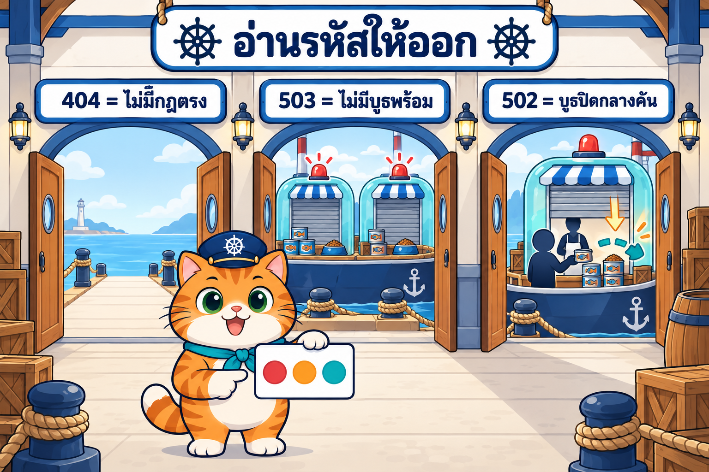<br>
  <em><b>รูปที่ 32</b> อ่านรหัสให้ออก: 404 = ไม่มีกฎตรง, 503 = มีกฎแต่ไม่มี Pod พร้อม (no available server), 502 = Pod ปิดกลางคันระหว่างตอบ</em>
</p>

| รหัส | ความหมายเมื่อมาจาก controller | ผลจริงในบทนี้ | ไล่ต่อที่ |
|---|---|---|---|
| **404** `404 page not found` | **ไม่มีกฎตรง** (ชื่อ/path ไม่ตรง, class ผิด, backend หา Service/port ไม่เจอ) | `other.localhost`, `wrong.localhost` (class nginx), `typo.localhost` (`menuu`), `/port` (port 8080) | `kubectl get ing` (CLASS/HOSTS/ADDRESS), `describe ing`, log `ERR` ของ controller |
| **503** `no available server` | มีกฎตรง แต่ **ไม่มี Pod Ready** ใน EndpointSlice | `kubectl scale deploy menu --replicas=0` → `HTTP/1.1 503 Service Unavailable` | `kubectl get endpointslice`, readinessProbe, `get pod` |
| **502** `Bad Gateway` | ส่งไปถึง Pod แล้วแต่ **Pod ปิด/ตัดการเชื่อมต่อกลางคัน** | rolling update แบบไม่มี readiness/preStop (หัวข้อ 17) | preStop, readinessProbe, `maxUnavailable` |
| **401** | ด่านตรวจบัตรของ controller ปฏิเสธ | basicAuth ไม่มีบัตร/บัตรผิด (หัวข้อ 14) | Secret ของบัตร |
| **301** | controller ส่งต่อ (redirect) | HTTP → HTTPS (หัวข้อ 13) | ดู header `Location` |

ข้อควรรู้เฉพาะ Traefik: ค่าเริ่มต้นของ Traefik **ตัด router ของ Service ที่ไม่มี endpoint ทิ้ง** ทำให้ได้ 404 แทน 503 (แยกไม่ออกกับ "ไม่มีกฎ") บทนี้ใส่ `--providers.kubernetesingress.allowEmptyServices=true` เพื่อให้ได้ 503 ตามความหมายที่ถูกต้อง access log แสดงชื่อ router ที่ตอบ 503 ชัดเจน

```text
172.19.0.2 - - [05/Oct/2026:13:14:18 +0000] "GET / HTTP/1.1" 503 20 "-" "-" 7 "ingress-demo-shop-shop-localhost@kubernetes" "-" 0ms
```

---

## 12. TLS ที่ Ingress: ประตูกระจกนิรภัย

### 12.1 TLS termination

<p align="center" id="fig-33">
  <br>
  <em><b>รูปที่ 33</b> TLS termination: spec.tls ชี้ Secret som-tls (kubernetes.io/tls จากบท 011) controller ถอดรหัสที่ประตู แล้วส่ง HTTP ธรรมดาเข้าเคาน์เตอร์ พร้อม X-Forwarded-Proto: https</em>
</p>

ในบทที่ 11 nginx ใน Pod `som-https` เป็นคนถือใบรับรอง ใน Ingress ใบรับรองย้ายไปอยู่ที่ **ประตู** controller ถอดรหัส HTTPS แล้วส่ง HTTP ธรรมดาเข้าไปหาแอป (**TLS termination**) แอปไม่ต้องรู้เรื่องใบรับรองเลย ไฟล์ `lab07-tls/ingress-tls.yaml`

```yaml
spec:
  ingressClassName: traefik
  tls:
    - hosts: [shop.localhost]       # ชื่อใน hosts ต้องอยู่ใน subjectAltName ของใบรับรอง
      secretName: som-tls
  rules:
    - host: shop.localhost
      # http.paths เหมือนไฟล์ของ LAB 3 (/ → menu, /api → api, /admin → admin)
```

- Secret ต้องเป็นชนิด **`kubernetes.io/tls`** (key `tls.crt` + `tls.key`) แบบเดียวกับบทที่ 11 และต้องอยู่ **namespace เดียวกับ Ingress**
- ชื่อใน `tls[].hosts` ควรตรงกับ `rules[].host`
- มาตรฐานรองรับ TLS ที่พอร์ต 443 ของประตู (บน kind คือ NodePort 30081 ของ entrypoint `websecure`)

ผลจริง: แอปได้รับ HTTP แต่รู้ว่าลูกค้าใช้ HTTPS ผ่าน header

```text
$ curl -sk https://shop.localhost:30081/ | grep -E '^Name|^Host|X-Forwarded-(Proto|Port)'
Name: menu
Host: shop.localhost:30081
X-Forwarded-Port: 30081
X-Forwarded-Proto: https
$ kubectl -n ingress-demo describe ing shop | grep -A2 TLS
TLS:
  som-tls terminates shop.localhost
```

ทดสอบด้วย curl ได้สามแบบ (ผลจริง LAB 7)

| คำสั่ง | ผล | ความหมาย |
|---|---|---|
| `curl -sS https://shop.localhost:30081/` | `curl: (60) SSL certificate problem: self-signed certificate` `rc=60` | ตรวจใบรับรองแล้วไม่เชื่อ เพราะเป็น self-signed |
| `curl -s --cacert tls.crt https://shop.localhost:30081/` | `Name: menu` `rc=0` | บอกให้เชื่อใบนี้ แล้ว **ตรวจจริง** ทั้งลายเซ็นและชื่อ |
| `curl -sk https://shop.localhost:30081/` | `Name: menu` | ข้ามการตรวจทั้งหมด (ใช้ทดสอบเท่านั้น) |

> **ข้อควรรู้เฉพาะ Traefik:** ต้องเปิด `--entryPoints.websecure.http.tls=true` ให้ router บนประตู HTTPS เป็น TLS ผลจริงเมื่อปิด flag: Traefik ยังส่งใบรับรองของร้าน (`subject=CN = shop.localhost`) แต่คำขอได้ **`HTTP/2 404`** `404 page not found` ทั้งที่ใบรับรองถูก (ทางเลือกอื่นคือใส่ annotation `traefik.ingress.kubernetes.io/router.tls: "true"` ทุกป้าย ซึ่งบทนี้ไม่ใช้)

### 12.2 SNI: บอกชื่อก่อนเปิดประตู

<p align="center" id="fig-34">
  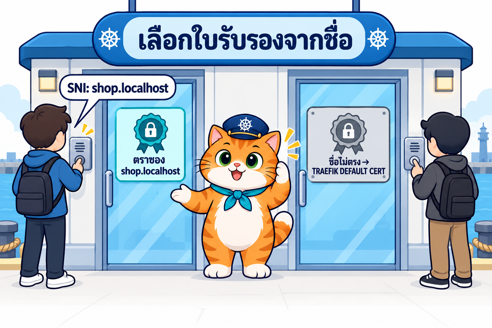<br>
  <em><b>รูปที่ 34</b> SNI: ลูกค้าบอกชื่อก่อนเปิดประตู controller เลือกใบรับรองตามชื่อ — ชื่อที่ไม่มีใน spec.tls ได้ใบสำรอง TRAEFIK DEFAULT CERT</em>
</p>

ประตู HTTPS บานเดียวมีใบรับรองหลายใบได้ ลูกค้าบอกชื่อที่ต้องการในขั้น TLS handshake ด้วย **SNI (Server Name Indication)** ก่อนส่งคำขอ HTTP controller จึงเลือกใบได้ถูก ผลจริงด้วย `openssl s_client`

```text
$ echo | openssl s_client -connect localhost:30081 -servername shop.localhost 2>/dev/null | grep -E '^subject|^issuer'
subject=CN = shop.localhost
issuer=CN = shop.localhost
$ echo | openssl s_client -connect localhost:30081 -servername other.localhost 2>/dev/null | grep -E '^subject|^issuer'
subject=CN = TRAEFIK DEFAULT CERT
issuer=CN = TRAEFIK DEFAULT CERT
```

ชื่อที่ไม่มีใน `spec.tls` ของป้ายใดได้ **ใบสำรอง `TRAEFIK DEFAULT CERT`** ที่ Traefik สร้างเอง ป้ายที่ไม่มี `spec.tls` (เช่น `paths.localhost`) ก็ยังตอบบน HTTPS ได้ด้วยใบสำรองนี้ (`curl -sk https://paths.localhost:30081/menu` ได้ `Name: menu` แต่ `--cacert tls.crt` ได้ `rc=60`)

### 12.3 ใบเดียวหลายชื่อด้วย subjectAltName

<p align="center" id="fig-35">
  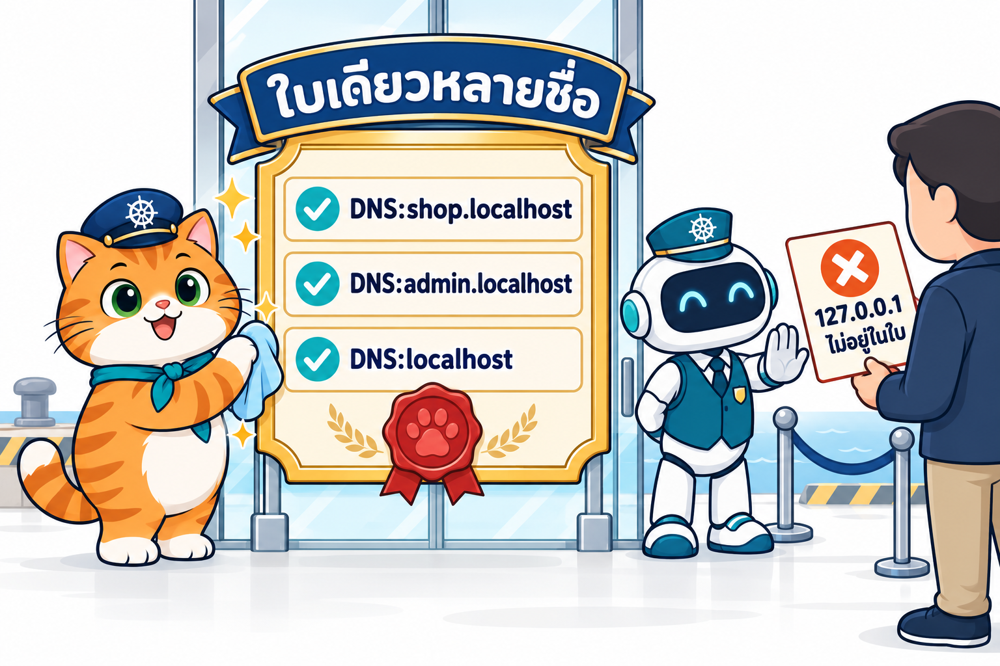<br>
  <em><b>รูปที่ 35</b> ใบรับรองใบเดียวใส่ได้หลายชื่อใน subjectAltName (shop.localhost, admin.localhost, localhost) — เรียกด้วย 127.0.0.1 จะได้ curl: (60) เพราะไม่อยู่ในใบ</em>
</p>

ใบรับรองของ LAB ใส่หลายชื่อใน **subjectAltName (SAN)** เพื่อใช้ใบเดียวกับทั้ง shop และ admin

```bash
openssl req -x509 -nodes -newkey rsa:2048 -days 365 -keyout tls.key -out tls.crt -subj '/CN=shop.localhost' -addext 'subjectAltName=DNS:shop.localhost,DNS:admin.localhost,DNS:localhost'
```

```text
subject=CN = shop.localhost
X509v3 Subject Alternative Name:
    DNS:shop.localhost, DNS:admin.localhost, DNS:localhost
```

- client สมัยใหม่ตรวจชื่อจาก SAN (ไม่ใช่ CN) เรียกด้วยชื่อที่ไม่อยู่ในใบ เช่น `https://127.0.0.1:30081` จึงได้ `curl: (60)` แม้ใส่ `--cacert`
- ใบเดิมของบทที่ 11 (`CN = shop.som.local`, SAN `shop.som.local`, `localhost`) ใช้กับ `shop.localhost` ไม่ได้ LAB 10 จึงออกใบใหม่
- ไม่ควรใช้ใบ wildcard `*.localhost` เพราะ browser ส่วนใหญ่ไม่ยอมรับ wildcard ที่อยู่ติดชื่อระดับบนสุด ใส่ชื่อทีละชื่อใน SAN ชัดเจนกว่า
- browser จะเตือน `NET::ERR_CERT_AUTHORITY_INVALID` เพราะใบไม่ได้ออกโดย CA ที่เครื่องเชื่อถือ (ใน LAB กด Advanced → Proceed ได้) งานจริงใช้ใบจาก CA เช่น Let's Encrypt โดยมี **cert-manager** ออกและต่ออายุให้อัตโนมัติแล้วเก็บเป็น Secret ชนิดเดียวกันนี้ (ไม่ติดตั้งในบทนี้)

---

## 13. Redirect HTTP ไป HTTPS

### 13.1 ส่งลูกค้าจากประตูไม้ไปประตูกระจก

<p align="center" id="fig-36">
  <br>
  <em><b>รูปที่ 36</b> ลูกค้าที่เข้าประตูไม้ (HTTP) ถูกส่งต่อด้วย 301 ไปประตูกระจก (HTTPS) — Location ต้องเป็นพอร์ตที่ลูกค้าเห็นจริง</em>
</p>

เมื่อมี HTTPS แล้วควรส่งลูกค้าที่เข้า HTTP ไปที่ HTTPS เสมอ ด้วยรหัส **301 Moved Permanently** (หรือ 308 ที่บังคับใช้ method เดิม) พร้อม header `Location` บอกที่อยู่ใหม่ **Ingress มาตรฐานไม่มีฟิลด์สำหรับ redirect** ต้องใช้ความสามารถของ controller ใน Traefik คือ Middleware `redirectScheme` (ไฟล์ `lab08-middleware/redirect.yaml`)

```yaml
apiVersion: traefik.io/v1alpha1
kind: Middleware
metadata:
  name: redirect-https
  namespace: ingress-demo
spec:
  redirectScheme:
    scheme: https
    port: "30081"        # ต้องบอกพอร์ต HTTPS ของ NodePort เอง (เป็นข้อความ มี "...")
    permanent: true      # 301 (false = 302)
```

แล้วผูกกับป้ายด้วย annotation `traefik.ingress.kubernetes.io/router.middlewares: ingress-demo-redirect-https@kubernetescrd` ผลจริง

```text
$ curl -si 'http://shop.localhost:30080/menu?x=1' | grep -iE '^HTTP|^location'
HTTP/1.1 301 Moved Permanently
Location: https://shop.localhost:30081/menu?x=1
$ curl -sk -o /dev/null -w '%{http_code}\n' 'https://shop.localhost:30081/menu?x=1'
200
```

redirect เก็บ path และ query เดิม (`/menu?x=1`) และบน HTTPS คำขอผ่านด่านนี้โดยไม่ถูก redirect ซ้ำ (200) ป้ายแผ่นอื่นที่ไม่ได้ผูก Middleware (`admin.localhost` ใน LAB 8 ขั้นที่ 1, `paths.localhost`) ยังตอบ HTTP 200 ตามปกติ เพราะ Middleware ทำงานเฉพาะป้ายที่อ้างถึง

**HSTS** (header `Strict-Transport-Security`) บอก browser ให้ใช้ HTTPS กับชื่อนี้เสมอโดยไม่ต้องรอ redirect ทำได้ด้วย Middleware `headers` ของ Traefik ไม่ใช้ในบทนี้เพราะใบรับรองเป็น self-signed และชื่อเป็น `localhost` (ตั้ง HSTS ผิดจะทำให้ browser เปิดชื่อนั้นแบบ HTTP ไม่ได้อีกนาน)

### 13.2 กับดักพอร์ตบน kind

<p align="center" id="fig-37">
  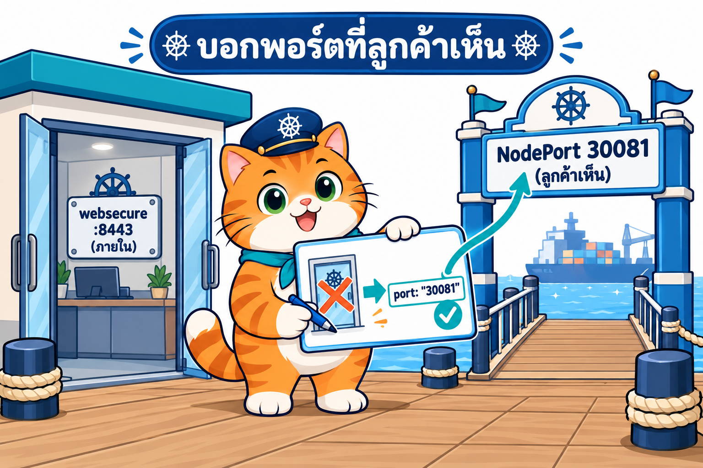<br>
  <em><b>รูปที่ 37</b> ข้อควรระวังบน kind: entrypoint websecure ฟังที่ :8443 ภายใน แต่ลูกค้าเห็น NodePort 30081 จึงต้องกำหนด port: &quot;30081&quot; ใน Middleware redirectScheme</em>
</p>

entrypoint `websecure` ฟังที่ `:8443` ภายใน Pod แต่ลูกค้าเห็นเป็น NodePort `30081` ถ้าไม่บอกพอร์ต Middleware จะชี้ไปพอร์ตมาตรฐาน 443 ผลจริงเมื่อ apply `lab08-middleware/redirect-noport.yaml`

```text
$ curl -si 'http://shop.localhost:30080/menu?x=1' | grep -iE '^HTTP|^location'
HTTP/1.1 301 Moved Permanently
Location: https://shop.localhost/menu?x=1
$ curl -skL -o /dev/null -w '%{http_code} %{url_effective}\n' 'http://shop.localhost:30080/menu?x=1'; echo "rc=$?"
301 https://shop.localhost/menu?x=1
rc=7
```

`Location` ไม่มีพอร์ต = 443 ซึ่งไม่มีใครฟังใน `k8s-lab` curl ต่อไม่ได้ (`rc=7`) และ browser จะขึ้นว่าเชื่อมต่อไม่ได้ จึงต้องใส่ `port: "30081"` เสมอในสภาพแวดล้อมนี้

`redirectScheme` ตัดสินจาก scheme และพอร์ตใน `Host` ถ้าคำขอ HTTPS มาด้วย `Host` ที่พอร์ตไม่ตรง `30081` (เช่น `-H 'Host: shop.localhost'` หรือ tunnel ผ่านพอร์ตอื่น) ก็จะถูก redirect กลับไป `:30081` ทุกครั้ง ดังนั้นต้องเปิดร้านด้วยพอร์ต 30080/30081 ตรงตามที่ตั้งไว้

---

## 14. มาตรฐานกับความสามารถเฉพาะ controller: annotation และ Middleware

### 14.1 แยกให้ชัดว่าอะไรพกพาได้

<p align="center" id="fig-38">
  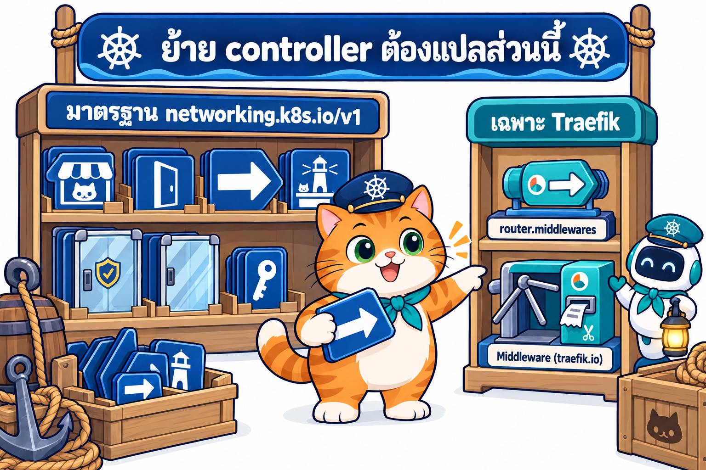<br>
  <em><b>รูปที่ 38</b> แยกให้ชัด: rules/host/path/tls/IngressClass เป็นมาตรฐาน ใช้ได้ทุก controller ส่วน annotation traefik.ingress.kubernetes.io/router.middlewares และ Middleware (traefik.io) เป็นของ Traefik เท่านั้น</em>
</p>

| มาตรฐาน (ใช้ได้กับทุก controller) | เฉพาะ Traefik (ใช้ในบทนี้) |
|---|---|
| Ingress `networking.k8s.io/v1`: `rules[].host`, `http.paths[].path/pathType`, `backend.service.name/port.number\|name`, `defaultBackend`, `tls[].hosts/secretName` | annotation `traefik.ingress.kubernetes.io/router.middlewares: <ns>-<name>@kubernetescrd` (และ `router.entrypoints`, `router.tls`) |
| `IngressClass` + `ingressclass.kubernetes.io/is-default-class` | CRD `Middleware` (`traefik.io/v1alpha1`): `redirectScheme`, `basicAuth`, `stripPrefix`, `rateLimit` ฯลฯ |
| Secret `kubernetes.io/tls`, `kubernetes.io/basic-auth` | flag ของ controller: `--providers.kubernetesingress.strictPrefixMatching`, `allowEmptyServices`, `--entryPoints.websecure.http.tls`, `ingressendpoint.hostname` |
| Gateway API (`GatewayClass`/`Gateway`/`HTTPRoute`) | `IngressRoute`/`TraefikService` (CRD ของ Traefik ไม่สอนในบทนี้) |

ถ้าวันหนึ่งย้ายไป controller อื่น ส่วนซ้ายใช้ต่อได้ทันที ส่วนขวาต้องเขียนใหม่ทั้งหมด (ingress-nginx เคยใช้ annotation `nginx.ingress.kubernetes.io/...` จำนวนมาก ซึ่งเป็นสาเหตุที่การย้ายยาก) Traefik ยังมี provider `kubernetesIngressNginx` ที่อ่าน annotation บางส่วนของ ingress-nginx เพื่อช่วยย้าย (กล่าวถึงเท่านั้น)

### 14.2 Middleware เป็นด่านเรียงตามลำดับ

<p align="center" id="fig-39">
  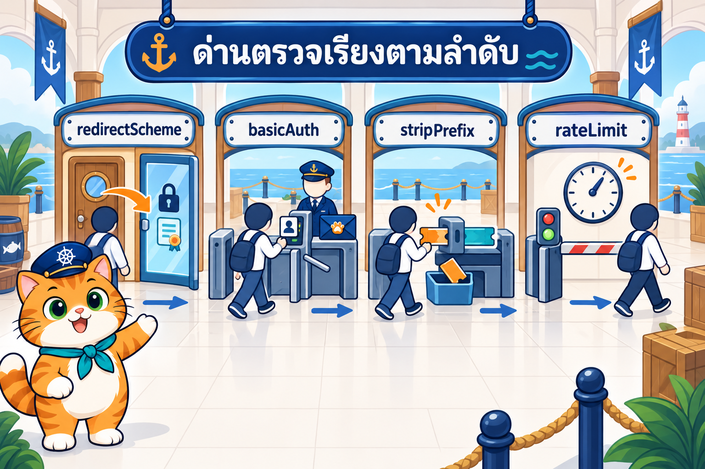<br>
  <em><b>รูปที่ 39</b> Middleware ของ Traefik เป็นด่านเรียงตามลำดับใน annotation: redirectScheme, basicAuth, stripPrefix, rateLimit ฯลฯ</em>
</p>

Middleware ของ Traefik เป็น CRD ใน namespace เดียวกับป้าย ป้ายเรียกใช้ด้วย annotation ชื่อเต็ม `<namespace>-<ชื่อ Middleware>@kubernetescrd` หลายตัวคั่นด้วย `,` และ **ลำดับใน annotation = ลำดับด่าน** ตัวอย่างป้าย `shop-admin` ใน `lab08-middleware/strip.yaml`

```yaml
metadata:
  annotations:
    traefik.ingress.kubernetes.io/router.middlewares: ingress-demo-redirect-https@kubernetescrd,ingress-demo-admin-auth@kubernetescrd,ingress-demo-strip-admin@kubernetescrd
```

ผลจริงจาก API ของ dashboard

```text
websecure-ingress-demo-shop-admin-shop-localhost-admin | ['ingress-demo-redirect-https@kubernetescrd', 'ingress-demo-admin-auth@kubernetescrd', 'ingress-demo-strip-admin@kubernetescrd']
websecure-ingress-demo-shop-shop-localhost-api | ['ingress-demo-redirect-https@kubernetescrd']
```

ลำดับมีผลจริง: redirect ก่อนตรวจบัตร ทำให้ HTTP ได้ 301 ไป HTTPS ก่อนแล้วจึงถามรหัส (รหัสไม่ถูกส่งผ่าน HTTP ที่ไม่เข้ารหัส) Middleware ที่มีให้เลือกยังมีอีกมาก เช่น `rateLimit` (จำกัดจำนวนคำขอต่อวินาที), `headers` (เติม/ลบ header, HSTS), `replacePathRegex` (เขียน path ใหม่ด้วย regex), `ipAllowList` (อนุญาตเฉพาะ IP)

### 14.3 basicAuth: ไม้กั้นตรวจบัตรจาก Secret ของบทที่ 11

<p align="center" id="fig-40">
  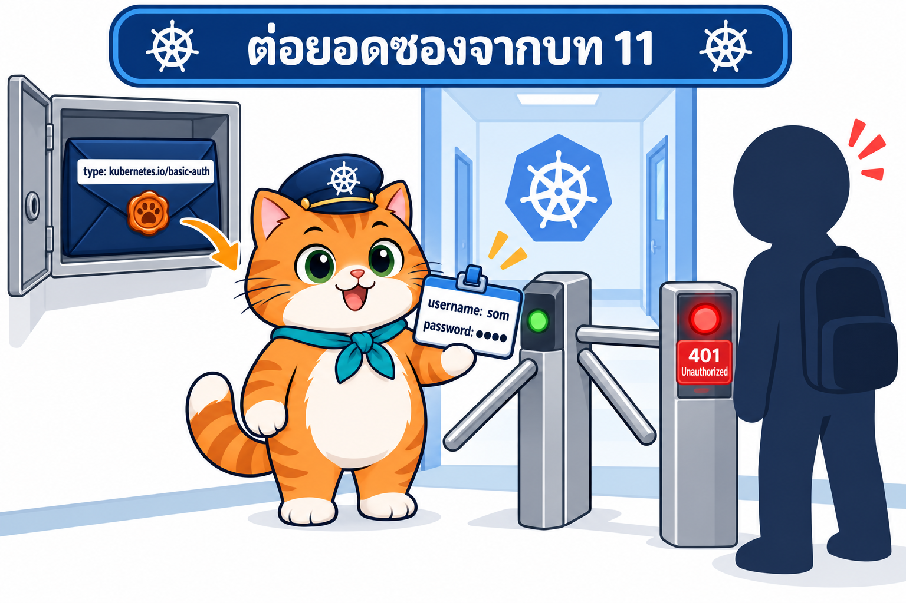<br>
  <em><b>รูปที่ 40</b> basicAuth อ่าน Secret type kubernetes.io/basic-auth (ต่อยอดบท 011) ไม่มีบัตร → 401 + WWW-Authenticate; บัตรถูก → 200</em>
</p>

Secret ชนิด `kubernetes.io/basic-auth` (บทที่ 11) ต้องมี key `username` และ `password` เป็นข้อความธรรมดา Traefik อ่านได้ตรง ๆ ไม่ต้องทำไฟล์ htpasswd

```bash
kubectl -n ingress-demo create secret generic admin-auth --type=kubernetes.io/basic-auth --from-literal=username=som --from-literal=password=meow-admin-123
```

```yaml
# lab08-middleware/admin-auth.yaml (ส่วน Middleware)
apiVersion: traefik.io/v1alpha1
kind: Middleware
metadata:
  name: admin-auth
  namespace: ingress-demo
spec:
  basicAuth:
    secret: admin-auth
    removeHeader: true   # ตัด header Authorization ออกก่อนส่งให้แอป
```

ผลจริง (รหัส `meow-admin-123` เป็นค่าตัวอย่างเพื่อการเรียนเท่านั้น)

```text
$ curl -ski https://admin.localhost:30081/ | grep -iE '^HTTP|^www-auth|401'
HTTP/2 401
www-authenticate: Basic realm="traefik"
401 Unauthorized
$ curl -sk -o /dev/null -w '%{http_code}\n' -u som:wrong https://admin.localhost:30081/
401
$ curl -sk -o /dev/null -w '%{http_code}\n' -u som:meow-admin-123 https://admin.localhost:30081/
200
$ curl -sk -u som:meow-admin-123 https://admin.localhost:30081/ | grep -c '^Authorization'
0
```

- ไม่มีบัตรหรือบัตรผิดได้ **401** พร้อม `www-authenticate` ที่ทำให้ browser ขึ้นกล่อง login
- `removeHeader: true` ทำให้แอปหลังร้านไม่เห็น header `Authorization` (นับได้ 0) แอปไม่ต้องรู้รหัสเลย
- Basic auth ส่งรหัสแบบ base64 (ไม่ใช่การเข้ารหัส เหมือนบทที่ 11) **ต้องใช้คู่กับ HTTPS เสมอ** — ป้ายหลังร้านจึงมี redirect ก่อน

### 14.4 stripPrefix: เครื่องตัดตั๋ว

<p align="center" id="fig-41">
  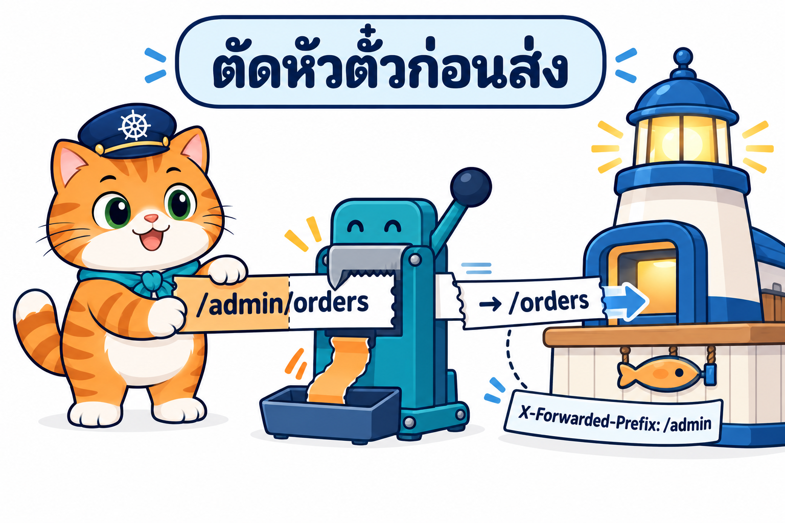<br>
  <em><b>รูปที่ 41</b> stripPrefix ตัด /admin ออกก่อนส่งให้แอปหลังร้าน: /admin/orders → /orders และส่ง X-Forwarded-Prefix: /admin บอกต้นทาง</em>
</p>

ถ้าแอปหลังร้านถูกเขียนให้อยู่ที่ `/` แต่เราอยากเปิดที่ `shop.localhost/admin/...` ใช้ Middleware `stripPrefix` ตัดคำนำหน้าออกก่อนส่ง

```yaml
apiVersion: traefik.io/v1alpha1
kind: Middleware
metadata:
  name: strip-admin
  namespace: ingress-demo
spec:
  stripPrefix:
    prefixes: [/admin]
```

ผลจริง (ป้าย `shop-admin` = redirect → ตรวจบัตร → ตัด `/admin`)

```text
$ curl -sk -o /dev/null -w '%{http_code}\n' https://shop.localhost:30081/admin/orders
401
$ curl -sk -u som:meow-admin-123 https://shop.localhost:30081/admin/orders | grep -E '^Name|^GET|X-Forwarded-Prefix'
Name: admin
GET /orders HTTP/1.1
X-Forwarded-Prefix: /admin
$ curl -sk https://shop.localhost:30081/adminx | grep -E '^Name|^GET'
Name: menu
GET /adminx HTTP/1.1
```

แอปเห็น `GET /orders` และรู้คำนำหน้าเดิมจาก `X-Forwarded-Prefix: /admin` (ใช้สร้างลิงก์ให้ถูก) ส่วน `/adminx` ไม่เข้ากฎ `/admin` (Prefix ทีละท่อน) จึงไปที่ menu ของป้าย `shop`

> **ทำไมแยกป้าย `shop-admin`:** annotation `router.middlewares` ผูกกับ **ป้ายทั้งแผ่น** (ทุก path ในป้ายนั้น) ถ้าอยากให้ด่านตรวจบัตรมีแค่ที่ `/admin` ต้องแยก `/admin` ไปเป็น Ingress อีกแผ่นที่ชื่อ host เดียวกัน Traefik รวมกฎของทุกแผ่นที่ชื่อเดียวกันให้เอง

---
## 15. Traefik บน kind: entrypoint, NodePort และลำดับติดตั้ง

### 15.1 เส้นทางจริงใน LAB

<p align="center" id="fig-42">
  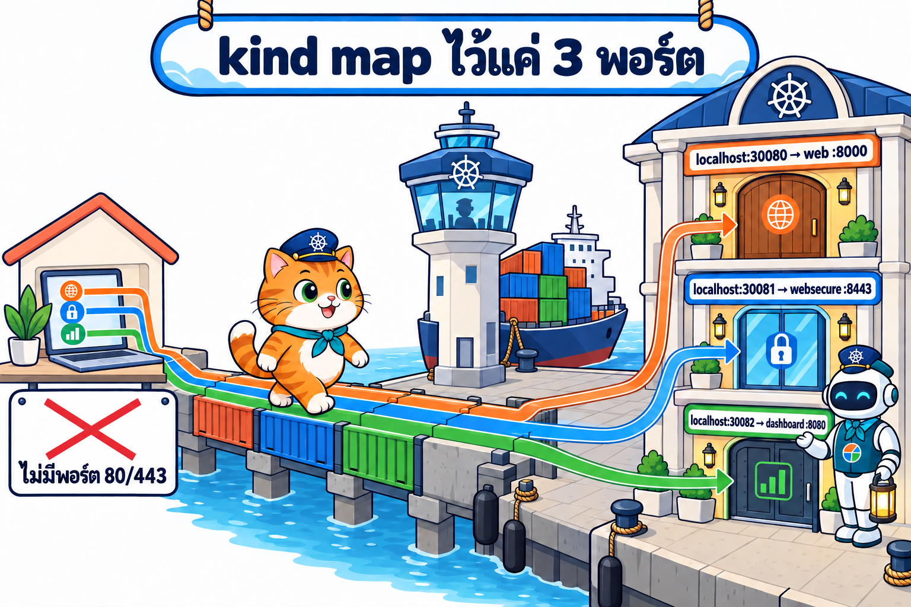<br>
  <em><b>รูปที่ 42</b> เส้นทางจริงใน LAB: เครื่องนักศึกษา localhost:30080/30081/30082 → container k8s-lab → lab-control-plane → Service traefik → Pod traefik (:8000/:8443/:8080) — ไม่มีพอร์ต 80/443</em>
</p>

คำขอจาก browser ของนักศึกษาเดินทางหลายชั้น

```text
browser บนเครื่องนักศึกษา  http://shop.localhost:30080
  → container k8s-lab (publish 30080–30082 ไว้ตั้งแต่บทที่ 1)
    → Node lab-control-plane ของ kind (extraPortMappings 30080–30082)
      → Service traefik (NodePort 80:30080, 443:30081, 8080:30082)
        → Pod traefik  entrypoint web :8000 / websecure :8443 / traefik :8080
          → Pod ปลายทาง (IP จาก EndpointSlice)
```

entrypoint คือประตูที่ Traefik ฟังใน container (ผลจริงจาก `/api/entrypoints`: `traefik :8080`, `web :8000`, `websecure :8443`) ใช้พอร์ต 8000/8443 แทน 80/443 เพราะ container รันเป็นผู้ใช้ที่ไม่ใช่ root (uid 65532) ซึ่งเปิดพอร์ตต่ำกว่า 1024 ไม่ได้

**ทำไมไม่มีพอร์ต 80/443:** คลัสเตอร์ `lab` สร้างจาก `kind-lab.yaml` ที่ส่งต่อแค่ 30080–30082 ทางเลือกอย่าง hostPort หรือเพิ่ม `extraPortMappings` 80/443 ต้องสร้างคลัสเตอร์และ container `k8s-lab` ใหม่ทั้งหมด บทนี้จึงใช้ NodePort ที่มีอยู่ ซึ่งเป็นเหตุผลที่ redirect ต้องบอก `port: "30081"` (หัวข้อ 13.2)

| พอร์ตที่นักศึกษาเปิด | entrypoint | ใช้ทำอะไร |
|---|---|---|
| `30080` | `web` (:8000) | HTTP ทุกป้าย |
| `30081` | `websecure` (:8443) | HTTPS ทุกป้าย (เปิด TLS ด้วย `--entryPoints.websecure.http.tls=true`) |
| `30082` | `traefik` (:8080) | dashboard `http://localhost:30082/dashboard/` และ `/ping` (เปิดด้วย `--api.insecure=true` **เฉพาะใน LAB**) |

### 15.2 NodePort ชนกับร้านเดิม

<p align="center" id="fig-43">
  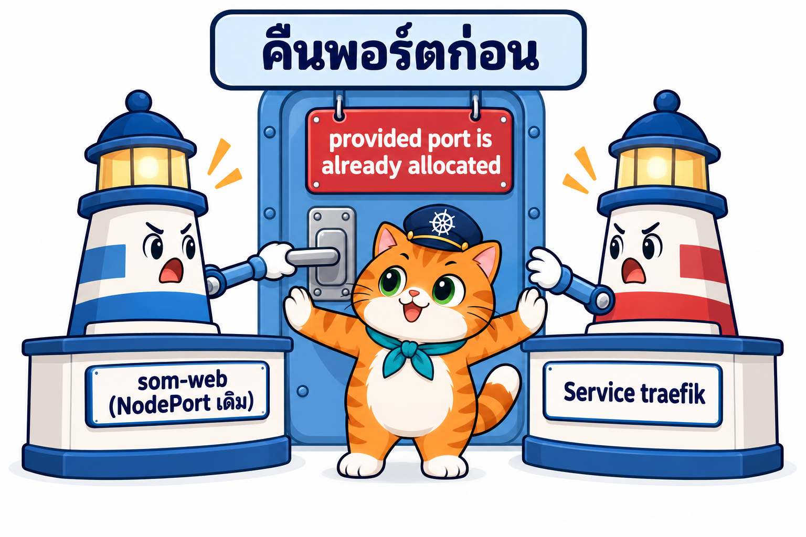<br>
  <em><b>รูปที่ 43</b> NodePort ชนกัน: ถ้า Service ร้านเดิมยังถือ 30080 อยู่ การสร้าง Service traefik จะ error provided port is already allocated ต้องคืนพอร์ตก่อน</em>
</p>

ร้านของบทที่ 11 จองพอร์ต 30080 (`som-web`) และ 30082 (`som-https`) อยู่ ถ้าติดตั้ง Traefik ทับ ผลจริง

```text
$ kubectl apply -f ingress-controller/00-traefik.yaml
namespace/traefik created
serviceaccount/traefik created
clusterrole.rbac.authorization.k8s.io/traefik created
clusterrolebinding.rbac.authorization.k8s.io/traefik created
deployment.apps/traefik created
ingressclass.networking.k8s.io/traefik created
The Service "traefik" is invalid: spec.ports[0].nodePort: Invalid value: 30080: provided port is already allocated
```

ทุกอย่างถูกสร้างยกเว้น Service — Pod Traefik รันได้แต่ **ไม่มีประตู** แก้โดยคืนพอร์ตก่อน (ลบเฉพาะ Service ของร้านเดิม เก็บ Deployment/ฐานข้อมูลไว้) แล้ว apply ซ้ำ จะได้ `service/traefik created` และส่วนอื่น `unchanged` ไม่ต้องลบอะไรทิ้ง ทั้งนี้ `kubectl apply --dry-run=server` ช่วยตรวจล่วงหน้าไม่ได้ เพราะ namespace `traefik` ยังไม่มีจริง (ได้ `namespaces "traefik" not found`)

### 15.3 ลำดับติดตั้ง: CRD ก่อนเสมอ

<p align="center" id="fig-44">
  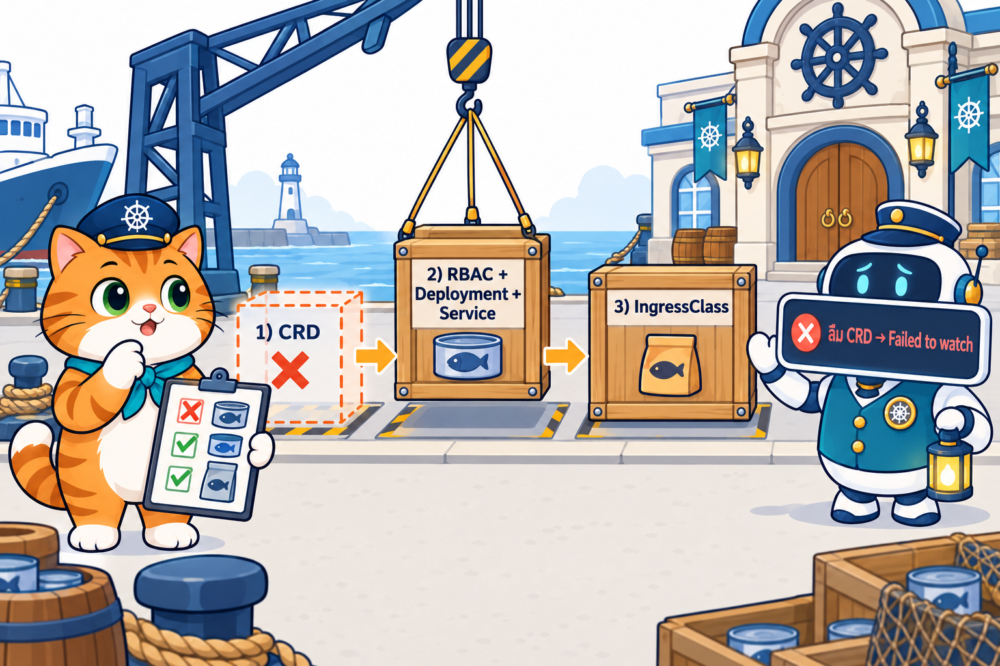<br>
  <em><b>รูปที่ 44</b> ลำดับติดตั้ง: CRD ของ Traefik ก่อน → RBAC + Deployment + Service → IngressClass; ถ้าลืม CRD log จะมี Failed to watch และ Middleware ใช้ไม่ได้</em>
</p>

Traefik อ่าน CRD ของตัวเอง (`Middleware` ฯลฯ ในกลุ่ม `traefik.io`) ผ่าน `--providers.kubernetescrd=true` ลำดับที่ถูกคือ

1. `kubectl apply -f ingress-controller/traefik-crds-v3.7.13.yml` (10 CRD สำเนาจาก tag v3.7.13 ไม่แก้)
2. `kubectl apply -f ingress-controller/00-traefik.yaml` (Namespace → ServiceAccount + ClusterRole/Binding → Deployment → Service NodePort → IngressClass)

ถ้าสลับลำดับ log ของ Traefik จะมี error ซ้ำ ๆ (ผลจริง 40 บรรทัดใน 15 วินาที)

```text
E1005 13:11:32.584200       1 reflector.go:227] "Failed to watch" err="failed to list *v1alpha1.MiddlewareTCP: the server could not find the requested resource (get middlewaretcps.traefik.io)" ...
E1005 13:11:32.584298       1 reflector.go:227] "Failed to watch" err="failed to list *v1alpha1.Middleware: the server could not find the requested resource (get middlewares.traefik.io)" ...
```

apply CRD ตามหลังแล้วบรรทัดใหม่หยุดเพิ่ม (`Failed to watch ก่อน=41 หลัง 30 วิ=41`) แต่ควร `kubectl -n traefik rollout restart deploy/traefik` ให้เริ่มใหม่สะอาด (หลัง restart นับ `ERR` ได้ 0)

**log ที่เห็นทุกครั้งแต่ไม่ใช่ error:** `WRN Traefik can reject some encoded characters ...`, `WRN aliasHeadersStrategy is not configured ...` เป็นคำเตือนเชิงแนะนำของ Traefik v3.7 และทุกครั้งที่ Traefik restart ขณะมีป้ายที่อ้าง Middleware อาจเห็น `ERR ... middleware "...@kubernetescrd" does not exist` สองสามบรรทัดชั่วครู่ (provider ของ Ingress โหลดก่อน CRD) แล้วหายเอง (ผลจริงนับ ERR หลัง 20 วินาทีได้ 0)

**ทำไมไม่ใช้ Helm:** Traefik มี Helm chart ทางการซึ่งเป็นวิธีที่นิยมในงานจริง แต่ Helm เป็นเนื้อหาของบทถัดไป บทนี้จึงติดตั้งด้วย YAML ที่ pin เวอร์ชันชัดเจน และเห็นทุก object ที่ controller ต้องใช้

---

## 16. การ debug Ingress

<p align="center" id="fig-45">
  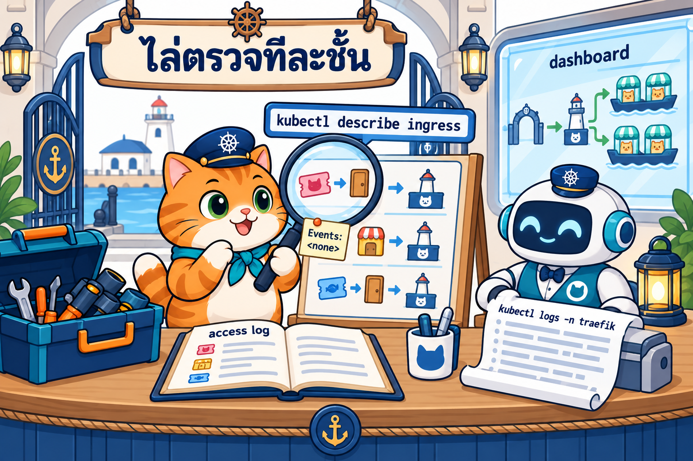<br>
  <em><b>รูปที่ 45</b> เครื่องมือ debug: kubectl describe ingress (ดู backend/endpoint, Events มักเป็น &lt;none&gt;), log ของ controller (ERR), access log ว่า router ไหนตอบรหัสอะไร, dashboard</em>
</p>

ไล่ **จากนอกเข้าใน** ทีละชั้น

| ลำดับ | ตรวจอะไร | คำสั่ง / สิ่งที่ดู | อาการเมื่อพัง |
|:---:|---|---|---|
| 1 | ชื่อแปลงเป็น IP ได้ไหม | `curl -v` ดูบรรทัด `Trying`/`Connected` | `Could not resolve host` → ใช้ `--resolve`/hosts |
| 2 | ประตูเปิดไหม | `kubectl get svc -A \| grep 3008`, `curl -i localhost:30080` | `Connection refused` (ไม่มี Service traefik) |
| 3 | ป้ายมี class ถูกไหม | `kubectl get ing` คอลัมน์ CLASS และ ADDRESS | ADDRESS ว่าง = ไม่มี controller รับ |
| 4 | host/path ตรงไหม | `describe ing` (Rules), dashboard `/api/http/routers` | 404 page not found |
| 5 | backend หาเจอไหม | `describe ing` คอลัมน์ Backends, log `ERR` ของ controller | `<error: services "menuu" not found>`, `()` ว่าง, `service port not found` |
| 6 | มี Pod Ready ไหม | `kubectl get endpointslice -l kubernetes.io/service-name=<svc>`, `get pod` | 503 no available server |
| 7 | Pod ตอบถูกไหม | access log ของ controller, `kubectl logs` ของแอป | 502, 500 จากแอป |

เครื่องมือหลัก

- **`kubectl describe ingress`** แสดง Rules + Backends (IP:พอร์ตของ Pod) แต่ **Events มักเป็น `<none>`** ไม่ได้บอก error ให้เห็นเหมือน Pod
- **log ของ controller** `kubectl -n traefik logs deploy/traefik | grep ERR` (log มีสี ANSI ใช้ `sed 's/\x1b\[[0-9;]*m//g'` ล้างได้)
- **access log** (เปิดด้วย `--accesslog=true`) หนึ่งบรรทัดต่อคำขอ บอก status, ชื่อ router และ IP ของ Pod ที่ตอบ

```text
172.19.0.2 - - [05/Oct/2026:13:13:13 +0000] "GET / HTTP/1.1" 200 433 "-" "-" 15 "ingress-demo-shop-shop-localhost@kubernetes" "http://10.244.1.4:8080" 0ms
```

- **dashboard** `http://localhost:30082/dashboard/` (กระดานแก้ว) และ API `http://localhost:30082/api/http/routers` ที่บอก rule, priority และ middleware ของทุก router

> หลัง `scale` หรือ rollout เสร็จ ให้รอ 2–3 วินาทีก่อนทดสอบ controller ต้องเห็น EndpointSlice ใหม่ก่อน (ในการทดลองพบผลว่างหรือ 503 หนึ่งครั้งเมื่อยิงทันที)

---

## 17. Rolling update ผ่าน Ingress โดยไม่มี error

### 17.1 controller ส่งเฉพาะ Pod ที่ Ready

<p align="center" id="fig-46">
  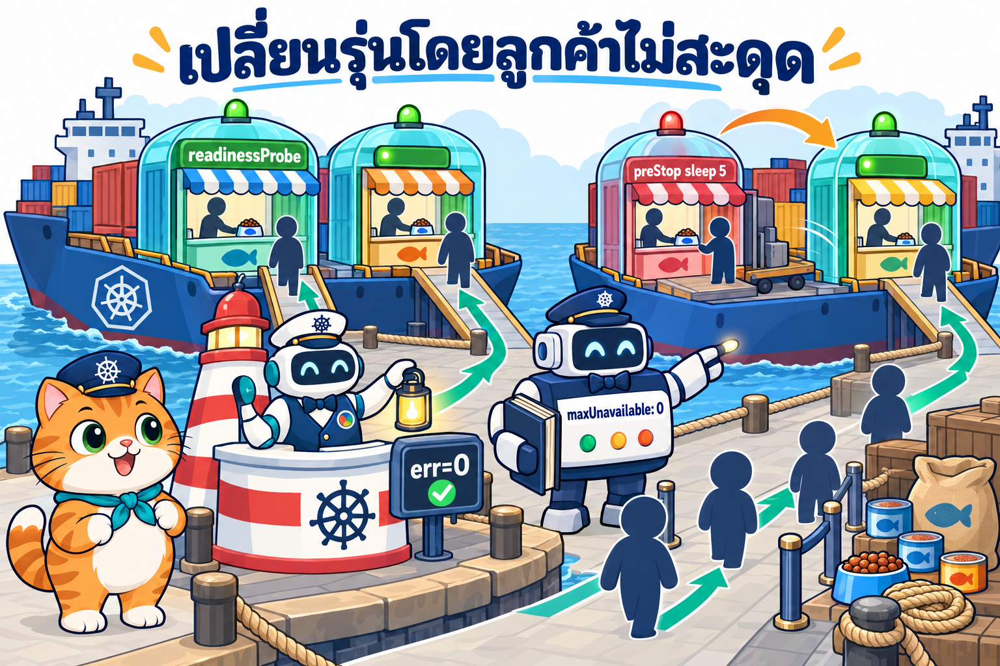<br>
  <em><b>รูปที่ 46</b> Ingress ส่งเฉพาะ Pod ที่ Ready (ตาม EndpointSlice) — readinessProbe + preStop sleep 5 + maxUnavailable: 0 ทำให้เปลี่ยนรุ่นผ่าน Ingress ได้ err=0</em>
</p>

Traefik ส่งคำขอตรงไปยัง IP ของ Pod จาก EndpointSlice ซึ่งมีเฉพาะ Pod ที่ **Ready** ดังนั้นเงื่อนไขที่ทำให้เปลี่ยนรุ่นได้โดยไม่มี error เหมือนบทที่ 7 แต่สำคัญกว่าเดิม

| ส่วน | หน้าที่ | ในไฟล์ของบท |
|---|---|---|
| `readinessProbe` | Pod ใหม่ถูกเพิ่มในรายชื่อเมื่อพร้อมตอบจริง | `httpGet /health` ทุก 2 วินาที (`lab02-first/10-apps.yaml`) |
| `lifecycle.preStop: sleep 5` | Pod ที่ถูกสั่งปิดยังตอบต่อ 5 วินาที ระหว่างที่ controller ลบออกจากรายชื่อ | `sleep: {seconds: 5}` |
| `maxUnavailable: 0` + `maxSurge: 1` | ห้ามบูธที่พร้อมลดลงระหว่างเปลี่ยนรุ่น | `rollingUpdate: {maxSurge: 1, maxUnavailable: 0}` |

ผลจริง LAB 9 (`./lab09-rolling/loop.sh` ยิง HTTPS ผ่าน Ingress 300 ครั้งระหว่างเปลี่ยนรุ่น)

```text
  menu 67
  menu-v2 233
ok=300 err=0 (ใช้เวลา 18.3 วินาที)
```

และ LAB 10 ร้านจริง (`./hit.sh -q` ระหว่าง `set image` 1.5 → 1.6): `ok=300 err=0` (1.5 ×213 / 1.6 ×87)

### 17.2 ถ้าไม่มี readiness/preStop

<p align="center" id="fig-47">
  <br>
  <em><b>รูปที่ 47</b> ถ้าไม่มี readiness/preStop ลูกค้าบางคนถูกพาไปบูธที่กำลังปิด ได้ 502 Bad Gateway ระหว่าง rollout (ทดสอบจริงเจอ err 3–5 ครั้งจาก 300)</em>
</p>

`lab09-rolling/menu-fragile.yaml` ตัด readinessProbe และ preStop ออก และตั้ง `maxUnavailable: 1` ผลจริง `rollout restart` สามรอบ

```text
  menu-fragile 297
  error 000 × 1
  error 502 × 2
ok=297 err=3 (ใช้เวลา 20.3 วินาที)
```

รอบที่สองได้ `ok=295 err=5` (502 × 4, 000 × 1) และรอบที่สาม `ok=297 err=3` (502 × 2, 000 × 1) access log ยืนยันว่า 502 มาจาก router ของร้านที่ส่งไปยัง IP ของ Pod ที่กำลังปิด

```text
172.19.0.2 - - [05/Oct/2026:13:17:32 +0000] "GET / HTTP/2.0" 502 11 "-" "-" 1288 "websecure-ingress-demo-shop-shop-localhost@kubernetes" "http://10.244.1.13:8080" 1ms
```

- **502** = Traefik ส่งไปถึง Pod ที่ปิดไปแล้วหรือปิดกลางคัน (ยังไม่ทันถูกลบจากรายชื่อ)
- **000** = curl ต่อไม่สำเร็จภายในเวลาที่กำหนด
- จำนวนขึ้นกับความเร็วเครื่อง บางรอบอาจเป็น 0 แต่ **ไม่มีอะไรรับประกัน** ส่วนแบบที่มี readiness + preStop ได้ `err=0` ทุกรอบที่ทดลอง

---

## 18. Canary และการแบ่งน้ำหนัก

<p align="center" id="fig-48">
  <br>
  <em><b>รูปที่ 48</b> canary: ปล่อยรุ่นใหม่ให้ลูกค้าส่วนน้อยก่อน (เช่น 90/10) — Ingress มาตรฐานไม่มี weight ต้องใช้ความสามารถเฉพาะ controller หรือ Gateway API</em>
</p>

**canary** คือปล่อยรุ่นใหม่ให้ลูกค้าส่วนน้อยก่อน (เช่น 90/10) ดูผลแล้วค่อยเพิ่ม Ingress มาตรฐาน **ไม่มีฟิลด์ weight** กฎหนึ่งชี้ไป Service เดียว ทางเลือกคือ

| วิธี | หมายเหตุ |
|---|---|
| ใช้ label ให้ Service เดียวครอบคลุม Pod ทั้งสองรุ่น แล้วปรับจำนวน replicas | สัดส่วนหยาบ ขึ้นกับจำนวน Pod |
| annotation canary ของ ingress-nginx (`nginx.ingress.kubernetes.io/canary-weight`) | เฉพาะ ingress-nginx ซึ่งหยุดดูแลแล้ว |
| CRD `TraefikService` (weighted) ของ Traefik | เฉพาะ Traefik |
| **Gateway API** `HTTPRoute` `backendRefs[].weight` | **มาตรฐาน** (LAB เสริมของบทนี้) |

ผลจริงใน LAB เสริม: HTTPRoute ที่ตั้ง weight 90/10 ระหว่าง `som-web` และ `som-admin` ยิง 40 ครั้งได้ **36 : 4** ทั้งสองรอบ (การกระจายเป็นการสุ่ม รอบอื่นอาจได้ใกล้เคียงแต่ไม่เท่านี้)

---

## 19. ข้อจำกัดของ Ingress และ Gateway API

### 19.1 ข้อจำกัดของ Ingress

<p align="center" id="fig-49">
  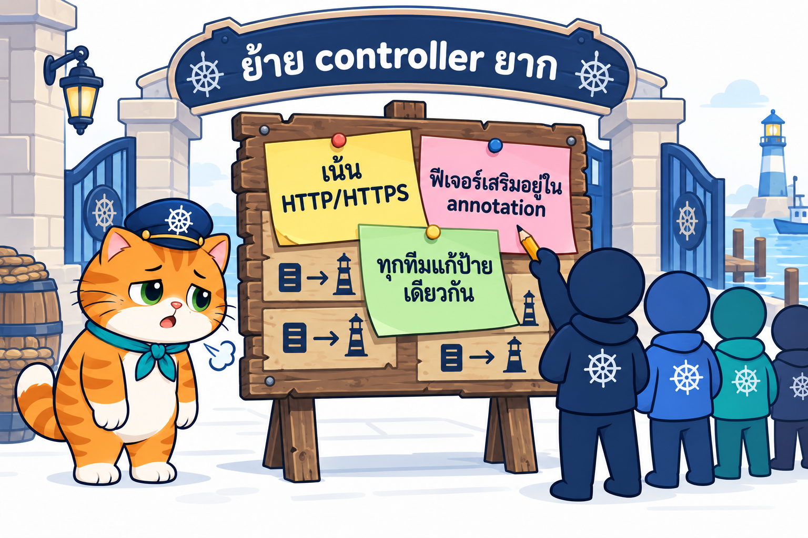<br>
  <em><b>รูปที่ 49</b> ข้อจำกัดของ Ingress: เน้น HTTP/HTTPS, ฟีเจอร์เสริมกระจายอยู่ใน annotation ของแต่ละ controller, ทุกทีมแก้ป้ายเดียวกัน ย้าย controller ยาก</em>
</p>

1. **เน้น HTTP/HTTPS** — TCP/UDP อื่น (เช่น ฐานข้อมูล, gRPC แบบละเอียด) ไม่มีในมาตรฐาน
2. **ฟีเจอร์เสริมกระจายอยู่ใน annotation/CRD ของแต่ละ controller** — redirect, auth, rewrite, weight ไม่มีในมาตรฐาน ย้าย controller ต้องเขียนใหม่ (เห็นชัดในหัวข้อ 14)
3. **ทุกทีมแก้ป้ายแบบเดียวกัน** — ไม่มีการแยกว่าใครคุมประตู (พอร์ต, ใบรับรอง) ใครคุมเส้นทางของร้าน
4. **พฤติกรรมต่างกันระหว่าง controller** แม้ในส่วนมาตรฐาน (pathType ของ Traefik ในหัวข้อ 10.4)
5. API ถูก freeze ไม่มีฟีเจอร์ใหม่

### 19.2 Gateway API: อาคารผู้โดยสารรุ่นใหม่

<p align="center" id="fig-50">
  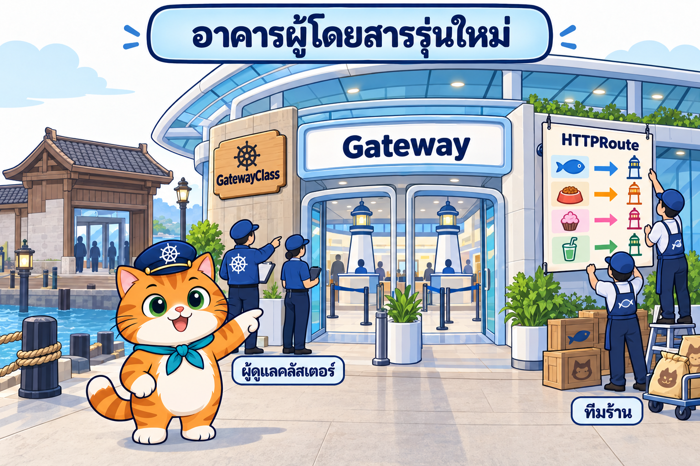<br>
  <em><b>รูปที่ 50</b> Gateway API แยกบทบาท: GatewayClass (บริษัทผู้ให้บริการ), Gateway (อาคาร/ประตูขึ้นเรือ ที่ผู้ดูแลคลัสเตอร์คุม), HTTPRoute (ป้ายเส้นทางที่ทีมร้านแขวนเอง)</em>
</p>

Gateway API (`gateway.networking.k8s.io`) เป็นชุด API ที่ SIG Network ออกแบบมาแทน Ingress โดยแยกบทบาทชัดเจน

| resource | ใครดูแล | อุปมา | ตัวอย่างใน LAB เสริม (`labx-gateway/60-gateway.yaml`) |
|---|---|---|---|
| `GatewayClass` (cluster-scoped) | ผู้ให้บริการ/ทีมแพลตฟอร์ม | บริษัทผู้รับเหมาอาคาร | `controllerName: traefik.io/gateway-controller` |
| `Gateway` | ผู้ดูแลคลัสเตอร์ | อาคาร/ประตูขึ้นเรือ (listener: protocol, port, hostname, TLS) | `harbor` listener HTTP `port: 8000` `hostname: "gw.localhost"` |
| `HTTPRoute` (และ `GRPCRoute`, `TLSRoute` ...) | ทีมร้าน | ป้ายเส้นทางที่แขวนกับอาคารผ่าน `parentRefs` | `canary` → `som-web` weight 90, `som-admin` weight 10 |

```yaml
apiVersion: gateway.networking.k8s.io/v1
kind: HTTPRoute
metadata:
  name: canary
  namespace: som-shop
spec:
  parentRefs: [{name: harbor}]
  hostnames: ["gw.localhost"]
  rules:
    - backendRefs:
        - {name: som-web, port: 80, weight: 90}
        - {name: som-admin, port: 80, weight: 10}
```

ผลจริง (หลังติดตั้ง CRD Gateway API v1.6.2 และเปิด `--providers.kubernetesgateway=true`)

```text
NAME      CONTROLLER                      ACCEPTED   AGE
traefik   traefik.io/gateway-controller   True       5s
NAME                                       CLASS     ADDRESS   PROGRAMMED   AGE
gateway.gateway.networking.k8s.io/harbor   traefik             True         5s
```

ความสามารถที่ Ingress ต้องพึ่ง annotation แต่ Gateway API มีในตัว: แบ่งน้ำหนัก (`weight`), เลือกตาม header/method/query, redirect และ rewrite (filters), แยก namespace ของประตูกับเส้นทางพร้อม `ReferenceGrant` และ protocol อื่นนอกจาก HTTP ทั้ง Ingress และ Gateway API ใช้ร่วมกันในคลัสเตอร์เดียวได้ (LAB เสริมทำแบบนั้น) เครื่องมือ **ingress2gateway** ช่วยแปลงป้าย Ingress เดิมเป็น Gateway API

---

## 20. สรุป แนวปฏิบัติ และปัญหาที่ยังเหลือ

### 20.1 เปรียบเทียบทางเข้าแบบต่าง ๆ

<p align="center" id="fig-51">
  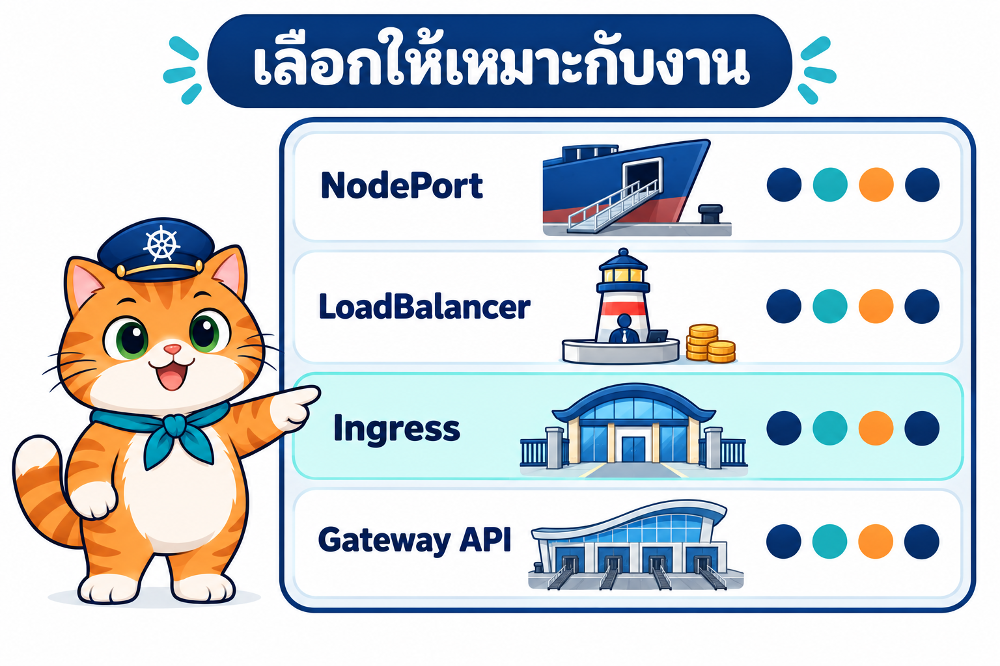<br>
  <em><b>รูปที่ 51</b> เปรียบเทียบ NodePort / LoadBalancer / Ingress / Gateway API: ชั้นที่ทำงาน, จำนวนประตูภายนอก, เลือกตามชื่อ/path ได้ไหม, TLS, ความสามารถขั้นสูง</em>
</p>

| | NodePort | LoadBalancer | Ingress | Gateway API |
|---|---|---|---|---|
| ชั้นที่ทำงาน | L4 | L4 | L7 (HTTP/HTTPS) | L4 และ L7 |
| ประตูภายนอก | 1 เลขต่อ Service บนทุก Node | 1 IP ต่อ Service | 1 ประตูของ controller ใช้ร่วมกัน | Gateway (กี่บานก็ได้ตามที่ผู้ดูแลกำหนด) |
| เลือกตามชื่อ/path | ไม่ได้ | ไม่ได้ | ได้ | ได้ + header/method/query |
| TLS | แอปทำเอง | แล้วแต่ผู้ให้บริการ | ที่ประตู (`spec.tls`) | ที่ listener ของ Gateway |
| redirect/auth/rewrite/weight | ไม่มี | ไม่มี | annotation/CRD เฉพาะ controller | redirect/rewrite/weight ในมาตรฐาน |
| ใครเป็นเจ้าของ | ทีมแอป | ทีมแอป | ป้ายเดียวทุกทีมแก้ | แยก GatewayClass / Gateway / Route |
| บน kind ของ LAB | ใช้ 30080–30082 ได้ | `<pending>` | Traefik บน NodePort 30080/30081 | Traefik (LAB เสริม) |

### 20.2 แนวปฏิบัติ

<p align="center" id="fig-52">
  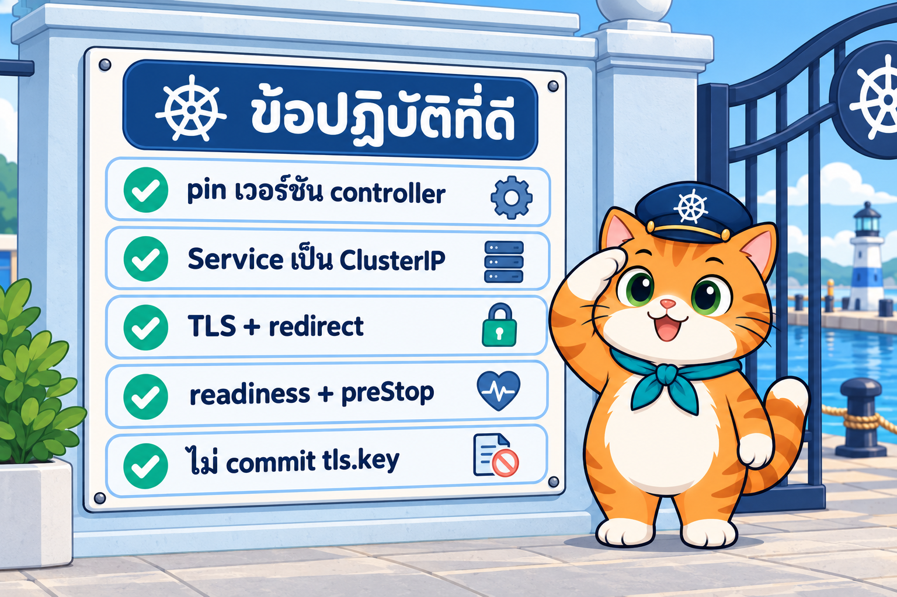<br>
  <em><b>รูปที่ 52</b> แนวปฏิบัติ: pin เวอร์ชัน controller, Service แอปเป็น ClusterIP, เปิด TLS + redirect, มี readiness + preStop, ไม่ commit tls.key, จำกัดการเข้าถึงหน้าแอดมิน</em>
</p>

1. **pin เวอร์ชัน controller** (`traefik:v3.7.13` และไฟล์ CRD ที่ตรงเวอร์ชัน) และเลือก controller ที่ยังได้รับแพตช์ความปลอดภัย
2. Service ของแอปเป็น **ClusterIP** ประตูออกนอกมีแค่ของ controller
3. ใส่ `ingressClassName` ให้ชัดในทุกป้าย แม้จะมี default class
4. เปิด **TLS + redirect HTTP → HTTPS** ทุกชื่อ ใช้ใบจาก CA จริงและให้ cert-manager ต่ออายุในงานจริง
5. มี **readinessProbe + preStop** และ `maxUnavailable: 0` เพื่อเปลี่ยนรุ่นผ่าน Ingress โดยไม่มี error
6. **ไม่ commit `tls.key`** หรือไฟล์ Secret ลง git (`.gitignore` ของบทกัน `*.key`, `*.crt` แล้ว)
7. **จำกัดการเข้าถึงหน้าแอดมิน** (basic auth ผ่าน HTTPS อย่างน้อย, งานจริงควรใช้ SSO หรือ IP allow list) และ **ไม่เปิด dashboard แบบ `--api.insecure`** นอก LAB
8. แยกให้ชัดว่าใช้อะไรเฉพาะ controller เผื่อวันที่ต้องย้าย (บทเรียนจาก ingress-nginx)
9. ทดสอบพฤติกรรมของ controller จริง (pathType, ป้ายที่ไม่มี endpoint, defaultBackend) อย่าเชื่อแค่เอกสารมาตรฐาน

### 20.3 สรุปบทและปัญหาที่ยังเหลือ

<p align="center" id="fig-53">
  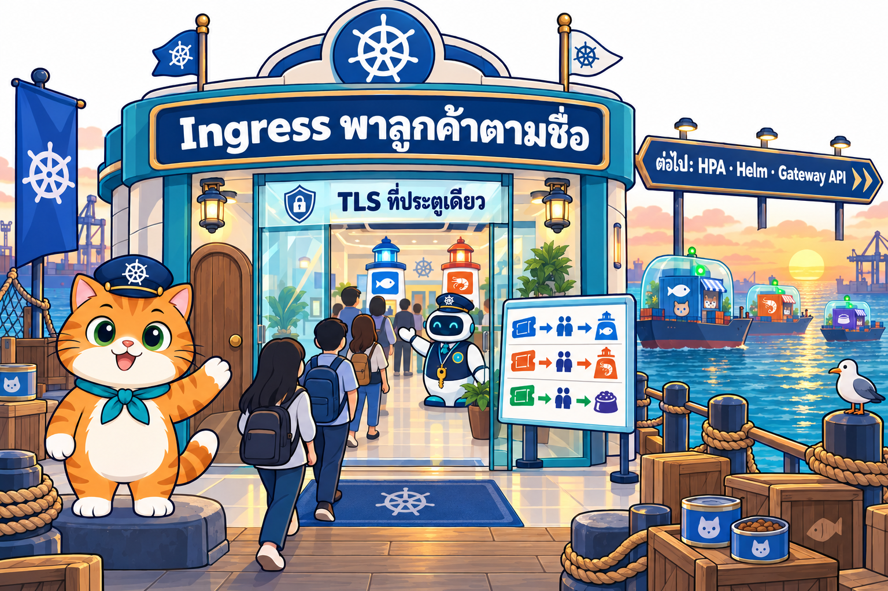<br>
  <em><b>รูปที่ 53</b> สรุปบท: ป้าย (Ingress) + พนักงาน (controller) + ยูนิฟอร์ม (IngressClass) + ประตูกระจก (TLS) ร้านมีหน้าร้านเดียวด้วยชื่อ — บทต่อไป HPA, Helm, Gateway API</em>
</p>

ท้าย LAB 10 ร้านน้องส้มมีหน้าร้านเดียวด้วยชื่อ: `http://shop.localhost:30080` ถูกส่งต่อไป `https://shop.localhost:30081` (TLS จาก Secret `som-tls` ที่ประตู), หลังร้าน `https://admin.localhost:30081` ต้องมีบัตร, Service ของร้านเป็น ClusterIP ทั้งหมด และเปลี่ยนรุ่น 1.5 → 1.6 ผ่าน Ingress ได้ `err=0` แต่ยังเหลือโจทย์ให้บทต่อไป

| ปัญหาที่ยังเหลือ | สภาพตอนนี้ | แนวทางในบทถัดไป |
|---|---|---|
| ร้านคนแน่นต้องเพิ่มบูธอัตโนมัติ | `replicas: 3` ตายตัว ลูกค้ามาก Pod ก็ยัง 3 ตัว ต้อง `kubectl scale` เอง | **HPA (HorizontalPodAutoscaler)** — เพิ่ม/ลดบูธตาม CPU หรือโหลด (Ingress ส่งให้บูธใหม่ที่ Ready เองทันที) |
| ติดตั้ง controller และร้านหลายไฟล์ต้องทำตามลำดับเอง | CRD → `00-traefik.yaml` → Secret 3 ซอง → `k8s/00`–`50` ต้องจำลำดับ และค่าอย่างพอร์ต `30081` เขียนซ้ำหลายไฟล์ | **Helm** — ติดตั้ง Traefik จาก chart ทางการ และแพ็กร้านเป็น chart เดียว ตั้งค่าที่เดียว ติดตั้ง/อัปเกรด/ย้อนรุ่นด้วยคำสั่งเดียว |
| ข้อจำกัดของ Ingress | redirect, auth, strip ต้องใช้ Middleware เฉพาะ Traefik, ทำ weight ไม่ได้, ทุกทีมแก้ป้ายเดียวกัน | **Gateway API** — แยกบทบาท GatewayClass/Gateway/HTTPRoute, weight/redirect/rewrite ในมาตรฐาน (ลองได้แล้วใน **LAB เสริม** ของบทนี้) |

### ข้อควรจำของบทนี้

- **Ingress = ป้าย, controller = พนักงาน** ป้ายที่ไม่มี controller ของ class นั้นไม่มีผล (ADDRESS ว่าง) Kubernetes ไม่มี controller ติดมาให้
- controller ทำงานชั้น **L7** อ่าน `Host` + path แล้วส่ง **ตรงไปที่ Pod ที่ Ready** จาก EndpointSlice Service ของแอปเป็น ClusterIP ได้
- **ingress-nginx ถูก archive 24 มี.ค. 2026** ไม่มีแพตช์อีก บทนี้ใช้ Traefik v3.7.13 ติดตั้งด้วย YAML: **CRD ก่อน controller** และต้อง **คืน NodePort ของร้านเดิมก่อน** (`provided port is already allocated`)
- `backend.service.port` คือพอร์ตของ **Service** (number หรือ name) ไม่ใช่ containerPort API server ไม่ตรวจว่า backend มีจริง ดูจาก `describe ing` และ log `ERR`
- path: ยาวกว่าชนะ, `Exact` ชนะ `Prefix` เมื่อยาวเท่ากัน, Prefix เทียบทีละท่อนและสนตัวพิมพ์ (`/apix`, `/API` → 404), path ไม่ถูกตัด
- Traefik ต้องตั้ง `strictPrefixMatching=true` (ตรงมาตรฐาน), `allowEmptyServices=true` (ได้ 503 แทน 404), `websecure.http.tls=true` (ไม่งั้น HTTPS ได้ 404)
- **404** = ไม่มีกฎตรง / backend หาไม่เจอ, **503** = ไม่มี Pod Ready, **502** = Pod ปิดกลางคัน, **401** = ไม่มีบัตร
- `spec.tls` + Secret `kubernetes.io/tls` ใน namespace เดียวกัน, ชื่อต้องอยู่ใน SAN, ชื่อที่ไม่มีใบได้ `TRAEFIK DEFAULT CERT`, HTTPS ทดสอบด้วย `--resolve` ไม่ใช่ `-H 'Host: ...'`
- redirect/basicAuth/stripPrefix เป็น **Middleware เฉพาะ Traefik** ผูกด้วย annotation `<ns>-<ชื่อ>@kubernetescrd` ลำดับใน annotation = ลำดับด่าน, redirect บน kind ต้องใส่ `port: "30081"`
- readinessProbe + preStop + `maxUnavailable: 0` → rolling update ผ่าน Ingress `err=0` ไม่มี → อาจเห็น 502

---

## 21. คำถามทบทวน

**1. ร้านมี 3 หน้าเว็บ (หน้าร้าน, API, หลังร้าน) ถ้าใช้ NodePort อย่างเดียว และถ้าใช้ Ingress ต่างกันอย่างไรในแง่ประตูภายนอกและ TLS**

<details>
<summary>แนวคำตอบ</summary>

NodePort ต้องจอง 3 เลข (เปิดบนทุก Node) ลูกค้าต้องจำเลข และแต่ละแอปต้องทำ TLS/redirect/ตรวจบัตรเอง ส่วน Ingress มีประตูภายนอกบานเดียวคือ Service ของ controller แล้วแยกไปแต่ละ Service (ClusterIP) ด้วยชื่อหรือ path ทำ TLS ที่ประตูครั้งเดียวด้วย `spec.tls` และเพิ่ม redirect/ตรวจบัตรที่ controller ได้
</details>

**2. Service ทำงานชั้น L4 ส่วน Ingress controller ทำงานชั้น L7 หมายความว่าอะไร controller ใช้ข้อมูลส่วนใดของคำขอ**

<details>
<summary>แนวคำตอบ</summary>

Service (kube-proxy) ดูแค่ IP ปลายทางกับพอร์ตแล้วส่งต่อไป Pod ที่ Ready ตัวใดตัวหนึ่ง ไม่อ่านเนื้อหา ส่วน controller อ่านคำขอ HTTP: method, path (`GET /api/stats`), header `Host` (`shop.localhost:30080` ซึ่งตัดพอร์ตออกก่อนเทียบกฎ) และ header อื่น รวมถึงชื่อใน SNI ของ TLS จึงเลือก Service ตามชื่อ/path และแก้คำขอได้ เช่น เติม `X-Forwarded-*`, ตัด path, redirect
</details>

**3. สร้าง Ingress ในคลัสเตอร์ที่ยังไม่มี controller `kubectl apply` ผ่านไหม ผลคืออะไร และถ้าใส่ `ingressClassName: nginx` ในคลัสเตอร์ที่มีแต่ Traefik จะเห็นอะไร**

<details>
<summary>แนวคำตอบ</summary>

apply ผ่านเสมอเพราะ Ingress เป็นแค่ object เก็บกฎ แต่ไม่มีใครอ่านป้าย ลูกค้าจึงไม่ถูกพาไปไหน กรณี class `nginx` ที่ไม่มี controller รับ `kubectl get ing` เห็น CLASS `nginx` แต่ **ADDRESS ว่าง** และคำขอ `Host: wrong.localhost` ได้ `404 page not found` จาก Traefik เพราะ Traefik ไม่สนป้ายที่ไม่ใช่ class ของตัวเอง
</details>

**4. ingress-nginx ยังรันได้หลัง archive ทำไมจึงไม่ควรติดตั้งใหม่ และทางการแนะนำให้ทำอะไร**

<details>
<summary>แนวคำตอบ</summary>

หลังมีนาคม 2026 ไม่มี release, bugfix หรือแพตช์ความปลอดภัยอีก (repo archived 24 มี.ค. 2026 เวอร์ชันสุดท้าย v1.15.1 รองรับถึง Kubernetes 1.35) ขณะที่ controller หันหน้ารับคำขอจากอินเทอร์เน็ตและมีสิทธิ์อ่าน Secret ทั้งคลัสเตอร์ ช่องโหว่ใหม่จึงอันตรายมาก ทางการแนะนำให้ย้ายไป Gateway API หรือ Ingress controller ตัวอื่นที่ยังดูแลอยู่ และมี ingress2gateway ช่วยแปลง
</details>

**5. ไฟล์ `lab04-hosts/ingress.yaml` ไม่มี `ingressClassName` ทำไม Traefik ยังรับป้ายนี้ และถ้ามี default class สองตัวจะเกิดอะไร**

<details>
<summary>แนวคำตอบ</summary>

IngressClass `traefik` มี annotation `ingressclass.kubernetes.io/is-default-class: "true"` admission controller จึงเติม `ingressClassName: traefik` ให้ตอนสร้าง (ผลจริง jsonpath ได้ `traefik`) ถ้ามี default มากกว่าหนึ่ง class ตามเอกสาร Kubernetes จะปฏิเสธการสร้าง Ingress ที่ไม่ระบุ class จึงควรใส่ `ingressClassName` ให้ชัดเสมอ
</details>

**6. Service `menu` เป็น `port: 80` → `targetPort: http` (8080) ป้ายที่ใส่ `port: {number: 8080}` ผลเป็นอย่างไร ดูได้จากที่ไหน**

<details>
<summary>แนวคำตอบ</summary>

`backend.service.port` ต้องเป็นพอร์ตของ Service (80 หรือชื่อ `http`) ไม่ใช่ containerPort ใส่ 8080 แล้ว apply ผ่าน แต่คำขอได้ 404 `describe ing` แสดง `menu:8080 ()` (วงเล็บว่าง ไม่มี endpoint) Events เป็น `<none>` และ log ของ Traefik มี `ERR Cannot create service error="service port not found"`
</details>

**7. ป้าย `shop.localhost` มีกฎ `/`, `/api`, `/admin` (Prefix ทั้งหมด) คำขอ `/api/stats`, `/apix`, `/order` ไปที่ไหน แอปได้รับ path อะไร**

<details>
<summary>แนวคำตอบ</summary>

`/api/stats` ตรงทั้ง `/` และ `/api` path ที่ยาวกว่าชนะ จึงไป api และแอปได้รับ `GET /api/stats` เต็ม (path ไม่ถูกตัด) `/apix` ไม่ตรง `/api` เพราะ Prefix เทียบทีละท่อน จึงตกไปที่ `/` → menu และ `/order` ก็ไป menu ใน Traefik ลำดับนี้เห็นจาก priority ของ router (67/63/41 ตามความยาว rule)
</details>

**8. อธิบายผลของ `Prefix /docs/`, `Exact /menu` กับคำขอ `/docs`, `/menu/` และทำไม Traefik ต้องเปิด `strictPrefixMatching`**

<details>
<summary>แนวคำตอบ</summary>

ตามมาตรฐาน Prefix ไม่สน `/` ท้าย กฎ `/docs/` จึงรับ `/docs` (200) ส่วน Exact ต้องตรงทั้งเส้น `/menu/` ได้ 404 ค่าเริ่มต้นของ Traefik เทียบ Prefix แบบตัวอักษร ผลจริงเมื่อปิด strict: `/apix` ไป api และ `/docs` กลายเป็น 404 ซึ่งผิดมาตรฐาน flag `--providers.kubernetesingress.strictPrefixMatching=true` ทำให้ rule เป็น `Path("/api") || PathPrefix("/api/")` ตรงมาตรฐาน
</details>

**9. แยกความหมายของ `404 page not found`, `503 no available server` และ `502 Bad Gateway` ที่ได้จาก controller พร้อมสาเหตุที่พบในบทนี้**

<details>
<summary>แนวคำตอบ</summary>

404 = ไม่มีกฎตรง (ชื่อไม่มีป้ายรับ, class ผิด, Service/port ใน backend หาไม่เจอ) 503 = มีกฎตรงแต่ Service ไม่มี Pod Ready (scale เป็น 0 ใน LAB 6 โดย Traefik ต้องเปิด `allowEmptyServices=true` ไม่งั้นจะได้ 404) 502 = ส่งไปถึง Pod แล้วแต่ Pod ปิดหรือตัดการเชื่อมต่อกลางคัน (rolling update แบบไม่มี readiness/preStop ใน LAB 9)
</details>

**10. ทำไม Ingress ที่มีแค่ `spec.defaultBackend` จึงอันตรายใน Traefik**

<details>
<summary>แนวคำตอบ</summary>

ใน Traefik ป้ายที่มีแค่ defaultBackend (HOSTS `*`) กลายเป็น catch-all ของทั้ง controller คำขอทุกชื่อที่ไม่มีป้ายรับในทุก namespace (other/typo/class ผิด/ไม่มี Host) ไหลไปที่ Service นั้นหมด ผลจริงคือไปที่ admin ทั้งหมด ทำให้หน้าที่ไม่ควรเปิดถูกเข้าถึงได้และซ่อนปัญหา 404 จึงต้องลบทิ้งหลังทดลอง (กฎที่ตรงแต่ไม่มี endpoint ยังได้ 503)
</details>

**11. ใน TLS termination แอปได้รับ HTTP หรือ HTTPS รู้ได้อย่างไรว่าลูกค้าใช้ HTTPS และ Secret ต้องอยู่ที่ไหน**

<details>
<summary>แนวคำตอบ</summary>

controller ถอดรหัสที่ประตูแล้วส่ง HTTP ธรรมดาให้แอป แอปรู้จาก header `X-Forwarded-Proto: https` (และ `X-Forwarded-Port: 30081`) Secret ต้องเป็นชนิด `kubernetes.io/tls` (มี `tls.crt`, `tls.key`) และอยู่ namespace เดียวกับ Ingress ที่อ้างใน `spec.tls[].secretName`
</details>

**12. `curl --cacert tls.crt https://127.0.0.1:30081/` ได้ `curl: (60)` และ `openssl s_client -servername other.localhost` ได้ `TRAEFIK DEFAULT CERT` อธิบายทั้งสองกรณี**

<details>
<summary>แนวคำตอบ</summary>

กรณีแรก `127.0.0.1` ไม่อยู่ใน subjectAltName ของใบ (มีแค่ `shop.localhost`, `admin.localhost`, `localhost`) การตรวจชื่อจึงไม่ผ่านแม้เชื่อใบนี้แล้ว กรณีที่สองลูกค้าบอกชื่อ `other.localhost` ผ่าน SNI ซึ่งไม่มีป้ายใดมี `spec.tls` ของชื่อนี้ Traefik จึงส่งใบสำรองที่สร้างเองให้
</details>

**13. ทำไมทดสอบ HTTPS ของร้านด้วย `curl -sk -H 'Host: shop.localhost' https://localhost:30081/api/whoami` แล้วได้ `Moved Permanently` ควรทดสอบอย่างไร**

<details>
<summary>แนวคำตอบ</summary>

Middleware `redirectScheme` เทียบพอร์ตใน `Host` เมื่อ `Host` ไม่มีพอร์ตถือว่าเป็น 443 ซึ่งไม่ตรงกับ `port: "30081"` ที่ตั้งไว้ จึงตอบ 301 ไป `https://shop.localhost:30081/...` อีกทั้ง SNI เป็น `localhost` ไม่ใช่ชื่อร้าน ควรใช้ `curl --resolve shop.localhost:30081:127.0.0.1 https://shop.localhost:30081/...` (ชื่อใน URL เป็นทั้ง SNI และ Host ที่มีพอร์ต) หรือใส่ `-H 'Host: shop.localhost:30081'`
</details>

**14. Middleware `redirectScheme` ที่ไม่ใส่ `port` ให้ผลอย่างไรบน kind ของ LAB และทำไม**

<details>
<summary>แนวคำตอบ</summary>

`Location` เป็น `https://shop.localhost/menu?x=1` ไม่มีพอร์ต = 443 แต่ใน `k8s-lab` ไม่มีใครฟังพอร์ต 443 (มีแค่ NodePort 30080–30082) `curl -L` จึงต่อไม่ได้ `rc=7` เพราะ Traefik ไม่รู้ว่าลูกค้าเห็นประตู HTTPS เป็น NodePort 30081 (ภายในฟังที่ :8443) ต้องกำหนด `port: "30081"` เอง
</details>

**15. ป้ายหลังร้านใช้ annotation `som-shop-redirect-https@kubernetescrd,som-shop-admin-auth@kubernetescrd` ถ้าสลับลำดับเป็นตรวจบัตรก่อน redirect จะเสียอะไร**

<details>
<summary>แนวคำตอบ</summary>

ลำดับใน annotation คือลำดับด่าน ถ้าตรวจบัตรก่อน คำขอ HTTP จะได้ 401 และ browser จะส่งรหัสผ่าน HTTP ที่ไม่เข้ารหัส (basic auth เป็นแค่ base64) แล้วจึงถูก redirect ทีหลัง ลำดับที่ถูกคือ redirect ไป HTTPS ก่อนแล้วจึงตรวจบัตร ผลจริงใน LAB: `http://admin.localhost:30080/` ได้ 301 ก่อน แล้ว HTTPS จึงได้ 401/200
</details>

**16. ทำไม rolling update ผ่าน Ingress แบบมี readinessProbe + preStop ได้ `err=0` แต่แบบเปราะได้ 502 ทั้งที่ Deployment เดียวกัน**

<details>
<summary>แนวคำตอบ</summary>

controller ส่งตรงไป IP ของ Pod ตาม EndpointSlice readinessProbe ทำให้ Pod ใหม่เข้ารายชื่อเมื่อพร้อมจริง preStop sleep 5 ทำให้ Pod เก่าที่ถูกสั่งปิดยังตอบต่อระหว่างที่ controller ลบออกจากรายชื่อ และ `maxUnavailable: 0` ไม่ลดจำนวนบูธที่พร้อม แบบเปราะ Pod เก่าปิดทันทีขณะที่ Traefik อาจยังส่งคำขอมา ได้ 502 (ผลจริง err 3–5 จาก 300 ทุกรอบ)
</details>

**17. Ingress มาตรฐานทำ canary 90/10 ได้ไหม ถ้าไม่ได้มีทางเลือกอะไร**

<details>
<summary>แนวคำตอบ</summary>

ไม่ได้ กฎหนึ่งชี้ไป Service เดียวและไม่มีฟิลด์ weight ทางเลือกคือปรับสัดส่วนจำนวน Pod ใต้ Service เดียว ใช้ความสามารถเฉพาะ controller (TraefikService, annotation canary ของ ingress-nginx เดิม) หรือใช้ Gateway API `HTTPRoute` `backendRefs[].weight` ซึ่งเป็นมาตรฐาน (LAB เสริมได้ 36 : 4 จาก 40 ครั้ง)
</details>

**18. Gateway API แก้ข้อจำกัดของ Ingress อย่างไร บอกบทบาทของ GatewayClass, Gateway และ HTTPRoute**

<details>
<summary>แนวคำตอบ</summary>

Gateway API แยกบทบาท: GatewayClass บอกว่า controller ใดทำ (ผู้ให้บริการ), Gateway คือประตูจริงที่ผู้ดูแลคลัสเตอร์กำหนด listener (protocol, port, hostname, TLS), HTTPRoute คือเส้นทางที่ทีมร้านแขวนกับ Gateway ผ่าน `parentRefs` ความสามารถอย่าง weight, header match, redirect, rewrite อยู่ในมาตรฐาน จึงไม่ต้องพึ่ง annotation ของแต่ละ controller และรองรับ protocol อื่นนอกจาก HTTP
</details>

**19. ร้านในบทนี้ยังมีปัญหาอะไรที่บทถัดไปจะแก้**

<details>
<summary>แนวคำตอบ</summary>

(1) จำนวนบูธตายตัว 3 ตัว ลูกค้าแน่นต้อง scale เอง → HPA เพิ่ม/ลดอัตโนมัติ (2) ติดตั้ง CRD + controller + Secret + manifest หลายไฟล์ตามลำดับเอง ค่าซ้ำหลายที่ → Helm แพ็กเป็น chart (3) redirect/auth/strip ผูกกับ Traefik และทำ weight ไม่ได้ → Gateway API (มี LAB เสริมให้ลองแล้ว)
</details>

---

## 22. เอกสารอ้างอิง

1. The Kubernetes Authors. *Ingress*. https://kubernetes.io/docs/concepts/services-networking/ingress/
2. The Kubernetes Authors. *Ingress Controllers*. https://kubernetes.io/docs/concepts/services-networking/ingress-controllers/
3. The Kubernetes Authors. *Ingress — Path types and examples*. https://kubernetes.io/docs/concepts/services-networking/ingress/#path-types
4. The Kubernetes Authors. *Ingress — TLS*. https://kubernetes.io/docs/concepts/services-networking/ingress/#tls
5. The Kubernetes Authors. *Ingress (API reference, networking.k8s.io/v1)*. https://kubernetes.io/docs/reference/kubernetes-api/service-resources/ingress-v1/
6. The Kubernetes Authors. *IngressClass (API reference)*. https://kubernetes.io/docs/reference/kubernetes-api/service-resources/ingress-class-v1/
7. The Kubernetes Authors. *Service*. https://kubernetes.io/docs/concepts/services-networking/service/
8. The Kubernetes Authors. *EndpointSlices*. https://kubernetes.io/docs/concepts/services-networking/endpoint-slices/
9. The Kubernetes Authors. *Gateway API*. https://kubernetes.io/docs/concepts/services-networking/gateway/
10. The Kubernetes Authors. *Secrets — TLS Secrets*. https://kubernetes.io/docs/concepts/configuration/secret/#tls-secrets
11. The Kubernetes Authors. *Container Lifecycle Hooks*. https://kubernetes.io/docs/concepts/containers/container-lifecycle-hooks/
12. Kubernetes SIG Network & Security Response Committee. *Ingress NGINX Retirement: What You Need to Know* (11 Nov 2025). https://kubernetes.io/blog/2025/11/11/ingress-nginx-retirement/
13. Kubernetes Steering Committee & SRC. *Ingress NGINX statement* (29 Jan 2026). https://kubernetes.io/blog/2026/01/29/ingress-nginx-statement/
14. The Kubernetes Authors. *Before You Migrate: Five Surprising Ingress-NGINX Behaviors* (27 Feb 2026). https://kubernetes.io/blog/2026/02/27/ingress-nginx-before-you-migrate/
15. The Kubernetes Authors. *Ingress2Gateway 1.0* (20 Mar 2026). https://kubernetes.io/blog/2026/03/20/ingress2gateway-1-0-release/
16. kubernetes/ingress-nginx (archived). https://github.com/kubernetes/ingress-nginx
17. Traefik Labs. *Traefik releases*. https://github.com/traefik/traefik/releases
18. Traefik Labs. *Kubernetes Ingress provider*. https://doc.traefik.io/traefik/reference/install-configuration/providers/kubernetes/kubernetes-ingress/
19. Traefik Labs. *Kubernetes Gateway API provider*. https://doc.traefik.io/traefik/reference/install-configuration/providers/kubernetes/kubernetes-gateway/
20. Kubernetes SIG Network. *Gateway API*. https://gateway-api.sigs.k8s.io/
21. traefik/whoami. https://github.com/traefik/whoami

---

> **หมายเหตุเกี่ยวกับภาพประกอบ:** ภาพประกอบ 53 ภาพในโฟลเดอร์ [`images/`](images/) และภาพตัวละครน้องส้ม ([`00-character-som.png`](images/00-character-som.png)) สร้างขึ้นด้วยปัญญาประดิษฐ์สำหรับการสร้างภาพเพื่อใช้ประกอบการเรียนการสอน ชุดคำสั่งสร้างภาพอยู่ใน [`images/imagegen-prompts.md`](images/imagegen-prompts.md) ภาพใช้อุปมาเชิงเปรียบเทียบเพื่อช่วยความเข้าใจ ตัวเลขและข้อความในภาพเป็นค่าตัวอย่าง ผู้เรียนควรใช้เนื้อหาในเอกสารนี้และเอกสารอ้างอิงเป็นหลัก รหัสผ่านทุกตัวในภาพและเอกสารเป็นค่าตัวอย่างเพื่อการเรียนเท่านั้น ผลลัพธ์คำสั่งทั้งหมดมาจากการทดลองจริง (Kubernetes v1.37.0, kubectl v1.37.1, Traefik v3.7.13) ค่าเวลา, AGE, IP และชื่อ Pod ในเครื่องผู้เรียนอาจต่างกัน
