# HorizontalPodAutoscaler (HPA): หุ่นยนต์ผู้ช่วยเปิด/ปิดบูธตามจำนวนลูกค้า

> **รายวิชา:** Software Development Tools and Environments (DevTools)
> **หัวข้อ:** Kubernetes autoscaling — HPA, VPA, Cluster Autoscaler และ KEDA (ภาพรวม), metrics pipeline (kubelet → metrics-server → Metrics API), `kubectl top`, HPA `autoscaling/v2` (scaleTargetRef, min/max, ชนิด metric, Utilization/AverageValue), requests กับ % ความเหนื่อย, สูตร `desiredReplicas` และ tolerance, `behavior` (stabilizationWindowSeconds, policies, selectPolicy), กับดัก `replicas` ใน YAML, HPA กับ rolling update/probe/memory/StatefulSet/ResourceQuota/Pending และแนวปฏิบัติ
> **ผลลัพธ์การเรียนรู้ที่เกี่ยวข้อง:** CLO-5, CLO-6
> **บทก่อนหน้า:** [บทที่ 12 Ingress](../../012_kubernetes_ingress/01_Theory/README.md) · **LAB ของบทนี้:** [02_LAB](../02_LAB/README.md)

---

## บทคัดย่อ

ท้ายบทที่ 12 ร้านอาหารแมวน้องส้มมีประตูหน้าท่าเรือบานเดียว (Traefik + Ingress) ลูกค้าเข้า `https://shop.localhost:30081` ได้แล้ว แต่หน้าร้าน `som-web` ยังมี **3 บูธตายตัว** (`replicas: 3`) วันปกติบูธว่างเปลืองที่ วันลดราคาลูกค้าล้นจนคิวยาว และทุกครั้งที่อยากเพิ่ม/ลดบูธต้องมีคนมาสั่ง `kubectl scale` เอง บทนี้แนะนำ **HorizontalPodAutoscaler (HPA)** หรือ **หุ่นยนต์ผู้ช่วยผู้จัดการ** ที่ดูมิเตอร์ความเหนื่อยของบูธทุก 15 วินาทีแล้วสั่งผู้จัดการร้าน (Deployment) ให้เพิ่มหรือลดจำนวนบูธเอง

เนื้อหาเริ่มจากเหตุผลที่ต้อง autoscaling และภาพรวม autoscaling 3 ทิศ (HPA เพิ่มจำนวน Pod, VPA ขยายขนาด Pod, Cluster Autoscaler เพิ่ม Node) กับ KEDA ที่ scale ตามเหตุการณ์ ต่อด้วย **ท่อส่งมิเตอร์**: kubelet → **metrics-server** → Metrics API (`metrics.k8s.io`) → HPA และ `kubectl top` รวมถึงเหตุผลที่ kind ต้องใช้ `--kubelet-insecure-tls` จากนั้นเจาะ **HPA `autoscaling/v2`** ทีละส่วน: `scaleTargetRef`, `minReplicas`/`maxReplicas`, ชนิด metric, `Utilization` กับ `AverageValue`, ความสัมพันธ์ของ **requests** กับ % ความเหนื่อย, **สูตร `desiredReplicas = ceil(currentReplicas × currentMetric ÷ target)`** และ tolerance 10% แล้วจึงเป็น **`behavior`** ที่คุมความเร็วการเพิ่ม/ลดด้วยนาฬิกาทราย (`stabilizationWindowSeconds`) และ policies ปิดท้ายด้วยกับดักที่พบจริง (เช่น `replicas` ใน YAML ทับ HPA, memory-based HPA ไม่ลด, ResourceQuota/Pending ที่ HPA มองไม่เห็น) ตารางเปรียบเทียบ แนวปฏิบัติ และปัญหาที่ยังเหลือให้บทถัดไป

ผลลัพธ์คำสั่งและข้อความที่ยกมาในเอกสารนี้มาจากการทดลองจริงบนคลัสเตอร์ kind (Kubernetes v1.37.0, kubectl v1.37.1, metrics-server v0.9.0) ใน LAB ประจำบทเมื่อ 5 ตุลาคม 2569 บนเครื่องที่จำกัดไว้ 4 CPU **เวลา, % CPU, ชื่อ Pod และจำนวนขั้นที่ HPA เพิ่มในเครื่องผู้เรียนอาจต่างจากตัวอย่าง** แต่ลำดับเหตุการณ์และข้อความ (reason, condition, error) ควรตรงกัน

## วัตถุประสงค์การเรียนรู้

เมื่อศึกษาเอกสารนี้จบ ผู้เรียนควรสามารถ

1. อธิบายปัญหาของการกำหนดจำนวน Pod คงที่และการ scale ด้วยมือ และบอกความต่างของ autoscaling แบบ reactive (ดูมิเตอร์ย้อนหลัง) กับการทำนายล่วงหน้าได้
2. แยกหน้าที่ของ HPA, VPA, Cluster Autoscaler (และ Karpenter) และ KEDA ได้ ว่าแต่ละตัวปรับอะไร เหมาะกับงานแบบใด และอะไรที่ไม่ควรใช้ร่วมกัน
3. อธิบายเส้นทางของตัวเลข CPU/memory จาก kubelet ผ่าน metrics-server และ aggregation layer (`APIService v1beta1.metrics.k8s.io`) ไปถึง HPA และ `kubectl top` ได้ รวมถึงอ่านข้อความเมื่อมิเตอร์ยังไม่พร้อมได้ 3 แบบ
4. อธิบายว่าทำไม metrics-server บน kind ต้องใช้ `--kubelet-insecure-tls` และทำไมห้ามใช้ใน production
5. เขียน HPA `autoscaling/v2` ทั้งด้วย `kubectl autoscale --cpu=50%` และด้วย YAML ได้ อธิบาย `scaleTargetRef`, `minReplicas`, `maxReplicas`, ชนิด metric (Resource, ContainerResource, Pods, Object, External) และ target แบบ `Utilization`, `AverageValue`, `Value` ได้
6. คำนวณ utilization จาก usage ÷ requests และอธิบายว่าทำไม % เกิน 100 ได้ และทำไมไม่มี requests จึงได้ `<unknown>`
7. คำนวณ `desiredReplicas` ด้วยสูตร ceil ทั้งขาขึ้นและขาลง พร้อมผลของ tolerance, หลาย metric, `maxReplicas`/`minReplicas` และ Pod ที่ยังไม่พร้อม
8. เขียน `behavior` (stabilizationWindowSeconds, policies แบบ Pods/Percent, periodSeconds, selectPolicy) เพื่อคุมความเร็วการเพิ่ม/ลด และอธิบายค่าเริ่มต้นกับปัญหา flapping ได้
9. ย้าย Deployment ที่เคยกำหนด `replicas` ให้ HPA ดูแลโดยบูธไม่ลดเหลือ 1 (`kubectl apply edit-last-applied` / `set-last-applied`) และอธิบายการทำงานร่วมกับ rolling update, readinessProbe และ preStop
10. วิเคราะห์สถานการณ์ที่ HPA "สั่ง" ได้แต่ Pod "เกิด" ไม่ได้ (ResourceQuota, Node เต็ม) และเลือกได้ว่างานใดไม่ควรใช้ HPA (เช่น ฐานข้อมูลแบบ StatefulSet)

## สารบัญ

1. [บทนำ: วันลดราคา ลูกค้าล้นร้าน](#1-บทนำ-วันลดราคา-ลูกค้าล้นร้าน)
2. [ทำไมต้อง autoscaling](#2-ทำไมต้อง-autoscaling)
3. [autoscaling 3 ทิศ และ KEDA](#3-autoscaling-3-ทิศ-และ-keda)
4. [ท่อส่งมิเตอร์ (metrics pipeline)](#4-ท่อส่งมิเตอร์-metrics-pipeline)
5. [HPA object (autoscaling/v2)](#5-hpa-object-autoscalingv2)
6. [requests และ % ความเหนื่อย](#6-requests-และ--ความเหนื่อย)
7. [สูตรคิดจำนวนบูธ](#7-สูตรคิดจำนวนบูธ)
8. [behavior: ความเร็วเพิ่ม/ลดบูธ](#8-behavior-ความเร็วเพิ่มลดบูธ)
9. [ใช้งานจริงและกับดัก](#9-ใช้งานจริงและกับดัก)
10. [เปรียบเทียบ แนวปฏิบัติ และสรุป](#10-เปรียบเทียบ-แนวปฏิบัติ-และสรุป)
11. [คำถามทบทวน](#11-คำถามทบทวน)
12. [ปัญหาที่ยังเหลือและบทถัดไป](#12-ปัญหาที่ยังเหลือและบทถัดไป)
13. [เอกสารอ้างอิง](#13-เอกสารอ้างอิง)

### สารบัญรูปภาพ

| รูปที่ | เรื่อง | รูปที่ | เรื่อง |
|:---:|---|:---:|---|
| 1 | [เปิดบท วันลดราคาของร้านน้องส้ม](#fig-1) | 23 | [Utilization เทียบ AverageValue](#fig-23) |
| 2 | [ทวน scale ด้วยมือ](#fig-2) | 24 | [requests เป็นฐาน 100%](#fig-24) |
| 3 | [อุปมาใหม่ของบท](#fig-3) | 25 | [utilization เกิน 100%](#fig-25) |
| 4 | [เป้าหมายของบท](#fig-4) | 26 | [ไม่มี requests ได้ unknown](#fig-26) |
| 5 | [ลูกค้าแต่ละช่วงวันไม่เท่ากัน](#fig-5) | 27 | [สูตร desiredReplicas ขาขึ้น](#fig-27) |
| 6 | [สั่งด้วยมือเทียบกับ HPA](#fig-6) | 28 | [สูตรขาลง](#fig-28) |
| 7 | [autoscaling 3 ทิศ](#fig-7) | 29 | [tolerance 10%](#fig-29) |
| 8 | [HPA เพิ่มจำนวน Pod](#fig-8) | 30 | [หลาย metric เลือกค่ามากสุด](#fig-30) |
| 9 | [VPA ขยายขนาด Pod](#fig-9) | 31 | [Pod ที่ยังไม่พร้อม](#fig-31) |
| 10 | [Cluster Autoscaler เรียก Node ใหม่](#fig-10) | 32 | [ค่าเริ่มต้นของ behavior](#fig-32) |
| 11 | [KEDA scale ตามเหตุการณ์](#fig-11) | 33 | [นาฬิกาทราย stabilization window](#fig-33) |
| 12 | [ท่อส่งมิเตอร์](#fig-12) | 34 | [policies และ selectPolicy](#fig-34) |
| 13 | [metrics-server จดมิเตอร์เป็นรอบ](#fig-13) | 35 | [flapping](#fig-35) |
| 14 | [APIService v1beta1.metrics.k8s.io](#fig-14) | 36 | [replicas ใน YAML ทับ HPA](#fig-36) |
| 15 | [kind กับใบรับรองของ kubelet](#fig-15) | 37 | [HPA กับ rolling update](#fig-37) |
| 16 | [kubectl top](#fig-16) | 38 | [readiness และ startup probe](#fig-38) |
| 17 | [ข้อความเมื่อมิเตอร์ยังไม่พร้อม](#fig-17) | 39 | [ระวัง memory-based HPA](#fig-39) |
| 18 | [HPA control loop](#fig-18) | 40 | [ไม่ใช้ HPA กับ db](#fig-40) |
| 19 | [โครง YAML ของ HPA](#fig-19) | 41 | [ResourceQuota และ Pending](#fig-41) |
| 20 | [scaleTargetRef](#fig-20) | 42 | [ตารางเปรียบเทียบ](#fig-42) |
| 21 | [รางบูธ min และ max](#fig-21) | 43 | [แนวปฏิบัติ](#fig-43) |
| 22 | [ชนิดของ metric](#fig-22) | 44 | [สรุปบท](#fig-44) |

---

## 1. บทนำ: วันลดราคา ลูกค้าล้นร้าน

<p align="center">
  <br>
  <em>น้องส้ม ผู้ช่วยกัปตันท่าเรือ Kubernetes ตัวละครหลักของบทนี้</em>
</p>

<p align="center" id="fig-1">
  <br>
  <em><b>รูปที่ 1</b> เปิดบทที่ 13: ร้านน้องส้มประกาศวันลดราคา ลูกค้าแห่เข้าประตูหน้าท่าเรือ บูธหน้าร้านเริ่มไม่พอ น้องส้มจึงหาผู้ช่วยที่เพิ่ม/ลดบูธให้เอง</em>
</p>

ร้านอาหารแมวน้องส้มเดินทางมาไกลแล้ว บทที่ 5–7 ร้านมีหัวหน้ากะ (ReplicaSet) ประภาคาร (Service) และผู้จัดการร้าน (Deployment) ที่เปลี่ยนรุ่นทีละบูธได้ บทที่ 8–9 ครัวกลาง `som-db-0` มีตู้เซฟของตัวเอง บทที่ 10–11 ป้ายร้านอยู่ใน ConfigMap และรหัสผ่านอยู่ใน Secret และบทที่ 12 ลูกค้าเข้าร้านผ่าน **ประตูหน้าท่าเรือบานเดียว** (Traefik + Ingress) ที่ `https://shop.localhost:30081`

วันนี้น้องส้มประกาศ **วันลดราคา** ลูกค้าแห่เข้าประตูหน้าท่าเรือพร้อมกัน แต่หน้าร้าน `som-web` ยังมี **3 บูธเท่าเดิม** เพราะในไฟล์ `20-web.yaml` เขียนไว้ว่า `replicas: 3` บูธทั้ง 3 จึงเหนื่อยจนตอบช้า ส่วนตอนตีสองที่ไม่มีลูกค้าเลย บูธทั้ง 3 ก็ยังเปิดรอ ใช้ทรัพยากรของเรือ (Node) อยู่ฟรี ๆ

ทบทวนสิ่งที่รู้จากบทก่อน

1. **Deployment** (ผู้จัดการร้าน) ดูแลจำนวนบูธผ่าน ReplicaSet ตามค่า `spec.replicas` และเปลี่ยนรุ่นแบบ rolling update ได้ (บทที่ 7)
2. **Service** และ **Ingress** ส่งลูกค้าไปเฉพาะบูธที่ **Ready** (ผ่าน readinessProbe) และ `preStop` ทำให้บูธที่กำลังปิดยังเสิร์ฟลูกค้าที่ค้างอยู่ได้ (บทที่ 6, 7, 12)
3. **requests/limits** คือพื้นที่ที่บูธจองไว้และเพดานที่ใช้ได้ (บทที่ 2–3) และ **ResourceQuota** คืองบรวมของโซน (บทที่ 4)

<p align="center" id="fig-2">
  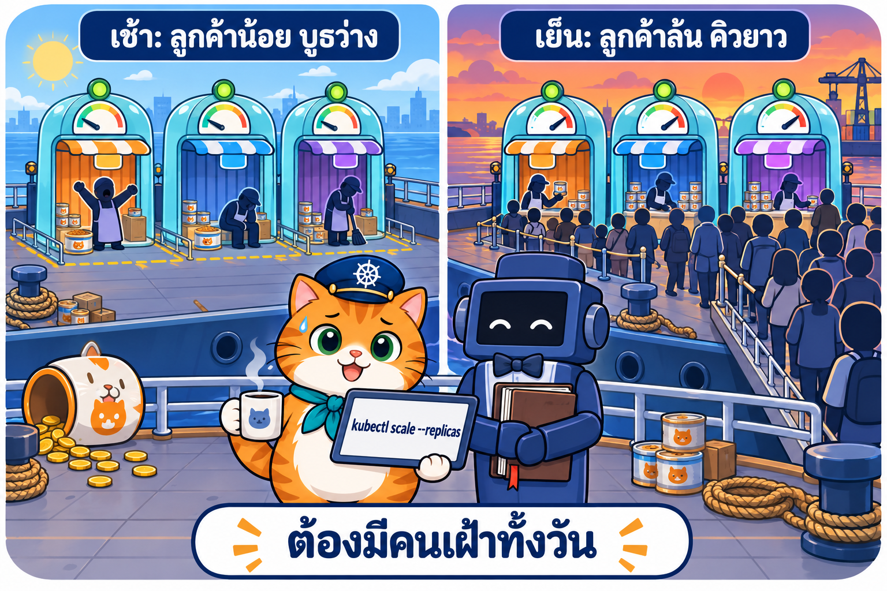<br>
  <em><b>รูปที่ 2</b> ทวนบท 005/007: เพิ่ม/ลดบูธด้วยมือ (kubectl scale --replicas) ได้ แต่ต้องมีคนเฝ้าตลอด — ตอนเช้าลูกค้าน้อย บูธว่าง ตอนโปรลูกค้าล้น คิวยาว</em>
</p>

ที่ผ่านมาเราเพิ่ม/ลดบูธได้ 2 วิธี คือสั่งตรง ๆ ด้วย `kubectl scale` หรือแก้ `replicas` ในไฟล์แล้ว `kubectl apply` (บทที่ 5 และ 7)

```bash
kubectl -n som-shop scale deploy/som-web --replicas=6     # วันลดราคา
kubectl -n som-shop scale deploy/som-web --replicas=2     # ตีสอง
```

ทั้งสองวิธีใช้ได้ แต่ **ต้องมีคนเฝ้า** ต้องรู้ว่าลูกค้ามาเมื่อไร ต้องตื่นมาสั่งตอนดึก และถ้าลืมลดกลับ บูธก็เปิดค้างไว้ทั้งคืน น้องส้มจึงหาผู้ช่วยที่ดูมิเตอร์และสั่งแทนได้

<p align="center" id="fig-3">
  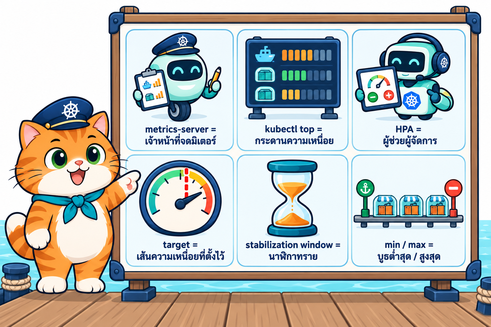<br>
  <em><b>รูปที่ 3</b> อุปมาใหม่ของบท: metrics-server = เจ้าหน้าที่จดมิเตอร์, kubectl top = กระดานคะแนนความเหนื่อย, HPA = หุ่นยนต์ผู้ช่วยผู้จัดการ, target = เส้นความเหนื่อยที่ตั้งไว้, stabilization window = นาฬิกาทราย, min/max = จำนวนบูธต่ำสุด/สูงสุด</em>
</p>

**ตารางที่ 1** อุปมาท่าเรือที่ใช้ในบทนี้ (ต่อจากบทที่ 1–12)

| Kubernetes | อุปมาท่าเรือ | ใหม่ในบทนี้ |
|---|---|:---:|
| Pod หน้าร้าน `som-web` | บูธหน้าร้าน | |
| Deployment | ผู้จัดการร้านถือสมุดบันทึกรุ่น | |
| Node | เรือสินค้า (`lab-worker`, `lab-worker2`) | |
| Service / Ingress controller | ประภาคาร / พนักงานต้อนรับที่ประตูหน้าท่าเรือ | |
| `requests.cpu` | พื้นที่บูธที่จองไว้ (ฐาน 100%) | |
| **metrics-server** | **เจ้าหน้าที่จดมิเตอร์** เดินจดความเหนื่อยของทุกบูธเป็นรอบ ๆ | ✅ |
| **`kubectl top`** | **กระดานคะแนนความเหนื่อย** ของเรือและบูธ | ✅ |
| **HPA** | **หุ่นยนต์ผู้ช่วยผู้จัดการ** ดูกระดานแล้วบอกผู้จัดการว่าควรมีกี่บูธ | ✅ |
| **target** (`averageUtilization: 50`) | **เส้นความเหนื่อยที่ตั้งไว้** | ✅ |
| **`minReplicas` / `maxReplicas`** | **รางบูธ** มีสมอเขียว (ต่ำสุด) และตัวกั้นแดง (สูงสุด) | ✅ |
| **`stabilizationWindowSeconds`** | **นาฬิกาทราย** รอให้แน่ใจก่อนปิดบูธ | ✅ |
| VPA | แม่แรงขยายขนาดบูธ (ทฤษฎี) | ✅ |
| Cluster Autoscaler / Karpenter | ธงเรียกเรือลำใหม่ (ทฤษฎี) | ✅ |
| KEDA | เครื่องนับคิวออเดอร์ที่ปลุกบูธได้ (ทฤษฎี) | ✅ |

<p align="center" id="fig-4">
  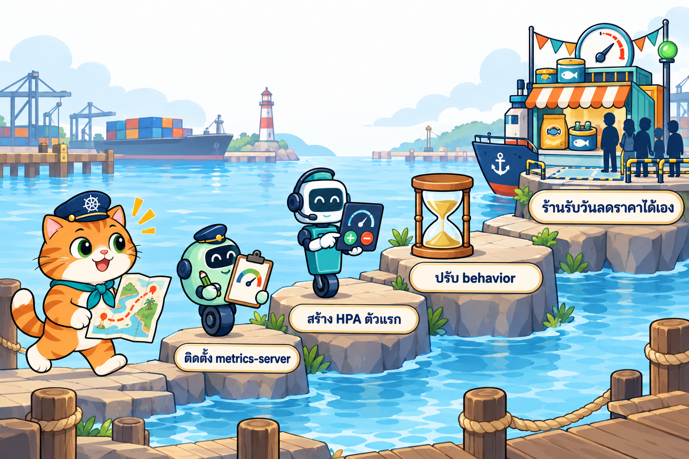<br>
  <em><b>รูปที่ 4</b> เป้าหมายบท: ติดตั้ง metrics-server ดูมิเตอร์ได้ → สร้าง HPA → ปรับ behavior → ร้านน้องส้มรับวันลดราคาได้เอง</em>
</p>

เป้าหมายของบทนี้คือ ติดตั้งเจ้าหน้าที่จดมิเตอร์ให้คลัสเตอร์ (metrics-server) ดูมิเตอร์ด้วย `kubectl top` สร้างหุ่นยนต์ผู้ช่วย (HPA) ปรับความเร็วด้วย `behavior` แล้วนำไปใช้กับร้านน้องส้มจริงใน LAB สุดท้าย ที่ลูกค้าจำลองยิงผ่าน `https://shop.localhost:30081` แล้วหน้าร้านขยายจาก 2 เป็น 6 บูธและลดกลับเป็น 2 เองโดยลูกค้าไม่เจอ error ส่วนครัว `som-db-0` ไม่ถูก scale

---

## 2. ทำไมต้อง autoscaling

### 2.1 ลูกค้าแต่ละช่วงไม่เท่ากัน

<p align="center" id="fig-5">
  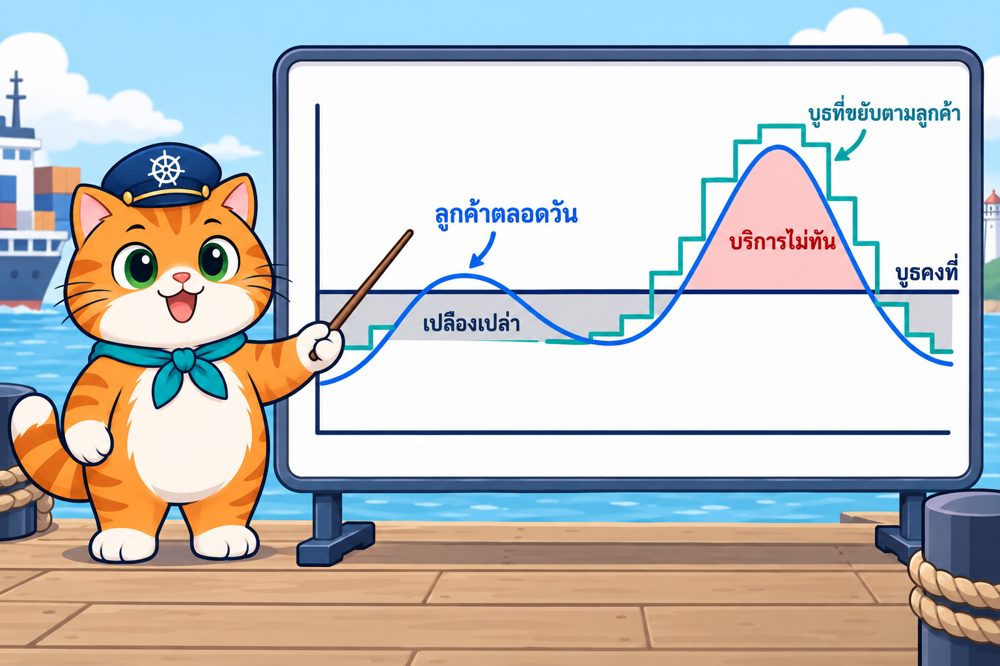<br>
  <em><b>รูปที่ 5</b> ลูกค้าแต่ละช่วงวันไม่เท่ากัน: ถ้าตั้งบูธคงที่ ช่วงเงียบเปลืองทรัพยากร ช่วงพีคบริการไม่ทัน — อยากให้จำนวนบูธขยับตามลูกค้า</em>
</p>

งานจริงแทบไม่มีระบบไหนที่โหลดคงที่ทั้งวัน ร้านออนไลน์มีช่วงเช้าเงียบ ช่วงพักเที่ยงคึก ช่วงโปรโมชันหรือวันเงินเดือนออกพุ่งหลายเท่า ระบบลงทะเบียนเรียนมีช่วงเปิดระบบที่คนกดพร้อมกันหลายพันคน ถ้ากำหนดจำนวน Pod คงที่ เราต้องเลือกระหว่างสองทางที่ไม่ดีทั้งคู่

| เลือกจำนวน Pod | ช่วงเงียบ | ช่วงพีค |
|---|---|---|
| **น้อย** (ตามช่วงเงียบ) | คุ้มค่า | ตอบช้า คิวยาว timeout ลูกค้าหนี |
| **มาก** (ตามช่วงพีค) | บูธว่าง เปลือง CPU/RAM (บนคลาวด์ = เปลืองเงิน) | รับไหว |

สิ่งที่อยากได้คือ **จำนวนบูธที่ขยับตามลูกค้า** ช่วงเงียบเปิดน้อย ช่วงพีคเปิดมาก โดยไม่ต้องมีคนเฝ้า

### 2.2 สั่งด้วยมือ กับ ให้ HPA สั่ง

<p align="center" id="fig-6">
  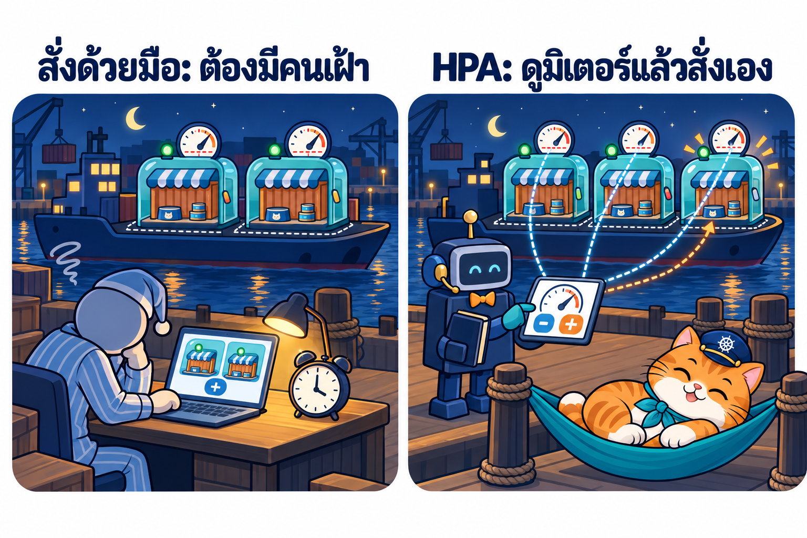<br>
  <em><b>รูปที่ 6</b> เทียบ: สั่งด้วยมือ (คนต้องตื่นมาสั่งตอนดึก) กับให้ HPA ดูมิเตอร์แล้วสั่งเองทุกรอบ</em>
</p>

| | สั่งด้วยมือ (`kubectl scale`) | HPA |
|---|---|---|
| ใครดูมิเตอร์ | คน (ต้องเปิดกราฟดูเอง) | HPA controller อ่าน Metrics API ทุก 15 วินาที |
| ใครตัดสินใจ | คน | สูตร + ค่าที่ตั้งไว้ (target, min, max, behavior) |
| ตอนดึก/วันหยุด | ต้องมีคนตื่นมาสั่ง | ทำเองทุกรอบ |
| ลืมลดกลับ | บูธเปิดค้าง | ลดเองหลังนาฬิกาทรายหมด |
| ความเร็ว | ช้าเท่าที่คนรู้ตัว | ไม่กี่สิบวินาทีหลังโหลดขึ้น (LAB 3 วัดได้ ~55 วินาทีถึง 6 บูธบนเครื่อง 4 core) |

### 2.3 HPA เป็นแบบ reactive ไม่ใช่การทำนาย

HPA **ดูมิเตอร์ที่เกิดขึ้นแล้ว** แล้วค่อยปรับ (reactive) ไม่ได้ทำนายว่าอีก 10 นาทีลูกค้าจะมา ผลคือ

- มี **ความหน่วง** เสมอ: ลูกค้าเริ่มมา → metrics-server จดรอบถัดไป (สูงสุด ~15 วินาที) → HPA อ่านรอบถัดไป (ทุก 15 วินาที) → Deployment สร้าง Pod → Pod บูตจน Ready ใน LAB ของบทนี้ CPU เริ่ม "เห็น" บนกระดานราว 25–40 วินาทีหลังเริ่มยิงโหลด
- ถ้ารู้ล่วงหน้าว่าจะมีโปรตอน 2 ทุ่ม ทางที่ปลอดภัยคือ **ยก `minReplicas` ขึ้นก่อนเวลา** (scale ตามตารางเวลา) แล้วค่อยลดกลับ HPA ไม่ได้ทำส่วนนี้ให้
- แอปที่บูตช้า (หลายนาที) จะได้ประโยชน์จาก HPA น้อยลง เพราะกว่าบูธใหม่จะพร้อม พีคอาจผ่านไปแล้ว

---

## 3. autoscaling 3 ทิศ และ KEDA

### 3.1 ภาพรวม

<p align="center" id="fig-7">
  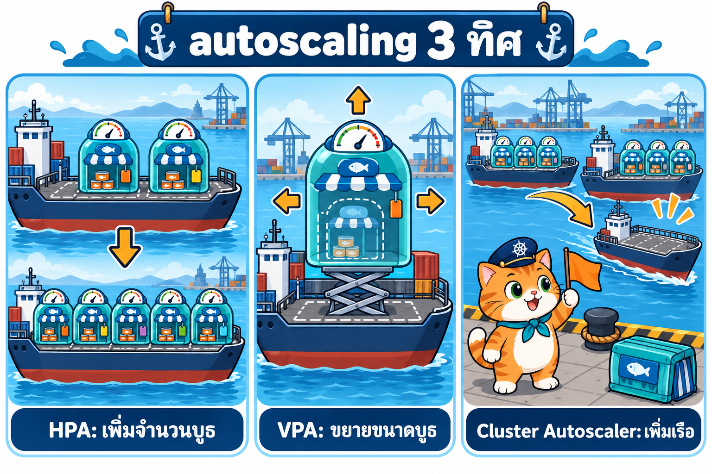<br>
  <em><b>รูปที่ 7</b> autoscaling 3 ทิศ: HPA เพิ่มจำนวนบูธ (แนวนอน), VPA ขยายขนาดบูธ (แนวตั้ง), Cluster Autoscaler เพิ่มเรือ (Node)</em>
</p>

Kubernetes มี autoscaling 3 ทิศที่ปรับ "คนละอย่าง"

| ทิศ | ตัวอย่าง | ปรับอะไร | อุปมา | อยู่ในคลัสเตอร์ kind ของเราไหม |
|---|---|---|---|---|
| แนวนอน (horizontal) | **HorizontalPodAutoscaler** | **จำนวน** Pod (`spec.replicas`) | เพิ่ม/ลดบูธ | ✅ มีในตัว (controller อยู่ใน kube-controller-manager) แต่ต้องติดตั้ง metrics-server |
| แนวตั้ง (vertical) | **VerticalPodAutoscaler** | **ขนาด** ของ Pod (requests/limits) | ขยาย/ย่อบูธ | ❌ ต้องติดตั้งเพิ่ม (โครงการ `kubernetes/autoscaler`) |
| เพิ่มเครื่อง (node) | **Cluster Autoscaler**, **Karpenter** | **จำนวน Node** | เรียกเรือลำใหม่/คืนเรือ | ❌ ใช้กับผู้ให้บริการคลาวด์ที่สร้าง VM ได้ |

นอกจากนี้ยังมี **KEDA** ที่ไม่ใช่ทิศใหม่ แต่เป็นตัวช่วยให้ HPA scale ตาม "เหตุการณ์" ภายนอกได้ (หัวข้อ 3.5)

### 3.2 HPA: เพิ่มจำนวนบูธ

<p align="center" id="fig-8">
  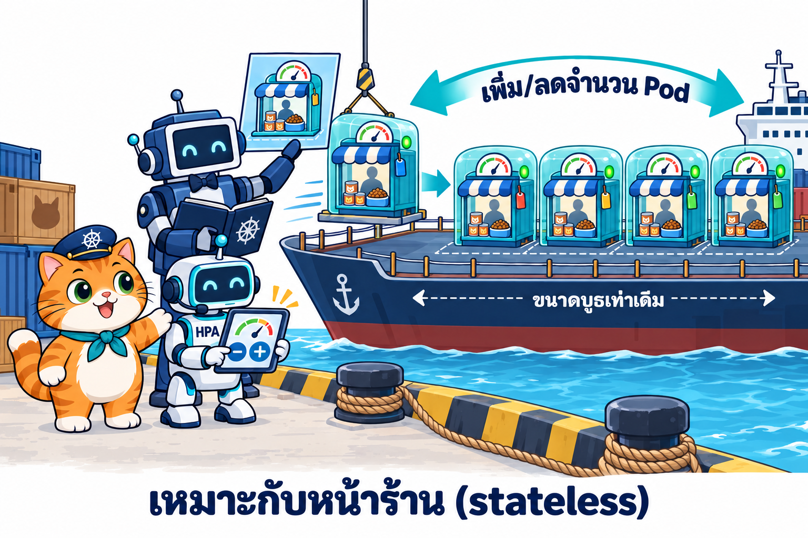<br>
  <em><b>รูปที่ 8</b> HPA (Horizontal Pod Autoscaler) = เพิ่ม/ลด 'จำนวน' Pod ของ Deployment เดิม ขนาดแต่ละบูธเท่าเดิม — เหมาะกับแอป stateless อย่างหน้าร้าน</em>
</p>

HPA ปรับ **จำนวน** Pod ของ workload เดิม แต่ละบูธมีขนาดเท่าเดิม (requests/limits ไม่เปลี่ยน) เหมาะกับงาน **stateless** ที่ทุก Pod เหมือนกันและแบ่งงานกันได้ทันทีเมื่อมีเพิ่ม เช่น หน้าร้าน `som-web`, API, worker ที่ดึงงานจากคิว เพราะ Service/Ingress จะกระจายลูกค้าไปบูธใหม่ทันทีที่ Ready

### 3.3 VPA: ขยายขนาดบูธ

<p align="center" id="fig-9">
  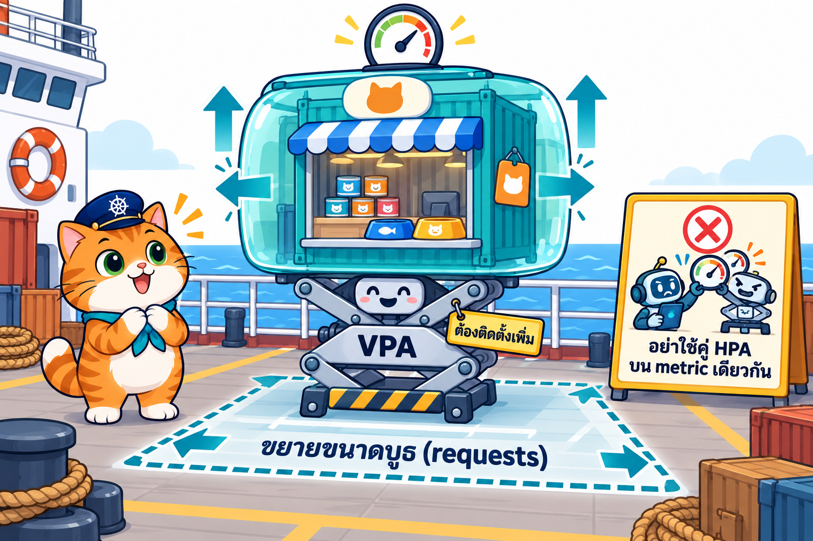<br>
  <em><b>รูปที่ 9</b> VPA (Vertical Pod Autoscaler) = ปรับ requests/limits ของ Pod (บูธใหญ่ขึ้น จำนวนเท่าเดิม) ต้องติดตั้งเพิ่ม ไม่สอน LAB บทนี้ และไม่ควรใช้คู่กับ HPA บน CPU/memory ตัวเดียวกัน</em>
</p>

**VerticalPodAutoscaler (VPA)** ดูการใช้งานย้อนหลังแล้ว **แนะนำหรือปรับ requests/limits** ให้เหมาะ (บูธใหญ่ขึ้น จำนวนเท่าเดิม) มีประโยชน์กับงานที่เพิ่มจำนวนไม่ได้ หรือเมื่อเราไม่รู้ว่าควรตั้ง requests เท่าไร (เช่น ร้านน้องส้มตั้ง `requests.cpu: 100m` จากการลองเอง)

- VPA **ไม่ได้มากับ Kubernetes** ต้องติดตั้ง CRD และ controller จากโครงการ `kubernetes/autoscaler`
- โหมดดั้งเดิมของ VPA ต้อง **สร้าง Pod ใหม่** เพื่อเปลี่ยนขนาด (บูธปิดแล้วเปิดใหม่) Kubernetes รุ่นใหม่ปรับ resources ของ container ที่รันอยู่ได้โดยไม่สร้าง Pod ใหม่ (in-place resize) VPA จึงมีโหมดที่ใช้ความสามารถนี้ได้ ลดการสะดุด
- **ไม่ควรใช้ VPA คู่กับ HPA บน CPU/memory ตัวเดียวกัน** เพราะ HPA คิด % จาก requests ถ้า VPA ขยาย requests ขึ้น % จะลดลงทันที HPA ก็ลดบูธ ทั้งสองจะดึงกันไปมา (ใช้คู่กันได้ถ้า HPA ใช้ metric อื่น เช่น request ต่อวินาที หรือให้ VPA อยู่ในโหมดแนะนำอย่างเดียว)

บทนี้ไม่มี LAB ของ VPA

### 3.4 Cluster Autoscaler และ Karpenter: เรียกเรือลำใหม่

<p align="center" id="fig-10">
  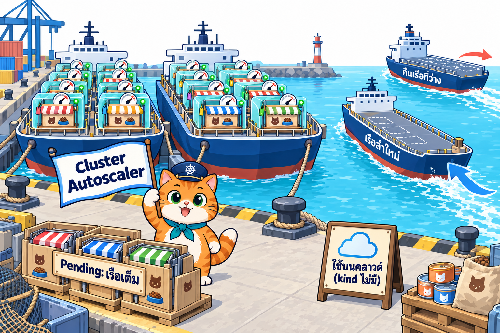<br>
  <em><b>รูปที่ 10</b> Cluster Autoscaler / Karpenter = เมื่อ Pod รอที่ท่า (Pending) เพราะเรือเต็ม จะเรียกเรือ (Node) ลำใหม่มา และคืนเรือที่ว่าง — ใช้กับคลาวด์ ไม่ใช่ kind</em>
</p>

HPA สั่งเพิ่มบูธได้ แต่ถ้า **เรือเต็ม** (Node ไม่มี CPU/memory พอสำหรับ requests ของ Pod ใหม่) Pod จะค้าง `Pending` พร้อมเหตุผล `Insufficient cpu` (บทที่ 3 และ LAB 9 ข) **Cluster Autoscaler** หรือ **Karpenter** คือผู้ที่เห็น Pod Pending แล้วสั่งผู้ให้บริการคลาวด์สร้าง Node ใหม่ และเมื่อ Node ไหนว่างนานพอก็ย้าย Pod ออกแล้วคืน Node เพื่อประหยัดเงิน

- ทำงานคู่กับ HPA ได้ดี: HPA เพิ่มบูธ → บูธ Pending → Cluster Autoscaler เพิ่มเรือ → บูธได้ที่ลง
- ต้องมี "แหล่ง Node" ที่สร้างได้อัตโนมัติ (กลุ่ม VM บน AWS/GCP/Azure ฯลฯ) **ใช้กับ kind ไม่ได้** เพราะ Node ของ kind คือ container ที่สร้างตอน `kind create cluster` เท่านั้น
- เวลาเพิ่ม Node วัดเป็นนาที (สร้าง VM + บูต + join) ช้ากว่า HPA มาก

### 3.5 KEDA: scale ตามเหตุการณ์

<p align="center" id="fig-11">
  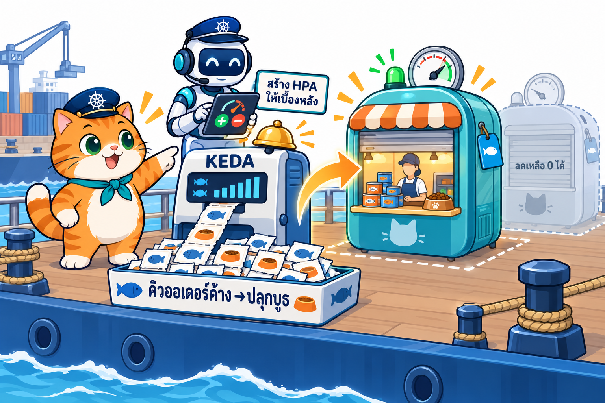<br>
  <em><b>รูปที่ 11</b> KEDA = autoscaling ตามเหตุการณ์ (เช่นคิวออเดอร์ค้าง) ปลุก Pod จาก 0 ได้ และสร้าง HPA ให้เองเบื้องหลัง (ปูทาง ไม่สอน LAB)</em>
</p>

**KEDA (Kubernetes Event-driven Autoscaling)** เป็นโครงการของ CNCF ที่ติดตั้งเพิ่ม ใช้เมื่อสัญญาณที่ควรใช้ scale **ไม่ใช่ CPU/memory** เช่น จำนวนข้อความค้างในคิว (RabbitMQ, Kafka, Redis), ผลคิวรีของ Prometheus หรือช่วงเวลา (cron)

- เราเขียน object `ScaledObject` บอกแหล่งเหตุการณ์ KEDA จะ **สร้าง HPA ให้เองเบื้องหลัง** และป้อนตัวเลขผ่าน External Metrics API
- ทำสิ่งที่ HPA ปกติทำไม่ได้: **ลดเหลือ 0 Pod** เมื่อไม่มีงาน และปลุกจาก 0 เมื่อมีงานเข้ามา (HPA ปกติ `minReplicas` ต่ำสุดคือ 1)
- บทนี้ปูทางเท่านั้น ไม่มี LAB

> **หมายเหตุ:** HPA ของ Kubernetes เองมี feature gate `HPAScaleToZero` สำหรับ `minReplicas: 0` แต่ยังไม่เปิดใช้ทั่วไป ใน v1.37 จะเห็น condition ใหม่ `ScaledToZero False NotScaledToZero` ใน `kubectl describe hpa` ทุกตัว (LAB 3) ซึ่งหมายถึง "ไม่ได้ลดเหลือ 0" เท่านั้น

---

## 4. ท่อส่งมิเตอร์ (metrics pipeline)

### 4.1 ตัวเลข CPU/memory เดินทางอย่างไร

<p align="center" id="fig-12">
  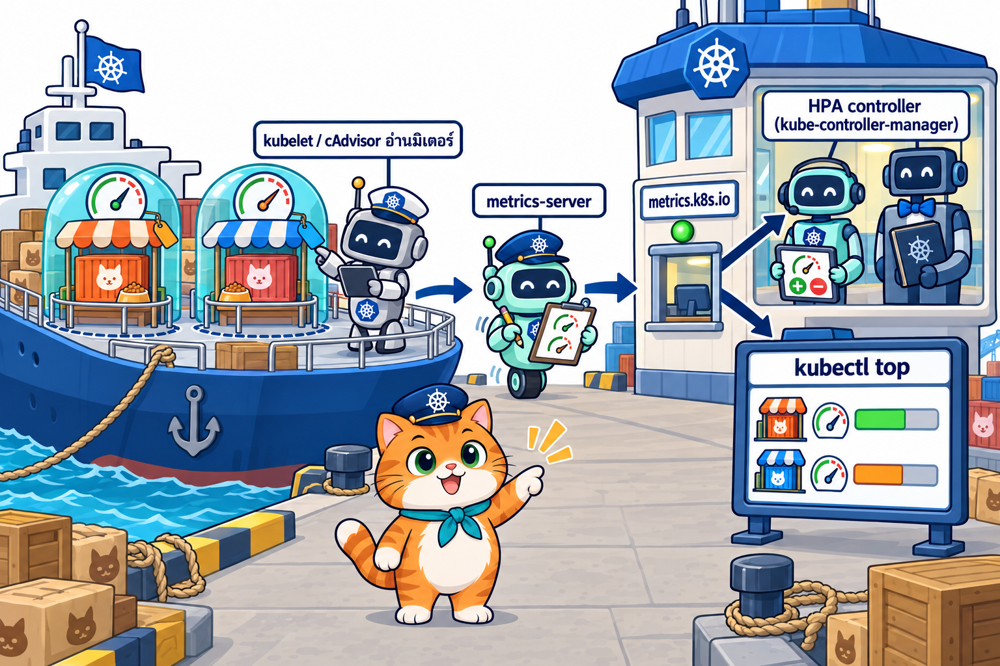<br>
  <em><b>รูปที่ 12</b> ทางเดินของตัวเลข CPU/memory: kubelet (cAdvisor ในแต่ละ Node) → metrics-server → Metrics API (metrics.k8s.io) ผ่าน kube-apiserver → HPA controller ใน kube-controller-manager และ kubectl top</em>
</p>

HPA ไม่ได้วัด CPU เอง มันถามตัวเลขจาก **Metrics API** ซึ่งต้องมีคนให้บริการ เส้นทางของตัวเลขคือ

1. **kubelet** บนทุก Node (ผ่านส่วนวัดผลของ container runtime / cAdvisor) รู้ว่าแต่ละ container ใช้ CPU/memory เท่าไร และเปิดให้ดึงที่ `https://<IP ของ Node>:10250/metrics/resource`
2. **metrics-server** (Deployment ใน `kube-system`) ไปดึงค่าจาก kubelet ทุก Node เป็นรอบ ๆ แล้วเก็บค่าล่าสุดไว้ในหน่วยความจำ
3. metrics-server ลงทะเบียนตัวเองกับ kube-apiserver เป็น **APIService `v1beta1.metrics.k8s.io`** (aggregation layer) ทำให้ API กลุ่ม `metrics.k8s.io` ใช้งานได้ผ่าน kube-apiserver เหมือน API ปกติ
4. ผู้ใช้ตัวเลข: **HPA controller** (อยู่ใน kube-controller-manager) และ **`kubectl top`**

Kubernetes **ไม่ได้ติดตั้ง metrics-server มาให้** (kind ก็ไม่มี) ก่อนติดตั้งจะได้

```text
error: Metrics API not available
Error from server (NotFound): the server could not find the requested resource
```

(บรรทัดแรกจาก `kubectl top nodes` บรรทัดที่สองจาก `kubectl get --raw /apis/metrics.k8s.io` — ผลจริงจาก LAB 1)

หลังติดตั้งจะมี resource ใหม่ 2 ชนิด

```text
NAME    SHORTNAMES   APIVERSION               NAMESPACED   KIND
nodes                metrics.k8s.io/v1beta1   false        NodeMetrics
pods                 metrics.k8s.io/v1beta1   true         PodMetrics
```

### 4.2 เจ้าหน้าที่จดมิเตอร์เดินเป็นรอบ

<p align="center" id="fig-13">
  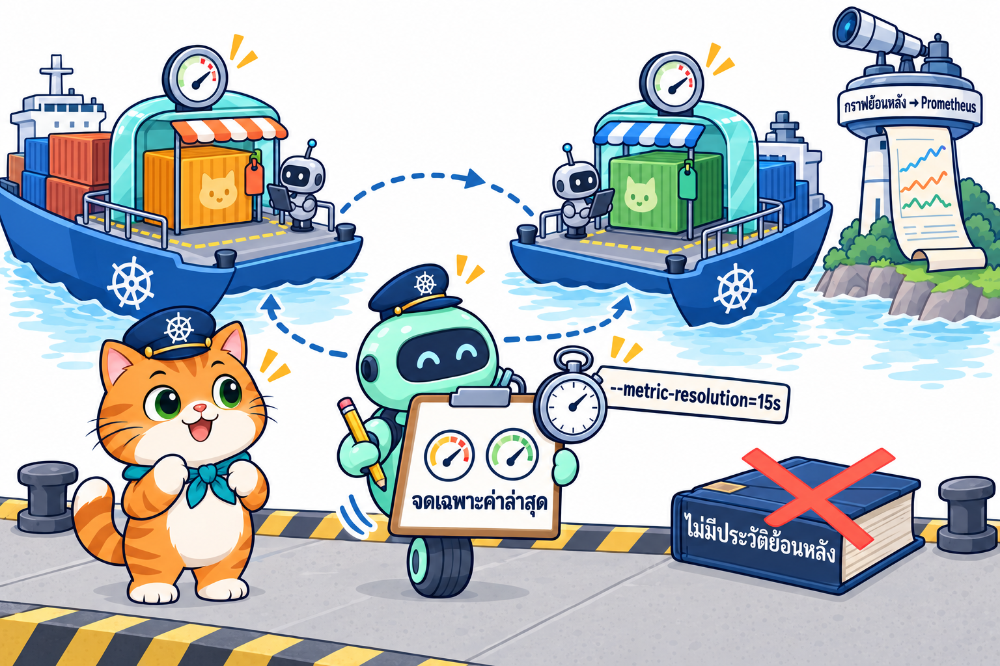<br>
  <em><b>รูปที่ 13</b> metrics-server เดินจดค่าล่าสุดจากทุก Node เป็นรอบ ๆ (--metric-resolution=15s) เก็บในหน่วยความจำเฉพาะค่าล่าสุด ไม่มีประวัติย้อนหลัง (ถ้าต้องการกราฟย้อนหลังใช้ Prometheus)</em>
</p>

- metrics-server ดึงค่าทุก `--metric-resolution=15s` (ค่าใน `components.yaml` ทางการของ v0.9.0)
- เก็บเฉพาะ **ค่าล่าสุด** ในหน่วยความจำ ไม่มีประวัติย้อนหลัง ไม่มีฐานข้อมูล ถ้า metrics-server restart ค่าก็หายแล้วเริ่มจดใหม่
- ค่า CPU คือ **อัตราการใช้เฉลี่ยในช่วงเวลาสั้น ๆ** (`window` ประมาณ 10–15 วินาที) ไม่ใช่ค่าทันที ณ วินาทีนั้น ตัวอย่าง raw จาก LAB 1

```text
{"kind":"NodeMetrics","apiVersion":"metrics.k8s.io/v1beta1","metadata":{"name":"lab-worker",...},"timestamp":"2026-10-05T15:41:27Z","window":"10.016s","usage":{"cpu":"47397663n","memory":"45...
```

  (`47397663n` = 47,397,663 nanocore ≈ 47m)

- metrics-server **ไม่ใช่ระบบ monitoring** ถ้าต้องการกราฟย้อนหลัง การแจ้งเตือน หรือ metric ของแอป (เช่นจำนวน request ต่อวินาที) ต้องใช้ระบบอย่าง Prometheus + Grafana
- ผลที่ตามมา: มิเตอร์ **ช้ากว่าความจริง** ได้ 15–30 วินาที ทั้งตอนโหลดขึ้นและตอนโหลดหาย (LAB 3–4 เห็น CPU ขึ้น/ลงบนกระดานหลังเริ่ม/หยุดโหลดราว 25–45 วินาที)

### 4.3 APIService: หน้าต่างที่ต่อเข้า kube-apiserver

<p align="center" id="fig-14">
  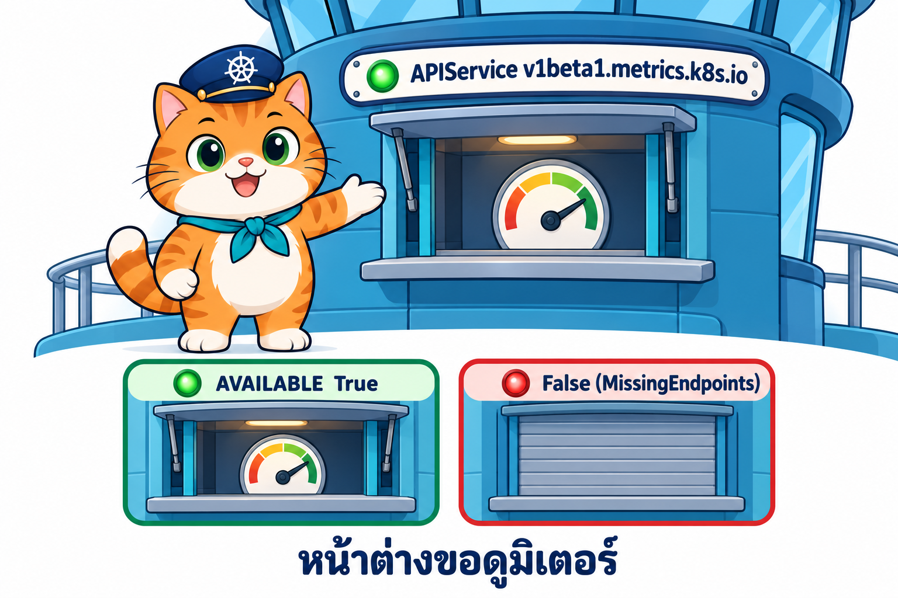<br>
  <em><b>รูปที่ 14</b> metrics-server ลงทะเบียนเป็น APIService v1beta1.metrics.k8s.io (aggregation layer) — AVAILABLE True = พร้อม, False (MissingEndpoints) = ยังไม่มี Pod พร้อม</em>
</p>

aggregation layer ทำให้ kube-apiserver "ส่งต่อ" คำขอของ API บางกลุ่มไปยัง Service อื่นได้ metrics-server ใช้กลไกนี้ ดูสถานะได้ด้วย

```bash
kubectl get apiservice v1beta1.metrics.k8s.io
```

```text
NAME                     SERVICE                      AVAILABLE                  AGE
v1beta1.metrics.k8s.io   kube-system/metrics-server   False (MissingEndpoints)   61s
```

```text
NAME                     SERVICE                      AVAILABLE   AGE
v1beta1.metrics.k8s.io   kube-system/metrics-server   True        115s
```

| AVAILABLE | ความหมาย |
|---|---|
| `True` | พร้อม — `kubectl top` และ HPA ได้ตัวเลข |
| `False (MissingEndpoints)` | Service `metrics-server` ไม่มี Pod ที่ Ready (Pod `0/1`) |
| `False (FailedDiscoveryCheck)` และอื่น ๆ | kube-apiserver ต่อไปหา metrics-server ไม่ได้ (เครือข่าย/ใบรับรอง) |

### 4.4 metrics-server บน kind และ `--kubelet-insecure-tls`

<p align="center" id="fig-15">
  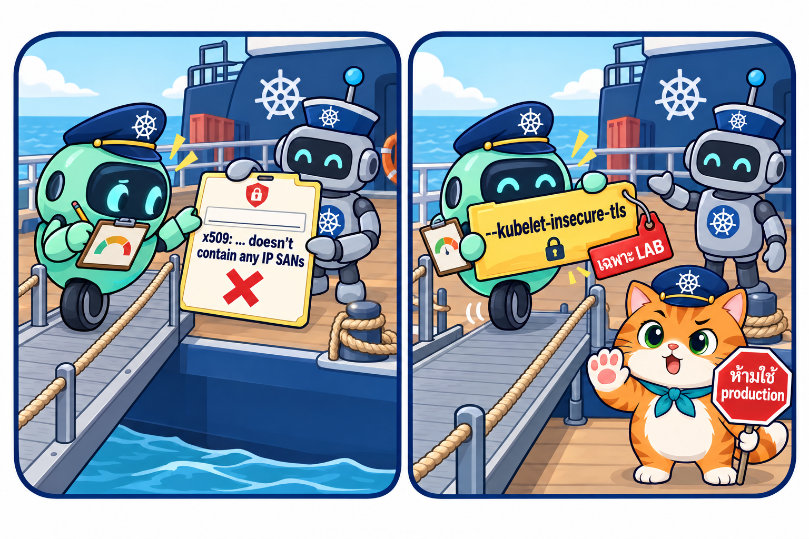<br>
  <em><b>รูปที่ 15</b> บน kind ใบรับรองของ kubelet ไม่มี IP SAN → metrics-server ต่อไม่ได้ (x509 ... doesn't contain any IP SANs) ใน LAB จึงเพิ่ม --kubelet-insecure-tls (ห้ามใช้ production)</em>
</p>

metrics-server ต่อ kubelet ด้วย HTTPS และตรวจใบรับรองของ kubelet เหมือน browser ตรวจใบของเว็บไซต์ (ทวนบทที่ 11–12: SAN ต้องมีชื่อ/IP ที่เราต่อไป) README ของ metrics-server ระบุข้อกำหนดว่า *"Kubelet certificate needs to be signed by cluster Certificate Authority (or disable certificate validation by passing `--kubelet-insecure-tls` to Metrics Server)"*

บน kind kubelet ใช้ใบรับรองแบบ **self-signed ที่ไม่มี IP ของ Node อยู่ใน SAN** ขณะที่ metrics-server ต่อด้วย IP (`--kubelet-preferred-address-types=InternalIP,...`) จึงตรวจใบไม่ผ่าน ผลจริงเมื่อใช้ `components.yaml` ต้นฉบับ (LAB 1)

```text
NAME                              READY   STATUS    RESTARTS   AGE
metrics-server-6bcd67b6cf-rcvm8   0/1     Running   0          61s
E1005 15:40:39.286511       1 scraper.go:149] "Failed to scrape node" err="Get \"https://172.19.0.4:10250/metrics/resource\": tls: failed to verify certificate: x509: cannot validate certificate for 172.19.0.4 because it doesn't contain any IP SANs" node="lab-worker2"
I1005 15:40:44.816814       1 server.go:192] "Failed probe" probe="metric-storage-ready" err="no metrics to serve"
  Warning  Unhealthy  6s (x4 over 36s)  kubelet            spec.containers{metrics-server}: Readiness probe failed: HTTP probe failed with statuscode: 500
```

ลำดับอาการ: ตรวจใบไม่ผ่าน → ไม่มีค่าเลย (`no metrics to serve`) → readiness 500 → Pod `0/1` → APIService `False (MissingEndpoints)` → `kubectl top` ยัง `Metrics API not available`

ใน LAB จึงใช้ไฟล์ `00-metrics-server.yaml` ซึ่งคือ `components.yaml` ของ release v0.9.0 ที่เพิ่ม **1 บรรทัด**

```yaml
        - --kubelet-insecure-tls              # kind: ใบรับรอง kubelet ไม่มี IP SAN (เฉพาะ LAB ห้ามใช้ production)
```

> **ห้ามใช้ `--kubelet-insecure-tls` ใน production** แฟล็กนี้ปิดการตรวจใบรับรองของ kubelet ทำให้ใครก็ตามที่ปลอมตัวเป็น kubelet ได้ป้อนตัวเลขปลอมให้ HPA ได้ ทางที่ถูกคือให้ kubelet ใช้ใบรับรองที่ **CA ของคลัสเตอร์เซ็น** และมี IP/ชื่อของ Node ใน SAN (เช่นเปิด `serverTLSBootstrap` ของ kubelet แล้วอนุมัติ CSR) คลัสเตอร์ที่ผู้ให้บริการคลาวด์ดูแลส่วนใหญ่ติดตั้ง metrics-server ที่ตั้งค่าถูกต้องมาให้แล้ว

**ทำไมเลือก metrics-server v0.9.0:** เป็นรุ่นล่าสุด ณ วันทำ LAB (ออก 13 ก.ค. 2026) และตาราง compatibility ใน README ระบุว่า `0.9.x` รองรับ Kubernetes `1.34+` (คลัสเตอร์ของเราเป็น v1.37.0) image `registry.k8s.io/metrics-server/metrics-server:v0.9.0` ขนาดราว 23 MB Node ดึงเองได้ใน ~3.5 วินาที ไม่ต้อง `kind load` และติดตั้งด้วย static manifest (ไม่ใช้ Helm ซึ่งเป็นเนื้อหาบทถัดไป)

### 4.5 kubectl top: กระดานคะแนนความเหนื่อย

<p align="center" id="fig-16">
  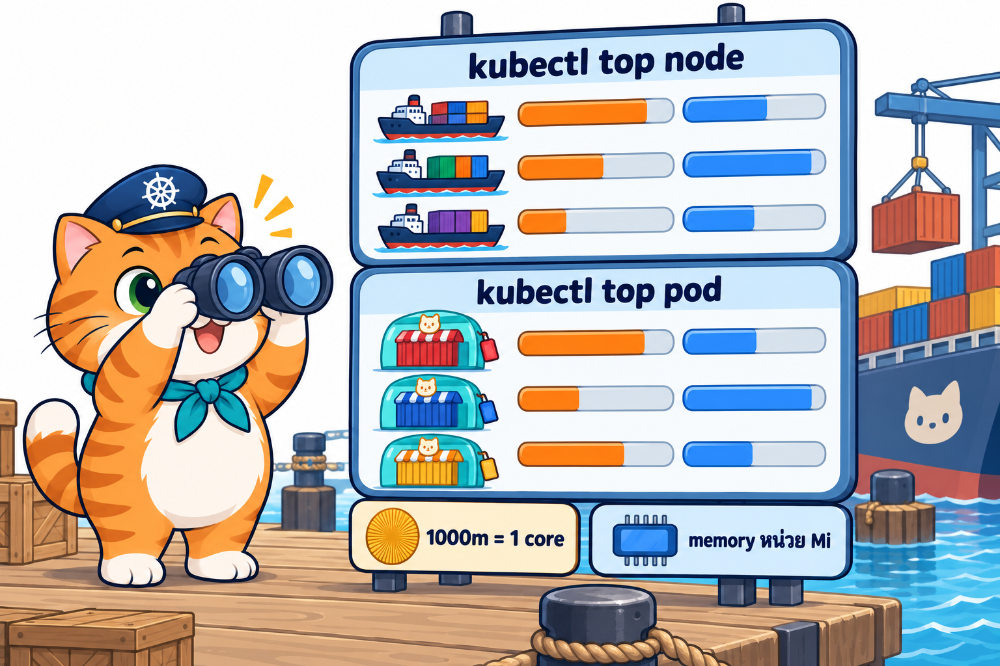<br>
  <em><b>รูปที่ 16</b> kubectl top node / kubectl top pod = กระดานคะแนนความเหนื่อยของเรือและบูธ (CPU หน่วย m = มิลลิคอร์, 1000m = 1 core; memory หน่วย Mi)</em>
</p>

```bash
kubectl top nodes
kubectl top pods -A --sort-by=cpu
kubectl top pod -n som-shop -l app=som-web
```

```text
NAME                CPU(cores)   CPU(%)   MEMORY(bytes)   MEMORY(%)
lab-control-plane   121m         0%       990Mi           1%
lab-worker          48m          0%       441Mi           0%
lab-worker2         38m          0%       522Mi           0%
```

```text
NAME                       CPU(cores)   MEMORY(bytes)
som-web-869b965df4-5hpm6   129m         57Mi
som-web-869b965df4-6c5tl   123m         47Mi
som-web-869b965df4-98b8r   124m         56Mi
```

- **CPU หน่วย `m` (millicore)** 1000m = 1 core ดังนั้น `129m` ≈ 0.13 core
- **memory หน่วย `Mi`** (mebibyte = 1024 × 1024 byte)
- `CPU(%)` ของ Node เทียบกับ **allocatable** ของ Node (ในเอกสารนี้เป็น 0–1% เพราะเครื่องทดลองจำกัด container ไว้ 4 CPU แต่ Node ของ kind ยังรายงาน allocatable เป็นจำนวน core จริงของเครื่อง บนเครื่องผู้เรียน % จะสูงกว่านี้) ส่วน **% ที่ HPA ใช้คิดเทียบกับ requests ของ Pod** ไม่เกี่ยวกับ % ของ Node (หัวข้อ 6)
- `kubectl top` ไม่ได้แสดงค่าย้อนหลัง และไม่ได้บอก requests/limits ต้องดูจาก `kubectl get pod -o yaml` หรือ `kubectl describe node`

### 4.6 ข้อความเมื่อมิเตอร์ยังไม่พร้อม

<p align="center" id="fig-17">
  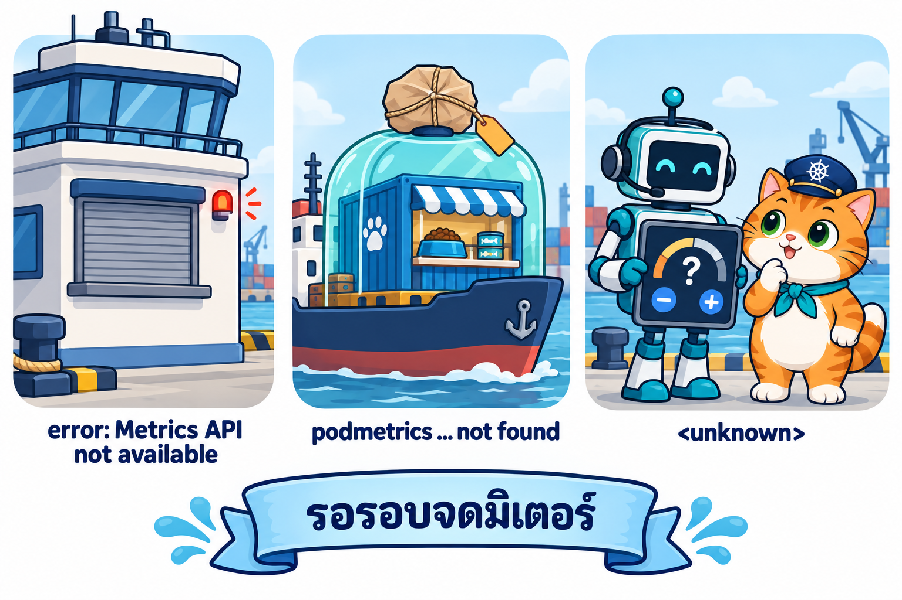<br>
  <em><b>รูปที่ 17</b> ข้อความเมื่อมิเตอร์ยังไม่พร้อม: error: Metrics API not available (ยังไม่ติดตั้ง/ยังไม่พร้อม), podmetrics ... not found (Pod เพิ่งเกิด ยังไม่ถูกจด), TARGETS &lt;unknown&gt;</em>
</p>

**ตารางที่ 2** ข้อความ 3 แบบที่จะเจอบ่อย

| ข้อความ | เกิดตอนไหน | ทำอย่างไร |
|---|---|---|
| `error: Metrics API not available` (`kubectl top`) | ยังไม่ติดตั้ง metrics-server หรือติดตั้งแล้วแต่ APIService ยัง `False` | ติดตั้ง/แก้ metrics-server แล้วรอ ~30 วินาที |
| `Error from server (NotFound): podmetrics.metrics.k8s.io "hpa-demo/fresh" not found` | Pod เพิ่งเกิด metrics-server ยังไม่ได้จดรอบที่มี Pod นี้ (ทดลองได้ ~15 วินาที) | รอรอบถัดไป |
| `cpu: <unknown>/50%` ในคอลัมน์ TARGETS ของ HPA | Pod เพิ่งเกิด/HPA เพิ่งสร้าง (ปกติหายใน ~30 วินาที) **หรือ** ไม่มี requests (ไม่หายเลย — หัวข้อ 6.3) | ดู `kubectl describe hpa` ส่วน Conditions/Events |

ช่วงแรกของ HPA ทุกตัวจะเห็น Event นี้ เป็นเรื่องปกติ

```text
  Warning  FailedGetResourceMetric       21s   horizontal-pod-autoscaler  failed to get cpu utilization: unable to get metrics for resource cpu: no metrics returned from resource metrics API
```

---

## 5. HPA object (autoscaling/v2)

### 5.1 HPA เป็น control loop

<p align="center" id="fig-18">
  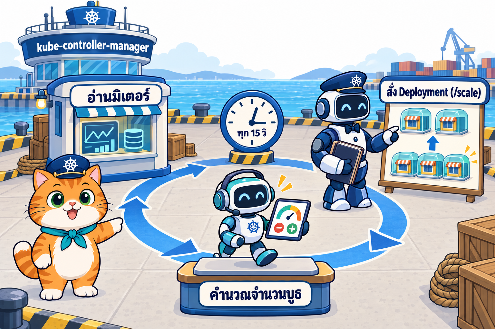<br>
  <em><b>รูปที่ 18</b> HPA เป็น control loop ใน kube-controller-manager: ทุก 15 วิ อ่านมิเตอร์ → คำนวณจำนวนที่ควรมี → สั่ง scale Deployment (ผ่าน /scale) — ไม่ได้สร้าง Pod เอง</em>
</p>

HPA เป็นทั้ง **object** (`HorizontalPodAutoscaler` ใน API กลุ่ม `autoscaling`) และ **controller** ที่อยู่ใน kube-controller-manager ทุก ๆ **15 วินาที** (ค่าเริ่มต้นของ `--horizontal-pod-autoscaler-sync-period`) controller จะทำงานรอบหนึ่งกับ HPA ทุกตัว

1. อ่าน `scaleTargetRef` ว่าดูแลใคร แล้วหา Pod ของเป้าหมายจาก selector
2. ถาม Metrics API ว่า Pod เหล่านั้นใช้ CPU/memory เท่าไร
3. คำนวณจำนวนที่ควรมีด้วยสูตร (หัวข้อ 7) แล้วกรองด้วย `behavior` และ min/max
4. ถ้าต่างจากปัจจุบัน แก้ **`/scale` subresource** ของเป้าหมาย (เท่ากับแก้ `spec.replicas` ของ Deployment)

**HPA ไม่ได้สร้างหรือลบ Pod เอง** มันแค่บอกผู้จัดการร้าน (Deployment) ว่า "ควรมี 6 บูธ" แล้ว Deployment → ReplicaSet → scheduler → kubelet ทำงานต่อตามปกติ ดังนั้นทุกอย่างที่เรียนมา (rolling update, readinessProbe, ResourceQuota, Pending) ยังมีผลกับ Pod ที่เพิ่มขึ้นทุกตัว

Event ที่ HPA เขียนทุกครั้งที่เปลี่ยนจำนวน (ผลจริง LAB 3)

```text
  Normal   SuccessfulRescale             2m1s   horizontal-pod-autoscaler  New size: 4; reason: cpu resource utilization (percentage of request) above target
  Normal   SuccessfulRescale             105s   horizontal-pod-autoscaler  New size: 6; reason: cpu resource utilization (percentage of request) above target
```

### 5.2 โครง YAML

<p align="center" id="fig-19">
  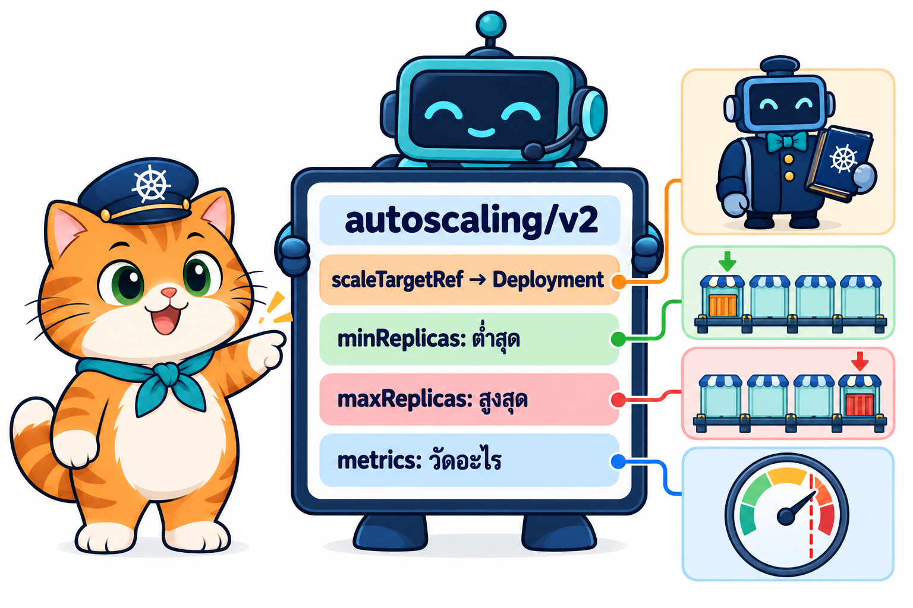<br>
  <em><b>รูปที่ 19</b> โครง YAML: apiVersion autoscaling/v2, scaleTargetRef (ชี้ Deployment), minReplicas, maxReplicas, metrics (type Resource, cpu, Utilization)</em>
</p>

ไฟล์ `02_LAB/lab02-first/20-hpa-php.yaml` (ทดสอบแล้วว่า spec เท่ากับที่ `kubectl autoscale` สร้าง)

```yaml
# LAB 2: HPA แบบ YAML (เท่ากับ kubectl autoscale deployment php-apache --cpu=50% --min=1 --max=6)
apiVersion: autoscaling/v2
kind: HorizontalPodAutoscaler
metadata:
  name: php-apache
  namespace: hpa-demo
spec:
  scaleTargetRef:              # ใครคือเป้าหมาย (ต้องมี subresource /scale: Deployment, StatefulSet, ReplicaSet)
    apiVersion: apps/v1
    kind: Deployment
    name: php-apache
  minReplicas: 1
  maxReplicas: 6
  metrics:
    - type: Resource
      resource:
        name: cpu
        target:
          type: Utilization    # % ของ requests.cpu (100m) → 50% = เฉลี่ย 50m ต่อ Pod
          averageUtilization: 50
```

| ฟิลด์ | ความหมาย |
|---|---|
| `apiVersion: autoscaling/v2` | รุ่นปัจจุบัน (stable) รองรับหลาย metric และ `behavior` |
| `scaleTargetRef` | เป้าหมาย (`apiVersion`, `kind`, `name`) อยู่ใน namespace เดียวกับ HPA |
| `minReplicas` | จำนวนต่ำสุด (ไม่ใส่ = 1) |
| `maxReplicas` | จำนวนสูงสุด (บังคับใส่) |
| `metrics` | รายการ metric และเป้าของแต่ละตัว |
| `behavior` | (ไม่บังคับ) ความเร็วเพิ่ม/ลด — หัวข้อ 8 |

สร้างแบบคำสั่งได้เร็วกว่า

```bash
kubectl -n hpa-demo autoscale deployment php-apache --cpu=50% --min=1 --max=6
```

```text
horizontalpodautoscaler.autoscaling/php-apache autoscaled
NAME         REFERENCE               TARGETS              MINPODS   MAXPODS   REPLICAS   AGE
php-apache   Deployment/php-apache   cpu: <unknown>/50%   1         6         1          0s
```

> **kubectl 1.37 ใช้ `--cpu=50%`** (และ `--memory` สำหรับ memory) ตำราและบทความเก่าใช้ `--cpu-percent=50` ซึ่ง kubectl รุ่นที่ใช้ในวิชานี้ไม่มีแล้ว ตรวจได้ด้วย `kubectl autoscale --help`

ผลของ `kubectl get hpa` อ่านแบบนี้: `TARGETS` = ค่าปัจจุบัน/เป้า, `MINPODS`/`MAXPODS` = ราง, `REPLICAS` = จำนวนที่ HPA เห็นล่าสุด (ช้ากว่าจำนวน Pod ที่ Ready จริงได้ 5–15 วินาที เพราะ status อัปเดตในรอบถัดไป)

`kubectl describe hpa` มี **Conditions** 3 ตัวที่ต้องอ่านเป็น (+1 ตัวใหม่ใน v1.37)

```text
Conditions:
  Type            Status  Reason               Message
  ----            ------  ------               -------
  AbleToScale     True    ScaleDownStabilized  recent recommendations were higher than current one, applying the highest recent recommendation
  ScalingActive   True    ValidMetricFound     the HPA was able to successfully calculate a replica count from cpu resource utilization (percentage of request)
  ScalingLimited  True    TooManyReplicas      the desired replica count is more than the maximum replica count
  ScaledToZero    False   NotScaledToZero      the HPA controller did not scale the workload to zero
```

| Condition | ถาม | ค่าที่พบใน LAB |
|---|---|---|
| `AbleToScale` | แก้ `/scale` ของเป้าหมายได้ไหม / ติดนาฬิกาทรายไหม | `ReadyForNewScale`, `SucceededGetScale`, `ScaleDownStabilized` |
| `ScalingActive` | อ่าน metric และคำนวณได้ไหม | `ValidMetricFound`, `FailedGetResourceMetric` |
| `ScalingLimited` | ผลที่คำนวณได้ชนราง min/max ไหม | `DesiredWithinRange`, `TooManyReplicas`, `TooFewReplicas` |
| `ScaledToZero` | ลดเหลือ 0 หรือไม่ (v1.37) | `NotScaledToZero` |

`autoscaling/v1` เป็นรุ่นเก่าที่รองรับเฉพาะ CPU (`targetCPUUtilizationPercentage`) ยังใช้ได้แต่ไม่ควรเขียนใหม่ object เดียวกันอ่านได้ทั้งสองรุ่น

### 5.3 scaleTargetRef: HPA คุยกับผู้จัดการ ไม่ได้คุยกับบูธ

<p align="center" id="fig-20">
  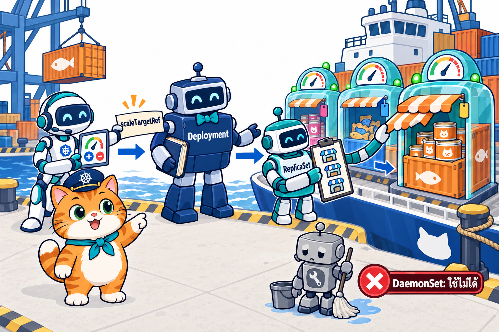<br>
  <em><b>รูปที่ 20</b> scaleTargetRef ชี้ไปที่ของที่มี /scale (Deployment, ReplicaSet, StatefulSet) HPA คุยกับผู้จัดการ ไม่ได้คุยกับบูธโดยตรง — DaemonSet ใช้ไม่ได้</em>
</p>

`scaleTargetRef` ต้องชี้ไปที่ resource ที่มี **`/scale` subresource** ได้แก่ **Deployment**, **ReplicaSet**, **StatefulSet** (และ custom resource ที่ประกาศ `/scale`) ใช้กับ **DaemonSet ไม่ได้** เพราะ DaemonSet ไม่มีจำนวน (1 Pod ต่อ Node เสมอ) และไม่ควรชี้ไปที่ Pod ตรง ๆ เพราะ Pod เดี่ยวไม่มีใครสร้างแทน

- ใช้กับ Deployment แทน ReplicaSet เสมอ (ถ้าชี้ ReplicaSet การ rolling update จะสร้าง ReplicaSet ใหม่ที่ HPA ไม่รู้จัก)
- **1 workload ควรมี HPA เดียว** ถ้ามี HPA สองตัวชี้ Pod ชุดเดียวกัน ทั้งคู่จะแย่งกันแก้จำนวน เอกสาร HPA ทางการระบุว่า controller จะไม่ scale และรายงานเหตุผล `AmbiguousSelector` (ไม่ได้ทดลองใน LAB)

### 5.4 minReplicas และ maxReplicas: รางบูธ

<p align="center" id="fig-21">
  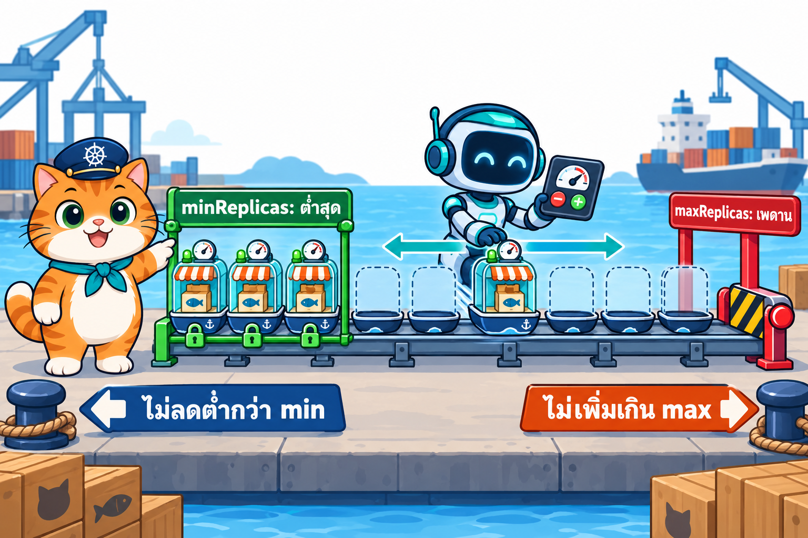<br>
  <em><b>รูปที่ 21</b> minReplicas = บูธต่ำสุดที่ต้องเปิดเสมอ (กันร้านว่าง), maxReplicas = เพดานที่ท่าเรือรับได้ (กันค่าใช้จ่าย/ทรัพยากรระเบิด) — HPA ไม่ลดต่ำกว่า min ไม่เพิ่มเกิน max</em>
</p>

- **`minReplicas`** กันร้านว่าง/บูธน้อยเกินไปตอนเงียบ หน้าร้านจริงควร **≥ 2** เพื่อให้ยังมีบูธรับลูกค้าเมื่อ Node หนึ่งล่มหรือระหว่าง rolling update ร้านน้องส้มใช้ `minReplicas: 2`
- **`maxReplicas`** กันค่าใช้จ่ายและทรัพยากรระเบิด ถ้ามีบั๊กที่ทำให้ CPU พุ่ง หรือโดนยิงโหลดผิดปกติ HPA จะไม่เพิ่มเกินค่านี้ ควรตั้งไม่เกินที่ Node และ ResourceQuota รับได้ (หัวข้อ 9.6)
- เมื่อสูตรคิดได้เกิน/ต่ำกว่าราง HPA ใช้ค่าราง แล้วแสดง `ScalingLimited True TooManyReplicas` หรือ `TooFewReplicas` (ผลจริง LAB 11: CPU 12% สูตรอยากได้ 1 แต่ `minReplicas: 2`)

```text
  ScalingLimited  True    TooFewReplicas    the desired replica count is less than the minimum replica count
```

- ถ้าจำนวนปัจจุบัน **ต่ำกว่า min** อยู่แล้ว (เช่นเพิ่งสร้าง Deployment ที่มี 1 Pod) HPA จะดึงขึ้นเป็น min ทันทีโดยไม่ดู metric (Event `Current number of replicas below Spec.MinReplicas`)

### 5.5 ชนิดของ metric

<p align="center" id="fig-22">
  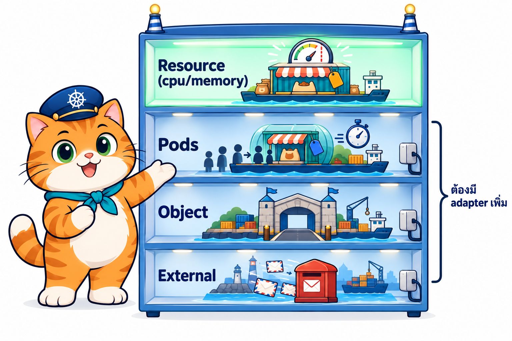<br>
  <em><b>รูปที่ 22</b> ชนิด metric ใน autoscaling/v2: Resource (cpu/memory ของ Pod — ใช้ในบทนี้), ContainerResource, Pods (ค่าเฉลี่ยต่อ Pod เช่น request/วินาที), Object (ค่าของวัตถุอื่น เช่น Ingress), External (นอกคลัสเตอร์ เช่นคิว) — 3 แบบหลังต้องมี adapter</em>
</p>

**ตารางที่ 3** ชนิด metric ใน `autoscaling/v2`

| `type` | วัดอะไร | ตัวอย่าง | ต้องติดตั้งอะไร |
|---|---|---|---|
| `Resource` | cpu/memory **เฉลี่ยของทุก container ใน Pod** | CPU 50% ของ requests | metrics-server (บทนี้) |
| `ContainerResource` | cpu/memory ของ **container ที่ระบุชื่อ** ใน Pod | ดูเฉพาะ container `web` ไม่นับ sidecar | metrics-server |
| `Pods` | ค่าเฉลี่ยต่อ Pod ของ metric ของแอป | request ต่อวินาทีต่อ Pod | custom metrics adapter (เช่น Prometheus Adapter) |
| `Object` | ค่าของ object อื่นในคลัสเตอร์ | request ต่อวินาทีของ Ingress | custom metrics adapter |
| `External` | ค่าจากนอกคลัสเตอร์ | จำนวนข้อความในคิวของคลาวด์ | external metrics adapter (เช่น KEDA) |

`Resource` และ `ContainerResource` ใช้ Metrics API (`metrics.k8s.io`) จาก metrics-server ส่วน 3 แบบหลังใช้ `custom.metrics.k8s.io` / `external.metrics.k8s.io` ซึ่งต้องมี adapter ให้บริการ บทนี้ใช้เฉพาะ `Resource`

### 5.6 Utilization กับ AverageValue (และ Value)

<p align="center" id="fig-23">
  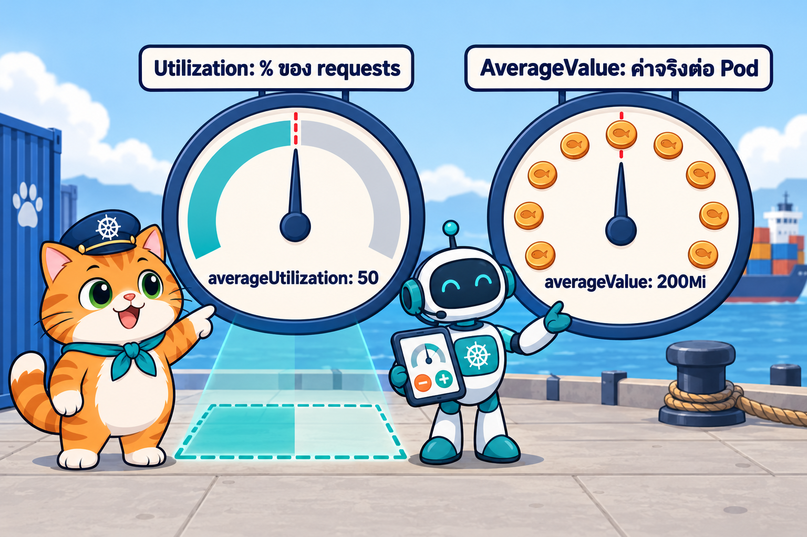<br>
  <em><b>รูปที่ 23</b> target แบบ Utilization (เปอร์เซ็นต์ของ requests เฉลี่ยทุก Pod) กับ AverageValue (ค่าจริงเฉลี่ยต่อ Pod เช่น 50m หรือ 200Mi ไม่ต้องอิง requests)</em>
</p>

| `target.type` | ใช้กับ | หน่วย | ตัวอย่าง | ต้องมี requests ไหม |
|---|---|---|---|---|
| `Utilization` | Resource, ContainerResource | % ของ requests (เฉลี่ยทุก Pod) | `averageUtilization: 50` | **ต้องมี** |
| `AverageValue` | ทุกชนิด | ค่าจริงเฉลี่ยต่อ Pod | `averageValue: 6Mi`, `averageValue: 50m` | ไม่ต้อง |
| `Value` | Object, External | ค่ารวมค่าเดียว | `value: 100` | ไม่ต้อง |

ตัวอย่าง metric memory แบบ `AverageValue` จาก LAB 8 (`02_LAB/lab08-multi/80-hpa-multi.yaml`)

```yaml
  metrics:
    - type: Resource
      resource: {name: cpu, target: {type: Utilization, averageUtilization: 50}}
    - type: Resource
      resource:
        name: memory
        target:
          type: AverageValue
          averageValue: 6Mi
```

`Utilization` ดีตรงที่ "ปรับตามขนาดบูธ" ถ้าวันหนึ่งเปลี่ยน requests เป้า 50% ก็ยังมีความหมายเดิม ส่วน `AverageValue` เหมาะเมื่อรู้ค่าที่บูธหนึ่งรับไหวเป็นตัวเลขตรง ๆ

---

## 6. requests และ % ความเหนื่อย

### 6.1 utilization = ใช้จริง ÷ requests

<p align="center" id="fig-24">
  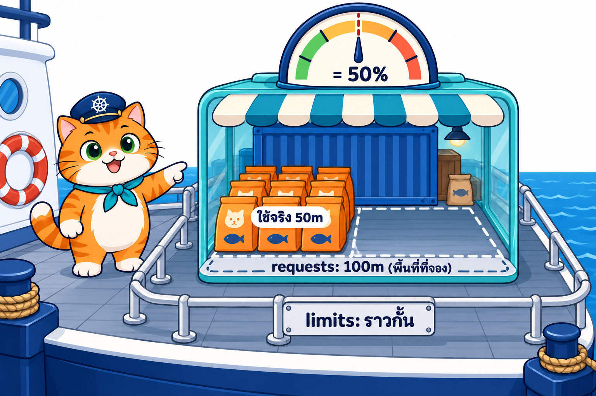<br>
  <em><b>รูปที่ 24</b> utilization = ใช้จริง ÷ requests: บูธจองพื้นที่ 100m ใช้จริง 50m = 50% — HPA ใช้ requests เป็นฐาน 100% (ไม่ใช่ limits ไม่ใช่ทั้ง Node)</em>
</p>

สำหรับ `type: Utilization`

```text
utilization ของ Pod = usage ของ Pod ÷ requests ของ Pod × 100%
currentUtilization  = ค่าเฉลี่ยของทุก Pod ที่นับได้
```

ตัวอย่าง: `requests.cpu: 100m` ใช้จริง `50m` = **50%** ถ้า target 50% แปลว่าเราอยากให้แต่ละบูธใช้ CPU เฉลี่ยราว 50m

**ฐาน 100% คือ requests** ไม่ใช่ limits และไม่ใช่ CPU ทั้ง Node ข้อนี้สำคัญเพราะ

- requests เป็นสิ่งที่ scheduler ใช้จองที่บน Node (บทที่ 3) จึงเป็น "ขนาดบูธ" ที่ทุกส่วนของระบบใช้ตรงกัน
- ถ้าตั้ง requests เล็กเกินจริง % จะสูงตลอด HPA เพิ่มบูธเกินจำเป็น ถ้าตั้งใหญ่เกิน % จะต่ำตลอด HPA ไม่ยอมเพิ่มแม้บูธจะเหนื่อยแล้ว

### 6.2 % เกิน 100 ได้

<p align="center" id="fig-25">
  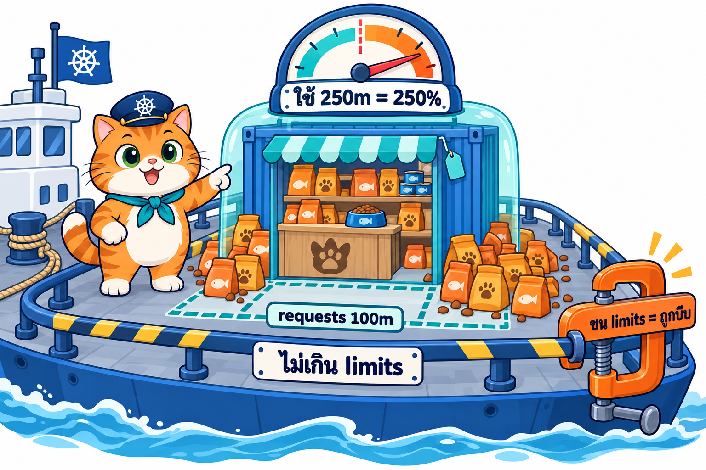<br>
  <em><b>รูปที่ 25</b> utilization เกิน 100% ได้ถ้าใช้เกิน requests แต่ไม่เกิน limits เช่น requests 100m ใช้ 250m = 250% (ใน LAB เห็นจริง 206–370%) ถ้าชน limits จะถูกบีบ (throttle)</em>
</p>

ถ้า container มี `limits` สูงกว่า `requests` บูธใช้เกินที่จองได้ (ถ้า Node มีที่ว่าง) จึงเห็น % เกิน 100 เป็นเรื่องปกติ ผลจริงใน LAB

| LAB | requests / limits | ที่เห็น |
|---|---|---|
| 3 php-apache 1 Pod | 100m / 300m | `301%/50%` (ใช้ ~300m = ชน limits) |
| 11 หน้าร้าน 2 บูธ (customers=1) | 100m / 500m | `206%` → `370%/50%` |
| 11 หน้าร้าน 6 บูธ (customers=2) | 100m / 500m | นิ่ง ~240% (~240m ต่อบูธ) |

เมื่อ CPU ชน `limits` container จะ **ถูกบีบ (throttle)** ทำงานได้ไม่เกินเพดาน ไม่ถูกฆ่า (ต่างจาก memory ที่เกิน limits = OOMKilled) ในกรณีนี้ % จะค้างที่ limits ÷ requests (300% สำหรับ php-apache) ทำให้ HPA ประเมินโหลดจริง "ต่ำกว่าความจริง" ได้ แต่ยังพอให้ HPA รู้ว่าต้องเพิ่มบูธ

### 6.3 ไม่มี requests = `<unknown>`

<p align="center" id="fig-26">
  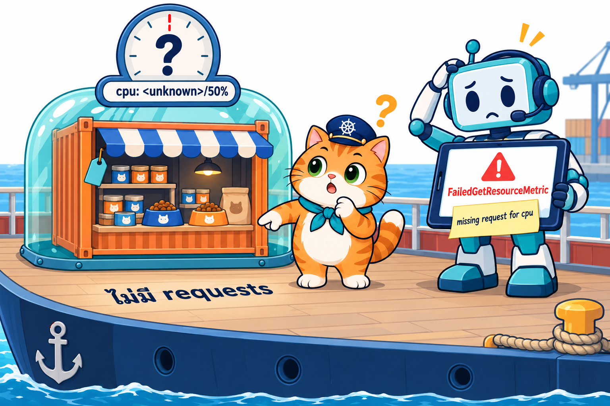<br>
  <em><b>รูปที่ 26</b> ไม่มี requests.cpu = คิด % ไม่ได้ → TARGETS cpu: &lt;unknown&gt;/50%, ScalingActive False, FailedGetResourceMetric: missing request for cpu in container ...</em>
</p>

ถ้า container ไม่มี `requests.cpu` HPA แบบ `Utilization` **หารไม่ได้** ผลจริง LAB 5 (`50-no-requests.yaml`)

```text
NAME    REFERENCE          TARGETS              MINPODS   MAXPODS   REPLICAS   AGE
nores   Deployment/nores   cpu: <unknown>/50%   1         4         1          47s
Conditions:
  Type           Status  Reason                   Message
  ----           ------  ------                   -------
  AbleToScale    True    SucceededGetScale        the HPA controller was able to get the target's current scale
  ScalingActive  False   FailedGetResourceMetric  the HPA was unable to compute the replica count: failed to get cpu utilization: missing request for cpu in container php-apache of Pod nores-c8675d8cb-pjmmz
```

ต่างจาก `<unknown>` ช่วงแรกของ HPA ปกติ (หัวข้อ 4.6) ตรงที่ **รอเท่าไรก็ไม่หาย** และ HPA จะไม่ทำอะไรเลยแม้ลูกค้าล้น แก้โดยใส่ requests (ใน LAB ใช้ `kubectl set resources --requests=cpu=100m` แล้วได้ % ใน ~30 วินาที ระบบจริงต้องแก้ไฟล์ YAML ด้วย)

- namespace ที่มี **LimitRange** ตั้ง `defaultRequest` (บทที่ 4) จะเติม requests ให้ container ที่ไม่ได้ใส่ HPA จึงคิด % ได้ แต่ค่าตั้งต้นอาจไม่ตรงกับแอป
- **Pod หลาย container** (เช่น web + sidecar) `type: Resource` คิดจาก **ผลรวม usage ÷ ผลรวม requests ของทุก container** ถ้า container ใดไม่มี requests ก็ได้ `missing request` เหมือนกัน และ sidecar ที่ใช้ CPU คงที่จะเจือจาง % ของ container หลัก ถ้าอยากดูเฉพาะ container หลักใช้ `type: ContainerResource`
- **init container ไม่ถูกนับ** เพราะจบก่อน container หลักเริ่ม

---

## 7. สูตรคิดจำนวนบูธ

### 7.1 สูตรขาขึ้น

<p align="center" id="fig-27">
  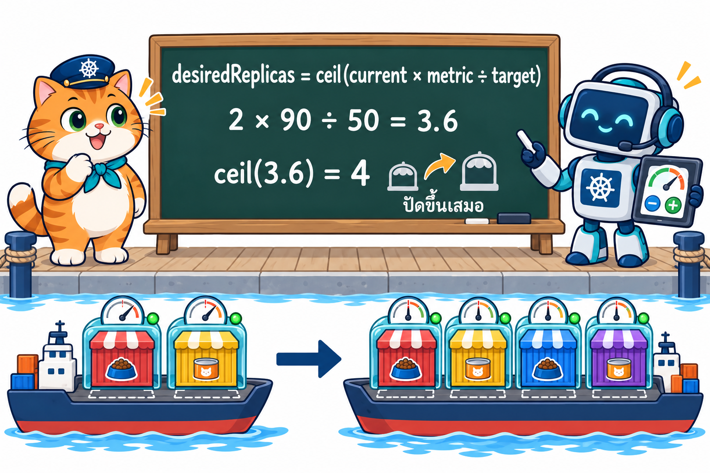<br>
  <em><b>รูปที่ 27</b> สูตร desiredReplicas = ceil(currentReplicas × currentMetric ÷ target) เช่น 2 Pod เฉลี่ย 90% target 50% → ceil(3.6) = 4</em>
</p>

```text
desiredReplicas = ceil[ currentReplicas × ( currentMetricValue ÷ desiredMetricValue ) ]
```

`ceil` = ปัดขึ้นเป็นจำนวนเต็มเสมอ (3.01 → 4) เพราะบูธครึ่งบูธไม่มี

ตัวอย่าง: 2 Pod เฉลี่ย 90% target 50% → `ceil(2 × 90 ÷ 50) = ceil(3.6) = 4` แปลว่า "ถ้ามี 4 บูธ แต่ละบูธจะเหลือราว 45% ใกล้เส้น 50%" สูตรนี้สมมติว่าโหลดรวมคงที่แล้วแบ่งเท่ากัน (2 × 90 = 180 หน่วย ÷ 4 = 45)

ผลจริงจาก LAB 6 (`formula.sh` อ่าน status ของ HPA มาคิดเทียบทุก 15 วินาที — ตรงทุกรอบ)

```text
--- 30 วิ
currentReplicas=1  currentUtilization=200%  target=50%
สูตร: ceil(1 × 200 / 50) = ceil(4.00) = 4
HPA สั่งจริง desiredReplicas=4
--- 45 วิ
currentReplicas=4  currentUtilization=299%  target=50%
สูตร: ceil(4 × 299 / 50) = ceil(23.92) = 24  → เกิน maxReplicas 6 จึงได้ 6
HPA สั่งจริง desiredReplicas=6
```

สังเกตรอบ 45 วินาที: 4 Pod ที่ 299% (ช่วงที่บูธใหม่ยังไม่รับงาน ทุกบูธเดิมเหนื่อยเต็มที่) สูตรอยากได้ 24 แต่ `maxReplicas` ตัดเหลือ 6

### 7.2 สูตรขาลง

<p align="center" id="fig-28">
  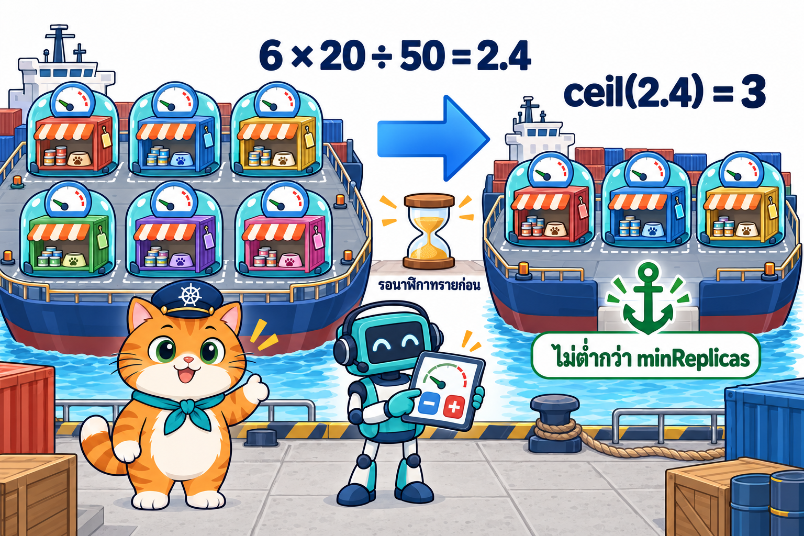<br>
  <em><b>รูปที่ 28</b> ตอนลด: 6 Pod เฉลี่ย 20% target 50% → ceil(6 × 20 ÷ 50) = ceil(2.4) = 3 (แล้วยังต้องรอนาฬิกาทราย + ไม่ต่ำกว่า minReplicas)</em>
</p>

สูตรเดียวกัน: 6 Pod เฉลี่ย 20% target 50% → `ceil(6 × 20 ÷ 50) = ceil(2.4) = 3` แต่ HPA จะยังไม่ลดทันที ต้อง

1. ผ่าน **นาฬิกาทราย** ของ scaleDown (ค่าเริ่มต้น 300 วินาที — หัวข้อ 8)
2. ผ่าน **policies** ของ scaleDown (ลดได้เท่าไรต่อช่วงเวลา)
3. ไม่ต่ำกว่า **`minReplicas`**

ผลจริงขาลงของ LAB 7 (`70-hpa-slow-up.yaml`): CPU 35% บน 6 Pod → `ceil(6 × 35 ÷ 50) = ceil(4.2) = 5` HPA จึงลด 6 → 5 ก่อน แล้วเมื่อ CPU ตกเหลือ 1% จึงลดต่อ 5 → 2 → 1

### 7.3 tolerance 10%

<p align="center" id="fig-29">
  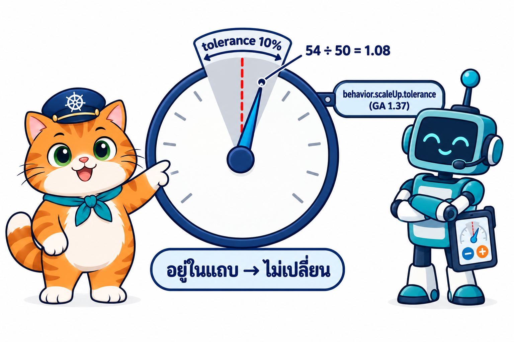<br>
  <em><b>รูปที่ 29</b> tolerance 10%: อัตราส่วน metric/target อยู่ระหว่าง 0.9–1.1 ไม่เปลี่ยน เช่น 54/50 = 1.08 → คงเดิม; k8s 1.37 ตั้ง behavior.scaleUp/scaleDown.tolerance ได้แล้ว (GA)</em>
</p>

ถ้าอัตราส่วน `currentMetric ÷ target` อยู่ใน **0.9–1.1** (ห่างจากเป้าไม่เกิน 10%) HPA **ไม่เปลี่ยนจำนวน** เพื่อไม่ให้ขยับบ่อยจากความแกว่งเล็กน้อย เช่น 6 Pod เฉลี่ย 54% → 54 ÷ 50 = 1.08 → คงเดิม (ถ้าคิดสูตรตรง ๆ จะได้ `ceil(6.48) = 7`)

- tolerance เริ่มต้นตั้งทั้งคลัสเตอร์ด้วยแฟล็ก `--horizontal-pod-autoscaler-tolerance` ของ kube-controller-manager (0.1)
- **Kubernetes v1.37:** feature `HPAConfigurableTolerance` เป็น stable แล้ว ตั้ง tolerance แยกต่อ HPA และแยกขาขึ้น/ขาลงได้ที่ `behavior.scaleUp.tolerance` / `behavior.scaleDown.tolerance` ผลจริงจากคลัสเตอร์ v1.37.0

```text
FIELD: tolerance <Quantity>

DESCRIPTION:
    tolerance is the tolerance on the ratio between the current and desired
    metric value under which no updates are made to the desired number of
    replicas (e.g. 0.01 for 1%). Must be greater than or equal to zero. If not
    set, the default cluster-wide tolerance is applied (by default 10%).
```

  ตั้ง `tolerance: "0.05"` แล้วระบบเก็บเป็น Quantity `"tolerance":"50m"` (0.05 = 50 milli) ตัวอย่างการใช้: ให้ขาขึ้นไวขึ้น (tolerance เล็ก) แต่ขาลงยังทน 10%

```yaml
  behavior:
    scaleUp:
      tolerance: "0.05"
```

### 7.4 หลาย metric: เลือกค่ามากสุด

<p align="center" id="fig-30">
  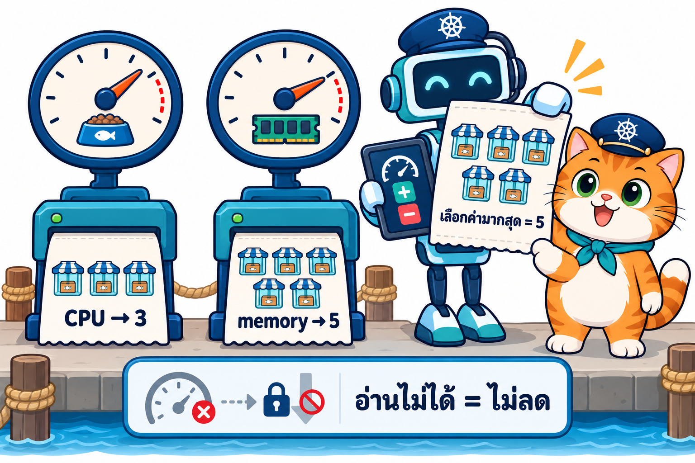<br>
  <em><b>รูปที่ 30</b> หลาย metric: คิดแยกทีละตัวแล้วเลือกค่ามากสุด เช่น CPU ต้องการ 3 memory ต้องการ 5 → 5 (ถ้า metric ไหนอ่านไม่ได้และตัวอื่นบอกให้ลด จะไม่ลด)</em>
</p>

เมื่อ `metrics` มีหลายตัว HPA คิด `desiredReplicas` แยกทีละตัวแล้ว **เลือกค่ามากที่สุด** (ระวังไว้ก่อน ลูกค้าไม่ควรรอ) เช่น CPU ต้องการ 3 memory ต้องการ 5 → 5

ผลจริง LAB 8: ไม่มีลูกค้าเลย CPU บอก "1 พอ" แต่ memory (`averageValue: 6Mi` ตั้งต่ำกว่าที่ Pod ใช้จริงโดยตั้งใจ) บอก "มากกว่านี้" HPA จึงเพิ่มถึง 6 ทั้งที่ CPU 1%

```text
NAME         REFERENCE               TARGETS                                MINPODS   MAXPODS   REPLICAS   AGE
php-apache   Deployment/php-apache   cpu: 1%/50%, memory: 9859754666m/6Mi   1         6         6          31m
  Normal   SuccessfulRescale   horizontalpodautoscaler/php-apache   New size: 6; reason: memory resource above target
```

กรณีพิเศษ: ถ้า metric ตัวใดอ่านไม่ได้ (เช่น adapter ล่ม) และ metric ที่เหลือบอกให้ **ลด** HPA จะ **ไม่ลด** (เพราะไม่รู้ว่าตัวที่หายไปต้องการเท่าไร) แต่ถ้าที่เหลือบอกให้ **เพิ่ม** HPA ยังเพิ่มได้

### 7.5 Pod ที่ยังไม่พร้อม หรือกำลังถูกลบ

<p align="center" id="fig-31">
  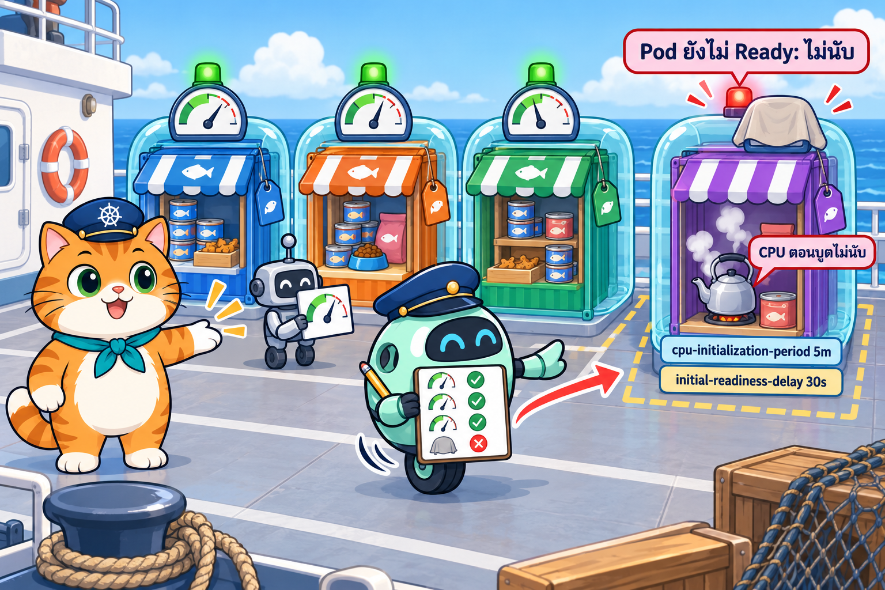<br>
  <em><b>รูปที่ 31</b> Pod ที่ยังไม่ Ready หรือเพิ่งเริ่ม (ช่วง cpu-initialization-period 5 นาที / initial-readiness-delay 30 วิ) ถูกพักไว้ไม่นับ — CPU พุ่งตอนบูตจึงไม่ทำให้ scale หลอก</em>
</p>

HPA ไม่ได้เอา Pod ทุกตัวมาเฉลี่ยตรง ๆ

- Pod ที่กำลังถูกลบ (มี `deletionTimestamp`) และ Pod ที่ `Failed` **ไม่นับ**
- Pod ที่ **ยังไม่ Ready** หรือเพิ่งเริ่ม ถูก "พักไว้" สำหรับ CPU: ช่วง `--horizontal-pod-autoscaler-cpu-initialization-period` (ค่าเริ่มต้น 5 นาที) Pod ที่ยังไม่ Ready หรือมีค่า CPU ที่วัดก่อนเริ่ม Ready ไม่ถูกนับ และ `--horizontal-pod-autoscaler-initial-readiness-delay` (ค่าเริ่มต้น 30 วินาที) เป็นช่วงที่ HPA ถือว่า Pod ที่เพิ่งเริ่มอาจสลับ Ready/ไม่ Ready ได้ — ผลคือ **CPU ที่พุ่งตอนบูตแอป (เช่น JIT, โหลด cache) ไม่ทำให้ HPA เพิ่มบูธหลอก**
- Pod ที่ **ไม่มีค่า metric** หรือไม่พร้อม HPA คิดแบบระวังตัว (conservative): ตอนจะ **เพิ่ม** สมมติว่า Pod พวกนี้ใช้ **0%** ตอนจะ **ลด** สมมติว่าใช้ **100%** ของเป้า แล้วคิดใหม่ ถ้าผลการคิดใหม่กลับทิศหรืออยู่ใน tolerance จะไม่เปลี่ยน
- ค่า `currentMetrics` ที่ `kubectl get hpa` แสดงเป็นค่าเฉลี่ย **ก่อน** ปรับแบบระวังตัว ดังนั้นบางรอบตัวเลขในหน้าจออาจดูเหมือน "ควรเพิ่ม" แต่ HPA ยังไม่เพิ่ม

---

## 8. behavior: ความเร็วเพิ่ม/ลดบูธ

### 8.1 ค่าเริ่มต้น

<p align="center" id="fig-32">
  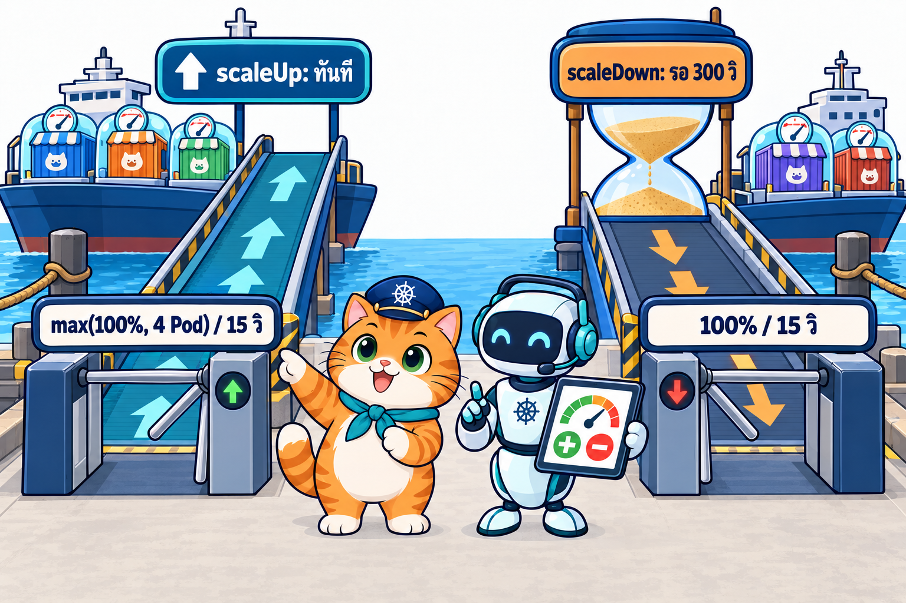<br>
  <em><b>รูปที่ 32</b> ค่าเริ่มต้น: scaleUp ไม่มีนาฬิกาทราย เพิ่มได้ max(100%, 4 Pod) ต่อ 15 วิ; scaleDown นาฬิกาทราย 300 วิ ลดได้ 100% ต่อ 15 วิ</em>
</p>

ถ้าไม่ใส่ `behavior` (หรือใส่แค่บางส่วน) API server เติมค่าเริ่มต้นให้ ผลจริงจาก LAB 4 เมื่อใส่แค่ `scaleDown.stabilizationWindowSeconds: 30`

```text
{"scaleDown":{"policies":[{"periodSeconds":15,"type":"Percent","value":100}],"selectPolicy":"Max","stabilizationWindowSeconds":30},"scaleUp":{"policies":[{"periodSeconds":15,"type":"Pods","value":4},{"periodSeconds":15,"type":"Percent","value":100}],"selectPolicy":"Max","stabilizationWindowSeconds":0}}
```

เขียนเป็น YAML ของค่าเริ่มต้นทั้งหมด (ตามเอกสาร HPA ทางการ)

```yaml
behavior:
  scaleDown:
    stabilizationWindowSeconds: 300
    policies:
      - type: Percent
        value: 100
        periodSeconds: 15
  scaleUp:
    stabilizationWindowSeconds: 0
    policies:
      - type: Percent
        value: 100
        periodSeconds: 15
      - type: Pods
        value: 4
        periodSeconds: 15
    selectPolicy: Max
```

| | scaleUp (ขาขึ้น) | scaleDown (ขาลง) |
|---|---|---|
| นาฬิกาทราย | **0 วินาที** (เพิ่มทันที) | **300 วินาที** (รอ 5 นาที) |
| เปลี่ยนได้ต่อ 15 วินาที | มากกว่าระหว่าง **100%** ของที่มี กับ **4 Pod** | **100%** (ลดรวดเดียวถึงเป้าได้) |

แนวคิดคือ "ขึ้นเร็ว ลงช้า" ลูกค้าที่รอเพราะบูธไม่พอเสียหายมากกว่าบูธที่เปิดเกินอีก 5 นาที ผลจริง LAB 4 (php-apache 6 Pod หยุดโหลด): CPU บนกระดานตกใน ~40 วินาที แต่บูธยัง 6 จน **6 → 3 ที่ ~310 วินาที และ → 1 ที่ ~325–345 วินาที** (≈ 5 นาที 25 วินาทีหลังหยุด) ระหว่างรอ condition เป็น

```text
  AbleToScale     True    ScaleDownStabilized  recent recommendations were higher than current one, applying the highest recent recommendation
```

### 8.2 stabilizationWindowSeconds: นาฬิกาทราย

<p align="center" id="fig-33">
  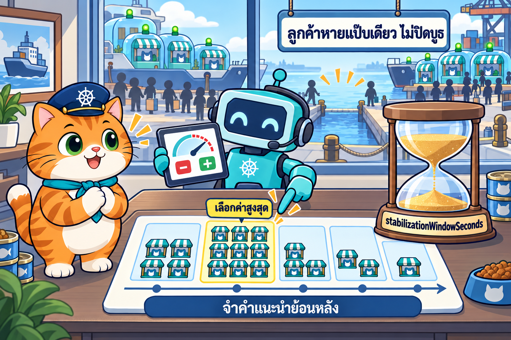<br>
  <em><b>รูปที่ 33</b> stabilizationWindowSeconds: HPA จำคำแนะนำย้อนหลังในช่วงนั้นแล้วเลือกค่าสูงสุด (ตอนลด) — ลูกค้าหายแค่แป๊บเดียวจะไม่รีบปิดบูธ</em>
</p>

HPA **จำคำแนะนำ (desiredReplicas) ทุกรอบ** ในช่วง `stabilizationWindowSeconds` ล่าสุด แล้ว

- **ตอนลด** เลือกค่า **สูงสุด** ในหน้าต่างนั้น → ต้องให้คำแนะนำ "ต่ำ" ทุกรอบตลอดหน้าต่างก่อนจึงลดได้ ลูกค้าหายไปแค่ 1 นาทีแล้วกลับมาจะไม่ทำให้ปิดบูธ
- **ตอนเพิ่ม** (ถ้าตั้ง window ให้ scaleUp) เลือกค่า **ต่ำสุด** ในหน้าต่าง → โหลดพุ่งชั่วครู่จะไม่ทำให้เปิดบูธ

ผลข้างเคียงที่เห็นจริงใน LAB 4: ค่าเริ่มต้นลด **2 ขั้น** (6 → 3 → 1) เพราะในหน้าต่าง 300 วินาทียังจำคำแนะนำ "3" ตอน CPU กำลังตก (22%) ไว้ เมื่อคำแนะนำ "6" หลุดออกจากหน้าต่างจึงเหลือค่าสูงสุดเป็น 3 ก่อน แล้ว 15 วินาทีต่อมาค่า 3 หลุดออกจึงเป็น 1

**ตารางที่ 4** เวลาขาลงที่วัดได้ใน LAB (เครื่อง 4 core)

| HPA | ไฟล์ | เวลาจากหยุดโหลดถึงบูธต่ำสุด |
|---|---|---|
| ค่าเริ่มต้น (window 300) | `20-hpa-php.yaml` | **~5 นาที 25 วินาที** (6 → 3 → 1) |
| window 30 วินาที | `40-hpa-fast-down.yaml` | **~60–75 วินาที** (6 → 4 → 1) |
| window 30 + Percent 50/15 วินาที | `70-hpa-slow-up.yaml` | ~80–90 วินาที (6 → 5 → 2 → 1) |
| ร้านน้องส้ม window 60 + Pods 1/15 วินาที | `som-shop-v9/k8s/60-hpa.yaml` | **~2–3 นาที** (6 → 5 → 4 → 3 → 2, วัดได้ ~2 นาที และ ~2 นาที 45 วินาที) |

เวลาเหล่านี้รวมช่วงที่มิเตอร์ยังไม่เห็น CPU ตก (25–60 วินาที) ด้วย window 30–60 วินาทีใช้ **เฉพาะ LAB** เพื่อไม่ต้องรอนาน ระบบจริงที่ลูกค้ามาเป็นระลอกควรใช้ค่าที่ยาวกว่า (เช่นค่าเริ่มต้น 300 วินาที) ป้องกัน flapping

### 8.3 policies และ selectPolicy

<p align="center" id="fig-34">
  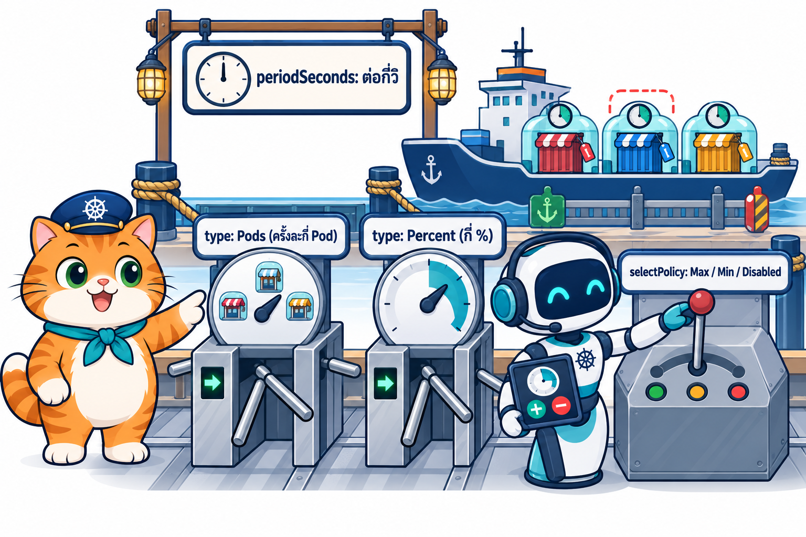<br>
  <em><b>รูปที่ 34</b> policies: type Pods (ครั้งละกี่ Pod) / Percent (กี่ % ของที่มี) ต่อ periodSeconds; selectPolicy Max (เลือกเปลี่ยนมากสุด) / Min / Disabled (ห้ามทิศนั้น)</em>
</p>

`policies` จำกัด **ปริมาณ** การเปลี่ยนแปลงต่อช่วงเวลา

| ฟิลด์ | ความหมาย |
|---|---|
| `type: Pods` + `value: N` | เปลี่ยนได้ไม่เกิน N Pod |
| `type: Percent` + `value: P` | เปลี่ยนได้ไม่เกิน P% ของจำนวนปัจจุบัน |
| `periodSeconds` | ช่วงเวลาที่ใช้นับ (1–1800 วินาที) |
| `selectPolicy: Max` | มีหลาย policy เลือกตัวที่ **เปลี่ยนได้มากสุด** (ค่าเริ่มต้น) |
| `selectPolicy: Min` | เลือกตัวที่ **เปลี่ยนได้น้อยสุด** |
| `selectPolicy: Disabled` | **ห้าม** เปลี่ยนในทิศนั้นเลย (เช่น ห้ามลดอัตโนมัติ) |

ตัวอย่าง LAB 7 (`02_LAB/lab07-behavior/70-hpa-slow-up.yaml`) เพิ่มทีละ 1 Pod ต่อ 15 วินาที

```yaml
  behavior:
    scaleUp:
      stabilizationWindowSeconds: 0
      selectPolicy: Max          # มีหลาย policy เลือกตัวที่ "เปลี่ยนได้มากสุด" (Min = น้อยสุด, Disabled = ห้ามเพิ่ม)
      policies:
        - type: Pods
          value: 1               # ครั้งละ 1 Pod
          periodSeconds: 15      # ต่อ 15 วิ
    scaleDown:
      stabilizationWindowSeconds: 30
      policies:
        - type: Percent
          value: 50              # ลดได้ครึ่งหนึ่งต่อ 15 วิ
          periodSeconds: 15
```

ผลจริง: Event ห่างกัน **15 วินาทีพอดี** 1 → 2 → 3 → 4 → 5 → 6 (Ready 6 ราว 85 วินาที) เทียบกับค่าเริ่มต้นที่ 1 → 4 → 6 ใน 2 ขั้น (Ready 6 ราว 55 วินาที)

```text
2m13s       Normal   SuccessfulRescale   horizontalpodautoscaler/php-apache   New size: 2; reason: cpu resource utilization (percentage of request) above target
118s        Normal   SuccessfulRescale   horizontalpodautoscaler/php-apache   New size: 3; reason: cpu resource utilization (percentage of request) above target
103s        Normal   SuccessfulRescale   horizontalpodautoscaler/php-apache   New size: 4; reason: cpu resource utilization (percentage of request) above target
88s         Normal   SuccessfulRescale   horizontalpodautoscaler/php-apache   New size: 5; reason: cpu resource utilization (percentage of request) above target
73s         Normal   SuccessfulRescale   horizontalpodautoscaler/php-apache   New size: 6; reason: cpu resource utilization (percentage of request) above target
```

ร้านน้องส้มใน LAB สุดท้ายใช้ `behavior` ที่ "ขึ้นเร็วพอดี ลงทีละน้อย" (`02_LAB/som-shop-v9/k8s/60-hpa.yaml`)

```yaml
  behavior:
    scaleUp:                         # เปิดบูธเพิ่มทันที (ค่าเริ่มต้น window 0)
      stabilizationWindowSeconds: 0
      policies:
        - type: Pods
          value: 2                   # เพิ่มได้ครั้งละไม่เกิน 2 บูธ ต่อ 15 วิ
          periodSeconds: 15
    scaleDown:                       # เฉพาะ LAB: รอ 60 วิ (ค่าเริ่มต้น 300 วิ) แล้วปิดทีละ 1 บูธ ต่อ 15 วิ
      stabilizationWindowSeconds: 60
      policies:
        - type: Pods
          value: 1
          periodSeconds: 15
```

ผลจริง (เครื่อง 4 core, customers=1): 2 → 4 (~29 วินาที) → 6 (~44 วินาที) ทีละ 2 ตาม policy และขาลง 6 → 5 → 4 → 3 → 2 ห่างกัน 15 วินาที

### 8.4 flapping: บูธเปิด-ปิดสลับไปมา

<p align="center" id="fig-35">
  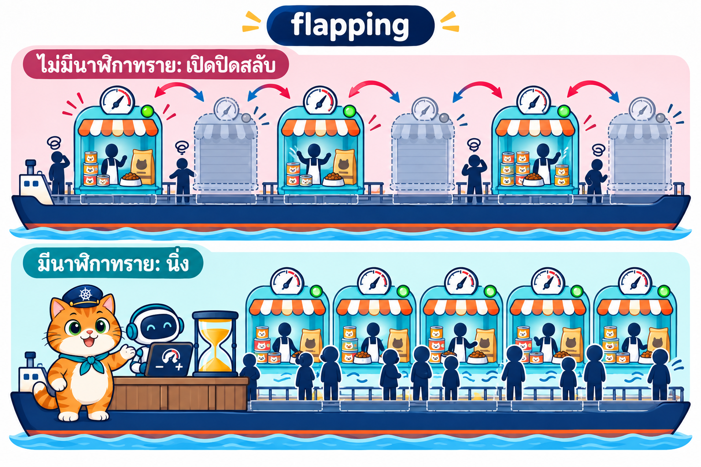<br>
  <em><b>รูปที่ 35</b> ไม่มีนาฬิกาทราย = บูธเปิด-ปิดสลับไปมา (flapping) เพราะโหลดแกว่ง → Pod ใหม่ต้องบูต ลูกค้าสะดุด เปลืองแรง</em>
</p>

ถ้าไม่มีนาฬิกาทรายและโหลดแกว่ง (เช่นลูกค้ามาเป็นระลอกทุก 1 นาที) HPA จะเพิ่ม → ลด → เพิ่ม สลับไปมาเรียกว่า **flapping** เสียหายหลายทาง

- บูธใหม่ต้องบูต (ดึง image, init container, รอ readiness) ช่วงนั้นยังรับลูกค้าไม่ได้
- บูธที่ถูกปิดต้องผ่าน preStop/terminationGracePeriod ลูกค้าที่ค้างอยู่อาจสะดุดถ้าตั้งค่าไม่ดี
- cache ในหน่วยความจำของบูธหายทุกครั้ง และ Event/log รก

วิธีกัน: ใช้ `stabilizationWindowSeconds` ของ scaleDown ให้ยาวกว่าคาบที่โหลดแกว่ง, จำกัด policies ของ scaleDown ให้ลดทีละน้อย และใช้ tolerance

---

## 9. ใช้งานจริงและกับดัก

### 9.1 `replicas` ใน YAML ทับ HPA

<p align="center" id="fig-36">
  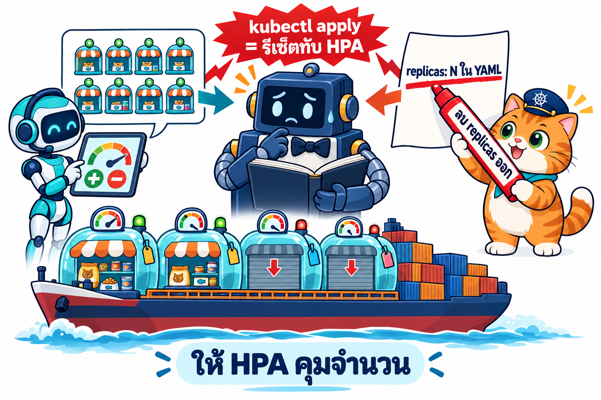<br>
  <em><b>รูปที่ 36</b> กับดัก: ถ้า Deployment YAML ยังมี replicas: N ทุกครั้งที่ kubectl apply จำนวนจะถูกรีเซ็ตเป็น N ทับ HPA (เห็นจริงใน LAB) → ลบ replicas ออกจาก manifest เมื่อใช้ HPA</em>
</p>

กับดักที่พบบ่อยที่สุด: Deployment YAML ยังมี `replicas: N` แล้วเรา `kubectl apply` ไฟล์นั้นซ้ำ (เช่นแก้ image) **จำนวนจะถูกรีเซ็ตเป็น N ทันที** ทับค่าที่ HPA ตั้งไว้ ผลจริง LAB 10: HPA ถือ 6 Pod แล้ว apply `10-php-apache.yaml` ที่มี `replicas: 1`

```text
deployment.apps/php-apache configured
3s php-apache   6/6   6     6     37m
6s php-apache   1/1   1     1     37m
...
15s php-apache   1/3   3     1     37m
...
48s php-apache   6/6   6     6     37m
```

5 บูธปิดพร้อมกัน แล้ว HPA ค่อย ๆ ดึงกลับใน ~45–50 วินาที ระหว่างนั้นลูกค้าแออัดอยู่ที่บูธเดียว

**ทางแก้: เมื่อใช้ HPA ให้ลบ `replicas` ออกจาก manifest** แต่การลบบรรทัดในไฟล์ **อย่างเดียวไม่พอ** เพราะ `kubectl apply` (client-side) เทียบ 3 ทาง: ไฟล์ใหม่, annotation `kubectl.kubernetes.io/last-applied-configuration` (ไฟล์ครั้งก่อน) และของจริง ถ้าไฟล์ครั้งก่อนมี `replicas` แต่ไฟล์ใหม่ไม่มี kubectl ตีความว่า "ผู้ใช้ลบ field นี้" แล้วลบออกจาก Deployment → กลับเป็นค่าเริ่มต้น **1** (เห็นจริงใน LAB 10: 6 → 1/3 ทันที) เอกสาร HPA ทางการหัวข้อ *Migrating Deployments and StatefulSets to horizontal autoscaling* แนะนำวิธีย้ายแบบไม่ลดเหลือ 1

| วิธี | ทำอย่างไร | ผลจริงใน LAB |
|---|---|---|
| client-side apply | `kubectl apply edit-last-applied deploy/<ชื่อ>` แล้วลบบรรทัด `replicas` ใน annotation (ไม่แตะของจริง) จากนั้น apply ไฟล์ที่ลบ replicas | `deployment.apps/php-apache edited` → apply ได้ `unchanged` และยัง 6/6 |
| client-side apply (ไม่ใช้ vi) | `kubectl apply set-last-applied -f <ไฟล์ใหม่>` เขียน annotation เป็นเนื้อหาไฟล์ใหม่ทั้งไฟล์ | ผลเหมือนกัน — LAB 11 ใช้วิธีนี้กับร้าน |
| server-side apply | โอนความเป็นเจ้าของ field `spec.replicas` ตามคู่มือ "transferring ownership" ของ Server-Side Apply | (ทฤษฎี) |

> เครื่องมือแบบ GitOps (เช่น Argo CD, Flux) ที่ sync ไฟล์จาก git ทุกไม่กี่นาทีจะ "ทะเลาะ" กับ HPA ทุกรอบถ้าไฟล์มี `replicas` จึงต้องลบ `replicas` ออกหรือตั้งให้เครื่องมือข้าม field นี้

### 9.2 HPA กับ rolling update

<p align="center" id="fig-37">
  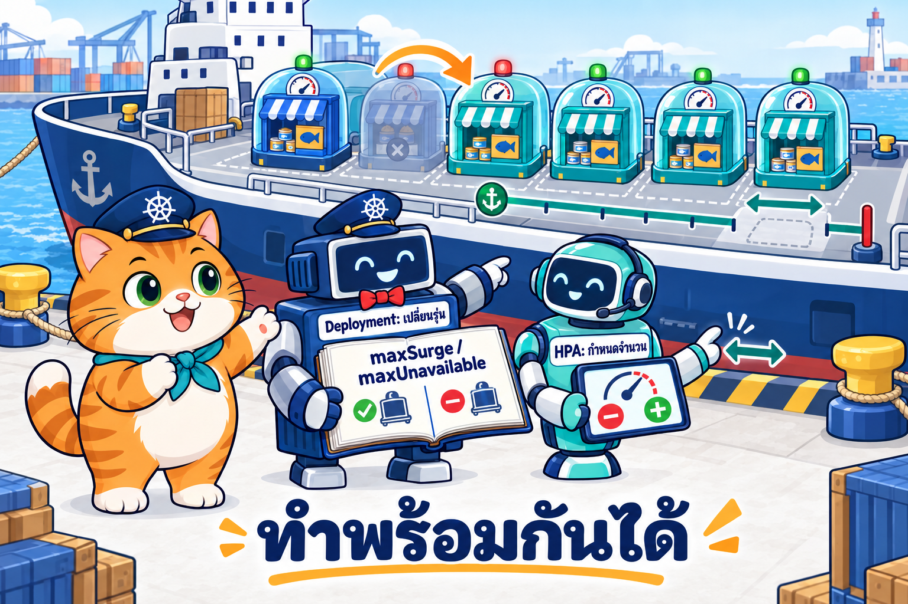<br>
  <em><b>รูปที่ 37</b> HPA กับ rolling update: HPA กำหนด replicas ของ Deployment ส่วน Deployment ทยอยเปลี่ยนรุ่นตาม maxSurge/maxUnavailable เดิม ทำพร้อมกันได้</em>
</p>

HPA และ Deployment แบ่งหน้าที่กันชัด: **HPA กำหนดจำนวน** (`spec.replicas`) ส่วน **Deployment กำหนดรุ่นและวิธีเปลี่ยนรุ่น** (`strategy.rollingUpdate`) ทั้งสองทำงานพร้อมกันได้

- ระหว่าง rolling update ถ้า HPA เปลี่ยนจำนวน Deployment จะปรับจำนวนของ ReplicaSet ใหม่/เก่าตามสัดส่วน (proportional scaling)
- `maxSurge`/`maxUnavailable` คิดจากจำนวนปัจจุบันที่ HPA ตั้ง เช่นร้านน้องส้ม `maxSurge: 1`, `maxUnavailable: 0` ตอนมี 2 บูธ เปลี่ยนรุ่นแล้วเห็น `2/2 → 3/2 → 2/2` ไม่เคยต่ำกว่า 2 (ผลจริง LAB 11 ขั้น B: `ok=400 err=0`)
- Pod รุ่นใหม่ที่เพิ่งเกิดยังไม่ Ready จะไม่ถูกนับ CPU (หัวข้อ 7.5) จึงไม่ทำให้ HPA ตัดสินใจผิดตอน rollout

### 9.3 readinessProbe, startupProbe และ preStop

<p align="center" id="fig-38">
  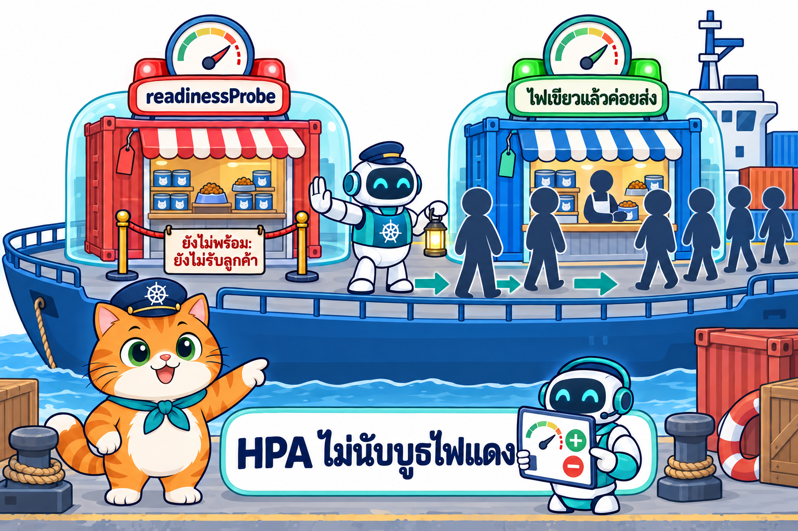<br>
  <em><b>รูปที่ 38</b> ควรมี readinessProbe/startupProbe: Pod ใหม่ต้องพร้อมก่อนรับลูกค้า (Service/Traefik ส่งเฉพาะบูธไฟเขียว) และ HPA ไม่นับบูธที่ยังไม่พร้อม</em>
</p>

HPA ทำให้บูธเกิด/ดับบ่อยกว่าเดิม probe และ preStop จาก บทที่ 2 และ 7 จึงสำคัญขึ้น

- **readinessProbe**: บูธใหม่ต้องพร้อมจริงก่อน Service/Traefik ส่งลูกค้ามา (ไฟเขียว) ในร้านน้องส้มคือ `/api/health` (ต่อ db ได้) ตอนบูธเพิ่งเกิดจะเห็น Event `Readiness probe failed: ... connect: connection refused` ชั่วครู่ซึ่งเป็นเรื่องปกติ และ HPA ก็ไม่นับบูธที่ยังไม่พร้อม
- **startupProbe**: แอปที่บูตช้าควรมี เพื่อไม่ให้ livenessProbe ฆ่าบูธที่ยังบูตไม่เสร็จ
- **preStop** (`sleep 5` ในร้าน): ตอน HPA ลดบูธ บูธที่ถูกเลือกปิดยังเสิร์ฟต่ออีก 5 วินาทีระหว่างที่ทุกส่วน (EndpointSlice, Traefik) ลบบูธนี้ออกจากรายชื่อ ผลจริง LAB 11: ขาลง 6 → 2 `hit.sh` ได้ **`ok=1500 err=0`**

### 9.4 ระวัง memory-based HPA

<p align="center" id="fig-39">
  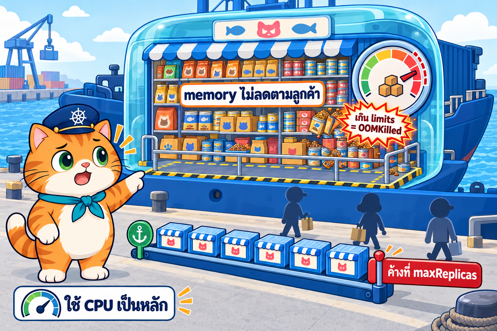<br>
  <em><b>รูปที่ 39</b> ระวัง memory-based HPA: แอปหลายตัว (Node.js/Java/PHP) ไม่คืน memory เมื่อโหลดลด → HPA ค้างที่ max; และ memory เกิน limits = OOMKilled ไม่ใช่ถูกบีบแบบ CPU</em>
</p>

HPA ด้วย memory ทำได้ (LAB 8) แต่มีข้อควรระวัง

- แอปหลายแบบ (Node.js, Java/JVM, PHP, แอปที่มี cache) **ไม่คืน memory** เมื่อโหลดลด และ Pod ใหม่ก็ใช้ memory ฐานพอ ๆ กับเดิม ค่าเฉลี่ยจึงไม่ลดตามจำนวน Pod → HPA **ค้างที่ max** (LAB 8: เพิ่มถึง 6 แล้วไม่ลดเลยทั้งที่ไม่มีลูกค้า)
- memory เกิน `limits` = container ถูกฆ่า (**OOMKilled**) ไม่ได้ถูกบีบแบบ CPU HPA ช่วยไม่ทันเพราะดูค่าเฉลี่ยทุก 15 วินาที
- **หน่วยแปลกในคอลัมน์ TARGETS**: ค่าเฉลี่ยที่หารไม่ลงตัวแสดงเป็น milli-byte เช่น `9859754666m` (= 9,859,754.666 byte ≈ 9.4Mi) หรือ `12104Ki` — ตัว `m` ตรงนี้ **ไม่ใช่ millicore**
- ถ้าจะใช้ memory ควรใช้คู่กับ CPU หรือ metric ของแอป ตั้ง target ให้สูงกว่า memory ฐานของ Pod ชัดเจน และทดสอบว่าลดลงได้จริง

### 9.5 ไม่ใช้ HPA กับ db (StatefulSet)

<p align="center" id="fig-40">
  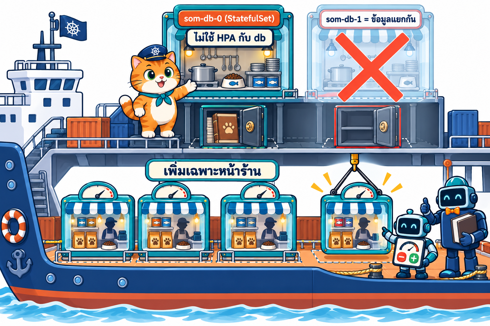<br>
  <em><b>รูปที่ 40</b> ไม่ใช้ HPA กับ db (StatefulSet som-db-0): postgres ตัวเดียวรับเขียน การเพิ่ม som-db-1 ไม่ได้แบ่งงานเขียน และได้ข้อมูลแยกกัน (บท 009) — scale เฉพาะหน้าร้าน stateless</em>
</p>

HPA ใช้กับ StatefulSet ได้ในทางเทคนิค (มี `/scale`) แต่ **ไม่เหมาะกับฐานข้อมูลอย่าง `som-db`**

- postgres ของร้านเป็นตัวเดียวที่รับเขียน การเพิ่ม `som-db-1` ไม่ได้ช่วยแบ่งงานเขียน และ **ได้ฐานข้อมูลแยกอีกก้อน** ที่ข้อมูลไม่ตรงกัน (เห็นแล้วในบทที่ 9)
- การขยายฐานข้อมูลต้องใช้ replication (primary + replica อ่านอย่างเดียว) หรือ operator ของฐานข้อมูลนั้น ไม่ใช่ HPA
- ร้านน้องส้มจึง scale เฉพาะหน้าร้าน `som-web` (stateless) ผลจริง LAB 11: `som-db 1/1` ตลอดวันลดราคา และออเดอร์เดิมอยู่ครบ

งาน stateless ที่ปลอดภัยต่อการ scale คือ Pod ที่ไม่เก็บข้อมูลไว้ในตัว ทุกตัวเหมือนกัน และปิดตัวไหนก็ได้ (session/ไฟล์อยู่ในที่เก็บกลาง)

### 9.6 HPA ไม่รู้งบของโซนและความจุของเรือ

<p align="center" id="fig-41">
  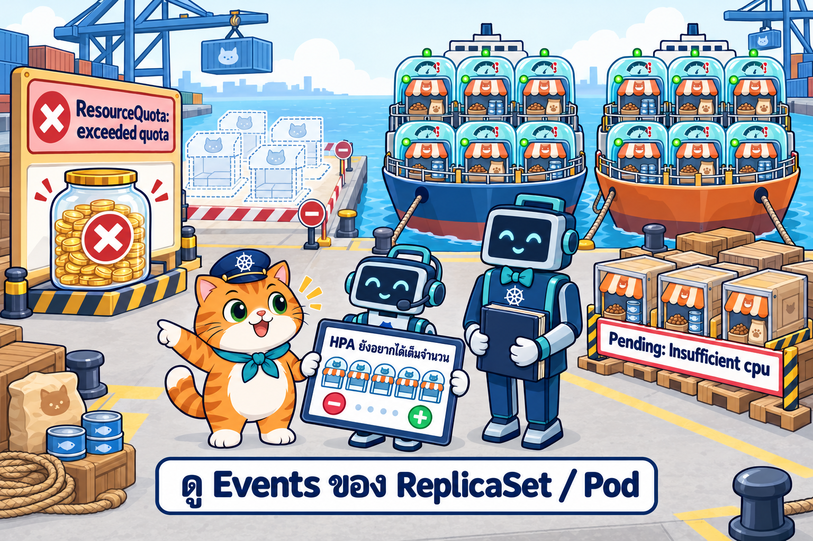<br>
  <em><b>รูปที่ 41</b> HPA ไม่รู้งบของโซน: ResourceQuota (บท 004) ทำให้สร้าง Pod เพิ่มไม่ได้ (exceeded quota) และ Node เต็มทำให้ Pod Pending (Insufficient cpu, บท 003) — HPA ยังรายงานว่าต้องการเต็มจำนวน</em>
</p>

HPA แค่แก้ตัวเลข `replicas` ส่วน Pod จะ "เกิด" ได้หรือไม่ขึ้นกับกลไกอื่นที่ HPA มองไม่เห็น

**ก. ResourceQuota (บทที่ 4)** — LAB 9 ก: quota `requests.cpu: 300m` (php-apache 100m ได้ 3 Pod)

```text
horizontalpodautoscaler.autoscaling/php-apache   Deployment/php-apache   cpu: 131%/50%   1         6         6          33m
deployment.apps/php-apache   3/6     3            3           33m
52s         Warning   FailedCreate   replicaset/php-apache-7cccb789ff   Error creating: pods "php-apache-7cccb789ff-jrdmf" is forbidden: exceeded quota: booth-budget, requested: requests.cpu=100m, used: requests.cpu=300m, limited: requests.cpu=300m
```

HPA แสดง `REPLICAS 6` แต่ Deployment ได้ `3/6` เหตุผลอยู่ที่ Event ของ **ReplicaSet**

**ข. Node เต็ม (บทที่ 3)** — LAB 9 ข: requests ของแต่ละ Pod = 60% ของ Node worker + `minReplicas: 4`

```text
php-apache-68b7d68975-f5x69   0/1     Pending   0          30s   <none>        <none>        <none>
php-apache-68b7d68975-fhp9k   1/1     Running   0          30s   10.244.1.30   lab-worker    <none>
  Warning  FailedScheduling  30s (x2 over 30s)  default-scheduler  0/3 nodes are available: 1 node(s) had untolerated taint(s), 2 Insufficient cpu. preemption: 0/3 nodes are available: 1 Preemption is not helpful for scheduling, 2 No preemption victims found for incoming pod.
```

HPA แสดง `REPLICAS 4` เหมือนทุกอย่างเรียบร้อย แต่ Running 2 Pending 2 เหตุผลอยู่ที่ Event ของ **Pod** บนคลาวด์ Cluster Autoscaler จะเห็น Pod Pending แล้วเพิ่ม Node ให้ (หัวข้อ 3.4)

ข้อสรุป: ตั้ง `maxReplicas × requests` ให้ไม่เกิน ResourceQuota ของ namespace และความจุจริงของ Node และเมื่อ HPA "บอกว่าเพิ่มแล้ว" แต่ร้านยังช้า ให้ไล่ดู `kubectl get deploy` (READY), Event ของ ReplicaSet และ Pod

---

## 10. เปรียบเทียบ แนวปฏิบัติ และสรุป

### 10.1 ตารางเปรียบเทียบ

<p align="center" id="fig-42">
  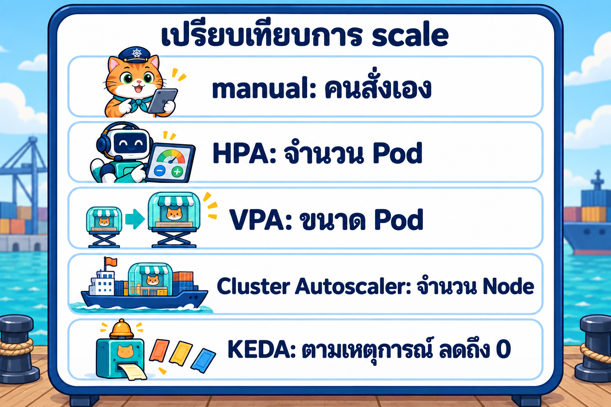<br>
  <em><b>รูปที่ 42</b> ตารางเปรียบเทียบ manual scale / HPA / VPA / Cluster Autoscaler / KEDA: ปรับอะไร ใครสั่ง เหมาะกับงานแบบไหน</em>
</p>

**ตารางที่ 5** เปรียบเทียบวิธีปรับขนาด

| | manual scale | HPA | VPA | Cluster Autoscaler / Karpenter | KEDA |
|---|---|---|---|---|---|
| ปรับอะไร | จำนวน Pod | จำนวน Pod | requests/limits ของ Pod | จำนวน Node | จำนวน Pod (รวม 0) ผ่าน HPA |
| ใครสั่ง | คน | HPA controller (kube-controller-manager) | VPA recommender/updater | controller ของผู้ให้บริการคลาวด์ | KEDA operator + HPA |
| สัญญาณ | การตัดสินใจของคน | CPU/memory (หรือ custom/external metric) | การใช้งานย้อนหลัง | Pod ที่ Pending / Node ที่ว่าง | เหตุการณ์ภายนอก (คิว, cron, Prometheus) |
| เวลาตอบสนอง | ช้าเท่าที่คนรู้ตัว | หลักสิบวินาที (+ เวลาบูต Pod) | สร้าง Pod ใหม่หรือ resize | หลักนาที (สร้าง VM) | หลักวินาที–สิบวินาที |
| ต้องติดตั้งเพิ่ม | ไม่ | metrics-server | VPA (CRD + controller) | ตาม cloud provider | KEDA (CRD + operator) |
| เหมาะกับ | งานทดลอง, เหตุการณ์ที่รู้ล่วงหน้า | งาน stateless ที่โหลดสะท้อนใน CPU | งานที่ไม่รู้ขนาดเหมาะ/เพิ่มจำนวนไม่ได้ | คลัสเตอร์บนคลาวด์ที่โหลดแกว่งมาก | worker ตามคิว, งานที่ควรหลับเป็น 0 |
| ใน LAB บทนี้ | ✅ (ทวน) | ✅ | ทฤษฎี | ทฤษฎี (kind ใช้ไม่ได้) | ทฤษฎี |

### 10.2 แนวปฏิบัติ

<p align="center" id="fig-43">
  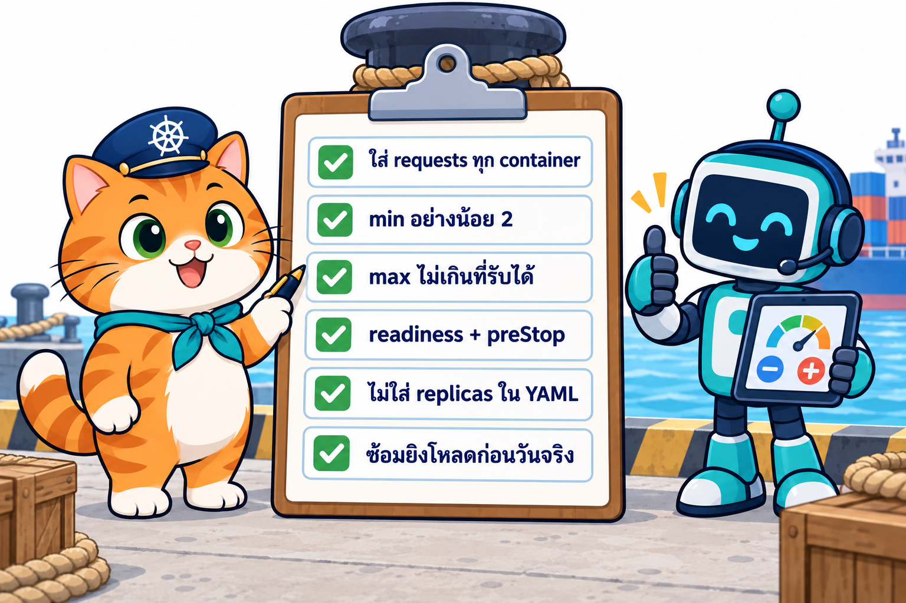<br>
  <em><b>รูปที่ 43</b> แนวปฏิบัติ: ใส่ requests ทุก container, ตั้ง min ≥ 2 สำหรับหน้าร้าน, max ไม่เกินที่คลัสเตอร์รับได้, ใส่ readiness + preStop, เอา replicas ออกจาก YAML, ทดสอบโหลดก่อนวันจริง</em>
</p>

1. **ใส่ `requests` ทุก container** (โดยเฉพาะ cpu) และตั้งให้ใกล้การใช้งานจริงตอนปกติ
2. **`minReplicas` ≥ 2** สำหรับหน้าร้าน/บริการที่ลูกค้าใช้ กันจุดล้มเดียว
3. **`maxReplicas` ไม่เกินที่คลัสเตอร์รับได้** (`maxReplicas × requests` ≤ ResourceQuota และความจุ Node)
4. **มี readinessProbe (+ startupProbe ถ้าบูตช้า) และ preStop** ให้การเพิ่ม/ลดบูธไม่ทำให้ลูกค้าเจอ error
5. **เอา `replicas` ออกจาก YAML** และลบจาก last-applied ด้วยก่อน apply ครั้งแรก
6. **ใช้ `behavior` ขึ้นเร็ว ลงช้า** ค่าเริ่มต้น (scaleDown 300 วินาที) เหมาะกับงานส่วนใหญ่ ปรับเมื่อมีเหตุผล
7. **ทดสอบโหลดก่อนวันจริง** (แบบ LAB 11) ดูว่าถึง max ไหม ลดกลับไหม มี error ไหม
8. **ดู `kubectl describe hpa`** (Conditions + Events) ทุกครั้งที่ HPA ทำตัวแปลก
9. **ไม่ใช้ HPA กับฐานข้อมูล/งาน stateful** และไม่ใช้ VPA กับ HPA บน metric เดียวกัน
10. **ระวัง memory-based HPA** ทดสอบว่าลดลงได้จริง

**คำสั่ง debug ที่ใช้บ่อย**

| คำสั่ง | ดูอะไร |
|---|---|
| `kubectl get hpa -A` / `kubectl get hpa -w` | TARGETS, MIN/MAX, REPLICAS (แบบ `-w` พิมพ์เมื่อค่าเปลี่ยน) |
| `kubectl describe hpa <ชื่อ>` | Conditions และ Events (`SuccessfulRescale`, `FailedGetResourceMetric`) |
| `kubectl top pod` / `kubectl top node` | ตัวเลขที่ metrics-server จดได้ |
| `kubectl get apiservice v1beta1.metrics.k8s.io` | metrics-server พร้อมไหม |
| `kubectl get --raw /apis/metrics.k8s.io/v1beta1/namespaces/<ns>/pods` | ค่าดิบของ Pod (JSON) |
| `kubectl -n kube-system logs deploy/metrics-server` | metrics-server ดึงค่าจาก kubelet ได้ไหม (x509 ฯลฯ) |
| `kubectl get deploy` + Event ของ ReplicaSet/Pod | HPA สั่งแล้ว Pod เกิดได้จริงไหม (quota, Pending) |
| `kubectl apply view-last-applied deploy/<ชื่อ>` | last-applied ยังมี `replicas` ไหม |

### 10.3 สรุปบท

<p align="center" id="fig-44">
  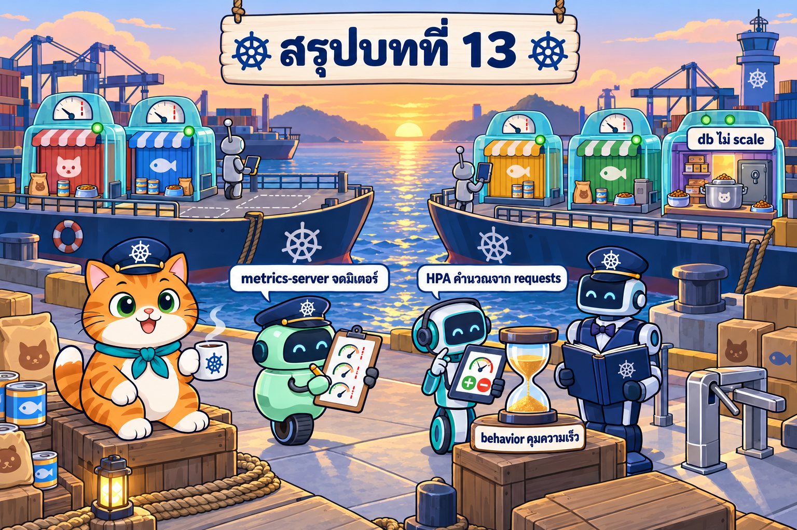<br>
  <em><b>รูปที่ 44</b> สรุปบท: metrics-server จดมิเตอร์ → HPA คำนวณจาก requests ด้วยสูตร ceil → behavior คุมความเร็ว → หน้าร้านรับวันลดราคาได้เอง ส่วน db ไม่ scale</em>
</p>

- **metrics-server** จดมิเตอร์ CPU/memory จาก kubelet ทุก ~15 วินาที ให้บริการผ่าน Metrics API (`APIService v1beta1.metrics.k8s.io`) บน kind ต้องใช้ `--kubelet-insecure-tls` (เฉพาะ LAB)
- **HPA** (`autoscaling/v2`) ทุก 15 วินาทีคำนวณ `desiredReplicas = ceil(current × metric ÷ target)` จาก **% ของ requests** แล้วแก้ `/scale` ของ Deployment ภายในราง `minReplicas`–`maxReplicas`
- tolerance 10% กันการขยับเล็กน้อย หลาย metric เลือกค่ามากสุด Pod ที่ยังไม่พร้อมไม่ถูกนับ
- **behavior** คุมความเร็ว: ค่าเริ่มต้นขึ้นทันที ลงหลัง 300 วินาที ปรับได้ด้วย `stabilizationWindowSeconds`, policies และ `selectPolicy`
- กับดัก: `replicas` ใน YAML/last-applied, ไม่มี requests (`<unknown>`), memory ไม่ลด, quota/Pending ที่ HPA มองไม่เห็น
- หน้าร้าน stateless scale ได้ ส่วน db ไม่ scale ด้วย HPA

### ข้อควรจำของบทนี้

- `kubectl top` ใช้ไม่ได้ = ยังไม่มี metrics-server หรือ APIService ยังไม่ `True`
- **% ของ HPA เทียบกับ requests** ไม่ใช่ limits ไม่ใช่ Node → เกิน 100% ได้ และไม่มี requests = `<unknown>`
- `<unknown>` ~30 วินาทีแรกเป็นเรื่องปกติ ถ้าไม่หายให้หา `missing request for cpu`
- kubectl 1.37: `kubectl autoscale ... --cpu=50%` (ไม่มี `--cpu-percent`)
- `REPLICAS` ของ `kubectl get hpa` ช้ากว่า Pod ที่ Ready จริง 5–15 วินาที
- ใช้ HPA แล้ว **ห้ามมี `replicas` ในไฟล์** และต้องลบจาก last-applied ก่อน (`edit-last-applied` / `set-last-applied`)
- ขาลงช้าโดยตั้งใจ (ค่าเริ่มต้น ~5 นาที) ถ้าบูธไม่ลดให้ดู `ScaleDownStabilized`
- HPA บอกจำนวนที่ "ต้องการ" ไม่ได้รับประกันว่า Pod เกิดได้ (quota / Pending)

---

## 11. คำถามทบทวน

**1. ทำไมการตั้ง `replicas` คงที่จึงไม่เหมาะกับร้านที่มีวันลดราคา และ HPA แก้ปัญหานี้ได้แค่ไหน (มีอะไรที่ HPA ทำไม่ได้)**

<details>
<summary>แนวคำตอบ</summary>

จำนวนคงที่ต้องเลือกระหว่างน้อย (ช่วงพีคคิวยาว ตอบช้า) กับมาก (ช่วงเงียบบูธว่างเปลืองทรัพยากร) และการ scale ด้วยมือต้องมีคนเฝ้า HPA ดูมิเตอร์และเพิ่ม/ลดเองทุก 15 วินาที แต่เป็นแบบ reactive จึงมีความหน่วง (มิเตอร์ + บูต Pod รวมหลายสิบวินาที) ทำนายล่วงหน้าไม่ได้ (โปรที่รู้เวลาควรยก `minReplicas` ก่อน) ไม่เพิ่ม Node ให้ และไม่ช่วยงานที่ scale แนวนอนไม่ได้ เช่นฐานข้อมูลตัวเดียว
</details>

**2. HPA, VPA และ Cluster Autoscaler ต่างกันอย่างไร และทำไมไม่ควรใช้ HPA กับ VPA บน CPU ตัวเดียวกัน**

<details>
<summary>แนวคำตอบ</summary>

HPA ปรับจำนวน Pod, VPA ปรับ requests/limits ของ Pod, Cluster Autoscaler/Karpenter ปรับจำนวน Node (บนคลาวด์) HPA คิด % จาก requests ถ้า VPA ขยาย requests % จะลดทันที HPA จึงลดจำนวน แล้ว VPA อาจปรับต่อ ทั้งสองดึงกันไปมา ใช้คู่กันได้ถ้า HPA ใช้ metric อื่นหรือ VPA อยู่ในโหมดแนะนำอย่างเดียว
</details>

**3. ไล่เส้นทางของตัวเลข CPU ตั้งแต่ container ไปจนถึง HPA และบอกว่าถ้า `kubectl get apiservice v1beta1.metrics.k8s.io` เป็น `False (MissingEndpoints)` ควรดูอะไรต่อ**

<details>
<summary>แนวคำตอบ</summary>

container → kubelet (ส่วนวัดผลของ runtime/cAdvisor) ที่ `:10250/metrics/resource` → metrics-server ดึงทุก 15 วินาทีเก็บค่าล่าสุด → ลงทะเบียน APIService `v1beta1.metrics.k8s.io` ผ่าน aggregation layer → kube-apiserver → HPA controller ใน kube-controller-manager (และ `kubectl top`) `MissingEndpoints` แปลว่า Service ของ metrics-server ไม่มี Pod Ready ให้ดู `kubectl -n kube-system get pod -l k8s-app=metrics-server` (0/1?), Event `Readiness probe failed ... 500` และ log `kubectl -n kube-system logs deploy/metrics-server` ซึ่งบน kind มักเป็น `x509: ... doesn't contain any IP SANs`
</details>

**4. ทำไม LAB ใช้ `--kubelet-insecure-tls` ได้ แต่ระบบจริงไม่ควรใช้ ระบบจริงควรแก้ที่ใด**

<details>
<summary>แนวคำตอบ</summary>

kubelet ของ kind ใช้ใบ self-signed ที่ไม่มี IP ของ Node ใน SAN metrics-server ซึ่งต่อด้วย IP จึงตรวจใบไม่ผ่าน ใน LAB ที่เป็นคลัสเตอร์ส่วนตัวยอมปิดการตรวจได้ แต่ในระบบจริงแฟล็กนี้ทำให้ไม่รู้ว่าคุยกับ kubelet ตัวจริงหรือไม่ ผู้ไม่หวังดีอาจป้อนตัวเลขปลอมให้ HPA ได้ ควรแก้ที่ kubelet ให้ใช้ใบที่ CA ของคลัสเตอร์เซ็นและมี IP/ชื่อ Node ใน SAN (เช่น `serverTLSBootstrap` + อนุมัติ CSR) ซึ่งตรงกับข้อกำหนดใน README ของ metrics-server
</details>

**5. Pod มี `requests.cpu: 200m` `limits.cpu: 1` ใช้ CPU จริง 300m และ HPA ตั้ง `averageUtilization: 50` TARGETS จะแสดงเท่าไร ถ้ามี 2 Pod แบบนี้ HPA จะสั่งกี่ Pod**

<details>
<summary>แนวคำตอบ</summary>

utilization = 300 ÷ 200 = 150% (เกิน 100 ได้เพราะยังไม่ถึง limits) TARGETS `cpu: 150%/50%` desiredReplicas = ceil(2 × 150 ÷ 50) = ceil(6) = 6 (ถ้า `maxReplicas` ≥ 6 และ policy ขาขึ้นยอมให้ — ค่าเริ่มต้นเพิ่มได้ max(100%, 4 Pod) ต่อ 15 วินาที = เพิ่มได้ 4 จาก 2 เป็น 6 ในรอบเดียว)
</details>

**6. HPA ตัวหนึ่งแสดง `cpu: <unknown>/50%` มา 10 นาทีแล้ว อธิบายสาเหตุที่เป็นไปได้ และบอกวิธีแยกจาก `<unknown>` ปกติช่วงแรก**

<details>
<summary>แนวคำตอบ</summary>

ช่วงแรก (~30 วินาที) เป็นปกติเพราะ metrics-server ยังไม่มีค่าของ Pod ใหม่ (Event `no metrics returned from resource metrics API`) ถ้าค้างนานให้ `kubectl describe hpa` ดู Condition `ScalingActive False FailedGetResourceMetric` ข้อความ `missing request for cpu in container ...` = มี container ที่ไม่มี requests (รวม sidecar) ถ้าเป็น `no metrics returned` นาน ๆ ให้ตรวจ metrics-server/APIService และ Pod ว่า Ready หรือไม่ (`did not receive metrics for targeted pods (pods might be unready)`) และตรวจว่า selector ของเป้าหมายมี Pod จริง
</details>

**7. คำนวณ desiredReplicas: (ก) 3 Pod เฉลี่ย 80% target 50% (ข) 8 Pod เฉลี่ย 10% target 50% `minReplicas: 2` (ค) 5 Pod เฉลี่ย 53% target 50%**

<details>
<summary>แนวคำตอบ</summary>

(ก) ceil(3 × 80 ÷ 50) = ceil(4.8) = 5 (ข) ceil(8 × 10 ÷ 50) = ceil(1.6) = 2 ไม่ต่ำกว่า min 2 ได้ 2 แต่ต้องรอนาฬิกาทรายของ scaleDown และ policies ก่อน (ค) 53 ÷ 50 = 1.06 อยู่ใน tolerance 0.9–1.1 จึงคง 5 (ถ้าไม่มี tolerance จะได้ ceil(5.3) = 6)
</details>

**8. HPA มี 2 metric: CPU (ผลคำนวณ = 3) และ memory (ผลคำนวณ = 5) จะได้กี่ Pod ถ้า memory อ่านไม่ได้ชั่วคราวและ CPU บอกให้ลดจาก 5 เป็น 3 จะเกิดอะไร**

<details>
<summary>แนวคำตอบ</summary>

เลือกค่ามากสุดได้ 5 ถ้า memory อ่านไม่ได้และ metric ที่เหลือบอกให้ลด HPA จะไม่ลด (คง 5) เพราะไม่รู้ว่า metric ที่หายต้องการเท่าไร แต่ถ้า metric ที่เหลือบอกให้เพิ่ม HPA ยังเพิ่มได้
</details>

**9. ในวันที่ไม่ได้ตั้ง `behavior` เลย หยุดโหลดแล้วบูธยังเท่าเดิมเกิน 4 นาที `describe hpa` เห็น `ScaleDownStabilized` อธิบายว่าเกิดอะไร ผิดปกติไหม และทำไม LAB 4 จึงลด 6 → 3 → 1 แทน 6 → 1**

<details>
<summary>แนวคำตอบ</summary>

ไม่ผิดปกติ ค่าเริ่มต้นของ scaleDown มี stabilizationWindowSeconds 300 HPA เลือกคำแนะนำสูงสุดใน 300 วินาทีล่าสุด ต้องรอให้คำแนะนำสูง ๆ หลุดออกจากหน้าต่างก่อน (LAB 4 วัดได้ ~5 นาที 25 วินาที) ที่ลด 2 ขั้นเพราะในหน้าต่างยังจำคำแนะนำ "3" ตอน CPU กำลังตก (22%) เมื่อคำแนะนำ "6" หลุดออกค่าสูงสุดที่เหลือคือ 3 อีก 15 วินาทีต่อมาค่า 3 หลุดออกจึงเป็น 1
</details>

**10. เขียน `behavior` ให้ขาขึ้นเพิ่มได้ไม่เกิน 2 Pod ต่อ 15 วินาที ขาลงรอ 60 วินาทีแล้วลดทีละ 1 Pod ต่อ 15 วินาที ถ้ามี 6 Pod และหยุดโหลด ควรใช้เวลาประมาณเท่าไรถึง `minReplicas: 2`**

<details>
<summary>แนวคำตอบ</summary>

ใช้แบบเดียวกับ `som-shop-v9/k8s/60-hpa.yaml`: `scaleUp: {stabilizationWindowSeconds: 0, policies: [{type: Pods, value: 2, periodSeconds: 15}]}` และ `scaleDown: {stabilizationWindowSeconds: 60, policies: [{type: Pods, value: 1, periodSeconds: 15}]}` เวลา = มิเตอร์เห็น CPU ตก (~30–60 วินาที) + นาฬิกาทราย 60 วินาที + ลด 4 ขั้นห่างกัน 15 วินาที (45 วินาทีหลังขั้นแรก) ≈ 2–3 นาที (LAB 11 วัดได้ ~2 นาที และ ~2 นาที 45 วินาที)
</details>

**11. นักศึกษาลบบรรทัด `replicas: 3` ออกจาก `20-web.yaml` แล้ว `kubectl apply` ทันที บูธลดเหลือ 1 ชั่วครู่ ทำไม และควรทำอย่างไรแทน**

<details>
<summary>แนวคำตอบ</summary>

kubectl apply เทียบไฟล์ใหม่กับ last-applied-configuration (ไฟล์ครั้งก่อนที่มี `replicas: 3`) เห็นว่า field หายจึงลบออกจาก Deployment → กลับเป็นค่าเริ่มต้น 1 แล้ว HPA ค่อยดึงกลับเป็น min ควรสร้าง HPA ก่อน แล้วลบ `replicas` ออกจาก last-applied ด้วย `kubectl apply edit-last-applied deploy/som-web` หรือ `kubectl apply set-last-applied -f k8s/20-web.yaml` จากนั้นค่อย apply ไฟล์ (ได้ `unchanged`/ไม่แตะจำนวน) หรือใช้ server-side apply ตามคู่มือ transferring ownership
</details>

**12. HPA แสดง `REPLICAS 6` แต่ร้านยังช้า `kubectl get deploy` ได้ `3/6` จะหาสาเหตุอย่างไร และแก้ได้ทางไหนบ้าง**

<details>
<summary>แนวคำตอบ</summary>

ดู Event ของ ReplicaSet (`kubectl get events --field-selector reason=FailedCreate`) ถ้าเป็น `exceeded quota` = ResourceQuota ของ namespace เต็ม แก้โดยเพิ่ม quota หรือลด `maxReplicas`/requests ถ้า Pod ถูกสร้างแต่ `Pending` ให้ `kubectl describe pod` ดู `FailedScheduling ... Insufficient cpu` = Node ไม่พอ แก้โดยเพิ่ม Node (Cluster Autoscaler บนคลาวด์) ลด requests หรือลด `maxReplicas` HPA เองไม่รู้เรื่องเหล่านี้
</details>

**13. ทำไม HPA ที่ใช้ memory ของแอป Node.js มักค้างที่ `maxReplicas` และคอลัมน์ TARGETS ที่แสดง `9859754666m/6Mi` หมายถึงอะไร**

<details>
<summary>แนวคำตอบ</summary>

แอปแบบนี้ไม่คืน memory เมื่อโหลดลด และ Pod ใหม่ก็มี memory ฐานใกล้เคียงเดิม ค่าเฉลี่ยจึงไม่ลดตามจำนวน Pod HPA ไม่มีวันเห็นค่าต่ำกว่าเป้า `9859754666m` คือค่าเฉลี่ย memory ในหน่วย milli-byte (≈ 9,859,754 byte ≈ 9.4Mi) เพราะหารแล้วไม่ลงตัว ตัว m ไม่ใช่ millicore ค่านี้สูงกว่าเป้า 6Mi จึงยังอยากเพิ่ม
</details>

**14. ทำไมร้านน้องส้มไม่ใส่ HPA ให้ `som-db` และถ้าอยากให้ฐานข้อมูลรับโหลดอ่านได้มากขึ้นควรทำอย่างไร**

<details>
<summary>แนวคำตอบ</summary>

som-db เป็น postgres ตัวเดียวที่รับเขียน การเพิ่ม replicas ของ StatefulSet จะได้ `som-db-1` ที่เป็นฐานข้อมูลแยก ข้อมูลไม่ตรงกัน และไม่ได้แบ่งงานเขียน (บทที่ 9) ถ้าต้องการรับโหลดอ่านมากขึ้นต้องตั้ง replication (primary + read replica) ด้วยเครื่องมือหรือ operator ของ postgres และให้แอปส่งคำสั่งอ่านไป replica หรือเพิ่มขนาดเครื่อง (scale แนวตั้ง) ไม่ใช่ HPA
</details>

**15. ในการทดลอง ลูกค้าจำลองยิง `https://shop.localhost/api/work` (ไม่มี `:30081`) แล้ว CPU ไม่ขึ้นเลย HPA ไม่ scale เกิดจากอะไร**

<details>
<summary>แนวคำตอบ</summary>

URL ที่ไม่มีพอร์ตทำให้ Host เป็น `shop.localhost` (พอร์ต 443) Middleware `redirect-https` ของบทที่ 12 ตอบ `301` ไป `https://shop.localhost:30081/...` ทุกครั้งโดยไม่ส่งถึง som-web (ทดลองก่อนเขียนเอกสาร: 2000/2000 ครั้งได้ 301, CPU 12%) ต้องยิง URL ที่มี `:30081` (และใช้ `--connect-to` ไป Service traefik:443) จึงได้ 200 และ CPU ขึ้น
</details>

**16. ถ้าต้องตั้ง HPA ให้บริการใหม่ในระบบจริง ควรตรวจอะไรบ้างก่อนเปิดใช้**

<details>
<summary>แนวคำตอบ</summary>

metrics-server พร้อมและตั้งค่าใบรับรองถูกต้อง, ทุก container มี requests ที่สมเหตุสมผล, `minReplicas` ≥ 2, `maxReplicas` สอดคล้องกับ ResourceQuota/ความจุ Node (หรือมี Cluster Autoscaler), ไม่มี `replicas` ในไฟล์และใน last-applied, มี readiness/startupProbe และ preStop, behavior ขาลงไม่สั้นเกินคาบที่โหลดแกว่ง, ไม่ใช้ HPA กับงาน stateful, ทดสอบโหลดจริงว่าถึง max ได้ ลดกลับได้ และลูกค้าไม่เจอ error และรู้วิธีอ่าน `kubectl describe hpa`
</details>

---

## 12. ปัญหาที่ยังเหลือและบทถัดไป

ท้ายบทนี้ร้านน้องส้มเพิ่ม/ลดบูธหน้าร้านเองได้แล้ว แต่น้องส้มยังมีงานค้างอีกหลายเรื่อง

| ปัญหาที่ยังเหลือ | สภาพตอนนี้ | แนวทาง |
|---|---|---|
| **ติดตั้งหลายไฟล์ตามลำดับเอง** | ทุกครั้งที่ตั้งร้านใหม่ต้อง apply metrics-server, CRD + Traefik, สร้าง Secret 3 ซอง แล้ว `k8s/00`–`70` ตามลำดับ ค่าที่ซ้ำกันหลายไฟล์ (พอร์ต 30081, ชื่อโดเมน, เวอร์ชัน image) ต้องแก้ทีละไฟล์ อัปเกรดหรือถอนการติดตั้งก็ต้องจำว่ามีอะไรบ้าง | **Helm** (บทถัดไป): รวม manifest เป็น **แพ็กเกจ (chart)** ที่มี **values** ให้แก้จุดเดียว ติดตั้ง/อัปเกรด/ย้อนรุ่น/ถอนเป็นก้อนเดียวด้วย `helm install`, `helm upgrade`, `helm rollback`, `helm uninstall` และ metrics-server/Traefik ต่างก็มี chart ทางการ |
| **ขนาดบูธยังต้องเดา** | `requests.cpu: 100m` ของหน้าร้านมาจากการลองเอง ถ้าตั้งผิด HPA ก็คิด % ผิดตาม | **VPA** แนะนำหรือปรับ requests/limits ให้จากการใช้งานจริง (ใช้แบบแนะนำคู่กับ HPA ได้) |
| **เรือเต็มแล้วไม่มีใครเรียกเรือเพิ่ม** | LAB 9 ข: HPA สั่ง 4 แต่ Running 2 Pending 2 เพราะ Node ไม่พอ บน kind จำนวน Node ตายตัว | **Cluster Autoscaler / Karpenter** บนคลาวด์ เห็น Pod Pending แล้วเพิ่ม Node และคืน Node ว่าง |
| **ลูกค้าเป็นคิวงาน ไม่ใช่ CPU / อยากปิดเหลือ 0** | HPA ดูแค่ CPU/memory และต่ำสุด 1 Pod งานอย่าง "ออเดอร์ค้างในคิว" หรือ worker ที่ควรหลับตอนกลางคืนจึงไม่เหมาะ | **KEDA** scale ตามเหตุการณ์ (คิว, cron, Prometheus) ลดเหลือ 0 และปลุกกลับได้ โดยสร้าง HPA ให้เบื้องหลัง |

บทถัดไปจะเริ่มจากเรื่องแรก: นำทุกอย่างของร้าน (รวม HPA ของบทนี้) มาแพ็กเป็น **Helm chart** เพื่อให้ตั้งร้านทั้งชุดได้ด้วยคำสั่งเดียว

---

## 13. เอกสารอ้างอิง

1. The Kubernetes Authors. *Horizontal Pod Autoscaling* (หน้า v1.37). https://kubernetes.io/docs/concepts/workloads/autoscaling/horizontal-pod-autoscale/
2. The Kubernetes Authors. *HorizontalPodAutoscaler Walkthrough* (แอปตัวอย่าง php-apache / `registry.k8s.io/hpa-example`). https://kubernetes.io/docs/tasks/run-application/horizontal-pod-autoscale-walkthrough/
3. The Kubernetes Authors. *Autoscaling Workloads*. https://kubernetes.io/docs/concepts/workloads/autoscaling/
4. The Kubernetes Authors. *HorizontalPodAutoscaler (autoscaling/v2) API reference*. https://kubernetes.io/docs/reference/kubernetes-api/workload-resources/horizontal-pod-autoscaler-v2/
5. The Kubernetes Authors. *Resource metrics pipeline*. https://kubernetes.io/docs/tasks/debug/debug-cluster/resource-metrics-pipeline/
6. The Kubernetes Authors. *Kubernetes API Aggregation Layer*. https://kubernetes.io/docs/concepts/extend-kubernetes/api-extension/apiserver-aggregation/
7. The Kubernetes Authors. *Resource Management for Pods and Containers*. https://kubernetes.io/docs/concepts/configuration/manage-resources-containers/
8. The Kubernetes Authors. *kube-controller-manager* (แฟล็ก `--horizontal-pod-autoscaler-*`). https://kubernetes.io/docs/reference/command-line-tools-reference/kube-controller-manager/
9. The Kubernetes Authors. *Feature Gates* (`HPAConfigurableTolerance`, `HPAScaleToZero`). https://kubernetes.io/docs/reference/command-line-tools-reference/feature-gates/
10. The Kubernetes Authors. *kubectl autoscale*. https://kubernetes.io/docs/reference/kubectl/generated/kubectl_autoscale/
11. The Kubernetes Authors. *Server-Side Apply* (Transferring ownership). https://kubernetes.io/docs/reference/using-api/server-side-apply/
12. The Kubernetes Authors. *Resource Quotas*. https://kubernetes.io/docs/concepts/policy/resource-quotas/
13. The Kubernetes Authors. *Node Autoscaling*. https://kubernetes.io/docs/concepts/cluster-administration/node-autoscaling/
14. The Kubernetes Authors. *Resize CPU and Memory Resources assigned to Containers*. https://kubernetes.io/docs/tasks/configure-pod-container/resize-container-resources/
15. The Kubernetes Authors. *Kubelet TLS bootstrapping* (`serverTLSBootstrap`). https://kubernetes.io/docs/reference/access-authn-authz/kubelet-tls-bootstrapping/
16. Kubernetes SIGs. *metrics-server* (README, compatibility matrix, `--kubelet-insecure-tls`). https://github.com/kubernetes-sigs/metrics-server
17. Kubernetes SIGs. *metrics-server releases* (v0.9.0). https://github.com/kubernetes-sigs/metrics-server/releases
18. Kubernetes. *Vertical Pod Autoscaler*. https://github.com/kubernetes/autoscaler/tree/master/vertical-pod-autoscaler
19. Kubernetes. *Cluster Autoscaler*. https://github.com/kubernetes/autoscaler/tree/master/cluster-autoscaler
20. Karpenter. https://karpenter.sh/
21. KEDA — Kubernetes Event-driven Autoscaling. https://keda.sh/
22. Helm — The package manager for Kubernetes. https://helm.sh/

---

> **หมายเหตุเกี่ยวกับภาพประกอบ:** ภาพประกอบ 44 ภาพในโฟลเดอร์ [`images/`](images/) และภาพตัวละครน้องส้ม (`00-character-som.png`) สร้างขึ้นด้วยปัญญาประดิษฐ์สำหรับการสร้างภาพเพื่อใช้ประกอบการเรียนการสอน ชุดคำสั่งสร้างภาพอยู่ใน [`images/imagegen-prompts.md`](images/imagegen-prompts.md) ภาพใช้อุปมาเชิงเปรียบเทียบเพื่อช่วยความเข้าใจ ตัวเลขในภาพ (เช่น % CPU, จำนวนวินาที, ชื่อ Pod) เป็นค่าตัวอย่าง ผู้เรียนควรใช้เนื้อหาในเอกสารนี้และเอกสารอ้างอิงเป็นหลัก ผลลัพธ์คำสั่งทั้งหมดมาจากการทดลองจริง (Kubernetes v1.37.0, kubectl v1.37.1, metrics-server v0.9.0, เครื่องจำกัด 4 CPU) ค่าเวลา, % CPU และชื่อ Pod ในเครื่องผู้เรียนอาจต่างกัน
