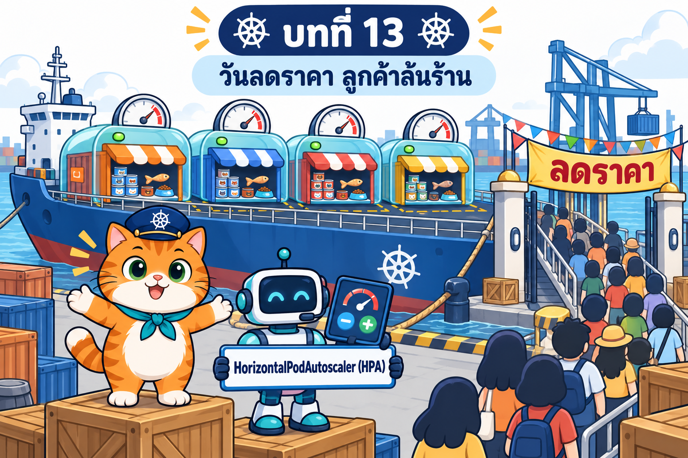

# บทที่ 13: HorizontalPodAutoscaler (HPA) — หุ่นยนต์ผู้ช่วยเปิด/ปิดบูธตามจำนวนลูกค้า

> **รายวิชา:** Software Development Tools and Environments (DevTools)
> **หัวข้อ:** Kubernetes HorizontalPodAutoscaler — เหตุผลของ autoscaling, HPA/VPA/Cluster Autoscaler/KEDA, metrics pipeline และ metrics-server v0.9.0 (`--kubelet-insecure-tls` บน kind), `kubectl top`, HPA `autoscaling/v2` (`kubectl autoscale --cpu=50%`, scaleTargetRef, min/max, ชนิด metric, Utilization/AverageValue), requests กับ % ความเหนื่อย, สูตร `desiredReplicas` และ tolerance, `behavior` (stabilizationWindowSeconds, policies, selectPolicy), กับดัก `replicas` ใน YAML, ResourceQuota/Pending, memory-based HPA และแนวปฏิบัติ
> **ผลลัพธ์การเรียนรู้ที่เกี่ยวข้อง:** CLO-5, CLO-6

<p align="center">
  <br>
  <em>เปิดบทที่ 13: ร้านน้องส้มประกาศวันลดราคา ลูกค้าแห่เข้าประตูหน้าท่าเรือ บูธหน้าร้านเริ่มไม่พอ น้องส้มจึงหาผู้ช่วยที่เพิ่ม/ลดบูธให้เอง</em>
</p>

## บทนี้เรียนอะไร

บทที่ 12 ร้านอาหารแมวน้องส้มมีประตูหน้าท่าเรือบานเดียว (Traefik + Ingress) ลูกค้าเข้า `https://shop.localhost:30081` ได้แล้ว แต่หน้าร้าน `som-web` ยังมี **3 บูธตายตัว** วันลดราคาลูกค้าล้นจนคิวยาว ตอนดึกบูธว่างเปลืองที่ และทุกครั้งที่จะเพิ่ม/ลดบูธต้องมีคนสั่ง `kubectl scale` เอง บทนี้แนะนำ **HorizontalPodAutoscaler (HPA)** หรือ **หุ่นยนต์ผู้ช่วยผู้จัดการ** ที่ดู **กระดานคะแนนความเหนื่อย** ซึ่ง **เจ้าหน้าที่จดมิเตอร์ (metrics-server)** จดไว้ทุก 15 วินาที แล้วบอกผู้จัดการร้าน (Deployment) ว่าควรเปิดกี่บูธ ภายในราง `minReplicas`–`maxReplicas` และด้วยความเร็วที่ตั้งไว้ใน `behavior` (นาฬิกาทราย) LAB 1–10 ใช้แอปตัวอย่าง `php-apache` ของเอกสารทางการเพื่อทำให้ HPA เพิ่ม/ลด/พังทีละแบบ ปิดท้ายด้วย **ร้านน้องส้ม `som-shop-v9`** (หน้าร้าน `som-shop-web:1.7` ที่เพิ่ม `/api/work`) ที่ลูกค้าจำลองยิงผ่านประตู Traefik แล้วหน้าร้านขยาย 2 → 6 บูธและกลับเป็น 2 เองโดยลูกค้าไม่เจอ error ส่วนครัว `som-db-0` ไม่ถูก scale

| ส่วน | เนื้อหา | ลิงก์ |
|---|---|---|
| 📖 **ทฤษฎี** | ปัญหาของจำนวน Pod คงที่และ scale ด้วยมือ, autoscaling 3 ทิศ (HPA, VPA, Cluster Autoscaler/Karpenter) และ KEDA, ท่อส่งมิเตอร์ kubelet → metrics-server → APIService `v1beta1.metrics.k8s.io` → HPA/`kubectl top`, ใบรับรอง kubelet บน kind กับ `--kubelet-insecure-tls`, HPA `autoscaling/v2` (control loop 15 วินาที, `/scale`, Conditions), ชนิด metric และ target, requests กับ % ที่เกิน 100 ได้และ `<unknown>`, สูตร `ceil(current × metric ÷ target)` + tolerance (field `tolerance` GA ใน v1.37) + หลาย metric + Pod ที่ยังไม่พร้อม, `behavior` และ flapping, กับดัก `replicas`/last-applied, rolling update/probe/preStop, memory-based HPA, StatefulSet, ResourceQuota/Pending, ตารางเปรียบเทียบ แนวปฏิบัติ และปัญหาที่ยังเหลือ (44 ภาพประกอบ + คำถามทบทวนพร้อมแนวคำตอบ) | [01_Theory/README.md](01_Theory/README.md) |
| 🧪 **ปฏิบัติการ** | LAB 0–11 จากง่ายไปยาก: เตรียมคลัสเตอร์และ build `som-shop-web:1.7` → ติดตั้ง metrics-server (ลองผิด x509 ก่อน) → HPA ตัวแรก → ยิงโหลดดู scale up → scale down และนาฬิกาทราย → ลืม requests → คิดสูตรเทียบของจริง → behavior เพิ่มทีละ 1 บูธ → หลาย metric (CPU + memory) → ชนเพดาน ResourceQuota และ Pending → กับดัก `replicas` ใน YAML → **LAB สุดท้าย: ร้านน้องส้มวันลดราคา** (พร้อมภาพหน้าจอจริง 5 ภาพ) และ Troubleshooting, Checklist, ตารางเก็บกวาด | [02_LAB/README.md](02_LAB/README.md) |

## คำแนะนำในการเรียน

1. **อ่านทฤษฎีหัวข้อ 1–4 ก่อน** (ปัญหา, autoscaling 3 ทิศ, ท่อส่งมิเตอร์) แล้วเริ่ม LAB 0–1 ได้
2. ก่อน LAB 2–4 อ่านหัวข้อ 5 และ 8 ก่อน LAB 5 อ่านหัวข้อ 6 ก่อน LAB 6 อ่านหัวข้อ 7 ก่อน LAB 7 อ่านหัวข้อ 8 ก่อน LAB 8–10 อ่านหัวข้อ 9 และก่อน LAB 11 อ่านหัวข้อ 9–10
3. ทำ LAB **ตามลำดับ** metrics-server ที่ติดตั้งใน LAB 1 ใช้ต่อจนจบบท HPA `php-apache` ถูก apply ทับต่อกันตั้งแต่ LAB 2 ถึง LAB 10 และ **ต้องลบ namespace `hpa-demo`, `hpa-load` (ท้าย LAB 10) ก่อนเริ่ม LAB 11** ทำบล็อก "เก็บกวาด" ทุกครั้ง ใช้เวลารวมประมาณ 3–3.5 ชั่วโมง (ส่วนใหญ่เป็นเวลารอ HPA)
4. สังเกตสัญลักษณ์ว่าคำสั่งรันที่ไหน: 🖥️ บนเครื่องนักศึกษา / 🐧 ใน SSH session ของ k8s-lab / 🌐 browser หลาย LAB ใช้ **2 หน้าต่าง SSH** (ดูค่าด้วย `watch-hpa.sh` + สั่งยิงโหลด)
5. ผลลัพธ์ในเอกสารมาจากการทดลองจริง (Kubernetes v1.37.0, kubectl v1.37.1, metrics-server v0.9.0, Traefik v3.7.13, 5 ตุลาคม 2569) **บนเครื่องที่จำกัดไว้ 4 CPU** เวลา, % CPU, ชื่อ Pod และจำนวนขั้นที่ HPA เพิ่ม **อาจต่างจากเครื่องของนักศึกษา** เครื่อง 4 core ใช้ลูกค้าจำลอง `customers=1` เครื่อง 8 core ขึ้นไปใช้ `2` ได้ (รายละเอียดในบทนำของ LAB)
6. เครื่อง ARM (Mac Apple Silicon): `registry.k8s.io/hpa-example` เป็น amd64 อย่างเดียว ให้ใช้ไฟล์ชุด `-arm` ตามที่ LAB บอก (ทดสอบบนเครื่อง amd64 แล้ว ยังไม่ได้ลองบน ARM จริง)
7. รหัสผ่านทุกตัวในบทนี้ (`passwd`, `meow1234`, `meow-admin-123`) เป็น **ค่าตัวอย่างเพื่อการเรียนเท่านั้น** และ `--kubelet-insecure-tls` ใช้ **เฉพาะ LAB** ห้ามใช้ใน production
8. ลองตอบคำถามทบทวนด้วยตัวเองก่อนเปิดดูแนวคำตอบ

> **ขอบเขตของบทนี้:** ใช้ทุกอย่างของบทที่ 1–12 (Pod, Node, Namespace/ResourceQuota, ReplicaSet, Service, Deployment, PV/PVC, StatefulSet, ConfigMap, Secret, Ingress + Traefik) และ **metrics-server + HPA `autoscaling/v2`** ติดตั้งด้วยไฟล์ YAML ในโฟลเดอร์บท **ไม่ใช้ Helm** (Helm เป็นบทถัดไป บทนี้ปูทางไว้เท่านั้น) ส่วน **VPA, Cluster Autoscaler/Karpenter และ KEDA เรียนเป็นทฤษฎี** ไม่มี LAB

## สิ่งที่ต้องผ่านก่อน

**ต้องผ่านบทที่ 1–12 ก่อน** โดยแบ่งเป็นพื้นฐาน (บทที่ 1–4) และชุดเรื่องต่อเนื่องของร้านน้องส้ม (บทที่ 5 → 6 → 7 แล้วต่อด้วย 8 → 9 → 10 → 11 → 12) บทนี้ต่อจาก **บทที่ 12 Ingress** โดยตรง

- **พื้นฐาน (ต้องผ่านบทที่ 1–4 ก่อน)**
  - [บทที่ 1: Kubernetes และสถาปัตยกรรม](../001_kubernetes-introduction/01_Theory/README.md) และ [LAB บทที่ 1](../001_kubernetes-introduction/02_LAB/readme.md): มี container **`k8s-lab`** ที่ publish พอร์ต `2223`, `8889` และ **`30080–30082`** ล็อกอินได้ด้วย `ssh -p 2223 root@localhost` (รหัส `passwd` ใช้เพื่อการเรียนเท่านั้น) และรู้จัก kube-controller-manager (ที่อยู่ของ HPA controller)
  - [บทที่ 2: Kubernetes Pod](../002_kubernetes_pod/01_Theory/README.md) และ [LAB บทที่ 2](../002_kubernetes_pod/02_LAB/README.md): requests/limits, readinessProbe และ lifecycle hook (preStop)
  - [บทที่ 3: Node กับ Pod](../003_kubernetes_node_pod/01_Theory/README.md) และ [LAB บทที่ 3](../003_kubernetes_node_pod/02_LAB/README.md): allocatable, scheduler, taint ของ control-plane และ Pod `Pending` เพราะ `Insufficient cpu`
  - [บทที่ 4: Namespace](../004_kubernetes_namespace/01_Theory/README.md) และ [LAB บทที่ 4](../004_kubernetes_namespace/02_LAB/README.md): ResourceQuota (`exceeded quota`) และ LimitRange
- **ชุดเรื่องต่อเนื่องของร้านน้องส้ม: บทที่ 5 → 6 → 7 เป็นเรื่องต่อเนื่องกัน แล้วต่อด้วยบทที่ 8 → 9 → 10 → 11 → 12**
  - [บทที่ 5: ReplicaSet](../005_kubernetes_replicaset/01_Theory/README.md), [บทที่ 6: Service](../006_kubernetes_service/01_Theory/README.md) และ [บทที่ 7: Deployment](../007_kubernetes_deployment/01_Theory/README.md) พร้อม LAB ([5](../005_kubernetes_replicaset/02_LAB/README.md), [6](../006_kubernetes_service/02_LAB/README.md), [7](../007_kubernetes_deployment/02_LAB/README.md)): `kubectl scale`, EndpointSlice, rolling update (`maxSurge`, `maxUnavailable: 0`, preStop), `rollout history` และ `kubectl apply` กับ last-applied-configuration
  - [บทที่ 8: PersistentVolume และ PVC](../008_kubernetes_pv_pvc/01_Theory/README.md) และ [LAB บทที่ 8](../008_kubernetes_pv_pvc/02_LAB/README.md): ข้อมูลฐานข้อมูลอยู่ใน PVC
  - [บทที่ 9: StatefulSet](../009_kubernetes_statefulset/01_Theory/README.md) และ [LAB บทที่ 9](../009_kubernetes_statefulset/02_LAB/README.md): db เป็น StatefulSet `som-db` และเหตุผลที่ scale db แล้วได้ข้อมูลแยกกัน (บทนี้จึงไม่ใช้ HPA กับ db)
  - [บทที่ 10: ConfigMap](../010_kubernetes_configmap/01_Theory/README.md) และ [LAB บทที่ 10](../010_kubernetes_configmap/02_LAB/README.md): ป้ายร้านจาก ConfigMap (บทนี้เปลี่ยนเป็นป้ายวันลดราคา)
  - [บทที่ 11: Secret](../011_kubernetes_secret/01_Theory/README.md) และ [LAB บทที่ 11](../011_kubernetes_secret/02_LAB/README.md): Secret รหัส DB, TLS และ basic-auth ของร้าน
  - [บทที่ 12: Ingress](../012_kubernetes_ingress/01_Theory/README.md) และ [LAB บทที่ 12](../012_kubernetes_ingress/02_LAB/README.md) **(ต้องผ่านก่อน)**: Traefik v3.7.13 (NodePort 30080/30081/30082), Ingress + Middleware `redirect-https`/`admin-auth`, dashboard ของ Traefik และร้าน `som-shop-v8` ที่บทนี้รับมาทำต่อ
- คลัสเตอร์ kind `lab` และร้านท้ายบทที่ 12 **ใช้ต่อได้** (LAB 0 ตรวจสภาพร้าน และ LAB 11 ย้ายหน้าร้าน 1.6 + `replicas: 3` ให้ HPA ดูแล) ถ้ายังไม่มีคลัสเตอร์ LAB 0 จะสร้างใหม่ด้วย `k8s-up` และ LAB 11 มีขั้นตั้งร้านใหม่บนคลัสเตอร์ใหม่ (Traefik จากสำเนาในโฟลเดอร์ `02_LAB/ingress-controller/`, postgres ด้วย `docker save --platform` + `kind load image-archive`)
- เครื่องต่ออินเทอร์เน็ตได้ (Node ดึง image `registry.k8s.io/metrics-server/metrics-server:v0.9.0`, `registry.k8s.io/hpa-example`, `busybox:1.36`, `curlimages/curl:8.22.0` เอง) และมี CPU อย่างน้อย 4 core

## บทที่ 5 → 6 → 7 → 8 → 9 → 10 → 11 → 12 → 13 เป็นเรื่องต่อเนื่องกัน

บทที่ 5–13 ใช้ร้านน้องส้มเรื่องเดียวกันต่อเนื่อง บทนี้รับร้านจาก **ท้ายบทที่ 12** (หน้าร้าน `som-web` 3 บูธรุ่น 1.6 + db StatefulSet + ConfigMap + Secret + Traefik/Ingress ที่ `https://shop.localhost:30081`) มาให้หุ่นยนต์ผู้ช่วยดูแลจำนวนบูธ

| บท | ตัวละครใหม่ | ปัญหาที่แก้ |
|---|---|---|
| [5 ReplicaSet](../005_kubernetes_replicaset/) | หัวหน้ากะ | บูธหายแล้วไม่มีใครสร้างแทน → มีบูธครบจำนวนเสมอ |
| [6 Service](../006_kubernetes_service/) | ประภาคาร, คลิปบอร์ดรายชื่อบูธ, ประตู 30080 | ชื่อ/IP ของบูธเปลี่ยนทุกครั้ง → ที่อยู่คงที่ของร้าน |
| [7 Deployment](../007_kubernetes_deployment/) | ผู้จัดการร้าน, สมุดบันทึกรุ่น | เปลี่ยนรุ่นต้องลบบูธเองจนร้านสะดุด → เปลี่ยนรุ่นทีละบูธ ย้อนรุ่นได้ |
| [8 PV/PVC](../008_kubernetes_pv_pvc/) | ตู้เซฟบนเรือ, ใบเบิก | ข้อมูล db หายเมื่อ Pod db เกิดใหม่ → ข้อมูลอยู่ในตู้ที่อายุยืนกว่า Pod |
| [9 StatefulSet](../009_kubernetes_statefulset/) | หัวหน้ากะถือเครื่องจ่ายบัตรคิว, สมุดรายชื่อ | db มีได้ตัวเดียวและชื่อสุ่ม → ชื่อคงที่ `som-db-0`, DNS รายตัว, ตู้เซฟประจำตัว |
| [10 ConfigMap](../010_kubernetes_configmap/) | กระดานประกาศของโซน, ป้ายติดอก, กระดานเล็กในบูธ | เปลี่ยนชื่อร้าน/ประกาศต้องแก้ YAML หรือ build image → ค่าอยู่ใน ConfigMap |
| [11 Secret](../011_kubernetes_secret/) | ซองปิดผนึกในกล่องกุญแจ, ท่อแก้วปิดสนิท (TLS) | รหัสผ่านอยู่ใน YAML → รหัสอยู่ใน Secret และเปิด HTTPS |
| [12 Ingress](../012_kubernetes_ingress/) | ป้ายบอกทางที่ประตูหน้าท่าเรือ, หุ่นยนต์พนักงานต้อนรับ, ด่านในทางเดิน (Middleware), กระดานแก้ว (dashboard) | ลูกค้าต้องจำเลขประตู → ประตูเดียวด้วยชื่อ `shop.localhost`/`admin.localhost` และ TLS ที่ประตู |
| **13 HPA** (บทนี้) | เจ้าหน้าที่จดมิเตอร์ (metrics-server), กระดานคะแนนความเหนื่อย (`kubectl top`), หุ่นยนต์ผู้ช่วยผู้จัดการ (HPA), เส้นความเหนื่อย (target), รางบูธสมอเขียว/ตัวกั้นแดง (min/max), นาฬิกาทราย (stabilization window) | จำนวนบูธตายตัว 3 ตัว ต้องมีคนเฝ้า scale → หน้าร้านเพิ่ม/ลดบูธเองตามความเหนื่อย 2 ↔ 6 โดยลูกค้าไม่เจอ error และ db ไม่ถูก scale |

LAB สุดท้ายของบทนี้จบด้วยร้านที่รับวันลดราคาได้เองแล้ว แต่ยังเหลือโจทย์: ติดตั้ง metrics-server, Traefik และร้านหลายไฟล์ต้องทำตามลำดับเอง อยากติดตั้ง/อัปเกรด/ถอนเป็นแพ็กเกจเดียว (→ **Helm** บทถัดไป), ขนาดบูธยังต้องเดา (→ **VPA**), เรือเต็มแล้วไม่มีใครเรียกเรือเพิ่ม (→ **Cluster Autoscaler**) และงานที่ควร scale ตามคิวหรือหลับเหลือ 0 (→ **KEDA**)

## ตัวละครของบทนี้

<p align="center">
  <br>
  <em>น้องส้ม — ผู้ช่วยกัปตัน Kubernetes แมวส้มสวมหมวกกัปตันพวงมาลัยเรือและผ้าพันคอสีเขียวอมฟ้า (ภาพอ้างอิงตัวละครที่ใช้ในภาพประกอบทุกภาพ) บทนี้น้องส้มจ้างเจ้าหน้าที่จดมิเตอร์และหุ่นยนต์ผู้ช่วยผู้จัดการให้ร้านรับวันลดราคาได้เอง</em>
</p>

## โครงสร้างโฟลเดอร์

```text
013_kubernetes_hpa/
├── README.md                         ← หน้านี้
├── 01_Theory/
│   ├── README.md                     ← เอกสารทฤษฎี
│   └── images/                       ← ภาพตัวละคร 00 + ภาพประกอบ 01–44 (+ imagegen-prompts.md)
└── 02_LAB/
    ├── README.md                     ← คู่มือ LAB 0–11
    ├── .gitignore                    ← กัน *.key, *.crt
    ├── images/                       ← ภาพประกอบ LAB 01–28 (+ imagegen-prompts.md) และ screenshots/ ภาพหน้าจอจริงของ LAB 11 จำนวน 5 ภาพ
    ├── watch-hpa.sh                  ← พิมพ์ "วินาที TARGETS replicas= ready=" ทุก 5 วินาที (ใช้ทุก LAB ที่ดู scale)
    ├── metrics-server/               ← LAB 1: components-v0.9.0.yaml (ต้นฉบับ ไว้ลองผิด) + 00-metrics-server.yaml (+ --kubelet-insecure-tls)
    ├── ingress-controller/           ← Traefik v3.7.13 สำเนาจากบทที่ 12 (ใช้เฉพาะคลัสเตอร์ใหม่ใน LAB 11)
    ├── lab02-first/                  ← 10-php-apache.yaml (+ -arm), 20-hpa-php.yaml
    ├── lab03-load/                   ← 30-load.yaml (+ -arm) ตัวยิงโหลด busybox wget -T 2
    ├── lab04-scaledown/              ← 40-hpa-fast-down.yaml (scaleDown window 30 วินาที)
    ├── lab05-norequests/             ← 50-no-requests.yaml (+ -arm)
    ├── lab06-formula/                ← formula.sh (คิดสูตร desiredReplicas เทียบกับ HPA)
    ├── lab07-behavior/               ← 70-hpa-slow-up.yaml (scaleUp Pods 1 ต่อ 15 วินาที)
    ├── lab08-multi/                  ← 80-hpa-multi.yaml (cpu 50% + memory 6Mi)
    ├── lab09-limits/                 ← 90-quota.yaml (ResourceQuota), big-requests.sh (requests 60% ของ Node)
    ├── lab10-replicas/               ← 10-php-apache-hpa.yaml (ไม่มี replicas)
    └── som-shop-v9/                  ← LAB 11 ร้านน้องส้มวันลดราคา
        ├── app/                      ← แอป Next.js 1.7 = 1.6 + app/api/work/route.ts (build เป็น som-shop-web:1.7)
        ├── k8s/                      ← 00-namespace, 10-db, 15-config (ป้ายวันลดราคา), 20-web (1.7 ไม่มี replicas), 40-admin, 50-ingress, 60-hpa (min 2 max 6), 70-customers (ลูกค้าจำลอง)
        ├── .gitignore                ← กัน secret.yaml, *.secret.yaml, *.key, *.crt
        └── hit.sh                    ← ยิง HTTPS ผ่าน Ingress แล้วนับ ok/err
```

ใน LAB 0 จะคัดลอกโฟลเดอร์ทั้งหมดนี้เข้า container ด้วย 🖥️ `docker cp 013_kubernetes_hpa k8s-lab:/workspace/` แล้วทำงานที่ `/workspace/013_kubernetes_hpa/02_LAB` ภายใน k8s-lab (ร้านของ LAB 11 อยู่ที่ `/workspace/013_kubernetes_hpa/02_LAB/som-shop-v9/`) เปิดร้านใน 🌐 browser ที่ `http://shop.localhost:30080` (ถูกส่งต่อไป `https://shop.localhost:30081`) และ dashboard ของ Traefik ที่ `http://localhost:30082/dashboard/` เพื่อดูจำนวนบูธ (servers) ที่เพิ่ม/ลดตาม HPA

## เริ่มเลย

👉 [อ่านทฤษฎี](01_Theory/README.md) → [ลงมือทำ LAB](02_LAB/README.md) → บทก่อนหน้า: [บทที่ 12 Ingress](../012_kubernetes_ingress/)
