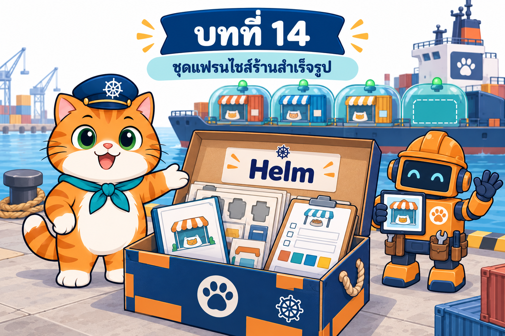

# บทที่ 14: Helm — ชุดแฟรนไชส์ร้านน้องส้ม เปิดสาขาทั้งร้านด้วยคำสั่งเดียว

> **รายวิชา:** Software Development Tools and Environments (DevTools)
> **หัวข้อ:** Helm 4 (v4.3.0) package manager ของ Kubernetes — chart, values, release, revision, repository; โครงสร้าง chart และ Go template + Sprig (`include`, `default`, `required`, `lookup`, `toYaml | nindent`, checksum annotation); ลำดับความสำคัญของ values และกับดัก upgrade; `helm template`/`lint`/`--dry-run`; install/upgrade/rollback/uninstall, `--wait`, `--rollback-on-failure`, `--keep-history`; server-side apply, field manager, `--take-ownership`/`--force-conflicts`; release Secret; hooks และ `helm test`; subchart; repository แบบ HTTP และ OCI, Artifact Hub; ความปลอดภัยของแหล่ง chart (กรณี Bitnami 2568); Helm เทียบ Kustomize และปูทาง GitOps/operator
> **ผลลัพธ์การเรียนรู้ที่เกี่ยวข้อง:** CLO-5, CLO-6

<p align="center">
  <br>
  <em>เปิดบทที่ 14: ร้านน้องส้มขายดีจนอยากเปิดสาขาใหม่ น้องส้มจึงแพ็กร้านทั้งร้านเป็นชุดแฟรนไชส์สำเร็จรูปที่ใช้เปิดสาขาได้ด้วยคำสั่งเดียว</em>
</p>

## บทนี้เรียนอะไร

ท้ายบทที่ 13 ร้านอาหารแมวน้องส้มเพิ่ม/ลดบูธเองได้แล้ว แต่ทั้งร้านยังเป็น **กองไฟล์ YAML** ที่ต้อง apply ตามลำดับ (namespace, db, config, web, admin, ingress, hpa, customers) บวก Traefik และ metrics-server ที่ติดตั้งด้วย static manifest อีกชุด พอน้องส้มอยากเปิด **สาขาที่ 2** (สาขาทดลอง dev) ก็เจอค่าซ้ำหลายไฟล์ ต้อง copy โฟลเดอร์แล้วแก้จนสองสาขาค่อย ๆ ต่างกัน และย้อนรุ่น "ทั้งร้าน" พร้อมกันไม่ได้ บทนี้แนะนำ **Helm** หรือ **หุ่นยนต์ผู้รับเหมาติดตั้งร้าน** ที่รับ **ชุดแฟรนไชส์ (chart)** + **ใบสั่งปรับแต่งร้าน (values)** แล้วเปิด **ร้านสาขา (release)** ทั้งร้านในคำสั่งเดียว พร้อม **สมุดบันทึกการปรับปรุงร้าน (revision)** ให้อัปเกรด ย้อนรุ่น และถอนได้เป็นชุด LAB เริ่มจาก chart สำเร็จรูป `podinfo` ฝึก values, history/rollback, `helm create` และการ debug แม่พิมพ์ อ่านชุดแฟรนไชส์ร้านน้องส้ม `charts/som-shop` ย้าย Traefik และ metrics-server ให้มาจาก chart ทางการ เก็บชุดในโกดัง OCI แล้วปิดท้ายด้วย **ร้านน้องส้มพร้อมส่ง**: เปิดสาขา dev ทั้งร้านด้วยคำสั่งเดียว รับร้านเดิมของบท 013 เข้ามาอยู่ใต้ Helm (ออเดอร์ไม่หาย) อัปเกรดเป็น `som-shop-web:1.8` และย้อนรุ่นระหว่างลูกค้าเข้าร้านโดยไม่มี error

| ส่วน | เนื้อหา | ลิงก์ |
|---|---|---|
| 📖 **ทฤษฎี** | ปัญหาของ YAML ล้วน, ศัพท์ 5 คำ (chart/values/release/revision/repository), ประวัติ Helm 2 (Tiller) → 3 → 4 และสิ่งที่เปลี่ยนใน Helm 4, โครงสร้าง chart (`version` vs `appVersion`, `crds/`, `charts/`), Go template + Sprig (built-in objects, pipeline, `nindent`, `if`/`range`/`with`, `_helpers.tpl`, `required`/`lookup`, checksum), ลำดับความสำคัญของ values + กับดัก upgrade + `values.schema.json`, การ render/debug (ช่องโหว่ของ `--dry-run=server`), lifecycle (`--wait` strategies, `--rollback-on-failure`, rollback ไม่ใส่เลข), server-side apply และการรับของเดิม (adopt), release Secret, hooks/`helm test`, subchart, HTTP vs OCI + Artifact Hub, ความปลอดภัยและกรณี Bitnami, Helm vs Kustomize, ปูทาง GitOps (Argo CD/Flux) และ operator, ตารางคำสั่ง Helm 4 และ Helm 3 → 4 (52 ภาพประกอบ + คำถามทบทวนพร้อมแนวคำตอบ) | [01_Theory/README.md](01_Theory/README.md) |
| 🧪 **ปฏิบัติการ** | LAB 0–12 จากง่ายไปยาก: เตรียมท่าเรือและ build 1.8 → แคตตาล็อก (repo/search/show/pull) → เปิดสาขาแรก podinfo → values และกับดัก upgrade → history/rollback/`--rollback-on-failure`/`--keep-history` → `helm create` + test → แม่พิมพ์พัง 4 แบบ + dry-run → อ่านแม่พิมพ์ `som-shop` → ใบสั่ง dev/prod + schema + lookup → hook seed + `helm test` + ถอด release Secret → ย้าย Traefik/metrics-server เป็น chart → OCI registry → **LAB สุดท้าย: ร้านน้องส้มพร้อมส่ง** (พร้อมภาพหน้าจอจริง 5 ภาพ) + LAB เสริม helm-diff/umbrella chart, Troubleshooting, Checklist, ตารางเก็บกวาด | [02_LAB/README.md](02_LAB/README.md) |

## คำแนะนำในการเรียน

1. **อ่านทฤษฎีหัวข้อ 1–4 ก่อน** (ปัญหา, Helm คืออะไร, Helm 4, โครงสร้าง chart) แล้วเริ่ม LAB 0–2 ได้
2. ก่อน LAB 3 อ่านหัวข้อ 6, ก่อน LAB 4 อ่านหัวข้อ 8 และ 10, ก่อน LAB 5–6 อ่านหัวข้อ 7, ก่อน LAB 7–8 อ่านหัวข้อ 5–6, ก่อน LAB 9 อ่านหัวข้อ 11, ก่อน LAB 10 อ่านหัวข้อ 9 และ 14, ก่อน LAB 11 อ่านหัวข้อ 13 และก่อน LAB 12 ทบทวนหัวข้อ 8–11
3. ทำ LAB **ตามลำดับ** แคตตาล็อกจาก LAB 1 ใช้ทั้งบท, Traefik/metrics-server จาก chart (LAB 10) ใช้ต่อใน LAB 12 และ **LAB 12 รับร้านจริงของบท 013 (`som-shop`) เข้า Helm** ทำบล็อก "เก็บกวาด" ทุกครั้ง ใช้เวลารวมประมาณ 3.5–4 ชั่วโมง
4. สังเกตสัญลักษณ์ว่าคำสั่งรันที่ไหน: 🖥️ บนเครื่องนักศึกษา / 🐧 ใน SSH session ของ k8s-lab / 🌐 browser — LAB 10 และ 12 ใช้ **2 หน้าต่าง SSH** (ยิงลูกค้าจำลองด้วย `hit.sh` + สั่ง helm)
5. ผลลัพธ์ในเอกสารมาจากการทดลองจริง (helm v4.3.0, Kubernetes v1.37.0, kubectl v1.37.1, kind 0.33.0, 6 ตุลาคม 2569) **บนเครื่องที่จำกัดไว้ 4 CPU** ต่อจากสภาพร้านท้ายบท 013 เวลา ชื่อ Pod จำนวนออเดอร์ และ **เลข revision** อาจต่างจากเครื่องของนักศึกษา ให้ดู `helm history` ของตัวเองก่อน rollback ทุกครั้ง
6. เครื่อง ARM (Mac Apple Silicon): **ยังไม่ได้ทดสอบบน ARM จริง** image ภายนอกที่ใช้คาดว่าเป็น multi-arch ถ้าต้องสร้างคลัสเตอร์ใหม่ให้ `docker save --platform linux/arm64` สำหรับ postgres (รายละเอียดในบทนำของ LAB)
7. รหัสผ่านทุกตัวในบทนี้ (`passwd`, `meow1234`, `purr5678`, `meow-admin-123`, `meow-registry-123`) เป็น **ค่าตัวอย่างเพื่อการเรียนเท่านั้น** และค่าที่ลดความปลอดภัย (`api.insecure`, `--kubelet-insecure-tls`, `--plain-http`, `--verify=false`) ใช้ **เฉพาะ LAB**
8. ลองตอบคำถามทบทวนด้วยตัวเองก่อนเปิดดูแนวคำตอบ

> **ขอบเขตของบทนี้:** ใช้ Helm 4 ติดตั้ง/อัปเกรด/ย้อนรุ่น chart ภายนอก (podinfo, Traefik, metrics-server) และ chart ที่เตรียมไว้ของร้าน (`som-shop` อ่านและใช้ ไม่ต้องเขียนเองตั้งแต่ศูนย์) ส่วน **GitOps (Argo CD/Flux), Kustomize แบบเต็ม, External Secrets/Sealed Secrets/SOPS และ operator เรียนเป็นทฤษฎี** ไม่มี LAB ไม่ใช้ chart/image ของ Bitnami และไม่ push อะไรไป registry ภายนอก

## สิ่งที่ต้องผ่านก่อน

**ต้องผ่านบทที่ 1–13 ก่อน** โดยแบ่งเป็นพื้นฐาน (บทที่ 1–4) และชุดเรื่องต่อเนื่องของร้านน้องส้ม (บทที่ 5 → 6 → 7 แล้วต่อด้วย 8 → 9 → 10 → 11 → 12 → 13) บทนี้ต่อจาก **บทที่ 13 HPA** โดยตรง

- **พื้นฐาน (ต้องผ่านบทที่ 1–4 ก่อน)**
  - [บทที่ 1: Kubernetes และสถาปัตยกรรม](../001_kubernetes-introduction/01_Theory/README.md) และ [LAB บทที่ 1](../001_kubernetes-introduction/02_LAB/readme.md): มี container **`k8s-lab`** ที่ publish พอร์ต `2223`, `8889` และ **`30080–30082`** ล็อกอินได้ด้วย `ssh -p 2223 root@localhost` (รหัส `passwd` ใช้เพื่อการเรียนเท่านั้น) และมี `helm` ติดตั้งมาใน image แล้ว
  - [บทที่ 2: Kubernetes Pod](../002_kubernetes_pod/01_Theory/README.md) และ [LAB บทที่ 2](../002_kubernetes_pod/02_LAB/README.md): probe, securityContext, requests/limits
  - [บทที่ 3: Node กับ Pod](../003_kubernetes_node_pod/01_Theory/README.md) และ [LAB บทที่ 3](../003_kubernetes_node_pod/02_LAB/README.md): Node ของ kind และการดึง image ของ kubelet
  - [บทที่ 4: Namespace](../004_kubernetes_namespace/01_Theory/README.md) และ [LAB บทที่ 4](../004_kubernetes_namespace/02_LAB/README.md): namespace, label และ Pod Security
- **ชุดเรื่องต่อเนื่องของร้านน้องส้ม: บทที่ 5 → 6 → 7 เป็นเรื่องต่อเนื่องกัน แล้วต่อด้วยบทที่ 8 → 9 → 10 → 11 → 12 → 13**
  - [บทที่ 5: ReplicaSet](../005_kubernetes_replicaset/01_Theory/README.md), [บทที่ 6: Service](../006_kubernetes_service/01_Theory/README.md) และ [บทที่ 7: Deployment](../007_kubernetes_deployment/01_Theory/README.md) พร้อม LAB ([5](../005_kubernetes_replicaset/02_LAB/README.md), [6](../006_kubernetes_service/02_LAB/README.md), [7](../007_kubernetes_deployment/02_LAB/README.md)): selector (แก้ไม่ได้หลังสร้าง), rolling update, `rollout undo` และ `kubectl apply`
  - [บทที่ 8: PersistentVolume และ PVC](../008_kubernetes_pv_pvc/01_Theory/README.md) และ [LAB บทที่ 8](../008_kubernetes_pv_pvc/02_LAB/README.md): ข้อมูลอยู่ใน PVC ที่อายุยืนกว่า Pod
  - [บทที่ 9: StatefulSet](../009_kubernetes_statefulset/01_Theory/README.md) และ [LAB บทที่ 9](../009_kubernetes_statefulset/02_LAB/README.md): `som-db`, `volumeClaimTemplates` และ PVC ที่ไม่ถูกลบตามไปด้วย
  - [บทที่ 10: ConfigMap](../010_kubernetes_configmap/01_Theory/README.md) และ [LAB บทที่ 10](../010_kubernetes_configmap/02_LAB/README.md): ป้ายร้านจาก ConfigMap และ `rollout restart` เมื่อค่าเปลี่ยน
  - [บทที่ 11: Secret](../011_kubernetes_secret/01_Theory/README.md) และ [LAB บทที่ 11](../011_kubernetes_secret/02_LAB/README.md): base64 ไม่ใช่การเข้ารหัส, RBAC ของ Secret, TLS และ `imagePullSecrets`
  - [บทที่ 12: Ingress](../012_kubernetes_ingress/01_Theory/README.md) และ [LAB บทที่ 12](../012_kubernetes_ingress/02_LAB/README.md): Traefik v3.7.13 แบบ static, CRD, Middleware และประตู `shop.localhost`/`admin.localhost`
  - [บทที่ 13: HPA](../013_kubernetes_hpa/01_Theory/README.md) และ [LAB บทที่ 13](../013_kubernetes_hpa/02_LAB/README.md) **(ต้องผ่านก่อน)**: metrics-server v0.9.0 แบบ static, HPA 2–6 และร้าน `som-shop-v9` (หน้าร้าน 1.7) ที่บทนี้รับมาเข้า Helm
- คลัสเตอร์ kind `lab` และร้านท้ายบทที่ 13 **ใช้ต่อได้** ถ้ายังไม่มีคลัสเตอร์ LAB 0 มีทางสำรองสร้างใหม่ด้วย `k8s-up` + ไฟล์ Traefik/metrics-server ที่สำเนาไว้ในโฟลเดอร์ของบทนี้ และ LAB 12 มีทางติดตั้งสาขา prod ใหม่แทนการรับร้านเดิม
- เครื่องต่ออินเทอร์เน็ตได้ (chart repository, Artifact Hub, `ghcr.io`, Docker Hub) และมี CPU อย่างน้อย 4 core

## บทที่ 5 → 6 → … → 13 → 14 เป็นเรื่องต่อเนื่องกัน

บทที่ 5–14 ใช้ร้านน้องส้มเรื่องเดียวกันต่อเนื่อง บทนี้รับร้านจาก **ท้ายบทที่ 13** (หน้าร้าน `som-web` 1.7 + HPA 2–6 + db StatefulSet + ConfigMap + Secret + Traefik/Ingress + metrics-server ที่ติดตั้งด้วย `kubectl apply` ทั้งหมด) มาแพ็กเป็นชุดแฟรนไชส์

| บท | ตัวละครใหม่ | ปัญหาที่แก้ |
|---|---|---|
| [5 ReplicaSet](../005_kubernetes_replicaset/) | หัวหน้ากะ | บูธหายแล้วไม่มีใครสร้างแทน → มีบูธครบจำนวนเสมอ |
| [6 Service](../006_kubernetes_service/) | ประภาคาร, คลิปบอร์ดรายชื่อบูธ, ประตู 30080 | ชื่อ/IP ของบูธเปลี่ยนทุกครั้ง → ที่อยู่คงที่ของร้าน |
| [7 Deployment](../007_kubernetes_deployment/) | ผู้จัดการร้าน, สมุดบันทึกรุ่น | เปลี่ยนรุ่นต้องลบบูธเองจนร้านสะดุด → เปลี่ยนรุ่นทีละบูธ ย้อนรุ่นได้ |
| [8 PV/PVC](../008_kubernetes_pv_pvc/) | ตู้เซฟบนเรือ, ใบเบิก | ข้อมูล db หายเมื่อ Pod db เกิดใหม่ → ข้อมูลอยู่ในตู้ที่อายุยืนกว่า Pod |
| [9 StatefulSet](../009_kubernetes_statefulset/) | หัวหน้ากะถือเครื่องจ่ายบัตรคิว, สมุดรายชื่อ | db มีได้ตัวเดียวและชื่อสุ่ม → ชื่อคงที่ `som-db-0`, DNS รายตัว, ตู้เซฟประจำตัว |
| [10 ConfigMap](../010_kubernetes_configmap/) | กระดานประกาศของโซน | เปลี่ยนชื่อร้าน/ประกาศต้องแก้ YAML หรือ build image → ค่าอยู่ใน ConfigMap |
| [11 Secret](../011_kubernetes_secret/) | ซองปิดผนึกในกล่องกุญแจ, ท่อแก้วปิดสนิท (TLS) | รหัสผ่านอยู่ใน YAML → รหัสอยู่ใน Secret และเปิด HTTPS |
| [12 Ingress](../012_kubernetes_ingress/) | ป้ายบอกทางที่ประตูหน้าท่าเรือ, หุ่นยนต์พนักงานต้อนรับ, ด่านในทางเดิน | ลูกค้าต้องจำเลขประตู → ประตูเดียวด้วยชื่อ `shop.localhost`/`admin.localhost` |
| [13 HPA](../013_kubernetes_hpa/) | เจ้าหน้าที่จดมิเตอร์, หุ่นยนต์ผู้ช่วยผู้จัดการ, นาฬิกาทราย | จำนวนบูธตายตัว → เพิ่ม/ลดบูธเองตามความเหนื่อย 2 ↔ 6 |
| **14 Helm** (บทนี้) | หุ่นยนต์ผู้รับเหมา (helm), ชุดแฟรนไชส์ (chart), ใบสั่ง (values), ร้านสาขา (release), สมุดบันทึกการปรับปรุงร้าน (revision), แคตตาล็อก/โกดัง (repository/OCI), ด่านตรวจใบสั่ง (schema), ขั้นตอนพิเศษหลังเปิดร้าน (hook), ผู้ตรวจรับร้าน (`helm test`), ป้ายชื่อเจ้าของบนช่อง (field manager) | ร้านเป็นกองไฟล์ที่ต้อง apply ตามลำดับ เปิดสาขาใหม่ต้อง copy แล้ว drift ย้อนทั้งร้านไม่ได้ → chart เดียว + ใบสั่งต่อสาขา ติดตั้ง/อัปเกรด/ย้อน/ถอนทั้งร้านด้วยคำสั่งเดียว |

LAB สุดท้ายของบทนี้จบด้วยร้านที่ติดตั้งและย้อนรุ่นได้เป็นชุด แต่ยังเหลือโจทย์: ยังต้องมีคนพิมพ์ `helm upgrade` เอง และไม่มีใครรู้ถ้ามีคนแก้ร้านด้วยมือ (→ **GitOps** Argo CD/Flux), รหัสยังอยู่ใน release Secret (→ External Secrets/Sealed Secrets/SOPS) และหลังติดตั้งแล้วไม่มีใครดูแลครัว (สำรองข้อมูล ซ่อม อัปเกรดฐานข้อมูล) (→ **operator** บทถัดไป)

## ตัวละครของบทนี้

<p align="center">
  <br>
  <em>น้องส้ม — ผู้ช่วยกัปตัน Kubernetes แมวส้มสวมหมวกกัปตันพวงมาลัยเรือและผ้าพันคอสีเขียวอมฟ้า (ภาพอ้างอิงตัวละครที่ใช้ในภาพประกอบทุกภาพ) บทนี้น้องส้มแพ็กร้านทั้งร้านเป็นชุดแฟรนไชส์ และทำงานคู่กับหุ่นยนต์ผู้รับเหมาหมวกนิรภัยสีส้มที่เปิดสาขาให้ในคำสั่งเดียว</em>
</p>

## โครงสร้างโฟลเดอร์

```text
014_kubernetes_helm/
├── README.md                          ← หน้านี้
├── 01_Theory/
│   ├── README.md                      ← เอกสารทฤษฎี
│   └── images/                        ← ภาพตัวละคร 00 + ภาพประกอบ 01–52 (+ imagegen-prompts.md)
└── 02_LAB/
    ├── README.md                      ← คู่มือ LAB 0–12 + LAB เสริม
    ├── .gitignore                     ← กัน *.key, *.crt, *.tgz, *.log และโฟลเดอร์ที่ LAB สร้าง
    ├── images/                        ← ภาพประกอบ LAB (+ imagegen-prompts.md) และ screenshots/ ภาพหน้าจอจริงของ LAB 12 จำนวน 5 ภาพ
    ├── hit.sh                         ← ยิง HTTPS ผ่าน Ingress แล้วนับ ok/err (LAB 10, 12)
    ├── som-shop-v10/app/              ← แอป Next.js โค้ดเดียวกับ 1.7 (build เป็น som-shop-web:1.8)
    ├── charts/
    │   ├── som-shop/                  ← ชุดแฟรนไชส์ร้านน้องส้ม: Chart.yaml, values.yaml, values.schema.json,
    │   │                                 templates/ (_helpers.tpl, configmap, secret, db, web, hpa, ingress, seed-job, tests/, NOTES.txt)
    │   ├── values-dev.yaml            ← ใบสั่งสาขา dev (dev.shop.localhost, 1 บูธ, ธีม sunset)
    │   └── values-prod.yaml           ← ใบสั่งสาขา prod (shop.localhost HTTPS, HPA 2–6)
    └── labs/
        ├── lab01-catalog/             ← ที่แตก chart traefik (helm pull --untar)
        ├── lab03-values/              ← podinfo-values.yaml
        ├── lab05-first/               ← ที่สร้าง mychart (helm create)
        ├── lab06-debug/               ← make-broken.sh (แม่พิมพ์พัง 4 แบบ)
        ├── lab10-addons/              ← traefik-values.yaml, metrics-server-values.yaml, static-old/ (สำเนาไฟล์ static บท 012/013)
        ├── lab11-registry/            ← ที่ทำงานของโกดัง OCI
        └── labx-extra/harbor-addons/  ← LAB เสริม: umbrella chart (metrics-server + podinfo)
```

ใน LAB 0 จะคัดลอกโฟลเดอร์ทั้งหมดนี้เข้า container ด้วย 🖥️ `docker cp 014_kubernetes_helm k8s-lab:/workspace/` แล้วทำงานที่ `/workspace/014_kubernetes_helm/02_LAB` ภายใน k8s-lab เปิดร้านใน 🌐 browser ที่ `http://shop.localhost:30080` (ถูกส่งต่อไป `https://shop.localhost:30081`) สาขา dev ที่ `http://dev.shop.localhost:30080` และ dashboard ของ Traefik ที่ `http://localhost:30082/dashboard/`

## เริ่มเลย

👉 [อ่านทฤษฎี](01_Theory/README.md) → [ลงมือทำ LAB](02_LAB/README.md) → บทก่อนหน้า: [บทที่ 13 HPA](../013_kubernetes_hpa/)
