# Kubernetes และสถาปัตยกรรมของ Kubernetes

> **รายวิชา:** Software Development Tools and Environments (DevTools)
> **หัวข้อ:** Container Orchestration ด้วย Kubernetes — แนวคิด สถาปัตยกรรม และองค์ประกอบของระบบ
> **ผลลัพธ์การเรียนรู้ที่เกี่ยวข้อง:** CLO-5, CLO-6

---

## บทคัดย่อ

เอกสารนี้นำเสนอแนวคิดพื้นฐานและสถาปัตยกรรมของ Kubernetes ซึ่งเป็นแพลตฟอร์มโอเพนซอร์สสำหรับการจัดการคอนเทนเนอร์ (container orchestration) ที่ได้รับการยอมรับอย่างแพร่หลายในอุตสาหกรรมซอฟต์แวร์ เนื้อหาครอบคลุมตั้งแต่ปัญหาที่เป็นแรงจูงใจให้เกิดระบบจัดการคอนเทนเนอร์ วิวัฒนาการของรูปแบบการติดตั้งใช้งานซอฟต์แวร์ องค์ประกอบของ Control Plane และ Worker Node กลไกการทำงานแบบ declarative และ reconciliation loop ตลอดจนทรัพยากรหลักของระบบ ได้แก่ workload, networking, storage และ configuration

เพื่อให้ผู้เรียนเข้าใจความสัมพันธ์ขององค์ประกอบต่าง ๆ ได้อย่างเป็นรูปธรรม เอกสารนี้ใช้ **อุปมาท่าเรือขนส่งตู้สินค้า** เป็นกรอบการอธิบายตลอดทั้งฉบับ กล่าวคือ ตู้สินค้าเทียบได้กับ container, เรือสินค้าเทียบได้กับ Worker Node และหอบังคับการท่าเรือเทียบได้กับ Control Plane ทั้งนี้ ชื่อ *Kubernetes* มีรากศัพท์จากภาษากรีก κυβερνήτης (kubernḗtēs) ซึ่งหมายถึง "ผู้ถือหางเสือ" หรือ "นายท้ายเรือ" สัญลักษณ์ของโครงการจึงเป็นพวงมาลัยเรือเจ็ดซี่

## วัตถุประสงค์การเรียนรู้

เมื่อศึกษาเอกสารนี้จบ ผู้เรียนควรสามารถ

1. อธิบายข้อจำกัดของการบริหารคอนเทนเนอร์ด้วยมือ และบทบาทของระบบ container orchestration ได้
2. จำแนกองค์ประกอบของ Control Plane และ Worker Node พร้อมอธิบายหน้าที่ กลไกการทำงาน และผลกระทบเมื่อองค์ประกอบนั้นขัดข้องได้
3. อธิบายลำดับเหตุการณ์ภายในระบบนับตั้งแต่ผู้ใช้ส่งคำสั่ง `kubectl apply` จนกระทั่ง Pod อยู่ในสถานะ `Running` ได้
4. อธิบายหลักการ declarative configuration และ reconciliation loop ได้
5. เลือกใช้ทรัพยากรประเภท workload, Service, Ingress, PersistentVolume, ConfigMap และ Secret ได้อย่างเหมาะสมกับลักษณะของแอปพลิเคชัน

## สารบัญ

1. [ความเป็นมาและแรงจูงใจ](#1-ความเป็นมาและแรงจูงใจ)
2. [วิวัฒนาการของรูปแบบการติดตั้งใช้งานซอฟต์แวร์](#2-วิวัฒนาการของรูปแบบการติดตั้งใช้งานซอฟต์แวร์)
3. [นิยามและขีดความสามารถของ Kubernetes](#3-นิยามและขีดความสามารถของ-kubernetes)
4. [ภาพรวมสถาปัตยกรรมของ Kubernetes Cluster](#4-ภาพรวมสถาปัตยกรรมของ-kubernetes-cluster)
5. [องค์ประกอบของ Control Plane](#5-องค์ประกอบของ-control-plane)
6. [องค์ประกอบของ Worker Node](#6-องค์ประกอบของ-worker-node)
7. [Pod: หน่วยการติดตั้งใช้งานที่เล็กที่สุด](#7-pod-หน่วยการติดตั้งใช้งานที่เล็กที่สุด)
8. [ลำดับการทำงานของระบบเมื่อสั่ง `kubectl apply`](#8-ลำดับการทำงานของระบบเมื่อสั่ง-kubectl-apply)
9. [Desired State และ Reconciliation Loop](#9-desired-state-และ-reconciliation-loop)
10. [ทรัพยากรประเภท Workload](#10-ทรัพยากรประเภท-workload)
11. [ระบบเครือข่าย: Service, DNS และ Ingress](#11-ระบบเครือข่าย-service-dns-และ-ingress)
12. [ระบบจัดเก็บข้อมูล: Volume, PV, PVC และ StorageClass](#12-ระบบจัดเก็บข้อมูล-volume-pv-pvc-และ-storageclass)
13. [Namespace, ConfigMap, Secret และ RBAC](#13-namespace-configmap-secret-และ-rbac)
14. [การฟื้นฟูตนเอง การตรวจสุขภาพ และการปรับขนาดอัตโนมัติ](#14-การฟื้นฟูตนเอง-การตรวจสุขภาพ-และการปรับขนาดอัตโนมัติ)
15. [Rolling Update และ Rollback](#15-rolling-update-และ-rollback)
16. [กรณีศึกษา: Manifest สำหรับเว็บแอปพลิเคชัน](#16-กรณีศึกษา-manifest-สำหรับเว็บแอปพลิเคชัน)
17. [คำสั่ง `kubectl` ที่ใช้บ่อยและแนวทางวินิจฉัยปัญหา](#17-คำสั่ง-kubectl-ที่ใช้บ่อยและแนวทางวินิจฉัยปัญหา)
18. [การเปรียบเทียบ Docker Compose กับ Kubernetes](#18-การเปรียบเทียบ-docker-compose-กับ-kubernetes)
19. [สรุปและคำถามทบทวน](#19-สรุปและคำถามทบทวน)
20. [เอกสารอ้างอิง](#20-เอกสารอ้างอิง)

### สารบัญรูปภาพ

| รูปที่ | เรื่อง | รูปที่ | เรื่อง |
|:---:|---|:---:|---|
| 1 | [การเปรียบเทียบการบริหารคอนเทนเนอร์ก่อนและหลังใช้ Kubernetes](#fig-1) | 15 | [kubelet](#fig-15) |
| 2 | [วิวัฒนาการของการติดตั้งใช้งานซอฟต์แวร์](#fig-2) | 16 | [Container Runtime](#fig-16) |
| 3 | [สถาปัตยกรรม Kubernetes Cluster](#fig-3) | 17 | [kube-proxy](#fig-17) |
| 4 | [การจัดการสถานะผ่าน API server และการติดตามด้วย Watch](#fig-4) | 18 | [CNI Plugin](#fig-18) |
| 5 | [ภาพรวมองค์ประกอบของ Control Plane](#fig-5) | 19 | [กายวิภาคของ Pod](#fig-19) |
| 6 | [kube-apiserver](#fig-6) | 20 | [ลำดับการทำงานเมื่อสั่ง kubectl apply](#fig-20) |
| 7 | [ลำดับการประมวลผลคำร้องขอใน kube-apiserver](#fig-7) | 21 | [Reconciliation Loop](#fig-21) |
| 8 | [etcd](#fig-8) | 22 | [ทรัพยากรประเภท Workload](#fig-22) |
| 9 | [ฉันทามติแบบ Raft และ Quorum ใน etcd](#fig-9) | 23 | [Service และ Ingress](#fig-23) |
| 10 | [kube-scheduler](#fig-10) | 24 | [CoreDNS](#fig-24) |
| 11 | [kube-controller-manager](#fig-11) | 25 | [PV, PVC และ StorageClass](#fig-25) |
| 12 | [การทำงานต่อเนื่องของ Controller](#fig-12) | 26 | [Namespace, ConfigMap และ Secret](#fig-26) |
| 13 | [cloud-controller-manager](#fig-13) | 27 | [Self-healing และ Auto-scaling](#fig-27) |
| 14 | [ภาพรวมองค์ประกอบของ Worker Node](#fig-14) | 28 | [Rolling Update และ Rollback](#fig-28) |

---

## 1. ความเป็นมาและแรงจูงใจ

<p align="center" id="fig-1">
  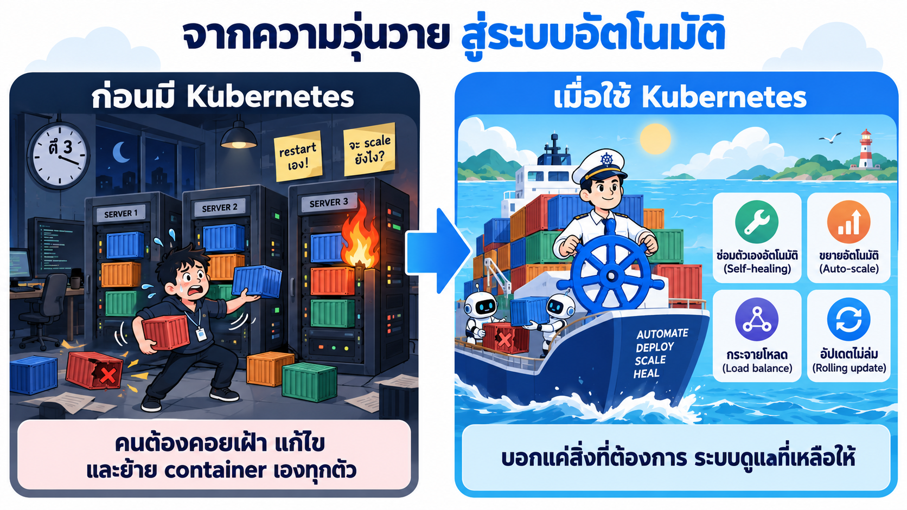<br>
  <em><b>รูปที่ 1</b> การเปรียบเทียบการบริหารคอนเทนเนอร์ด้วยมือ (ซ้าย) กับการบริหารด้วย Kubernetes (ขวา)</em>
</p>

เทคโนโลยีคอนเทนเนอร์ เช่น Docker ช่วยแก้ปัญหาการบรรจุแอปพลิเคชันพร้อมสภาพแวดล้อมที่จำเป็นให้สามารถนำไปทำงานบนเครื่องใดก็ได้อย่างสม่ำเสมอ อย่างไรก็ตาม เมื่อระบบมีขนาดใหญ่ขึ้นทั้งในแง่จำนวนคอนเทนเนอร์และจำนวนเครื่องแม่ข่าย การบริหารจัดการด้วยมือก่อให้เกิดปัญหาเชิงปฏิบัติการหลายประการ ดังแสดงในตารางที่ 1

**ตารางที่ 1** ปัญหาเชิงปฏิบัติการของการบริหารคอนเทนเนอร์ด้วยมือ

| ปัญหา | ประเด็นที่ระบบต้องตอบสนอง |
|---|---|
| คอนเทนเนอร์หยุดทำงานโดยไม่มีผู้ตรวจพบ | การตรวจจับความล้มเหลวและการเริ่มการทำงานใหม่โดยอัตโนมัติ |
| ปริมาณการใช้งานเพิ่มขึ้นอย่างฉับพลัน | การเพิ่มจำนวนอินสแตนซ์และการกระจายภาระงาน |
| มีเครื่องแม่ข่ายจำนวนมาก | การจัดวางคอนเทนเนอร์ให้ใช้ทรัพยากรได้อย่างมีประสิทธิภาพ |
| เครื่องแม่ข่ายขัดข้อง | การย้ายภาระงานไปยังเครื่องที่ยังใช้งานได้ |
| การปรับปรุงเวอร์ชันระหว่างให้บริการ | การปรับปรุงโดยไม่หยุดให้บริการ และการย้อนกลับเมื่อเกิดข้อผิดพลาด |
| หมายเลข IP ของคอนเทนเนอร์เปลี่ยนแปลงเมื่อสร้างใหม่ | กลไกการค้นหาบริการ (service discovery) |

ระบบที่ทำหน้าที่ตอบสนองประเด็นเหล่านี้เรียกว่า **ระบบจัดการคอนเทนเนอร์ (container orchestration system)** หากเปรียบเทียบกับการขนส่งทางทะเล Docker เทียบได้กับการกำหนดมาตรฐานตู้สินค้า ในขณะที่ Kubernetes เทียบได้กับระบบบริหารท่าเรือทั้งระบบ ซึ่งกำหนดว่าตู้สินค้าใดควรบรรทุกบนเรือลำใด ตรวจสอบสภาพตู้ และจัดการแทนที่ตู้ที่เสียหาย

---

## 2. วิวัฒนาการของรูปแบบการติดตั้งใช้งานซอฟต์แวร์

<p align="center" id="fig-2">
  <br>
  <em><b>รูปที่ 2</b> วิวัฒนาการของการติดตั้งใช้งานซอฟต์แวร์ จากเครื่องแม่ข่ายจริงสู่ระบบจัดการคอนเทนเนอร์</em>
</p>

**ตารางที่ 2** การเปรียบเทียบรูปแบบการติดตั้งใช้งานซอฟต์แวร์แต่ละยุค

| ยุค | ลักษณะสำคัญ | ข้อดี | ข้อจำกัด |
|---|---|---|---|
| **เครื่องแม่ข่ายจริง (Traditional)** | แอปพลิเคชันหลายตัวทำงานบนระบบปฏิบัติการเดียวกัน | โครงสร้างไม่ซับซ้อน | ไม่มีการแยกทรัพยากร เกิดความขัดแย้งของไลบรารี และขยายระบบได้ยาก |
| **เครื่องเสมือน (Virtualized)** | Hypervisor แบ่งเครื่องจริงเป็นหลายเครื่องเสมือน แต่ละเครื่องมีระบบปฏิบัติการของตนเอง | แยกส่วนกันอย่างชัดเจนและมีความปลอดภัยสูง | สิ้นเปลืองทรัพยากรจากระบบปฏิบัติการที่ซ้ำซ้อน และใช้เวลาเริ่มต้นนาน |
| **คอนเทนเนอร์ (Containers)** | ใช้เคอร์เนลร่วมกัน และแยกส่วนด้วย namespaces และ cgroups | มีน้ำหนักเบา เริ่มทำงานได้ภายในไม่กี่วินาที และเคลื่อนย้ายได้ง่าย | บริหารจัดการด้วยมือได้ยากเมื่อมีจำนวนมากและกระจายอยู่หลายเครื่อง |
| **การจัดการคอนเทนเนอร์ (Orchestration)** | ระบบกลางบริหารคอนเทนเนอร์ข้ามเครื่องแม่ข่ายหลายเครื่อง | จัดวาง ปรับขนาด ฟื้นฟู และปรับปรุงเวอร์ชันได้โดยอัตโนมัติ | ผู้ใช้ต้องเรียนรู้แนวคิดใหม่ และต้องมีการดูแลรักษาคลัสเตอร์ |

---

## 3. นิยามและขีดความสามารถของ Kubernetes

**Kubernetes** (นิยมเขียนย่อว่า **K8s** โดยเลข 8 แทนจำนวนอักษรระหว่าง K และ s) คือแพลตฟอร์มโอเพนซอร์สสำหรับการติดตั้งใช้งาน การปรับขนาด และการบริหารจัดการแอปพลิเคชันที่บรรจุในคอนเทนเนอร์โดยอัตโนมัติ Kubernetes พัฒนาขึ้นโดย Google บนพื้นฐานประสบการณ์จากระบบภายในชื่อ Borg [2] และได้ส่งมอบให้ **Cloud Native Computing Foundation (CNCF)** เป็นผู้ดูแลโครงการตั้งแต่ปี ค.ศ. 2015

**ตารางที่ 3** ขีดความสามารถหลักของ Kubernetes

| ขีดความสามารถ | คำอธิบาย |
|---|---|
| **Service discovery และ load balancing** | กำหนดชื่อ DNS และหมายเลข IP ที่คงที่ให้แก่กลุ่มของ Pod และกระจายทราฟฟิกไปยัง Pod เหล่านั้น |
| **Storage orchestration** | เชื่อมต่อระบบจัดเก็บข้อมูลหลายประเภท เช่น local disk, NFS และ cloud disk โดยอัตโนมัติ |
| **Automated rollouts และ rollbacks** | ปรับปรุงเวอร์ชันแบบค่อยเป็นค่อยไป และย้อนกลับได้เมื่อเกิดความผิดพลาด |
| **Automatic bin packing** | เลือกเครื่องที่เหมาะสมตามปริมาณ CPU และหน่วยความจำที่ Pod ร้องขอ |
| **Self-healing** | เริ่มคอนเทนเนอร์ที่ล้มเหลวใหม่ สร้าง Pod ทดแทน และงดส่งทราฟฟิกไปยัง Pod ที่ยังไม่พร้อม |
| **Secret และ configuration management** | แยกการตั้งค่าและข้อมูลลับออกจาก container image |
| **Horizontal scaling** | ปรับจำนวน Pod ด้วยคำสั่งหรือโดยอัตโนมัติตามตัวชี้วัดการใช้ทรัพยากร |
| **Declarative configuration** | ผู้ใช้ระบุสถานะที่ต้องการ โดยไม่ต้องระบุขั้นตอนการดำเนินการ |

ทั้งนี้ Kubernetes มิใช่ Platform-as-a-Service (PaaS) แบบสำเร็จรูป ระบบไม่ได้คอมไพล์ซอร์สโค้ด ไม่ได้จัดเตรียมฐานข้อมูลหรือระบบคิวข้อความ และไม่ได้กำหนดเครื่องมือด้านการบันทึกล็อกหรือการเฝ้าระวังไว้ตายตัว Kubernetes จึงมีลักษณะเป็น "แพลตฟอร์มสำหรับสร้างแพลตฟอร์ม" ที่สามารถผนวกเครื่องมือภายนอกเข้ามาได้ตามความต้องการ [1]

---

## 4. ภาพรวมสถาปัตยกรรมของ Kubernetes Cluster

<p align="center" id="fig-3">
  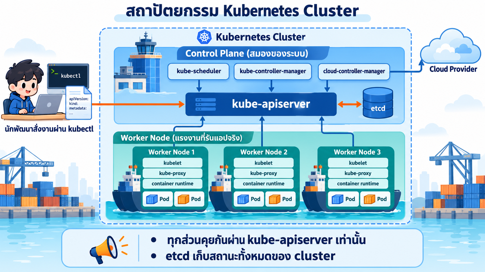<br>
  <em><b>รูปที่ 3</b> สถาปัตยกรรมของ Kubernetes Cluster ประกอบด้วย Control Plane และ Worker Node</em>
</p>

**ตารางที่ 4** คำศัพท์และหน้าที่ขององค์ประกอบในภาพสถาปัตยกรรม Kubernetes Cluster (คลัสเตอร์ คือกลุ่มเครื่องที่ Kubernetes ดูแลร่วมกัน)

| องค์ประกอบในภาพ | คืออะไร | ทำหน้าที่อะไร |
|---|---|---|
| **Control Plane** | ส่วนควบคุมและดูแลการทำงานโดยรวมของคลัสเตอร์ ประกอบด้วยโปรแกรมหลายตัว เปรียบเหมือนหอบังคับการท่าเรือ | ตัดสินใจว่าแอปควรทำงานบนเครื่องใด และดูแลให้ระบบทำงานตามที่ผู้ใช้กำหนด เช่น มีแอปทำงานครบตามจำนวนที่ต้องการ |
| **kube-apiserver** | โปรแกรมที่เป็นจุดรับคำขอของ Kubernetes ทั้งจากผู้ใช้และโปรแกรมที่ดูแลระบบ | รับคำขอ เช่น “เริ่มใช้งานแอปนี้” หรือ “ขอดูสถานะแอป” ตรวจสอบสิทธิ์และข้อมูล แล้วอ่านหรือบันทึกข้อมูลในฐานข้อมูล etcd |
| **kube-scheduler** | โปรแกรมจัดสรรเครื่องสำหรับรันแอป | เลือกเครื่องให้ชุดคอนเทนเนอร์ที่เรียกว่า Pod ซึ่งยังไม่มีเครื่องรัน โดยดู CPU หน่วยความจำ และเงื่อนไขที่กำหนด แล้วบันทึกผลผ่าน kube-apiserver |
| **kube-controller-manager** | โปรแกรมที่รวมงานดูแลระบบอัตโนมัติหลายอย่างไว้ด้วยกัน แต่ละงานมีตัวดูแลที่เรียกว่า controller | ตรวจสิ่งที่กำลังเกิดขึ้นเทียบกับสิ่งที่ผู้ใช้กำหนด เช่น ต้องการแอป 3 ชุดแต่เหลือ 2 ชุด ตัวดูแลที่เกี่ยวข้องจะขอสร้างชุดทดแทนผ่าน kube-apiserver |
| **cloud-controller-manager** | โปรแกรมเชื่อม Kubernetes กับบริการคลาวด์ ใช้เมื่อคลัสเตอร์ต้องทำงานร่วมกับผู้ให้บริการคลาวด์ | ตรวจข้อมูลเครื่องจากผู้ให้บริการ และขอสร้างหรือปรับบริการกระจายคำขอเข้าแอป (load balancer) ผ่านช่องทางที่ผู้ให้บริการเปิดไว้ |
| **etcd** | ฐานข้อมูลสำหรับเก็บข้อมูลที่ Kubernetes ใช้ดูแลระบบ | เก็บข้อมูล เช่น ต้องการแอปกี่ชุด แต่ละชุดถูกจัดให้ทำงานบนเครื่องใด และสถานะล่าสุดที่รายงาน ไม่ได้ใช้เก็บข้อมูลของแอป เช่น รายการสั่งซื้อ |
| **Worker Node** | เครื่องที่รันแอปจริง อาจเป็นเครื่องจริงหรือเครื่องเสมือน คำว่า Node หมายถึงเครื่องหนึ่งเครื่องในคลัสเตอร์ เปรียบเหมือนเรือสินค้า | ใช้ CPU หน่วยความจำ และเครือข่ายของเครื่องเพื่อให้คอนเทนเนอร์ของแอปทำงาน |
| **kubelet** | โปรแกรมดูแลการรันแอปประจำเครื่อง | อ่านจาก kube-apiserver ว่าเครื่องนี้ได้รับมอบหมายให้รันคอนเทนเนอร์ชุดใด เรียกโปรแกรมรันคอนเทนเนอร์ให้เริ่มทำงาน และรายงานสถานะกลับ |
| **container runtime** | โปรแกรมสำหรับรันคอนเทนเนอร์บนเครื่อง เช่น containerd | ดาวน์โหลดชุดไฟล์แอปและสภาพแวดล้อมที่เรียกว่า container image แล้วเริ่มหรือหยุดคอนเทนเนอร์ตามคำขอของ kubelet |
| **kube-proxy** | โปรแกรมดูแลกฎเครือข่ายสำหรับทางเข้าแอปที่เรียกว่า Service ซึ่งมีที่อยู่คงที่ | ตั้งกฎบนเครื่องให้คำขอที่ส่งมายังที่อยู่ของ Service ไปถึงคอนเทนเนอร์ชุดปลายทางได้ บางระบบใช้โปรแกรมเครือข่ายอื่นทำหน้าที่นี้แทน |
| **Pod** | ชุดคอนเทนเนอร์หนึ่งตัวหรือหลายตัวที่ Kubernetes จัดให้ทำงานร่วมกันบนเครื่องเดียว เป็นหน่วยเล็กที่สุดที่ Kubernetes จัดวาง | รันแอป เช่น เว็บเซิร์ฟเวอร์หนึ่งชุด คอนเทนเนอร์ในชุดใช้เครือข่ายร่วมกัน และแชร์พื้นที่จัดเก็บได้เมื่อกำหนดไว้ |
| **kubectl** | เครื่องมือที่ผู้ใช้พิมพ์คำสั่งเพื่อใช้งาน Kubernetes | ส่งคำขอไปยัง kube-apiserver เช่น เริ่มใช้งานแอป ดูสถานะ หรือเปลี่ยนจำนวนชุดของแอปที่ต้องการให้ทำงาน |
| **Cloud Provider** | ผู้ให้บริการเครื่องและระบบอื่น ๆ ผ่านคลาวด์ เช่น AWS, Azure หรือ Google Cloud | ให้เช่าเครื่องเสมือนและให้บริการเครือข่าย โดย cloud-controller-manager ติดต่อเพื่อจัดการส่วนที่ Kubernetes ต้องใช้ |

> **อ่านภาพที่ 3 อย่างไร:** ข้อความ “ทุกส่วนคุยกันผ่าน kube-apiserver เท่านั้น” ในภาพให้เข้าใจว่าเป็นการอ่านและเปลี่ยนข้อมูลสถานะของ Kubernetes ไม่ใช่การสื่อสารทุกประเภท เช่น kubelet ติดต่อ container runtime บนเครื่องโดยตรง และ Pod ส่งทราฟฟิกถึงกันผ่านเครือข่ายได้โดยไม่ผ่าน API server ส่วน etcd เก็บข้อมูลสถานะที่บันทึกผ่าน API ไม่ได้เก็บข้อมูลทุกอย่างของแอปพลิเคชัน

**Kubernetes Cluster** ประกอบด้วยเครื่อง (เครื่องจริงหรือเครื่องเสมือน) ซึ่งแบ่งบทบาทออกเป็นสองกลุ่ม ดังแสดงในรูปที่ 3 ตารางที่ 4 และแผนภาพต่อไปนี้

- **Control Plane** ทำหน้าที่ตัดสินใจระดับคลัสเตอร์ เช่น การจัดเก็บสถานะ การจัดวาง Pod และการตรวจสอบให้สถานะจริงตรงกับสถานะที่ต้องการ เปรียบได้กับหอบังคับการท่าเรือ
- **Worker Node** ทำหน้าที่ประมวลผลภาระงานจริงในรูปของ Pod และรายงานสถานะกลับไปยัง Control Plane เปรียบได้กับเรือสินค้า

```
                         ┌─────────────────────── Control Plane ───────────────────────┐
  kubectl / CI/CD  ───►  │  kube-apiserver ◄──► etcd                                   │
   (REST + YAML)         │       ▲   ▲   ▲                                             │
                         │       │   │   └── kube-scheduler                            │
                         │       │   └────── kube-controller-manager                   │
                         │       └────────── cloud-controller-manager ──► Cloud API     │
                         └───────┼─────────────────────────────────────────────────────┘
                                 │  (อ่านและอัปเดตสถานะผ่าน kube-apiserver)
          ┌──────────────────────┼──────────────────────┐
   ┌──────▼──────┐        ┌──────▼──────┐        ┌──────▼──────┐
   │ Worker Node1│        │ Worker Node2│        │ Worker Node3│
   │ kubelet     │        │ kubelet     │        │ kubelet     │
   │ kube-proxy  │        │ kube-proxy  │        │ kube-proxy  │
   │ containerd  │        │ containerd  │        │ containerd  │
   │ [Pod][Pod]  │        │ [Pod][Pod]  │        │ [Pod]       │
   └─────────────┘        └─────────────┘        └─────────────┘
```

### 4.1 การจัดการสถานะผ่าน API server และการติดตามด้วย Watch

<p align="center" id="fig-4">
  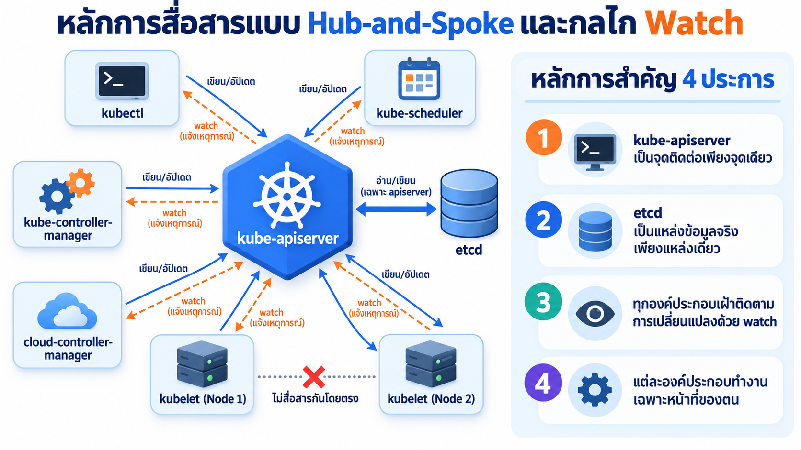<br>
  <em><b>รูปที่ 4</b> kube-apiserver เป็นศูนย์กลางของข้อมูลสถานะ และส่งการเปลี่ยนแปลงให้ส่วนประกอบที่ติดตามด้วย watch</em>
</p>

จากตารางที่ 4 แต่ละส่วนมีหน้าที่ต่างกัน แต่ต้องใช้ข้อมูลสถานะร่วมกัน เช่น ผู้ใช้ต้องการ Pod กี่ตัว Pod ใดรอการจัดวาง และ Node ใดพร้อมทำงาน จึงอ่านและอัปเดตข้อมูลเหล่านี้ผ่าน **kube-apiserver** ดังภาพที่ 4 ส่วน scheduler และ controller ไม่ต้องส่งคำสั่งหากันโดยตรง แต่ทำงานต่อจากข้อมูลที่บันทึกไว้ผ่าน API [6, 8]

**Watch** คือการขอติดตามการเปลี่ยนแปลงของข้อมูลที่สนใจผ่าน API server แทนการถามซ้ำตลอดเวลา โดยไคลเอนต์เปิดการเชื่อมต่อเพื่อรับเหตุการณ์ เช่น มี Pod เพิ่มขึ้น (`ADDED`) ข้อมูล Pod เปลี่ยน (`MODIFIED`) หรือ Pod ถูกลบ (`DELETED`) แล้วนำข้อมูลไปทำงานตามหน้าที่ หากการเชื่อมต่อขาด ไคลเอนต์ต้องเชื่อมต่อใหม่ และอาจต้องอ่านรายการล่าสุดอีกครั้งเพื่อให้ข้อมูลทันปัจจุบัน [9]

ตัวอย่างเมื่อมี Pod ใหม่ ลำดับอย่างง่ายเป็นดังนี้

1. ผู้ใช้ส่งข้อมูลที่ต้องการผ่าน `kubectl` ไปยัง API server ซึ่งตรวจสอบคำขอและบันทึกข้อมูลใน etcd
2. scheduler ติดตาม Pod ที่ยังไม่มี Node เลือก Node ที่เหมาะสม แล้วบันทึกผลผ่าน API server
3. kubelet ของ Node นั้นติดตาม Pod ที่ได้รับมอบหมาย แล้วเรียก container runtime บนเครื่องให้รันคอนเทนเนอร์
4. kubelet รายงานสถานะกลับผ่าน API server ผู้ใช้จึงติดตามผลได้ด้วย `kubectl get pods --watch`

ในทางปฏิบัติ controller มักใช้ตัวช่วยที่เรียกว่า **informer** เพื่อเก็บสำเนาข้อมูลในหน่วยความจำและอัปเดตด้วย watch ช่วยลดการอ่านข้อมูลซ้ำจาก API server ส่วน etcd เป็นที่เก็บข้อมูล API โดย scheduler, controller และ kubelet ใช้ข้อมูลผ่าน API server ไม่ได้อ่านหรือเขียน etcd โดยตรง

> **ขอบเขตของภาพที่ 4:** ชื่อ Hub-and-Spoke ในภาพหมายถึงการใช้ API server เป็นศูนย์กลางของข้อมูลสถานะ เส้น watch แสดงการแจ้งข้อมูล ไม่ใช่คำสั่งให้ทำงาน และไม่ได้หมายความว่าทุกส่วนต้องใช้ watch กับทุกข้อมูล การเรียก container runtime, การติดต่อ Cloud API และทราฟฟิกระหว่าง Pod ใช้เส้นทางของตนเองได้ การแยกหน้าที่ช่วยให้แต่ละส่วนกลับมาทำงานต่อจากข้อมูล API ได้ แต่หากส่วนใดขัดข้อง งานที่พึ่งพาส่วนนั้นยังได้รับผลกระทบ

---

## 5. องค์ประกอบของ Control Plane

<p align="center" id="fig-5">
  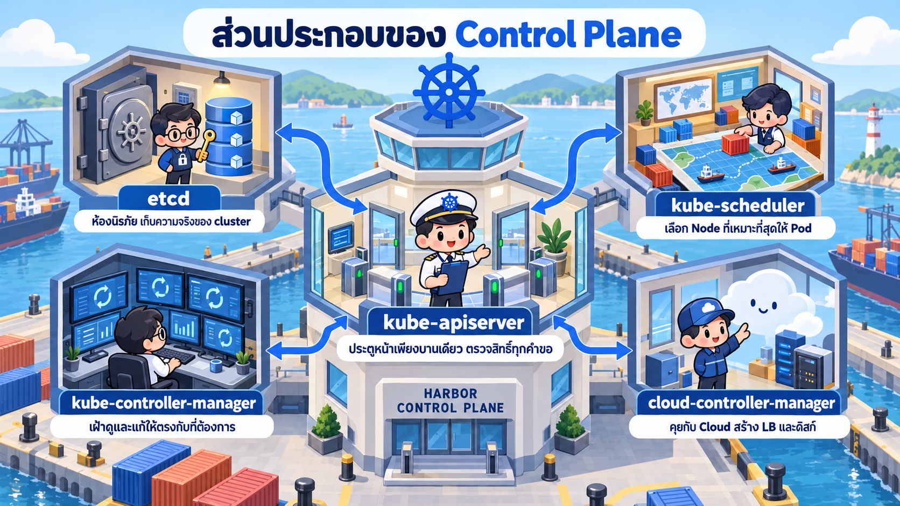<br>
  <em><b>รูปที่ 5</b> ภาพรวมองค์ประกอบของ Control Plane ในรูปแบบอุปมาหอบังคับการท่าเรือ</em>
</p>

Control Plane ประกอบด้วยองค์ประกอบหลัก 5 ส่วน ดังสรุปในตารางที่ 5 และอธิบายรายละเอียดในหัวข้อย่อย 5.1–5.5

**ตารางที่ 5** สรุปองค์ประกอบของ Control Plane

| องค์ประกอบ | หน้าที่โดยสรุป | ผลกระทบเมื่อขัดข้อง |
|---|---|---|
| kube-apiserver | จุดติดต่อเดียวของคลัสเตอร์ | ไม่สามารถสั่งการคลัสเตอร์ได้ |
| etcd | จัดเก็บสถานะทั้งหมดของคลัสเตอร์ | สูญเสียสถานะของคลัสเตอร์ |
| kube-scheduler | เลือก Node ให้แก่ Pod | Pod ใหม่ค้างอยู่ในสถานะ Pending |
| kube-controller-manager | ปรับสถานะจริงให้ตรงกับสถานะที่ต้องการ | ระบบไม่ฟื้นฟูตนเอง |
| cloud-controller-manager | ประสานงานกับผู้ให้บริการคลาวด์ | ไม่สามารถสร้างทรัพยากรบนคลาวด์ได้ |

### 5.1 kube-apiserver

<p align="center" id="fig-6">
  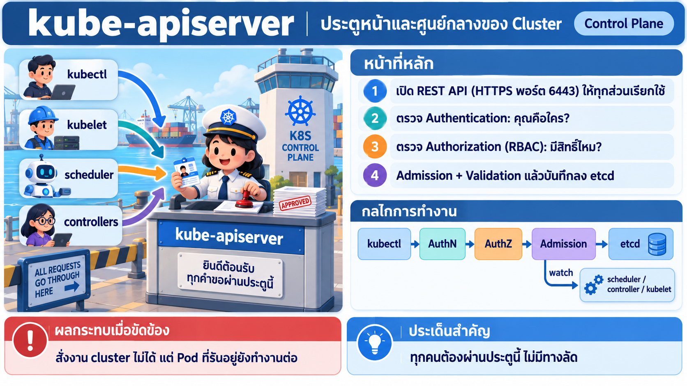<br>
  <em><b>รูปที่ 6</b> kube-apiserver: จุดติดต่อเดียวและศูนย์กลางของคลัสเตอร์</em>
</p>

kube-apiserver ทำหน้าที่เปิดให้บริการ Kubernetes API ในรูปแบบ REST ผ่านโปรโตคอล HTTPS (โดยปกติใช้พอร์ต 6443) คำสั่ง `kubectl` จึงเป็นเพียงไคลเอนต์ที่แปลงคำสั่งเป็นคำร้องขอ HTTP ไปยัง kube-apiserver เช่น คำสั่งสร้าง Deployment จะถูกแปลงเป็นคำร้องขอ `POST /apis/apps/v1/namespaces/default/deployments`

<p align="center" id="fig-7">
  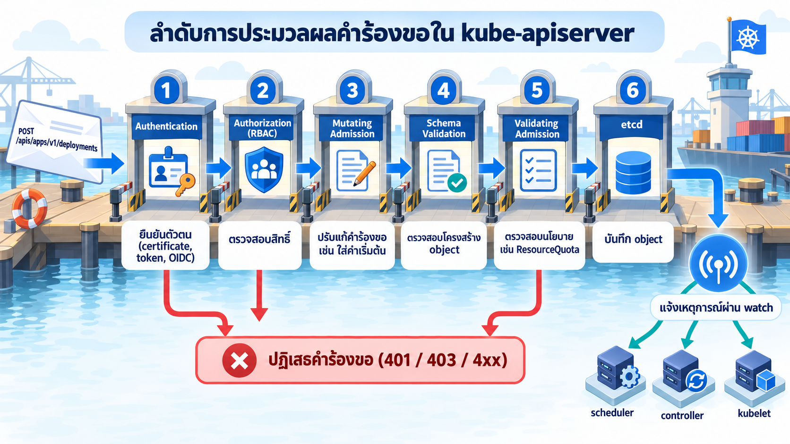<br>
  <em><b>รูปที่ 7</b> ลำดับการประมวลผลคำร้องขอภายใน kube-apiserver ตั้งแต่การยืนยันตัวตนจนถึงการบันทึกลง etcd</em>
</p>

คำร้องขอทุกรายการต้องผ่านขั้นตอนการประมวลผลตามลำดับ ดังตารางที่ 6

**ตารางที่ 6** ขั้นตอนการประมวลผลคำร้องขอใน kube-apiserver

| ลำดับ | ขั้นตอน | การดำเนินการ | ผลเมื่อไม่ผ่าน |
|:---:|---|---|---|
| 1 | **Authentication** | ยืนยันตัวตนของผู้ร้องขอ เช่น ด้วย client certificate, bearer token หรือ OIDC | `401 Unauthorized` |
| 2 | **Authorization** | ตรวจสอบสิทธิ์ของผู้ร้องขอต่อ verb และทรัพยากร โดยทั่วไปใช้ RBAC | `403 Forbidden` |
| 3 | **Mutating admission** | ปรับแก้คำร้องขอ เช่น กำหนดค่าเริ่มต้น หรือแทรก sidecar ผ่าน mutating webhook | ปฏิเสธคำร้องขอ |
| 4 | **Schema validation** | ตรวจสอบโครงสร้างและชนิดข้อมูลของ object ตาม OpenAPI schema | `422 Unprocessable Entity` |
| 5 | **Validating admission** | ตรวจสอบนโยบาย เช่น ResourceQuota, Pod Security Admission และ ValidatingAdmissionPolicy | ปฏิเสธคำร้องขอ |
| 6 | **Persistence** | บันทึก object ลง etcd และแจ้งเหตุการณ์ไปยังผู้ที่ watch อยู่ | — |

นอกจากนี้ kube-apiserver ยังให้บริการกลไก **watch** ซึ่งทำให้องค์ประกอบอื่นได้รับแจ้งการเปลี่ยนแปลงของ object แบบทันที เนื่องจาก kube-apiserver ไม่เก็บสถานะไว้ในตนเอง (stateless) จึงสามารถเพิ่มจำนวนอินสแตนซ์และวางไว้หลัง load balancer ได้ ในกรณีที่ kube-apiserver ขัดข้อง ผู้ดูแลระบบจะไม่สามารถสั่งการคลัสเตอร์ได้ แต่ Pod ที่กำลังทำงานอยู่บน Worker Node จะยังคงทำงานต่อไป

### 5.2 etcd

<p align="center" id="fig-8">
  <br>
  <em><b>รูปที่ 8</b> etcd: ฐานข้อมูลแบบกระจายที่จัดเก็บสถานะทั้งหมดของคลัสเตอร์</em>
</p>

etcd คือฐานข้อมูลแบบ key-value ที่ทำงานแบบกระจาย (distributed) และมีความสอดคล้องของข้อมูลสูง (strongly consistent) ใช้จัดเก็บ object ทุกประเภทของคลัสเตอร์ เช่น ข้อมูล Pod ภายใต้คีย์ `/registry/pods/<namespace>/<name>`

<p align="center" id="fig-9">
  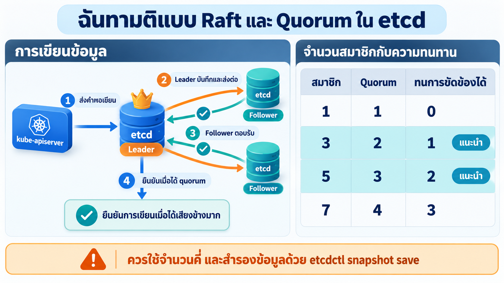<br>
  <em><b>รูปที่ 9</b> กระบวนการเขียนข้อมูลด้วยฉันทามติแบบ Raft และความสัมพันธ์ระหว่างจำนวนสมาชิกกับ quorum</em>
</p>

etcd ใช้อัลกอริทึมฉันทามติ **Raft** [3] เพื่อรักษาความสอดคล้องของข้อมูลระหว่างสมาชิก โดยสมาชิกตัวหนึ่งได้รับเลือกเป็น **leader** ผ่านการลงคะแนน และสมาชิกที่เหลือเป็น **follower** การเขียนข้อมูลทุกครั้งต้องผ่าน leader ซึ่งบันทึกรายการลงในล็อกของตนแล้วส่งต่อให้ follower เมื่อสมาชิกเสียงข้างมากยืนยันการบันทึก รายการดังกล่าวจึงถือว่าสำเร็จ (committed) หาก leader ขัดข้อง follower ที่ไม่ได้รับสัญญาณ heartbeat ภายในระยะเวลาที่กำหนดจะเริ่มการเลือกตั้ง leader ใหม่

ขนาดของ quorum คำนวณจาก ⌊n/2⌋ + 1 เมื่อ n คือจำนวนสมาชิก ความสัมพันธ์ดังกล่าวแสดงในตารางที่ 7

**ตารางที่ 7** ความสัมพันธ์ระหว่างจำนวนสมาชิก quorum และความทนทานต่อการขัดข้องของ etcd

| จำนวนสมาชิก (n) | Quorum | จำนวนสมาชิกที่ขัดข้องได้ |
|:---:|:---:|:---:|
| 1 | 1 | 0 |
| 2 | 2 | 0 |
| **3** | **2** | **1** |
| 4 | 3 | 1 |
| **5** | **3** | **2** |

จากตารางจะเห็นได้ว่าการเพิ่มสมาชิกจาก 3 เป็น 4 ตัวไม่ได้เพิ่มความทนทาน แต่กลับเพิ่มภาระในการสื่อสาร จำนวนสมาชิกจึงควรเป็นเลขคี่ และโดยทั่วไปใช้ 3 หรือ 5 ตัว

เนื่องจาก etcd เป็นแหล่งข้อมูลจริงเพียงแหล่งเดียว การสูญเสียข้อมูลใน etcd จึงเท่ากับการสูญเสียสถานะทั้งหมดของคลัสเตอร์ ผู้ดูแลระบบจึงต้องสำรองข้อมูลอย่างสม่ำเสมอ เช่น ด้วยคำสั่ง `etcdctl snapshot save` และควรเปิดใช้การเข้ารหัสข้อมูลขณะจัดเก็บ (encryption at rest) สำหรับข้อมูลประเภท Secret

### 5.3 kube-scheduler

<p align="center" id="fig-10">
  <br>
  <em><b>รูปที่ 10</b> kube-scheduler: กระบวนการคัดกรองและให้คะแนน Node สำหรับ Pod</em>
</p>

kube-scheduler เฝ้าติดตาม Pod ที่ยังไม่ได้รับการกำหนด Node (ค่า `spec.nodeName` ว่าง) และคัดเลือก Node ที่เหมาะสมที่สุดผ่านกระบวนการสองขั้นตอน ดังตารางที่ 8

**ตารางที่ 8** ขั้นตอนการจัดวาง Pod ของ kube-scheduler

| ขั้นตอน | การดำเนินการ | ตัวอย่างเกณฑ์ |
|---|---|---|
| **Filtering** | คัด Node ที่ไม่เป็นไปตามเงื่อนไขออก | ทรัพยากรไม่เพียงพอตาม `resources.requests`, taint ที่ Pod ไม่ tolerate, ไม่ตรงกับ `nodeSelector` หรือ node affinity, พอร์ตบน Node ซ้ำกัน |
| **Scoring** | ให้คะแนน Node ที่ผ่านการคัดกรอง | การกระจายภาระงาน, การมี image อยู่แล้วบน Node, pod affinity และ anti-affinity |

เมื่อได้ Node ที่มีคะแนนสูงสุด kube-scheduler จะดำเนินการ **binding** โดยบันทึกชื่อ Node ลงใน object ของ Pod ผ่าน kube-apiserver ทั้งนี้ kube-scheduler ทำหน้าที่เพียงตัดสินใจเท่านั้น ส่วนการสร้างคอนเทนเนอร์จริงเป็นหน้าที่ของ kubelet บน Node ปลายทาง หาก kube-scheduler ขัดข้อง Pod ใหม่จะค้างอยู่ในสถานะ `Pending` ขณะที่ Pod เดิมยังคงทำงานได้ตามปกติ

### 5.4 kube-controller-manager

<p align="center" id="fig-11">
  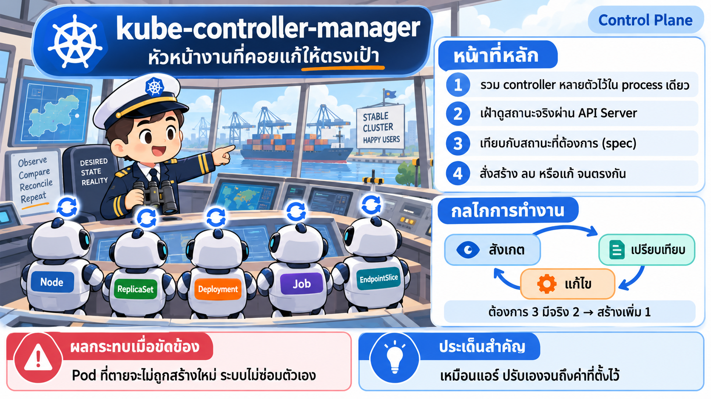<br>
  <em><b>รูปที่ 11</b> kube-controller-manager: กลุ่มของ controller ที่ทำงานแบบ control loop</em>
</p>

kube-controller-manager เป็นโปรเซสที่รวม **controller** หลายตัวเข้าไว้ด้วยกันเพื่อลดความซับซ้อนในการติดตั้ง controller แต่ละตัวทำงานแบบ **control loop** กล่าวคือ สังเกตสถานะจริงของทรัพยากร เปรียบเทียบกับสถานะที่ต้องการ และดำเนินการแก้ไขจนกระทั่งทั้งสองสถานะสอดคล้องกัน ตัวอย่าง controller ที่สำคัญแสดงในตารางที่ 9

**ตารางที่ 9** ตัวอย่าง controller ใน kube-controller-manager

| Controller | หน้าที่ |
|---|---|
| Node controller | ตรวจสอบสถานะของ Node และดำเนินการ evict Pod เมื่อ Node ขาดการติดต่อเกินระยะเวลาที่กำหนด |
| ReplicaSet controller | รักษาจำนวน Pod ให้เท่ากับค่า `replicas` |
| Deployment controller | บริหาร ReplicaSet ระหว่างการปรับปรุงเวอร์ชัน |
| Job controller | สร้าง Pod เพื่อดำเนินงานจนเสร็จสมบูรณ์ |
| EndpointSlice controller | ปรับปรุงรายการหมายเลข IP ของ Pod ที่อยู่เบื้องหลัง Service |
| ServiceAccount controller | สร้าง ServiceAccount เริ่มต้นให้แก่ namespace ใหม่ |

<p align="center" id="fig-12">
  <br>
  <em><b>รูปที่ 12</b> การทำงานต่อเนื่องของ controller จาก Deployment สู่ ReplicaSet และ Pod โดยสื่อสารผ่าน kube-apiserver</em>
</p>

controller แต่ละตัวรับผิดชอบทรัพยากรเพียงประเภทเดียว และทำงานต่อเนื่องกันเป็นทอด ๆ โดยอาศัยผลลัพธ์ของ controller ก่อนหน้าเป็นข้อมูลนำเข้า ตัวอย่างเช่น เมื่อผู้ใช้สร้าง Deployment ที่กำหนด `replicas: 3` Deployment controller จะสร้าง ReplicaSet จากนั้น ReplicaSet controller จะสร้าง Pod จำนวน 3 ตัว แล้ว kube-scheduler จะกำหนด Node ให้แก่ Pod และ kubelet จะเริ่มการทำงานของคอนเทนเนอร์ตามลำดับ ทุกขั้นตอนเกิดขึ้นผ่านการอ่านและเขียน object ใน kube-apiserver โดยไม่มีการเรียกใช้กันโดยตรง นอกจากนี้ object ที่ถูกสร้างจะมีฟิลด์ `metadata.ownerReferences` ชี้กลับไปยัง object ผู้สร้าง ซึ่งระบบใช้ในการลบแบบต่อเนื่อง (cascading deletion) ผ่าน garbage collector

หาก kube-controller-manager ขัดข้อง ระบบจะสูญเสียความสามารถในการฟื้นฟูตนเอง เช่น Pod ที่หยุดทำงานจะไม่ถูกสร้างทดแทน

### 5.5 cloud-controller-manager

<p align="center" id="fig-13">
  <br>
  <em><b>รูปที่ 13</b> cloud-controller-manager: ส่วนเชื่อมต่อระหว่างคลัสเตอร์กับผู้ให้บริการคลาวด์</em>
</p>

cloud-controller-manager แยกตรรกะที่เฉพาะเจาะจงกับผู้ให้บริการคลาวด์ออกจากแกนหลักของ Kubernetes เพื่อให้ผู้ให้บริการแต่ละรายพัฒนาส่วนเชื่อมต่อของตนได้อย่างอิสระ ประกอบด้วย controller หลัก 3 ส่วน ได้แก่

- **Node controller** ตรวจสอบกับ API ของคลาวด์ว่าเครื่องเสมือนที่เป็น Node ยังคงมีอยู่หรือไม่ และนำ Node ที่ถูกลบออกจากคลัสเตอร์
- **Route controller** กำหนดเส้นทางเครือข่ายในโครงสร้างพื้นฐานของคลาวด์
- **Service controller** สร้างและบริหาร cloud load balancer สำหรับ Service ประเภท `LoadBalancer`

องค์ประกอบนี้มีเฉพาะในคลัสเตอร์ที่ทำงานบนผู้ให้บริการคลาวด์ คลัสเตอร์สำหรับการทดลอง เช่น kind หรือ minikube จะไม่มีองค์ประกอบนี้

> สามารถตรวจสอบองค์ประกอบของ Control Plane ในคลัสเตอร์ได้ด้วยคำสั่ง `kubectl get pods -n kube-system`

---

## 6. องค์ประกอบของ Worker Node

<p align="center" id="fig-14">
  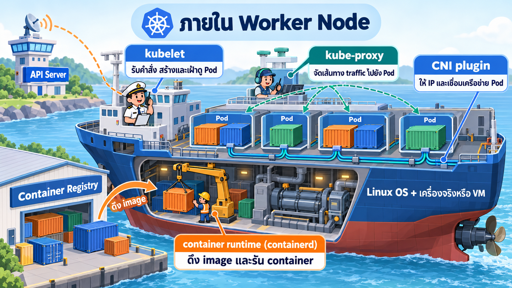<br>
  <em><b>รูปที่ 14</b> ภาพรวมองค์ประกอบภายใน Worker Node</em>
</p>

Worker Node ทุกเครื่องมีองค์ประกอบที่ทำงานร่วมกันเพื่อรันและเชื่อมต่อ Pod ดังสรุปในตารางที่ 10

**ตารางที่ 10** สรุปองค์ประกอบของ Worker Node

| องค์ประกอบ | อุปมา | หน้าที่โดยสรุป |
|---|---|---|
| kubelet | กัปตันเรือ | รับมอบหมาย Pod และควบคุมวงจรชีวิตของ Pod บน Node |
| Container runtime | ห้องเครื่องและเครน | ดึง image และรันคอนเทนเนอร์ |
| kube-proxy | เจ้าหน้าที่จัดการจราจร | สร้างกฎเครือข่ายสำหรับ Service |
| CNI plugin | ระบบสายเชื่อมต่อ | กำหนด IP และเชื่อมต่อเครือข่ายของ Pod |

### 6.1 kubelet

<p align="center" id="fig-15">
  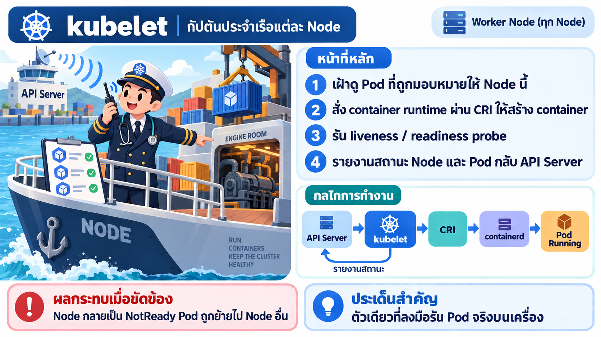<br>
  <em><b>รูปที่ 15</b> kubelet: ตัวแทน (agent) ประจำ Node ที่ควบคุมวงจรชีวิตของ Pod</em>
</p>

kubelet เป็นตัวแทน (agent) ที่ทำงานบนทุก Node และเป็นองค์ประกอบเพียงตัวเดียวที่ลงมือสร้าง Pod บนเครื่องจริง kubelet เฝ้าติดตาม kube-apiserver เพื่อรับ Pod ที่ได้รับมอบหมายให้แก่ Node ของตน จากนั้นสั่งการ container runtime ผ่าน **Container Runtime Interface (CRI)** ให้สร้างคอนเทนเนอร์ตามข้อกำหนดใน PodSpec นอกจากนี้ kubelet ยังดำเนินการตรวจสุขภาพของคอนเทนเนอร์ (liveness, readiness และ startup probe) เชื่อมต่อ volume และรายงานสถานะของ Node และ Pod กลับไปยัง kube-apiserver อย่างต่อเนื่อง

หาก kubelet หยุดทำงาน Node จะเปลี่ยนเป็นสถานะ `NotReady` และหลังจากระยะเวลาที่กำหนด Pod ที่อยู่บน Node ดังกล่าวจะถูกสร้างทดแทนบน Node อื่นโดย controller ที่ดูแล Pod เหล่านั้น

### 6.2 Container Runtime

<p align="center" id="fig-16">
  <br>
  <em><b>รูปที่ 16</b> Container Runtime: ส่วนที่ดึง image และรันคอนเทนเนอร์จริง</em>
</p>

Container runtime คือซอฟต์แวร์ที่ดึง container image จาก registry แตก image เป็นระบบแฟ้มของคอนเทนเนอร์ และสร้างคอนเทนเนอร์โดยอาศัยกลไก namespaces และ cgroups ของเคอร์เนล Linux runtime ที่นิยมใช้ ได้แก่ **containerd** และ **CRI-O** ซึ่งเรียกใช้ low-level runtime เช่น `runc` อีกทอดหนึ่ง ลำดับการเรียกใช้จึงเป็น kubelet → CRI → containerd → runc → คอนเทนเนอร์

ตั้งแต่ Kubernetes เวอร์ชัน 1.24 ได้ยกเลิกส่วนเชื่อมต่อ `dockershim` และสื่อสารกับ runtime ที่รองรับ CRI โดยตรง อย่างไรก็ตาม image ที่สร้างด้วย Docker ยังคงใช้งานได้ตามปกติ เนื่องจากเป็นไปตามมาตรฐาน **Open Container Initiative (OCI)** เดียวกัน

### 6.3 kube-proxy

<p align="center" id="fig-17">
  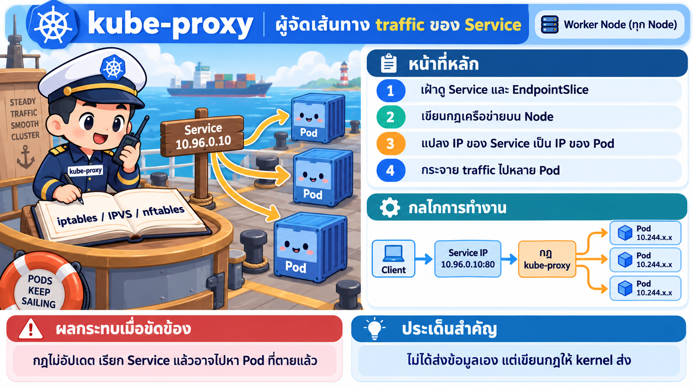<br>
  <em><b>รูปที่ 17</b> kube-proxy: การแปลงหมายเลข IP ของ Service ไปยัง Pod ปลายทาง</em>
</p>

kube-proxy ทำงานบนทุก Node โดยเฝ้าติดตาม object ประเภท Service และ EndpointSlice แล้วสร้างกฎเครือข่ายในเคอร์เนลด้วยกลไก **iptables**, **IPVS** หรือ **nftables** เพื่อให้ทราฟฟิกที่ส่งไปยังหมายเลข IP เสมือนของ Service (ClusterIP) ถูกแปลงและกระจายไปยัง Pod ปลายทาง ควรสังเกตว่า kube-proxy มิได้ส่งต่อแพ็กเก็ตด้วยตนเอง หากแต่เขียนกฎให้เคอร์เนลดำเนินการ ในกรณีที่ kube-proxy ขัดข้อง กฎเครือข่ายจะไม่ได้รับการปรับปรุง ส่งผลให้ทราฟฟิกอาจถูกส่งไปยัง Pod ที่ไม่มีอยู่แล้ว ทั้งนี้ CNI plugin บางประเภท เช่น Cilium สามารถทำหน้าที่แทน kube-proxy ได้

### 6.4 CNI Plugin

<p align="center" id="fig-18">
  <br>
  <em><b>รูปที่ 18</b> CNI Plugin: ระบบเครือข่ายที่เชื่อมต่อ Pod ข้าม Node</em>
</p>

**Container Network Interface (CNI)** เป็นข้อกำหนดมาตรฐานสำหรับการตั้งค่าเครือข่ายของคอนเทนเนอร์ CNI plugin เช่น Calico, Flannel และ Cilium ทำหน้าที่กำหนดหมายเลข IP ให้แก่ Pod ทุกตัวเมื่อถูกสร้าง และทำให้ Pod สื่อสารกันได้ข้าม Node ตาม **แบบจำลองเครือข่ายของ Kubernetes (Kubernetes network model)** ซึ่งมีข้อกำหนดสำคัญดังนี้ [1]

1. Pod ทุกตัวมีหมายเลข IP เป็นของตนเอง
2. Pod ทุกตัวสื่อสารกับ Pod อื่นได้โดยไม่ต้องผ่านการแปลงที่อยู่ (NAT) แม้อยู่ต่าง Node
3. ตัวแทนบน Node (เช่น kubelet) สื่อสารกับ Pod ทุกตัวบน Node นั้นได้

CNI plugin บางประเภทรองรับ **NetworkPolicy** ซึ่งใช้กำหนดกฎการอนุญาตทราฟฟิกระหว่าง Pod ในลักษณะเดียวกับไฟร์วอลล์ หากไม่มี CNI plugin ที่ทำงานได้ Node จะไม่เข้าสู่สถานะ `Ready` และ Pod ใหม่จะค้างอยู่ในสถานะ `ContainerCreating`

---

## 7. Pod: หน่วยการติดตั้งใช้งานที่เล็กที่สุด

<p align="center" id="fig-19">
  <br>
  <em><b>รูปที่ 19</b> โครงสร้างภายในของ Pod: คอนเทนเนอร์ เครือข่ายร่วม และ volume ร่วม</em>
</p>

**Pod** คือหน่วยที่เล็กที่สุดที่สามารถติดตั้งใช้งานใน Kubernetes ได้ Pod หนึ่งตัวประกอบด้วยคอนเทนเนอร์ตั้งแต่หนึ่งตัวขึ้นไปที่ถูกจัดวางบน Node เดียวกันเสมอและมีวงจรชีวิตร่วมกัน คุณสมบัติสำคัญของ Pod มีดังนี้

- คอนเทนเนอร์ใน Pod เดียวกัน **ใช้ network namespace ร่วมกัน** จึงมีหมายเลข IP เดียวกันและสื่อสารกันผ่าน `localhost` ได้
- คอนเทนเนอร์ใน Pod เดียวกัน **ใช้ volume ร่วมกันได้** เช่น คอนเทนเนอร์หลักเขียนไฟล์ล็อก และ sidecar อ่านไฟล์ดังกล่าวเพื่อส่งต่อ
- **Init container** ทำงานจนเสร็จสิ้นก่อนที่คอนเทนเนอร์หลักจะเริ่มทำงาน เช่น ใช้รอให้ฐานข้อมูลพร้อม หรือใช้ปรับโครงสร้างฐานข้อมูล
- **Sidecar container** ทำงานคู่ขนานกับคอนเทนเนอร์หลักเพื่อเสริมความสามารถ เช่น การส่งล็อก หรือ proxy ของ service mesh
- Pod มีลักษณะ **ชั่วคราว (ephemeral)** เมื่อ Pod สิ้นสุดลงจะไม่ถูกนำกลับมาใช้ใหม่ แต่ controller จะสร้าง Pod ใหม่ซึ่งมีชื่อและหมายเลข IP ใหม่ขึ้นทดแทน

```yaml
apiVersion: v1
kind: Pod
metadata:
  name: web
  labels:
    app: web            # label ใช้ให้ Service หรือ ReplicaSet เลือก Pod นี้
spec:
  containers:
    - name: nginx
      image: nginx:1.27
      ports:
        - containerPort: 80
      resources:
        requests: { cpu: "100m", memory: "128Mi" }   # ใช้ประกอบการตัดสินใจของ scheduler
        limits:   { cpu: "500m", memory: "256Mi" }   # ขีดจำกัดการใช้ทรัพยากรจริง
```

วงจรชีวิตของ Pod แบ่งออกเป็นระยะ (phase) ได้แก่ `Pending` → `Running` → `Succeeded` หรือ `Failed` และสถานะ `Unknown` เมื่อไม่สามารถติดต่อ Node ได้ ในทางปฏิบัติ ผู้ใช้มักไม่สร้าง Pod โดยตรง แต่สร้างผ่านทรัพยากรระดับสูงกว่า เช่น Deployment, StatefulSet หรือ Job ซึ่งทำหน้าที่ดูแล Pod อีกชั้นหนึ่ง

---

## 8. ลำดับการทำงานของระบบเมื่อสั่ง `kubectl apply`

<p align="center" id="fig-20">
  <br>
  <em><b>รูปที่ 20</b> ลำดับการทำงานขององค์ประกอบต่าง ๆ เมื่อผู้ใช้สั่ง <code>kubectl apply</code></em>
</p>

หัวข้อนี้อธิบายการทำงานร่วมกันขององค์ประกอบทั้งหมดผ่านกรณีที่ผู้ใช้สั่ง `kubectl apply -f deploy.yaml` เพื่อสร้าง Deployment ที่กำหนด `replicas: 3`

**ตารางที่ 11** ลำดับเหตุการณ์ภายในคลัสเตอร์

| ขั้น | องค์ประกอบ | เหตุการณ์ |
|:---:|---|---|
| 1 | kubectl | อ่านไฟล์ YAML แปลงเป็นคำร้องขอ HTTP และส่งไปยัง kube-apiserver โดยใช้ข้อมูลรับรองจาก `~/.kube/config` |
| 2 | kube-apiserver | ดำเนินการ Authentication, Authorization, Admission control และ Validation |
| 3 | etcd | บันทึก object ประเภท Deployment ณ ขั้นนี้ยังไม่มีคอนเทนเนอร์ใดถูกสร้าง |
| 4 | Deployment controller และ ReplicaSet controller | สร้าง ReplicaSet และ Pod จำนวน 3 ตัวในสถานะ `Pending` ซึ่งยังไม่ได้รับการกำหนด Node |
| 5 | kube-scheduler | คัดกรองและให้คะแนน Node แล้วบันทึก `nodeName` ลงใน Pod |
| 6 | kubelet บน Node ปลายทาง | ตรวจพบ Pod ที่ได้รับมอบหมายให้แก่ Node ของตน |
| 7 | Container runtime และ CNI plugin | ดึง image กำหนดเครือข่ายและหมายเลข IP ให้แก่ Pod และเริ่มการทำงานของคอนเทนเนอร์ |
| 8 | kubelet | ตรวจสุขภาพของคอนเทนเนอร์และรายงานสถานะ `Running` กลับไปยัง kube-apiserver |

จากลำดับเหตุการณ์ข้างต้น scheduler และ controller ประสานงานกันผ่านข้อมูลสถานะใน kube-apiserver แล้วดำเนินการตามหน้าที่ของตน ส่วน kubelet เรียก container runtime บน Node โดยตรงตามที่อธิบายในหัวข้อ 4.1 หาก kube-scheduler หยุดทำงานชั่วคราว Pod ใหม่ที่ยังไม่ได้รับการจัดวางต้องรอ เมื่อ scheduler กลับมาทำงานจะอ่านสถานะผ่าน API server และดำเนินการต่อได้

ผู้เรียนสามารถสังเกตลำดับเหตุการณ์ดังกล่าวได้จากคำสั่งต่อไปนี้

```bash
kubectl apply -f deploy.yaml
kubectl get events --sort-by=.metadata.creationTimestamp
# Scheduled → Pulling → Pulled → Created → Started
```

---

## 9. Desired State และ Reconciliation Loop

<p align="center" id="fig-21">
  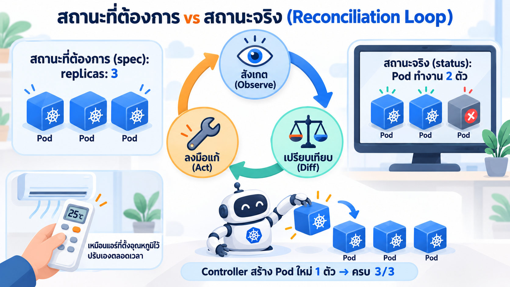<br>
  <em><b>รูปที่ 21</b> การปรับสถานะจริงให้สอดคล้องกับสถานะที่ต้องการด้วย reconciliation loop</em>
</p>

Kubernetes ใช้แนวทาง **declarative** แทนแนวทาง **imperative** ดังเปรียบเทียบในตารางที่ 12

**ตารางที่ 12** การเปรียบเทียบแนวทาง imperative และ declarative

| ประเด็น | Imperative | Declarative |
|---|---|---|
| สิ่งที่ผู้ใช้ระบุ | ขั้นตอนการดำเนินการทีละคำสั่ง | สถานะปลายทางที่ต้องการ |
| การรับมือกับความล้มเหลว | ผู้ใช้ต้องตรวจพบและแก้ไขเอง | ระบบตรวจพบและแก้ไขอย่างต่อเนื่อง |
| ตัวอย่าง | `docker run ...` | `kubectl apply -f app.yaml` |

object ทุกตัวใน Kubernetes ประกอบด้วยส่วนสำคัญสองส่วน ได้แก่ **`spec`** ซึ่งระบุสถานะที่ต้องการ (desired state) โดยผู้ใช้ และ **`status`** ซึ่งระบุสถานะจริง (actual state) โดยระบบ controller ทำหน้าที่ปรับสถานะจริงให้เข้าสู่สถานะที่ต้องการผ่านวงรอบการทำงานที่เรียกว่า **reconciliation loop** ซึ่งประกอบด้วยสามขั้นตอนต่อเนื่องกัน ได้แก่ การสังเกต (observe) การเปรียบเทียบ (diff) และการดำเนินการ (act)

```
     ┌──────────► Observe (สังเกตสถานะจริง) ──────────┐
     │                                                ▼
   Act (สร้าง/ลบ/แก้ไข)  ◄────────────  Diff (เปรียบเทียบกับ spec)
```

หลักการนี้มีลักษณะเดียวกับระบบควบคุมแบบป้อนกลับ (feedback control system) เช่น เครื่องปรับอากาศที่ตั้งอุณหภูมิเป้าหมายไว้ ระบบจะวัดอุณหภูมิจริง เปรียบเทียบกับค่าเป้าหมาย และปรับการทำงานโดยอัตโนมัติ ผู้เรียนสามารถทดสอบหลักการนี้ได้โดยลบ Pod หนึ่งตัวและสังเกตการสร้าง Pod ทดแทน

```bash
kubectl delete pod <ชื่อ-pod>
kubectl get pods -w      # Pod ใหม่จะถูกสร้างขึ้นจนจำนวนกลับมาเป็น 3/3
```

---

## 10. ทรัพยากรประเภท Workload

<p align="center" id="fig-22">
  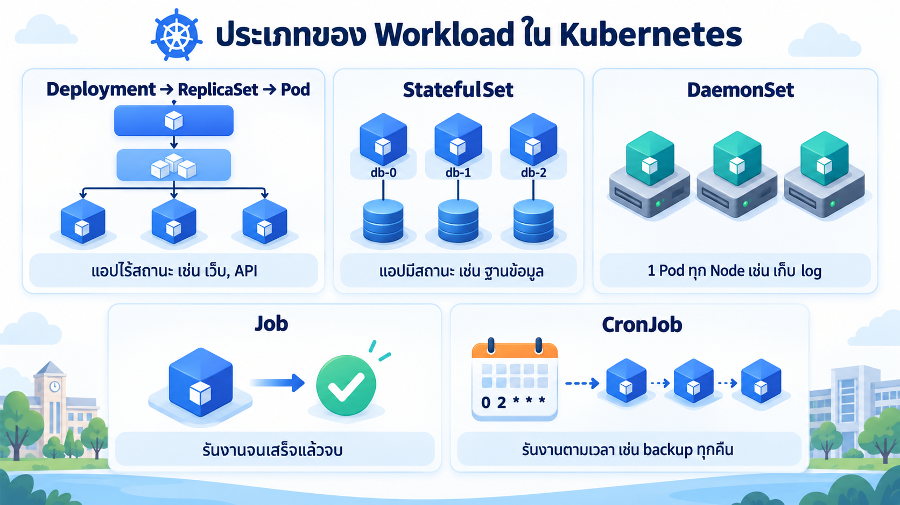<br>
  <em><b>รูปที่ 22</b> ทรัพยากรประเภท workload และลักษณะการใช้งาน</em>
</p>

**ตารางที่ 13** ทรัพยากรประเภท workload

| ทรัพยากร | ลักษณะงานที่เหมาะสม | คุณสมบัติเด่น |
|---|---|---|
| **Deployment** | แอปพลิเคชันไร้สถานะ (stateless) เช่น เว็บและ API | บริหาร ReplicaSet รองรับ rolling update และ rollback โดย Pod ทุกตัวทดแทนกันได้ |
| **ReplicaSet** | ใช้งานผ่าน Deployment | รักษาจำนวน Pod ให้คงที่ตามค่า `replicas` |
| **StatefulSet** | แอปพลิเคชันมีสถานะ (stateful) เช่น ฐานข้อมูล | Pod มีชื่อคงที่และเรียงลำดับ (`db-0`, `db-1`) แต่ละตัวมี PVC ของตนเอง และเริ่ม/หยุดทำงานตามลำดับ |
| **DaemonSet** | ตัวแทนระดับ Node เช่น ตัวเก็บล็อกและตัวเฝ้าระวัง | รัน Pod หนึ่งตัวบนทุก Node (หรือบน Node ที่เลือก) โดยอัตโนมัติ |
| **Job** | งานแบบกลุ่ม (batch) ที่มีจุดสิ้นสุด | รัน Pod จนสำเร็จตามจำนวนที่กำหนด และลองใหม่เมื่อล้มเหลว |
| **CronJob** | งานที่ทำซ้ำตามกำหนดเวลา | สร้าง Job ตามรูปแบบเวลา cron เช่น การสำรองข้อมูลทุกคืน |

ความสัมพันธ์ระหว่าง Deployment, ReplicaSet และ Pod เป็นแบบลำดับชั้น ดังนี้

```
Deployment (web)               ← ผู้ใช้กำหนด image, replicas และ strategy
  └── ReplicaSet (web-7d4b9c)  ← Deployment สร้างขึ้น หนึ่งชุดต่อหนึ่งเวอร์ชันของ Pod template
        ├── Pod web-7d4b9c-abcde
        ├── Pod web-7d4b9c-fghij
        └── Pod web-7d4b9c-klmno
```

ตัวอย่างการกำหนด CronJob สำหรับงานสำรองข้อมูลประจำวัน

```yaml
apiVersion: batch/v1
kind: CronJob
metadata:
  name: nightly-backup
spec:
  schedule: "0 2 * * *"          # ทุกวัน เวลา 02:00 น.
  jobTemplate:
    spec:
      template:
        spec:
          restartPolicy: OnFailure
          containers:
            - name: backup
              image: busybox:1.36
              command: ["sh", "-c", "echo backup at $(date)"]
```

---

## 11. ระบบเครือข่าย: Service, DNS และ Ingress

<p align="center" id="fig-23">
  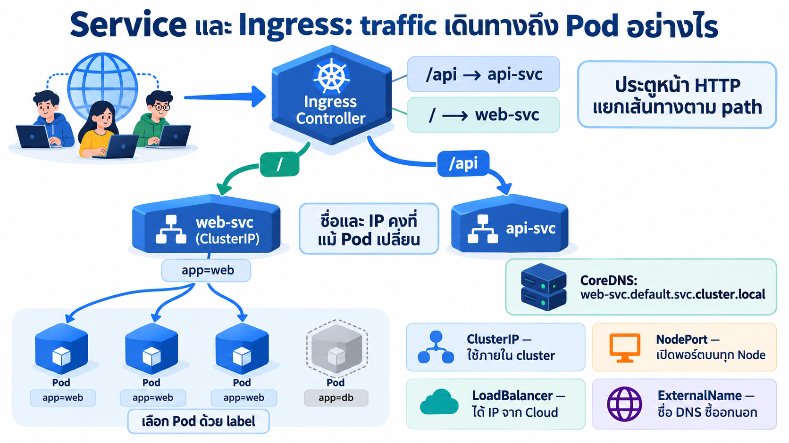<br>
  <em><b>รูปที่ 23</b> เส้นทางของทราฟฟิกผ่าน Ingress และ Service ไปยัง Pod</em>
</p>

### 11.1 Service

เนื่องจาก Pod มีลักษณะชั่วคราวและหมายเลข IP เปลี่ยนแปลงทุกครั้งที่ถูกสร้างใหม่ Kubernetes จึงจัดให้มีทรัพยากรประเภท **Service** ซึ่งเป็นนามธรรม (abstraction) ที่กำหนดชื่อและหมายเลข IP เสมือนที่คงที่ให้แก่กลุ่มของ Pod โดย Service เลือก Pod ปลายทางด้วย **label selector**

```yaml
apiVersion: v1
kind: Service
metadata:
  name: web-svc
spec:
  type: ClusterIP
  selector:
    app: web          # ส่งทราฟฟิกไปยัง Pod ทุกตัวที่มี label app=web
  ports:
    - port: 80        # พอร์ตของ Service
      targetPort: 80  # พอร์ตของคอนเทนเนอร์
```

**ตารางที่ 14** ประเภทของ Service

| ประเภท | ขอบเขตการเข้าถึง | กรณีการใช้งาน |
|---|---|---|
| **ClusterIP** (ค่าเริ่มต้น) | ภายในคลัสเตอร์เท่านั้น | บริการภายใน เช่น backend และฐานข้อมูล |
| **NodePort** | หมายเลข IP ของ Node ใดก็ได้ ที่พอร์ตช่วง 30000–32767 | การทดสอบ ห้องปฏิบัติการ หรือระบบ bare-metal |
| **LoadBalancer** | หมายเลข IP สาธารณะจาก cloud load balancer | การเปิดบริการสู่ภายนอกบนคลาวด์ |
| **ExternalName** | ไม่มี IP (เป็นระเบียน DNS แบบ CNAME) | การอ้างอิงบริการภายนอกด้วยชื่อภายในคลัสเตอร์ |

### 11.2 CoreDNS

<p align="center" id="fig-24">
  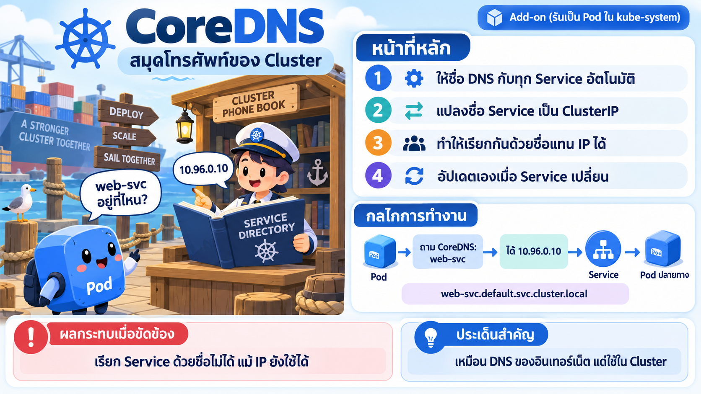<br>
  <em><b>รูปที่ 24</b> CoreDNS: ระบบแปลงชื่อ Service เป็นหมายเลข IP ภายในคลัสเตอร์</em>
</p>

**CoreDNS** เป็นส่วนเสริม (add-on) ที่ทำงานในรูปของ Pod ภายใน namespace `kube-system` ทำหน้าที่เป็นระบบ DNS ภายในคลัสเตอร์ CoreDNS กำหนดชื่อ DNS ให้แก่ Service ทุกตัวโดยอัตโนมัติตามรูปแบบ

```
<service>.<namespace>.svc.cluster.local
web-svc.default.svc.cluster.local     # หากอยู่ใน namespace เดียวกัน สามารถอ้างอิงเพียง "web-svc"
```

กลไกนี้ทำให้แอปพลิเคชันอ้างอิงกันด้วยชื่อแทนหมายเลข IP ได้ หาก CoreDNS ขัดข้อง การเรียก Service ด้วยชื่อจะล้มเหลว แม้การเรียกด้วยหมายเลข IP โดยตรงจะยังใช้งานได้

### 11.3 Ingress

การเปิดบริการทุกตัวด้วย Service ประเภท LoadBalancer มีค่าใช้จ่ายสูง Kubernetes จึงจัดให้มีทรัพยากรประเภท **Ingress** ซึ่งกำหนดกฎการกำหนดเส้นทาง HTTP/HTTPS ตามชื่อโฮสต์และ path รวมถึงการจัดการ TLS โดย Ingress ต้องทำงานร่วมกับ **Ingress Controller** เช่น NGINX Ingress Controller หรือ Traefik ทั้งนี้ Kubernetes รุ่นใหม่มี **Gateway API** เป็นทางเลือกที่มีความยืดหยุ่นและแบ่งบทบาทผู้ดูแลได้ชัดเจนกว่า

```yaml
apiVersion: networking.k8s.io/v1
kind: Ingress
metadata:
  name: app-ingress
spec:
  rules:
    - host: app.example.com
      http:
        paths:
          - path: /api
            pathType: Prefix
            backend: { service: { name: api-svc, port: { number: 80 } } }
          - path: /
            pathType: Prefix
            backend: { service: { name: web-svc, port: { number: 80 } } }
```

เส้นทางของคำร้องขอจากภายนอกจึงเป็น ผู้ใช้ → Ingress Controller → Service → (กฎของ kube-proxy) → Pod

---

## 12. ระบบจัดเก็บข้อมูล: Volume, PV, PVC และ StorageClass

<p align="center" id="fig-25">
  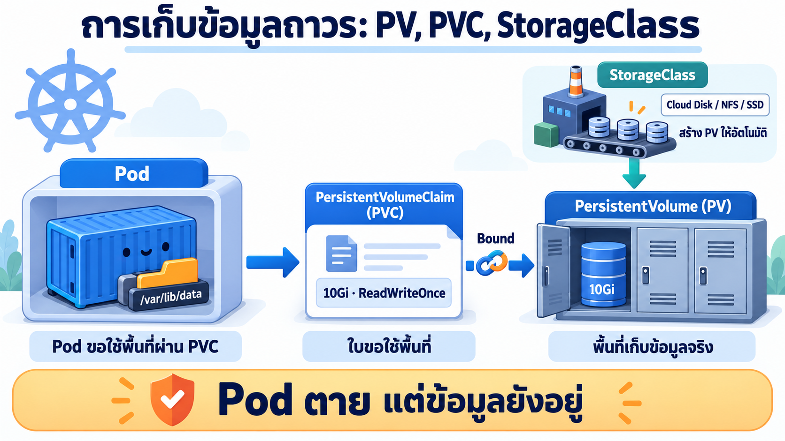<br>
  <em><b>รูปที่ 25</b> ความสัมพันธ์ระหว่าง Pod, PersistentVolumeClaim, PersistentVolume และ StorageClass</em>
</p>

ข้อมูลที่เขียนลงในระบบแฟ้มของคอนเทนเนอร์จะสูญหายเมื่อคอนเทนเนอร์ถูกลบ การจัดเก็บข้อมูลแบบถาวรจึงต้องอาศัยทรัพยากรด้านการจัดเก็บข้อมูลของ Kubernetes ดังตารางที่ 15

**ตารางที่ 15** ทรัพยากรด้านการจัดเก็บข้อมูล

| ทรัพยากร | ผู้สร้าง | ความหมาย |
|---|---|---|
| **Volume** (เช่น `emptyDir`, `hostPath`) | กำหนดใน PodSpec | พื้นที่จัดเก็บที่มีอายุเท่ากับ Pod หรือผูกอยู่กับ Node |
| **PersistentVolume (PV)** | ผู้ดูแลระบบ หรือสร้างโดยอัตโนมัติ | พื้นที่จัดเก็บจริงในคลัสเตอร์ เช่น ดิสก์ NFS หรือดิสก์บนคลาวด์ |
| **PersistentVolumeClaim (PVC)** | ผู้พัฒนา | คำร้องขอพื้นที่จัดเก็บตามขนาดและโหมดการเข้าถึง |
| **StorageClass** | ผู้ดูแลระบบ | แม่แบบสำหรับสร้าง PV โดยอัตโนมัติเมื่อมี PVC (dynamic provisioning) |

```yaml
apiVersion: v1
kind: PersistentVolumeClaim
metadata:
  name: data-pvc
spec:
  accessModes: ["ReadWriteOnce"]
  storageClassName: standard
  resources:
    requests:
      storage: 10Gi
---
# การอ้างอิงใน PodSpec
#   volumes:
#     - name: data
#       persistentVolumeClaim: { claimName: data-pvc }
#   containers:
#     - volumeMounts: [{ name: data, mountPath: /var/lib/data }]
```

โหมดการเข้าถึง (access mode) ได้แก่ `ReadWriteOnce` (RWO) อ่านเขียนได้จาก Node เดียว, `ReadOnlyMany` (ROX) อ่านได้จากหลาย Node, `ReadWriteMany` (RWX) อ่านเขียนได้จากหลาย Node และ `ReadWriteOncePod` อ่านเขียนได้จาก Pod เดียว เมื่อ Pod สิ้นสุดลง ข้อมูลใน PV ยังคงอยู่ และ Pod ใหม่ที่อ้างอิง PVC เดิมจะเข้าถึงข้อมูลเดิมได้

---

## 13. Namespace, ConfigMap, Secret และ RBAC

<p align="center" id="fig-26">
  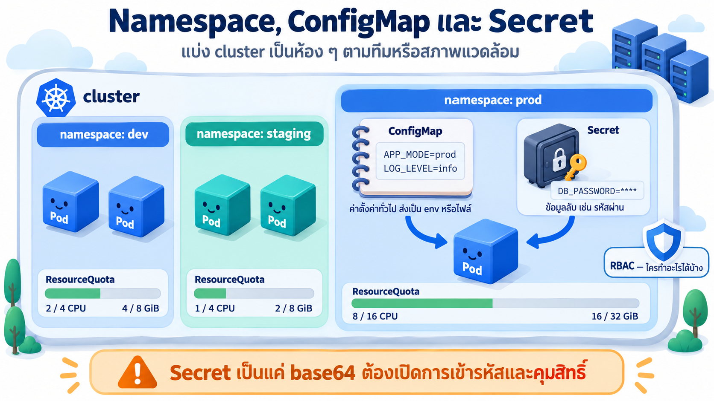<br>
  <em><b>รูปที่ 26</b> การแบ่งคลัสเตอร์ด้วย Namespace และการส่งค่าตั้งค่าด้วย ConfigMap และ Secret</em>
</p>

### 13.1 Namespace

Namespace เป็นกลไกแบ่งคลัสเตอร์หนึ่งออกเป็นหลายขอบเขตเชิงตรรกะ เช่น แบ่งตามสภาพแวดล้อม (`dev`, `staging`, `prod`) หรือตามทีมพัฒนา ชื่อของ object สามารถซ้ำกันได้หากอยู่ต่าง namespace และ namespace สามารถใช้ร่วมกับ **ResourceQuota**, **LimitRange** และ **RBAC** เพื่อจำกัดทรัพยากรและสิทธิ์การเข้าถึง คลัสเตอร์มี namespace เริ่มต้น ได้แก่ `default`, `kube-system`, `kube-public` และ `kube-node-lease`

### 13.2 ConfigMap และ Secret

หลักการ **Twelve-Factor App** แนะนำให้แยกการตั้งค่าออกจากโค้ด [5] Kubernetes สนับสนุนหลักการนี้ด้วย **ConfigMap** สำหรับค่าตั้งค่าทั่วไป และ **Secret** สำหรับข้อมูลลับ ซึ่งส่งเข้าสู่คอนเทนเนอร์ได้ทั้งในรูปตัวแปรสภาพแวดล้อมและไฟล์

```yaml
apiVersion: v1
kind: ConfigMap
metadata: { name: app-config }
data:
  APP_MODE: "prod"
  LOG_LEVEL: "info"
---
apiVersion: v1
kind: Secret
metadata: { name: db-secret }
type: Opaque
stringData:
  DB_PASSWORD: "change-me"     # ระบบจัดเก็บในรูป base64
---
# การอ้างอิงใน container spec
#   envFrom:
#     - configMapRef: { name: app-config }
#     - secretRef:    { name: db-secret }
```

ข้อควรระวังคือ Secret **ไม่ได้ถูกเข้ารหัสโดยปริยาย** เป็นเพียงการเข้ารหัสแบบ base64 ซึ่งถอดกลับได้ทันที ผู้ดูแลระบบจึงควรเปิดใช้การเข้ารหัสข้อมูลขณะจัดเก็บใน etcd จำกัดสิทธิ์การอ่าน Secret ด้วย RBAC และไม่จัดเก็บ Secret ในระบบควบคุมเวอร์ชัน โดยอาจใช้เครื่องมือเสริม เช่น Sealed Secrets, External Secrets Operator หรือ HashiCorp Vault

### 13.3 RBAC

**ตารางที่ 16** ทรัพยากรของ Role-Based Access Control

| ทรัพยากร | ขอบเขต | ความหมาย |
|---|---|---|
| **Role** | ภายใน namespace | ชุดสิทธิ์ เช่น `get` และ `list` บน `pods` |
| **ClusterRole** | ทั้งคลัสเตอร์ | ชุดสิทธิ์ที่ไม่จำกัดเฉพาะ namespace |
| **RoleBinding / ClusterRoleBinding** | ตามประเภท | ผูกชุดสิทธิ์เข้ากับ User, Group หรือ ServiceAccount |

```bash
kubectl auth can-i delete pods -n prod --as=student1   # ตรวจสอบสิทธิ์ของผู้ใช้
```

---

## 14. การฟื้นฟูตนเอง การตรวจสุขภาพ และการปรับขนาดอัตโนมัติ

<p align="center" id="fig-27">
  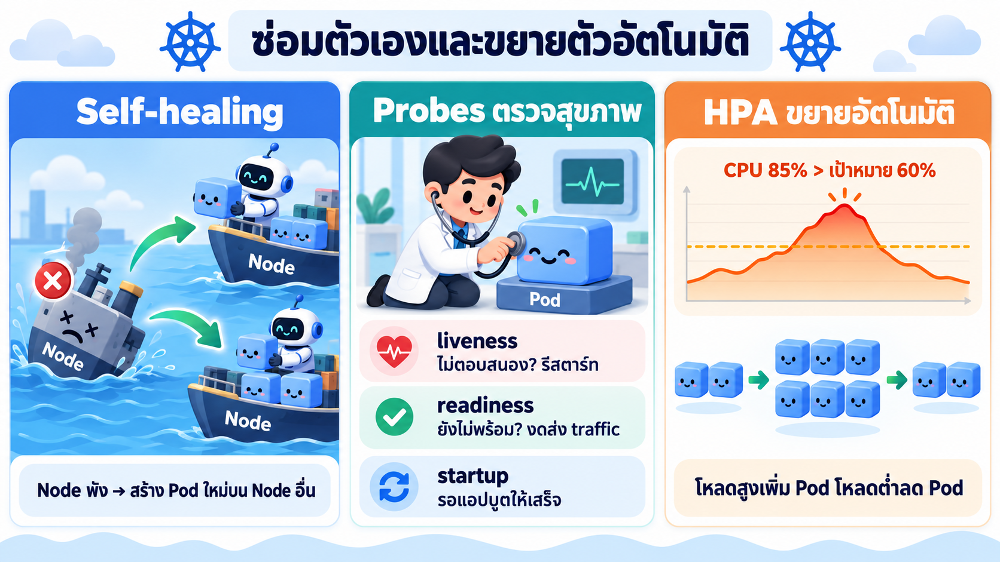<br>
  <em><b>รูปที่ 27</b> กลไกการฟื้นฟูตนเอง การตรวจสุขภาพ และการปรับขนาดอัตโนมัติ</em>
</p>

### 14.1 การฟื้นฟูตนเอง (Self-healing)

**ตารางที่ 17** การตอบสนองของ Kubernetes ต่อความล้มเหลว

| เหตุการณ์ | การตอบสนองของระบบ |
|---|---|
| คอนเทนเนอร์หยุดทำงาน | kubelet เริ่มคอนเทนเนอร์ใหม่ตาม `restartPolicy` โดยเพิ่มระยะหน่วงแบบทวีคูณ (สถานะ `CrashLoopBackOff`) |
| Pod ถูกลบหรือสูญหาย | ReplicaSet controller สร้าง Pod ทดแทน |
| Node ขัดข้อง | Node controller กำหนดสถานะ `NotReady` และ Pod ถูก evict เพื่อสร้างใหม่บน Node อื่น |

### 14.2 การตรวจสุขภาพ (Probes)

**ตารางที่ 18** ประเภทของ probe

| Probe | คำถามที่ตรวจสอบ | การดำเนินการเมื่อไม่ผ่าน |
|---|---|---|
| **livenessProbe** | คอนเทนเนอร์ยังทำงานได้ตามปกติหรือไม่ | เริ่มคอนเทนเนอร์ใหม่ |
| **readinessProbe** | คอนเทนเนอร์พร้อมรับทราฟฟิกหรือไม่ | นำ Pod ออกจาก endpoint ของ Service ชั่วคราว โดยไม่เริ่มใหม่ |
| **startupProbe** | แอปพลิเคชันเริ่มต้นเสร็จสมบูรณ์หรือไม่ | ระงับ liveness และ readiness probe จนกว่าจะผ่าน |

```yaml
readinessProbe:
  httpGet: { path: /healthz, port: 80 }
  initialDelaySeconds: 3
  periodSeconds: 5
livenessProbe:
  httpGet: { path: /healthz, port: 80 }
  periodSeconds: 10
  failureThreshold: 3
```

### 14.3 การปรับขนาดอัตโนมัติ (Auto-scaling)

**ตารางที่ 19** กลไกการปรับขนาดอัตโนมัติ

| กลไก | สิ่งที่ปรับ | ตัวอย่าง |
|---|---|---|
| **Horizontal Pod Autoscaler (HPA)** | จำนวน Pod | เมื่อการใช้ CPU เฉลี่ยเกินร้อยละ 60 ระบบเพิ่ม Pod จาก 2 เป็น 6 ตัว |
| **Vertical Pod Autoscaler (VPA)** | ค่า requests และ limits ของ Pod | ปรับหน่วยความจำที่ร้องขอให้สอดคล้องกับการใช้งานจริง |
| **Cluster Autoscaler / Karpenter** | จำนวน Node | เพิ่มเครื่องเสมือนเมื่อมี Pod ค้างในสถานะ `Pending` เนื่องจากทรัพยากรไม่เพียงพอ |

```bash
kubectl autoscale deployment web --cpu-percent=60 --min=2 --max=6
kubectl get hpa -w
```

การใช้ HPA ต้องติดตั้ง **metrics-server** และ Pod ต้องกำหนดค่า `resources.requests` เนื่องจาก HPA คำนวณร้อยละการใช้ทรัพยากรเทียบกับค่าที่ร้องขอ

---

## 15. Rolling Update และ Rollback

<p align="center" id="fig-28">
  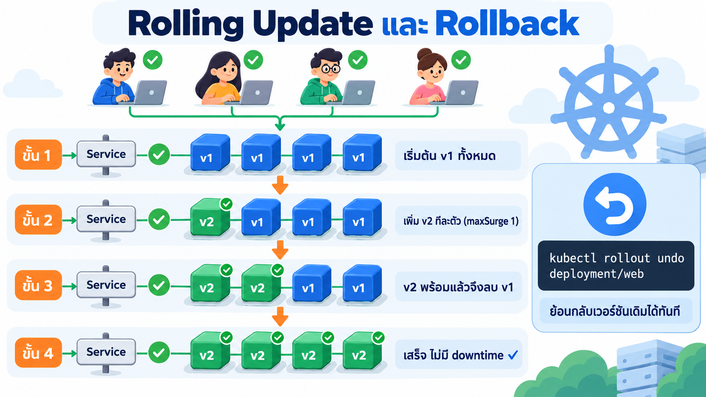<br>
  <em><b>รูปที่ 28</b> การปรับปรุงเวอร์ชันแบบ rolling update และการย้อนกลับเวอร์ชัน</em>
</p>

Deployment ใช้กลยุทธ์ **RollingUpdate** เป็นค่าเริ่มต้น โดยทยอยสร้าง Pod เวอร์ชันใหม่และลบ Pod เวอร์ชันเดิมทีละส่วน เบื้องหลังกลไกนี้คือ Deployment controller สร้าง ReplicaSet ใหม่ แล้วค่อย ๆ เพิ่มจำนวน replicas ของ ReplicaSet ใหม่พร้อมกับลดจำนวน replicas ของ ReplicaSet เดิม

```yaml
spec:
  strategy:
    type: RollingUpdate
    rollingUpdate:
      maxSurge: 1          # จำนวน Pod ที่สร้างเกินค่า replicas ได้สูงสุดระหว่างปรับปรุง
      maxUnavailable: 0    # จำนวน Pod ที่ไม่พร้อมใช้งานได้สูงสุดระหว่างปรับปรุง
```

```bash
kubectl set image deployment/web nginx=nginx:1.28    # ปรับปรุงเวอร์ชันของ image
kubectl rollout status deployment/web                # ติดตามความคืบหน้า
kubectl rollout history deployment/web               # ดูประวัติ revision
kubectl rollout undo deployment/web                  # ย้อนกลับไปยัง revision ก่อนหน้า
kubectl rollout undo deployment/web --to-revision=2  # ย้อนกลับไปยัง revision ที่ระบุ
```

readinessProbe มีบทบาทสำคัญต่อการปรับปรุงเวอร์ชันโดยไม่หยุดให้บริการ หากไม่กำหนด readinessProbe ระบบจะถือว่า Pod ใหม่พร้อมรับทราฟฟิกทันทีที่คอนเทนเนอร์เริ่มทำงาน แม้แอปพลิเคชันยังเริ่มต้นไม่เสร็จสมบูรณ์ ซึ่งอาจทำให้ผู้ใช้ได้รับข้อผิดพลาดระหว่างการปรับปรุง นอกจาก RollingUpdate แล้ว ยังมีกลยุทธ์อื่นที่ใช้ในทางปฏิบัติ ได้แก่ **Recreate** (ลบ Pod ทั้งหมดก่อนสร้างใหม่ ซึ่งทำให้เกิดช่วงหยุดให้บริการ) **Blue/Green** และ **Canary** ซึ่งดำเนินการผ่าน Service, Ingress หรือเครื่องมือเสริม เช่น Argo Rollouts

---

## 16. กรณีศึกษา: Manifest สำหรับเว็บแอปพลิเคชัน

manifest ต่อไปนี้ (`web-app.yaml`) บูรณาการแนวคิดจากหัวข้อก่อนหน้า ประกอบด้วย Namespace, ConfigMap, Deployment ที่กำหนดจำนวน replicas, probe และทรัพยากร และ Service ประเภท NodePort

```yaml
apiVersion: v1
kind: Namespace
metadata:
  name: demo
---
apiVersion: v1
kind: ConfigMap
metadata:
  name: web-config
  namespace: demo
data:
  index.html: |
    <h1>Hello from Kubernetes!</h1>
---
apiVersion: apps/v1
kind: Deployment
metadata:
  name: web
  namespace: demo
  labels: { app: web }
spec:
  replicas: 3
  selector:
    matchLabels: { app: web }          # ต้องสอดคล้องกับ label ใน Pod template
  strategy:
    type: RollingUpdate
    rollingUpdate: { maxSurge: 1, maxUnavailable: 0 }
  template:
    metadata:
      labels: { app: web }
    spec:
      containers:
        - name: nginx
          image: nginx:1.27
          ports:
            - containerPort: 80
          resources:
            requests: { cpu: "50m",  memory: "64Mi" }
            limits:   { cpu: "250m", memory: "128Mi" }
          readinessProbe:
            httpGet: { path: /, port: 80 }
            periodSeconds: 5
          livenessProbe:
            httpGet: { path: /, port: 80 }
            periodSeconds: 10
          volumeMounts:
            - name: html
              mountPath: /usr/share/nginx/html
      volumes:
        - name: html
          configMap: { name: web-config }
---
apiVersion: v1
kind: Service
metadata:
  name: web-svc
  namespace: demo
spec:
  type: NodePort
  selector: { app: web }
  ports:
    - port: 80
      targetPort: 80
      nodePort: 30080
```

### 16.1 เครื่องมือสำหรับสร้างคลัสเตอร์ทดลอง

**ตารางที่ 20** เครื่องมือสร้างคลัสเตอร์สำหรับการเรียนรู้

| เครื่องมือ | ลักษณะ |
|---|---|
| **kind** (Kubernetes IN Docker) | จำลอง Node แต่ละเครื่องเป็น Docker container เริ่มต้นได้รวดเร็ว เหมาะกับห้องปฏิบัติการและ CI |
| **minikube** | คลัสเตอร์ Node เดียวพร้อมส่วนเสริม เช่น dashboard, ingress และ metrics-server |
| **k3d / k3s** | Kubernetes รุ่นน้ำหนักเบาที่พัฒนาโดย Rancher |
| **Docker Desktop** | เปิดใช้งาน Kubernetes ได้จากหน้าการตั้งค่า |

### 16.2 ขั้นตอนการทดลอง

```bash
# สร้างคลัสเตอร์ด้วย kind
kind create cluster --name lab
kubectl cluster-info
kubectl get nodes -o wide

# ติดตั้งแอปพลิเคชัน
kubectl apply -f web-app.yaml
kubectl get all -n demo
kubectl -n demo port-forward svc/web-svc 8080:80     # จากนั้นเปิด http://localhost:8080

# ทดสอบการฟื้นฟูตนเอง
kubectl -n demo delete pod -l app=web --wait=false
kubectl -n demo get pods -w

# ทดสอบการปรับขนาด
kubectl -n demo scale deployment web --replicas=5

# ลบทรัพยากรและคลัสเตอร์
kubectl delete -f web-app.yaml
kind delete cluster --name lab
```

---

## 17. คำสั่ง `kubectl` ที่ใช้บ่อยและแนวทางวินิจฉัยปัญหา

รูปแบบทั่วไปของคำสั่งคือ `kubectl <verb> <resource> [name] [-n namespace] [flags]`

**ตารางที่ 21** คำสั่ง `kubectl` ที่ใช้บ่อย

| หมวด | คำสั่ง | ความหมาย |
|---|---|---|
| ข้อมูลคลัสเตอร์ | `kubectl cluster-info` · `kubectl get nodes -o wide` | แสดงข้อมูล kube-apiserver และ Node |
| แสดงทรัพยากร | `kubectl get pods,svc,deploy -A` | แสดงทรัพยากรในทุก namespace |
| รายละเอียด | `kubectl describe pod <name>` | แสดงรายละเอียดและเหตุการณ์ เช่น สาเหตุของสถานะ Pending |
| สร้างหรือปรับปรุง | `kubectl apply -f file.yaml` | จัดการทรัพยากรแบบ declarative |
| ลบ | `kubectl delete -f file.yaml` | ลบทรัพยากรตามไฟล์ |
| ล็อก | `kubectl logs <pod> [-c container] [-f] [--previous]` | แสดงล็อก (`--previous` สำหรับคอนเทนเนอร์ที่หยุดทำงานไปแล้ว) |
| เข้าสู่คอนเทนเนอร์ | `kubectl exec -it <pod> -- sh` | เปิด shell ภายในคอนเทนเนอร์ |
| วินิจฉัยชั่วคราว | `kubectl debug -it <pod> --image=busybox` | แนบคอนเทนเนอร์สำหรับวินิจฉัยปัญหา |
| ส่งต่อพอร์ต | `kubectl port-forward svc/<svc> 8080:80` | ทดสอบบริการจากเครื่องของผู้ใช้ |
| ปรับขนาด | `kubectl scale deploy <name> --replicas=5` | ปรับจำนวน Pod |
| ปรับปรุงเวอร์ชัน | `kubectl rollout status/history/undo deploy/<name>` | บริหารการปรับปรุงเวอร์ชัน |
| เหตุการณ์ | `kubectl get events --sort-by=.metadata.creationTimestamp` | แสดงเหตุการณ์ตามลำดับเวลา |
| การใช้ทรัพยากร | `kubectl top pods` · `kubectl top nodes` | ต้องติดตั้ง metrics-server |
| เอกสารประกอบ | `kubectl explain deployment.spec.strategy` | แสดงคำอธิบายของ field |
| สร้างแม่แบบ YAML | `kubectl create deploy web --image=nginx --dry-run=client -o yaml` | สร้าง manifest ต้นแบบ |
| บริบท | `kubectl config get-contexts` · `kubectl config use-context <ctx>` | สลับคลัสเตอร์ที่ใช้งาน |

**ตารางที่ 22** แนวทางวินิจฉัยสถานะผิดปกติที่พบบ่อย

| สถานะ | สาเหตุที่พบบ่อย | แนวทางตรวจสอบ |
|---|---|---|
| `Pending` | ไม่มี Node ที่มีทรัพยากรเพียงพอ, PVC ยังไม่ถูก bind, ติด taint | `kubectl describe pod` ในส่วน Events |
| `ImagePullBackOff` / `ErrImagePull` | ชื่อหรือ tag ของ image ไม่ถูกต้อง, registry ต้องการการยืนยันตัวตน | `kubectl describe pod` และตรวจสอบ `imagePullSecrets` |
| `CrashLoopBackOff` | แอปพลิเคชันสิ้นสุดการทำงานทันที, การตั้งค่าไม่ถูกต้อง, livenessProbe เข้มงวดเกินไป | `kubectl logs <pod> --previous` |
| `Running` แต่เข้าถึงไม่ได้ | selector ของ Service ไม่ตรงกับ label, readinessProbe ไม่ผ่าน | `kubectl get endpointslices` และ `kubectl get pods --show-labels` |
| `OOMKilled` | ใช้หน่วยความจำเกินค่า `limits.memory` | `kubectl describe pod` ในส่วน Last State |

---

## 18. การเปรียบเทียบ Docker Compose กับ Kubernetes

**ตารางที่ 23** การเปรียบเทียบ Docker Compose กับ Kubernetes

| ประเด็น | Docker Compose | Kubernetes |
|---|---|---|
| ขอบเขต | เครื่องเดียว | หลายเครื่อง (คลัสเตอร์) |
| หน่วยพื้นฐาน | service และคอนเทนเนอร์ | Pod |
| การปรับขนาด | `--scale web=3` บนเครื่องเดียว | ค่า `replicas` และ HPA ข้ามหลาย Node |
| การฟื้นฟูตนเอง | `restart: always` ระดับคอนเทนเนอร์ | เริ่มใหม่ระดับคอนเทนเนอร์และจัดวางใหม่ข้าม Node |
| Service discovery | ชื่อ service ภายในเครือข่าย | Service และ CoreDNS |
| Load balancing | ระดับพื้นฐาน | Service, Ingress และ Gateway API |
| การปรับปรุงเวอร์ชัน | มีข้อจำกัด | rolling update และ rollback ในตัว |
| การตั้งค่าและข้อมูลลับ | ไฟล์ `.env` และ `secrets:` | ConfigMap, Secret และ RBAC |
| ความเหมาะสม | การพัฒนา ห้องปฏิบัติการ และระบบขนาดเล็ก | ระบบใช้งานจริงขนาดใหญ่และองค์กรที่มีหลายทีม |

ในการย้ายระบบจาก Docker Compose สู่ Kubernetes อาจเทียบเคียงได้ดังนี้ `service` หนึ่งรายการเทียบได้กับ Deployment ร่วมกับ Service, `volumes` เทียบได้กับ PVC, `environment` เทียบได้กับ ConfigMap หรือ Secret และ `ports` ที่เปิดสู่ภายนอกเทียบได้กับ Service ประเภท NodePort หรือ Ingress

---

## 19. สรุปและคำถามทบทวน

### 19.1 สรุป

1. **Kubernetes** เป็นระบบจัดการคอนเทนเนอร์ที่บริหารภาระงานข้ามเครื่องแม่ข่ายหลายเครื่องโดยอัตโนมัติ
2. **Control Plane** ประกอบด้วย kube-apiserver, etcd, kube-scheduler, kube-controller-manager และ cloud-controller-manager ทำหน้าที่ตัดสินใจและบริหารสถานะของคลัสเตอร์
3. **Worker Node** ประกอบด้วย kubelet, container runtime, kube-proxy และ CNI plugin ทำหน้าที่รันและเชื่อมต่อ Pod
4. การอ่านและเปลี่ยนข้อมูลสถานะของ Kubernetes ใช้ **kube-apiserver** โดยมี **etcd** เก็บข้อมูล API ส่วน kubelet เรียก container runtime โดยตรง และทราฟฟิกระหว่าง Pod ไม่ต้องผ่าน API server
5. แนวทาง **declarative** ร่วมกับ **reconciliation loop** ทำให้ระบบปรับสถานะจริงให้ตรงกับสถานะที่ต้องการอย่างต่อเนื่อง
6. **Pod** เป็นหน่วยที่เล็กที่สุดและมีลักษณะชั่วคราว จึงบริหารผ่านทรัพยากรระดับสูง เช่น Deployment, StatefulSet, DaemonSet และ Job
7. **Service** ให้ที่อยู่ที่คงที่ **Ingress** ทำหน้าที่เป็นทางเข้า HTTP **PVC** ใช้จัดเก็บข้อมูลถาวร และ **ConfigMap/Secret** ใช้แยกการตั้งค่าออกจาก image

### 19.2 คำถามทบทวน

1. เหตุใดการใช้ Docker เพียงอย่างเดียวจึงไม่เพียงพอสำหรับระบบขนาดใหญ่ จงยกตัวอย่างปัญหาอย่างน้อยสามประการ
2. จงอธิบายหน้าที่และผลกระทบเมื่อขัดข้องขององค์ประกอบทั้งห้าใน Control Plane
3. kube-apiserver และ watch ช่วยให้ scheduler, controller และ kubelet ใช้ข้อมูลสถานะร่วมกันอย่างไร จงยกตัวอย่างการสื่อสารที่ไม่ต้องผ่าน API server
4. เหตุใดคลัสเตอร์ etcd จึงควรมีสมาชิกเป็นจำนวนคี่
5. จงอธิบายลำดับเหตุการณ์ตั้งแต่ผู้ใช้สั่ง `kubectl apply` จนกระทั่ง Pod อยู่ในสถานะ `Running`
6. จงอธิบายความแตกต่างระหว่าง `spec` และ `status` และความสัมพันธ์กับ reconciliation loop
7. จงเลือกทรัพยากรประเภท workload ที่เหมาะสมสำหรับ (ก) REST API (ข) ฐานข้อมูล (ค) ตัวเก็บล็อกบนทุก Node และ (ง) งานสำรองข้อมูลประจำคืน พร้อมให้เหตุผล
8. เหตุใดจึงต้องมี Service ทั้งที่ Pod มีหมายเลข IP อยู่แล้ว และ Service ประเภท ClusterIP, NodePort และ LoadBalancer แตกต่างกันอย่างไร
9. จงอธิบายความสัมพันธ์ระหว่าง PV, PVC และ StorageClass
10. เหตุใด Secret จึงไม่ปลอดภัยโดยปริยาย และควรมีมาตรการเพิ่มเติมอย่างไร
11. จงเปรียบเทียบ livenessProbe, readinessProbe และ startupProbe และอธิบายบทบาทของ readinessProbe ต่อ rolling update

---

## 20. เอกสารอ้างอิง

1. The Kubernetes Authors. *Kubernetes Documentation — Concepts*. https://kubernetes.io/docs/concepts/
2. Verma, A., Pedrosa, L., Korupolu, M., Oppenheimer, D., Tune, E., & Wilkes, J. (2015). Large-scale cluster management at Google with Borg. *Proceedings of the Tenth European Conference on Computer Systems (EuroSys '15)*. ACM.
3. Ongaro, D., & Ousterhout, J. (2014). In Search of an Understandable Consensus Algorithm. *Proceedings of the 2014 USENIX Annual Technical Conference (USENIX ATC '14)*, 305–319.
4. Burns, B., Grant, B., Oppenheimer, D., Brewer, E., & Wilkes, J. (2016). Borg, Omega, and Kubernetes. *ACM Queue*, 14(1), 70–93.
5. Wiggins, A. *The Twelve-Factor App*. https://12factor.net/
6. The Kubernetes Authors. *Kubernetes Components*. https://kubernetes.io/docs/concepts/overview/components/
7. kind — Kubernetes IN Docker. https://kind.sigs.k8s.io/ · minikube. https://minikube.sigs.k8s.io/
8. The Kubernetes Authors. *Communication between Nodes and the Control Plane*. https://kubernetes.io/docs/concepts/architecture/control-plane-node-communication/
9. The Kubernetes Authors. *Kubernetes API Concepts*. https://kubernetes.io/docs/reference/using-api/api-concepts/

---

> **หมายเหตุเกี่ยวกับภาพประกอบ:** ภาพประกอบที่ใช้ในเอกสารนี้มี 28 ภาพ โดยไฟล์ภาพเดิมทั้ง 29 ภาพยังอยู่ในโฟลเดอร์ [`images/`](images/) สร้างขึ้นด้วยปัญญาประดิษฐ์สำหรับการสร้างภาพ (Codex CLI บัญชี `cyolo1`, แบบจำลอง `gpt-6-astra`) เพื่อใช้ประกอบการเรียนการสอน ภาพใช้อุปมาเชิงเปรียบเทียบเพื่อช่วยความเข้าใจ ผู้เรียนควรใช้เนื้อหาในเอกสารนี้และเอกสารอ้างอิงเป็นหลักในการศึกษา
